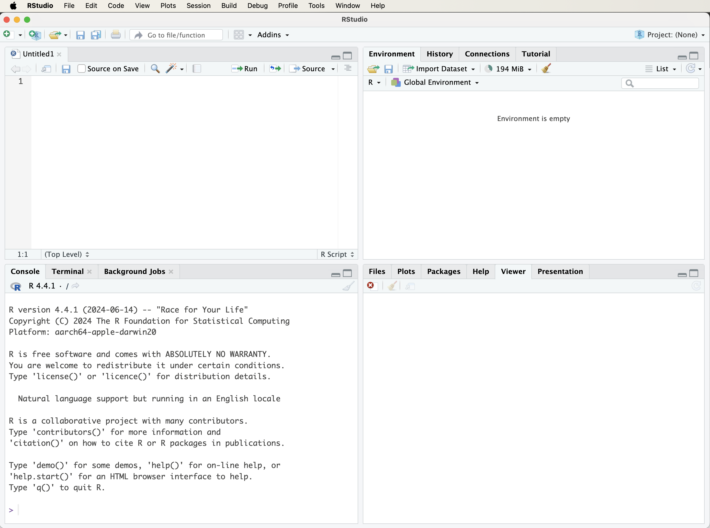
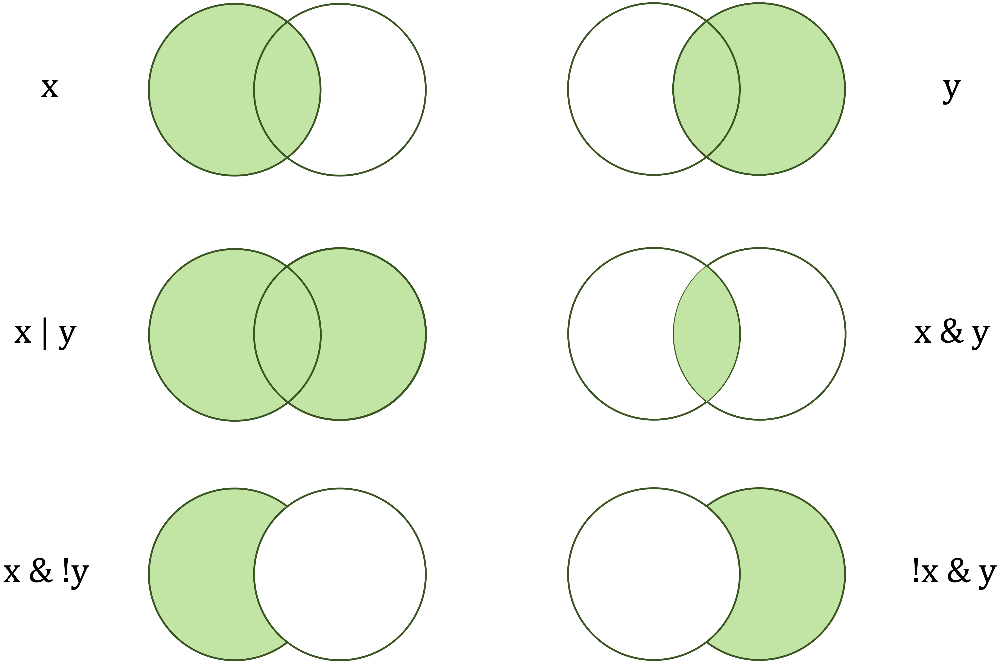
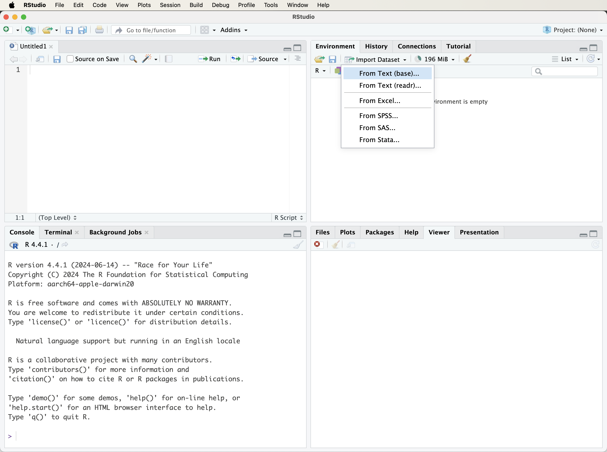
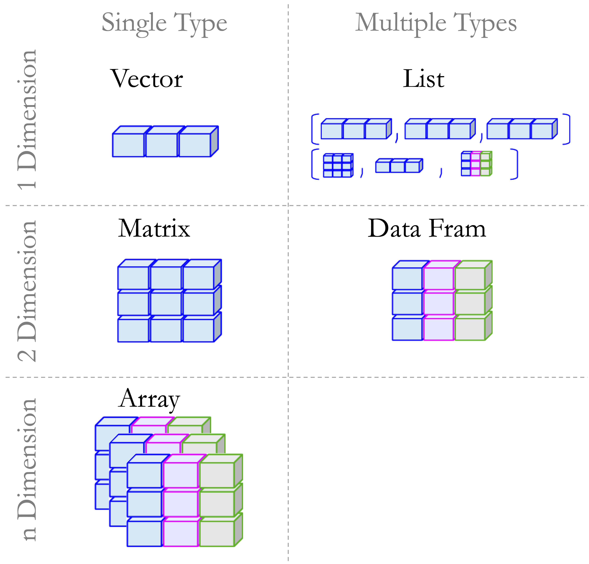
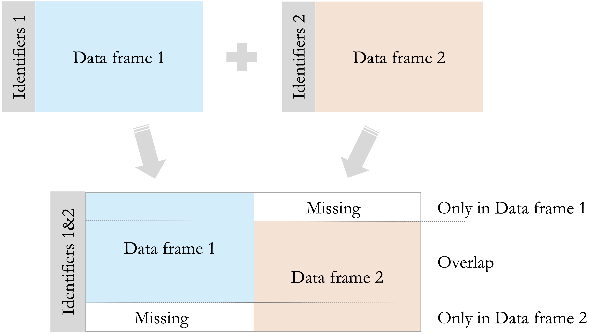
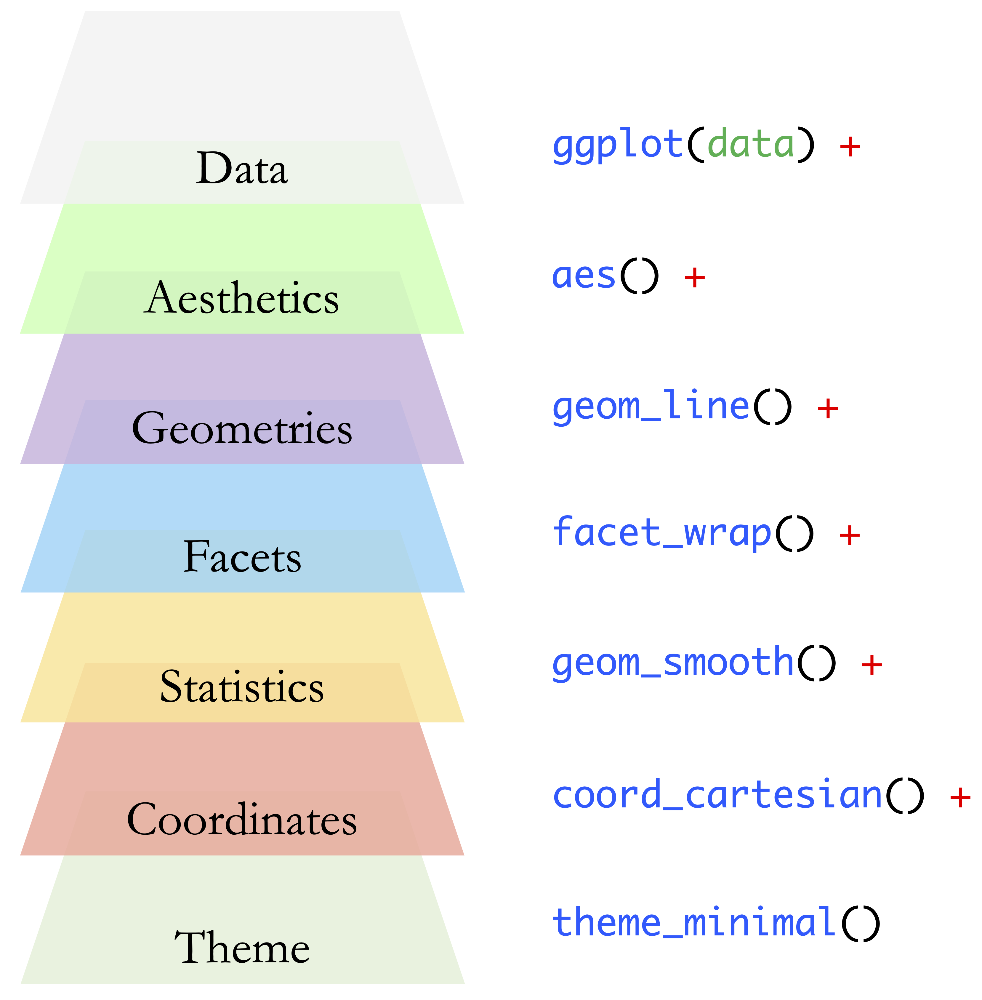
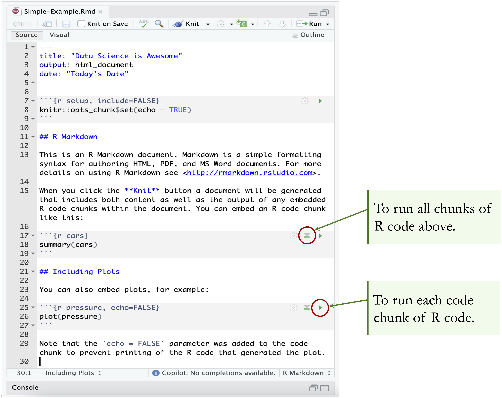

```{r echo=FALSE, message=FALSE, warning=FALSE}
source("_common.R")

inline <- function(x = "") paste0("`` `r ", x, "` ``")
```

# R Foundations for Data Science {#sec-ch1-intro-R}

::: {.content-visible when-format="pdf"}
\begin{chapterquote}
What we have to learn to do, we learn by doing.

\hfill — Aristotle
\end{chapterquote}
:::

::::: {.content-visible when-format="html"}
:::: chapterquote
What we have to learn to do, we learn by doing.

::: author
— Aristotle
:::
::::
:::::

Recommendation systems, fraud detection algorithms, public health dashboards, and modern machine learning applications all depend on the same basic capacity: the ability to work systematically with data. Programming languages make this possible by allowing analysts to import, inspect, transform, visualize, and model data in a reproducible way. For this reason, learning a programming language is not merely a technical requirement in data science. It is part of learning how to reason with data, document analytical choices, and translate results into evidence-based conclusions.

This book uses R as the main programming environment because R was developed specifically for statistical computing and data analysis. Its syntax and core functions support common analytical activities such as summarizing data, comparing groups, fitting models, visualizing patterns, and examining uncertainty. R is also supported by a large ecosystem of packages for visualization, modeling, and reproducible reporting. For example, packages such as **ggplot2** support clear graphical communication, while R Markdown allows code, results, figures, tables, and explanatory text to be combined in a single document. Python is also widely used in data science, particularly in software development and deep learning, and readers who prefer Python may consult the companion volume *Data Science Foundations and Machine Learning with Python: From Data to Decisions*.

The aim of this chapter is to provide the practical R foundations needed for the rest of the book. Readers will learn how to install R and RStudio, become familiar with the RStudio environment, write and run basic R code, work with common data types and structures, load datasets, and create simple visualizations. No previous programming experience is assumed. The chapter introduces these skills through small, concrete examples and then applies them to real data. For instance, we use customer data to show how R can be used to inspect variables, summarize observations, and visualize patterns such as differences between customers who remain with a company and those who churn.

These foundations support every stage of the Data Science Workflow used throughout this book. Later chapters examine this workflow in detail, moving from Problem Understanding and Data Preparation to Exploratory Data Analysis, Data Setup for Modeling, Modeling, Evaluation, and Deployment. This chapter prepares readers for that workflow by introducing the tools needed to begin working with data in R. Readers who are already comfortable with R and RStudio may skim this chapter or proceed directly to Chapter [-@sec-ch2-intro-data-science], where the workflow is introduced formally (see Figure [-@fig-ch2_DSW]).

### What This Chapter Covers {.unnumbered .unlisted}

This chapter introduces the practical R skills needed to follow the examples, case studies, and exercises in the rest of the book. It is written for readers with little or no prior programming experience, while also serving as a reference for readers who wish to revisit specific tools or concepts later.

By the end of the chapter, readers will be able to install and use R and RStudio, create and inspect R objects, distinguish common data types and data structures, and install and load R packages. They will also learn to load datasets from R packages and external files, explore data using standard R functions, create simple visualizations with **ggplot2**, and prepare a basic reproducible report using R Markdown. These skills provide the technical foundation for the Data Science Workflow introduced in Chapter [-@sec-ch2-intro-data-science] and used throughout the book.

### Learning R Through Practice {.unnumbered .unlisted}

Learning R is best approached as a gradual process. Readers who are new to programming do not need to master every detail before beginning to work with data. Progress comes from repeated practice: running small pieces of code, inspecting the output, modifying examples, and applying the same ideas to new datasets. Errors and unexpected results are a normal part of this process, since they often reveal how R functions interpret objects, arguments, and data types.

Additional resources can support this learning process. *R for Data Science* [-@wickham2017r] provides a widely used introduction to practical data workflows, while *Hands-On Programming with R* [-@grolemund2014] is especially useful for readers who are new to programming. These resources complement the structured path followed in this book. Figure [-@fig-ch1-tiny-gains], created entirely in R, illustrates how small, repeated improvements can accumulate over time. It also provides an early example of how code can be used not only for calculation, but also for communicating patterns visually.

```{r fig-ch1-tiny-gains, echo = FALSE, out.width = '90%'}
#| fig-width: 7
#| fig-height: 3.5
#| fig-cap: "Incremental growth through repeated practice. The figure illustrates how small changes can accumulate over time and was created entirely in R."

x = 0:365
df = data.frame(
  x = rep(x, 3),
  y = c((1.01)^x, rep(1, length(x)), (0.99)^x),
  function_label = factor(
    rep(c("y = (1.01)^x", "y = 1", "y = (0.99)^x"), each = length(x)),
    levels = c("y = (1.01)^x", "y = 1", "y = (0.99)^x")
  )
)

ggplot(df, aes(x = x, y = y, color = function_label, linetype = function_label)) +
  geom_line(
    linewidth = 0.8,
    lineend = "round",
    arrow = arrow(length = unit(0.18, "cm"), type = "closed", ends = "last")
  ) +
  scale_color_manual(values = c(
    "y = (1.01)^x" = "#4E9F3D",
    "y = 1"        = "#6C8CD9",
    "y = (0.99)^x" = "#D55E00"
  )) +
  scale_linetype_manual(values = c(
    "y = (1.01)^x" = "solid",
    "y = 1"        = "dashed",
    "y = (0.99)^x" = "dotdash"
  )) +
  annotate("text", x = 210, y = 27, label = "1% Better Every Day", color = "#4E9F3D", size = 5) +
  annotate("text", x = 295, y = 3, label = "Static", color = "#6C8CD9", size = 5) +
  labs(
    title = "Incremental Growth Through Practice",
    x = "Days",
    y = "Relative change",
    color = "Function",
    linetype = "Function"
  ) +
  guides(
    color = guide_legend(override.aes = list(linewidth = 1.5)),
    linetype = guide_legend(override.aes = list(linewidth = 1.5))
  ) +
  scale_x_continuous(expand = expansion(mult = c(0, 0.02))) +
  theme_minimal(base_size = 12) +
  theme(
    legend.position = "right",
    plot.title = element_text(size = 14, face = "bold", hjust = 0.5)
  )
```

With this perspective in mind, we now turn to the practical task of setting up the working environment. We begin by installing R and RStudio, which provide the main tools for writing, executing, and documenting R code throughout the book.

## Setting Up R

Before working with R, it must first be installed on your computer. R is freely available through the Comprehensive R Archive Network (CRAN), which serves as the official repository for R software and contributed packages. To install R, visit <https://cran.r-project.org>, select your operating system (Windows, macOS, or Linux), and follow the instructions provided for your system.

Once installed, R can be used directly through its built-in console. The console allows commands to be entered and evaluated immediately, which is useful for simple experimentation. However, as analyses become more structured, it is more convenient to work in an integrated development environment that supports writing, saving, organizing, and reusing code. In this book, we use RStudio for this purpose.

R is actively maintained, and new versions are released periodically. Updating R occasionally is useful because it provides access to recent language features, performance improvements, and compatibility updates for contributed packages. Beginners do not need to update R constantly. If the installed version works well for the examples in this book, it is reasonable to continue using it.

When upgrading to a new major version of R, previously installed packages may need to be reinstalled. More advanced tools for managing project-specific environments and package libraries are available, but they are not needed at this stage. For now, it is sufficient to install R from CRAN and then install the packages introduced throughout the chapter and later sections of the book.

With R installed, the next step is to set up an environment that supports efficient and structured interaction with the language. The following section introduces RStudio as the primary interface for writing, running, and documenting R code throughout this book.

## Setting Up Your RStudio Environment

After installing R, it is useful to work within an environment that supports structured data analysis. RStudio, developed by Posit, is a free integrated development environment (IDE) designed for working with R. It provides a unified interface for writing and executing code, managing objects and packages, producing graphical output, accessing help files, and creating reproducible reports.

RStudio does not include the R language itself. It is an interface for working with R, so R must be installed on your system before RStudio can be used. To install RStudio, visit <https://posit.co/download/rstudio-desktop>, select the free version of RStudio Desktop for your operating system, and follow the installation instructions. Once installation is complete, RStudio can be launched and used as the main working environment throughout this book.

### The RStudio Interface {.unnumbered .unlisted}

When RStudio is launched, the interface will resemble the layout shown in Figure [-@fig-RStudio-window-1]. The exact appearance may vary slightly across operating systems and software versions, but the main structure is generally the same. RStudio is organized into panels that support the main tasks involved in data analysis: writing code, running commands, inspecting objects, viewing plots, managing files, and accessing documentation.

```{r fig-RStudio-window-1, echo = FALSE, out.width = '85%'}
#| fig-cap: "The RStudio interface, showing the main panels used for writing code, running commands, inspecting objects, viewing plots, and accessing help."


```

In some cases, only three panels may be visible when RStudio first opens. This usually occurs when no script file is open. Opening a new R script adds the script editor panel, where code can be written, saved, edited, and reused. Although the console is useful for trying short commands, scripts are more appropriate for analyses that need to be reproduced, modified, or shared.

The main panels of the RStudio interface are the script editor, the console, the environment and history panel, and the files, plots, packages, and help panel. The script editor is used to write and save R code. The console executes commands and displays their output immediately. The environment panel shows objects currently stored in memory, while the history tab records previously executed commands. The files, plots, packages, and help panel supports navigation through project files, displays graphical output, manages packages, and provides access to documentation.

### Working Comfortably in RStudio {.unnumbered .unlisted}

RStudio can be customized to make the working environment easier to read and use. For example, users may adjust the editor theme, font size, pane layout, and other appearance settings through the global options menu, which can be accessed via *Tools \> Global Options*. These changes do not affect how R code is executed, but they can make longer coding sessions more comfortable and reduce visual clutter.

At this stage, extensive customization is not necessary. The most important habit is to distinguish between quick experimentation in the console and reproducible work in scripts. As the examples in this book become more detailed, scripts will provide a reliable way to organize code, rerun analyses, and document the steps taken during a project. With R and RStudio installed, we can now turn to strategies for obtaining help and continuing to develop proficiency in R.

## Installing and Loading R Packages {#sec-install-packages}

Packages extend the core functionality of R. They provide functions, datasets, documentation, and examples for specific analytical tasks such as visualization, data wrangling, statistical modeling, and machine learning. Many examples in this book rely on contributed packages, including **liver**, which provides datasets and utility functions used throughout the book, and **ggplot2**, which is used for data visualization.

Installing and loading a package are different steps. A package only needs to be installed once on a given computer. One convenient way to install packages is through the RStudio interface. Open the *Tools* menu and select *Install Packages...*. In the dialog box, enter the name of the package, or multiple package names separated by commas, ensure that dependencies are included, and start the installation process. The same installation dialog can also be accessed from the *Packages* tab by clicking *Install*.

A more reproducible approach is to install packages directly from the R console using the `install.packages()` function. For example, the following command installs the **liver** package from the Comprehensive R Archive Network (CRAN):

```{r eval=FALSE}
install.packages("liver")
```

When this command is executed, R downloads the package and installs it on the local system. During the first installation, R may ask the user to select a CRAN mirror. In most cases, choosing a geographically close mirror is sufficient. Package installation may fail if there is no internet connection, if access to CRAN is restricted, or if the package name has been misspelled.

> *Practice:* Install the **liver** and **ggplot2** packages on your system, either through the RStudio interface or by using `install.packages()`.

After a package has been installed, it must be loaded into each new R session before its functions or datasets can be used. This is done with the `library()` function. For example, to load **liver**, use:

```{r message=FALSE}
library(liver)
```

If R returns an error such as `"there is no package called 'liver'"`, the package has not been installed successfully or is not available in the current library path. In that case, run `install.packages("liver")` again, or reinstall the package through the RStudio interface, and check whether the installation completes without error. Once a package is loaded, its functions and datasets become available in the current R session.

Occasionally, two packages may contain functions with the same name. To avoid ambiguity, the `::` operator can be used to call a function from a specific package without relying on which package was loaded most recently. For example, the `partition()` function from the **liver** package can be called explicitly as follows:

```{r eval=FALSE}
liver::partition()
```

This notation makes package dependencies clearer and can improve reproducibility in larger analyses. For most examples in this chapter, however, it is sufficient to install the required package once and load it at the beginning of each R session using `library()`.


## Running Your First R Code

One of the defining features of R is its interactive nature: expressions are evaluated immediately, and results are returned as soon as code is executed. This interactivity supports experimentation, allowing readers to explore ideas, test small changes, and build intuition through direct feedback. As a simple example, suppose you have made three online purchases and want to compute the total cost. In R, this can be written as a basic arithmetic calculation:

```{r}
2 + 37 + 61
```

When this expression is evaluated, R performs the calculation and returns the result. Similar expressions can be used for subtraction, multiplication, division, and exponentiation. Modifying the numbers provides a simple way to observe how different operations behave.

Results can also be stored for later use by assigning them to an object. For example:

```{r}
total = 2 + 37 + 61
```

This statement assigns the value of the expression on the right-hand side to the object named `total`. More formally, assignment binds a value to a name in R’s environment, allowing it to be referenced in later computations. R also supports the `<-` assignment operator, which is widely used in existing R code and documentation. In this book, however, we generally use `=` for assignment to maintain consistency and to align with conventions familiar from many other programming languages.

> *Note:* Object names in R must follow certain rules. They cannot contain spaces or special characters used as operators, and they should usually begin with a letter. For example, `total value` and `total-value` are not valid object names, whereas `total_value` is valid. Object names are case-sensitive, so `total` and `Total` refer to different objects. It is also good practice to avoid names that are already used by R functions or packages, such as `mean`, `data`, or `plot`, because this can lead to confusion. Clear, descriptive names with underscores improve readability and help prevent errors.

Once a value has been assigned, it can be reused in later expressions. For instance, to include a tax rate of 21%, the following expression can be evaluated:

```{r}
total * 1.21
```

In this case, R replaces `total` with its stored value and then evaluates the resulting expression.

> *Practice:* What is the standard sales tax or VAT rate in your country? Replace `1.21` with the appropriate multiplier, such as `1.07` for a 7% tax rate, and evaluate the expression again. You may also assign the rate to an object, such as `tax_rate = 1.21`, to make the calculation more readable.

As analyses grow beyond a few lines of code, readability becomes increasingly important. One way to improve clarity is by adding comments that explain the purpose of individual steps.

### Using Comments to Explain Your Code {.unnumbered .unlisted}

Comments help document what code is doing and why particular steps are taken. In R, comments begin with the `#` symbol. Everything after `#` on the same line is ignored when the code runs. Comments do not affect execution, but they make code easier to understand, modify, and share.

```{r}
# Define prices of three items
prices = c(2, 37, 61)

# Calculate the total cost
total = sum(prices)

# Apply a 21% tax
total * 1.21
```

Clear comments are especially useful in data science projects, where analyses often involve multiple steps, assumptions, and intermediate objects. They help turn code into a readable record of the analysis rather than a sequence of isolated commands.

### How Functions Work in R {.unnumbered .unlisted}

Functions are central to working with R. They allow common tasks to be expressed concisely, whether calculating a summary statistic, transforming a dataset, or creating a plot. A function typically takes one or more *arguments*, performs a task, and returns an output.

For example, the `c()` function, short for “combine,” creates a vector by combining individual values:

```{r}
prices = c(2, 37, 61)
```

Once this vector has been created, another function can be used to compute a summary. For example, the `mean()` function calculates the average value:

```{r}
mean(prices)
```

The general structure of a function call in R is:

```{r eval=FALSE}
function_name(argument1, argument2, ...)
```

Some functions require specific arguments, while others have optional arguments with default values. The examples in this chapter introduce only a small number of functions, but the same structure appears throughout R. The next section explains how to use R’s built-in documentation when a function or argument is unfamiliar.

## Getting Help and Learning More

As readers begin working with R, questions, errors, and unexpected output are a normal part of the learning process. Reliable troubleshooting starts with understanding what a function is designed to do, what arguments it expects, and what type of output it returns. For this reason, R’s built-in documentation should usually be the first point of reference when working with an unfamiliar function.

The simplest way to open a help page is to type a question mark followed by the function name. The `help()` function provides the same information, while `example()` runs examples from the official documentation. For instance, the following commands can be used to inspect the documentation and examples for the `mean()` function:

```{r eval=FALSE}
?mean
help(mean)
example(mean)
```

Help pages typically describe the purpose of a function, its arguments, returned values, and example usage. Many packages also include vignettes, which are longer documents that explain how package functions can be used together in realistic workflows. These resources are especially useful when learning packages that appear repeatedly in this book, such as **ggplot2** and **liver**.

External resources can also be useful when documentation alone is not enough. Community platforms such as Stack Overflow and the Posit Community often contain discussions of common errors, package behavior, and practical coding problems. AI-based assistants can provide additional support by explaining error messages, suggesting alternative syntax, or generating small illustrative examples. However, such output should be treated as a starting point rather than as a substitute for understanding. Suggested code should be checked against the documentation, the structure of the data, and the intended analysis, since code can run without error while still producing inappropriate or misleading results.

When asking for help, readers should describe the problem clearly and provide a small reproducible example whenever possible. This means including the relevant code, the error message or unexpected output, and enough information about the data structure for others to understand the issue. Developing this habit supports independent troubleshooting, improves the quality of feedback received, and strengthens the reproducibility of the analysis as examples in the book become more involved.

## Common Operators in R

Operators determine how values are combined, compared, and evaluated in R expressions. They appear throughout data analysis, from simple arithmetic to filtering observations and defining logical conditions.

Arithmetic operators perform numerical calculations. The most common examples are `+`, `-`, `*`, `/`, and `^`, which represent addition, subtraction, multiplication, division, and exponentiation:

```{r}
x = 2
y = 3

x + y     # addition

x / y     # division

x^y       # exponentiation
```

Relational operators compare values and return logical results, either `TRUE` or `FALSE`. These operators are especially important when defining conditions:

```{r}
x == y    # is x equal to y?

x != y    # is x not equal to y?

x > y     # is x greater than y?
```

Logical operators combine or invert logical values. The operators `&`, `|`, and `!` represent logical AND, OR, and NOT. They are useful when more than one condition must be evaluated at the same time:

```{r}
x > 5 & y < 5   # both conditions must be TRUE

x > 5 | y < 5   # at least one condition must be TRUE

!(x == y)       # negation
```

Figure [-@fig-logic-operators] illustrates how logical operators combine conditions. This visual representation is useful when interpreting expressions that involve several criteria, such as filtering rows in a dataset.

```{r fig-logic-operators, echo = FALSE, out.width = '60%'}
#| fig-cap: "Boolean operators. The left-hand circle (`x`) and the right-hand circle (`y`) represent logical operands. The shaded areas indicate which values are returned as TRUE by each operator."


```

Table [-@tbl-common-operators] summarizes commonly used operators in R. It is intended as a reference rather than material to memorize. Some operators, such as those for indexing, formulas, and model specification, are introduced later when they become relevant.

:::: {.content-visible when-format="html"}
::: {#tbl-common-operators .table}
| *Category* | *Operator* | *Meaning* |
|:-----------------------|:-----------------------|:-----------------------|
| Arithmetic | `+`, `-`, `*`, `/`, `^` | Addition, subtraction, multiplication, division, exponentiation. |
| Relational | `==`, `!=`, `<`, `>`, `<=`, `>=` | Comparison, such as equal to, not equal to, less than, or greater than. |
| Logical | `&`, `|`, `!` | Logical AND, OR, NOT. |
| Assignment | `=`, `<-`, `->` | Assign values to objects. |
| Membership | `%in%` | Tests whether an element belongs to a vector. |
| Sequence | `:` | Generates sequences of numbers. |

Overview of commonly used operators in R, grouped by function and frequently encountered in data analysis.
:::
::::

```{=latex}
\begingroup
\setlength{\LTpre}{6pt}\setlength{\LTpost}{6pt}
\begin{longtable}{p{2.3cm}p{3.3cm}p{6cm}}
\caption{Overview of commonly used operators in R, grouped by function and frequently encountered in data analysis.}
\label{tbl-common-operators}\\
\toprule
\textbf{Category} & \textbf{Operator} & \textbf{Meaning} \\
\midrule
\endfirsthead
\toprule
\textbf{Category} & \textbf{Operator} & \textbf{Meaning} \\
\midrule
\endhead
Arithmetic &
\texttt{+}, \texttt{-}, \texttt{*}, \texttt{/}, \texttt{\^{}} &
Addition, subtraction, multiplication, division, exponentiation \\
Relational &
\texttt{==}, \texttt{!=}, \texttt{<}, \texttt{>}, \texttt{<=}, \texttt{>=} &
Comparison, such as equal to, not equal to, less than, or greater than \\
Logical &
\texttt{\&}, \texttt{\textbar}, \texttt{!} &
Logical AND, OR, NOT \\
Assignment &
\texttt{=}, \texttt{<-}, \texttt{->} &
Assign values to objects \\
Membership &
\texttt{\%in\%} &
Tests whether an element belongs to a vector \\
Sequence &
\texttt{:} &
Generates sequences of numbers \\
\bottomrule
\end{longtable}
\endgroup
```

### A Note on Special Operators {.unnumbered .unlisted}

In addition to the operators summarized in Table [-@tbl-common-operators], R uses a few special operators that often appear in data analysis workflows. The namespace operator `::` specifies the package from which a function should be used. For example, `liver::partition()` calls the `partition()` function from the **liver** package. This notation is useful when different packages contain functions with the same name or when the package dependency should be made explicit.

Pipe operators provide another notation for writing multi-step code. The base R pipe `|>` passes the result of one expression to the next function, allowing a sequence of operations to be read from left to right. Readers may also encounter `%>%`, a pipe operator widely used in packages such as **dplyr**. Pipes are not essential at this stage, but recognizing them will make it easier to read examples, documentation, and online resources. Later chapters use these operators only when they improve readability.

> *Practice:* Define `x = 7` and `y = 5`. Compute `x + y`, `x > y`, and `(x > 1) & (y < 5)`. Then change the values of `x` and `y` and evaluate the expressions again.

## Loading and Importing Data into R {#sec-ch1-import-data}

Before data can be explored, visualized, or modeled in R, it must first be made available in the current R session. Data can enter an analysis in several ways. Some datasets are included in R packages, while others are stored in external files such as CSV or Excel files. In this book, we use both sources: package datasets provide consistent examples that can be loaded directly in R, while external files reflect the way data are often encountered in practice.

Whenever possible, the data-loading step should be made explicit in code so that the analysis can be rerun, checked, and shared. For this reason, we begin with datasets loaded from R packages, which provide a simple and reproducible entry point. We then introduce RStudio’s graphical import interface as a useful beginner tool before turning to code-based import from CSV and Excel files. Although the graphical interface can help users understand import settings interactively, the generated code should be saved when the analysis needs to be repeated or shared.

### Loading Data from R Packages {.unnumbered .unlisted}

Many R packages include datasets that can be used for examples, practice, and teaching. These datasets are useful because they can be loaded in the same way on different computers, provided that the required package has been installed. In this book, we use the **liver** package, which provides curated datasets and utility functions for data science examples and exercises.

One dataset used in several examples is `churn`, which contains customer-level information for studying whether customers remain with a company or discontinue their relationship. After installing the **liver** package as described in Section [-@sec-install-packages], the package and dataset can be loaded as follows:

```{r}
library(liver)

data(churn)
```

The command `library(liver)` makes the package available in the current R session, while `data(churn)` loads the `churn` dataset. Once loaded, `churn` can be used like any other data frame in R and will also appear in the RStudio Environment panel. A useful first step after loading any dataset is to examine its structure:

```{r}
str(churn)
```

Using datasets embedded in packages such as **liver** helps ensure that examples can be rerun consistently across systems. The same dataset can be loaded by readers, instructors, and collaborators without manually downloading or locating external files.

> *Practice:* Load the `churn` dataset from the **liver** package and use `str(churn)` to inspect its variable structure. Then use `head(churn)` to view the first few rows.

### Importing Data with RStudio’s Graphical Interface {.unnumbered .unlisted}

RStudio provides a graphical interface for importing data. This option can be helpful when first learning R because it allows users to preview a file and adjust import settings before loading the data. These settings may include the file type, separator, column names, data types, and character encoding.

To use this option, open the *Environment* panel and select *Import Dataset* (see Figure [-@fig-load-data]). RStudio then prompts the user to choose the type of file to import. Text files, including CSV and tab-delimited files, can be imported through the text import options, while Excel files can be imported when the **readxl** package is available.

```{r fig-load-data, echo = FALSE, out.width = '85%', fig.cap = "Using the 'Import Dataset' option in RStudio to load data."}

```

After a file is selected, RStudio displays a preview window where the import settings can be checked and adjusted. Once the settings are confirmed, the dataset is loaded into the R session and appears in the RStudio Environment panel. This preview step is useful because it helps detect common import problems, such as incorrect separators, missing column names, or variables imported with unexpected data types.

The graphical interface is useful for exploration and for learning how import options affect the resulting data frame. However, for reproducible work, the code generated by RStudio should be copied into a script or R Markdown document. This ensures that the import step can be repeated without relying on manual clicks.

### Importing CSV Files with `read.csv()` {.unnumbered .unlisted}

In many projects, data are stored outside R in external files. One common format is the comma-separated values file, or CSV file. A CSV file is a plain-text file in which rows usually represent observations and values within each row are separated by commas. CSV files are widely used because they can be created and read by spreadsheet software, databases, statistical programs, and many programming languages.

To import a CSV file using base R, use the `read.csv()` function:

```{r eval=FALSE}
data = read.csv("path/to/your/file.csv")
```

The string `"path/to/your/file.csv"` should be replaced by the actual file path. If the file is located in the current working directory, only the file name is needed:

```{r eval=FALSE}
data = read.csv("your_file.csv")
```

The object `data` will contain the imported dataset as a data frame. If the first row of the file does not contain column names, the argument `header = FALSE` can be used:

```{r eval=FALSE}
data = read.csv("your_file.csv", header = FALSE)
```

Files exported from spreadsheet software may occasionally contain special characters or encoding marks. In such cases, specifying the file encoding can help R interpret the file correctly:

```{r eval=FALSE}
data = read.csv("your_file.csv", fileEncoding = "UTF-8-BOM")
```

After importing a CSV file, it is good practice to inspect the resulting data frame using functions such as `head()`, `str()`, and `summary()`. These checks help confirm that the file has been read correctly and that variables have the expected types.

### Importing Excel Files with `read_excel()` {.unnumbered .unlisted}

Excel files are also common in business, education, and research settings. To import `.xlsx` or `.xls` files into R, the **readxl** package provides the `read_excel()` function. If the package has not yet been installed, it can be installed using the methods described in Section [-@sec-install-packages].

Once **readxl** is installed, an Excel file can be imported as follows:

```{r eval=FALSE}
library(readxl)

data = read_excel("path/to/your/file.xlsx")
```

The file path should be replaced with the location of the Excel file on your system. The imported object can then be inspected using functions such as `head()`, `str()`, and `summary()`, as with other tabular datasets in R.

If the workbook contains multiple sheets, the `sheet` argument can be used to select a specific sheet by name or by position:

```{r eval=FALSE}
data = read_excel("path/to/your/file.xlsx", sheet = 2)
```

Excel workbooks sometimes contain merged cells, notes above the table, multiple header rows, or several tables on the same sheet. These features can make import more difficult because they obscure the rectangular structure expected by most data analysis tools. For reproducible analysis, it is usually better to work with files that contain a single table, one row of column names, and one row per observation.

### Working Directories and Project-Based Paths {.unnumbered .unlisted}

When importing data from external files, R needs to know where the file is located. The *working directory* is the folder that R uses as its default location for reading input files and saving output. To check the current working directory, use:

```{r eval=FALSE}
getwd()
```

If a file cannot be found, checking the working directory is often a useful first diagnostic step. The working directory can be changed through the RStudio menu or by using `setwd()`:

```{r eval=FALSE}
setwd("~/Documents")
```

The `setwd()` function can be useful during interactive work, but repeatedly changing the working directory inside scripts can make an analysis less reproducible. A path that works on one computer may fail on another. For this reason, it is usually better to organize analyses inside an RStudio Project and use relative file paths. An RStudio Project treats the project folder as the starting point for the analysis, making it easier to keep scripts, data, figures, and reports together.

For example, if a project contains a folder called `data`, a CSV file inside that folder can be imported using a relative path:

```{r eval=FALSE}
data = read.csv("data/your_file.csv")
```

This approach is more portable than hard-coding a full path to a folder on one specific computer. Establishing a clear project structure early makes later analyses easier to rerun, share, and document.

> *Practice:* Use `getwd()` to display the current working directory. Then create or open an RStudio Project, create a folder called `data`, and consider how a file inside that folder could be imported using a relative path such as `"data/your_file.csv"`.

## Data Types in R

In R, every object has a data type. Data types determine how values are stored and how functions interpret them. Recognizing the correct type is important because many operations behave differently depending on whether a value is numeric, textual, logical, or categorical.

Table [-@tbl-ch1-data-types] summarizes common data types encountered in data analysis with R. These types often appear together in real datasets. For example, a customer dataset may contain numeric variables such as income, character variables such as customer names, logical variables indicating whether a condition is true, and factor variables representing categories such as churn status.

| Type      | Example                    | Typical use                         |
|:----------|:---------------------------|:------------------------------------|
| numeric   | `3.14`                     | Continuous measurements             |
| integer   | `42L`                      | Counts and indices                  |
| character | `"yes"`                    | Text values and labels              |
| logical   | `TRUE`                     | Conditions and comparisons          |
| factor    | `factor(c("yes", "no"))`  | Categorical variables with levels   |

: Common data types in R and their typical uses. {#tbl-ch1-data-types}

Numeric values are used for real numbers, such as prices, measurements, or model predictions. Integer values represent whole numbers and are created explicitly in R by adding `L`, as in `42L`; otherwise, whole numbers are usually stored as numeric values. Character values store text, while logical values take the form `TRUE` or `FALSE` and often arise from comparisons. Factors represent categorical variables with a fixed set of levels. They are especially important in modeling and grouped visualizations because many R functions treat factors differently from ordinary character variables.

In this chapter, the focus is on how R represents values internally through data types. The broader statistical distinction between feature types, such as continuous and categorical variables, is introduced in Chapter [-@sec-ch3-feature-types]. The two ideas are related but not identical: data types describe how R stores values, while feature types describe how variables should be understood in an analysis.

To check the type or class of an object, use functions such as `class()`, `typeof()`, and `str()`. The function `class()` reports the broad class that R assigns to an object, `typeof()` describes its internal storage mode, and `str()` gives a compact overview of more complex objects such as data frames:

```{r}
class(prices)

typeof(prices)

str(prices)
```

The importance of data types becomes clear when a variable is stored in an unsuitable form. For example, the following vector contains numbers written inside quotation marks, so R treats them as character values rather than numeric values:

```{r}
income = c("42000", "28000", "60000")

mean(income)
```

Because `income` is stored as text, `mean()` cannot compute the average in the intended way. The values must first be converted to numeric form:

```{r}
income = as.numeric(income)

mean(income)
```

Later chapters show how data types influence summaries, visualizations, and model behavior. For now, the main lesson is that inspecting data types is an essential first step when working with any dataset.

> *Practice:* Load the `churn` dataset from the **liver** package, as introduced in Section [-@sec-ch1-import-data]. Use `str(churn)` to inspect its structure. Which variables are numeric, character, logical, or factors? Then apply `class()` and `typeof()` to a few columns to examine how R represents them internally.

## Data Structures in R

Data structures determine how values are organized and stored in R. While data types describe *what kind* of values an object contains, such as numeric, character, or logical values, data structures describe *how* those values are arranged. A single value, a sequence of values, a rectangular table, and a collection of different objects require different structures.

The most common data structures in R include vectors, matrices, data frames, lists, and arrays. Vectors store one-dimensional sequences of values of the same type. Matrices store two-dimensional rectangular collections of values of the same type. Data frames store tabular data in rows and columns, where different columns may have different types. Lists can combine several objects of different types and sizes. Arrays extend matrices to more than two dimensions, but they are less central in the examples in this book. Figure [-@fig-R-objects] provides a visual overview of these core structures.

```{r fig-R-objects, echo = FALSE, out.width = "65%"}
#| fig-cap: "A visual guide to common data structures in R, organized by dimensionality and type uniformity."


```

In this section, we focus on vectors, matrices, data frames, and lists. The emphasis is on recognizing these structures and understanding when they are used. In the rest of the book, most datasets are represented as data frames, so this structure receives particular attention.

### Vectors in R {.unnumbered .unlisted}

A *vector* is the most basic data structure in R. It stores a one-dimensional sequence of values, all of the same type. For example, a vector may contain only numbers, only character strings, or only logical values. Vectors are important because many other data structures, including matrices and data frames, are built from them.

A vector can be created using the `c()` function, which combines values into a single object:

```{r}
prices = c(2, 37, 61)

prices

length(prices)
```

In this example, `prices` is a numeric vector containing three values. The function `length()` returns the number of elements in the vector. Since all elements of a vector must have the same type, R may convert values automatically if different types are mixed. For example:

```{r}
mixed_values = c(1, "a", 3)

mixed_values
```

Here, the numeric values are converted to character values because the vector must store all elements using a common type. This automatic conversion is called *coercion* and is useful to recognize when inspecting data.

> *Practice:* Create a numeric vector with at least four values and use `length()` to check how many elements it contains. Then create a second vector that mixes numbers and text, such as `c(1, "a", 3)`, and observe how R represents the result.

### Matrices in R {.unnumbered .unlisted}

A *matrix* is a two-dimensional data structure with rows and columns. Like a vector, a matrix stores values of a single type. Matrices are common in mathematics, statistics, and machine learning, especially when working with numerical operations.

A matrix can be created using the `matrix()` function:

```{r}
my_matrix = matrix(c(1, 2, 3, 4, 5, 6),
                   nrow = 2,
                   ncol = 3,
                   byrow = TRUE)

my_matrix

dim(my_matrix)
```

This creates a $2 \times 3$ matrix filled row by row. The function `dim()` returns the number of rows and columns. Individual elements can be accessed using row and column indices:

```{r}
my_matrix[1, 2]
```

Matrices are useful for numerical computations, but they are less flexible than data frames because every element must have the same type. For most tabular datasets in this book, data frames are therefore more appropriate.

> *Practice:* Create a $3 \times 3$ matrix with your own numbers. Use `dim()` to check its size and retrieve the value in the third row and first column.

### Data Frames in R {.unnumbered .unlisted}

A *data frame* is the main structure used for tabular data in R. It organizes data into rows and columns, where each row typically represents an observation and each column represents a variable. Unlike matrices, data frames allow different columns to have different data types. For example, one column may contain numeric values, another may contain character labels, and another may contain logical or factor values.

This flexibility makes data frames central to data science with R. Datasets imported from CSV or Excel files are usually stored as data frames, and many datasets provided by R packages also use this structure. Most examples, case studies, and exercises in this book therefore involve data frames.

A data frame can be created by combining vectors of equal length:

```{r}
student_id = c(101, 102, 103, 104)
name = c("Mahsa", "Alex", "Emma", "Rob")
age = c(22, 21, 20, 19)
grade = c("A", "B", "A", "C")

students_df = data.frame(student_id, name, age, grade)

students_df
```

This creates a data frame named `students_df` with four rows and four columns. The structure of the data frame can be inspected using common summary functions:

```{r}
class(students_df)

is.data.frame(students_df)

head(students_df)

str(students_df)

summary(students_df)
```

The function `head()` displays the first rows, `str()` shows the structure and column types, and `summary()` provides basic summaries for each column. These functions are useful whenever a new dataset is loaded, imported, or created.

Individual columns can be accessed using the `$` operator:

```{r}
students_df$age
```

Columns can also be modified or added. For example, the following code creates a new logical column indicating whether each student is at least 21 years old:

```{r}
students_df$is_adult = students_df$age >= 21

students_df
```

Data frames are especially useful in real-world analysis because datasets often mix numerical and categorical variables. The `churn` dataset introduced in Section [-@sec-ch1-import-data], for example, is stored as a data frame and contains variables of several types. This is typical of the datasets used throughout the book: observations are arranged in rows, variables are arranged in columns, and different columns may represent different kinds of information.

> *Practice:* Create a small data frame with three columns: one numeric, one character, and one logical. Use `head()`, `str()`, and `summary()` to inspect it. Then add a new column using a logical condition.

### Lists in R {.unnumbered .unlisted}

A *list* is a flexible data structure that can store objects of different types and sizes. A list may contain vectors, matrices, data frames, model outputs, or even other lists. Lists are useful when several related objects need to be stored together.

The following example creates a list containing the vector, matrix, and data frame introduced above:

```{r}
my_list = list(
  prices = prices,
  matrix = my_matrix,
  students = students_df
)

my_list
```

Individual components of a list can be accessed using their names or their positions:

```{r}
my_list$students

my_list[[2]]
```

Lists appear frequently in R because many modeling functions return results as lists. For example, a fitted model may store coefficients, residuals, fitted values, and diagnostic information inside a single object. At this stage, it is enough to recognize that lists are containers for related objects that do not all need to have the same structure.

> *Practice:* Create a list containing a character vector, a logical vector, and a small data frame. Access each component using `$` or double square brackets.

## How to Merge Data in R

In real-world data analysis, information is often stored across multiple tables rather than in one complete dataset. For example, customer characteristics may be stored in one table, while transaction records are stored in another. Merging datasets allows related information to be combined into a single data frame so that it can be explored, visualized, or modeled together.

Merging relies on the concept of a *key*: a column that identifies which rows in one table correspond to rows in another. In base R, the `merge()` function joins two data frames using one or more shared key columns:

```{r eval=FALSE}
merge(x = data_frame1, y = data_frame2, by = "column_name")
```

Consider two small data frames. The first contains customer information, while the second contains purchase information. Both include an `id` column, which can be used as the key:

```{r}
customers = data.frame(
  id = c(1, 2, 3, 4),
  name = c("Alice", "Bob", "David", "Eve"),
  age = c(22, 28, 35, 20)
)

purchases = data.frame(
  id = c(3, 4, 5, 6),
  amount = c(50, 60, 70, 80),
  product = c("book", "laptop", "phone", "tablet")
)
```

An *inner join* keeps only rows with matching key values in both data frames. In base R, this is the default behavior of `merge()`:

```{r}
merged_inner = merge(x = customers, y = purchases, by = "id")

merged_inner
```

In this example, only customers with `id` values appearing in both `customers` and `purchases` are retained. A *left join* keeps all rows from the first data frame and adds matching information from the second data frame when available. This is done by setting `all.x = TRUE`:

```{r}
merged_left = merge(x = customers, y = purchases, by = "id", all.x = TRUE)

merged_left
```

Rows without a match in the second data frame receive `NA` values in the added columns. Other join types are also possible. Setting `all.y = TRUE` performs a right join, while setting `all = TRUE` performs a full join. Figure [-@fig-ch1-merging] summarizes these common join types visually.

```{r fig-ch1-merging, echo = FALSE, out.width = "80%"}
#| fig-cap: "Illustration of inner, left, right, and full joins, showing how rows are retained or discarded based on shared key values."


```

After merging data, it is good practice to check the number of rows and inspect the result. Unexpected row counts or many missing values may indicate mismatched keys, duplicate identifiers, or incompatible column types. More detailed approaches to combining, reshaping, and preparing datasets are discussed in Chapter [-@sec-ch3-data-preparation].

## Data Visualization in R {#sec-ch1-visualization}

Data visualization plays a central role in data science because it helps transform raw values into visual patterns. Visual summaries can reveal trends, unusual observations, group differences, and relationships between variables that may be difficult to detect from numerical summaries alone. In later chapters, especially Chapter [-@sec-ch4-EDA], visualization becomes an important part of exploratory data analysis. In this chapter, we begin with a first example using **ggplot2**.

The **ggplot2** package is one of the main visualization tools used in this book. At its core, a **ggplot2** visualization combines three essential components: the dataset to be visualized, the aesthetic mappings that connect variables to visual properties such as position or color, and the geometric object, or *geom*, that determines how the data are displayed. For example, a scatter plot uses points to show the relationship between two numerical variables.

These components provide the foundation for building plots in **ggplot2**. More advanced visualizations may also include additional layers that control facets, statistical transformations, coordinate systems, and themes. Together, these elements form the grammar underlying **ggplot2** visualizations. Figure [-@fig-ggplot-layers] provides a visual overview of these layers. In this chapter, we focus mainly on the first three components: data, aesthetics, and geoms. The remaining layers are introduced gradually in later chapters when they become useful for exploratory analysis and communication.

```{r fig-ggplot-layers, echo = FALSE, out.width = "85%"}
#| fig-cap: "Main layers of a ggplot2 visualization. In this chapter, the emphasis is on data, aesthetics, and geoms; additional layers are introduced in later chapters."


```

Before using **ggplot2**, install the package as described in Section [-@sec-install-packages], and then load it into the current R session:

```{r}
library(ggplot2)
```

To create a simple scatter plot using the `churn` dataset, we first specify the dataset and then map two numerical variables to the horizontal and vertical axes. The variables `transaction_amount_12` and `transaction_count_12` summarize customer transaction activity over a 12-month period:

```{r}
ggplot(
  data = churn,
  mapping = aes(x = transaction_amount_12, y = transaction_count_12)
) +
  geom_point()
```

In this example, `ggplot()` starts the plot, `aes()` defines how variables are mapped to visual features, and `geom_point()` adds the points. Each point represents one observation in the dataset. The resulting plot provides an initial view of the relationship between transaction amount and transaction count.

A common template for **ggplot2** visualizations is:

```{r eval=FALSE}
ggplot(data = <DATA>, mapping = aes(<MAPPINGS>)) +
  <GEOM_FUNCTION>()
```

The placeholders are replaced by the dataset, the variables to be shown, and the type of plot to be created. This structure is used repeatedly throughout the book, with different datasets and different geometric functions. The next subsections introduce two important parts of this structure in more detail: geom functions, which determine the type of plot, and aesthetics, which specify how variables are mapped to visual features.

### Geom Functions in ggplot2 {.unnumbered .unlisted}

In **ggplot2**, *geom functions* determine how data are represented visually. Each function whose name begins with `geom_` adds a geometric object to a plot. The dataset and aesthetic mappings describe *what* is shown, while the geom specifies *how* the data appear.

The previous example used `geom_point()` to create a scatter plot, which is useful for examining the relationship between two numerical variables. Two other geom functions are especially useful at this stage: `geom_histogram()` and `geom_boxplot()`. A histogram shows the distribution of a single numerical variable, while a boxplot summarizes the distribution of a numerical variable and is useful for comparing groups.

To examine the distribution of one numerical variable, we can use `geom_histogram()`:

```{r}
ggplot(
  data = churn,
  mapping = aes(x = transaction_amount_12)
) +
  geom_histogram()
```

To compare a numerical variable across groups, we can use `geom_boxplot()`. For example, the following plot compares 12-month transaction amounts for customers who churned and those who did not:

```{r}
ggplot(
  data = churn,
  mapping = aes(x = churn, y = transaction_amount_12)
) +
  geom_boxplot()
```

Together, these three geoms provide a useful starting point for visual exploration: scatter plots for relationships, histograms for distributions, and boxplots for group comparisons. More advanced plot types and additional **ggplot2** layers are introduced in Chapter [-@sec-ch4-EDA].

> *Practice:* Using the `churn` dataset, create a histogram with `geom_histogram()` and a boxplot with `geom_boxplot()`. Then return to the scatter plot from the previous example and describe what type of question each visualization helps answer.

### Aesthetics in ggplot2 {.unnumbered .unlisted}

In **ggplot2**, aesthetics control how variables are represented visually. Common aesthetics include position, color, size, shape, and transparency. In Chapter 1, the most important idea is the distinction between *mapping* an aesthetic to a variable and *setting* an aesthetic to a fixed value.

When an aesthetic is placed inside `aes()`, it is mapped to a variable in the data. For example, the following plot maps color to the `churn` variable, so customers who churned and those who did not are shown using different colors:

```{r}
ggplot(
  data = churn,
  mapping = aes(
    x = transaction_amount_12,
    y = transaction_count_12,
    color = churn
  )
) +
  geom_point()
```

Because `color = churn` is specified inside `aes()`, the color of each point depends on the value of the `churn` variable. **ggplot2** also creates a legend automatically, since the color now carries information about the data.

By contrast, when aesthetics are set outside `aes()`, they are treated as fixed visual settings. In the following plot, all points are displayed using the same color and point size:

```{r}
ggplot(
  data = churn,
  mapping = aes(
    x = transaction_amount_12,
    y = transaction_count_12
  )
) +
  geom_point(color = "#1B3B6F", size = 0.2)
```

In this case, color and size are not linked to variables in the dataset, so no legend is created for them. This distinction is important: use `aes()` when a visual feature should represent information from the data, and place the setting outside `aes()` when the feature should be the same for all observations.

> *Practice:* Using the `churn` dataset, create a scatter plot of `transaction_amount_12` versus `transaction_count_12`. First, map color to the `churn` variable inside `aes()`. Then create a second version in which all points have the same fixed color outside `aes()`. Compare how the two plots differ in interpretation.

Together, `ggplot()`, `aes()`, and a small number of geom functions provide a practical starting point for data visualization in R. Chapter [-@sec-ch4-EDA] extends this foundation by discussing how to choose appropriate plot types, refine graphics, and interpret visual patterns as part of exploratory data analysis.

## Formulas in R {#sec-formula-in-R}

Many modeling functions in R use *formulas* to describe relationships between variables. A formula uses the tilde symbol `~` to separate the response variable from the predictor variables. The basic structure is:

```{r eval=FALSE}
response ~ predictor1 + predictor2 + ...
```

The variable on the left-hand side is the outcome to be explained or predicted, while the variables on the right-hand side are the predictors. For example, a model for diamond price using carat, cut, and color as predictors could be written as:

```{r eval=FALSE}
price ~ carat + cut + color
```

The formula does not perform the calculation by itself. Instead, it tells a modeling function which variables should be used and how they are related in the model specification. A common shorthand is the dot notation:

```{r eval=FALSE}
price ~ .
```

Here, the dot represents all remaining variables in the dataset as predictors. This notation can be useful, but it should be used carefully because it may include variables that are not appropriate for a particular analysis.

Formulas are introduced here only as notation. They are used in later chapters for classification and regression models, where their meaning and role in model fitting are explained in more detail.

## Reporting with R Markdown {#sec-r-markdown}

How can an analysis be shared in a way that combines code, results, and explanation in a single coherent document? This question is central to reproducible data science. In many analyses, the code used to produce a result is stored separately from the written explanation, which can make it difficult to check, update, or reproduce the work. R Markdown addresses this problem by allowing narrative text, executable R code, tables, and figures to be combined in one document.

Clear reporting is an important part of the Data Science Workflow. Analyses that are statistically sound and computationally careful have limited value if their results are not communicated clearly. Whether the audience consists of technical collaborators, students, managers, or policy makers, an effective report should explain not only what was found, but also how the results were obtained.

R Markdown supports this goal by creating documents that can be rendered into formats such as HTML, PDF, and Word. Files written in the `.Rmd` format provide an executable record of an analysis: when the document is rendered, the code is run and the output is inserted into the report. The subsections below introduce the basic structure of an R Markdown document, beginning with the YAML header and then moving to code chunks, inline code, and simple text formatting.

### Creating an R Markdown Document {.unnumbered .unlisted}

R Markdown separates writing from rendering. The source file is written in plain text and contains narrative, code chunks, and formatting instructions. When the document is rendered, R executes the code chunks, generates the output, and inserts results such as tables and figures into the final report. This workflow helps keep the explanation, code, and results synchronized when the analysis changes.

To create a new R Markdown file in RStudio, select:

> *File \> New File \> R Markdown*

A dialog box then appears where the title, author name, and output format can be specified. For most introductory analyses and assignments, the “Document” option is appropriate. HTML is often a convenient first output format because it renders quickly and provides clear feedback during development. PDF and Word output can be used later when a different format is required.

R Markdown files use the `.Rmd` extension, which distinguishes them from standard R scripts with the `.R` extension. A new `.Rmd` file usually opens with a built-in template that contains example text, code chunks, and formatting. This template can be rendered immediately and then modified step by step as the structure of the document becomes clearer.

> *Practice:* Create a new R Markdown file in RStudio and render it without making any changes. Then modify the title, add a short sentence of your own, and render the document again. Observe how the output changes when the source file is updated.

### The YAML Header {.unnumbered .unlisted}

At the top of every R Markdown file is a section called the *YAML header*. This header contains metadata that controls how the document is rendered, including the title, author, date, and output format. It is enclosed between three dashes (`---`) at the beginning of the file.

A simple YAML header may look as follows:

```yaml
---
title: "Exploring a Dataset with R"
author: "Your Name"
date: "Today's Date"
output: html_document
---
```

In this example, `title` sets the title displayed at the top of the report, `author` identifies the person who prepared the document, `date` records the date of the report, and `output` specifies the format to be produced. The value `html_document` creates an HTML file, while other common options include `pdf_document` and `word_document`.

The YAML header can also include additional options. For example, a table of contents can be added to an HTML report by writing:

```yaml
---
title: "Exploring a Dataset with R"
author: "Your Name"
date: "Today's Date"
output:
  html_document:
    toc: true
---
```

This option is useful for longer reports with several sections. Since YAML is sensitive to indentation, the spacing should be written carefully, especially when options are nested under an output format. For most introductory reports, however, a simple header with a title, author, date, and output format is sufficient.

### Code Chunks and Inline Code {.unnumbered .unlisted}

One of the defining features of R Markdown is its ability to combine code and narrative in the same document. This is done through *code chunks* and *inline code*. Code chunks are used for longer pieces of R code, such as loading data, creating summaries, fitting models, or producing figures. Inline code is used for short expressions that should appear directly within a sentence.

A code chunk is a block of code enclosed in triple backticks (```` ``` ````) and marked with a chunk header that specifies the language (in this case, `{r}`). For example:

```{r}
#| echo: fenced
2 + 3
```

When the document is rendered, R executes the code and inserts the output at the appropriate location. Code chunks are commonly used for data wrangling, statistical modeling, creating visualizations, and running simulations. To run individual chunks interactively in RStudio, click the *Run* button at the top of the chunk or press `Ctrl + Shift + Enter`. See Figure [-@fig-run-chunk] for a visual reference.

```{r fig-run-chunk, echo = FALSE, out.width = "85%"}
#| fig-cap: "R Markdown example with executing a code chunk in R Markdown using the 'Run' button in RStudio."


```

Code chunks support a variety of options that control how code and output are displayed. These options are specified in the chunk header. Table [-@tbl-chunk-options] summarizes how these options affect what appears in the final report. For example:

-   `echo = FALSE` hides the code but still displays the output.
-   `eval = FALSE` shows the code but does not execute it.
-   `message = FALSE` suppresses messages generated by functions (e.g., when loading packages).
-   `warning = FALSE` hides warning messages.
-   `error = FALSE` suppresses error messages.
-   `include = FALSE` runs the code but omits both the code and its output.

```{r}
#| label: tbl-chunk-options
#| echo: false
#| tbl-cap: "Behavior of code chunk options and their impact on execution, visibility, and outputs."
#| out-width: NULL

is_latex <- knitr::is_latex_output()

sym_check <- if (is_latex) "$\\checkmark$" else "&#10003;"  # ✓
sym_times <- if (is_latex) "$\\times$"     else "&times;"   # ×

fmt_opt <- function(s) {
  if (is_latex) paste0("\\texttt{", s, "}") else paste0("<code>", s, "</code>")
}

df <- data.frame(
  Option      = c("echo = FALSE","eval = FALSE","message = FALSE","warning = FALSE","error = FALSE","include = FALSE"),
  `Run Code`  = c(sym_check, sym_times, sym_check, sym_check, sym_check, sym_check),
  `Show Code` = c(sym_times, sym_check, sym_check, sym_check, sym_check, sym_times),
  Output      = c(sym_check, sym_times, sym_check, sym_check, sym_check, sym_times),
  Plots       = c(sym_check, sym_times, sym_check, sym_check, sym_check, sym_times),
  Messages    = c(sym_check, sym_times, sym_times, sym_check, sym_check, sym_times),
  Warnings    = c(sym_check, sym_times, sym_check, sym_times, sym_check, sym_times),
  Errors      = c(sym_check, sym_times, sym_check, sym_check, sym_times, sym_times),
  check.names = FALSE
)

df$Option <- vapply(df$Option, fmt_opt, character(1))

fmt <- if (is_latex) "latex" else "html"

tab <- knitr::kable(
  df, format = fmt, booktabs = is_latex, escape = FALSE, align = "c"
)

if (is_latex) {
  # Fit within PDF margins
  kableExtra::kable_styling(tab, latex_options = "scale_down")
} else {
  # Make it nice and responsive in HTML
  tab |>
    kableExtra::kable_styling(full_width = FALSE) |>
    kableExtra::scroll_box(width = "100%", box_css = "border: 0;")
}
```

In addition to full chunks, you can embed small pieces of R code directly within text using *inline code*. This is done with backticks and the `r` prefix. For example:

> The factorial of 5 is `r inline('factorial(5)')`.

This renders as:

> The factorial of 5 is 120.

Inline code is useful when reporting values that should update automatically when the document is rendered, such as sample sizes, means, model results, or dates. This helps keep the written interpretation consistent with the underlying analysis.

> *Practice:* Create a new R Markdown file and add a code chunk that calculates the mean of a numeric vector. Then use inline code to display that mean in a sentence.

### Formatting Text {.unnumbered .unlisted}

Clear, well-structured text is an essential part of any data report. In R Markdown, ordinary text can be combined with simple Markdown syntax to create headings, emphasize terms, organize lists, add links, and write mathematical notation. These tools help make reports easier to read and interpret.

Headings are created using one or more `#` symbols. For example, `#` creates a main section, `##` creates a subsection, and `###` creates a lower-level subsection. Emphasis can be added using asterisks: italic text is written as `*italic*`, while bold text is written as `**bold**`.

Lists can be created by starting each item with `-` or `*`:

```markdown
- First item
- Second item
```

Hyperlinks are written by placing the link text in square brackets and the web address in parentheses. For example, `[R Markdown website](https://rmarkdown.rstudio.com)` creates a clickable link to the R Markdown website.

R Markdown also supports mathematical notation using LaTeX-style syntax. Inline equations are enclosed in single dollar signs, such as `$y = \beta_0 + \beta_1 x$`. Display equations are enclosed in double dollar signs and appear on a separate line:

```markdown
$$
y = \beta_0 + \beta_1 x
$$
```

Mathematical expressions render well in HTML and PDF output, although support may vary across output formats. These basic formatting tools are sufficient for the simple reports created in this chapter; more advanced formatting options can be explored as needed.

### Learning More About R Markdown {.unnumbered .unlisted}

As readers gain experience with R, R Markdown can support increasingly complete reproducible workflows. Beyond simple reports, it can be used to document data preparation, exploratory analysis, modeling, visualizations, and interpretation in a single source file. This helps ensure that code, results, and written conclusions remain connected as an analysis develops.

Readers who want to learn more may consult the [*R Markdown Cheat Sheet*](https://rstudio.com/wp-content/uploads/2016/03/rmarkdown-cheatsheet-2.0.pdf), which provides a concise overview of common syntax and options. A more detailed reference is [*R Markdown: The Definitive Guide*](https://bookdown.org/yihui/rmarkdown), which covers document structure, formatting, output formats, and more advanced uses of R Markdown.

Throughout this book, R Markdown can be used to document the steps of the Data Science Workflow, from loading and exploring data to producing figures, fitting models, and reporting results. The aim at this stage is not to learn every feature of R Markdown, but to become comfortable creating simple, reproducible reports that combine code, output, and explanation.

## Chapter Summary and Takeaways

This chapter introduced the practical R foundations needed for the rest of the book. We began by setting up R and RStudio, distinguishing between working in the console and writing reusable code in scripts. We then introduced packages, including the distinction between installing a package once and loading it in each new R session.

We also introduced basic R code, objects, comments, functions, and common operators. The chapter showed how data can be loaded from packages or imported from external files, and why reproducible analyses should make data-loading steps explicit in code. We also discussed working directories, RStudio Projects, and relative file paths as practical tools for organizing analyses.

Finally, we introduced common data types and data structures, with particular emphasis on data frames as the central structure for tabular data. We used **ggplot2** to create simple visualizations, briefly introduced formula notation used in later modeling chapters, and showed how R Markdown can combine code, output, and explanation in a reproducible report. These foundations prepare readers to work through the Data Science Workflow introduced in the next chapter.

## Exercises {#sec-intro-R-exercises}

The exercises below reinforce the practical R foundations introduced in this chapter. They begin with conceptual questions, then move to basic R practice, working with data, visualization, reporting, and reflection.

### Conceptual Understanding {.unnumbered .unlisted}

1. Explain the difference between installing a package and loading a package in R. Why is `install.packages()` usually needed only once, while `library()` is needed in each new R session?

2. What is the difference between a data type and a data structure in R? Give one example of each.

3. Explain why using an RStudio Project and relative file paths is usually preferable to repeatedly using `setwd()` inside scripts.

4. In **ggplot2**, what is the difference between mapping an aesthetic inside `aes()` and setting an aesthetic outside `aes()`? Use color as an example.

### Basic R Practice {.unnumbered .unlisted}

5. Install R and RStudio on your computer, if they are not already installed. Open RStudio and run a simple calculation in the console, such as `2 + 3`.

6. Create a numeric vector called `numbers` containing the values 5, 10, 15, 20, and 25. Compute its mean and standard deviation.

7. Create a $3 \times 4$ matrix containing the integers from 1 through 12. Use `dim()` to check its dimensions and retrieve the value in the second row and third column.

8. Create a data frame with the columns `student_id`, `name`, `score`, and `passed`. Populate it with at least five rows of sample data and inspect it using `head()`, `str()`, and `summary()`.

9. Define `x = 7` and `y = 5`. Compute `x + y`, `x > y`, and `(x > 1) & (y < 5)`. Then change the values of `x` and `y` and evaluate the expressions again.

### Working with Data {.unnumbered .unlisted}

10. Install and load the **liver** package. Then load the `churn` dataset and inspect its structure using `str(churn)`.

11. Use `head()` to display the first rows of `churn`, and use `dim()` to report the number of observations and variables.

12. Use `summary()` to generate descriptive summaries for the variables in `churn`. Identify at least two numerical variables and one categorical variable.

13. Apply `class()` and `typeof()` to several columns of `churn`. Compare the results and explain what each function tells you.

14. Create a small example with two data frames that share an `id` column. Use `merge()` to perform an inner join and a left join. Compare the number of rows in the two results.

15. Use `getwd()` to check your current working directory. Then create or open an RStudio Project and consider how a file stored in a folder called `data` could be imported using a relative path such as `"data/my_file.csv"`.

### Visualization and Reporting {.unnumbered .unlisted}

16. Load the **ggplot2** package and create a scatter plot of `transaction_amount_12` versus `transaction_count_12` using the `churn` dataset.

17. Create a histogram of `transaction_amount_12` using `geom_histogram()`. What does the plot show about the distribution of this variable?

18. Create a boxplot of `transaction_amount_12`, grouped by `churn` status. What does the plot suggest about differences between the two groups?

19. Create two scatter plots of `transaction_amount_12` versus `transaction_count_12`. In the first plot, map color to the `churn` variable inside `aes()`. In the second plot, set a fixed color outside `aes()`. Compare the interpretation of the two plots.

20. Create a simple R Markdown report that includes a title, your name, one code chunk that loads or explores the `churn` dataset, and one visualization. Render the report to HTML.

### Extension Exercises {.unnumbered .unlisted}

21. Recreate Figure [-@fig-ch1-tiny-gains] using R and **ggplot2**. Generate a data frame containing the curves $y = (1.01)^x$, $y = (0.99)^x$, and $y = 1$, and use `geom_line()` to visualize them.

22. Extend the Tiny Gains plot by changing the x-axis label, adding a title, applying `theme_minimal()`, and saving the plot using `ggsave()`.

### Reflect and Connect {.unnumbered .unlisted}

23. Which concept in this chapter felt most intuitive, and which concept required the most effort to understand?

24. How could the R skills introduced in this chapter support data analysis in your own field of study, research, or professional work?

