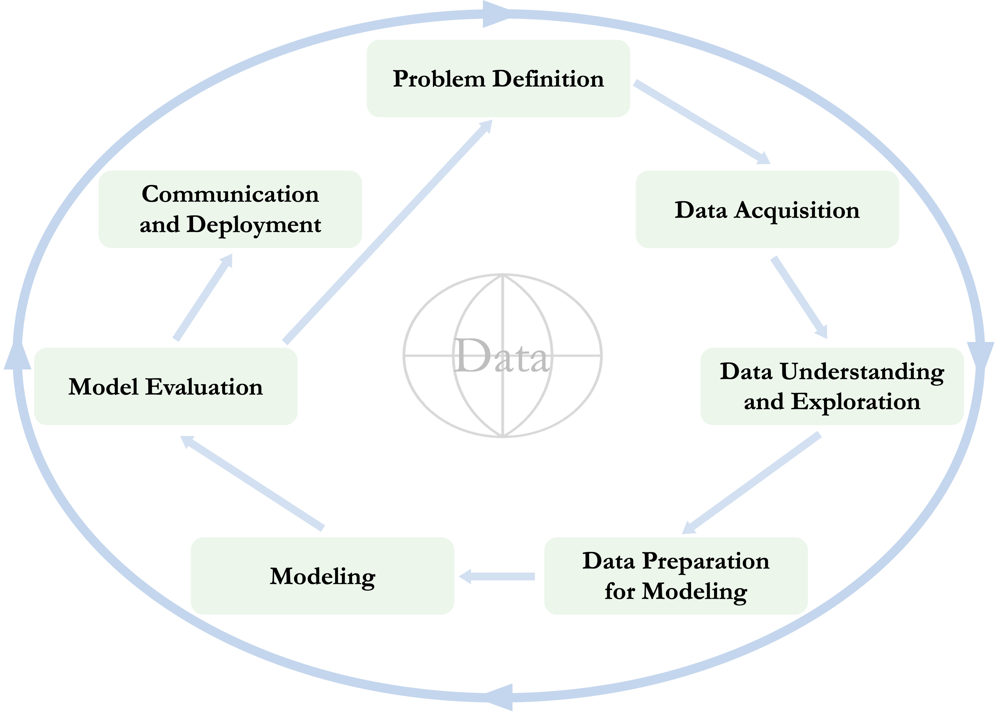
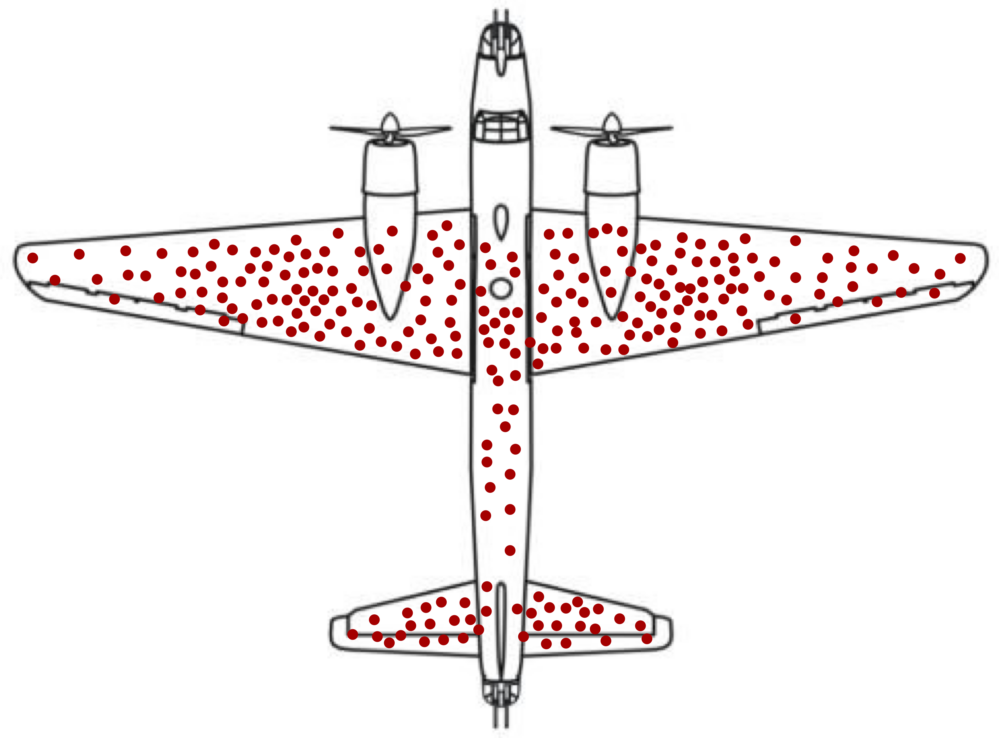
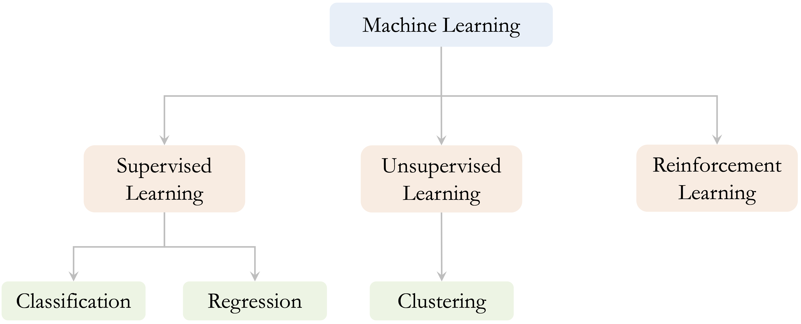
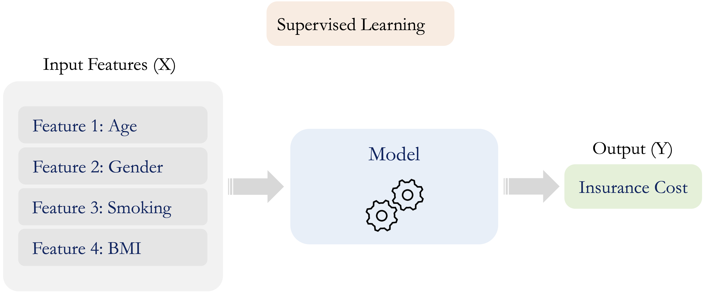

```{r echo=FALSE, message=FALSE, warning=FALSE}
source("_common.R")
```

::: {.content-visible when-format="pdf"}
\begin{chapterquote}
One must experiment with teaching one such machine and see how well it learns.

\hfill — Alan Turing
\end{chapterquote}
:::

::::: {.content-visible when-format="html"}
:::: chapterquote
One must experiment with teaching one such machine and see how well it learns.

::: author
— Alan Turing
:::
::::
:::::

# Introduction to Data Science {#sec-chapter-intro-data-science}

Every day, organizations record traces of activity: customer transactions, website clicks, medical measurements, survey responses, sensor readings, and administrative records. Yet data alone do not explain what is happening, predict what may happen next, or indicate what action should be taken. To become useful, data must be connected to a question, examined carefully, prepared in an appropriate form, and analyzed with methods that match the goal of the problem. This is the central aim of data science: to turn data into evidence that supports explanation, prediction, and decision-making.

Consider a few examples. A bank may want to identify customers who are at risk of closing their accounts. A researcher may want to understand which variables are associated with income. A marketing team may want to predict whether a customer will subscribe to a term deposit. A business may want to group customers or products into meaningful segments when no outcome labels are available. Although these questions differ in context, they share a common structure: each requires data to be organized, explored, modeled, evaluated, and interpreted in relation to a practical objective.

Data science is not defined by a single algorithm or software tool. It combines statistical reasoning, computational tools, domain knowledge, and practical judgment to answer questions using data. In this chapter, we introduce the Data Science Workflow as the organizing framework for this process, moving from Problem Definition and Data Acquisition through Data Understanding and Exploration, Data Preparation for Modeling, Modeling, Model Evaluation, and Communication and Deployment. We also explain how machine learning fits within the workflow, primarily as a collection of modeling methods for learning patterns, generating predictions, and discovering structure in data.

This book focuses on practical data science with R using structured, tabular data, such as those commonly found in spreadsheets, relational databases, administrative records, and business or scientific applications. Data science also encompasses unstructured forms of data, including images, audio, video, and text, but these lie beyond the scope of this book. By concentrating on tabular data, we can develop the central ideas of the workflow in a setting that is widely encountered in practice, accessible to beginning learners, and directly connected to the statistical and machine learning methods introduced in later chapters.

### What This Chapter Covers {.unnumbered .unlisted}

This chapter establishes the conceptual foundation for the rest of the book. We begin by defining data science as an interdisciplinary field that combines statistical reasoning, computation, domain knowledge, and data management. This perspective emphasizes that effective analysis depends not only on technical methods, but also on clearly formulated questions, relevant data, and careful interpretation.

We then introduce the Data Science Workflow used throughout the book: Problem Definition, Data Acquisition, Data Understanding and Exploration, Data Preparation for Modeling, Modeling, Model Evaluation, and Communication and Deployment. Although these stages provide a useful structure for organizing a project, data science is an iterative process in which findings from later stages may lead analysts to revisit earlier decisions. The main focus of this book is on Problem Definition, Data Understanding and Exploration, Data Preparation for Modeling, Modeling, and Model Evaluation. Data Acquisition and the final Communication and Deployment stage are introduced as essential parts of the broader workflow, but they are treated mainly at a conceptual level rather than developed as separate technical topics.

Finally, we introduce supervised, unsupervised, and reinforcement learning and explain how they fit within the broader workflow. This book focuses mainly on supervised and unsupervised methods for structured, tabular data. By the end of the chapter, you should be able to describe the workflow, explain its iterative nature, distinguish among the main branches of machine learning, and explain the role of machine learning within data science.

## What Is Data Science?

Data science is an interdisciplinary field concerned with extracting useful information from data and using it to support explanation, prediction, and decision-making. It combines statistical reasoning, computational tools, domain knowledge, and data management to address questions that cannot be answered by data or algorithms alone. Data science is therefore not a single method or collection of algorithms, but a structured process for turning data into evidence that can be interpreted and used in context.

Statistical reasoning helps us quantify uncertainty, evaluate evidence, and assess whether observed patterns are meaningful and likely to generalize beyond the available data. Computational skills make it possible to implement analyses, work reproducibly, and handle datasets that may be too large or complex for manual inspection. Domain knowledge helps translate practical or scientific objectives into meaningful analytical questions and ensures that findings are interpreted in relation to the setting in which they will be used.

Data acquisition and management also play important roles in applied data science. Relevant data may need to be identified, collected, accessed, combined, organized, and documented before they can be explored or modeled. Analysts must also understand how the data were generated, what population they represent, and whether important observations or variables are missing. Poorly acquired or poorly managed data can undermine even sophisticated statistical or machine learning methods, because conclusions are only as reliable as the data and assumptions on which they depend.

Machine learning is an important component of data science, particularly when the goal is prediction, classification, or pattern discovery. However, its effectiveness depends on the broader process in which it is used. Defining the problem clearly, acquiring appropriate data, understanding and exploring those data, preparing them appropriately for modeling, evaluating results, and considering how those results will be communicated and used are all essential parts of a successful analysis. This broader process is captured by the Data Science Workflow introduced in the next section and used throughout the rest of the book.

## The Data Science Workflow {#sec-ds-DSW}

Data science projects often begin with practical questions that appear straightforward. Consider a company that wants to identify customers who are likely to close their accounts. Historical records may contain information about account activity, service usage, customer service calls, contract type, and whether each customer eventually left the company. At first glance, this may seem like a simple prediction problem: fit a model and identify customers at high risk of churn.

In practice, the problem is more demanding. The organization must first clarify what decision the analysis should support. Is the goal to predict churn as accurately as possible, understand which factors are associated with churn, or identify customers who may benefit from a retention intervention? These objectives are related, but they may require different data, models, evaluation criteria, and forms of interpretation.

The relevant data must then be identified and acquired. Customer information may be distributed across several systems, collected at different times, or recorded using inconsistent definitions. Analysts need to understand where the data came from, how they were generated, whether they represent the customers of interest, and which variables would actually be available when future predictions are made.

Once the data have been acquired, they must be understood and explored. This involves examining the structure of the dataset, the types and distributions of its features, patterns of missingness, unusual or implausible values, relationships among variables, and possible redundancy. These investigations help analysts determine what the data can support and which issues may need to be addressed before modeling.

The data must then be prepared for model development and reliable evaluation. This stage includes partitioning the data, designing resampling procedures, preventing data leakage, and preparing categorical and numerical features. Decisions about handling missing values, extreme observations, or class imbalance must be made in a way that preserves the independence of the evaluation data. In particular, preprocessing steps that learn information from the data should be estimated using the training data and then applied to validation or test data.

The model itself is only one component of the project. A model that performs well on the training data may still be unsuitable if it does not generalize to new observations, if the evaluation design is flawed, or if its outputs cannot support the intended decision. For example, a churn model may identify many high-risk customers, but the organization must still determine which interventions are appropriate, how costly they are, and whether using the predictions improves customer retention in practice. If the model is deployed, its performance and relevance must also be monitored as customer behavior and business conditions change.

This example illustrates why data science requires a structured workflow rather than a collection of isolated technical steps. Useful analysis depends on connecting the practical objective, the available data, the preparation strategy, the modeling approach, the evaluation design, and the context in which the results will be used. In this book, we refer to this process as the *Data Science Workflow*. The workflow provides a flexible framework for organizing data science projects while allowing for iteration, revision, and domain-specific judgment.

Several frameworks have been proposed for structuring data-driven projects. One widely used example is CRISP-DM, the Cross-Industry Standard Process for Data Mining [@chapman2000crispdm]. Building on this general tradition, we use the seven-stage workflow shown in Figure [-@fig-ds_DSW]. These stages provide the organizing framework for the chapters that follow.

1.  *Problem Definition*: Define the research, business, or practical problem, clarify the decision or question the analysis should support, identify relevant constraints and consequences, and determine what a successful analysis should achieve.

2.  *Data Acquisition*: Identify, obtain, combine, and document the data needed to address the problem, while considering how the data were generated and what population they represent.

3.  *Data Understanding and Exploration*: Examine the structure, quality, feature types, distributions, patterns, and relationships in the data, and investigate missingness, unusual observations, implausible values, and redundancy.

4.  *Data Preparation for Modeling*: Prepare the data for model development and reliable evaluation by partitioning and resampling appropriately, preventing data leakage, handling identified data-quality issues, and preparing categorical and numerical features.

5.  *Modeling*: Fit statistical or machine learning models to explain relationships, make predictions, classify observations, or discover structure in the data.

6.  *Model Evaluation*: Assess model performance using appropriate validation procedures and metrics, and determine whether the results address the original objective and are useful in practice.

7.  *Communication and Deployment*: Communicate analytical findings, uncertainty, limitations, and practical implications through reports, dashboards, presentations, or decision-support tools; where appropriate, put models or analytical results into practical use and monitor their continued relevance.

```{r fig-ds_DSW, echo = FALSE, out.width="85%"}
#| fig-cap: "The Data Science Workflow is an iterative framework for structuring data science and machine learning projects. It connects Problem Definition, Data Acquisition, Data Understanding and Exploration, Data Preparation for Modeling, Modeling, Model Evaluation, and Communication and Deployment."


```

Although the stages are presented in a numbered order, the workflow should not be understood as a rigid sequence. Data science projects are usually iterative. Data Understanding and Exploration may reveal that additional data are needed, exploratory findings may lead to a refinement of the original problem definition, Model Evaluation may expose weaknesses in the preparation strategy, and Communication and Deployment may reveal that results need clearer explanation, a model must be updated, or an analytical product no longer supports the intended decision.

The workflow also clarifies the structure and scope of this book. The main emphasis is on Problem Definition, Data Understanding and Exploration, Data Preparation for Modeling, Modeling, and Model Evaluation. Data Acquisition and the final Communication and Deployment stage are included because they are essential to a complete data science workflow, but they are discussed primarily at a conceptual level. Chapter [-@sec-chapter-data-understanding] develops Data Understanding and Exploration, Chapter [-@sec-chapter-data-preparation] focuses on Data Preparation for Modeling, and later chapters introduce specific modeling approaches and methods for evaluating their performance.

In the remainder of this chapter, we examine each stage of the Data Science Workflow in more detail. This overview prepares the ground for the practical chapters that follow, where the same workflow guides the analysis of structured, tabular data in R.

## Problem Definition {#sec-ds-problem-definition}

Every data science project begins with defining the problem to be addressed. Before analysts select variables, write code, or fit models, they need to clarify why the problem matters, what decision or question the analysis should support, and how the results will be used. This stage sets the direction for the entire workflow by defining the project objectives, identifying relevant constraints, and establishing what a successful outcome would look like.

A well-known example from World War II illustrates the importance of framing a problem carefully: the case of Abraham Wald and the missing bullet holes. During the war, returning aircraft were inspected to determine which areas had sustained the most damage. Bullet holes appeared more frequently in some parts of the aircraft, while relatively few were observed in the engines. Figure [-@fig-ds-case-WW2] illustrates this pattern, with the schematic aircraft on the left and the corresponding distribution of bullet holes on the right.

::: {#fig-ds-case-WW2 layout="[40,-3,57]" layout-valign="top"}
```{r}
#| label: ds-case-WW2-plane-image
#| echo: false
#| out-width: "100%"


```

```{r}
#| label: ds-WW2-bullet-holes-data
#| echo: false

bullet_holes = data.frame(
  section = c("Engine", "Fuselage", "Fuel system", "Rest of plane"),
  bullet_holes = c(1.11, 1.73, 1.55, 1.80)
)

kbl(
  bullet_holes,
  booktabs = TRUE,
  col.names = c("Plane Section", "Bullet Holes per ft²"),
  align = c("l", "r")
) %>%
  kable_styling(full_width = FALSE) %>%
  column_spec(1, bold = FALSE, color = "black", width = "11em")
```

Left: schematic illustration of bullet damage observed on aircraft that returned from missions. Right: distribution of bullet holes per square foot across different sections of the returned aircraft. The observed pattern excludes aircraft that did not return, which is central to the problem-framing lesson.
:::

Initial recommendations focused on reinforcing the areas with the greatest visible damage. Wald recognized, however, that the available data came only from aircraft that had returned. Areas with relatively few observed bullet holes, such as the engines, were likely those where damage prevented aircraft from returning. He therefore recommended reinforcing the areas with few or no observed bullet holes. The example illustrates a central principle of problem definition: the analytical question must be framed in relation to how the data were generated and which observations are absent from the analysis.

In applied projects, the initial objective is often vague, overly broad, or expressed in operational rather than analytical terms. An organization may want to “reduce customer churn,” “improve student success,” or “detect fraud,” but such goals do not yet specify what should be predicted, explained, or measured. Analysts must therefore work with domain experts and other stakeholders to clarify the decision being supported, the population or cases to which the results will apply, and the consequences of different analytical outcomes.

For example, a university interested in student success may want to predict which students are at risk of dropping out, understand which factors are associated with academic difficulty, or evaluate whether an advising intervention improves retention. These are different objectives. They may require different data, analytical methods, evaluation criteria, and forms of interpretation.

Problem definition also requires specifying what success means. Statistical or predictive performance may be important, but it is rarely the only criterion. Practical usefulness, interpretability, fairness, timeliness, cost, and the consequences of incorrect decisions may also matter. These considerations should be identified early because they influence how the problem is translated into an analytical task and how the results will later be evaluated.

A structured approach can help translate a practical objective into a problem that can be addressed using data:

1.  *Clarify the practical objective*: Identify the research, business, or societal goal and the decision that the analysis should support.

2.  *Formulate specific questions*: Translate the broad objective into questions that can be investigated using data.

3.  *Define measurable outcomes*: Determine what should be predicted, explained, compared, or discovered, and how success will be assessed.

4.  *Identify constraints and consequences*: Consider limitations related to time, cost, data access, interpretability, ethics, and the consequences of incorrect decisions.

5.  *Outline a preliminary analytical strategy*: Identify the types of data, analytical methods, and evaluation criteria that may be needed, while recognizing that the strategy may change as the project develops.

A well-defined and data-aligned problem provides the foundation for all subsequent stages of the workflow. It guides which data should be acquired, how variables should be defined, which modeling approaches are appropriate, and how performance and practical value should be evaluated. The next stage, Data Acquisition, focuses on identifying and obtaining the data needed to address the problem.

> *Practice:* Consider a situation in which an organization wants to “use data science” to reduce customer churn, improve student success, or detect unusual transactions. Before thinking about data or models, ask: What decision should the analysis support? What outcome should be measured? What would define success, and what are the consequences of an incorrect decision?

## Data Acquisition

After the problem has been defined, the next stage is to identify and obtain the data needed to address it. Data acquisition may involve collecting new data or accessing existing data from databases, spreadsheets, surveys, experiments, administrative systems, sensors, application programming interfaces (APIs), or public repositories. In many projects, relevant information is distributed across several sources and must be linked or combined before analysis can begin.

The aim of data acquisition is not simply to obtain as much data as possible. The acquired data should be relevant to the analytical question, provide suitable coverage of the population of interest, and be available at the time when the analysis or prediction will be used. For example, a project predicting hospital readmission may require information about diagnoses, treatments, previous admissions, discharge summaries, and follow-up care. Variables recorded only after a patient has already been readmitted would not be valid predictors of future readmission and could introduce data leakage if included in model development.

Analysts must also consider how the data were generated. Data may reflect the design of a survey or experiment, the operation of an administrative system, or the behavior of individuals who chose to participate. These processes influence which observations and variables are available and which may be absent. Selection mechanisms, measurement procedures, changes in definitions over time, and limitations in coverage can all affect whether the data are suitable for the intended purpose.

Data acquisition therefore requires careful attention to provenance and documentation. Analysts should record where the data came from, when and how they were collected, how variables were defined, and whether different sources use compatible units, identifiers, definitions, and time periods. Access permissions, privacy, confidentiality, ownership, and legal or ethical restrictions must also be considered before the data are used.

Although Data Acquisition is essential to the Data Science Workflow, its implementation depends strongly on the application domain, the data sources, and the available infrastructure. This book covers common practical tasks in R, including importing data in Section [-@sec-R-import-data] and merging data from multiple sources in Section [-@sec-R-merge-data]. Broader practical approaches to importing and accessing data in R are discussed by @wickham2023r4ds, while principles for organizing, documenting, maintaining, and sharing research data are presented by @briney2015data.

At the end of this stage, the analyst should have an accessible, documented, and ethically usable collection of data that is potentially suitable for addressing the problem. This does not mean that the data are ready for modeling. Their structure, quality, feature types, distributions, and limitations must still be examined carefully. These tasks belong to the next stage of the workflow, Data Understanding and Exploration.

## Data Understanding and Exploration

After the relevant data have been acquired, the next stage is to understand what they contain, how they are structured, and whether they are suitable for addressing the problem. Data Understanding and Exploration combines careful inspection of data quality with exploratory analysis of distributions, patterns, and relationships. It helps analysts determine what the data can support before decisions are made about how they should be prepared for modeling.

An important first step is to examine the structure and representation of the data. Analysts need to identify the unit of observation, understand what each feature represents, and determine whether features are numerical, categorical, ordinal, binary, or expressed in another form. They should also inspect variable definitions, units of measurement, category labels, and the way missing values are recorded. Incorrect feature types or inconsistent representations can lead to misleading summaries and inappropriate analytical choices.

Data Understanding also involves identifying and investigating potential data-quality issues. These may include missing values, duplicated records, inconsistent entries, outliers, implausible values, or unexpected distributions. The aim at this stage is not necessarily to remove or modify such observations immediately. Instead, analysts should investigate why the issues occur, whether they reflect errors or genuine variation, and how they may affect later analysis. For example, an extreme value may be a recording error, but it may also represent an important and valid case that should not be discarded.

Exploratory Data Analysis (EDA) plays a central role in this stage. Numerical summaries and visualizations are used to examine individual features, compare groups, and investigate relationships among variables. Histograms, bar charts, box plots, and scatter plots can reveal skewness, imbalance, clusters, trends, unusual observations, and possible associations. Correlation analysis and other multivariate methods can also help identify redundant features or relationships that may influence later modeling decisions.

Data Understanding is therefore both diagnostic and exploratory. It identifies limitations in the data while also revealing patterns that may refine the original problem, suggest additional questions, or motivate the construction of useful features. Exploratory findings should be communicated clearly through well-designed visualizations and concise interpretations so that important patterns, uncertainties, and limitations are visible to both analysts and stakeholders.

Chapter [-@sec-chapter-data-understanding] develops Data Understanding in detail, including feature types and data representation, missingness, outliers and implausible values, exploratory relationships, and the communication of findings through data storytelling. Once the main characteristics and limitations of the data have been understood, the next stage focuses on preparing them appropriately for model development and evaluation.

## Data Preparation for Modeling

After the data have been understood and their main limitations identified, the next stage is to prepare them for model development and reliable evaluation. Data Preparation transforms the acquired and explored data into a form suitable for fitting, comparing, tuning, and evaluating statistical or machine learning models. The required steps depend on the analytical task, the characteristics of the data, and the modeling methods being considered.

An important first step is to determine how the data will be used during model development. The data are typically divided into a training set and a test set. The training set is used to prepare the data, fit candidate models, compare alternatives, and tune model settings, often through cross-validation or another resampling method. The test set is kept separate and used only for the final assessment of the selected modeling approach. Data Preparation therefore establishes the framework within which later modeling and evaluation will take place.

A central principle is that any decision or transformation that learns information from the data must be based only on the training data. For example, values used for imputation, scaling parameters, selected feature levels, or thresholds for handling extreme observations should be estimated from the training set and then applied to the test set. Using information from the test data during preparation can produce overly optimistic estimates of model performance. This problem is known as *data leakage*.

Data Preparation for Modeling may involve deciding whether and how missing values, implausible observations, extreme values, or inconsistent feature representations identified during Data Understanding and Exploration should be addressed. Categorical features may need to be grouped or encoded, while numerical features may require scaling or transformation. Additional steps may include constructing informative features, reducing redundancy, or addressing class imbalance.

Preparation should be guided by the requirements of the modeling methods rather than applied as a fixed collection of routine steps. For example, distance-based methods such as k-nearest neighbors are sensitive to the scale of numerical predictors, whereas other models may be less affected by differences in measurement units. Similarly, some algorithms require categorical features to be converted into numerical indicators, while others can work with them more directly.

Chapter [-@sec-chapter-data-preparation] develops Data Preparation in detail, including partitioning and resampling, data leakage and the training-only principle, handling missing and extreme values, preparing categorical and numerical features, and addressing class imbalance. At the end of this stage, the data and evaluation framework should be ready to support reliable model development and assessment.

## Modeling

Modeling is the stage of the Data Science Workflow in which statistical and machine learning methods are applied to prepared data. The purpose of modeling depends on the analytical objective. Models may be used to make predictions, explain or estimate relationships, classify observations, or discover structure in unlabeled data. For example, a classification model may predict whether a loan applicant is likely to default, a regression model may estimate or predict a numerical outcome such as housing price, and a clustering method may identify groups of similar observations when no outcome labels are available.

The first step is to determine the type of modeling task, such as classification, regression, or clustering. Analysts then select one or more candidate methods based on the objective of the analysis, the structure of the data, the assumptions of the methods, and practical requirements. Candidate models are fitted using the training data and, where necessary, tuned by comparing different model settings across resamples of the training data, such as cross-validation folds.

The choice of model often involves trade-offs among predictive performance, interpretability, computational efficiency, robustness, and ease of use in practice. A more complex model may achieve stronger predictive performance but be harder to explain, communicate, maintain, or put into practical use. For this reason, several plausible models are often compared rather than selecting a method simply because it is familiar or sophisticated.

This book introduces a range of modeling approaches, including k-nearest neighbors for classification (Chapter [-@sec-chapter-knn]), Naive Bayes classifiers (Chapter [-@sec-chapter-bayes]), regression and generalized linear models (Chapters [-@sec-chapter-regression] and [-@sec-chapter-glm]), decision trees and random forests (Chapter [-@sec-chapter-trees]), neural networks (Chapter [-@sec-chapter-neural-networks]), and clustering methods for unlabeled data (Chapter [-@sec-chapter-clustering]).

Modeling is closely connected to evaluation. Candidate approaches are compared within the resampling framework established during Data Preparation for Modeling, while the selected approach is assessed separately to determine how well it generalizes to new data and whether it addresses the original analytical objective. The next section examines this evaluation stage in more detail.

## Model Evaluation

Evaluation is the stage of the Data Science Workflow in which analysts determine whether the selected modeling approach performs adequately, generalizes to new data, and addresses the original analytical objective. A model that fits the training data well may still perform poorly on new observations or provide results that are not useful in the intended decision context.

Reliable evaluation depends on the framework established during Data Preparation. Candidate models and tuning settings are compared using resamples of the training data, while the test set remains separate during model development. Once an approach has been selected and refitted using the available training data, the test set provides an independent assessment of how well the complete modeling procedure is likely to perform on new observations.

Evaluation metrics summarize different aspects of model performance. The appropriate choice depends on the modeling task, the distribution of the outcome, and the consequences of different errors. For classification, accuracy may be informative, but it can be misleading when classes are imbalanced or when false positives and false negatives have different consequences. Measures such as sensitivity, specificity, precision, recall, and the area under the ROC curve provide complementary perspectives. For regression, measures such as MAE, RMSE, and $R^2$ describe prediction error and the model’s ability to account for variation in the outcome.

Performance should also be interpreted relative to meaningful benchmarks and practical requirements. A model may outperform a simple baseline yet still be too inaccurate, costly, slow, or difficult to interpret for its intended use. Diagnostic tools, such as confusion matrices and residual plots, can help reveal where a model succeeds or fails and whether particular groups or observations are affected differently.

When evaluation reveals weaknesses, earlier stages of the workflow may need to be revisited. Analysts may reconsider the problem definition, acquire additional data, revise preparation decisions, construct different features, or compare alternative models. When the results meet the analytical and practical objectives, the project can proceed to Communication and Deployment. Chapter [-@sec-chapter-evaluation] examines evaluation metrics, validation procedures, and diagnostic tools in detail.

## Communication and Deployment

Communication and Deployment is the stage of the Data Science Workflow in which analytical results are communicated, interpreted, and, where appropriate, put into practice. In some projects, this stage involves a reproducible report, presentation, dashboard, scientific publication, or recommendation that informs decisions. In others, it may involve integrating a trained model into a system that generates predictions for new observations.

Analytical findings must be presented in a form appropriate for their intended audience. Reports, presentations, dashboards, and other communication products can help stakeholders understand the main findings, their uncertainty and limitations, and their practical implications. R Markdown supports this process by combining narrative, code, results, and visualizations in reproducible reports and presentations, as discussed in [Appendix @sec-R-rmarkdown]. The principles of clear visualization and data storytelling introduced in Section [-@sec-eda-storytelling] also remain important when findings are communicated for practical use.

Successful communication and deployment require more than transferring a fitted model into a technical system or producing a report. Intended users should understand what the output represents, how it should be used, and under what conditions it may be unreliable. The resulting model, report, dashboard, or decision-support product should therefore be documented, reproducible, and appropriate for the practical constraints of its intended setting. Responsibilities for its use, maintenance, and review should also be clearly established.

Communication and Deployment does not necessarily mark the end of a data science project. When a report, model, dashboard, or analytical system is used repeatedly with new data, its relevance and performance should be monitored over time. The characteristics of incoming data may differ from those observed during model development, and relationships between predictors and outcomes may change as behavior, conditions, or systems evolve. Analytical products may therefore need to be revised, recalibrated, updated, or replaced.

Although Communication and Deployment is an important stage of the workflow, it is not the primary technical focus of this book. The chapters that follow concentrate mainly on developing, evaluating, interpreting, and communicating analyses within a reproducible framework. The next section introduces machine learning as an important modeling toolkit within the broader Data Science Workflow.

## Machine Learning {#sec-ds-machine-learning}

Machine learning is a subfield of artificial intelligence concerned with methods that learn patterns or relationships from data. These methods may be used to make predictions for new observations, estimate relationships, classify cases, or discover structure in data. Unlike rule-based systems, in which decision rules are specified explicitly in advance, machine learning models infer relevant patterns from observed examples. This is particularly useful when relationships are complex or when fixed rules are difficult to formulate.

In supervised learning, a model is trained using observations for which an outcome is known and is then applied to new cases for which the outcome is unknown. For example, a model may learn from historical customer records to predict whether a current customer is likely to churn. In unsupervised learning, no outcome labels are provided, and the aim may instead be to identify groups, patterns, or other structure within the data.

Within the Data Science Workflow shown in Figure [-@fig-ds_DSW], machine learning is used primarily during the Modeling stage. Its effectiveness, however, depends on the entire workflow. An unclear problem, unsuitable or unrepresentative data, weak understanding of data quality, inappropriate preparation, or unreliable evaluation can undermine even a technically sophisticated model. Machine learning should therefore be viewed as an important modeling toolkit within data science rather than as a substitute for the broader process.

Machine learning methods are commonly grouped into three broad categories: supervised learning, unsupervised learning, and reinforcement learning. As shown in Figure [-@fig-ds-machine-learning], these categories differ in the information available during learning, the goals they address, and the way feedback is provided.

```{r fig-ds-machine-learning, echo = FALSE, out.width = "95%"}
#| fig-cap: "Machine learning methods can be broadly categorized as supervised learning, unsupervised learning, and reinforcement learning. These categories differ in the information available during learning, the goals they address, and the way feedback is provided."


```

This book focuses mainly on supervised and unsupervised learning for structured, tabular data. Reinforcement learning is introduced only briefly to provide a broader view of the field.

### Supervised Learning {.unnumbered .unlisted}

Supervised learning uses labeled data, in which each observation contains a set of input features and a known outcome. For example, historical diagnostic records may contain patient measurements, test results, and clinical characteristics, together with an outcome indicating whether a condition was present. A supervised learning model can use these observations to learn patterns associated with the outcome and predict it for new patients.

More generally, the input features or predictors are commonly denoted by (X), while the outcome or target variable is denoted by (Y). The model is fitted using training data in which both (X) and (Y) are observed. It estimates the relationship between them and then uses the learned relationship to predict (Y) for new observations for which only (X) is available. This process is illustrated in Figure [-@fig-ds-supervised-learning].

```{r fig-ds-supervised-learning, echo = FALSE, out.width = "85%"}
#| fig-cap: "Supervised learning methods use input features (X) and known outcomes (Y) in the training data to predict outcomes for new observations."


```

Supervised learning problems are commonly divided into classification and regression tasks. In classification, the outcome represents one of a set of categories, such as whether an email is spam, whether a tumor is benign or malignant, or whether a customer will churn. In regression, the outcome is numerical, such as housing price, insurance cost, product demand, or the number of events occurring during a specified period.

This book introduces several supervised learning methods for classification and regression. These include k-nearest neighbors for classification (Chapter [-@sec-chapter-knn]), Naive Bayes classifiers (Chapter [-@sec-chapter-bayes]), regression and generalized linear models (Chapters [-@sec-chapter-regression] and [-@sec-chapter-glm]), decision trees and random forests (Chapter [-@sec-chapter-trees]), and neural networks (Chapter [-@sec-chapter-neural-networks]). These methods are developed within the broader Data Science Workflow, with attention to data preparation, model fitting, evaluation, and interpretation.

### Unsupervised Learning {.unnumbered .unlisted}

How can meaningful structure be identified in data when no target outcome is specified? This question lies at the heart of unsupervised learning, which analyzes data without predefined outcome labels to uncover patterns, groupings, or lower-dimensional structure. Unlike supervised learning, which learns relationships between features and a known outcome, unsupervised learning focuses on how observations or features are organized when there is no specific prediction target.

Clustering is one of the most widely used unsupervised learning methods. It groups observations according to their similarity across selected features. For example, an online retailer may use clustering to segment customers based on purchasing behavior and browsing patterns. The resulting groups may suggest profiles such as frequent purchasers, occasional buyers, or high-value customers, helping the organization understand variation within its customer base.

Clustering results should be interpreted carefully. The groups identified depend on the features included, how those features are represented and scaled, the measure of similarity, and the clustering method. Clusters should therefore not automatically be treated as objectively existing or practically meaningful groups. Their stability, interpretation, and usefulness must be examined in relation to the analytical objective and domain context.

Other unsupervised methods include dimensionality reduction and some forms of anomaly detection. This book focuses mainly on clustering as a practical introduction to learning from unlabeled tabular data. We return to clustering in Chapter [-@sec-chapter-clustering], where these ideas are developed in detail using datasets for segmentation and pattern discovery. For a broader introduction to unsupervised learning, including clustering and dimensionality reduction, see @james2021islr.

### Reinforcement Learning {.unnumbered .unlisted}

Reinforcement learning is a branch of machine learning in which an agent learns to make sequential decisions through interaction with an environment. At each step, the agent observes the current state, selects an action, and receives feedback in the form of a numerical reward. The action may also change the state of the environment, influencing the choices and rewards available later.

The goal is to learn a *policy*: a strategy for selecting actions that maximizes the expected cumulative reward over time. Reinforcement learning is therefore particularly useful when decisions are made repeatedly, actions have delayed consequences, and the best immediate choice may not produce the best long-term outcome.

Although reinforcement learning is an important area of machine learning, it lies outside the scope of this book. The book focuses on supervised and unsupervised methods for structured, tabular data, with particular attention to classification, regression, and clustering. Readers interested in a comprehensive treatment of reinforcement learning are referred to *Reinforcement Learning: An Introduction* by @sutton1998reinforcement.

## Chapter Summary and Takeaways

This chapter introduced data science as an interdisciplinary, workflow-driven discipline for turning data into evidence that supports explanation, prediction, and decision-making. Effective data science requires more than applying algorithms. It depends on clearly defining the problem, obtaining appropriate data, understanding their characteristics and limitations, preparing them carefully, evaluating results reliably, and considering how those results will be used.

The Data Science Workflow provides the organizing framework for this process. It consists of seven stages: Problem Definition, Data Acquisition, Data Understanding and Exploration, Data Preparation for Modeling, Modeling, Model Evaluation, and Communication and Deployment. Findings from later stages may lead analysts to refine the problem, acquire additional data, reconsider preparation decisions, compare alternative models, or revise the evaluation strategy.

This book focuses primarily on Problem Definition, Data Understanding and Exploration, Data Preparation for Modeling, Modeling, and Model Evaluation. Data Acquisition and the final Communication and Deployment stage are essential parts of the complete workflow, but they are treated mainly at a conceptual level. Throughout the book, attention is also given to reproducibility, interpretation, communication, and the practical context in which analytical results are used.

Machine learning was introduced as an important modeling toolkit within this broader workflow. Supervised learning uses labeled data for tasks such as classification and regression, while unsupervised learning seeks patterns or structure in data without predefined outcome labels. Reinforcement learning concerns sequential decision-making through interaction and feedback but lies outside the scope of this book.

The next chapter turns to Data Understanding and Exploratory Data Analysis. It examines how the structure, feature types, distributions, missingness, unusual and implausible values, and relationships in a dataset can be investigated before the data are prepared for modeling.

## Exercises {#sec-ds-exercises}

The exercises below reinforce the main ideas of this chapter. They progress from conceptual understanding and workflow reasoning to machine learning task identification, applied scenarios, and ethical reflection.

### Conceptual Questions {.unnumbered .unlisted}

1.  Define *data science* in your own words. What makes it an interdisciplinary field?

2.  Explain why data science requires more than applying algorithms to a dataset.

3.  Describe the roles of statistical reasoning, computation, domain knowledge, and data management in a data science project.

4.  How does machine learning differ from traditional rule-based programming, and how is it related to artificial intelligence?

5.  Explain why machine learning should be viewed as a modeling toolkit within the broader Data Science Workflow rather than as a substitute for the workflow.

### Understanding the Data Science Workflow {.unnumbered .unlisted}

6.  List the seven stages of the Data Science Workflow introduced in this chapter. Briefly describe the purpose of each stage.

7.  Why is Problem Definition important? Give an example of how a poorly defined problem could lead to misleading or practically unhelpful results.

8.  What factors should analysts consider when deciding whether acquired data are suitable for a project? Include relevance, population coverage, timing, and data provenance in your answer.

9.  Explain the difference between Data Understanding and Exploration and Data Preparation for Modeling. Give two examples of tasks that belong mainly to each stage.

10. Why should missing values, outliers, and implausible observations be investigated during Data Understanding rather than automatically removed or modified?

11. Explain the training-only principle. Why should imputation values, scaling parameters, feature-selection decisions, and other data-dependent transformations be learned from the training data?

12. What is data leakage, and how can it lead to overly optimistic estimates of model performance?

13. Explain the difference between evaluation design and evaluation metrics. Why are both needed when assessing a modeling approach?

14. Why is the Data Science Workflow described as iterative rather than strictly linear? Give two examples of findings that could require analysts to revisit an earlier stage.

### Machine Learning Task Types {.unnumbered .unlisted}

15. For each task below, classify it as supervised learning, unsupervised learning, or reinforcement learning. Briefly justify your answer.

    a.  Predicting housing prices from square footage, location, and number of rooms.
    b.  Grouping customers by purchasing behavior when no customer segments are known in advance.
    c.  Classifying tumors as benign or malignant using historical diagnostic data.
    d.  Training an agent to choose actions in a game based on numerical rewards.
    e.  Identifying unusual transactions without using previously labeled examples of fraud.

16. For each supervised learning task below, state whether it is a classification or regression problem.

    a.  Predicting whether a loan application will be approved.
    b.  Predicting the selling price of a house.
    c.  Predicting whether a customer will subscribe to a term deposit.
    d.  Predicting the number of doctor visits made by a patient in one year.

17. Give one example of a problem for which classification is appropriate and one for which regression is appropriate. Identify the input features and outcome in each example.

18. Why should groups produced by a clustering algorithm not automatically be interpreted as natural or objectively meaningful groups? Which analytical choices can influence the resulting clusters?

19. What trade-offs may arise among predictive performance, interpretability, computational efficiency, robustness, and ease of communication, maintenance, and practical use when selecting a model?

### Applied Scenarios {.unnumbered .unlisted}

20. An online retailer wants to predict whether a visitor will make a purchase during a website session. Describe how this project could proceed through all seven stages of the Data Science Workflow, from Problem Definition to Communication and Deployment.

21. A team handles missing values, scales all numerical features, and selects predictors using the complete dataset before dividing it into training and test sets. Explain why this procedure may lead to overly optimistic evaluation results and describe a more appropriate sequence of steps.

22. A university wants to identify students who may be at risk of dropping out. Describe:

    a.  the decision that the analysis should support;
    b.  the data that may need to be acquired;
    c.  issues that should be investigated during Data Understanding and Exploration;
    d.  one preparation step that may be needed before modeling; and
    e.  one ethical concern related to using the model.

23. A hospital develops a readmission prediction model with high test-set accuracy, but clinicians do not understand how to interpret or act on its predictions. Which stages of the Data Science Workflow may need to be revisited? Explain your answer. 

### Ethics and Reflection {.unnumbered .unlisted}

24. Consider the following concerns: privacy, population representation, fairness, transparency, and accountability. At which stages of the Data Science Workflow might each concern arise, and how could it affect the project?

25. To what extent can the Data Science Workflow be automated? Discuss which stages require substantial human judgment and what risks may arise when that judgment is removed. Which stage do you expect to find most challenging, and why?
