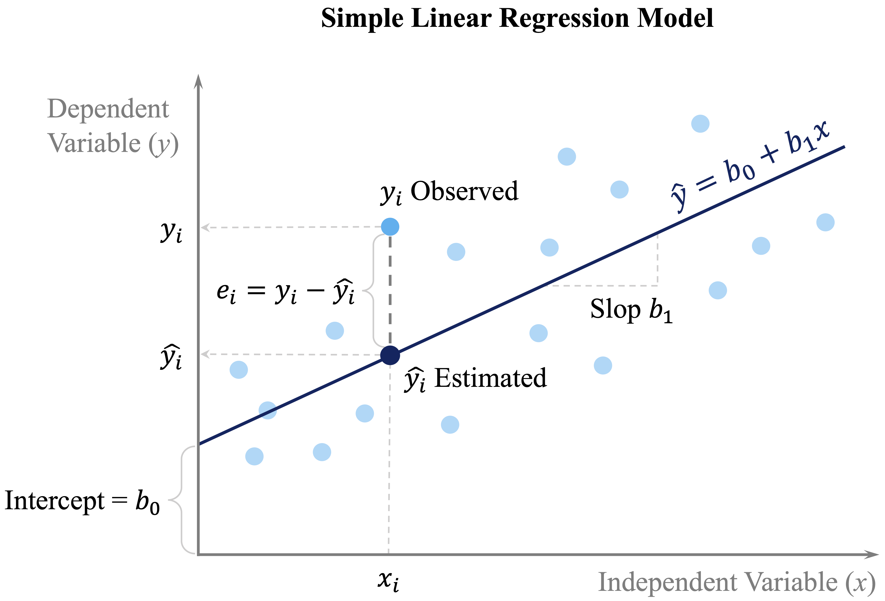

```{r echo=FALSE, message=FALSE, warning=FALSE}
source("_common.R")
```


# Regression Analysis: Linear and Nonlinear Models {#sec-ch10-regression}

::: {.content-visible when-format="pdf"}
\begin{chapterquote}
Everything should be made as simple as possible, but not simpler.

\hfill — Albert Einstein
\end{chapterquote}
:::

::::: {.content-visible when-format="html"}
:::: chapterquote
Everything should be made as simple as possible, but not simpler.

::: author
— Albert Einstein
:::
::::
:::::

How can housing prices be predicted from a home’s age, location, and nearby amenities? How can a bike-sharing system estimate hourly rental demand from weather conditions and time-related patterns? Questions such as these lie at the heart of regression analysis, one of the most widely used tools in data science. Regression models help us describe how a numerical outcome changes in relation to one or more predictors, quantify the strength of those relationships, and generate predictions based on observed data.

The roots of regression analysis go back to the late nineteenth century, when Francis Galton introduced the term *regression* in the study of heredity. Its mathematical foundations were later formalized through the method of least squares, which remains central to linear regression today. Over time, regression developed into a core framework for statistical modeling, supporting both explanation and prediction across fields such as economics, medicine, engineering, and business analytics.

Regression is powerful precisely because it serves more than one goal. In some applications, we want to explain how predictors are associated with an outcome and assess whether those associations are statistically meaningful. In others, the main goal is prediction: given a set of predictor values, how accurately can we estimate a future or unseen response? In practice, good regression modeling often requires balancing these two aims while also checking whether the fitted model is appropriate for the data.

In this chapter, we build on the *Data Science Workflow* introduced in Chapter [-@sec-ch2-intro-data-science] and illustrated in @fig-ch2_DSW. Earlier chapters focused on data preparation, exploratory analysis, and classification methods such as k-Nearest Neighbors (Chapter [-@sec-ch7-classification-knn]) and Naive Bayes (Chapter [-@sec-ch9-bayes]), together with tools for evaluating predictive performance (Chapter [-@sec-ch8-evaluation]). Regression extends this workflow to supervised learning problems in which the response variable is continuous, allowing us to study both prediction and interpretation within a common modeling framework.

This chapter also connects directly to the statistical foundations developed in Chapter [-@sec-ch5-statistics], particularly the discussion of correlation and inference in Section [-@sec-ch5-correlation-test]. Regression builds on these ideas by modeling relationships explicitly, allowing multiple predictors to be considered simultaneously, and providing a framework for testing whether individual predictors contribute meaningfully once the others are taken into account.

### What This Chapter Covers {.unnumbered .unlisted}

This chapter introduces regression analysis as a core modeling framework within the data science workflow. While earlier chapters focused mainly on classification problems, regression addresses tasks in which the outcome variable is numeric and continuous, such as price, cost, demand, or revenue.

We begin with simple linear regression to develop the basic ideas of model fitting, coefficient interpretation, and prediction. We then extend these ideas to multiple regression, where several predictors are considered simultaneously. Along the way, we examine how to assess model quality using measures such as the residual standard error, $R^2$, and adjusted $R^2$, and how to interpret regression coefficients in light of both statistical significance and practical relevance.

Regression is useful not only for prediction, but also for understanding how predictors are associated with an outcome. For that reason, the chapter emphasizes both perspectives. Some sections focus on explanation and inference, while others focus more directly on predictive performance and model comparison.

Many real-world relationships are not strictly linear. To address this, we introduce polynomial regression as a practical extension that allows curved relationships to be modeled while preserving the familiar linear modeling framework. We also examine model refinement through stepwise regression and show how diagnostic tools such as residual plots can help us assess assumptions, identify potential problems, and improve the model when needed.

Throughout the chapter, we use the real-world `house` dataset to illustrate how regression models are built, interpreted, compared, and diagnosed in practice. In the final section, we bring these ideas together in a case study on hourly bike rental demand using the `bike_demand` dataset.

By the end of this chapter, you will be able to fit, interpret, compare, and critically evaluate regression models in R, judge whether linear assumptions are reasonable, and extend regression models to capture more complex relationships when needed. We begin with simple linear regression, which provides the foundation for the rest of the chapter.


## Simple Linear Regression {#sec-ch10-simple-regression}

Simple linear regression is the natural starting point for regression modeling. It provides a formal way to study the relationship between a single predictor and a numerical response. By focusing on one predictor at a time, we develop intuition for how regression models are fitted, how coefficients are interpreted, and how predictions are made before extending these ideas to models with several predictors.

To illustrate these ideas, we use the `house` dataset from the **liver** package. This dataset contains house-level information together with a numerical response, `unit_price`, making it well suited for studying how individual housing characteristics are associated with price.

We begin by loading the dataset and inspecting its structure:

```{r}
library(liver)

data(house, package = "liver")

str(house)
```

The dataset contains `r nrow(house)` observations and `r ncol(house)` variables. From the output of `str(house)`, we can identify the response variable, `unit_price`, together with several numerical predictors. In this chapter, we begin by examining how one predictor at a time relates to the response, and then later extend the analysis to multiple regression.

Before fitting a regression model, it is useful to examine how the response variable relates to the available predictors. This helps us identify promising candidate predictors, assess whether a linear relationship seems plausible, and detect unusual patterns that may matter for modeling. Figure [-@fig-house-relationships] presents a matrix of pairwise relationships among the numeric variables in the `house` dataset using the `pairs.panels()` function from the **psych** package. The upper triangle shows correlation coefficients, the lower triangle shows scatter plots, and the diagonal displays histograms.

```{r fig-house-relationships, echo = FALSE, out.width = "100%", fig.cap = "Pairwise relationships among the numeric variables in the `house` dataset. The upper triangle shows correlation coefficients, the lower triangle shows scatter plots, and the diagonal displays histograms."}
library(psych)

pairs.panels(house,
bg = "#92C5DE",
pch = 21,
col = NA,
smooth = FALSE,
ellipses = FALSE,
hist.col = "#CCEBC5",
main = "Pairwise Relationships in the 'house' Data"
)
```

This matrix gives an initial sense of which predictors are associated with `unit_price` and whether those relationships appear roughly linear. It also helps us detect possible outliers or unusual patterns. Among the available predictors, `stores_number` shows a clear positive association with house price and provides a natural starting point for simple linear regression. This exploratory step also connects to the discussion of correlation in Section [-@sec-ch5-correlation-test], where we introduced linear association as a descriptive concept. We now move from description to modeling.

### Fitting a Simple Linear Regression Model {.unnumbered .unlisted}

We begin by modeling the relationship between the number of nearby stores (`stores_number`) and house unit price (`unit_price`). This example is easy to interpret while still illustrating the core ideas of regression.

Before fitting the model, it is helpful to visualize the relationship between the predictor and the response. A scatter plot with a fitted regression line provides a first indication of whether a linear model offers a reasonable description of the data.

```{r fig-scatter-plot-simple-reg, echo = FALSE, out.width = "80%", fig.cap = "Scatter plot of house unit price versus number of nearby stores, with the fitted regression line showing the linear relationship."}
ggplot(house, aes(x = stores_number, y = unit_price)) +
  geom_point(color = "#377EB8", alpha = 0.7) +
  geom_smooth(method = "lm", se = FALSE, color = "#E66101", linewidth = 0.8) +
  labs(
    title = "House Unit Price vs. Number of Nearby Stores",
    x = "Number of nearby stores",
    y = "Unit price"
  )
```

Figure @fig-scatter-plot-simple-reg suggests a positive association: houses with more nearby stores tend to have higher unit prices. The overall pattern appears roughly linear, which motivates fitting a simple linear regression model.

We represent this relationship as
$$
\hat{y} = b_0 + b_1 x,
$$
where $\hat{y}$ is the predicted value of the response variable (`unit_price`), $x$ is the predictor (`stores_number`), $b_0$ is the intercept, and $b_1$ is the slope. The slope $b_1$ represents the expected change in unit price associated with a one-unit increase in the number of nearby stores.

To build intuition, @fig-simple-regression gives a conceptual illustration of the model. The fitted regression line summarizes the overall linear pattern in the data, while the vertical distance between an observed value $y_i$ and its predicted value $\hat{y}_i = b_0 + b_1 x_i$ is called a residual. Residuals represent the part of the response that is not explained by the model.

```{r fig-simple-regression, echo = FALSE, out.width = "90%", fig.cap = "Conceptual view of a simple regression model: the red line shows the fitted regression line, blue points represent observed data, and the vertical line illustrates a residual, calculated as the difference between the observed value and its predicted value."}

```

### Fitting the Simple Regression Model in R {.unnumbered .unlisted}

Having introduced the model conceptually, we now estimate it in R using the `lm()` function. This base R function fits linear models and will be used throughout the chapter. Its basic syntax is

```{r eval = FALSE}
lm(response_variable ~ predictor_variable, data = dataset)
```

In our example, we model house unit price as a function of the number of nearby stores:

```{r}
simple_reg <- lm(unit_price ~ stores_number, data = house)
```

We can inspect the fitted model using `summary()`:

```{r}
summary(simple_reg)
```

The fitted regression equation is
$$
\widehat{\text{unit price}} = `r round(simple_reg$coefficients[1], 2)` + `r round(simple_reg$coefficients[2], 2)` \times \text{stores number}.
$$

The intercept ($b_0$) represents the estimated unit price for a house with zero nearby stores, while the slope ($b_1$) represents the expected change in unit price associated with one additional nearby store. In this model, the estimated slope indicates that each additional nearby store is associated with an average increase of approximately `r round(simple_reg$coefficients[2], 2)` in unit price.

The `summary()` output also reports standard errors, test statistics, *p*-values, the residual standard error, and measures of overall model fit. These quantities help us assess both the strength of the evidence for a linear relationship and how well the model describes the data. We return to these ideas later in the chapter.

Taken together, the results suggest that `stores_number` is a useful predictor of `unit_price` in this dataset. The fitted model now provides a basis for prediction and for deeper interpretation of regression output.

> *Practice:* Repeat the modeling steps in this subsection using `distance_to_MRT` as the predictor instead of `stores_number`. Fit a simple linear regression model with `unit_price` as the response variable and `distance_to_MRT` as the predictor, and examine the estimated intercept and slope. Use the `summary()` output to assess whether the relationship appears statistically meaningful and to interpret the estimated slope in context.

### Making Predictions with the Regression Line {.unnumbered .unlisted}

One of the main uses of a fitted regression model is prediction. Once the relationship between the number of nearby stores and house unit price has been estimated, the regression line can be used to predict the expected unit price for a given number of stores.

Suppose we want to estimate the expected unit price for a house located near 5 stores. Using the fitted regression equation, we obtain
$$
\widehat{\text{unit price}}
= b_0 + b_1 \times 5
= `r round(simple_reg$coefficients[1], 2)` + `r round(simple_reg$coefficients[2], 2)` \times 5
= `r round(simple_reg$coefficients[1] + simple_reg$coefficients[2] * 5, 2)`.
$$

The model therefore predicts an expected unit price of approximately `r round(simple_reg$coefficients[1] + simple_reg$coefficients[2] * 5, 2)` when the number of nearby stores is 5. This is a predicted average value for houses with that predictor value, not a guarantee of the exact unit price for any particular house.

Predictions are generally most reliable when the predictor values fall within the observed range of the data and when the model assumptions are reasonably satisfied. Predictions far outside the observed range involve extrapolation and should be interpreted with caution. The differences between observed and predicted values are called residuals, and we return to them later when discussing model fit.

In practice, we usually generate predictions in R with the `predict()` function rather than by substituting values into the regression equation by hand:

```{r}
round(predict(simple_reg, newdata = data.frame(stores_number = 5)), 2)
```

We can also generate predictions for several values at once:

```{r}
round(predict(simple_reg, newdata = data.frame(stores_number = c(1, 3, 8))), 2)
```

Later in the chapter, we will distinguish more carefully between estimating an average response and predicting a new observation. For now, the key point is that the fitted regression line gives us a practical way to translate predictor values into expected outcomes.

Predictions are one of the main uses of regression models, but they are not the only one. In the next section, we extend these ideas from a single predictor to several predictors, leading to multiple linear regression.

## Multiple Linear Regression {#sec-ch10-multiple-regression}

We now extend simple linear regression to settings with more than one predictor. This leads to multiple linear regression, a framework that allows us to model a numerical response using several predictors simultaneously. In practice, outcomes are rarely determined by a single factor, so multiple regression provides a more realistic way to study how predictors relate to the response.

In the `house` dataset, house price is likely influenced by more than just the number of nearby stores. Age, distance to public transport, and location may all matter as well. Multiple regression allows us to examine how each predictor is associated with `unit_price` while accounting for the others. This is one of its main advantages: it helps us move from isolated pairwise relationships to a model that reflects several relevant factors at once.

The general form of a multiple regression model with $m$ predictors is
$$
\hat{y} = b_0 + b_1 x_1 + b_2 x_2 + \dots + b_m x_m,
$$
where $b_0$ is the intercept and $b_1, b_2, \dots, b_m$ are the estimated coefficients. Each coefficient represents the expected change in the response associated with a one-unit increase in the corresponding predictor, while holding the other predictors fixed. This conditional interpretation is what distinguishes multiple regression from simple regression, where the effect of a predictor is considered on its own.

### Fitting and Interpreting a Multiple Regression Model in R {.unnumbered .unlisted}

To fit a multiple regression model in R, we again use the `lm()` function. The main difference is that we now include several predictors on the right-hand side of the formula. If we want to use all remaining variables in the dataset as predictors, we can use the shorthand `.`:

```{r}
full_model <- lm(unit_price ~ ., data = house)

summary(full_model)
```

This model uses all remaining variables in the `house` dataset to explain `unit_price`. The dot notation is a convenient way to fit a full regression model without listing each predictor explicitly.

The `summary()` output reports an estimated coefficient for each predictor, together with its standard error, test statistic, and *p*-value. These quantities help us assess how each predictor is associated with `unit_price` once the others are taken into account.

This conditional interpretation is important. In simple regression, the coefficient of `stores_number` described how `unit_price` changes when `stores_number` is considered alone. In multiple regression, the coefficient of `stores_number` describes how `unit_price` changes with `stores_number` after adjusting for the other predictors in the model. As a result, the coefficient may differ from the one obtained in the simple regression model.

In practice, predictions from a multiple regression model are usually generated with the `predict()` function rather than by manually evaluating the fitted equation. This is especially useful when several predictors are involved. We return to prediction later in the chapter, particularly in the case study, where fitted regression models are used to predict hourly bike rental demand.

Multiple regression therefore allows us to explain variation in `unit_price` using several predictors at once, rather than relying on a single explanatory variable. In the next section, we compare the simple and multiple regression models more formally using measures such as the residual standard error, $R^2$, and adjusted $R^2$.

> *Practice:* Compare the coefficient of `stores_number` in the simple regression model with its coefficient in the multiple regression model. How does the interpretation change once the other predictors are included?

### A Note on Simpson’s Paradox {.unnumbered .unlisted}

As we move from simple regression to multiple regression, it is important to remember that relationships can change once additional variables are taken into account. A classic example of this is *Simpson’s Paradox*, where an association observed in aggregated data weakens, disappears, or even reverses after the data are separated into meaningful groups.

Figure @fig-ch10-Simpson-Paradox illustrates this idea. The left panel shows a regression line fitted to the full dataset, ignoring group structure. The right panel shows separate fitted lines within groups. Although the overall trend appears negative in the aggregated data, the within-group relationships are positive.

```{r}
#| echo: false

set.seed(42)
n <- 100
b0 <- 5
b1 <- 0.35

x1 <- runif(n, 40, 50); y1 <- 0 * b0 + b1 * x1 + rnorm(n)
x2 <- runif(n, 30, 40); y2 <- 1 * b0 + b1 * x2 + rnorm(n)
x3 <- runif(n, 20, 30); y3 <- 2 * b0 + b1 * x3 + rnorm(n)
x4 <- runif(n, 10, 20); y4 <- 3 * b0 + b1 * x4 + rnorm(n)
x5 <- runif(n,  0, 10); y5 <- 4 * b0 + b1 * x5 + rnorm(n)

sim_data <- data.frame(
  x = c(x1, x2, x3, x4, x5),
  y = c(y1, y2, y3, y4, y5),
  group = rep(paste("Group", 1:5), each = n)
)
```

```{r out.width = "100%"}
#| label: fig-ch10-Simpson-Paradox
#| echo: false
#| fig-cap: "Illustration of Simpson’s Paradox. The left plot ignores group structure, whereas the right plot shows separate fitted relationships within groups."

p1 <- ggplot(sim_data, aes(x = x, y = y)) +
  geom_point(alpha = 0.5, color = "gray55", size = 0.7) +
  geom_smooth(method = "lm", se = FALSE, color = "#377EB8", linewidth = 0.8) +
  labs(title = "Ignoring Groups", x = "Predictor (X)", y = "Response (Y)") +
  theme_minimal(base_size = 8) +
  theme(
    plot.title = element_text(hjust = 0.5, size = 8, face = "bold"),
    legend.position = "none"
  )

p2 <- ggplot(sim_data, aes(x = x, y = y, color = group)) +
  geom_point(alpha = 0.5, size = 0.7) +
  geom_smooth(method = "lm", se = FALSE, linewidth = 0.8) +
  scale_color_brewer(palette = "Set2") +
  labs(
    title = "Separate Trends by Group",
    x = "Predictor (X)", y = "Response (Y)", color = "Group"
  ) +
  theme_minimal(base_size = 8) +
  theme(
    plot.title = element_text(hjust = 0.5, size = 8, face = "bold"),
    legend.position = "bottom",
    legend.direction = "horizontal",
    legend.box = "horizontal",
    legend.margin = ggplot2::margin(t = -4, b = -4),
    legend.title = element_text(size = 8, face = "bold"),
    legend.text = element_text(size = 8)
  )

legend <- cowplot::get_legend(p2)
p2_clean <- p2 + theme(legend.position = "none")

final_plot <- (p1 + p2_clean) / patchwork::wrap_elements(legend)

final_plot + plot_layout(heights = c(1, 0.06))
```

This idea is relevant for the `house` data as well. The coefficient of `stores_number` in the simple regression model does not necessarily match its coefficient in the multiple regression model, because the latter is interpreted after adjusting for the other house characteristics. More generally, apparent associations can change once relevant variables are included in the model.

## Measuring Model Fit in Regression

After fitting both a simple regression model and a multiple regression model, an important next question is how to judge which model provides a better fit to the data. The multiple regression model includes all available predictors in the `house` dataset and is therefore more complex than the simple regression model, which uses only `stores_number`. But does this added complexity improve the model in a meaningful way?

To address this question, we use summary measures of model fit. In this section, we focus on three widely used quantities: the residual standard error (RSE), which summarizes the typical size of the residuals; the coefficient of determination, $R^2$, which measures the proportion of variability explained by the model; and adjusted $R^2$, which modifies $R^2$ to account for model complexity. Together, these measures help us compare the simple and multiple regression models and assess whether the added predictors lead to a meaningful improvement in fit.

### Residual Standard Error {.unnumbered .unlisted}

To understand model fit, we begin with the idea of a residual. A residual is the difference between an observed response value and the corresponding value predicted by the model. For observation $i$, the residual is
$$
e_i = y_i - \hat{y}_i,
$$
where $y_i$ is the observed value and $\hat{y}_i$ is the fitted value from the regression model. Residuals therefore represent the part of the response that remains unexplained after the model is fitted.

The regression line or regression surface is estimated by choosing the coefficients that make the residuals as small as possible overall. More precisely, least squares estimation minimizes the sum of squared residuals, also called the sum of squared errors:
$$
\text{SSE} = \sum_{i=1}^{n} (y_i - \hat{y}_i)^2.
$$ {#eq-sse}

A smaller SSE indicates that the fitted values lie closer to the observed values. However, because SSE depends on the number of observations and the scale of the response, it is not always easy to interpret directly. For this reason, we often use the residual standard error (RSE), which summarizes the typical size of the residuals on the scale of the response variable.

The RSE is defined as
$$
RSE = \sqrt{\frac{SSE}{n - m - 1}},
$$
where $n$ is the number of observations and $m$ is the number of predictors. The denominator $n - m - 1$ reflects the model’s degrees of freedom. In simple linear regression, where $m = 1$, this becomes $n - 2$ because both the intercept and slope are estimated from the data.

A smaller RSE indicates that, on average, the fitted values lie closer to the observed values. For the simple and multiple regression models fitted to the `house` dataset, the RSE values can be computed directly as follows:

```{r}
rse_simple <- sqrt(sum(simple_reg$residuals^2) / summary(simple_reg)$df[2])
rse_multiple <- sqrt(sum(full_model$residuals^2) / summary(full_model)$df[2])

round(c(rse_simple = rse_simple, rse_multiple = rse_multiple), 2)
```

These are the same RSE values reported in the `summary(simple_reg)` and `summary(full_model)` outputs. Computing them directly helps clarify how the residual standard error is obtained from the residuals and the model’s degrees of freedom.

For the simple regression model, the residual standard error is $RSE =$ `r round(summary(simple_reg)$sigma, 2)`, whereas for the multiple regression model it is $RSE =$ `r round(summary(full_model)$sigma, 2)`. The lower RSE in the multiple regression model indicates that its fitted values are, on average, closer to the observed `unit_price` values. This suggests that including the additional predictors improves the model’s fit to the data.

Because RSE is expressed in the same units as the response variable, its interpretation is always contextual. A value is meaningful only relative to the scale of the response and the purpose of the analysis.

### R-squared and Adjusted R-squared {.unnumbered .unlisted}

The coefficient of determination, $R^2$, measures the proportion of variability in the response variable that is explained by the regression model. It summarizes how well the fitted model captures the overall variation in the data.

Formally, $R^2$ is defined as
$$
R^2 = 1 - \frac{SSE}{SST},
$$
where $SSE$ is the sum of squared errors defined in @eq-sse and $SST$ is the total sum of squares, representing the total variation in the response. The value of $R^2$ ranges between 0 and 1. A value of 1 means that the model explains all observed variation, whereas a value of 0 means that it explains none.

For the simple regression model predicting `unit_price` from `stores_number`, the value of $R^2$ is

```{r}
round(summary(simple_reg)$r.squared, 3)
```

This means that approximately `r round(summary(simple_reg)$r.squared * 100, 1)`% of the variation in `unit_price` is explained by the regression model using `stores_number` as the predictor. In simple linear regression, $R^2$ is directly related to the Pearson correlation coefficient introduced in Section [-@sec-ch5-correlation-test], since
$$
R^2 = r^2,
$$
where $r$ is the correlation between the predictor and the response. In the `house` dataset, we can verify this directly:

```{r}
round(cor(house$stores_number, house$unit_price)^2, 3)
```

This gives the same value as the reported $R^2$, reinforcing that in simple linear regression, $R^2$ reflects the strength of the linear association between the predictor and the response.

However, $R^2$ has an important limitation: it never decreases when predictors are added, even if the additional variables contribute little useful information. For this reason, $R^2$ alone can be misleading when comparing models of different complexity. Adjusted $R^2$ addresses this limitation by accounting for the number of predictors in the model.

Adjusted $R^2$ is defined as
$$
\text{Adjusted } R^2 = 1 - \left(1 - R^2\right)\times\frac{n - 1}{n - m - 1},
$$
where $n$ is the number of observations and $m$ is the number of predictors. Unlike $R^2$, adjusted $R^2$ may increase or decrease when a new predictor is added, depending on whether the improvement in fit is large enough to justify the added complexity.

For the simple regression model, adjusted $R^2$ is

```{r}
round(summary(simple_reg)$adj.r.squared, 3)
```

which is close to the corresponding $R^2$ value because only one predictor is included.

The comparison becomes more informative when we look at the simple and multiple regression models together. For the simple regression model, $R^2 =$ `r round(summary(simple_reg)$r.squared * 100, 1)`%, whereas for the multiple regression model it increases to $R^2 =$ `r round(summary(full_model)$r.squared * 100, 1)`%. Similarly, adjusted $R^2$ rises from `r round(summary(simple_reg)$adj.r.squared * 100, 1)`% in the simple regression model to `r round(summary(full_model)$adj.r.squared * 100, 1)`% in the multiple regression model.

These increases indicate that the additional predictors in the multiple regression model help explain more of the variation in `unit_price` than `stores_number` alone. At the same time, neither $R^2$ nor adjusted $R^2$ guarantees that a model is appropriate or that it will predict well on unseen data. Both measures should therefore be interpreted alongside diagnostics and, when prediction is the goal, alongside out-of-sample evaluation.

### Interpreting Model Quality {.unnumbered .unlisted}

Assessing the quality of a regression model requires balancing several complementary measures rather than relying on a single statistic. In general, a better-fitting model has a lower residual standard error, indicating that the fitted values are closer to the observed values, together with relatively high values of $R^2$ and adjusted $R^2$, suggesting that the model explains a substantial proportion of the variability in the response without unnecessary complexity.

Taken together, the comparisons in this section suggest that the multiple regression model provides a better fit to the `house` data than the simple regression model. Its lower RSE and higher values of $R^2$ and adjusted $R^2$ indicate that incorporating the additional predictors improves the model beyond using `stores_number` alone.

At the same time, these summaries should not be interpreted in isolation. A model with strong numerical fit may still violate important assumptions or include predictors that add little practical value. Measures of model quality should therefore be considered alongside residual diagnostics, graphical checks, subject-matter interpretation, and, when relevant, predictive evaluation on new data.

> *Practice:* Fit a reduced multiple regression model by removing the predictor `longitude` from `full_model`. How do the RSE, $R^2$, and adjusted $R^2$ change? What do these changes suggest about the contribution of the omitted predictor?

This comparison naturally leads to a broader modeling question: should all available predictors be retained, or is there a smaller subset that balances simplicity and performance? We address this issue in Section [-@sec-ch10-stepwise], where we introduce stepwise regression and related model selection strategies.

## Hypothesis Testing in Regression Models

Measures such as RSE, $R^2$, and adjusted $R^2$ help us assess how well a regression model fits the observed data, but they do not tell us whether individual regression coefficients are statistically distinguishable from zero. To answer that question, we turn to hypothesis testing.

We begin with the simplest setting: simple linear regression. In this case, inference focuses on the slope coefficient. Specifically, we ask whether the estimated slope $b_1$ provides evidence of a linear association in the population, where the corresponding population parameter is denoted by $\beta_1$. The population regression model is
$$
y = \beta_0 + \beta_1 x + \epsilon,
$$
where $\beta_0$ is the population intercept, $\beta_1$ is the population slope, and $\epsilon$ represents random variation not explained by the model.

The key inferential question is whether $\beta_1$ differs from zero. If $\beta_1 = 0$, then the predictor $x$ has no linear association with the response in the population, and the model simplifies to
$$
y = \beta_0 + \epsilon.
$$

We formalize this question through the hypotheses
$$
\begin{cases}
H_0: \beta_1 = 0 & \text{(no linear relationship between $x$ and $y$)}, \\
H_a: \beta_1 \neq 0 & \text{(a linear relationship exists)}.
\end{cases}
$$

To test these hypotheses, we compute the t-statistic
$$
t = \frac{b_1}{SE(b_1)},
$$
where $SE(b_1)$ is the standard error of the slope estimate. Under the null hypothesis, this statistic follows a t-distribution with $n - 2$ degrees of freedom, reflecting the estimation of two parameters in simple linear regression. The associated *p*-value measures how unusual it would be to observe a slope estimate as extreme as $b_1$ if $H_0$ were true.

We now return to the summary output of the simple regression model introduced in Section [-@sec-ch10-simple-regression], focusing on the inferential quantities associated with the slope coefficient. From this output, the estimated slope is $b_1 =$ `r round(simple_reg$coefficients[2], 2)`, with a corresponding t-statistic of `r round(summary(simple_reg)$coefficients[2, "t value"], 2)` and a *p*-value of `r format.pval(summary(simple_reg)$coefficients[2, "Pr(>|t|)"], digits = 3)`. Because this *p*-value is very small, we reject the null hypothesis.

This result provides strong statistical evidence of a linear association between `stores_number` and `unit_price`. Interpreted in context, the estimated slope indicates that one additional nearby store is associated with an average increase of approximately `r round(simple_reg$coefficients[2], 2)` in unit price.

> *Practice:* In simple linear regression with one predictor, testing whether the slope equals zero is closely related to testing whether the correlation between the predictor and response equals zero. Using the `house` dataset, perform a correlation test for `stores_number` and `unit_price` as in Section [-@sec-ch5-correlation-test], and compare the result to the hypothesis test for the slope in the regression model. What do you observe about the test conclusion and the associated *p*-value?

The same inferential logic extends to the multiple regression model introduced in Section [-@sec-ch10-multiple-regression]. In that setting, each coefficient is tested while holding the other predictors constant. For example, in the model `full_model`, the hypothesis test for the coefficient of `stores_number` asks whether the number of nearby stores remains associated with `unit_price` after adjusting for the other predictors in the model.

In multiple regression, each reported t-statistic and *p*-value must therefore be interpreted coefficient by coefficient, conditional on the other predictors in the model. This is one of the main inferential advantages of multiple regression: it allows us to assess whether a predictor contributes information beyond what is already explained by the others. It also means that a predictor that appears important in a simple regression model may become weaker, or no longer statistically significant, once additional variables are included, especially when predictors share overlapping information.

It is important to distinguish statistical significance from practical importance. A coefficient may be statistically significant but too small to matter in practice, especially in a large dataset. It is equally important to remember that statistical significance does not imply causation. Hypothesis testing tells us whether a coefficient is statistically distinguishable from zero under the model, not whether the relationship is causal or whether the model will necessarily predict well on new data.

Hypothesis testing therefore adds an inferential perspective to regression analysis, but it is only one part of model building. In practice, we must still balance interpretability, explanatory value, predictive usefulness, and model complexity. We turn to this issue next in the section on stepwise regression for predictor selection.

## Stepwise Regression for Predictor Selection {#sec-ch10-stepwise}

An important practical question in regression modeling is deciding which predictors to include. Including too few variables may leave important relationships unexplained, whereas including too many can reduce interpretability and lead to unnecessary complexity. Predictor selection therefore aims to balance explanatory value with simplicity.

Stepwise regression is one commonly used approach to this problem. It is an iterative procedure that adds or removes predictors one at a time according to a model selection criterion. In this way, it provides a systematic way to compare competing predictor sets and search for a model that is both interpretable and effective.

This idea connects naturally to earlier parts of the data science workflow. Exploratory analysis helps identify potentially useful predictors, while regression modeling allows us to assess how those predictors contribute once considered together. Stepwise regression builds on these earlier steps by automating part of the model selection process.

### How AIC Guides Model Selection {.unnumbered .unlisted}

When comparing competing regression models, we need a principled way to decide whether a simpler model is preferable to a more complex one. Model selection criteria address this problem by balancing goodness of fit against model complexity, so that additional predictors are retained only when they improve the model enough to justify their inclusion.

One widely used criterion is the Akaike Information Criterion (AIC). AIC combines a measure of model fit with a penalty for complexity, with lower values indicating a better trade-off. For linear regression, AIC can be expressed, up to an additive constant, as
$$
AIC = 2m + n \log\left(\frac{SSE}{n}\right),
$$
where $m$ denotes the number of estimated parameters in the model, $n$ is the number of observations, and $SSE$ is the sum of squared errors introduced in @eq-sse.

Unlike $R^2$, which never decreases when predictors are added, AIC explicitly penalizes model complexity. As a result, a predictor is retained only if the improvement in fit is large enough to justify the added complexity. AIC is therefore a relative measure: it is meaningful only when comparing models fitted to the same dataset and response variable, and among the candidate models, the one with the smaller AIC is preferred.

A related criterion is the Bayesian Information Criterion (BIC), which penalizes complexity more strongly and therefore tends to favor simpler models. In this chapter, however, we focus on AIC because it is the default criterion used by the `step()` function in R.

### Stepwise Regression in Practice: Using `step()` in R {.unnumbered .unlisted}

We now apply stepwise regression to the `house` dataset. In R, the `step()` function automates predictor selection by iteratively adding or removing variables to improve the AIC value. Its general syntax is

```{r eval = FALSE}
step(object, direction = c("both", "backward", "forward"))
```

Here, `object` is a fitted model, and the `direction` argument specifies the search strategy. Forward selection starts from a smaller model and adds predictors, backward elimination begins with a fuller model and removes predictors, and `"both"` allows movement in either direction.

For the `house` data, we begin with the full multiple regression model introduced earlier in Section [-@sec-ch10-multiple-regression]. This model, stored as `full_model`, includes all available predictors of `unit_price`. As already noted, some coefficient estimates may have relatively large *p*-values. That does not necessarily mean that those predictors are unimportant. When predictors contain overlapping information, their individual contributions can be difficult to separate clearly within a single model. This is closely related to multicollinearity, which can inflate standard errors and complicate interpretation even when the model as a whole fits the data well.

This motivates the use of automated model selection techniques. We apply stepwise regression using AIC as the selection criterion and allowing both forward and backward moves:

```{r}
stepwise_model <- step(full_model, direction = "both")
```

The algorithm evaluates alternative models by adding or removing predictors, retaining only those changes that reduce the AIC. This process continues until no further improvement is possible. Across the iterations, the AIC decreases from `r round(max(stepwise_model$anova$AIC), 2)` for the full model to `r round(min(stepwise_model$anova$AIC), 2)` for the final selected model, indicating a slightly more favorable balance between fit and complexity.

To see which predictors remain in the final model, we inspect its formula:

```{r}
formula(stepwise_model)
```

The stepwise procedure removes only one predictor, `longitude`. This suggests that, after accounting for the other variables in the model, `longitude` does not contribute enough additional information to be retained under the AIC criterion. All other predictors from the full model remain in the final specification.

Compared with the full model, the stepwise model is only slightly simpler. Its residual standard error changes from `r round(sqrt(sum(residuals(full_model)^2) / df.residual(full_model)), 2)` to `r round(sqrt(sum(residuals(stepwise_model)^2) / df.residual(stepwise_model)), 2)`, while adjusted $R^2$ changes from `r round(summary(full_model)$adj.r.squared * 100, 1)`% to `r round(summary(stepwise_model)$adj.r.squared * 100, 1)`%. These values show that removing `longitude` has very little effect on the overall fit of the model.

Stepwise regression therefore provides a practical way to compare competing predictor sets, especially when several predictors may contain overlapping information. At the same time, it remains a heuristic approach and should be complemented with subject-matter knowledge, diagnostic checks, and validation whenever possible.

> *Practice:* Apply stepwise regression using `"forward"` and `"backward"` selection instead of `"both"`. Do all three approaches lead to the same final model? How do their AIC values compare?

### Considerations for Stepwise Regression {.unnumbered .unlisted}

Stepwise regression provides a structured and computationally efficient approach to predictor selection. By iteratively adding or removing variables according to a model selection criterion, it offers a practical way to compare competing models without evaluating every possible predictor combination. When used carefully, it can produce simpler and more interpretable models.

At the same time, stepwise regression has important limitations. Because predictors are evaluated sequentially rather than jointly, the procedure may miss combinations of variables or interaction effects that become useful only when considered together. The selected model can also be sensitive to sampling variability, so small changes in the data may lead to different results. When many predictors are available relative to the sample size, stepwise regression may favor models that capture random noise rather than stable patterns. Multicollinearity can further complicate interpretation by inflating standard errors and obscuring individual contributions.

In settings with many predictors or more complex dependence structures, regularization methods such as LASSO and ridge regression are often attractive alternatives. These approaches shrink coefficient estimates through explicit penalty terms and can produce more stable models, especially when predictors are numerous or highly correlated. A broader introduction to these methods is provided in *An Introduction to Statistical Learning with Applications in R* [@gareth2013introduction].

Ultimately, predictor selection should be guided by a combination of statistical criteria, subject-matter knowledge, and validation on representative data. Stepwise regression is therefore best viewed not as a definitive solution, but as a useful exploratory tool that can support model building when applied with care.

## Modeling Non-Linear Relationships

Many real-world relationships are not well described by straight lines. Consider predicting house prices using the age of a property. Prices may decline as a house ages, but very old or historic homes can still command a premium. In such cases, the relationship shows curvature rather than a constant rate of change, whereas standard linear regression assumes that the response changes linearly with the predictor.

Linear regression remains a powerful and widely used modeling tool because of its simplicity and interpretability. When a relationship is approximately linear, it often performs well and is easy to interpret. However, when the underlying relationship is curved, a straight-line model may miss important structure in the data, leading to systematic errors and potentially misleading conclusions.

Earlier in this chapter, we used stepwise regression (Section [-@sec-ch10-stepwise]) to refine model specification by selecting a useful subset of predictors. That approach helps determine which variables to retain, but it does not address the form of the relationship between those variables and the response. If the underlying pattern is curved, simply adding or removing predictors will not solve the problem.

To model such relationships while retaining the familiar regression framework, we turn to *polynomial regression*. This approach extends linear regression by allowing predictors to enter the model in transformed form, so that curved patterns can be captured while preserving the basic tools and interpretation of regression analysis.

### The Need for Non-Linear Regression {.unnumbered .unlisted}

Linear regression assumes that the relationship between a predictor and the response follows a straight line, implying a constant rate of change. In practice, however, many real-world relationships are curved rather than strictly linear. The relationship between `house_age` and `unit_price` in the `house` dataset provides a useful example.

Figure @fig-scatter-plot-non-reg shows a scatter plot of `unit_price` against `house_age`. The dashed orange line represents the fitted simple linear regression model. Although this straight-line fit captures the overall direction of the relationship, it does not reflect the visible curvature in the data particularly well.

From the plot, we see that the linear model tends to underestimate `unit_price` for very new houses and overestimate it for older houses. These systematic deviations suggest that the linearity assumption is not fully appropriate in this setting and that a more flexible model may provide a better fit.

One way to address this limitation is to introduce transformed versions of the predictor while retaining the regression framework. If the relationship is curved, a quadratic model may be appropriate: $$
\widehat{\text{unit\_price}} = b_0 + b_1 \times \text{house\_age} + b_2 \times \text{house\_age}^2.
$$

This model includes both the original predictor and its squared term, allowing the fitted relationship to bend and better follow the observed pattern. Although the relationship between `house_age` and `unit_price` is now nonlinear, the model is still a *linear regression model* in the statistical sense because it remains linear in the parameters $b_0$, $b_1$, and $b_2$. As a result, the coefficients can still be estimated using ordinary least squares.

The blue curve in Figure @fig-scatter-plot-non-reg shows the fitted quadratic regression model. Compared with the straight-line fit, it follows the data more closely and provides a more appropriate representation of the relationship between house age and unit price.

```{r fig-scatter-plot-non-reg, echo = FALSE, out.width = "80%", fig.cap = "Scatter plot of `unit_price` versus `house_age` in the `house` dataset, with the fitted simple linear regression line shown as a dashed orange line and the quadratic regression curve shown in blue."}
data(house)

ggplot(data = house, aes(x = house_age, y = unit_price)) +
  geom_point(color = "gray60", alpha = 0.6) +
  geom_smooth(method = "lm", se = FALSE, linetype = "dashed", colour = "#E66101", linewidth = 0.9) +
  stat_smooth(method = "lm", formula = y ~ x + I(x^2), se = FALSE, colour = "#377EB8", linewidth = 0.9) +
  labs(
    title = "House Age vs Unit Price",
    x = "House Age (years)",
    y = "Unit Price"
  )
```

This example shows why adapting model structure is important when the linearity assumption does not hold. We now turn to polynomial regression in practice, where we fit such models in R and compare them with simpler linear alternatives.

## Polynomial Regression in Practice

Polynomial regression extends linear regression by adding higher-degree terms of a predictor, such as squared ($x^2$) or cubic ($x^3$) terms. This added flexibility allows the model to capture curved relationships while remaining linear in the coefficients, so estimation can still be carried out using ordinary least squares. A polynomial regression model of degree $d$ takes the general form $$
\hat{y} = b_0 + b_1 x + b_2 x^2 + \dots + b_d x^d.
$$ Although higher-degree polynomials increase flexibility, choosing a degree that is too large can lead to overfitting, especially near the boundaries of the predictor range. In practice, low-degree polynomials are often sufficient to capture meaningful curvature.

To illustrate polynomial regression in practice, we continue with the `house` dataset. In the previous section, stepwise regression selected a multiple regression model for `unit_price` that retained the predictors `house_age`, `distance_to_MRT`, `stores_number`, and `latitude`. We now extend that model by allowing the effect of `house_age` to be nonlinear.

The stepwise regression model treats the effect of `house_age` as linear. However, the earlier scatter plot suggested that the relationship between `house_age` and `unit_price` may be curved. To account for this, we fit a polynomial regression model that adds a quadratic term for `house_age` while retaining the other selected predictors: 


\begin{equation}
\begin{split}
\widehat{\text{unit\_price}} &=
b_0 + b_1 \times \text{house\_age} +
b_2 \times \text{house\_age}^2 + 
b_3 \times \text{distance\_to\_MRT} + \\
&+
b_4 \times \text{stores\_number} +
b_5 \times \text{latitude}.
\end{split}
\end{equation}

In R, this model can be fitted as follows:

```{r}
poly_reg_house <- lm(
  unit_price ~ house_age + I(house_age^2) + distance_to_MRT + stores_number + latitude,
  data = house
)

summary(poly_reg_house)
```

We can now compare this polynomial model with the stepwise regression model from the previous section. If the quadratic term captures meaningful curvature, we would expect the polynomial model to show an improvement in model fit.

```{r}
c(
  adj_r2_stepwise = summary(stepwise_model)$adj.r.squared,
  adj_r2_polynomial = summary(poly_reg_house)$adj.r.squared
)
```

```{r}
c(
  rse_stepwise = summary(stepwise_model)$sigma,
  rse_polynomial = summary(poly_reg_house)$sigma
)
```

If the polynomial model has a higher adjusted $R^2$ and a lower residual standard error, this suggests that allowing for curvature in `house_age` improves the model beyond the purely linear specification. In that case, the quadratic term captures structure that the stepwise model leaves unexplained.

Polynomial regression therefore provides a useful extension of multiple regression when one predictor appears to have a nonlinear relationship with the response. At the same time, polynomial terms should be added thoughtfully and only when they are supported by the data and improve the model in a meaningful way. In the next section, we examine how diagnostic tools help us determine whether such model refinements are justified and whether important problems remain.

## Diagnosing Common Problems in Regression Models

A regression model may appear successful according to measures such as $R^2$, Adjusted $R^2$, or the residual standard error, yet still suffer from important weaknesses. Before we rely on a fitted model for interpretation or prediction, we therefore need to examine whether it shows signs of systematic problems. Diagnostic analysis helps us do this by revealing patterns in the residuals, highlighting unusual observations, and showing whether the fitted model captures the structure of the data adequately.

Linear regression is built on several familiar assumptions, including linearity, constant variance, approximate normality of residuals, and independence of observations. In practice, however, it is often more useful to approach diagnostics through the concrete problems that arise when these assumptions are not well satisfied. Rather than asking only whether an assumption holds in the abstract, we ask three practical questions: What can go wrong, how can we recognize it, and what might we do in response?

To illustrate this process, we return to the `house` dataset and focus on the polynomial regression model introduced earlier. In that model, `unit_price` is explained using `house_age`, its squared term, `distance_to_MRT`, `stores_number`, and `latitude`. The standard diagnostic plots for this model are shown in @fig-ch10-model-diagnostics. Here we use the `autoplot()` function from **ggfortify** because it provides a clean and convenient display of the standard regression diagnostics. The same plots can also be obtained using the base `plot()` function in R. The bottom-right panel additionally displays Cook’s distance, which helps us identify observations that may have a relatively strong influence on the fitted model. We return to this idea later in the section when discussing influential observations. In the following subsections, we use these plots, together with comparisons to the earlier stepwise linear model, to examine common diagnostic issues such as non-linearity, non-constant variance, departures from normality, and influential observations.

```{r out.width = "100%"}
#| label: fig-ch10-model-diagnostics
#| fig-cap: "Diagnostic plots for assessing common problems in the fitted polynomial regression model for the `house` dataset."

library(ggfortify)

autoplot(poly_reg_house, which = 1:4)
```

These plots do not provide automatic yes-or-no answers. Instead, they support diagnostic judgment by helping us assess whether the fitted model behaves reasonably or whether its results should be interpreted with caution. For example, observation 271 in the `house` dataset stands out in the plots because it has a notably large residual, exceeding 60 in magnitude. This suggests that the observation deserves closer inspection. The Cook’s distance information helps us assess whether such an observation may also have an important influence on the fitted model.

### Non-Linearity of the Response-Predictor Relationship {.unnumbered .unlisted}

One of the most common problems in regression analysis is non-linearity. A linear regression model assumes that the response changes linearly with the predictors included in the model, after accounting for the additive structure specified in the model. When this assumption is not appropriate, the fitted model may systematically underpredict in some regions of the data and overpredict in others.

A useful tool for detecting this problem is the Residuals vs Fitted plot. If the assumed functional form is adequate, the residuals should appear randomly scattered around zero with no clear structure. Curved patterns or other systematic departures suggest that the model is missing important non-linear structure.

To illustrate this, @fig-ch10-linearity-comparison compares the Residuals vs Fitted plots for two models fitted to the `house` dataset: the earlier stepwise linear model `stepwise_model` and the polynomial regression model `poly_reg_house`. The stepwise model includes `house_age`, `distance_to_MRT`, `stores_number`, and `latitude`, but assumes a strictly linear effect of `house_age`. The polynomial model extends this specification by adding the squared term $house\_age^2$.

In the stepwise linear model (left panel), the residuals show a noticeable curved pattern, suggesting that the model does not fully capture the relationship between the predictors and `unit_price`. In the polynomial model (right panel), this pattern is less pronounced, and the residuals appear more randomly scattered around zero. This suggests that allowing a curved effect for `house_age` provides a better representation of the underlying relationship.

::: {#fig-ch10-linearity-comparison}
```{r out.width = "100%"}
#| layout-ncol: 2
#| fig-width: 5
#| fig-height: 4

autoplot(stepwise_model, which = 1, ncol = 1)
autoplot(poly_reg_house, which = 1, ncol = 1)
```

Residuals versus fitted values for the stepwise linear regression model and the polynomial regression model fitted to the `house` dataset.
:::

This comparison shows why diagnostic plots are useful not only for identifying problems but also for guiding model improvement. When non-linearity is present, possible responses include transforming a predictor, adding polynomial terms, or adopting a more flexible modeling approach. In this example, the residual plots support the modeling decision made earlier in the chapter: allowing curvature in `house_age` leads to a more appropriate fit.

### Non-Constant Variance {.unnumbered .unlisted}

A second common problem in regression analysis is non-constant variance, also known as heteroscedasticity. Linear regression assumes that the variability of the residuals remains roughly stable across the range of fitted values. When this assumption does not hold, the spread of residuals changes systematically as the fitted values increase or decrease. This can affect standard errors, confidence intervals, and hypothesis tests, even when the fitted mean trend appears reasonable.

One of the main tools for detecting this problem is the Residuals vs Fitted plot. If the constant-variance assumption is reasonable, the residuals should show a fairly even spread across the fitted values. A funnel shape, in which the spread widens or narrows as the fitted values change, suggests heteroscedasticity.

In the `house` example, the Residuals vs Fitted and Scale-Location plots do not suggest severe heteroscedasticity, but it is still useful to see what this problem looks like more clearly. For that reason, @fig-ch10-hetero-comparison presents a simulated example in which the variance increases with the level of the response. In the left panel, the residuals from a regression model fitted to the original response `Y` display a pronounced funnel shape. In the right panel, the model is refitted using `log(Y)` as the response. The residual spread is much more even, showing how a transformation can sometimes stabilize variance.

::: {#fig-ch10-hetero-comparison}
```{r out.width = "100%"}
#| echo: false
#| layout-ncol: 2
#| fig-width: 5
#| fig-height: 4

set.seed(42)

n = 250
x = runif(n, 0, 10)
eps = rnorm(n, mean = 0, sd = 0.35)

Y = exp(1 + 0.18 * x + eps)

mod_y = lm(Y ~ x)
mod_logy = lm(log(Y) ~ x)

autoplot(mod_y, which = 1, ncol = 1)
autoplot(mod_logy, which = 1, ncol = 1)
```

Residuals versus fitted values for a simulated example illustrating non-constant variance.
:::

This example shows that heteroscedasticity is often easier to recognize visually than through a single summary statistic. It also illustrates one common response: transforming the response variable. In practice, however, transformations should be guided by the scientific context and by the scale on which interpretation remains meaningful.

The Scale-Location plot in @fig-ch10-model-diagnostics provides another useful view of this issue by showing the spread of standardized residuals across the fitted values. Taken together, these plots help us judge whether the constant-variance assumption is reasonably satisfied or whether the model may need adjustment.

### Non-Normal Residuals {.unnumbered .unlisted}

Another diagnostic concern is whether the residuals are approximately normally distributed. This issue is less important for estimating the regression function itself than for statistical inference, since the validity of confidence intervals and hypothesis tests depends in part on the residual distribution, especially when the sample size is small.

A standard tool for assessing this assumption is the Normal Q-Q plot. If the residuals are approximately normal, the points should lie close to the diagonal reference line. Systematic departures from the line, particularly in the tails, may suggest skewness, heavy tails, or other departures from normality.

In the `house` example, the Q-Q plot for the polynomial regression model does not suggest a serious violation of normality. Still, it is helpful to compare this with a case where the assumption is clearly not satisfied. For this reason, @fig-ch10-qq-comparison shows two Q-Q plots. The left panel displays the residuals from `poly_reg_house`, which follow the reference line reasonably closely. The right panel shows a simulated example with clearly non-normal residuals. In that case, the pronounced departure from the line indicates that the normality assumption is not appropriate.

::: {#fig-ch10-qq-comparison}
```{r out.width = "100%"}
#| echo: false
#| layout-ncol: 2
#| fig-width: 5
#| fig-height: 4

set.seed(42)

n = 250
x.sim = runif(n, 0, 10)
eps.skew = rexp(n, rate = 1) - 1
y.sim = 2 + 0.8 * x.sim + eps.skew
bad_model = lm(y.sim ~ x.sim)

autoplot(poly_reg_house, which = 2, ncol = 1)
autoplot(bad_model, which = 2, ncol = 1)
```

Normal Q-Q plots for the polynomial regression model fitted to the `house` dataset and for a simulated model with non-normal residuals.
:::

When residuals depart substantially from normality, inferential results should be interpreted more cautiously. Possible responses include transforming the response variable, reconsidering the model form, or using more robust methods when appropriate. As always, the goal is not to force perfect normality, but to judge whether the departure is mild enough to tolerate or substantial enough to affect the conclusions.

### Influential Observations {.unnumbered .unlisted}

A regression model can also be affected by a small number of influential observations. These are cases that have the potential to exert disproportionate influence on the fitted model. In practice, influence is often greatest when an observation combines an unusual position in the predictor space with a relatively large residual.

The Residuals vs Leverage plot in the lower-right panel of @fig-ch10-model-diagnostics helps identify such cases. Observations with high leverage lie in unusual regions of the predictor space. If such observations also have large residuals, they may strongly affect the estimated coefficients and the fitted regression line. The Cook’s distance contours in this plot provide additional guidance by showing which observations may have relatively large influence on the overall fit.

In the `house` example, observation 271 stands out because it has a large residual. This makes it a case worth examining more closely. However, a large residual alone does not automatically imply strong influence. To be influential, an observation typically must also have substantial leverage. The diagnostic plot suggests that no observation dominates the fitted model to an extreme degree, although some points deserve closer inspection.

When potentially influential observations are identified, they should not be removed automatically. Instead, we should first examine whether they reflect data entry errors, measurement problems, or unusual but valid cases. In some situations, an influential point reveals an important feature of the data rather than a defect. In others, it may suggest that the model form should be reconsidered.

> *Practice:* In the Residuals vs Leverage plot, locate observation 271. Does it stand out mainly because of its residual size, its leverage, or both?

### Dependence of Observations {.unnumbered .unlisted}

The final issue is dependence among observations. Standard linear regression assumes that each observation contributes independent information. In many applications, however, this assumption may be questionable. Measurements collected over time, within clusters, or from related units may be correlated rather than independent.

This issue is more difficult to diagnose from the standard four regression diagnostic plots alone. Unlike non-linearity, heteroscedasticity, or unusual residual behavior, dependence often cannot be identified reliably without additional information about how the data were collected. In some settings, it is useful to examine residuals in their natural order, such as over time or within groups. In others, specialized methods for correlated data may be more appropriate.

For the `house` dataset, independence is usually treated as a working assumption. However, this assumption should not be accepted automatically in every application. In datasets involving repeated measurements, temporal sequences, spatial observations, or clustered units, dependence may be an important concern.

When dependence is present, the fitted regression function may still appear reasonable, but the standard errors can be misleading and inferential conclusions may become unreliable. This reminds us that regression diagnostics are not only about reading plots. They also require us to think carefully about the structure of the data and the process by which the observations were generated.

### Interpreting Diagnostics in Practice {.unnumbered .unlisted}

Diagnostic analysis is not something we do only after fitting a regression model. It is part of the modeling process itself. A useful model should not only fit the data reasonably well, but also provide a sound basis for interpretation, inference, and prediction.

In practice, we rarely expect a model to satisfy every assumption perfectly. The more important question is whether any violations are mild enough to tolerate or serious enough to affect the conclusions. Diagnostic plots therefore support judgment rather than provide automatic decisions. When they reveal important problems, we may revise the model by transforming variables, adding non-linear terms, reconsidering the choice of predictors, or using more robust methods when appropriate.

Careful diagnostics help us distinguish between a model that fits the data only superficially and one that offers a more trustworthy representation of the underlying relationship. For this reason, regression analysis should include not only model fitting and comparison, but also thoughtful diagnostic checking. In this way, diagnostics help turn regression modeling from a purely mechanical procedure into a more thoughtful analytical process.

## Case Study: Predicting Hourly Bike Rental Demand {#sec-ch10-case-bike}

How can we predict how many bikes will be rented in the next hour? For a bike-sharing system, this is an important practical question. Accurate short-term predictions can help operators distribute bicycles more efficiently across stations, anticipate peak demand, and improve service availability throughout the day.

In this case study, we use regression to model hourly bike rental demand using weather conditions and time-related information. The analysis is based on a real-world bike-sharing dataset from Seoul, available in the **liver** package. Because the response variable is numerical, regression provides a natural starting point. At the same time, the dataset presents several realistic challenges: demand changes sharply across hours of the day, differs between weekdays and weekends, varies across seasons, and does not respond linearly to all weather variables. This makes the dataset a useful setting for showing how regression models can be strengthened through careful feature construction, response transformation, and model specification.

We follow the *Data Science Workflow* introduced in Chapter [-@sec-ch2-intro-data-science] and illustrated in @fig-ch2_DSW. The analysis also builds on the exploratory data analysis strategies from Chapter [-@sec-ch4-EDA] and the data setup principles from Chapter [-@sec-ch6-setup-data]. By moving step by step from understanding the problem and the data to model fitting, diagnostic checking, evaluation, and interpretation, this case study shows how regression can support informed prediction of hourly bike rental demand.

In this setting, hourly demand is shaped by both environmental conditions and regular daily patterns. For example, demand may increase during commuting hours, decline late at night, and respond differently under mild, rainy, or very cold weather conditions. These patterns suggest that effective prediction will require us to account for both time-related structure and weather-related effects.

To carry out this case study, we use several R packages. The **liver** package provides the dataset, **dplyr** is used for data preparation, **ggplot2** for visualization, **lubridate** for working with dates, and **ggfortify** for regression diagnostics.

```{r}
library(liver)      # bike_demand dataset
library(dplyr)      # data manipulation
library(ggplot2)    # data visualization
library(lubridate)  # date handling
library(ggfortify)  # autoplot for regression diagnostics
```

### Data Understanding, Preparation, and Exploration {.unnumbered .unlisted}

We begin by loading the dataset and examining its structure. The `bike_demand` dataset, available in the **liver** package, contains hourly records of bike rental demand together with weather and calendar-related information. Our response variable is `bike_count`, which records the number of rented bikes in each hour.

```{r}
data(bike_demand)

str(bike_demand)
```

The dataset includes weather-related variables such as `temperature`, `humidity`, `wind_speed`, `visibility`, `dew_point_temperature`, `solar_radiation`, `rainfall`, and `snowfall`. It also contains time-related variables such as `date`, `hour`, `season`, `holiday`, and `functioning_day`. Together, these variables suggest that bike demand is shaped by both environmental conditions and regular daily or seasonal patterns.

Before fitting regression models, we prepare the data for analysis. Since the rental system is unavailable on non-functioning days, we restrict the analysis to observations where `functioning_day == "yes"`. This allows us to focus on modeling variation in hourly demand when the bike-sharing system is actually operating.

To begin the preparation, we create a new object called `bike_data` so that the original dataset remains unchanged. We then convert the `date` variable to a proper date format and derive two calendar-based features from it: `weekday` and `month`. The `weekday` variable helps distinguish between weekdays and weekends, while `month` is useful during exploratory analysis for identifying broader seasonal patterns.

```{r}
bike_data <- bike_demand

bike_data$date <- as.Date(bike_data$date, format = "%d/%m/%Y")

bike_data$weekday <- factor(
  lubridate::wday(bike_data$date, label = TRUE, abbr = TRUE, week_start = 1),
  levels = c("Mon", "Tue", "Wed", "Thu", "Fri", "Sat", "Sun")
)

bike_data$month <- factor(
  lubridate::month(bike_data$date, label = TRUE, abbr = TRUE),
  levels = month.abb
)
```

Next, we keep only the observations recorded during functioning periods.

```{r}
bike_data <- dplyr::filter(bike_data, functioning_day == "yes")
```

We then sort the observations chronologically by `date` and `hour`. This is important because later we will divide the data into training and test sets based on time, so the rows must be ordered from earlier to later observations.

```{r}
bike_data <- dplyr::arrange(bike_data, date, hour)
```

Finally, we convert `hour` to a factor. Bike demand is unlikely to change in a simple linear way over the course of the day. For example, demand may increase during commuting hours and decrease late at night. Treating `hour` as a categorical variable allows the regression model to estimate a separate effect for each hour.

```{r}
bike_data$hour <- factor(bike_data$hour, levels = 0:23)
```

We now examine the distribution of the response variable. The distribution of `bike_count` is right-skewed, with many moderate values and a smaller number of much larger counts. Such a pattern suggests that modeling the response directly may lead to non-constant variance and a less stable regression fit. To assess whether a simple transformation improves the shape of the distribution, we compare `bike_count` with its square-root transformation.

::: {#fig-ch10-bike-response-distribution}
```{r out.width = "100%"}
#| layout-ncol: 2
#| fig-width: 4
#| fig-height: 4

ggplot(bike_data, aes(x = bike_count)) +
  geom_histogram(bins = 30) +
  labs(x = "Hourly bike rentals", y = "Frequency")

ggplot(bike_data, aes(x = sqrt(bike_count))) +
  geom_histogram(bins = 30) +
  labs(x = "Square-root transformed rentals", y = "Frequency")
```

Distribution of hourly bike rentals before (left) and after the square-root transformation (right).
:::

Figure @fig-ch10-bike-response-distribution shows that `bike_count` is clearly right-skewed, with many relatively small or moderate values and a smaller number of much larger counts. The distribution is not close to symmetric. In contrast, the square-root transformation reduces the skewness and compresses the range of large values, so that the transformed response appears more symmetric and more nearly bell-shaped around its center. This provides a practical reason to model bike demand on the transformed scale. We therefore create a new response variable, `sqrt_bike_count`, which will be used in the regression models that follow.

> *Practice:* Try an alternative transformation of `bike_count`, such as `log(bike_count + 1)`, and compare the resulting distribution with the histograms in Figure @fig-ch10-bike-response-distribution. Does this alternative appear more suitable than the square-root transformation for this dataset?

```{r}
bike_data$sqrt_bike_count <- sqrt(bike_data$bike_count)
```

To better understand the daily pattern of bike use, we next examine how average demand changes across the hours of the day.

```{r out.width = "75%"}
#| fig-width: 8
#| fig-height: 4
#| label: fig-ch10-bike-hourly-demand
#| fig-cap: "Average hourly bike demand on functioning days."

ggplot(bike_data, aes(x = hour, y = bike_count, group = 1)) +
  stat_summary(fun = mean, geom = "line", linewidth = 1) +
  stat_summary(fun = mean, geom = "point", size = 2) +
  labs(x = "Hour of day", y = "Average bike rentals")
```

Figure @fig-ch10-bike-hourly-demand shows that bike demand does not vary linearly over the course of the day. Instead, it follows a clear daily pattern, with two pronounced peaks around 08:00 and 18:00. These peaks may reflect commuting behavior, as bike use often increases at the beginning and end of the working day. Demand is much lower during late-night and early-morning periods, then rises again as daily activity begins. This pattern suggests that the effect of `hour` is not well represented by a single straight-line trend. For this reason, we treat `hour` as a factor rather than as a numeric predictor, allowing the regression model to estimate a separate effect for each hour of the day.

> *Practice:* Look at Figure @fig-ch10-bike-hourly-demand. Which hours appear to have the highest average demand, and why does this pattern suggest that `hour` should be treated as a factor rather than as a numeric predictor?

Although we created both `weekday` and `month`, they will not play the same role later in the analysis. The `weekday` variable will be used in the final regression models because differences between weekdays and weekends are directly relevant for prediction. The `month` variable is useful during exploratory analysis, but we do not include it in the final regression models. Because the data will later be split chronologically, the final portion of the year forms the test set, and using `month` as a factor could introduce levels in the test data that are not represented in the training data.

### Data Setup for Modeling {.unnumbered .unlisted}

Because the observations are ordered over time, we evaluate the model using future observations rather than a random sample from the full dataset. In this setting, a random train-test split would mix earlier and later time points, which would not reflect the practical goal of predicting future bike demand from past data. Instead, we use the first 80% of the observations as the training set and the remaining 20% as the test set.

```{r}
n_total <- nrow(bike_data)
n_train <- floor(0.8 * n_total)

train_bike <- bike_data[1:n_train, ]
test_bike  <- bike_data[(n_train + 1):n_total, ]
```

This split is more realistic for a time-ordered dataset because it respects the chronological structure of the observations. It also reduces the risk of an overly optimistic performance estimate that could arise if nearby time points were randomly assigned to both the training and test sets.

> *Practice:* Create a 70%-30% chronological split of the data. Compare the training and test sets in terms of the distribution of `bike_count`, and reflect on how changing the split may affect the difficulty of the prediction task.

### Fitting Regression Models with a Transformed Response {.unnumbered .unlisted}

We now fit regression models using `sqrt_bike_count` as the response. As the exploratory analysis showed, the square-root transformation makes the response distribution more symmetric and reduces the influence of very large rental counts. We also treat `hour` as a factor, since the daily demand pattern showed clear peaks and troughs rather than a simple linear trend over the course of the day.

We begin with a full regression model. It includes the weather-related predictors, the categorical variables `season` and `holiday`, the derived `weekday` feature, and `hour` as a factor. In addition, we include a quadratic term for temperature through `I(temperature^2)`, allowing the model to capture a curved relationship between temperature and bike demand. This is plausible in practice, since both very cold and very warm conditions may reduce ridership. Although we created `month` during data preparation, we do not include it here because the data will be evaluated using a chronological split, and some month levels in the test period may not be represented in the training period.

```{r}
full_reg <- lm(
  sqrt_bike_count ~ temperature + I(temperature^2) + humidity +
    wind_speed + visibility + dew_point_temperature +
    solar_radiation + rainfall + snowfall +
    season + holiday + hour + weekday,
  data = train_bike
)
```

Next, we fit a second regression model using stepwise selection based on the AIC criterion. Starting from the full model, this procedure searches for a simpler set of predictors by balancing goodness of fit against model complexity. Stepwise regression should not replace subject-matter reasoning, but it is useful here as a practical comparison to assess whether a slightly simpler model performs similarly to the full one.

```{r}
stepwise_reg <- step(full_reg, direction = "both", trace = FALSE)
```

To see which predictors are retained, we inspect the formula of the stepwise model.

```{r}
formula(stepwise_reg)
```

The resulting formula shows that only one predictor was removed: `wind_speed`. This suggests that, after accounting for the other predictors, `wind_speed` did not improve the model enough to be retained under the AIC criterion. All other predictors from the full model remained in the stepwise specification.

#### Diagnostic Checking {.unnumbered .unlisted}

Before comparing predictive performance, we examine whether the fitted regression model shows any clear diagnostic problems. A model may perform reasonably well in prediction while still showing residual patterns that suggest misspecification. We therefore inspect two standard diagnostic plots for the stepwise model: the Residuals vs Fitted plot and the Normal Q-Q plot.

```{r out.width = "100%"}
#| fig-width: 8
#| fig-height: 4
autoplot(stepwise_reg, which = 1:2) + ggtitle("Stepwise model")
```

These plots help us assess whether the model fits the data reasonably well. In the Residuals vs Fitted plot, we look for residuals that are centered around zero without a strong systematic pattern. A visible curve would suggest remaining nonlinearity, while a funnel shape would suggest non-constant variance. In the Normal Q-Q plot, we assess whether the residuals are approximately normally distributed. Small departures from the reference line are not unusual, especially in a dataset of this size, but clear deviations in the tails deserve closer attention.

In this case, the residuals appear to be reasonably centered around zero, with no strong evidence of a pronounced curve or funnel shape. The Q-Q plot shows one clear point in the upper tail, corresponding to observation 3950 in the training set. This observation is not necessarily unusual in terms of its raw bike count, but it has a relatively large residual and therefore contributes to a departure from normality in the residual distribution. In a dataset of this size, a single such point is not necessarily a major concern, although it is still useful to inspect it more closely.

> *Practice:* Examine observation 3950 in the training set by running `train_bike[3950, ]`. Does it appear to be a data error, or does it look like a plausible but unusual hour of bike demand? What effect might such an observation have on the fitted regression model?

The corresponding diagnostic plots for the full regression model are very similar and lead to the same overall conclusion. For that reason, we do not reproduce them here. Curious readers may generate the same plots for `full_reg` and compare the two models directly.

> *Practice:* Generate the diagnostic plots for `full_reg` and compare them with those of the stepwise model. Do the two models differ meaningfully in terms of residual pattern or normality?

### Model Evaluation and Comparison {.unnumbered .unlisted}

Because the response variable is numerical, we evaluate the fitted models using regression metrics. In particular, we use RMSE and $R^2$ to compare the predictive performance of the full and stepwise models on the test set. As discussed in Chapter [-@sec-ch8-regression-metrics], these metrics summarize how closely the predicted values match the observed outcomes. We also use the Residual Standard Error (RSE) and adjusted $R^2$ to compare the fitted models on the training data, and we complement the numerical summary with a plot of observed versus predicted bike rentals for the stepwise model.

We begin by comparing the fitted models on the training data using the Residual Standard Error and adjusted $R^2$.

```{r}
sqrt(sum(residuals(full_reg)^2) / df.residual(full_reg))
sqrt(sum(residuals(stepwise_reg)^2) / df.residual(stepwise_reg))
```

```{r}
summary(full_reg)$adj.r.squared
summary(stepwise_reg)$adj.r.squared
```

The RSE and adjusted $R^2$ values for the full and stepwise models are very close to each other. This suggests that both models fit the training data similarly. The fact that the stepwise model achieves nearly the same fit after removing `wind_speed` supports the idea that the simpler specification may be sufficient.

To assess predictive performance more directly, however, we must evaluate the models on the test set. Since the models were trained on `sqrt_bike_count`, we first generate predictions on the transformed scale and then convert them back to the original scale by squaring them. Because a regression model on the square-root scale can occasionally produce slightly negative predictions, we truncate such values at zero before squaring.

```{r}
pred_full_sqrt <- predict(full_reg, newdata = test_bike)
pred_stepwise_sqrt <- predict(stepwise_reg, newdata = test_bike)

pred_full <- pmax(pred_full_sqrt, 0)^2
pred_stepwise <- pmax(pred_stepwise_sqrt, 0)^2
```

We now compute RMSE and $R^2$ on the original scale of hourly bike rentals.

```{r}
reg_metrics <- function(actual, predicted, model) {
  data.frame(
    Model = model,
    RMSE = sqrt(mean((actual - predicted)^2)),
    R2 = 1 - sum((actual - predicted)^2) / sum((actual - mean(actual))^2)
  )
}

rbind(
  reg_metrics(test_bike$bike_count, pred_full, "Full model"),
  reg_metrics(test_bike$bike_count, pred_stepwise, "Stepwise model")
)
```

The test-set RMSE and $R^2$ values for the full and stepwise models are also very close, indicating that the two models have nearly the same predictive performance on unseen data. At the same time, the stepwise model performs slightly better, with a slightly lower RMSE and a slightly higher $R^2$. This suggests that removing `wind_speed` does not reduce predictive accuracy and may even improve it marginally. Taken together, these results support the stepwise model as the preferred specification, since it is slightly simpler while performing at least as well as the full model.

To complement the numerical evaluation, we also plot the observed and predicted bike rentals for the stepwise model on the test set.

```{r}
ggplot(
  data.frame(observed = test_bike$bike_count, predicted = pred_stepwise),
  aes(x = observed, y = predicted)
) +
  geom_point(alpha = 0.4) +
  geom_abline(intercept = 0, slope = 1, linetype = "dashed") +
  labs(x = "Observed bike rentals", y = "Predicted bike rentals")
```

The points lie reasonably close to the diagonal reference line, especially for observed bike counts below about 1500, which suggests that the stepwise model predicts moderate demand levels fairly well. For larger observed values, however, the points tend to fall below the diagonal, indicating that the model slightly underpredicts the highest-demand hours. This pattern suggests that the model captures the overall structure of bike demand well, while still having more difficulty with extreme demand levels.

This case study illustrates an important lesson about regression modeling. Predictive performance does not depend only on the choice of method. It also depends on how thoughtfully we represent the structure of the data. By using a transformed response, treating `hour` as a factor, respecting the temporal ordering of the observations, and allowing a nonlinear effect for temperature, we obtain a regression model that is both interpretable and practically useful.

> *Practice:* Repeat the analysis using a 70% training set and a 30% test set, again preserving the chronological order of the data. Compute RMSE and $R^2$ for both models on the new test set, and compare the results with those obtained from the 80%-20% split. Does changing the partition alter which model appears preferable?

## Chapter Summary and Takeaways {#sec-ch10-summary}

In this chapter, we examined regression analysis as a foundational tool for modeling relationships and making predictions when the response variable is continuous. We began with simple linear regression and then extended the framework to multiple regression, showing how additional predictors can improve a model’s ability to explain variation in the outcome. We also considered how regression can be used not only for prediction, but also for interpretation, hypothesis testing, and understanding the role of individual predictors.

Throughout the chapter, we emphasized the importance of evaluating regression models from several complementary perspectives. We introduced measures such as the residual standard error, $R^2$, and adjusted $R^2$ to assess model fit, and we discussed how hypothesis tests can help determine whether predictors contribute meaningfully to the model. We also examined stepwise regression as a practical method for comparing alternative specifications and selecting a more parsimonious set of predictors.

We then moved beyond strictly linear relationships by considering nonlinear patterns in the data. Polynomial regression showed how the linear modeling framework can be extended to capture curved relationships while remaining interpretable. At the same time, we emphasized that good regression modeling does not depend only on choosing predictors, but also on checking whether the fitted model behaves reasonably. For that reason, we examined common diagnostic tools for identifying issues such as nonlinearity, non-constant variance, departures from normality, and influential observations.

The case study on hourly bike rental demand brought these ideas together in a realistic setting. There, we showed how response transformation, feature construction, time-aware data partitioning, model comparison, and diagnostic checking all contribute to effective regression modeling in practice. The case study also highlighted an important lesson: thoughtful model specification can matter as much as the choice between competing methods.

Taken together, this chapter reinforces a key message of the Data Science Workflow: effective modeling is not about applying the most complex method available, but about choosing models that are appropriate for the data, the problem, and the decision context. Regression models provide a structured way to quantify relationships, assess uncertainty, and generate interpretable predictions. In the next chapter, Generalized Regression Models, we extend these ideas to settings where the response variable is no longer continuous, focusing on binary and count outcomes.

## Exercises {#sec-ch10-exercises}

These exercises reinforce the main ideas of the chapter by combining conceptual understanding, interpretation of regression output, model comparison, diagnostic reasoning, and practical implementation in R. Unless otherwise stated, the datasets used in these exercises are included in the **liver** package.

### Conceptual Questions {.unnumbered .unlisted}

1.  What is the difference between simple linear regression and multiple linear regression?

2.  In a simple linear regression model, how should we interpret the intercept and the slope?

3.  What does the $R^2$ value tell us about a regression model?

4.  Why is Adjusted $R^2$ often more informative than $R^2$ when comparing models with different numbers of predictors?

5.  What does the residual standard error measure, and how does it differ from $R^2$?

6.  Why is it useful to distinguish between interpretation and prediction when evaluating a regression model?

7.  What is multicollinearity, and why can it make regression coefficients harder to interpret?

8.  What is the purpose of stepwise regression, and what are its limitations?

9.  Why is polynomial regression still considered a linear model?

10. What kinds of patterns in a Residuals vs Fitted plot might suggest that a linear model is inadequate?

11. Why does a large residual not automatically imply that an observation is highly influential?

12. Why should regression diagnostics be viewed as part of model building rather than as a final checklist applied after fitting the model?

### Hands-On Practice: Simple and Multiple Regression with `house` {.unnumbered .unlisted}

```{r}
data(house, package = "liver")
```

13. Fit a simple linear regression model predicting `unit_price` from `stores_number`. Summarize the fitted model.

14. Interpret the estimated intercept and slope in the model from Exercise 13.

15. Use the fitted model from Exercise 13 to predict `unit_price` for houses with 2, 5, and 10 nearby stores.

16. Create a scatter plot of `unit_price` versus `stores_number` and add the fitted regression line. Does the linear trend appear reasonable?

17. Fit the multiple regression model below:

```{r}
full_model = lm(unit_price ~ ., data = house)
```

Examine the model summary. Which predictors appear to be statistically significant?

18. Compare the simple regression model from Exercise 13 with `full_model`. How do the residual standard error, $R^2$, and Adjusted $R^2$ change?

19. Interpret the coefficient of `distance_to_MRT` in `full_model`. What does this coefficient suggest, holding the other predictors fixed?

20. Interpret the coefficients of `latitude` and `longitude`. Are these effects easy to interpret directly? Explain why or why not.

21. Use `full_model` to predict `unit_price` for a new house with the following values: `house_age = 15`, `distance_to_MRT = 500`, `stores_number = 6`, `latitude = 24.97`, and `longitude = 121.54`.

22. Fit a reduced multiple regression model that excludes `latitude` and `longitude`. Compare it with `full_model`. What is gained, and what is lost, by simplifying the model in this way?

### Model Quality and Interpretation with `house` {.unnumbered .unlisted}

23. Extract the residual standard error, $R^2$, and Adjusted $R^2$ from both the simple model and `full_model`. Summarize what each measure tells you.

24. A model with a higher $R^2$ is often described as “better.” Why can this statement be misleading?

25. Suppose two models have very similar predictive performance, but one is much simpler. Why might we prefer the simpler model?

26. Choose two predictors from `full_model` and interpret their coefficients in practical terms. Which one seems easier to explain to a non-technical audience?

27. Examine the p-values in `full_model`. Does statistical significance always imply practical importance? Explain your answer.

28. Compute prediction intervals for at least two new houses using `full_model`. Why are prediction intervals wider than confidence intervals for the mean response?

### Stepwise Regression with `house` {.unnumbered .unlisted}

29. Starting from `full_model`, apply stepwise regression to select a simpler model.

30. Which predictor is removed by the stepwise procedure?

31. Store the selected model as `stepwise_model` and write out its fitted formula.

32. Compare `stepwise_model` with `full_model` using the residual standard error, $R^2$, and Adjusted $R^2$. Does the simpler model perform very differently?

33. Use `anova()` to compare `stepwise_model` and `full_model`. Does the larger model provide a clear improvement?

34. Explain why stepwise regression may produce a model that is easier to communicate, even when its performance is only slightly different from that of the full model.

35. Add an interaction term between `house_age` and `stores_number` to `stepwise_model`. Does this appear to improve the model meaningfully?

### Non-Linear Regression and Diagnostics with `house` {.unnumbered .unlisted}

36. Fit the following polynomial regression model and store it as `poly_reg_house`:

```{r}
poly_reg_house = lm(
  unit_price ~ house_age + I(house_age^2) + distance_to_MRT +
    stores_number + latitude,
  data = house
)
```

37. Compare `poly_reg_house` with `stepwise_model`. How do the summary measures change?

38. Explain why the model in Exercise 36 is called a polynomial regression model, even though it is still estimated using linear regression.

39. Create a plot that shows the relationship between `house_age` and `unit_price`. Add fitted curves from both a linear and a quadratic model based only on `house_age`. What does this comparison suggest?

40. Compare the Residuals vs Fitted plots of `stepwise_model` and `poly_reg_house`. Which model shows less evidence of non-linearity?

41. Examine the Scale-Location plot for `poly_reg_house`. Does it suggest severe non-constant variance?

42. Examine the Normal Q-Q plot for `poly_reg_house`. Do the residuals appear approximately normal?

43. Inspect the Residuals vs Leverage plot for `poly_reg_house`. Does any observation stand out? What can you say about observation 271?

44. Based on the standard diagnostic plots, does `poly_reg_house` appear to be a reasonable working model for the `house` dataset? Give a short justification.

45. Fit a cubic extension by adding `I(house_age^3)` to `poly_reg_house`. Does this seem to improve the model enough to justify the extra complexity?

### Case Study Extension: Predicting Bike Rental Demand {.unnumbered .unlisted}

```{r}
data(bike_demand, package = "liver")
```

46. Filter the data to keep only observations with `functioning_day == "yes"`.

47. Create two new variables: `weekday` and `month`, based on the date variable used in the chapter.

48. Create the transformed response `sqrt_bike_count`. Why might this transformation be useful in this case?

49. Split the data chronologically into a training set containing the first 80% of observations and a test set containing the final 20%.

50. Fit a full regression model for `sqrt_bike_count` using the predictors introduced in the chapter. Summarize the fitted model.

51. Apply stepwise regression to the full bike-demand model. Which predictor is removed?

52. Compare the full and stepwise models on the test set using RMSE and $R^2$. Which model would you prefer for prediction?

53. Why is a chronological split more appropriate here than a random split?

54. Interpret the role of at least two important predictors in the bike-demand model. Are their estimated effects consistent with practical expectations?

55. Produce diagnostic plots for the stepwise bike-demand model. Do they suggest any serious violations of the model assumptions?

56. The diagnostics for the full and stepwise bike-demand models are very similar. Why does it make sense to present only the stepwise model diagnostics in the chapter?

57. Compare model performance before and after using `sqrt_bike_count` as the response. What does this comparison suggest about the value of transformation?

58. Suppose the goal were not only prediction but also explanation for city planners. Would you still choose the same final model? Explain your answer.

### Self-Reflection {.unnumbered .unlisted}

59. Think of a real-world problem involving a continuous outcome, such as housing prices, demand forecasting, health measurements, or environmental exposure. Which regression approach from this chapter would you begin with: simple linear regression, multiple linear regression, or a model with non-linear terms? Explain your choice.
