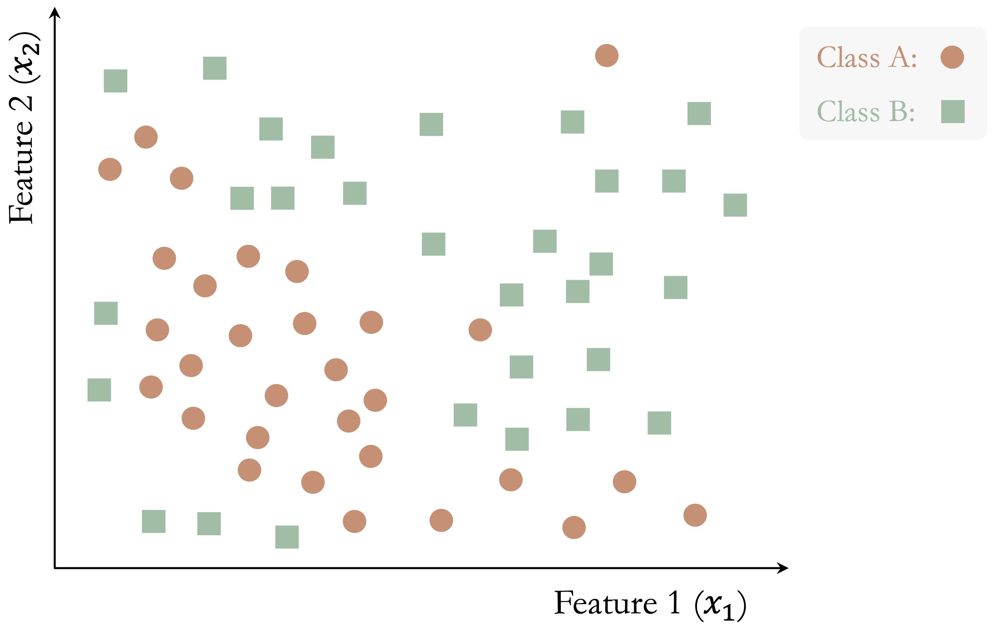
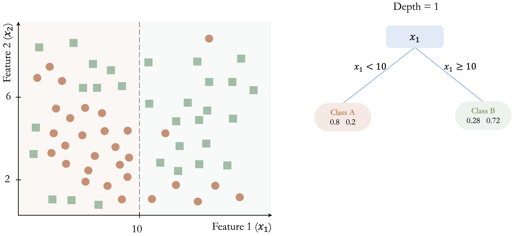
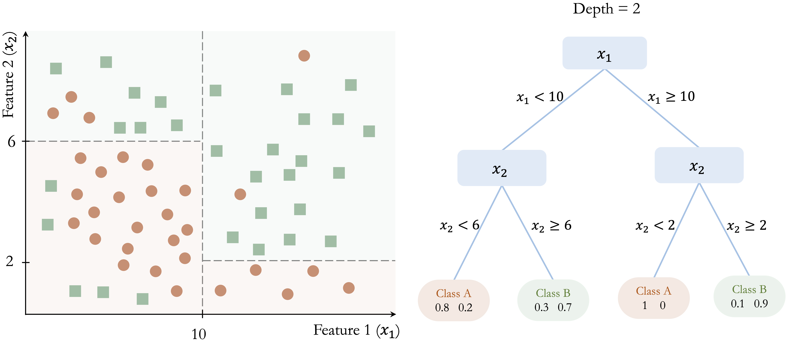
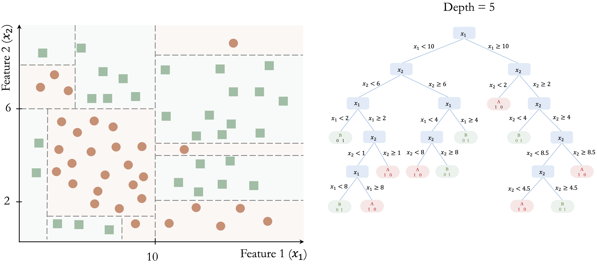
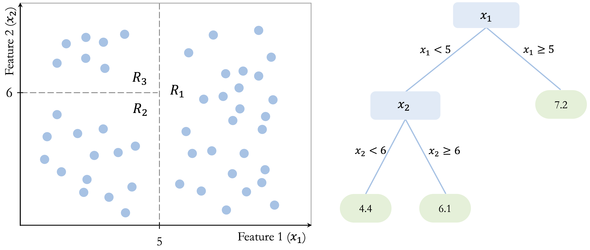
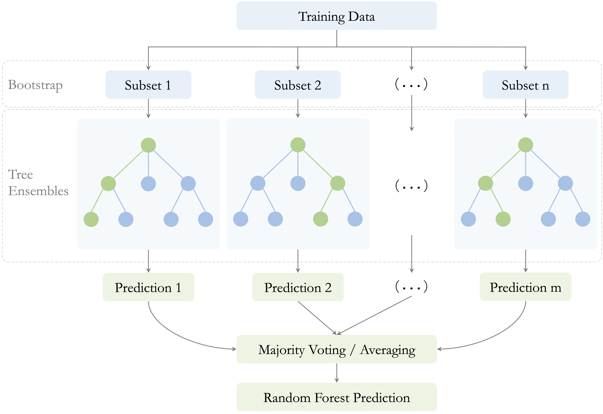

```{r echo=FALSE, message=FALSE, warning=FALSE}
source("_common.R")
```

# Decision Trees and Random Forests {#sec-chapter-trees}

::: {.content-visible when-format="pdf"}
\begin{chapterquote}
When one door closes, another opens.

\hfill — Alexander Graham Bell
\end{chapterquote}
:::

::::: {.content-visible when-format="html"}
:::: chapterquote
When one door closes, another opens.

::: author
— Alexander Graham Bell
:::
::::
:::::

Banks routinely evaluate loan applications using information such as income, age, credit history, and debt-to-income ratio. Online retailers, in turn, recommend products by learning patterns in customer preferences and past behavior. In many such settings, the decision process can be represented by a decision tree: a model that expresses predictions through a sequence of simple, interpretable rules.

Decision trees are widely used in applications such as medical diagnosis, fraud detection, customer segmentation, process automation, and numerical prediction. Their main strength lies in interpretability, since a fitted tree can be read as a transparent sequence of splitting rules. A limitation, however, is that a single tree may adapt too closely to random variation in the training data. Random forests address this instability by combining many trees, often producing predictions that are more stable and accurate.

In Chapter [-@sec-chapter-regression], we studied regression models for continuous outcomes, and in Chapter [-@sec-chapter-glm] we extended the regression framework to binary and count outcomes using generalized linear models. We now turn to a different family of supervised-learning methods. Rather than specifying a particular functional relationship between the predictors and the response, tree-based models construct predictions by recursively partitioning the predictor space. This allows them to accommodate nonlinear relationships and interactions while remaining relatively intuitive to interpret.

Tree-based methods therefore provide a flexible alternative to the regression and generalized linear modeling approaches developed in Chapters [-@sec-chapter-regression] and [-@sec-chapter-glm]. At the same time, they continue the Modeling stage of the Data Science Workflow introduced in Chapter [-@sec-chapter-intro-data-science], extending the range of supervised-learning methods available for both classification and regression problems.

### What This Chapter Covers {.unnumbered .unlisted}

Building on the regression and generalized linear modeling approaches developed in Chapters [-@sec-chapter-regression] and [-@sec-chapter-glm], this chapter introduces tree-based methods for supervised learning, with a focus on how they are constructed, interpreted, and applied in practice. We begin with the basic logic of recursive partitioning and examine how decision trees operate in both classification and regression settings. We then study two widely used tree-building algorithms, CART and C5.0, before introducing random forests as an ensemble extension designed to improve stability and predictive performance.

Using real datasets, we show how to interpret decision rules, control model complexity, compare competing tree-based models, and assess their predictive performance within the Model Evaluation stage of the Data Science Workflow. The chapter revisits the `adult` dataset introduced earlier in the book to compare CART, C5.0, and random forests in a common classification setting.

By the end of the chapter, readers will be able to fit and interpret decision trees for categorical and continuous outcomes, explain the main differences between CART, C5.0, and random forests, and assess the trade-off between interpretability and predictive performance when selecting a tree-based model.

## The Basics of Decision Trees

Decision trees provide a flexible framework for both classification and regression by partitioning the predictor space into smaller and more homogeneous regions. A useful way to understand them is to view them as models that divide the predictor space through a sequence of binary decisions. Starting from the full dataset, the algorithm repeatedly searches for a feature and a split point that improve the fit of the model. Each split creates two child nodes, and this process continues recursively, producing a hierarchical structure of decision rules.

Tree construction is *greedy*: at each node, the algorithm selects the split that gives the greatest immediate improvement according to a chosen criterion. These decisions are therefore made *locally*, one step at a time, rather than by searching for the globally best tree all at once. This strategy makes tree construction computationally efficient, but it also means that an early split that appears optimal locally may not lead to the best overall tree.

Because each split acts on a single predictor at a time, the resulting decision boundaries are *axis-aligned*. In a two-dimensional setting, each split creates either a vertical or a horizontal partition. This property makes decision trees easy to interpret, but it can also make them inefficient when the true boundary is oblique or curved. In the following subsections, we examine how this general framework is used in classification and regression settings.

### Classification Trees: Purity and Class Prediction {.unnumbered .unlisted}

In a classification tree, the response variable is categorical, and the goal is to create nodes that are as pure as possible with respect to the class labels. In other words, we want observations in the same node to belong predominantly to the same class. To achieve this, the algorithm evaluates candidate splits using a measure of node impurity, such as the *Gini Index* or *Entropy*. A good split is one that produces child nodes with more concentrated class membership than the parent node.

The following toy example illustrates how a classification tree is built step by step. Consider a dataset with two features ($x_1$ and $x_2$) and two classes (Class A and Class B), shown in @fig-tree-ex1-start. The dataset contains 50 observations, and the goal is to separate the two classes using a sequence of decision rules.

```{r fig-tree-ex1-start, echo = FALSE, out.width = "65%", fig.cap = "A toy dataset with two features and two classes (Class A and Class B) with 50 observations. This example illustrates the step-by-step construction of a classification tree."}

```

The algorithm begins by identifying the feature and threshold that provide the largest immediate improvement in class separation. In this example, the split at $x_1 = 10$ yields the greatest gain in class homogeneity: in the left region ($x_1 < 10$), 80% of observations belong to Class A, whereas in the right region ($x_1 \geq 10$), 72% belong to Class B.

This initial partition is shown in @fig-tree-ex1-depth-1. Although the split improves class separation, overlap between the classes remains. The algorithm therefore continues by searching for the best split within each resulting node, producing smaller and more homogeneous regions.

```{r fig-tree-ex1-depth-1, echo = FALSE, out.width = "100%", fig.cap = "Left: Decision boundary for a tree with depth 1. Right: The corresponding decision tree."}

```

In @fig-tree-ex1-depth-2, further splits at $x_2 = 6$ and $x_2 = 8$ refine the classification and improve the separation between the two classes.

```{r fig-tree-ex1-depth-2, echo = FALSE, out.width = "100%", fig.cap = "Left: Decision boundary for a tree with depth 2. Right: The corresponding decision tree."}

```

This recursive process continues until a stopping criterion is reached. @fig-tree-ex1-depth-5 shows a fully grown tree with depth 5, where the decision boundaries closely follow the training data.

```{r fig-tree-ex1-depth-5, echo = FALSE, out.width = "100%", fig.cap = "Left: Decision boundary for a tree with depth 5. Right: The corresponding decision tree."}

```

This example illustrates several important properties of classification trees. First, the tree is built through a sequence of locally optimal decisions rather than through a global search over all possible tree structures. Second, the model partitions the feature space into axis-aligned regions, which makes the resulting rules easy to interpret. Third, while this structure allows trees to capture nonlinear patterns, it can require many splits to approximate a simple non-axis-aligned boundary. Finally, as the tree becomes deeper, it may begin to capture noise in addition to meaningful structure, increasing the risk of overfitting.

Once the tree has been constructed, the same decision rules are used to classify new observations. A new case is routed from the root node down to a terminal leaf by evaluating the relevant splitting rules one by one. The predicted class is then determined by the majority class among the training observations in that terminal node.

For example, consider a new observation with $x_1 = 8$ and $x_2 = 4$ in @fig-tree-ex1-depth-2. Because $x_1 = 8$, the observation is sent to the left branch, where $x_1 < 10$. Then, since $x_2 = 4$, it moves to the lower-left branch, where $x_2 < 6$. The observation therefore reaches a terminal node that predicts Class A, with an estimated class probability of 80%.

This example shows why classification trees are often regarded as highly interpretable models. Each prediction can be traced back to a short sequence of explicit conditions, making it possible to explain not only the final class assignment but also the path used to obtain it. The terminal leaf summarizes the class composition of similar training observations, and that summary forms the basis of the prediction. This direct link between class prediction and decision rules is one of the main reasons classification trees remain attractive in applied data science.

### Regression Trees: Variance Reduction and Leaf Means {.unnumbered .unlisted}

When the response variable is continuous rather than categorical, the same tree-building framework leads to a *regression tree*. Like the regression models introduced in Chapter [-@sec-chapter-regression], regression trees are used to predict numerical outcomes. However, instead of describing the response through a single global equation, a regression tree partitions the predictor space into smaller regions and assigns a prediction within each region. Despite the name, a regression tree does not fit a regression equation inside each region. Rather, it predicts using the average response of the training observations that fall into the terminal leaf.

Trees for numerical prediction are built in much the same way as classification trees. Starting from the root node, the algorithm repeatedly searches for the split that produces the greatest improvement in homogeneity. However, when the response variable is continuous, homogeneity is no longer defined in terms of class purity. Instead, regression trees evaluate candidate splits according to how much they reduce variation in the response within the resulting child nodes, often using criteria based on within-node variance or residual sum of squares. The goal is therefore to create nodes in which the response values are as similar as possible.

Figure [-@fig-tree-ex-regression-tree] illustrates this idea in a simple two-dimensional example. The tree partitions the predictor space into three terminal regions: $R_1$, defined by $x_1 > 5$, with a mean response of 7.2; $R_2$, defined by $x_1 < 5$ and $x_2 < 6$, with a mean response of 4.4; and $R_3$, defined by $x_1 < 5$ and $x_2 > 6$, with a mean response of 6.1. These values show that a regression tree predicts by assigning each region a constant value based on the training observations that fall within it. Although the figure uses a simple toy example, the same idea applies to real predictive tasks with continuous outcomes, such as the regression problems studied in Chapter [-@sec-chapter-regression].

```{r fig-tree-ex-regression-tree, echo = FALSE, out.width = "100%", fig.cap = "Left: Decision boundary for a regression tree with depth 2. Right: The corresponding tree structure with two internal nodes and three terminal leaves. The value in each leaf is the mean response of the observations assigned to that leaf."}

```

Once the tree has been constructed, prediction is straightforward. A new observation is routed through the tree until it reaches a terminal leaf, and the predicted value is taken to be the average response of the training observations in that leaf. For example, an observation with $x_1 = 4$ and $x_2 = 3$ would fall into region $R_2$ and receive a predicted value of 4.4, whereas an observation with $x_1 = 7$ would fall into region $R_1$ and receive a predicted value of 7.2. In this way, a regression tree approximates a continuous response by dividing the predictor space into regions and assigning a constant prediction within each region.

Like classification trees, regression trees are flexible and easy to interpret. They can capture nonlinear relationships and interactions without requiring a prespecified functional form. At the same time, they are still built through greedy, locally chosen splits and produce axis-aligned partitions, so they share the same limitations related to instability, inefficiency for oblique boundaries, and overfitting.

### Controlling Tree Complexity {.unnumbered .unlisted}

As discussed in Chapter [-@sec-chapter-evaluation], increasing model complexity can improve fit to the training data while reducing generalization to new observations. Decision trees are particularly susceptible to this problem because recursive splitting can continue until the tree begins to capture increasingly small and unstable patterns in the training data. Controlling tree complexity is therefore an important part of tree-based modeling.

One common strategy is *pre-pruning*, which restricts tree growth during training. The algorithm stops splitting when predefined limits are reached, such as a maximum tree depth, a minimum number of observations in a node, or too little improvement in the splitting criterion. By imposing these constraints early, pre-pruning helps prevent the tree from becoming unnecessarily complex.

A second strategy is *post-pruning*. In this approach, the tree is first allowed to grow to a larger size and is then simplified by removing branches that contribute little to predictive performance. The goal is to retain the main structure of the tree while discarding splits that primarily reflect noise in the training data. Post-pruning often produces smaller trees that are easier to interpret and better able to generalize.

The choice between pre-pruning and post-pruning depends on the modeling objective and the desired balance between simplicity and predictive performance. CART provides a systematic framework for combining recursive splitting with tree-specific complexity control, including cost-complexity pruning, which we examine next.

## How the CART Algorithm Builds Trees

*CART* (Classification and Regression Trees), introduced by Breiman et al. in 1984 [@breiman1984classification], is one of the most influential algorithms for constructing decision trees and remains widely used in both research and practice. Because it provides a unified framework for both classification and regression, CART serves as a natural foundation for understanding tree-based models in greater detail.

A defining feature of CART is that it constructs *binary trees*: each internal node splits the data into exactly two child nodes. As in the general decision-tree framework introduced earlier, tree construction proceeds recursively by selecting, at each node, the feature and split point that yield the greatest immediate improvement according to a chosen objective function. The goal is to produce child nodes that are better separated with respect to the response than the parent node.

For classification tasks, CART typically measures node impurity using the *Gini index*, defined as $$
Gini = 1 - \sum_{i=1}^k p_i^2,
$$ where $p_i$ denotes the proportion of observations in the node belonging to class $i$, and $k$ is the number of classes. The Gini index is small when most observations in a node belong to the same class and equals zero when the node is perfectly pure. CART therefore selects the split that produces the largest reduction in impurity, yielding child nodes with more concentrated class membership.

For regression tasks, CART uses the same recursive binary-splitting structure, but the response variable is continuous rather than categorical. In this setting, candidate splits are evaluated according to how much they reduce variation in the response within the resulting child nodes. A common criterion is the residual sum of squares (RSS), $$
RSS = \sum_{i \in R_1} (y_i - \bar{y}_{R_1})^2 + \sum_{i \in R_2} (y_i - \bar{y}_{R_2})^2,
$$ where $R_1$ and $R_2$ denote the two child nodes created by a candidate split, and $\bar{y}_{R_1}$ and $\bar{y}_{R_2}$ are the mean response values within those nodes. CART selects the split that minimizes this quantity, thereby grouping together observations with more similar outcome values. The prediction at a terminal leaf is then the mean response of the training observations assigned to that node.

Because CART applies this splitting process recursively and greedily, it can generate very large trees that fit the training data extremely well. While this often reduces training error, it also increases the risk of overfitting. To address this problem, CART commonly uses *cost-complexity pruning*: a large tree is first grown and then simplified by removing branches that add little predictive value. This process balances model fit against tree size, often producing a smaller tree that is easier to interpret and better able to generalize to new data.

CART is widely used because of its interpretability, flexibility, and ability to handle both numerical and categorical predictors with relatively little model-specific preprocessing. Unlike distance-based methods such as k-nearest neighbors, tree-based models generally do not require feature scaling or dummy encoding. However, the broader preparation principles introduced in Chapter [-@sec-chapter-data-preparation], including careful handling of missing values, redundant predictors, categorical levels, and train–test separation, still apply. The resulting tree provides a transparent set of decision rules and can capture nonlinear relationships and interactions automatically.

At the same time, CART has important limitations. Because splits are chosen greedily and locally, a split that appears optimal at one stage may not lead to the best overall tree. In addition, single trees can be unstable: small changes in the training data may lead to different splits and therefore different predictions.

Despite these limitations, CART remains a foundational method in tree-based learning. It makes the core ideas of binary recursive partitioning, impurity reduction, variance reduction, and pruning concrete in a form that is both practical and interpretable. In Section [-@sec-tree-case-study], we return to these ideas and show how the CART algorithm can be implemented in R on the `adult` dataset. This foundation also helps motivate the more advanced methods introduced next: C5.0 and random forests.

## C5.0: More Flexible Decision Trees {#sec-tree-c50}

C5.0, developed by J. Ross Quinlan, extends earlier decision-tree algorithms such as ID3 and C4.5. In this chapter, we consider C5.0 as a method for classification trees. Compared with CART, C5.0 provides additional flexibility in tree construction and includes procedures for controlling tree complexity.

One important distinction between C5.0 and CART concerns the structure of the resulting trees. Whereas CART restricts splits to be binary, C5.0 can form more flexible partitions, particularly for categorical predictors. This flexibility can sometimes produce more compact tree structures, although a smaller tree is not necessarily easier to interpret.

A second distinction concerns how candidate splits are evaluated. Whereas CART commonly uses the Gini index for classification, C5.0 builds on entropy-based ideas developed in earlier decision-tree algorithms. Entropy measures uncertainty in the class labels: it is high when several classes are mixed within a node and low when one class dominates. For a node containing $k$ classes, entropy is defined as $$
Entropy(T) = - \sum_{i=1}^k p_i \log_2(p_i),
$$ where $p_i$ denotes the proportion of observations in the node belonging to class $i$.

When a candidate split $S$ partitions the observations into subsets $T_1, \dots, T_c$, the entropy of the resulting subsets can be summarized as a weighted average, $$
H_S(T) = \sum_{i=1}^c \frac{|T_i|}{|T|} \times Entropy(T_i),
$$ and the corresponding information gain is $$
gain(S) = Entropy(T) - H_S(T).
$$ A larger information gain indicates a greater reduction in class uncertainty and therefore provides the basic intuition behind entropy-based splitting. C5.0 builds on this framework while incorporating additional refinements to tree construction and pruning.

These features make C5.0 a useful alternative to CART for classification problems. It can accommodate categorical predictors flexibly and includes built-in pruning procedures to control tree complexity. The implementation available through the **C50** package also provides options such as predictor winnowing, which can be used to remove predictors that contribute little to the model.

Like other single-tree methods, however, C5.0 can still produce complex trees and can be sensitive to changes in the training data. It therefore does not fully overcome the instability associated with individual decision trees.

Overall, C5.0 extends the classification-tree framework through flexible tree construction, entropy-based splitting principles, and pruning. Relative to CART, it offers a different balance between flexibility and interpretability. In Section [-@sec-tree-case-study], we apply C5.0 to the `adult` dataset and compare it with CART and random forests. The remaining instability of single trees also provides a natural motivation for random forests, which improve stability by aggregating predictions across many trees.

## Random Forests

Random forests are an ensemble learning method that combines the predictions of many decision trees in order to improve stability and predictive performance. Although a single decision tree can be flexible and easy to interpret, it may also have high variance: small changes in the training data can lead to very different trees. Random forests reduce this instability by averaging across a large collection of diverse trees. A useful way to understand random forests is to view them as an extension of *bagging* (bootstrap aggregation). In bagging, many trees are grown on different bootstrap samples of the training data and then combined, which already reduces variance relative to a single tree. Random forests go one step further by also randomizing the set of predictors considered at each split, thereby increasing diversity among the trees and strengthening the benefits of aggregation. Instead of relying on one tree grown from one sample, random forests generate many trees under slightly different conditions and then combine their predictions. As a result, the final model is usually more robust and better able to generalize to new data.

Two sources of randomness are essential to this process, as illustrated in Figure [-@fig-tree-random-forest]. First, each tree is trained on a bootstrap sample of the training data, drawn with replacement. Second, at each split, only a random subset of predictors is considered as candidate variables. Together, these two mechanisms encourage diversity across the trees and reduce the chance that the entire model becomes dominated by a small number of strong predictors or by idiosyncratic patterns in the training data. This second source of randomness is especially important when some predictors are much stronger than others. Without it, many trees may repeatedly split on the same dominant variables near the top of the tree, making the ensemble less diverse. By forcing different trees to consider different subsets of predictors, random forests reduce correlation among the trees and make averaging more effective.

```{r fig-tree-random-forest, echo = FALSE, out.width = "100%", fig.cap = "Schematic representation of the random forest algorithm. The training data are repeatedly resampled using bootstrap sampling to create multiple subsets, each used to grow a different decision tree. Predictions from the individual trees are then combined by majority voting for classification or averaging for regression to produce the final random forest prediction."}

```

The number of predictors considered at each split is controlled by a tuning parameter commonly denoted by $mtry$. Smaller values of $mtry$ generally increase diversity among the trees, which can reduce correlation between them and improve the benefits of aggregation. Larger values make individual trees more similar to one another and closer to standard bagged trees. Choosing $mtry$ therefore affects the balance between tree strength and forest diversity.

After training, predictions are aggregated across the individual trees. In classification problems, the final predicted class is determined by majority voting. In regression problems, the final prediction is obtained by averaging the predictions from all trees. In both settings, aggregation reduces variance by smoothing over the instability of individual trees.

An important practical feature of random forests is that they provide a built-in estimate of predictive performance through the *out-of-bag (OOB) error*. Because each tree is trained on a bootstrap sample, some training observations are left out of that sample. These omitted observations are called *out-of-bag* observations for that tree. After the forest is grown, each observation can be predicted using only the trees for which it was out-of-bag, yielding an internal estimate of prediction error without requiring a separate validation set. This makes random forests especially convenient in practice, particularly when data are limited. However, when a separate test set is available, it is still preferable to use that test set for final performance assessment.

Random forests also provide measures of variable importance, which summarize how strongly each predictor contributes to the fitted model. These measures can be useful for identifying variables that appear influential and for gaining an initial sense of which features deserve closer attention. At the same time, they should be interpreted with care: variable importance reflects the role of predictors within the fitted forest, and it does not by itself imply causation or guarantee stability when predictors are highly correlated.

Taken together, these features help explain why random forests are widely used in practice, but they also reveal important trade-offs. Random forests often achieve strong predictive performance, especially in settings with complex interactions, nonlinear relationships, or high-dimensional feature spaces. They are generally more stable than single decision trees and often less prone to overfitting.

These advantages come with costs. Random forests are much less interpretable than individual trees, since a prediction is based on the aggregation of many decision rules rather than on a single transparent path. They can also be computationally more demanding, especially when the number of trees is large or the dataset contains many predictors. Moreover, although variable importance measures are useful, they should be interpreted with caution and not mistaken for evidence of causal influence.

Despite these limitations, random forests have become a standard tool in applied data science because they offer a strong balance between flexibility, predictive accuracy, and robustness. They retain the nonlinear modeling power of decision trees while substantially reducing the instability of single-tree models. In Section [-@sec-tree-case-study], we return to these ideas and show how random forests can be implemented in R on the `adult` dataset, including how to examine the effect of the number of trees and how to visualize variable importance.

## Case Study: Who Can Earn More Than \$50K Per Year? {#sec-tree-case-study}

Predicting income categories is a common classification task in fields such as finance, marketing, and public policy. In this case study, we use tree-based methods to classify whether an individual's annual income exceeds \$50K.

The analysis is based on the `adult` dataset, a widely used benchmark derived from US Census data and available in the **liver** package. The dataset was introduced and prepared earlier in Section [-@sec-data-prep-case-adult] and contains demographic and employment-related variables such as education, working hours, marital status, and occupation that may be associated with income.

Building on the preparation principles established in Chapter [-@sec-chapter-data-preparation], we revisit the dataset to focus on the Modeling and Model Evaluation stages of the Data Science Workflow introduced in Chapter [-@sec-chapter-intro-data-science] and illustrated in @fig-ds_DSW. Using a common set of prepared data and predictors, we compare three tree-based methods: CART, C5.0, and random forests. This allows us to examine how interpretability, model flexibility, and predictive performance differ between single-tree and ensemble approaches.

### Overview of the Dataset {.unnumbered .unlisted}

The `adult` dataset, included in the **liver** package, is a widely used benchmark for income classification. It contains demographic, educational, employment, financial, and household information derived from US Census data. We begin by loading the dataset and examining its structure:

```{r}
library(liver)

data(adult)

str(adult)
```

The dataset contains `r nrow(adult)` observations and `r ncol(adult)` variables. The response variable, `income`, is a binary factor with two levels: `<=50K` and `>50K`. The predictors include both numerical and categorical variables, making the dataset suitable for illustrating tree-based methods that can work with mixed predictor types.

The dataset and its preparation were examined in detail in Section [-@sec-data-prep-case-adult]. Here, we reuse that preparation framework and focus on fitting and comparing CART, C5.0, and random forest models.

### Data Preparation for Modeling {.unnumbered .unlisted}

The `adult` dataset was prepared for modeling in Section [-@sec-data-prep-case-adult], where we established the train–test split and addressed missing values, redundant representations, and categorical levels. We follow the same preparation strategy here so that the models in this chapter are trained and evaluated using a consistent version of the data. In particular, all data-dependent preparation decisions are based on the training data, while the test set remains reserved for final Model Evaluation.

Tree-based models require relatively little additional model-specific preparation. Unlike distance-based methods such as k-nearest neighbors, decision trees and random forests do not require numerical predictors to be rescaled or categorical predictors to be converted to dummy variables. The common preparation principles from Chapter [-@sec-chapter-data-preparation], however, still apply.

For the analyses that follow, we use the same set of predictors across CART, C5.0, and random forests:

```{r}
formula = income ~ age + workclass + education_num + marital_status + occupation + gender + capital_gain + capital_loss + hours_per_week + native_country
```

The predictors cover demographic, educational, employment, and financial characteristics. As discussed in Section [-@sec-data-prep-case-adult], redundant representations are excluded from the common prepared data before modeling. Using the same prepared training and test sets and the same predictor set across all three methods allows differences in model behavior and predictive performance to be attributed more directly to the modeling approach rather than to differences in data preparation.

```{r echo=FALSE}
set.seed(42)

splits <- partition(data = adult, ratio = c(0.8, 0.2))

adult_train <- splits$part1
adult_test  <- splits$part2

adult_train_prepared <- adult_train
adult_test_prepared  <- adult_test

### Making Missingness Explicit and Handling Missing Values {.unnumbered .unlisted}

adult_train_prepared[adult_train_prepared == "?"] <- NA
adult_test_prepared[adult_test_prepared == "?"] <- NA

workclass_pool <- adult_train_prepared$workclass[!is.na(adult_train_prepared$workclass)]

occupation_pool <- adult_train_prepared$occupation[!is.na(adult_train_prepared$occupation)]

country_pool <- adult_train_prepared$native_country[!is.na(adult_train_prepared$native_country)]


library(Hmisc)

set.seed(42)

adult_train_prepared$workclass <- impute(adult_train_prepared$workclass, fun = "random")

adult_train_prepared$occupation <- impute(adult_train_prepared$occupation, fun = "random")

adult_train_prepared$native_country <- impute(adult_train_prepared$native_country, fun = "random")

adult_test_prepared$workclass <- impute(adult_test_prepared$workclass, fun = sample(workclass_pool, sum(is.na(adult_test_prepared$workclass)), replace = TRUE))

adult_test_prepared$occupation <- impute(adult_test_prepared$occupation, fun = sample(occupation_pool, sum(is.na(adult_test_prepared$occupation)), replace = TRUE))

adult_test_prepared$native_country <- impute(adult_test_prepared$native_country, fun = sample(country_pool, sum(is.na(adult_test_prepared$native_country)), replace = TRUE))

adult_train_prepared <- droplevels(adult_train_prepared)
adult_test_prepared  <- droplevels(adult_test_prepared)

### Preparing Categorical Features {.unnumbered .unlisted}

library(forcats)

Europe <- c( "France", "Germany", "Greece", "Hungary", "Ireland", "Italy", "Netherlands", "Poland", "Portugal", "United-Kingdom", "Yugoslavia")

North_America <- c("United-States", "Canada", "Outlying-US(Guam-USVI-etc)")

Latin_America <- c("Mexico", "El-Salvador", "Guatemala", "Honduras", "Nicaragua", "Cuba", "Dominican-Republic", "Puerto-Rico", "Colombia", "Ecuador", "Peru")

Caribbean <- c("Jamaica", "Haiti", "Trinidad&Tobago")

Asia <- c("Cambodia", "China", "Hong-Kong", "India", "Iran", "Japan", "Laos", "Philippines", "South", "Taiwan", "Thailand", "Vietnam")

adult_train_prepared$native_country <- fct_collapse(
  adult_train_prepared$native_country,
  "Europe" = Europe,
  "North America" = North_America,
  "Latin America" = Latin_America,
  "Caribbean" = Caribbean,
  "Asia" = Asia,
  other_level = "Other")

adult_test_prepared$native_country <- fct_collapse(
  adult_test_prepared$native_country,
  "Europe" = Europe,
  "North America" = North_America,
  "Latin America" = Latin_America,
  "Caribbean" = Caribbean,
  "Asia" = Asia,
  other_level = "Other")

adult_train_prepared$workclass <- fct_collapse(
  adult_train_prepared$workclass,
  "Not in paid employment" = c("Never-worked", "Without-pay"))

adult_test_prepared$workclass <- fct_collapse(
  adult_test_prepared$workclass,
  "Not in paid employment" = c("Never-worked", "Without-pay"))
```

The preparation steps above produce two objects that will be used throughout the remainder of the case study: `adult_train_prepared` for model development and `adult_test_prepared` for final Model Evaluation. All three tree-based methods will be fitted using `adult_train_prepared`, while `adult_test_prepared` will remain untouched until their predictive performance is evaluated.

### Building a Decision Tree with CART {.unnumbered .unlisted}

We begin the modeling stage by fitting a decision tree using the CART algorithm. In R, CART is implemented in the **rpart** package, which provides tools for constructing, visualizing, and evaluating decision trees.

We start by loading the package and fitting a classification tree using the training data:

```{r}
library(rpart)

cart_model = rpart(formula = formula, data = adult_train_prepared, method = "class")
```

The argument `formula` defines the relationship between the response variable (`income`) and the selected predictors, while `data` specifies the training set used for model fitting. Setting `method = "class"` indicates that the task is classification. The same framework can also be applied to regression and other modeling contexts by selecting an appropriate method, illustrating the generality of the CART approach. This fitted model serves as a baseline against which more flexible tree-based methods, including C5.0 and random forests, will later be compared.

To better understand the learned decision rules, we visualize the fitted tree using the **rpart.plot** package:

```{r out.width = "100%"}
#| label: fig-tree-case-adult
#| fig-cap: A classification tree built using the CART algorithm on the `adult` dataset to classify individuals according to their likelihood of earning more than \$50K per year. Terminal nodes display predicted class and class probabilities, illustrating CART’s rule-based structure.

library(rpart.plot)

rpart.plot(cart_model, type = 4, extra = 104)
```

The argument `type = 4` places the splitting rules inside the nodes, making the tree structure easier to interpret. The argument `extra = 104` adds the predicted class and the corresponding class probability at each terminal node.

When the tree is too large to be displayed clearly in graphical form, a text-based representation can be useful. The `print()` function provides a concise summary of the tree structure, listing the nodes, splits, and predicted outcomes:

```{r}
print(cart_model)
```

Having examined the tree structure, we can now interpret how the model generates predictions. The fitted tree contains four internal decision nodes and five terminal leaves. Of the ten candidate predictors, the algorithm selects three variables (`marital_status`, `capital_gain`, and `education_num`) as relevant for predicting income. The root node is defined by `marital_status`, indicating that marital status provides the strongest initial separation in the data.

Each terminal leaf represents a distinct subgroup of individuals defined by a sequence of decision rules. In the visualization, blue leaves correspond to predictions of income less than or equal to \$50K, whereas green leaves correspond to predictions above this threshold.

As an example, the rightmost leaf identifies individuals who are married and have at least 13 years of formal education (`education_num >= 13`). This subgroup accounts for approximately 14% of the observations, of which about 70% earn more than \$50K annually. The associated classification error for this leaf is therefore 0.30, computed as $1 - 0.70$.

This example illustrates how decision trees partition the population into interpretable segments based on a small number of conditions. In the next section, we apply the C5.0 algorithm to the same dataset and compare its structure and predictive behavior with that of the CART model.

> *Practice:* In the decision tree shown in this subsection, focus on the leftmost terminal leaf. Which sequence of decision rules defines this group, and how should its predicted income class and class probability be interpreted?

### Building a Decision Tree with C5.0 {.unnumbered .unlisted}

Having examined how CART constructs decision trees, we now turn to C5.0, an algorithm designed to produce more flexible and often more compact tree structures. In this part of the case study, we apply C5.0 to the same training data in order to contrast its behavior with that of the CART model.

In R, C5.0 is implemented in the **C50** package. Using the same model formula and training set as before, we fit a C5.0 decision tree as follows:

```{r}
library(C50)

C50_model = C5.0(formula, data = adult_train_prepared)
```

The argument `formula` specifies the relationship between the response variable (`income`) and the predictors, while `data` identifies the training dataset. Using the same inputs as in the CART model ensures that differences in model behavior can be attributed to the algorithm rather than to changes in predictors or data.

Compared to CART, C5.0 allows multi-way splits, assigns weights to predictors, and applies entropy-based splitting criteria. These features often result in deeper but more compact trees, particularly when categorical variables with many levels are present.

Because the resulting tree can be relatively large, we summarize the fitted model rather than plotting its full structure. The `print()` function provides a concise overview:

```{r}
print(C50_model)
```

The output reports key characteristics of the fitted model, including the number of predictors, the number of training observations, and the total number of decision nodes. In this case, the tree contains 74 decision nodes, substantially more than the CART model. This increased complexity reflects C5.0’s greater flexibility in partitioning the feature space. In the next section, we move beyond single-tree models and introduce random forests, an ensemble approach that combines many decision trees to improve predictive performance and robustness.

> *Practice:* Repartition the `adult` dataset into a 70% training set and a 30% test set. Fit CART and C5.0 trees and compare their structures with those obtained earlier. Which model appears more sensitive to the change in training data, and why?

### Building a Random Forest Model {.unnumbered .unlisted}

Single decision trees are easy to interpret but can be unstable, as small changes in the training data may lead to substantially different tree structures. Random forests address this limitation by aggregating many decision trees, each trained on a different bootstrap sample of the data and using different subsets of predictors. This ensemble strategy typically improves predictive accuracy and reduces overfitting.

In R, random forests are implemented in the **randomForest** package. Using the same model formula and training data as before, we fit a random forest classifier with 100 trees:

```{r}
library(randomForest)

forest_model = randomForest(formula = formula, data = adult_train_prepared, ntree = 100)
```

The argument `ntree` specifies the number of trees grown in the ensemble. Increasing this value generally improves stability and predictive performance, although gains tend to diminish beyond a certain point.

One advantage of random forests is that they provide measures of variable importance, which summarize how strongly each predictor contributes to model performance. We visualize these measures using the following command:

```{r out.width = "70%"}
varImpPlot(forest_model, col = "#377EB8", 
           main = "Variable Importance in Random Forest Model")
```

The resulting plot ranks predictors according to their importance. In this case, `marital_status` again emerges as the most influential variable, followed by `capital_gain` and `education_num`, consistent with the earlier tree-based models.

Random forests also allow us to examine how classification error evolves as the number of trees increases:

```{r}
plot(forest_model, col = "#377EB8",
     main = "Random Forest Error Rate vs. Number of Trees")
```

The error rate stabilizes after approximately 40 trees, indicating that additional trees contribute little improvement. This behavior illustrates how random forests balance flexibility with robustness by averaging across many diverse trees.

Having fitted CART, C5.0, and random forest models using the same predictors and data split, we are now in a position to compare their predictive performance systematically. In the next section, we evaluate these models side by side using confusion matrices, ROC curves, and AUC values.

### Model Evaluation and Comparison {.unnumbered .unlisted}

With the CART, C5.0, and Random Forest models fitted, we now evaluate their performance on the test set to assess how well they generalize to unseen data. Model evaluation allows us to distinguish between models that capture meaningful patterns and those that primarily reflect the training data.

Following the evaluation framework introduced in Chapter [-@sec-chapter-evaluation], we compare the models using confusion matrices, ROC curves, and Area Under the Curve (AUC) values. These tools provide complementary perspectives: confusion matrices summarize classification errors at a given threshold, while ROC curves and AUC values assess performance across all possible classification thresholds.

We begin by generating predicted class probabilities for the test set using the `predict()` function. For all three models, we request probabilities rather than hard class labels by specifying `type = "prob"`:

```{r}
cart_probs   = predict(cart_model,   adult_test_prepared, type = "prob")[, "<=50K"]

C50_probs    = predict(C50_model,    adult_test_prepared, type = "prob")[, "<=50K"]

forest_probs = predict(forest_model, adult_test_prepared, type = "prob")[, "<=50K"]
```

The `predict()` function returns a matrix of class probabilities for each observation. Extracting the column corresponding to the `<=50K` class allows us to evaluate the models using threshold-dependent and threshold-independent metrics. In the following subsections, we first examine confusion matrices to analyze misclassification patterns and then use ROC curves and AUC values to compare overall discriminatory performance.

#### Confusion Matrix and Classification Errors {.unnumbered .unlisted}

Confusion matrices provide a direct way to examine how well the models distinguish between high earners and others, as well as the types of classification errors they make. We generate confusion matrices for each model using the `conf.mat.plot()` function from the **liver** package, which produces compact graphical summaries:

::: {#fig-tree-conf-plots layout-ncol="3"}
```{r out.width = "90%"}
test_labels = adult_test_prepared$income

conf.mat.plot(cart_probs, test_labels, cutoff = 0.5, reference = "<=50K", main = "CART Prediction")
```

```{r out.width = "90%"}
 
conf.mat.plot(C50_probs, test_labels, cutoff = 0.5, reference = "<=50K", main = "C5.0 Prediction")
```

```{r out.width = "90%"}
 
conf.mat.plot(forest_probs, test_labels, cutoff = 0.5, reference = "<=50K", main = "Random Forest Prediction")
```

Confusion matrices for CART, C5.0, and Random Forest models using a cutoff value of $0.5$. Each matrix summarizes true positives, true negatives, false positives, and false negatives for the corresponding model.
:::

In these plots, the cutoff determines the decision threshold between the two income classes. With `cutoff = 0.5`, observations with a predicted probability of at least 0.5 for the `<=50K` class are classified as `<=50K`; otherwise, they are classified as `>50K`. The argument `reference = "<=50K"` specifies the positive class.

Because confusion matrices depend on a specific cutoff, they reflect model performance at a particular operating point rather than overall discriminatory ability. Changing the cutoff alters the balance between different types of classification errors, such as false positives and false negatives.

In practice, a fixed cutoff of 0.5 is not always optimal. A more principled approach is to select the cutoff using a validation set (see Section [-@sec-data-prep-cross-validation]), optimizing a metric such as the F1-score or balanced accuracy. Once chosen, this cutoff can be applied to the test set to obtain an unbiased estimate of generalization performance.

To examine the numeric confusion matrices directly, we use the `conf.mat()` function:

```{r echo=TRUE}
conf.mat(cart_probs, test_labels, cutoff = 0.5, reference = "<=50K")

conf.mat(C50_probs, test_labels, cutoff = 0.5, reference = "<=50K")

conf.mat(forest_probs, test_labels, cutoff = 0.5, reference = "<=50K")
```

```{r echo=FALSE}
cart_conf   = conf.mat(cart_probs, test_labels, cutoff = 0.5, reference = "<=50K")
C50_conf    = conf.mat(C50_probs, test_labels, cutoff = 0.5, reference = "<=50K")
forest_conf = conf.mat(forest_probs, test_labels, cutoff = 0.5, reference = "<=50K")
```

Using this cutoff, the total number of correctly classified observations is `r cart_conf[1, 1] + cart_conf[2, 2]` for CART, `r C50_conf[1, 1] + C50_conf[2, 2]` for C5.0, and `r forest_conf[1, 1] + forest_conf[2, 2]` for Random Forest. Among the three models, C5.0 yields the highest number of correct classifications at this threshold, reflecting its greater flexibility in partitioning the feature space.

> *Practice:* Change the cutoff from 0.5 to 0.6 and re-run the `conf.mat.plot()` and `conf.mat()` functions. How do the confusion matrices change, and what trade-offs between sensitivity and specificity become apparent?

#### ROC Curve and AUC {.unnumbered .unlisted}

Confusion matrices evaluate model performance at a single decision threshold. To assess performance across all possible thresholds, we turn to the ROC curve and the Area Under the Curve (AUC). These tools summarize a model’s ability to discriminate between the two income classes independently of any specific cutoff value.

We compute ROC curves for all three models using the **pROC** package:

```{r}
library(pROC)

cart_roc   = roc(test_labels, cart_probs)
C50_roc    = roc(test_labels, C50_probs)
forest_roc = roc(test_labels, forest_probs)
```

To facilitate comparison, we display all three ROC curves on a single plot:

```{r out.width = "80%"}
ggroc(list(cart_roc, C50_roc, forest_roc), size = 0.9) +
  scale_color_manual(values = c("#377EB8", "#E66101", "#4DAF4A"),
      labels = c(paste("CART; AUC =", round(auc(cart_roc), 3)),
          paste("C5.0; AUC =", round(auc(C50_roc), 3)),
          paste("Random Forest; AUC =", round(auc(forest_roc), 3)))) +
  ggtitle("ROC Curves with AUC for Three Models") + 
  theme(legend.title = element_blank(), legend.position = c(.7, .3))
```

The ROC curves illustrate how each model trades off sensitivity and specificity across different threshold values. Curves closer to the top-left corner indicate stronger discriminatory performance.

The AUC values provide a concise summary of these curves. CART achieves an AUC of `r round(auc(cart_roc), 3)`, C5.0 an AUC of `r round(auc(C50_roc), 3)`, and Random Forest an AUC of `r round(auc(forest_roc), 3)`. Among the three models, Random Forest attains the highest AUC, although the difference relative to C5.0 is small.

These results highlight that, while ensemble methods often deliver improved discrimination, the gains over well-tuned single-tree models may be modest. Consequently, model selection should consider not only predictive performance but also factors such as interpretability, computational cost, and ease of deployment.

> *Practice:* Repartition the `adult` dataset into a 70% training set and a 30% test set. Compute ROC curves and AUC values for the CART, C5.0, and Random Forest models. Compare them with the earlier results. How sensitive are the AUC values to the choice of data split?

This case study illustrated how different tree-based models behave when applied to the same real-world classification problem. By keeping data preparation, predictors, and evaluation procedures fixed, we were able to isolate the strengths and limitations of CART, C5.0, and Random Forests. These observations motivate the broader lessons summarized in the following section.

## Chapter Summary and Takeaways {#sec-tree-summary}

In this chapter, we examined tree-based models as flexible, non-parametric approaches to supervised learning. Decision trees partition the predictor space through recursive, greedy splitting and can be used for both classification and regression. Classification trees seek increasingly homogeneous class labels, whereas regression trees group observations with similar numerical outcomes and predict using leaf means. Unlike the regression and generalized linear modeling approaches developed in Chapters [-@sec-chapter-regression] and [-@sec-chapter-glm], tree-based models do not require a prespecified functional relationship between predictors and the response.

We then studied two important single-tree algorithms. CART uses binary recursive partitioning for both classification and regression, with splitting criteria based on impurity reduction for categorical outcomes and variation reduction for continuous outcomes. C5.0 provides an alternative approach for classification based on entropy-related splitting principles and procedures for controlling tree complexity. Both methods illustrate how decision trees can translate complex relationships into explicit decision rules.

Random forests extend this framework by combining many trees grown from bootstrap samples while considering random subsets of predictors at each split. Aggregating predictions across trees reduces the instability of individual trees and often improves predictive performance, although at the cost of the direct interpretability offered by a single decision tree. This illustrates an important trade-off between model transparency and predictive performance.

Through the `adult` income-classification case study, we applied CART, C5.0, and random forests to the same prepared training and test data, following the preparation principles established in Chapter [-@sec-chapter-data-preparation]. This common setup allowed the models to be compared consistently during Model Evaluation and showed that model choice should consider both predictive performance and practical considerations such as interpretability. In the next chapter, we extend the Modeling toolkit to neural networks, which provide additional flexibility for representing complex nonlinear relationships while introducing new challenges in tuning and interpretation.

## Exercises {#sec-tree-exercises}

These exercises reinforce the main ideas of the chapter through conceptual questions and hands-on classification and regression tasks in R. The datasets used are available in the **liver** package.

#### Conceptual Questions {.unnumbered .unlisted}

1.  Describe the basic structure of a decision tree and explain how a tree makes a prediction for a new observation.

2.  Explain the difference between a classification tree and a regression tree. What is predicted at a terminal leaf in each case?

3.  Explain the role of splitting criteria in decision trees. How do criteria such as the Gini index or entropy differ from criteria based on variance reduction or residual sum of squares?

4.  Explain why decision trees are prone to overfitting. Why does tree depth matter for generalization?

5.  Define pre-pruning and post-pruning. How do they differ in terms of when and how tree complexity is controlled?

6.  Explain the bias-variance trade-off in the context of single decision trees and random forests.

7.  Compare a classification tree with logistic regression for a binary classification problem. Discuss their strengths and limitations in terms of interpretability, flexibility, and predictive performance.

8.  Compare a regression tree with a linear regression model. How do their assumptions, flexibility, and predictions differ?

9.  Explain how bagging (bootstrap aggregation) reduces variance. Why is bagging particularly useful for decision trees?

10. Explain why random forests use a random subset of predictors at each split. How does this improve the effectiveness of aggregation?

11. What is the role of the tuning parameter $mtry$ in a random forest? How can changing $mtry$ affect the diversity and performance of the forest?

12. Explain how predictions are aggregated in random forests for classification and regression.

13. Explain what out-of-bag (OOB) error measures in a random forest and why it is useful in practice.

14. Random forests often provide measures of variable importance. Explain what these measures can tell us, and give two reasons why they should be interpreted with caution.

15. C5.0 and CART are both tree-based methods, but they differ in important ways. Describe two key differences between them.

16. Discuss two limitations of random forests and describe situations in which a single decision tree may still be preferred.

#### Hands-On Practice: Classification with the `loan` Dataset {.unnumbered .unlisted}

In Section [-@sec-bayes-case-study], we used the `loan` dataset for a classification problem. Here, we revisit the same task using CART, C5.0, and random forests, while preserving the separation between model development and final evaluation introduced in Chapter [-@sec-chapter-evaluation].

17. Load `loan`, inspect its structure, and identify the response variable and candidate predictors.

18. Partition the dataset into a training set (80%) and a test set (20%) using the `partition()` function from the **liver** package. Use the same random seed as in Section [-@sec-tree-case-study]. Keep the test set aside for final Model Evaluation.

19. Examine the class distribution of the response variable in the training and test sets. Briefly discuss whether the two subsets have reasonably similar class proportions.

20. Fit an initial CART classification tree to the training data with `loan_status` as the response variable and the following predictors: `no_of_dependents`, `education`, `self_employed`, `income_annum`, `loan_amount`, `loan_term`, `cibil_score`, `residential_assets_value`, `commercial_assets_value`, `luxury_assets_value`, and `bank_asset_value`.

21. Visualize the fitted tree using `rpart.plot()`. Identify the first split and interpret it in plain language.

22. Using only the training data, create a small validation subset and fit at least two CART models with different values of the complexity parameter `cp`. Compare their validation performance and tree sizes, and select a preferred value of `cp`. Do not use the test set for this decision.

23. Refit the selected CART model using the full training set and the chosen value of `cp`.

24. Fit a C5.0 classification tree to the full training set using the same predictors as the CART model.

25. Fit a random forest classifier to the full training set using the same predictors. Use `ntree = 100`.

26. Generate predictions for the test set from CART, C5.0, and random forest. Using a cutoff of 0.5, construct a confusion matrix for each model. Clearly state which class is treated as the positive class, and report accuracy, sensitivity, and specificity.

27. Compute the ROC curve and AUC for each of the three models. Compare the conclusions from the AUC values with those from the confusion matrices.

28. Examine the variable importance measures from the random forest. Which predictors appear most influential, and how do these results compare with the variables used near the top of the CART tree?

29. Compare CART, C5.0, and random forest in terms of predictive performance and interpretability. What trade-offs do you observe between the single-tree and ensemble approaches?

30. Compare the tree-based models from this chapter with the Naive Bayes model studied earlier on the `loan` dataset. Which method appears easiest to interpret, and which provides the strongest predictive performance?

#### Hands-On Practice: Regression Trees and Random Forests with the `bike_demand` Dataset {.unnumbered .unlisted}

In Section [-@sec-reg-case-bike], we used the `bike_demand` dataset for a continuous prediction problem. Here, we revisit the same chronological setting using regression trees and random forests. Use the same preprocessing and 80/20 chronological train–test split, keep model development within the training period, and evaluate predictions on the original `bike_count` scale.

31. Load `bike_demand` and reproduce the fixed preparation steps from Section [-@sec-reg-case-bike], including filtering, chronological ordering, and deterministic calendar features.

32. Reproduce the same chronological 80/20 train–test split, using earlier observations for training and later observations for testing.

33. Fit an initial regression tree to the training data with `bike_count` as the response. Briefly justify any predictors you exclude.

34. Visualize the fitted tree. Identify the first split and explain what it suggests about predicted bike demand.

35. Choose two terminal leaves and interpret their predicted values in the context of bike rental demand.

36. Within the training period, create a validation split and fit at least two regression trees with different complexity settings, such as `cp`, maximum depth, or minimum node size.

37. Compare the candidate trees using validation RMSE and tree size. Select a preferred setting and refit the tree using the full training period.

38. Fit a random forest regression model to the full training data using the same predictors and `ntree = 200`.

39. Examine the OOB error as the number of trees increases. Does it stabilize, and if so, after approximately how many trees?

40. Use `varImpPlot()` to identify the most important predictors. Which variables appear most influential for bike demand?

41. Generate test-set predictions from the selected regression tree and random forest. Compute MSE and RMSE on the original `bike_count` scale.

42. Compare the tree-based models with the regression analysis in Section [-@sec-reg-case-bike]. How do regression trees represent predictor relationships differently, and how does predictive performance compare?

43. Compare the regression tree and random forest in terms of predictive accuracy, interpretability, and practical usefulness. When might the simpler tree be preferred?

#### Hands-On Practice: Regression Trees and Random Forests with the `red_wines` Dataset {.unnumbered .unlisted}

Here, we use the `red_wines` dataset from the **liver** package for independent practice with regression trees and random forests. The exercises focus on model complexity, interpretation, variable importance, predictive performance, and the separation between model development and final evaluation.

44. Load `red_wines`, inspect its structure, and identify the response variable and candidate predictors.

45. Partition the dataset into a training set (70%) and a test set (30%) using the `partition()` function from the **liver** package. Use `set.seed(42)` for reproducibility and reserve the test set for final Model Evaluation.

46. Fit an initial regression tree to the training data using all appropriate predictors.

47. Visualize the fitted regression tree. Identify the first split and explain what it suggests about differences in the predicted outcome.

48. Choose two terminal leaves from the fitted tree and interpret their predicted values. What do these values represent in a regression tree?

49. Using only the training data, create a validation subset and fit at least two regression trees with different complexity settings, such as different values of `cp`, maximum depth, or minimum node size. Compare their validation performance and tree sizes, and select a preferred model.

50. Refit the selected regression tree using the full training set.

51. Fit a random forest regression model to the full training set using the same predictors. Use `ntree = 200`.

52. Examine the random forest's OOB error as the number of trees increases. Does the error appear to stabilize, and if so, after approximately how many trees?

53. Using only the training data, compare the stability of the selected regression-tree and random-forest approaches using repeated validation splits or cross-validation.

54. Use `varImpPlot()` to identify the five most important predictors. Briefly explain why they may be useful for predicting the response.

55. Generate test-set predictions from the selected regression tree and random forest. Compute MSE and RMSE and compare their final predictive performance.

56. Compare the regression tree and random forest in terms of predictive accuracy and interpretability. When might the simpler tree be preferred?

### Reflection and Extension {.unnumbered .unlisted}

57. A random forest performs slightly better than a single decision tree, but individual predictions must be clearly explained. Which model would you prefer, and why?

58. Compare tree-based models, regression models, generalized linear models, and neural networks. How should response type, nonlinearity, interpretability, predictive performance, and computational complexity influence model choice?
