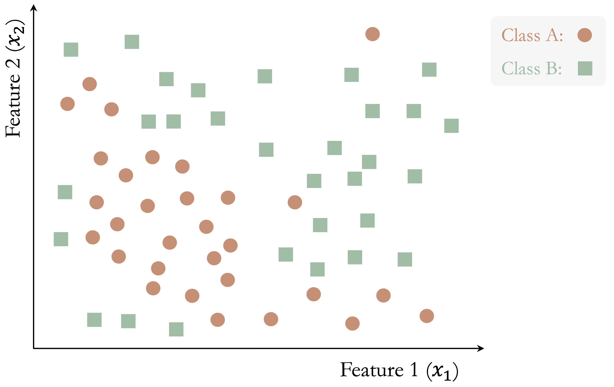
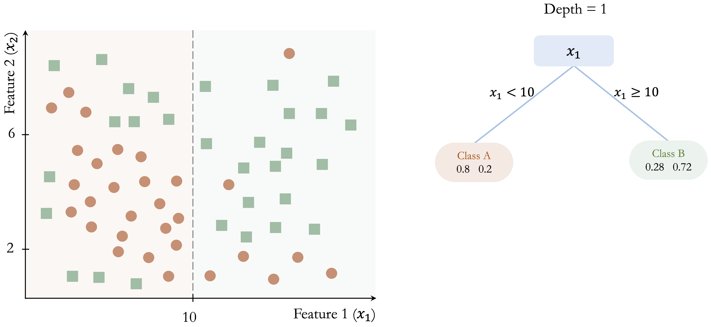
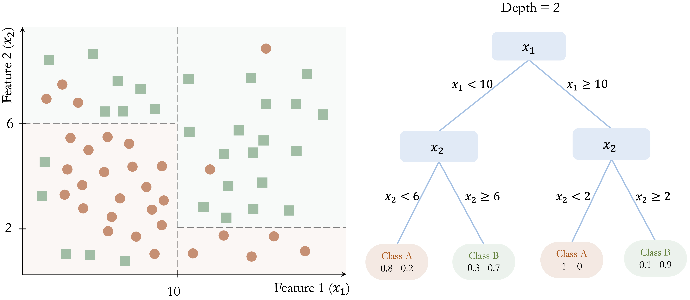
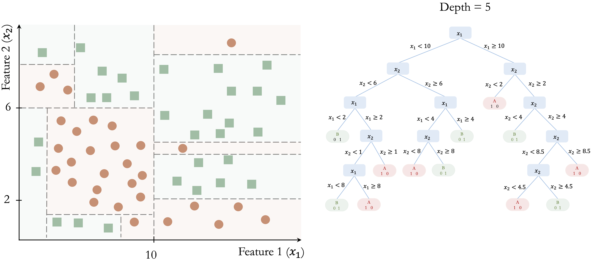
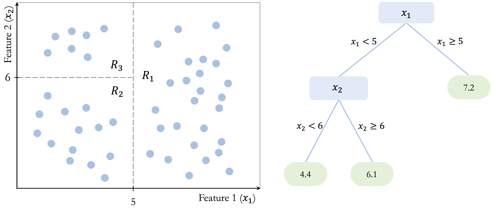
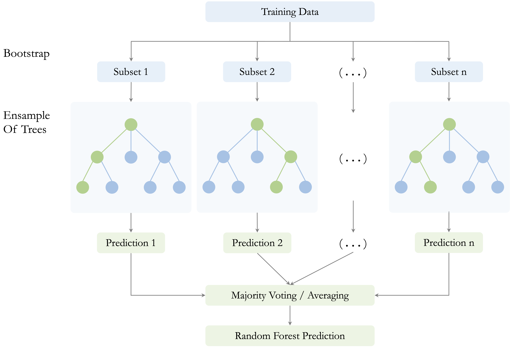

```{r echo=FALSE, message=FALSE, warning=FALSE}
source("_common.R")
```

# Decision Trees and Random Forests {#sec-ch12-tree-models}

::: {.content-visible when-format="pdf"}
\begin{chapterquote}
When one door closes, another opens.

\hfill — Alexander Graham Bell
\end{chapterquote}
:::

::::: {.content-visible when-format="html"}
:::: chapterquote
When one door closes, another opens.

::: author
— Alexander Graham Bell
:::
::::
:::::

Banks routinely evaluate loan applications using information such as income, age, credit history, and debt-to-income ratio. Online retailers, in turn, recommend products by learning patterns in customer preferences and past behavior. In many such settings, the decision process can be represented by a decision tree: a model that expresses predictions through a sequence of simple, interpretable rules.

Decision trees are widely used in applications such as medical diagnosis, fraud detection, customer segmentation, process automation, and numerical prediction. Their main strength lies in interpretability, since the fitted model can be read as a transparent series of splitting rules. A limitation, however, is that a single tree may overfit the training data by adapting too closely to random variation. Random forests address this weakness by combining many trees, often producing predictions that are more stable and accurate.

In Chapter [-@sec-ch10-regression], we studied models for continuous outcomes using regression equations. We now turn to tree-based methods, which extend the modeling toolkit to both classification and regression problems through recursive partitioning of the predictor space. Because these methods can capture nonlinear relationships and interactions without requiring a prespecified functional form, they are among the most flexible and widely used tools in supervised learning.

Later in the chapter, we return to these ideas in a case study based on the `adult` dataset, where we examine how tree-based models can be implemented and compared in practice.

In this chapter, we explain how decision trees are constructed, how their complexity can be controlled, how classification and regression trees differ, and how random forests improve predictive performance through aggregation. In doing so, we continue the modeling strand of the Data Science Workflow introduced in Chapter [-@sec-ch2-intro-data-science], building on earlier chapters on classification, regression, and model evaluation.

### What This Chapter Covers {.unnumbered .unlisted}

This chapter introduces tree-based methods for supervised learning, with a focus on how they are built, interpreted, and evaluated in practice. We begin with the basic logic of recursive partitioning and then examine how decision trees operate in both classification and regression settings. We next study two widely used tree-building algorithms: CART and C5.0. The chapter then introduces random forests as an ensemble extension designed to improve stability and predictive performance.

Using real datasets, we show how to interpret decision rules, manage model complexity, compare competing tree-based models, and evaluate predictive performance using confusion matrices, ROC curves, AUC, and variable importance.

By the end of the chapter, readers will be able to fit and interpret decision trees for both categorical and continuous outcomes, understand the main differences between CART, C5.0, and random forests, and judge when a tree-based model offers a useful balance between interpretability and predictive accuracy.

## The Basics of Decision Trees

Decision trees provide a flexible framework for both classification and regression by partitioning the predictor space into smaller and more homogeneous regions. A useful way to understand them is to view them as models that divide the predictor space through a sequence of binary decisions. Starting from the full dataset, the algorithm repeatedly searches for a feature and a split point that improve the fit of the model. Each split creates two child nodes, and this process continues recursively, producing a hierarchical structure of decision rules.

Tree construction is *greedy*: at each node, the algorithm selects the split that gives the greatest immediate improvement according to a chosen criterion. These decisions are therefore made *locally*, one step at a time, rather than by searching for the globally best tree all at once. This strategy makes tree construction computationally efficient, but it also means that an early split that appears optimal locally may not lead to the best overall tree.

Because each split acts on a single predictor at a time, the resulting decision boundaries are *axis-aligned*. In a two-dimensional setting, each split creates either a vertical or a horizontal partition. This property makes decision trees easy to interpret, but it can also make them inefficient when the true boundary is oblique or curved. In the following subsections, we examine how this general framework is used in classification and regression settings.

### Classification Trees: Purity and Class Prediction {.unnumbered .unlisted}

In a classification tree, the response variable is categorical, and the goal is to create nodes that are as pure as possible with respect to the class labels. In other words, we want observations in the same node to belong predominantly to the same class. To achieve this, the algorithm evaluates candidate splits using a measure of node impurity, such as the *Gini Index* or *Entropy*. A good split is one that produces child nodes with more concentrated class membership than the parent node.

The following toy example illustrates how a classification tree is built step by step. Consider a dataset with two features ($x_1$ and $x_2$) and two classes (Class A and Class B), shown in @fig-ch12-tree-1. The dataset contains 50 observations, and the goal is to separate the two classes using a sequence of decision rules.

```{r fig-ch12-tree-1, echo = FALSE, out.width = "65%", fig.cap = "A toy dataset with two features and two classes (Class A and Class B) with 50 observations. This example illustrates the step-by-step construction of a classification tree."}

```

The algorithm begins by identifying the feature and threshold that provide the largest immediate improvement in class separation. In this example, the split at $x_1 = 10$ yields the greatest gain in class homogeneity: in the left region ($x_1 < 10$), 80% of observations belong to Class A, whereas in the right region ($x_1 \geq 10$), 72% belong to Class B.

This initial partition is shown in @fig-ch12-tree-2. Although the split improves class separation, overlap between the classes remains. The algorithm therefore continues by searching for the best split within each resulting node, producing smaller and more homogeneous regions.

```{r fig-ch12-tree-2, echo = FALSE, out.width = "100%", fig.cap = "Left: Decision boundary for a tree with depth 1. Right: The corresponding decision tree."}

```

In @fig-ch12-tree-3, further splits at $x_2 = 6$ and $x_2 = 8$ refine the classification and improve the separation between the two classes.

```{r fig-ch12-tree-3, echo = FALSE, out.width = "100%", fig.cap = "Left: Decision boundary for a tree with depth 2. Right: The corresponding decision tree."}

```

This recursive process continues until a stopping criterion is reached. @fig-ch12-tree-4 shows a fully grown tree with depth 5, where the decision boundaries closely follow the training data.

```{r fig-ch12-tree-4, echo = FALSE, out.width = "100%", fig.cap = "Left: Decision boundary for a tree with depth 5. Right: The corresponding decision tree."}

```

This example illustrates several important properties of classification trees. First, the tree is built through a sequence of locally optimal decisions rather than through a global search over all possible tree structures. Second, the model partitions the feature space into axis-aligned regions, which makes the resulting rules easy to interpret. Third, while this structure allows trees to capture nonlinear patterns, it can require many splits to approximate a simple non-axis-aligned boundary. Finally, as the tree becomes deeper, it may begin to capture noise in addition to meaningful structure, increasing the risk of overfitting.

Once the tree has been constructed, the same decision rules are used to classify new observations. A new case is routed from the root node down to a terminal leaf by evaluating the relevant splitting rules one by one. The predicted class is then determined by the majority class among the training observations in that terminal node.

For example, consider a new observation with $x_1 = 8$ and $x_2 = 4$ in @fig-ch12-tree-3. Because $x_1 = 8$, the observation is sent to the left branch, where $x_1 < 10$. Then, since $x_2 = 4$, it moves to the lower-left branch, where $x_2 < 6$. The observation therefore reaches a terminal node that predicts Class A, with an estimated class probability of 80%.

This example shows why classification trees are often regarded as highly interpretable models. Each prediction can be traced back to a short sequence of explicit conditions, making it possible to explain not only the final class assignment but also the path used to obtain it. The terminal leaf summarizes the class composition of similar training observations, and that summary forms the basis of the prediction. This direct link between class prediction and decision rules is one of the main reasons classification trees remain attractive in applied data science.

### Regression Trees: Variance Reduction and Leaf Means {.unnumbered .unlisted}

When the response variable is continuous rather than categorical, the same tree-building framework leads to a *regression tree*. Like the regression models introduced in Chapter [-@sec-ch10-regression], regression trees are used to predict numerical outcomes. However, instead of describing the response through a single global equation, a regression tree partitions the predictor space into smaller regions and assigns a prediction within each region. Despite the name, a regression tree does not fit a regression equation inside each region. Rather, it predicts using the average response of the training observations that fall into the terminal leaf.

Trees for numerical prediction are built in much the same way as classification trees. Starting from the root node, the algorithm repeatedly searches for the split that produces the greatest improvement in homogeneity. However, when the response variable is continuous, homogeneity is no longer defined in terms of class purity. Instead, regression trees evaluate candidate splits according to how much they reduce variation in the response within the resulting child nodes, often using criteria based on within-node variance or residual sum of squares. The goal is therefore to create nodes in which the response values are as similar as possible.

Figure @fig-ch12-regression-tree illustrates this idea in a simple two-dimensional example. The tree partitions the predictor space into three terminal regions: $R_1$, defined by $x_1 > 5$, with a mean response of 7.2; $R_2$, defined by $x_1 < 5$ and $x_2 < 6$, with a mean response of 4.4; and $R_3$, defined by $x_1 < 5$ and $x_2 > 6$, with a mean response of 6.1. These values show that a regression tree predicts by assigning each region a constant value based on the training observations that fall within it. Although the figure uses a simple toy example, the same idea applies to real predictive tasks with continuous outcomes, such as the regression problems studied in Chapter [-@sec-ch10-regression].

```{r fig-ch12-regression-tree, echo = FALSE, out.width = "100%", fig.cap = "Left: Decision boundary for a regression tree with depth 2. Right: The corresponding tree structure with two internal nodes and three terminal leaves. The value in each leaf is the mean response of the observations assigned to that leaf."}

```

Once the tree has been constructed, prediction is straightforward. A new observation is routed through the tree until it reaches a terminal leaf, and the predicted value is taken to be the average response of the training observations in that leaf. For example, an observation with $x_1 = 4$ and $x_2 = 3$ would fall into region $R_2$ and receive a predicted value of 4.4, whereas an observation with $x_1 = 7$ would fall into region $R_1$ and receive a predicted value of 7.2. In this way, a regression tree approximates a continuous response by dividing the predictor space into regions and assigning a constant prediction within each region.

Like classification trees, regression trees are flexible and easy to interpret. They can capture nonlinear relationships and interactions without requiring a prespecified functional form. At the same time, they are still built through greedy, locally chosen splits and produce axis-aligned partitions, so they share the same limitations related to instability, inefficiency for oblique boundaries, and overfitting.

### Controlling Tree Complexity {.unnumbered .unlisted}

A decision tree can fit the training data extremely well and still perform poorly on new observations. This phenomenon, known as *overfitting*, occurs when the tree adapts too closely to random variation in the training set and begins to capture noise rather than underlying structure.

Because decision trees are built through a sequence of greedy, locally chosen splits, they can continue growing until they describe increasingly small and unrepresentative patterns in the data. Controlling tree complexity is therefore essential for good generalization. In practice, this means limiting how detailed the tree is allowed to become so that it captures the main structure of the data without following random fluctuations too closely.

One common strategy is *pre-pruning*, which restricts tree growth during training. The algorithm stops splitting when predefined limits are reached, such as a maximum tree depth, a minimum number of observations in a node, or too little improvement in the splitting criterion. By imposing these constraints early, pre-pruning helps prevent the tree from becoming unnecessarily complex.

A second strategy is *post-pruning*. In this approach, the tree is first allowed to grow to a larger size and is then simplified by removing branches that contribute little to predictive performance. The goal is to retain the most important structure while discarding splits that primarily reflect noise in the training data. Post-pruning often yields smaller trees that are easier to interpret and better able to generalize.

The choice between pre-pruning and post-pruning depends on the dataset, the modeling objective, and the desired balance between interpretability and predictive performance. In both cases, complexity control works together with the splitting criterion used to evaluate candidate splits. We now turn to these criteria in more detail, beginning with the CART algorithm.

## How the CART Algorithm Builds Trees

*CART* (Classification and Regression Trees), introduced by Breiman et al. in 1984 [@breiman1984classification], is one of the most influential algorithms for constructing decision trees and remains widely used in both research and practice. Because it provides a unified framework for both classification and regression, CART serves as a natural foundation for understanding tree-based models in greater detail.

A defining feature of CART is that it constructs *binary trees*: each internal node splits the data into exactly two child nodes. As in the general decision-tree framework introduced earlier, tree construction proceeds recursively by selecting, at each node, the feature and split point that yield the greatest immediate improvement according to a chosen objective function. The goal is to produce child nodes that are better separated with respect to the response than the parent node.

For classification tasks, CART typically measures node impurity using the *Gini index*, defined as
$$
Gini = 1 - \sum_{i=1}^k p_i^2,
$$
where $p_i$ denotes the proportion of observations in the node belonging to class $i$, and $k$ is the number of classes. The Gini index is small when most observations in a node belong to the same class and equals zero when the node is perfectly pure. CART therefore selects the split that produces the largest reduction in impurity, yielding child nodes with more concentrated class membership.

For regression tasks, CART uses the same recursive binary-splitting structure, but the response variable is continuous rather than categorical. In this setting, candidate splits are evaluated according to how much they reduce variation in the response within the resulting child nodes. A common criterion is the residual sum of squares (RSS),
$$
RSS = \sum_{i \in R_1} (y_i - \bar{y}_{R_1})^2 + \sum_{i \in R_2} (y_i - \bar{y}_{R_2})^2,
$$
where $R_1$ and $R_2$ denote the two child nodes created by a candidate split, and $\bar{y}_{R_1}$ and $\bar{y}_{R_2}$ are the mean response values within those nodes. CART selects the split that minimizes this quantity, thereby grouping together observations with more similar outcome values. The prediction at a terminal leaf is then the mean response of the training observations assigned to that node.

Because CART applies this splitting process recursively and greedily, it can generate very large trees that fit the training data extremely well. While this often reduces training error, it also increases the risk of overfitting. To address this problem, CART commonly uses *cost-complexity pruning*: a large tree is first grown and then simplified by removing branches that add little predictive value. This process balances model fit against tree size, often producing a smaller tree that is easier to interpret and better able to generalize to new data.

CART is widely used because of its interpretability, flexibility, and ability to handle both numerical and categorical predictors without requiring extensive preprocessing. The resulting tree provides a transparent set of decision rules and can capture nonlinear relationships and interactions automatically.

At the same time, CART has important limitations. Because splits are chosen greedily and locally, a split that appears optimal at one stage may not lead to the best overall tree. In addition, single trees can be unstable: small changes in the training data may lead to different splits and therefore different predictions.

Despite these limitations, CART remains a foundational method in tree-based learning. It makes the core ideas of binary recursive partitioning, impurity reduction, variance reduction, and pruning concrete in a form that is both practical and interpretable. In Section [-@sec-ch12-case-study], we return to these ideas and show how the CART algorithm can be implemented in R on the `adult` dataset. This foundation also helps motivate the more advanced methods introduced next: C5.0 and random forests.

## C5.0: More Flexible Decision Trees {#sec-ch12-c50}

C5.0, developed by J. Ross Quinlan, extends earlier decision tree algorithms such as ID3 and C4.5 by introducing more flexible splitting strategies and improved computational efficiency. In this chapter, we consider C5.0 as a method for classification trees. Compared with CART, it often produces more compact tree structures while maintaining strong predictive performance. Although a commercial implementation is available through RuleQuest, open-source versions are widely used in R and other data science environments.

One important distinction between C5.0 and CART lies in the structure of the resulting trees. Whereas CART restricts all splits to be binary, C5.0 can allow multi-way splits, especially for categorical predictors. This added flexibility can lead to shallower trees when a predictor has many levels, although a more compact tree is not always simpler to interpret in practice.

A second key difference concerns the criterion used to evaluate candidate splits in classification problems. Instead of the Gini index used by CART, C5.0 relies on entropy and information gain, concepts rooted in information theory. Entropy measures the degree of uncertainty in the class labels: it is high when several classes are mixed together and low when one class dominates. For a node containing $k$ classes, entropy is defined as
$$
Entropy(T) = - \sum_{i=1}^k p_i \log_2(p_i),
$$
where $p_i$ denotes the proportion of observations in the node belonging to class $i$.

When the data are partitioned by a candidate split $S$, the entropy of the resulting subsets is combined as a weighted average,
$$
H_S(T) = \sum_{i=1}^c \frac{|T_i|}{|T|} \times Entropy(T_i),
$$
where $T$ denotes the original node and $T_1, \dots, T_c$ are the subsets created by split $S$. The information gain associated with the split is then
$$
gain(S) = Entropy(T) - H_S(T).
$$
C5.0 selects the split that maximizes information gain, thereby favoring partitions that reduce class uncertainty most strongly.

These features make C5.0 an attractive alternative to CART in many classification settings. It is computationally efficient and well suited to large datasets and high-dimensional feature spaces. Its ability to use multi-way splits can be especially useful for categorical predictors with many levels, and it includes built-in pruning procedures that help reduce overfitting. In addition, C5.0 supports mechanisms such as feature weighting, which can help the model focus more strongly on informative predictors.

At the same time, C5.0 retains important limitations. The resulting trees can still become complex when the data contain many irrelevant predictors or highly granular categorical variables. Moreover, because C5.0 remains a single-tree method, it can still be sensitive to variation in the training data. Although it often improves on simpler tree-construction strategies, it does not fully overcome the instability that affects decision trees more generally.

Overall, C5.0 extends the classification-tree framework by combining entropy-based splitting, flexible tree structures, and built-in pruning. Relative to CART, it offers a different trade-off between flexibility, compactness, and interpretability. In Section [-@sec-ch12-case-study], we return to these ideas and show how a C5.0 tree can be implemented in R on the `adult` dataset and compared with CART and random forests. Its remaining limitations also motivate the move to ensemble methods such as random forests, which improve stability and predictive performance by aggregating many trees.

## Random Forests

Random forests are an ensemble learning method that combines the predictions of many decision trees in order to improve stability and predictive performance. Although a single decision tree can be flexible and easy to interpret, it may also have high variance: small changes in the training data can lead to very different trees. Random forests reduce this instability by averaging across a large collection of diverse trees. A useful way to understand random forests is to view them as an extension of *bagging* (bootstrap aggregation). In bagging, many trees are grown on different bootstrap samples of the training data and then combined, which already reduces variance relative to a single tree. Random forests go one step further by also randomizing the set of predictors considered at each split, thereby increasing diversity among the trees and strengthening the benefits of aggregation. Instead of relying on one tree grown from one sample, random forests generate many trees under slightly different conditions and then combine their predictions. As a result, the final model is usually more robust and better able to generalize to new data.

Two sources of randomness are essential to this process, as illustrated in Figure [-@fig-ch12-random-forest]. First, each tree is trained on a bootstrap sample of the training data, drawn with replacement. Second, at each split, only a random subset of predictors is considered as candidate variables. Together, these two mechanisms encourage diversity across the trees and reduce the chance that the entire model becomes dominated by a small number of strong predictors or by idiosyncratic patterns in the training data. This second source of randomness is especially important when some predictors are much stronger than others. Without it, many trees may repeatedly split on the same dominant variables near the top of the tree, making the ensemble less diverse. By forcing different trees to consider different subsets of predictors, random forests reduce correlation among the trees and make averaging more effective.

```{r fig-ch12-random-forest, echo = FALSE, out.width = "100%", fig.cap = "Schematic representation of the random forest algorithm. The training data are repeatedly resampled using bootstrap sampling to create multiple subsets, each used to grow a different decision tree. Predictions from the individual trees are then combined by majority voting for classification or averaging for regression to produce the final random forest prediction."}

```

The number of predictors considered at each split is controlled by a tuning parameter commonly denoted by $mtry$. Smaller values of $mtry$ generally increase diversity among the trees, which can reduce correlation between them and improve the benefits of aggregation. Larger values make individual trees more similar to one another and closer to standard bagged trees. Choosing $mtry$ therefore affects the balance between tree strength and forest diversity.

After training, predictions are aggregated across the individual trees. In classification problems, the final predicted class is determined by majority voting. In regression problems, the final prediction is obtained by averaging the predictions from all trees. In both settings, aggregation reduces variance by smoothing over the instability of individual trees.

An important practical feature of random forests is that they provide a built-in estimate of predictive performance through the *out-of-bag (OOB) error*. Because each tree is trained on a bootstrap sample, some training observations are left out of that sample. These omitted observations are called *out-of-bag* observations for that tree. After the forest is grown, each observation can be predicted using only the trees for which it was out-of-bag, yielding an internal estimate of prediction error without requiring a separate validation set. This makes random forests especially convenient in practice, particularly when data are limited. However, when a separate test set is available, it is still preferable to use that test set for final performance assessment.

Random forests also provide measures of variable importance, which summarize how strongly each predictor contributes to the fitted model. These measures can be useful for identifying variables that appear influential and for gaining an initial sense of which features deserve closer attention. At the same time, they should be interpreted with care: variable importance reflects the role of predictors within the fitted forest, and it does not by itself imply causation or guarantee stability when predictors are highly correlated.

Taken together, these features help explain why random forests are widely used in practice, but they also reveal important trade-offs. Random forests often achieve strong predictive performance, especially in settings with complex interactions, nonlinear relationships, or high-dimensional feature spaces. They are generally more stable than single decision trees and often less prone to overfitting.

These advantages come with costs. Random forests are much less interpretable than individual trees, since a prediction is based on the aggregation of many decision rules rather than on a single transparent path. They can also be computationally more demanding, especially when the number of trees is large or the dataset contains many predictors. Moreover, although variable importance measures are useful, they should be interpreted with caution and not mistaken for evidence of causal influence.

Despite these limitations, random forests have become a standard tool in applied data science because they offer a strong balance between flexibility, predictive accuracy, and robustness. They retain the nonlinear modeling power of decision trees while substantially reducing the instability of single-tree models. In Section [-@sec-ch12-case-study], we return to these ideas and show how random forests can be implemented in R on the `adult` dataset, including how to examine the effect of the number of trees and how to visualize variable importance.

## Case Study: Who Can Earn More Than \$50K Per Year? {#sec-ch12-case-study}

Predicting income levels is a common task in fields such as finance, marketing, and public policy. Banks use income models to assess creditworthiness, employers rely on them to benchmark compensation, and governments use them to inform taxation and welfare programs. In this case study, we apply decision trees and random forests to classify individuals according to their likelihood of earning more than \$50K per year.

The analysis is based on the `adult` dataset, a widely used benchmark derived from the US Census Bureau and available in the **liver** package. This dataset, introduced earlier in Section [-@sec-ch3-data-pre-adult], contains demographic and employment-related attributes such as education, working hours, marital status, and occupation, all of which are plausibly related to earning potential.

The case study follows the Data Science Workflow introduced in Chapter [-@sec-ch2-intro-data-science] and illustrated in @fig-ch2_DSW, covering data preparation, model construction, and evaluation. Using the same dataset and predictors, we compare three tree-based methods: CART, C5.0, and random forests. This setup allows us to examine how model flexibility, interpretability, and predictive performance change as we move from single decision trees to ensemble methods.

### Overview of the Dataset {.unnumbered .unlisted}

The `adult` dataset, included in the **liver** package, is a widely used benchmark in predictive modeling. Derived from the US Census Bureau, it contains demographic and employment-related information on individuals and is commonly used to study income classification problems. We begin by loading the dataset and examining its structure to understand the available variables and their types.

```{r}
library(liver)

data(adult)

str(adult)
```

The dataset contains `r nrow(adult)` observations and `r ncol(adult)` variables. The response variable, `income`, is a binary factor with two levels: `<=50K` and `>50K`. The remaining variables serve as predictors and capture information on demographics, education and employment, financial status, and household characteristics.

Specifically, the dataset includes demographic variables such as `age`, `gender`, `race`, and `native_country`; education and employment variables including `education`, `education_num`, `workclass`, `occupation`, and `hours_per_week`; financial indicators such as `capital_gain` and `capital_loss`; and household-related variables such as `marital_status` and `relationship`.

Some predictors provide direct numeric information, for example `education_num`, which measures years of formal education, while others encode categorical information with many levels. In particular, `native_country` contains 42 distinct categories, a feature that motivates the preprocessing and grouping steps discussed later in the case study. The diversity of variable types and levels makes the `adult` dataset well suited for illustrating how decision trees and random forests handle mixed data structures in classification tasks.

### Data Preparation {.unnumbered .unlisted}

Before fitting predictive models, the data must be cleaned and preprocessed to ensure consistency and reliable model behavior. The `adult` dataset contains missing values and high-cardinality categorical variables that require careful handling, particularly when using tree-based methods. As introduced in Chapter [-@sec-ch3-data-pre-adult], these preprocessing steps are part of the Data Science Workflow. Here, we briefly summarize the transformations applied prior to model training.

#### Handling Missing Values {.unnumbered .unlisted}

In the `adult` dataset, missing values are encoded as `"?"`. These entries are first converted to standard `NA` values, and unused factor levels are removed. For categorical variables with missing entries, we apply random sampling imputation based on the observed categories, which preserves the marginal distributions of the variables.

```{r}
library(Hmisc)

# Replace "?" with NA and remove unused levels
adult[adult == "?"] = NA
adult = droplevels(adult)

# Impute missing categorical values using random sampling
adult$workclass      = impute(factor(adult$workclass), 'random')
adult$native_country = impute(factor(adult$native_country), 'random')
adult$occupation     = impute(factor(adult$occupation), 'random')
```

#### Transforming Categorical Features {.unnumbered .unlisted}

Several categorical predictors in the `adult` dataset contain many distinct levels, which can introduce unnecessary complexity and instability in tree-based models. To improve interpretability and generalization, related categories are grouped into broader, conceptually meaningful classes.

The variable `native_country` originally contains `r length(levels(adult$native_country))` distinct categories. To retain geographic information while reducing sparsity, countries are grouped into five regions: Europe, North America, Latin America, the Caribbean, and Asia.

```{r}
library(forcats)

Europe <- c("France", "Germany", "Greece", "Hungary", "Ireland", "Italy", "Netherlands", "Poland", "Portugal", "United-Kingdom", "Yugoslavia")

North_America <- c("United-States", "Canada", "Outlying-US(Guam-USVI-etc)")

Latin_America <- c("Mexico", "El-Salvador", "Guatemala", "Honduras", "Nicaragua", "Cuba", "Dominican-Republic", "Puerto-Rico", "Colombia", "Ecuador", "Peru")

Caribbean <- c("Jamaica", "Haiti", "Trinidad&Tobago")

Asia <- c("Cambodia", "China", "Hong-Kong", "India", "Iran", "Japan", "Laos", "Philippines", "South", "Taiwan", "Thailand", "Vietnam")

adult$native_country <- fct_collapse(adult$native_country,
      "Europe" = Europe, "North America" = North_America, "Latin America" = Latin_America, "Caribbean" = Caribbean, "Asia" = Asia)
```

We also simplify the `workclass` variable by grouping rare categories representing individuals without formal employment into a single level:

```{r}
adult$workclass = fct_collapse(adult$workclass, 
                        "Unemployed" = c("Never-worked", "Without-pay"))
```

These transformations reduce sparsity in categorical predictors and help tree-based models focus on meaningful distinctions rather than idiosyncratic levels. With the data prepared, we proceed to model construction and evaluation in the following section.

### Data Setup for Modeling {.unnumbered .unlisted}

With the data cleaned and categorical variables simplified, we proceed to set up the dataset for model training and evaluation. This step corresponds to Step 4 (Data Setup for Modeling) in the Data Science Workflow introduced in Chapter [-@sec-ch2-intro-data-science] and discussed in detail in Chapter [-@sec-ch6-setup-data]. It marks the transition from data preparation to model construction.

To assess how well the models generalize to new data, the dataset is partitioned into a training set (80%) and a test set (20%). The training set is used for model fitting, while the test set serves as an independent holdout sample for performance evaluation. As in earlier chapters, we perform this split using the `partition()` function from the **liver** package:

```{r}
set.seed(42)

splits = partition(data = adult, ratio = c(0.8, 0.2))

train_set = splits$part1
test_set  = splits$part2

test_labels = test_set$income
```

The function `set.seed()` ensures that the partitioning is reproducible. The vector `test_labels` contains the observed income classes for the test observations and is used later to evaluate model predictions.

To confirm that the partitioning preserves the structure of the original data, we verified that the distribution of the response variable `income` remains comparable across the training and test sets. Readers interested in formal validation procedures are referred to Section [-@sec-ch6-cross-validation].

For modeling, we select a set of predictors spanning demographic, educational, employment, and financial dimensions: `age`, `workclass`, `education_num`, `marital_status`, `occupation`, `gender`, `capital_gain`, `capital_loss`, `hours_per_week`, and `native_country`. These variables are chosen to capture key factors plausibly associated with income while avoiding redundancy.

Several variables are excluded for the following reasons. The variable `demogweight` serves as an identifier and does not contain predictive information. The variable `education` duplicates the information in `education_num`, which encodes years of education numerically. The variable `relationship` is strongly correlated with `marital_status` and is therefore omitted to reduce redundancy. Finally, `race` is excluded for ethical reasons.

Using the selected predictors, we define the model formula that will be applied consistently across all three tree-based methods:

```{r}
formula = income ~ age + workclass + education_num + marital_status + occupation + gender + capital_gain + capital_loss + hours_per_week + native_country
```

Applying the same set of predictors across CART, C5.0, and random forest models ensures that differences in performance can be attributed to the modeling approach rather than to differences in input variables.

Finally, it is worth noting that tree-based models do not require dummy encoding of categorical variables or rescaling of numerical features. These models can directly handle mixed data types and are invariant to monotonic transformations of numeric predictors. In contrast, distance-based methods such as k-nearest neighbors (Chapter [-@sec-ch7-classification-knn]) rely on distance calculations and therefore require both encoding and feature scaling.

> *Practice:* Repartition the `adult` dataset into a 70% training set and a 30% test set using the same approach. Check whether the class distribution of the target variable `income` is similar in both subsets, and reflect on why preserving this balance is important for fair model evaluation.

### Building a Decision Tree with CART {.unnumbered .unlisted}

We begin the modeling stage by fitting a decision tree using the CART algorithm. In R, CART is implemented in the **rpart** package, which provides tools for constructing, visualizing, and evaluating decision trees.

We start by loading the package and fitting a classification tree using the training data:

```{r}
library(rpart)

cart_model = rpart(formula = formula, data = train_set, method = "class")
```

The argument `formula` defines the relationship between the response variable (`income`) and the selected predictors, while `data` specifies the training set used for model fitting. Setting `method = "class"` indicates that the task is classification. The same framework can also be applied to regression and other modeling contexts by selecting an appropriate method, illustrating the generality of the CART approach. This fitted model serves as a baseline against which more flexible tree-based methods, including C5.0 and random forests, will later be compared.

To better understand the learned decision rules, we visualize the fitted tree using the **rpart.plot** package:

```{r out.width = "100%"}
#| label: fig-ch12-tree-adult
#| fig-cap: A classification tree built using the CART algorithm on the `adult` dataset to to classify individuals according to their likelihood of earning more than \$50K per year. Terminal nodes display predicted class and class probabilities, illustrating CART’s rule-based structure.

library(rpart.plot)

rpart.plot(cart_model, type = 4, extra = 104)
```

The argument `type = 4` places the splitting rules inside the nodes, making the tree structure easier to interpret. The argument `extra = 104` adds the predicted class and the corresponding class probability at each terminal node.

When the tree is too large to be displayed clearly in graphical form, a text-based representation can be useful. The `print()` function provides a concise summary of the tree structure, listing the nodes, splits, and predicted outcomes:

```{r}
print(cart_model)
```

Having examined the tree structure, we can now interpret how the model generates predictions. The fitted tree contains four internal decision nodes and five terminal leaves. Of the twelve candidate predictors, the algorithm selects three variables (`marital_status`, `capital_gain`, and `education_num`) as relevant for predicting income. The root node is defined by `marital_status`, indicating that marital status provides the strongest initial separation in the data.

Each terminal leaf represents a distinct subgroup of individuals defined by a sequence of decision rules. In the visualization, blue leaves correspond to predictions of income less than or equal to \$50K, whereas green leaves correspond to predictions above this threshold.

As an example, the rightmost leaf identifies individuals who are married and have at least 13 years of formal education (`education_num >= 13`). This subgroup accounts for approximately 14% of the observations, of which about 70% earn more than \$50K annually. The associated classification error for this leaf is therefore 0.30, computed as $1 - 0.70$.

This example illustrates how decision trees partition the population into interpretable segments based on a small number of conditions. In the next section, we apply the C5.0 algorithm to the same dataset and compare its structure and predictive behavior with that of the CART model.

> *Practice:* In the decision tree shown in this subsection, focus on the leftmost terminal leaf. Which sequence of decision rules defines this group, and how should its predicted income class and class probability be interpreted?

### Building a Decision Tree with C5.0 {.unnumbered .unlisted}

Having examined how CART constructs decision trees, we now turn to C5.0, an algorithm designed to produce more flexible and often more compact tree structures. In this part of the case study, we apply C5.0 to the same training data in order to contrast its behavior with that of the CART model.

In R, C5.0 is implemented in the **C50** package. Using the same model formula and training set as before, we fit a C5.0 decision tree as follows:

```{r}
library(C50)

C50_model = C5.0(formula, data = train_set)
```

The argument `formula` specifies the relationship between the response variable (`income`) and the predictors, while `data` identifies the training dataset. Using the same inputs as in the CART model ensures that differences in model behavior can be attributed to the algorithm rather than to changes in predictors or data.

Compared to CART, C5.0 allows multi-way splits, assigns weights to predictors, and applies entropy-based splitting criteria. These features often result in deeper but more compact trees, particularly when categorical variables with many levels are present.

Because the resulting tree can be relatively large, we summarize the fitted model rather than plotting its full structure. The `print()` function provides a concise overview:

```{r}
print(C50_model)
```

The output reports key characteristics of the fitted model, including the number of predictors, the number of training observations, and the total number of decision nodes. In this case, the tree contains 74 decision nodes, substantially more than the CART model. This increased complexity reflects C5.0’s greater flexibility in partitioning the feature space. In the next section, we move beyond single-tree models and introduce random forests, an ensemble approach that combines many decision trees to improve predictive performance and robustness.

> *Practice:* Repartition the `adult` dataset into a 70% training set and a 30% test set. Fit both a CART and a C5.0 decision tree using this new split, and compare their structures with the trees obtained earlier. Which model appears more sensitive to the change in the training data, and why?

### Building a Random Forest Model {.unnumbered .unlisted}

Single decision trees are easy to interpret but can be unstable, as small changes in the training data may lead to substantially different tree structures. Random forests address this limitation by aggregating many decision trees, each trained on a different bootstrap sample of the data and using different subsets of predictors. This ensemble strategy typically improves predictive accuracy and reduces overfitting.

In R, random forests are implemented in the **randomForest** package. Using the same model formula and training data as before, we fit a random forest classifier with 100 trees:

```{r}
library(randomForest)

forest_model = randomForest(formula = formula, data = train_set, ntree = 100)
```

The argument `ntree` specifies the number of trees grown in the ensemble. Increasing this value generally improves stability and predictive performance, although gains tend to diminish beyond a certain point.

One advantage of random forests is that they provide measures of variable importance, which summarize how strongly each predictor contributes to model performance. We visualize these measures using the following command:

```{r out.width = "70%"}
varImpPlot(forest_model, col = "#377EB8", 
           main = "Variable Importance in Random Forest Model")
```

The resulting plot ranks predictors according to their importance. In this case, `marital_status` again emerges as the most influential variable, followed by `capital_gain` and `education_num`, consistent with the earlier tree-based models.

Random forests also allow us to examine how classification error evolves as the number of trees increases:

```{r}
plot(forest_model, col = "#377EB8",
     main = "Random Forest Error Rate vs. Number of Trees")
```

The error rate stabilizes after approximately 40 trees, indicating that additional trees contribute little improvement. This behavior illustrates how random forests balance flexibility with robustness by averaging across many diverse trees.

Having fitted CART, C5.0, and random forest models using the same predictors and data split, we are now in a position to compare their predictive performance systematically. In the next section, we evaluate these models side by side using confusion matrices, ROC curves, and AUC values.

### Model Evaluation and Comparison {.unnumbered .unlisted}

With the CART, C5.0, and Random Forest models fitted, we now evaluate their performance on the test set to assess how well they generalize to unseen data. Model evaluation allows us to distinguish between models that capture meaningful patterns and those that primarily reflect the training data.

Following the evaluation framework introduced in Chapter [-@sec-ch8-evaluation], we compare the models using confusion matrices, ROC curves, and Area Under the Curve (AUC) values. These tools provide complementary perspectives: confusion matrices summarize classification errors at a given threshold, while ROC curves and AUC values assess performance across all possible classification thresholds.

We begin by generating predicted class probabilities for the test set using the `predict()` function. For all three models, we request probabilities rather than hard class labels by specifying `type = "prob"`:

```{r}
cart_probs   = predict(cart_model,   test_set, type = "prob")[, "<=50K"]

C50_probs    = predict(C50_model,    test_set, type = "prob")[, "<=50K"]

forest_probs = predict(forest_model, test_set, type = "prob")[, "<=50K"]
```

The `predict()` function returns a matrix of class probabilities for each observation. Extracting the column corresponding to the `<=50K` class allows us to evaluate the models using threshold-dependent and threshold-independent metrics. In the following subsections, we first examine confusion matrices to analyze misclassification patterns and then use ROC curves and AUC values to compare overall discriminatory performance.

#### Confusion Matrix and Classification Errors {.unnumbered .unlisted}

Confusion matrices provide a direct way to examine how well the models distinguish between high earners and others, as well as the types of classification errors they make. We generate confusion matrices for each model using the `conf.mat.plot()` function from the **liver** package, which produces compact graphical summaries:

::: {#fig-ch12-conf-plots layout-ncol="3"}
```{r out.width = "95%"}
conf.mat.plot(cart_probs, test_labels, cutoff = 0.5, reference = "<=50K", main = "CART Prediction")
```

```{r out.width = "95%"}
 
conf.mat.plot(C50_probs, test_labels, cutoff = 0.5, reference = "<=50K", main = "C5.0 Prediction")
```

```{r out.width = "95%"}
 
conf.mat.plot(forest_probs, test_labels, cutoff = 0.5, reference = "<=50K", main = "Random Forest Prediction")
```

Confusion matrices for CART, C5.0, and Random Forest models using a cutoff value of $0.5$. Each matrix summarizes true positives, true negatives, false positives, and false negatives for the corresponding model.
:::

In these plots, the cutoff determines the decision threshold between the two income classes. With `cutoff = 0.5`, observations with a predicted probability of at least 0.5 for the `<=50K` class are classified as `<=50K`; otherwise, they are classified as `>50K`. The argument `reference = "<=50K"` specifies the positive class.

Because confusion matrices depend on a specific cutoff, they reflect model performance at a particular operating point rather than overall discriminatory ability. Changing the cutoff alters the balance between different types of classification errors, such as false positives and false negatives.

In practice, a fixed cutoff of 0.5 is not always optimal. A more principled approach is to select the cutoff using a validation set (see Section [-@sec-ch6-cross-validation]), optimizing a metric such as the F1-score or balanced accuracy. Once chosen, this cutoff can be applied to the test set to obtain an unbiased estimate of generalization performance.

To examine the numeric confusion matrices directly, we use the `conf.mat()` function:

```{r echo=TRUE}
conf.mat(cart_probs, test_labels, cutoff = 0.5, reference = "<=50K")

conf.mat(C50_probs, test_labels, cutoff = 0.5, reference = "<=50K")

conf.mat(forest_probs, test_labels, cutoff = 0.5, reference = "<=50K")
```

```{r echo=FALSE}
cart_conf   = conf.mat(cart_probs, test_labels, cutoff = 0.5, reference = "<=50K")
C50_conf    = conf.mat(C50_probs, test_labels, cutoff = 0.5, reference = "<=50K")
forest_conf = conf.mat(forest_probs, test_labels, cutoff = 0.5, reference = "<=50K")
```

Using this cutoff, the total number of correctly classified observations is `r cart_conf[1, 1] + cart_conf[2, 2]` for CART, `r C50_conf[1, 1] + C50_conf[2, 2]` for C5.0, and `r forest_conf[1, 1] + forest_conf[2, 2]` for Random Forest. Among the three models, C5.0 yields the highest number of correct classifications at this threshold, reflecting its greater flexibility in partitioning the feature space.

> *Practice:* Change the cutoff from 0.5 to 0.6 and re-run the `conf.mat.plot()` and `conf.mat()` functions. How do the confusion matrices change, and what trade-offs between sensitivity and specificity become apparent?

#### ROC Curve and AUC {.unnumbered .unlisted}

Confusion matrices evaluate model performance at a single decision threshold. To assess performance across all possible thresholds, we turn to the ROC curve and the Area Under the Curve (AUC). These tools summarize a model’s ability to discriminate between the two income classes independently of any specific cutoff value.

We compute ROC curves for all three models using the **pROC** package:

```{r}
library(pROC)

cart_roc   = roc(test_labels, cart_probs)
C50_roc    = roc(test_labels, C50_probs)
forest_roc = roc(test_labels, forest_probs)
```

To facilitate comparison, we display all three ROC curves on a single plot:

```{r out.width = "90%"}
ggroc(list(cart_roc, C50_roc, forest_roc), size = 0.9) +
  scale_color_manual(values = c("#377EB8", "#E66101", "#4DAF4A"),
                 labels = c(
                   paste("CART; AUC =", round(auc(cart_roc), 3)),
                   paste("C5.0; AUC =", round(auc(C50_roc), 3)),
                   paste("Random Forest; AUC =", round(auc(forest_roc), 3))
                 )) +
  ggtitle("ROC Curves with AUC for Three Models") + 
  theme(legend.title = element_blank(), legend.position = c(.7, .3))
```

The ROC curves illustrate how each model trades off sensitivity and specificity across different threshold values. Curves closer to the top-left corner indicate stronger discriminatory performance.

The AUC values provide a concise summary of these curves. CART achieves an AUC of `r round(auc(cart_roc), 3)`, C5.0 an AUC of `r round(auc(C50_roc), 3)`, and Random Forest an AUC of `r round(auc(forest_roc), 3)`. Among the three models, Random Forest attains the highest AUC, although the difference relative to C5.0 is small.

These results highlight that, while ensemble methods often deliver improved discrimination, the gains over well-tuned single-tree models may be modest. Consequently, model selection should consider not only predictive performance but also factors such as interpretability, computational cost, and ease of deployment.

> *Practice:* Repartition the `adult` dataset into a 70% training set and a 30% test set. For this new split, compute the ROC curves and AUC values for the CART, C5.0, and Random Forest models. Compare the results with those obtained earlier and reflect on how sensitive the AUC values are to the choice of data split.

This case study illustrated how different tree-based models behave when applied to the same real-world classification problem. By keeping data preparation, predictors, and evaluation procedures fixed, we were able to isolate the strengths and limitations of CART, C5.0, and Random Forests. These observations motivate the broader lessons summarized in the following section.

## Chapter Summary and Takeaways {#sec-ch12-summary}

In this chapter, we examined tree-based models as flexible, non-parametric approaches to supervised learning. We began by introducing the basic logic of decision trees, showing how they partition the predictor space through recursive, greedy splitting. We distinguished between classification trees, which aim to create nodes with increasingly homogeneous class labels, and regression trees, which aim to group observations with similar numerical outcomes and predict using leaf means. This framework showed how tree-based methods can be used for both categorical and continuous responses without requiring a prespecified functional form.

We then studied two important single-tree algorithms. CART provided the main foundation by illustrating how binary recursive partitioning can be used for both classification and regression, using impurity reduction for class labels and variation reduction for continuous outcomes. We also introduced C5.0 as a more flexible classification-tree method based on entropy and information gain, with multi-way splits and built-in pruning. Together, these methods highlighted the strengths of decision trees: interpretability, flexibility, and the ability to capture nonlinear relationships and interactions automatically.

We next turned to random forests, which extend single-tree models by aggregating many trees grown on bootstrap samples and random subsets of predictors. This ensemble strategy reduces variance, improves stability, and often leads to stronger predictive performance. At the same time, it comes at the cost of reduced interpretability. More broadly, the chapter illustrated a central trade-off in data science: simpler models such as single trees are easier to explain, whereas ensemble methods often achieve greater robustness and accuracy.

Through the income classification case study, we showed how these methods can be implemented in practice within the Data Science Workflow. The comparison highlighted the importance of careful data preparation, consistent model setup, and evaluation using multiple performance measures. It also showed that conclusions can depend on the metric being used: a model that performs best at a fixed classification threshold may differ from the model that performs best in terms of overall discrimination. For this reason, no single tree-based method is universally optimal. Model choice should reflect the goals of the analysis, the need for interpretability, and the available computational resources.

The exercises at the end of this chapter provide further opportunities to practice building, evaluating, and interpreting tree-based models for both classification and regression tasks. In the next chapter, we extend the modeling toolkit to neural networks, which offer even greater flexibility for capturing complex nonlinear patterns while introducing new challenges related to tuning, interpretation, and model transparency.

## Exercises {#sec-ch12-exercises}

The following exercises reinforce the main ideas and methods introduced in this chapter through a combination of conceptual questions and hands-on modeling tasks. The exercises begin with conceptual questions that focus on core ideas and interpretation, continue with applied modeling tasks using real datasets, and conclude with a more challenging high-dimensional classification problem. Where computation is required, the analyses should be implemented in R. The datasets used in these exercises are available in the **liver** package.

#### Conceptual Questions {.unnumbered .unlisted}

1.  Describe the basic structure of a decision tree and explain how a tree makes a prediction for a new observation.

2.  Explain the difference between a classification tree and a regression tree. What is predicted at a terminal leaf in each case?

3.  Explain the role of splitting criteria in decision trees. How do criteria such as the Gini index or entropy differ from criteria based on variance reduction or residual sum of squares?

4.  Explain why decision trees are prone to overfitting. Why does tree depth matter for generalization?

5.  Define pre-pruning and post-pruning. How do they differ in terms of when and how tree complexity is controlled?

6.  Explain the bias-variance trade-off in the context of single decision trees and random forests.

7.  Compare a classification tree with logistic regression for a binary classification problem. Discuss their strengths and limitations in terms of interpretability, flexibility, and predictive performance.

8.  Compare a regression tree with a linear regression model. How do their assumptions, flexibility, and predictions differ?

9.  Explain how bagging (bootstrap aggregation) reduces variance. Why is bagging particularly useful for decision trees?

10. Explain why random forests use a random subset of predictors at each split. How does this improve the effectiveness of aggregation?

11. What is the role of the tuning parameter $mtry$ in a random forest? How can changing $mtry$ affect the diversity and performance of the forest?

12. Explain how predictions are aggregated in random forests for classification and regression.

13. Explain what out-of-bag (OOB) error measures in a random forest and why it is useful in practice.

14. Random forests often provide measures of variable importance. Explain what these measures can tell us, and give two reasons why they should be interpreted with caution.

15. C5.0 and CART are both tree-based methods, but they differ in important ways. Describe two key differences between them.

16. Discuss two limitations of random forests and describe situations in which a single decision tree may still be preferred.

#### Hands-On Practice: Classification with the `loan` Dataset {.unnumbered .unlisted}

In Section [-@sec-ch9-case-study], we used the `loan` dataset to study a classification problem through the Data Science Workflow. In this set of exercises, we revisit the same dataset using tree-based methods. This allows you to compare CART, C5.0, and random forests on a familiar prediction task and to relate their behavior to the methods studied earlier in the book.

17. Load `loan`, inspect its structure, and identify the response variable and candidate predictors.

18. Partition the dataset into a training set (80%) and a test set (20%) using the `partition()` function from the **liver** package. Use the same random seed as in Section [-@sec-ch12-case-study].

19. Verify that the class distribution of the response variable is similar in the training and test sets. Briefly explain why this matters for model evaluation.

20. Fit a classification tree using CART with `loan_status` as the response variable and the following predictors: `no_of_dependents`, `education`, `self_employed`, `income_annum`, `loan_amount`, `loan_term`, `cibil_score`, `residential_assets_value`, `commercial_assets_value`, `luxury_assets_value`, and `bank_asset_value`.

21. Visualize the fitted tree using `rpart.plot()`. Identify the first split and interpret it in plain language.

22. Evaluate the CART model on the test set using a confusion matrix with cutoff 0.5. Clearly state which class you treat as the positive class, and report accuracy, sensitivity, and specificity.

23. Compute the ROC curve and AUC for the CART model. Compare the conclusions from the AUC to those from the confusion matrix.

24. Investigate pruning by fitting at least two additional CART models with different values of the complexity parameter `cp`. Compare their test-set performance and the resulting tree sizes.

25. Fit a C5.0 classification tree using the same predictors as in the CART model.

26. Compare C5.0 and CART in terms of interpretability and predictive performance on the test set. Use confusion matrices and AUC to support your comparison.

27. Fit a random forest classifier using the same predictors. Use `ntree = 100`.

28. Evaluate the random forest on the test set using a confusion matrix with cutoff 0.5. Clearly state which class you treat as the positive class, and report accuracy, sensitivity, and specificity.

29. Compute the ROC curve and AUC for the random forest. Compare the AUC values for CART, C5.0, and random forest, and summarize the main trade-offs you observe.

30. Compare the tree-based models from this chapter with the Naive Bayes model studied earlier on the `loan` dataset. Which method seems easiest to interpret, and which appears strongest in predictive performance?

#### Hands-On Practice: Regression Trees and Random Forests with the `bike_demand` Dataset {.unnumbered .unlisted}

In Section [-@sec-ch10-case-study], we used the `bike_demand` dataset to study a continuous prediction problem with regression models. In this set of exercises, we revisit the same dataset using regression trees and random forests. This allows you to compare tree-based methods with the regression approaches studied earlier and to examine how recursive partitioning handles nonlinear structure and interactions in a real prediction task.

31. Load `bike_demand`, inspect its structure, and identify the response variable and candidate predictors for a regression analysis.

32. Partition the dataset into a training set and a test set. Because the observations are ordered over time, a random split is not appropriate. Instead, use the same time-based partitioning strategy as in Section [-@sec-ch10-case-study], so that earlier observations are used for training and later observations are reserved for testing.

33. Fit a regression tree predicting `bike_count` using all available predictors except any date or identifier variables you decide are unsuitable for direct use. Briefly justify your modeling choices.

34. Visualize the fitted regression tree. Identify the first split and explain what it suggests about differences in predicted bike demand.

35. Choose two terminal leaves from the fitted tree and interpret their predicted values. What do these leaf means represent in the context of bike rental demand?

36. Predict `bike_count` for the test set and compute the mean squared error (MSE) and root mean squared error (RMSE).

37. Compare the regression tree conceptually with the regression models used in Chapter [-@sec-ch10-case-study]. How does the tree represent the relationship between predictors and outcome differently from a regression equation?

38. Fit at least one additional regression tree with a different complexity setting (for example by changing `cp`, tree depth, or minimum node size). Compare the resulting tree structure and test-set performance with the original tree.

39. Fit a random forest regression model using the same predictors. Use `ntree = 200`.

40. Compute the test-set MSE and RMSE for the random forest model and compare the results with those of the regression tree.

41. Investigate how prediction error changes as the number of trees increases. Does the error appear to stabilize, and if so, after approximately how many trees?

42. Use `varImpPlot()` to identify the most important predictors in the random forest. Which variables appear most influential for predicting bike demand, and do these results align with your intuition from Chapter [-@sec-ch10-case-study]?

43. Compare the regression tree and random forest in terms of predictive accuracy, interpretability, and practical usefulness. In what situation might you prefer the simpler regression tree, even if the random forest performs better?

#### Hands-On Practice: Regression Trees and Random Forests with the `red_wines` Dataset {.unnumbered .unlisted}

In this part, we continue with tree-based methods for a regression problem using `red_wines` from the **liver** package. Unlike the previous subsection, which revisits a familiar case study, these exercises are intended to give you more independent practice with regression trees and random forests. The emphasis is on interpretation, model comparison, variable importance, and performance stability for continuous outcomes.

44. Load `red_wines`, inspect its structure, and identify the response variable used for prediction.

45. Partition the dataset into a training set (70%) and a test set (30%). Use `set.seed(42)` for reproducibility.

46. Fit a regression tree predicting the response variable using all available predictors.

47. Visualize the fitted regression tree. Identify the first split and explain what it suggests about differences in the predicted outcome.

48. Choose two terminal leaves from the fitted tree and interpret their predicted values. What do these values represent in a regression tree?

49. Predict outcomes for the test set and compute the mean squared error (MSE) and root mean squared error (RMSE).

50. Fit at least one additional regression tree with a different complexity setting (for example by changing `cp`, tree depth, or minimum node size). Compare the resulting tree structure and test-set performance with the original tree.

51. Fit a random forest regression model using the same predictors. Use `ntree = 200`.

52. Compute test-set MSE and RMSE for the random forest model and compare the results with those of the regression tree.

53. Use `varImpPlot()` to identify the five most important predictors in the random forest. Provide a short interpretation of why these variables may be influential for the response.

54. Investigate how performance changes as the number of trees increases. Does the test error appear to stabilize, and if so, after approximately how many trees?

55. Perform repeated train-test splitting or cross-validation to compare the stability of regression tree and random forest performance. Summarize your findings.

56. Compare the regression tree and random forest in terms of both predictive accuracy and interpretability. In what type of applied setting might you prefer the simpler tree, even if the random forest performs better?

#### Challenge Practice: High-Dimensional Classification with the `caravan` Dataset {.unnumbered .unlisted}

The `caravan` dataset in the **liver** package contains sociodemographic variables together with indicators of insurance product ownership. The response variable, `Purchase`, records whether a customer bought a caravan insurance policy. These exercises focus on a more challenging classification setting in which the predictor space is relatively large and the positive class is uncommon. This makes the dataset well suited for comparing single-tree and ensemble methods in the presence of class imbalance.

57. Load `caravan`, inspect its structure, and identify the response variable and predictor set. Report the proportion of customers with `Purchase = "Yes"`.

58. Partition the dataset into a training set (70%) and a test set (30%) using `partition()`. Briefly explain why it is especially important to preserve the class distribution in this problem.

59. Fit a CART classification tree to predict `Purchase`.

60. Evaluate the CART model on the test set using a confusion matrix and AUC. Treat `Purchase = "Yes"` as the positive class, and comment on the results in light of the class imbalance in the dataset.

61. Visualize the fitted CART tree and identify the first split. What does this split suggest about the structure of the classification problem?

62. Fit a random forest classifier to predict `Purchase`.

63. Evaluate the random forest on the test set using a confusion matrix and AUC. Treat `Purchase = "Yes"` as the positive class, and compare the results with those of CART.

64. Compare the conclusions from the confusion matrices with those from the AUC values. Why can these measures lead to different impressions of model performance in an imbalanced classification problem?

65. Use `varImpPlot()` to identify the ten most important predictors in the random forest. Discuss whether sociodemographic variables or product-ownership variables appear more influential.

66. Tune the random forest by adjusting `mtry` (for example using `tuneRF()` or a small grid search). Report the selected value and evaluate whether performance improves on the test set.

67. If performance does improve after tuning, explain whether the improvement is substantial in practical terms. If it does not improve much, explain why random forests may still be useful despite limited gains from tuning.

68. Compare CART and random forest in terms of interpretability, predictive performance, and suitability for an imbalanced classification problem. Under what circumstances might you still prefer the simpler CART model?
