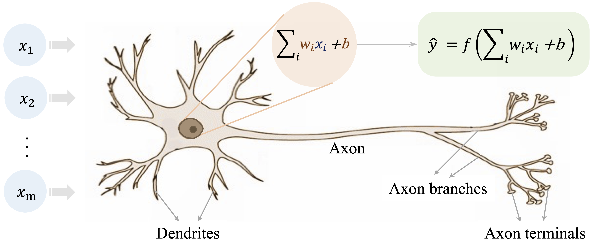
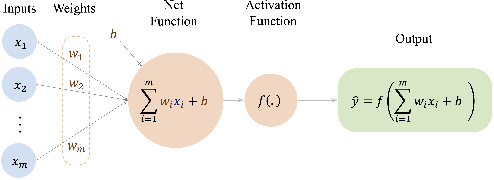
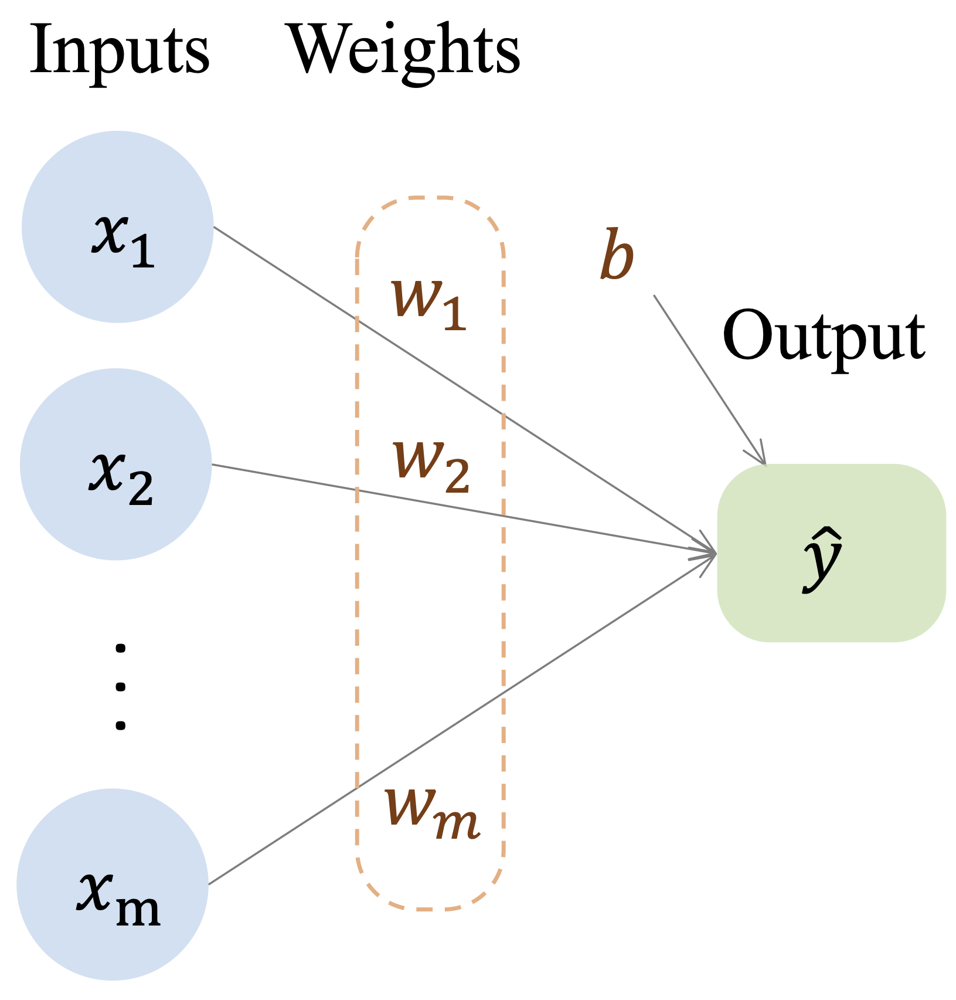
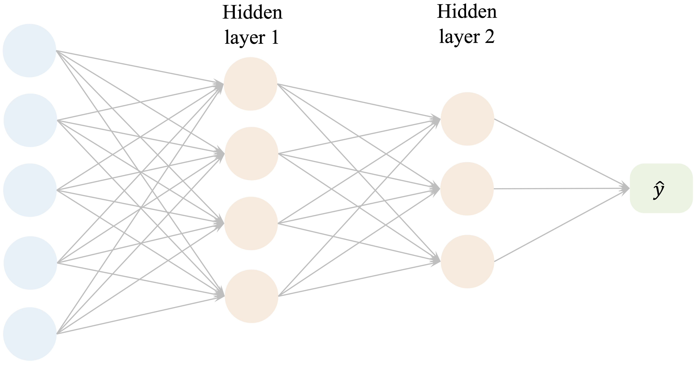
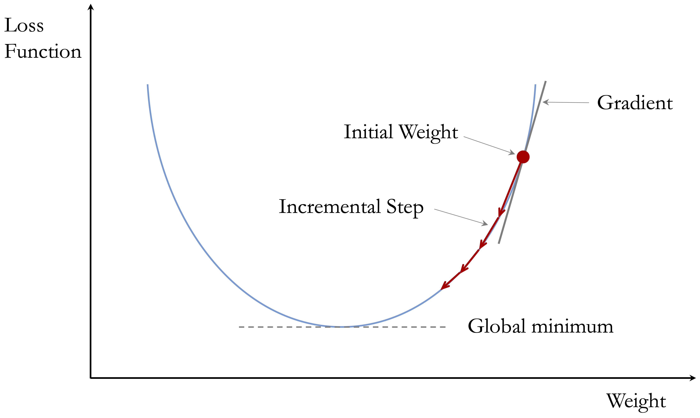

```{r echo=FALSE, message=FALSE, warning=FALSE}
source("_common.R")
```

# Neural Networks for Supervised Learning {#sec-ch13-neural-networks}

::: {.content-visible when-format="pdf"}
\begin{chapterquote}
The Brain — is wider than the Sky —

\hfill — Emily Dickinson
\end{chapterquote}
:::

::::: {.content-visible when-format="html"}
:::: chapterquote
The Brain — is wider than the Sky —

::: author
— Emily Dickinson
:::
::::
:::::

Can a model learn patterns that are too complex for linear regression or other simpler methods to capture well? Neural networks provide one answer to this question. By combining weighted connections, hidden layers, and nonlinear activation functions, they can learn flexible relationships between predictors and outcomes from data.

In this chapter, we focus on feed-forward neural networks, also called multilayer perceptrons (MLPs). These models are among the most accessible neural network architectures and provide a practical introduction to how neural networks operate. They are especially useful when relationships in tabular data are nonlinear or involve interactions that are difficult to specify in advance.

Our goal is not to survey artificial intelligence broadly or to cover advanced deep learning architectures in detail. Instead, we introduce the main ideas behind MLPs and show how they can be applied in R for supervised learning problems. This narrower focus allows us to develop both conceptual understanding and practical modeling skills without losing sight of the broader data science process.

Neural networks are powerful because they can learn nonlinear relationships through a sequence of layered transformations. Rather than relying on a single weighted combination of the inputs, they pass information through hidden layers that allow more complex patterns to be represented. This flexibility makes them useful in many settings, including tabular prediction problems in which predictors interact in ways that are difficult to model explicitly.

At the same time, this flexibility comes with trade-offs. Neural networks are typically less interpretable than models such as linear regression or decision trees, and they often require more careful preprocessing, tuning, and evaluation. Despite these challenges, multilayer perceptrons provide an important extension of the supervised learning methods developed earlier in this book. In the sections that follow, we examine how these models are structured, how they learn from data, and how they can be applied in practice using R.

We continue our progression through the Data Science Workflow introduced in Chapter [-@sec-ch2-intro-data-science]. Earlier chapters examined data preparation and exploration, supervised learning methods for classification and regression (Chapters [-@sec-ch7-classification-knn], [-@sec-ch9-bayes], and [-@sec-ch10-regression]), tree-based models (Chapter [-@sec-ch12-tree-models]), and model evaluation (Chapter [-@sec-ch8-evaluation]). Neural networks now extend this toolkit by offering a flexible modeling approach for both classification and regression when simpler models are not expressive enough.

### What This Chapter Covers {.unnumbered .unlisted}

This chapter introduces multilayer perceptrons as a supervised learning approach for tabular data in R. The emphasis is on understanding how these models are structured, how they learn from data, and how they can be trained and evaluated in an applied setting.

By the end of this chapter, you should understand the basic structure of a neural network, including input, hidden, and output layers, and how weights, bias terms, and activation functions work together to produce nonlinear predictions. You should also understand how neural networks learn through gradient-based optimization, backpropagation, and related training choices such as the learning rate, and how a simple neural network model can be trained and evaluated in R for a supervised learning task. More broadly, the chapter shows how neural network modeling fits within the Data Science Workflow developed throughout this book.

The chapter begins with the biological motivation for neural networks and then examines the structure of artificial neurons, activation functions, network architecture, and learning. It concludes with a case study based on the real-world `bank` dataset, illustrating how a multilayer perceptron can be prepared, trained, and evaluated in practice. A set of exercises at the end of the chapter provides opportunities to reinforce the main ideas and explore extensions of the methods introduced here.

## The Biological Inspiration Behind Neural Networks {#sec-ch13-bio-inspiration}

How can a computational model learn from data without being explicitly programmed with a long set of decision rules? One influential answer comes from neural networks, which were originally inspired by biological information processing, especially the way neurons interact within the brain.

Biological neurons are the basic information-processing units of the nervous system. Each neuron receives signals from other neurons, combines them, and may transmit an output signal if its level of activation is sufficiently strong. Learning and cognition do not arise from a single neuron acting in isolation, but from the collective behavior of many interconnected neurons. The human brain contains on the order of $10^{11}$ neurons linked through synapses, forming an extraordinarily rich system for processing information.

Figure [-@fig-ch13-net-brain] illustrates the basic structure of a biological neuron. Signals are received through dendrites, combined in the cell body, and transmitted along the axon when activation exceeds a threshold.

```{r fig-ch13-net-brain, echo = FALSE, out.width = "100%", fig.cap = "Visualization of a biological neuron, which receives signals through dendrites and transmits output through the axon."}

```

Artificial neural networks are simplified computational models that borrow a few core ideas from this biological picture. They do not attempt to reproduce the full complexity of the brain. Instead, they abstract three central ideas: information is processed through interconnected units, connections can vary in strength, and signals can be transformed in a nonlinear way. These abstractions make neural networks flexible enough to learn complex relationships from data while remaining mathematically and computationally manageable.

This abstraction leads to the artificial neuron shown in @fig-ch13-net-1. In its simplest form, an artificial neuron receives input features ($x_i$), multiplies them by adjustable weights ($w_i$), adds a bias term, and then applies an activation function $f(\cdot)$ to produce an output ($\hat{y}$).

```{r fig-ch13-net-1, echo = FALSE, out.width = "100%", fig.cap = "Illustration of an artificial neuron, which abstracts the biological neuron into a simple computational unit."}

```

This analogy should be understood as a source of intuition rather than a literal description of how modern neural networks operate. Its value lies in showing how complex behavior can emerge from many simple units connected in a network. In the next section, we move from this biological motivation to a more formal description of how neural networks are structured and how they produce predictions.

## How Neural Networks Work {#sec-ch13-how-nn-work}

Neural networks build directly on ideas introduced earlier in regression modeling, but they extend them in a way that allows much richer relationships between predictors and outcomes to be represented. In Chapter [-@sec-ch10-regression], we saw that a linear regression model predicts an outcome as a weighted sum of input features: $$
\hat{y} = b_0 + b_1 x_1 + b_2 x_2 + \dots + b_m x_m,
$$ where $m$ denotes the number of predictors, $b_0$ is the intercept, and $b_1, \dots, b_m$ are regression coefficients. This formulation can be viewed as a simple computational network in which the input features are connected directly to the output through weighted connections, as illustrated in @fig-ch13-net-reg.

```{r fig-ch13-net-reg, echo = FALSE, out.width = "38%", fig.cap = "A graphical representation of a linear regression model, where input features are connected directly to the output through weighted connections."}

```

This representation highlights both the strength and the limitation of linear models. They are interpretable and efficient, but they assume that predictors contribute to the outcome through a single linear combination. As a result, they do not naturally capture complex nonlinear relationships or interactions unless these are introduced explicitly by the analyst.

Neural networks generalize this idea by inserting one or more layers of artificial neurons between the input and output. Instead of mapping predictors directly to the final response, the model first transforms the inputs into intermediate features and then combines those features to produce a prediction. A typical multilayer network is shown in @fig-ch13-net-large.

```{r fig-ch13-net-large, echo = FALSE, out.width = "80%", fig.cap = "Visualization of a feed-forward neural network with two hidden layers."}

```

A feed-forward neural network consists of three types of layers. The input layer receives the predictor variables, one or more hidden layers transform these inputs through weighted connections and activation functions, and the output layer produces the final prediction. Information flows in one direction, from the input layer through the hidden layer or layers to the output layer.

To see this more clearly, consider a neural network with one hidden layer. Each hidden neuron first computes a weighted sum of the inputs and then applies an activation function. If we let $h_j$ denote the output of hidden neuron $j$, then $$
h_j = g\left( w_{j0} + \sum_{i=1}^{m} w_{ji} x_i \right), \qquad j = 1, \dots, H,
$$ where $x_1, \dots, x_m$ are the input features, $w_{ji}$ are weights, $w_{j0}$ is a bias term, $g(\cdot)$ is the hidden-layer activation function, and $H$ is the number of hidden neurons.

In the second stage, the output layer combines these hidden activations to produce the final prediction. For a network with a single output node, this can be written as $$
\hat{y} = f\left( v_0 + \sum_{j=1}^{H} v_j h_j \right),
$$ where $v_j$ are output-layer weights, $v_0$ is an output-layer bias term, and $f(\cdot)$ is the activation function used at the output layer. In other settings, the output layer may contain more than one node, for example in multi-class classification or multi-output prediction problems.

This two-stage structure shows what makes neural networks more flexible than linear regression. The hidden layer creates intermediate representations of the predictors, and the output layer then combines these learned representations to form the final prediction. When nonlinear activation functions are used, the network can represent relationships that are not available to a purely linear model.

This perspective also clarifies the connection with logistic regression. Logistic regression can be viewed as a neural network with no hidden layer and a single sigmoid output unit. In that case, the model still computes a weighted sum of the input features, but the final output is passed through the sigmoid function so that it can be interpreted as a probability.

Although neural network architectures can vary widely, three ideas are central to how they work. First, activation functions allow the model to introduce nonlinear transformations rather than relying only on linear combinations of the predictors. Second, the architecture of the network, including the number of hidden layers and neurons, determines how much complexity the model can represent. Third, the network learns by adjusting its weights and bias terms so that its predictions better match the observed data.

Taken together, these ideas explain why neural networks can model complex patterns while still building on the same basic logic as regression: inputs are combined through weights to produce predictions, but the introduction of hidden layers and nonlinear transformations greatly increases the range of relationships that can be learned. In the following sections, we examine these components in more detail, beginning with activation functions and their role in enabling nonlinear modeling.

## Activation Functions

Activation functions determine how signals are transformed as they pass from one layer of a neural network to the next. Their main purpose is to introduce nonlinearity. Without this step, even a deep network would reduce to a sequence of linear transformations, and adding layers would not meaningfully increase the complexity of the relationships the model could represent.

Activation functions differ in properties such as output range, smoothness, and gradient behavior, and these differences influence both training and predictive performance. Some activation functions are now mainly of historical interest, whereas others play a central role in modern neural networks. In this section, we examine the most important examples and highlight the practical considerations that guide their use.

### From Threshold to Sigmoid {.unnumbered .unlisted}

One of the earliest activation functions is the threshold function, inspired by the all-or-nothing firing behavior of biological neurons. It produces a binary output: $$
f(x) =
\begin{cases}
1 & \text{if } x \geq 0, \\
0 & \text{if } x < 0.
\end{cases}
$$ This step-like behavior is illustrated in @fig-ch13-active-fun. The threshold function played an important historical role in early neural models such as the perceptron, but it is not used in modern neural networks.

```{r fig-ch13-active-fun, echo = FALSE, fig.cap = "Visualization of the threshold activation function (unit step)."}
x_values <- seq(-10, 10, by = 0.1)
data <- data.frame(x = x_values, y = ifelse(x_values >= 0, 1, 0))

ggplot(data, aes(x = x, y = y)) +
  geom_step(color = "#377EB8", size = 1.2) +
  geom_point(aes(x = 0, y = 0), color = "#377EB8", size = 3, shape = 1) +
  geom_point(aes(x = 0, y = 1), color = "#377EB8", size = 3, shape = 16) +
  scale_y_continuous(breaks = c(0, 1), limits = c(-0.2, 1.2)) +
  labs(title = "Unit Step Activation Function",
       x = "Input", y = "Output")
```

The main limitation of the threshold function is that it does not work well with gradient-based learning. Its derivative is undefined at the threshold and zero everywhere else, so it does not provide the gradient information needed for backpropagation. In addition, its binary output is too rigid to represent gradual changes in activation.

A smooth alternative is the sigmoid activation function, also called the logistic function. Instead of switching abruptly from 0 to 1, it changes gradually and maps any real-valued input to the interval $(0, 1)$: $$
f(x) = \frac{1}{1 + e^{-x}}.
$$ Its S-shaped curve is shown in @fig-ch13-active-fun-sigmoid.

```{r fig-ch13-active-fun-sigmoid, echo = FALSE, fig.cap = "Visualization of the sigmoid activation function."}
x_values <- seq(-10, 10, by = 0.01)
data <- data.frame(x = x_values, y = 1 / (1 + exp(-x_values)))

ggplot(data, aes(x = x, y = y)) +
  geom_line(color = "#377EB8", size = 1.2) +
  geom_hline(yintercept = 0.5, linetype = "dashed", color = "gray50") +
  geom_vline(xintercept = 0, linetype = "dashed", color = "gray50") +
  scale_y_continuous(breaks = c(0, 0.5, 1), limits = c(-0.05, 1.05)) +
  labs(title = "Sigmoid Activation Function",
       x = "Input", y = "Output")
```

The sigmoid function is especially important in binary classification because its output lies between 0 and 1 and can therefore be interpreted as a probability. It also connects directly to logistic regression, which can be viewed as a neural network with no hidden layer and a single sigmoid output unit.

Despite this improvement, sigmoid also has limitations. For large positive or negative inputs, the curve becomes nearly flat, so the gradient becomes very small. As a result, weight updates based on backpropagation can also become very small, which may slow learning, especially in deeper networks. For that reason, sigmoid is typically most useful in output layers for binary classification rather than in hidden layers.

### Common Activation Functions in Modern Neural Networks {.unnumbered .unlisted}

Although threshold and sigmoid functions are historically important, modern neural networks usually rely on activation functions with more favorable optimization behavior, especially in hidden layers. Three widely used examples are tanh, ReLU, and Leaky ReLU.

The hyperbolic tangent, or tanh, maps inputs to the interval $(-1, 1)$. Like sigmoid, it is smooth and differentiable, but unlike sigmoid it is zero-centered, which can support more stable optimization in hidden layers. Its main limitation is that it can still saturate when inputs become very large in magnitude, leading to small gradients.

The Rectified Linear Unit, or ReLU, is defined as $$
f(x) = \max(0, x).
$$ It is computationally simple and has a constant gradient for positive inputs. These properties help reduce the vanishing-gradient problem and explain why ReLU became a standard choice in many neural network architectures. Its main weakness is that a neuron can become inactive if its input remains negative, producing zero output and zero gradient.

Leaky ReLU modifies ReLU by allowing a small nonzero slope when the input is negative: $$
f(x) =
\begin{cases}
x & \text{if } x \geq 0, \\
\alpha x & \text{if } x < 0,
\end{cases}
$$ where $\alpha$ is a small positive constant, often chosen as 0.01. This adjustment reduces the risk of permanently inactive neurons while preserving the simplicity and efficiency that make ReLU attractive.

Figure [-@fig-ch13-active-fun-comparison] compares the shapes of the sigmoid, tanh, ReLU, and Leaky ReLU activation functions.

```{r fig-ch13-active-fun-comparison, echo = FALSE, out.width = "80%", fig.cap = "Comparison of common activation functions: sigmoid, tanh, ReLU, and Leaky ReLU."}
x_values <- seq(-5, 5, by = 0.008)
sigmoid <- 1 / (1 + exp(-x_values))
tanh_val <- tanh(x_values)
relu <- pmax(0, x_values)
leaky_relu <- ifelse(x_values >= 0, x_values, 0.01 * x_values)

data <- data.frame(
  x = x_values,
  Sigmoid = sigmoid,
  Tanh = tanh_val,
  ReLU = relu,
  `Leaky ReLU` = leaky_relu
)

data_long <- pivot_longer(data, cols = -x, names_to = "Function", values_to = "Value")

ggplot(data_long, aes(x = x, y = Value, color = Function, linetype = Function)) +
  geom_line(size = 1.1) +
  geom_hline(yintercept = c(-1, 0, 1), linetype = "dashed", color = "gray70") +
  geom_vline(xintercept = 0, linetype = "dashed", color = "gray70") +
  scale_y_continuous(breaks = c(-1, 0, 0.5, 1)) +
  labs(title = "Comparison of Activation Functions",
       x = "Input", y = "Output")
```

These functions differ not only in shape but also in practical role. In the tabular supervised learning setting considered in this chapter, hidden layers are often built using ReLU or a related variant such as Leaky ReLU because these functions are simple, efficient, and usually support stable optimization. Tanh remains a reasonable alternative when a smooth, zero-centered activation is desired, although it is used less often in contemporary practice. For the output layer, the activation function should match the prediction task: sigmoid is natural for binary classification because it produces values in $(0, 1)$ that can be interpreted as probabilities, whereas regression models typically use a linear output activation so that predictions are not artificially restricted. In multiclass classification, the output layer often contains one node per class together with a softmax-type transformation that converts outputs into class probabilities. No single activation function is uniformly best, and in practice the choice should be made in light of the task, the architecture, and the behavior of the optimization procedure.

## Network Architecture: Layers, Capacity, and Design Choices

The performance of a neural network depends not only on how it is trained, but also on how it is structured. This structure, known as the network architecture, determines how information flows through the model and how complex the learned relationships can become.

A neural network’s architecture is defined by the arrangement of neurons and the connections between them. Three aspects are especially important: the number of layers, the number of neurons within each layer, and the pattern of connectivity between layers. Together, these choices determine the model’s capacity to represent patterns in the data.

To illustrate the role of architecture, consider the simple network shown earlier in @fig-ch13-net-reg. This model consists of input nodes connected directly to output nodes through weighted connections. Such a single-layer structure is sufficient for linear regression and closely related models, including logistic regression with a sigmoid output unit, but it cannot by itself represent richer nonlinear relationships or interactions among features.

Neural networks overcome this limitation by introducing one or more hidden layers, as illustrated in @fig-ch13-net-large. Hidden layers apply successive transformations to the data, allowing the model to construct intermediate representations before producing a final prediction. A typical multilayer perceptron therefore consists of an input layer, one or more hidden layers, and an output layer.

In fully connected networks, each neuron in a layer is connected to every neuron in the next layer. These connections are associated with weights that are learned from data during training. By stacking layers and combining them with activation functions, the network can represent complex nonlinear functions through a sequence of simpler transformations.

The number of neurons in each layer plays a central role. The number of input nodes is determined by the number of predictors, and the number of output nodes depends on the task, such as one node for regression, one sigmoid output node for binary classification, or one node per class in a multi-class problem. In contrast, the number of hidden neurons is a modeling choice. Increasing this number expands the expressive capacity of the network, but it also increases computational cost and the risk of overfitting.

These considerations are especially important for tabular data, which is the focus of this chapter. In many tabular supervised learning problems, very deep networks are not automatically better than shallow ones. Because the number of predictors is often modest and the structure of the data is less hierarchical than in images or language, small or moderately sized multilayer perceptrons can already provide useful flexibility without introducing unnecessary complexity.

For this reason, the case study later in the chapter uses a small multilayer perceptron. This choice is made for clarity and teachability, not because a small network is always optimal. A compact architecture makes it easier to see how preprocessing, hidden layers, activation functions, and evaluation fit together within the Data Science Workflow. In practice, more complex architectures may sometimes improve performance, but they also require more careful tuning and more careful control of overfitting.

Choosing an appropriate architecture therefore involves balancing model complexity and generalization. A network that is too simple may underfit important structure in the data, whereas a network that is too large may fit noise rather than signal. Regularization methods such as weight decay or dropout can help reduce this risk, and validation-based comparison is often used to decide whether added complexity actually improves out-of-sample performance.

This section has focused on fully connected multilayer perceptrons, which form the foundation of the neural network models studied in this chapter. Other architectures, such as convolutional neural networks for images and recurrent or sequence-based networks for ordered data, build on related ideas but use connectivity patterns designed for different data structures.

Within the Data Science Workflow, architecture selection is part of the modeling stage. Choosing an appropriate network structure determines the model’s capacity and sets the conditions under which learning can proceed effectively.

## How Neural Networks Learn

How does a neural network improve its predictions over time? At the start of training, the network has not yet learned how its parameters should be set to produce accurate predictions. Learning takes place by using prediction error as feedback: the network compares its outputs with observed outcomes and then adjusts its weights and bias terms so that future predictions better match the data.

This process is iterative. Over repeated passes through the data, the network produces predictions, measures the resulting error through a loss function, and updates its parameters to reduce that error. In modern neural networks, this learning process is driven by gradient-based optimization and made computationally feasible by backpropagation.

### From Prediction Error to Learning {.unnumbered .unlisted}

A neural network learns by using prediction error as feedback. For a given training observation, the inputs are passed through the network, layer by layer, until an output is produced. This step is called the forward pass. The predicted output is then compared with the observed target value using a loss function, which quantifies the discrepancy between the prediction and the observed outcome.

The choice of loss function depends on the task. In regression, a common example is squared error, $$
L = (y - \hat{y})^2,
$$ which measures how far the prediction $\hat{y}$ is from the observed value $y$ for a single observation. Across an entire dataset, these squared errors are added together to form the sum of squared errors. In binary classification, cross-entropy is often more appropriate. In either setting, the loss function converts prediction error into a numerical quantity that training seeks to minimize: poor predictions produce larger loss values, whereas accurate predictions produce smaller ones.

Once this error has been quantified, the next challenge is to determine how each weight and bias term contributed to the loss and how these parameters should be adjusted to improve future predictions. This transition from error measurement to parameter updating is the central idea behind gradient-based optimization.

### Gradient Descent {.unnumbered .unlisted}

Once a loss function has been defined, the next question is how to reduce it. Gradient descent is the basic optimization method used for this purpose. The gradient of the loss with respect to a parameter tells us how the loss changes when that parameter is adjusted by a small amount. Because the gradient points in the direction of steepest increase, we reduce the loss by moving in the opposite direction.

If $w$ denotes a weight and $L$ denotes the loss function, a basic gradient descent update can be written as $$
w^{(t+1)} = w^{(t)} - \eta \frac{\partial L}{\partial w},
$$ where $\eta$ is the learning rate and $t$ indexes the update step. This expression says that the new value of the weight is obtained by taking the current value and subtracting a correction based on the gradient. The term $\frac{\partial L}{\partial w}$ measures how strongly the loss depends on the weight $w$, while the learning rate determines how large the update should be.

To build intuition, Figure [-@fig-ch13-gradient-descent] shows gradient descent in a one-dimensional optimization problem. The horizontal axis represents a single parameter value, and the vertical axis represents the corresponding loss. Starting from an initial parameter value, gradient descent updates the parameter iteratively in the direction that reduces the loss. The arrows indicate the direction of the update at different points along the curve, guiding the parameter toward a minimum of the loss function. Although real neural networks are trained in a high-dimensional parameter space, this simplified example illustrates the basic idea behind gradient-based optimization.

```{r fig-ch13-gradient-descent, echo = FALSE, out.width = "75%", fig.cap = "Illustration of gradient descent in a one-dimensional optimization problem. The parameter is updated iteratively in the direction that reduces the loss."}

```

This update is applied repeatedly across the parameters of the network. In practice, training proceeds over multiple passes through the data. One complete pass through the full training set is called an epoch. Over many epochs, the parameters are gradually adjusted so that the loss decreases and the predictions improve. In larger problems, updates are often based on one observation or a small subset of observations at a time, which leads to methods such as stochastic gradient descent and mini-batch gradient descent.

### Backpropagation {.unnumbered .unlisted}

Gradient descent tells us how to update the weights once the gradients are known. Backpropagation tells us how to compute those gradients efficiently in a multilayer network.

The basic idea is simple: the prediction error is first observed at the output layer, and then that error is propagated backward through the network. This is done using the chain rule of calculus, which traces how a change in one parameter affects the final loss through a sequence of intermediate steps.

To illustrate the idea, consider a network with one hidden layer and a single output node. For hidden neuron $j$, let $$
a_j = w_{j0} + \sum_{i=1}^{m} w_{ji} x_i, \qquad h_j = g(a_j),
$$ and let the final prediction be $$
z = v_0 + \sum_{j=1}^{H} v_j h_j, \qquad \hat{y} = f(z).
$$ Here, $w_{ji}$ is the weight from input $x_i$ to hidden neuron $j$, $v_j$ is the weight from hidden neuron $j$ to the output, $g(\cdot)$ is the hidden-layer activation function, and $f(\cdot)$ is the output-layer activation function.

Backpropagation works by tracing how the loss depends on each parameter through these intermediate quantities. For a hidden-layer weight $w_{ji}$, the chain rule gives $$
\frac{\partial L}{\partial w_{ji}}
=
\frac{\partial L}{\partial \hat{y}}
\cdot
\frac{\partial \hat{y}}{\partial z}
\cdot
v_j
\cdot
g'(a_j)
\cdot x_i.
$$ Although this expression may look technical, its interpretation is straightforward. The gradient depends on five linked components: how the loss changes with the prediction, how the prediction changes with the output-layer input, how strongly hidden unit $j$ influences the output, how the hidden activation changes with its own input, and how strongly input $x_i$ contributes to that hidden unit. In other words, the final prediction error is passed backward through the network, and each step scales the contribution of the weight under consideration.

This is the central idea of backpropagation. The algorithm does not guess which weights should change. Instead, it uses the chain rule to determine how strongly each parameter contributed to the loss, allowing the network to update its weights efficiently. The goal here is not to memorize the formula, but to understand what it shows: backpropagation makes gradient-based learning feasible in multilayer neural networks.

### Learning Rate and Training Stability {.unnumbered .unlisted}

The learning rate $\eta$ plays a crucial role in training because it controls the size of each parameter update. If $\eta$ is too large, the updates may be unstable, causing the optimization process to overshoot good solutions or oscillate rather than settle. If $\eta$ is too small, training may proceed very slowly and require many epochs before the loss decreases meaningfully.

Choosing an appropriate learning rate is therefore an important practical decision. In applied work, it is often treated as a tuning parameter and assessed through validation. A learning rate that is too large may produce erratic changes in the loss or even prevent convergence, whereas a learning rate that is too small may yield a very smooth but frustratingly slow improvement. A well-chosen learning rate typically produces a steady and stable reduction in loss over time.

The broader lesson is that successful neural network training depends not only on the structure of the model, but also on sensible choices in the optimization procedure. In practice, effective learning requires a balance between model design, parameter tuning, and validation-based evaluation.

### Momentum {.unnumbered .unlisted}

A useful refinement of gradient descent is momentum. Instead of updating parameters solely on the basis of the current gradient, momentum also incorporates part of the previous update. This can smooth the optimization path, reduce oscillation, and help the algorithm move more efficiently across uneven loss surfaces.

The main idea is that the update retains some memory of previous steps. When successive gradients point in a similar direction, momentum can accelerate learning. When the optimization path begins to oscillate, momentum can help dampen unstable back-and-forth movement. In this way, momentum often leads to smoother and more efficient training than basic gradient descent alone.

Many modern optimization methods build on this same idea by adapting learning rates or combining information across successive updates. In this chapter, however, the goal is not to survey optimization algorithms in detail, but to understand the core learning mechanism of neural networks.

### Termination Criteria {.unnumbered .unlisted}

Training does not continue indefinitely. In practice, neural network training stops once a chosen termination criterion is satisfied. One simple approach is to fix a maximum number of epochs in advance. Another is to stop when the loss changes only negligibly from one epoch to the next, suggesting that the optimization process is approaching convergence.

In applied modeling, it is often more informative to monitor performance on a validation set than to rely only on the training loss. A network may continue to improve its fit to the training data while beginning to overfit, which can reduce performance on new observations. For this reason, a common strategy is early stopping, in which training is halted once validation performance no longer improves. This provides a practical way to balance continued learning against the risk of overfitting.

Termination criteria therefore serve two related purposes: they avoid unnecessary computation and help control overfitting. In practice, stopping rules are chosen together with other training settings, including the learning rate, the number of epochs, and the overall model architecture.

Taken together, these ideas explain how a neural network turns prediction error into learning. With this foundation in place, we now turn to a practical case study that shows how a neural network can be trained and evaluated on real-world data in R.

## Case Study: Predicting Term Deposit Subscriptions {#sec-ch13-case-study}

This case study illustrates how neural networks can support data-driven marketing decisions in the financial sector. Using data from a previous telemarketing campaign, we develop a classification model to predict whether a customer will subscribe to a term deposit. The aim is to identify patterns in customer characteristics and campaign-related information that can support more targeted and efficient outreach.

The dataset comes from the UC Irvine Machine Learning Repository and is distributed with the **liver** package. It was introduced by @moro2014data in the context of analyzing bank marketing campaigns. The response variable records whether a customer subscribed to a term deposit, while the predictors include a combination of demographic attributes and campaign-related features. This combination makes the dataset well suited for illustrating how multilayer perceptrons can be used in a supervised classification setting.

Following the Data Science Workflow introduced in Chapter [-@sec-ch2-intro-data-science] and illustrated in @fig-ch2_DSW, the case study moves from problem understanding to model training and evaluation. Throughout, the emphasis is on good modeling practice, reproducibility, and the role of neural networks within a broader analytical workflow implemented in R.

### Problem Understanding {.unnumbered .unlisted}

Financial institutions regularly face the challenge of deciding how to use marketing resources effectively. One important question is which customers are more likely to respond positively to a campaign, so that outreach can be made more selective and efficient.

In practice, marketing strategies range from broad mass campaigns to more targeted, data-driven approaches. Mass campaigns are simple to implement but often produce low response rates. Directed marketing, by contrast, uses predictive models to identify customers with a higher probability of interest. This can improve conversion rates, but it also raises important concerns related to privacy, fairness, and customer trust.

This case study focuses on term deposit subscriptions in the context of bank marketing campaigns. A term deposit is a fixed-term savings product that usually offers a higher interest rate than a standard savings account. From the institution’s perspective, attracting such subscriptions can provide a stable source of funding; from the customer’s perspective, it offers a predictable return over a fixed period. Using data from earlier campaigns, our aim is to estimate the probability that a customer will subscribe to such a product.

From a modeling perspective, this is a binary classification problem: the outcome records whether a customer subscribes to a term deposit or not. The predictors combine customer characteristics with campaign-related information, including the duration of the last contact. Because `duration` is only observed after a contact has taken place, the model should be interpreted as a campaign-response or benchmark prediction model rather than as a strict pre-contact targeting tool. Within that setting, the practical objective is to use available information to support more selective decision-making while remaining mindful of the broader responsibility to use customer data carefully and appropriately.

### Overview of the Dataset {.unnumbered .unlisted}

The `bank` dataset contains information from direct phone-based marketing campaigns conducted by a financial institution. Each observation corresponds to a customer who was contacted during a campaign, and the objective is to predict whether the customer subscribed to a term deposit (`deposit = "yes"` or `"no"`). The dataset combines demographic characteristics with information about prior contacts and campaign interactions, making it suitable for supervised classification using neural networks.

We begin by loading the dataset into R and inspecting its structure to understand the types of variables available for modeling:

```{r}
library(liver)

data(bank)

str(bank)
```

The dataset consists of `r nrow(bank)` observations and `r ncol(bank)` variables. The response variable, `deposit`, is binary, indicating whether a customer subscribed to a term deposit. The predictors can be grouped into the following categories.

*Demographic and financial characteristics* include age, job type, marital status, education level, credit default status, and average yearly account balance. These variables capture relatively stable attributes of customers that may influence their likelihood of subscribing.

*Loan-related variables* indicate whether a customer holds a housing loan or a personal loan. These features provide additional context about the customer’s financial commitments.

*Campaign-related variables* describe how and when customers were contacted, as well as their interaction history. These include the contact type, timing variables such as day and month, the duration of the last contact in seconds, the number of contacts during the campaign, the number of previous contacts, and the outcome of earlier campaigns.

Together, these features provide a rich description of both customer profiles and campaign dynamics. For the purposes of this case study, the dataset does not require extensive data cleaning, but it does require preprocessing before neural network modeling. We therefore proceed directly to *Step 4: Data Setup for Modeling* in the Data Science Workflow introduced in Chapter [-@sec-ch2-intro-data-science] and illustrated in @fig-ch2_DSW.

### Data Setup for Modeling {.unnumbered .unlisted}

A central question in predictive modeling is how well a model performs on data it has not seen before. Addressing this question begins with how the data are partitioned. This step corresponds to *Step 4: Data Setup for Modeling* in the Data Science Workflow introduced in Chapter [-@sec-ch2-intro-data-science].

We divide the dataset into separate training and test sets so that the model can be trained on one subset of the data and evaluated on another. Although this case study focuses on neural networks, using a common data split also supports fair comparison with other classification methods introduced earlier in the book, such as tree-based models (Chapter [-@sec-ch12-tree-models]), logistic regression (Chapter [-@sec-ch11-generalized-regression]), and Naive Bayes (Chapter [-@sec-ch9-bayes]). Evaluation under identical conditions is essential for meaningful performance comparison, as discussed in Chapter [-@sec-ch8-evaluation].

We use an 80/20 split, allocating 80% of the observations to the training set and 20% to the test set. This ratio provides a practical balance between giving the model enough data to learn from and reserving enough observations for reliable evaluation. Alternative splits are possible, and readers are encouraged to explore how different choices affect the results.

To maintain consistency with earlier chapters, we apply the `partition()` function from the **liver** package:

```{r}
set.seed(42)

splits = partition(data = bank, ratio = c(0.8, 0.2))

train_set = splits$part1
test_set  = splits$part2

test_labels = test_set$deposit
```

Setting the random seed ensures reproducibility. The training set is used to fit the neural network, while the test set is reserved for performance evaluation. The vector `test_labels` stores the true class labels for later comparison with model predictions. A useful partition should also preserve the overall class balance of the response variable so that the training and test sets remain broadly comparable (see Section [-@sec-ch6-cross-validation]).

Our modeling objective is to classify customers as likely (`deposit = "yes"`) or unlikely (`deposit = "no"`) to subscribe to a term deposit using the predictors `age`, `marital`, `default`, `balance`, `housing`, `loan`, `duration`, `campaign`, `pdays`, and `previous`.

Only a subset of the available predictors is used at this stage. This choice is intentional: it keeps the preprocessing and model specification focused while still illustrating the core workflow of neural network modeling. Variables such as `job`, `education`, `contact`, `day`, `month`, and `poutcome` are excluded initially, and readers are encouraged to incorporate them in the exercises to examine how a richer feature set affects model performance. The variable `duration` is retained in the main model because it is highly informative in this dataset, but it should be interpreted with care: since it records the duration of the last contact in seconds, it is better viewed as a benchmark or campaign-response predictor than as a feature available for strict pre-contact targeting.

With the data partitioned and the predictor set defined, we now prepare the data for modeling. Two preprocessing steps are required: encoding categorical variables and scaling numerical features. These steps are essential because neural networks operate on numerical inputs and are sensitive to differences in feature scale.

> *Practice:* Repartition the `bank` dataset into a 70% training set and a 30% test set using the same procedure. Examine whether the class distribution of the target variable `deposit` is similar in both subsets, and explain why preserving this balance is important for reliable and fair model evaluation.

#### Encoding Binary and Nominal Predictors {.unnumbered .unlisted}

Neural networks operate on numerical inputs, which means that categorical predictors must be converted into numeric form before modeling. For binary and nominal (unordered) variables, one-hot encoding provides a flexible and widely used solution. This approach represents categories through binary indicators, allowing the network to learn category-specific effects through its weights.

Before applying one-hot encoding, the categorical variables in the training and test sets should use the same factor levels. Otherwise, encoding them separately may produce different columns if a category appears in one subset but not the other. We therefore ensure consistent levels before encoding. We then apply the `one.hot()` function from the **liver** package to encode the selected categorical variables in both the training and test sets:

```{r}
categorical_vars = c("marital", "default", "housing", "loan")

train_onehot = one.hot(train_set, cols = categorical_vars)
test_onehot  = one.hot(test_set,  cols = categorical_vars)
```

If desired, the transformed datasets can be inspected using functions such as `str()` or `names()` to verify how the original categorical variables have been expanded into binary indicators. It is also good practice to check that the encoded training and test sets contain the same predictor columns, which confirms that the encoding process has been applied consistently.

The `one.hot()` function expands each categorical variable into binary columns. For example, the variable `marital`, which has three categories (`married`, `single`, and `divorced`), is represented through indicators such as `marital_married`, `marital_single`, and `marital_divorced`. Depending on the encoding convention, one category may be omitted from the final model formula to keep the predictor set compact and avoid unnecessary redundancy. For neural networks, the main goal is not regression-style identifiability, but a consistent and usable numerical representation of the predictors.

Ordinal variables require additional care. Applying one-hot encoding to such features may ignore meaningful order information. Alternative encoding strategies are often more appropriate in those cases; see Section [-@sec-ch6-encoding] for a more detailed discussion.

With categorical predictors encoded, we now turn to feature scaling. This step is particularly important for neural networks, because differences in numerical scale can strongly influence optimization and learning behavior.

#### Feature Scaling for Numerical Predictors {.unnumbered .unlisted}

Neural networks are sensitive to the scale of input features because learning relies on gradient-based optimization. When predictors vary widely in magnitude, variables with larger numerical ranges can dominate the updating process and make training slower or less stable. To mitigate this issue, we apply min-max scaling (as introduced in Section [-@sec-ch6-feature-scaling]) to the numerical predictors, mapping their values to the interval $[0, 1]$. When inputs are placed on a common scale, the resulting gradients are typically better balanced across predictors, which helps the network train more efficiently. Other scaling methods are also possible, but min-max scaling is a convenient choice here because it places all numerical predictors on a common scale and keeps the preprocessing pipeline simple and transparent for illustrating neural network modeling.

To avoid data leakage, the scaling parameters must be estimated using only the training data and then applied unchanged to the test set. This ensures that information from the test data does not influence model training and preserves the validity of subsequent evaluation. A visual illustration of the consequences of improper scaling is provided in @fig-ch7-ex-proper-scaling (Section [-@sec-ch7-knn-prep]).

```{r}
numeric_vars = c("age", "balance", "duration", "campaign", "pdays", "previous")

min_train = sapply(train_onehot[, numeric_vars], min)
max_train = sapply(train_onehot[, numeric_vars], max)

train_scaled = minmax(train_onehot, col = numeric_vars,
                      min = min_train, max = max_train)

test_scaled  = minmax(test_onehot,  col = numeric_vars,
                      min = min_train, max = max_train)
```

The minimum and maximum values for each numerical predictor are estimated from the training set and then reused to scale both datasets consistently. The `minmax()` function from the **liver** package applies this transformation while preserving the overall shape of each variable’s distribution.

With categorical encoding and feature scaling completed, the data are now in a form suitable for neural network modeling. We therefore proceed to training the neural network.

> *Practice:* Using a 70% training set and a 30% test set for the `bank` dataset, apply the same preprocessing pipeline described in this section. One-hot encode the binary and nominal predictors and apply min-max scaling to the numerical predictors, ensuring that scaling parameters are computed using the training data only. Verify that the transformed training and test sets have compatible feature structures, and explain why this consistency is essential for neural network modeling.

### Training a Neural Network Model in R {.unnumbered .unlisted}

The learning ideas introduced earlier in the chapter provide the conceptual basis for training, while the **neuralnet** package uses a practical implementation of these ideas for fitting the model. This package provides a transparent and accessible implementation that is well suited for illustrating neural network modeling in small- to medium-sized applications.

To train the model, we specify a formula in which `deposit` is the response variable and combine the encoded categorical predictors with the numerical features introduced earlier:

```{r}
formula = deposit ~ marital_married + marital_single + default_yes + housing_yes + loan_yes + age + balance + duration + campaign + pdays + previous
```

We then fit a neural network using the `neuralnet()` function:

```{r}
library(neuralnet)

neuralnet_model = neuralnet(
  formula = formula,
  data = train_scaled,
  hidden = 1,
  err.fct = "ce",
  linear.output = FALSE
)
```

Here, `train_scaled` contains the preprocessed training data, and `hidden = 1` specifies a minimal baseline architecture with a single hidden neuron. This deliberately simple design is chosen for clarity and teachability, not because it is universally optimal. It allows us to focus on the modeling workflow and the interpretation of predictions before considering more complex architectures. Because the task is binary classification, we use cross-entropy as the error function (`err.fct = "ce"`), and `linear.output = FALSE` ensures a nonlinear output appropriate for classification.

After training, the fitted network can be visualized as follows:

```{r out.width = "80%"}
plot(neuralnet_model, fontsize = 10,
     col.entry = "#377EB8", col.hidden = "#E66101", col.out = "#4DAF4A")
```

The resulting diagram shows input nodes corresponding to the selected predictors, a single hidden layer with one neuron, and two output nodes corresponding to the two class levels of the response variable, `deposit = "no"` and `deposit = "yes"`. Although the task is binary classification, the plot reflects the two levels used to represent the response. Training stops once the optimization procedure reaches the specified stopping criterion. The package also supports repeated training runs through the `rep` argument, although we use a single run here for simplicity.

A small architecture like this is useful for instructional purposes, but it is not necessarily optimal. More complex models can be considered by increasing the number of hidden neurons or hidden layers. For example, the following model uses one hidden layer with three neurons:

```{r eval = FALSE}
neuralnet_model_3 = neuralnet(
  formula = formula,
  data = train_scaled,
  hidden = 3,
  err.fct = "ce",
  linear.output = FALSE
)
```

Increasing architectural complexity may improve flexibility, but it also increases computational cost and the risk of overfitting. For that reason, model evaluation remains essential when comparing alternative network structures.

The **neuralnet** package is primarily intended for educational purposes and relatively small-scale applications. For larger datasets or deeper architectures, more specialized frameworks such as **keras** or **torch** provide greater flexibility, but those tools fall outside the scope of this chapter. Having trained the neural network, we now evaluate its predictive performance on unseen test data.

> *Practice:* Using a 70% training set and a 30% test set for the `bank` dataset, apply the same preprocessing pipeline described earlier in this case study. Then fit a neural network with two hidden layers by setting `hidden = c(3, 2)` in the `neuralnet()` function. Compare this model with the simpler network that uses `hidden = 1`, and discuss whether the added architectural complexity appears to improve predictive performance enough to justify its use.

### Prediction and Model Evaluation {.unnumbered .unlisted}

To assess how well the neural network generalizes to unseen data, we evaluate its predictive performance on the test set. This corresponds to the final stage of the Data Science Workflow: model evaluation, as discussed in Chapter [-@sec-ch8-evaluation].

We begin by generating predictions from the fitted network:

```{r}
neuralnet_probs = predict(neuralnet_model, test_scaled)
```

Because the response variable `deposit` has two levels, the fitted network returns two output values corresponding to `deposit = "no"` and `deposit = "yes"`. In the evaluation that follows, we focus on the output associated with `deposit = "yes"`:

```{r}
round(head(neuralnet_probs), 2)

# Extract predictions for 'deposit = "yes"'
neuralnet_probs_yes = neuralnet_probs[, 2]
```

To obtain class predictions, we apply a decision threshold of 0.5 and summarize the results with a confusion matrix:

```{r}
conf.mat(neuralnet_probs_yes, test_labels, cutoff = 0.5, reference = "yes")
```

The confusion matrix summarizes the classification outcomes in terms of true positives, false positives, true negatives, and false negatives. These quantities help us understand the types of errors the model makes and their practical implications, such as unnecessary customer contact or missed subscription opportunities. In this setting, it is worth asking which type of error is more costly for the institution: contacting customers who are unlikely to subscribe, or failing to identify customers who would have responded positively.

To place the neural network results in context, we also fit a logistic regression model using the same training and test split and the same predictor set. This provides a direct benchmark and allows us to compare predictive performance under identical conditions:

```{r}
logit_model = glm(formula, data = train_scaled, family = binomial)

logit_probs = predict(logit_model, newdata = test_scaled, type = "response")
```

Because predictive performance depends on the chosen threshold, it is also useful to compare the models across all possible cutoffs. We therefore compute ROC curves and AUC values for both models using the **pROC** package:

```{r}
library(pROC)

neuralnet_roc = roc(test_labels, neuralnet_probs_yes)
logit_roc = roc(test_labels, logit_probs)

ggroc(list(neuralnet_roc, logit_roc), size = 0.9) +
scale_color_manual(values = c("#377EB8", "#E66101"),
                 labels = c(
                   paste("Neural Network; AUC =", round(auc(neuralnet_roc), 3)),
                   paste("Logistic Regression; AUC =", round(auc(logit_roc), 3))
                 )) +
  ggtitle("ROC Curves: Neural Network vs Logistic Regression") + 
  theme(legend.title = element_blank(), legend.position = c(.7, .3))
```

The ROC curve shows how sensitivity and specificity trade off as the classification threshold varies, while the AUC provides a threshold-independent summary of predictive performance. In this case, the neural network and logistic regression model achieve very similar AUC values. This is not surprising: the neural network uses a deliberately simple baseline architecture, and both models are fitted with the same predictor set. The comparison is useful because it shows that added model flexibility does not automatically translate into a substantial improvement in predictive performance.

Taken together, the confusion matrix and ROC analysis provide a fuller view of model performance than any single metric alone. They also clarify the trade-off between flexibility and interpretability. Logistic regression offers a simpler and more transparent benchmark, whereas the neural network offers additional flexibility but may not always deliver a large gain in accuracy. Because the predictor `duration` is included in the model, the resulting performance should be interpreted in the campaign-response or benchmark setting described earlier rather than as the performance of a strict pre-contact targeting model.

> *Practice:* Using the 70% training and 30% test split introduced earlier, fit the neural network model and report the corresponding confusion matrix, ROC curve, and AUC value. Compare these results with those obtained using the 80% training and 20% test split, and discuss what this reveals about the stability of performance estimates. You may also explore alternative classification thresholds, such as 0.4 or 0.6, and examine how the confusion matrix changes.

This case study illustrates how neural networks can be applied within a complete data science workflow, from data preparation to model training and evaluation. Using the `bank` dataset, we showed how preprocessing choices such as encoding, scaling, and data partitioning shape the modeling pipeline, and how tools such as confusion matrices, ROC curves, and AUC support a more informed assessment of predictive performance. The comparison with logistic regression highlights an important practical lesson: additional model flexibility does not automatically lead to a substantial improvement in accuracy. At the same time, because the model includes `duration`, the results should be interpreted in the campaign-response setting described earlier rather than as the performance of a strict pre-contact targeting model. More generally, effective modeling requires not only fitting a model, but also interpreting its results carefully, comparing it with simpler alternatives, and ensuring that the predictors used are appropriate for the decision context.

## Chapter Summary and Takeaways

This chapter introduced neural networks for supervised learning, with a particular focus on multilayer perceptrons for tabular data in R. Building on earlier ideas from regression and classification, we examined how neural networks use hidden layers, activation functions, and gradient-based learning to model relationships that are more complex than those captured by simpler linear approaches.

Several main ideas emerged. Neural networks extend linear models by introducing hidden layers and nonlinear activation functions, which allow them to represent interactions and more flexible decision boundaries. Activation functions shape how information flows through the network and therefore affect both model expressiveness and training behavior. Neural network training proceeds iteratively: prediction error is measured through a loss function, gradients are computed through backpropagation, and parameters are updated to reduce that loss. At the same time, architecture matters. The number of layers and neurons influences model capacity, computational cost, and the risk of overfitting, so these choices should be guided by the problem rather than made mechanically.

The case study on term deposit subscriptions showed how these ideas come together in practice. Using the `bank` dataset, we prepared the data through encoding and scaling, trained a simple neural network model, and evaluated its performance using a confusion matrix, ROC curve, and AUC. This example reinforced several practical lessons. Neural networks require careful preprocessing because their training is sensitive to how inputs are represented and scaled. Greater architectural complexity does not automatically lead to better predictive performance. In tabular supervised learning problems, simpler models such as logistic regression can remain strong and informative benchmarks. More generally, effective neural network modeling depends not only on flexibility, but also on careful data preparation, thoughtful model design, rigorous evaluation, and clear interpretation of the prediction setting and available predictors.

## Exercises {#sec-ch13-exercises}

These exercises consolidate your understanding of neural networks through conceptual reflection, hands-on modeling, and comparative analysis. They are organized into three parts: conceptual questions, applied exercises based on the `bank`, `adult`, and `insurance` datasets, and a final self-reflection section.

### Conceptual Questions {.unnumbered .unlisted}

1.  Describe the basic structure of a neural network and explain the roles of the input, hidden, and output layers.

2.  What is the purpose of an activation function? Why is nonlinearity essential in neural networks?

3.  Compare the sigmoid, tanh, ReLU, and Leaky ReLU activation functions. What are the main strengths and limitations of each?

4.  Explain how a neural network extends a linear model.

5.  What is the role of the loss function in neural network training?

6.  Explain the basic idea of gradient descent. Why does the update move in the direction opposite to the gradient?

7.  What is backpropagation, and why is it essential for training multilayer neural networks?

8.  What does the learning rate control? What can go wrong if it is chosen too large or too small?

9.  What is the purpose of a termination criterion such as early stopping?

10. How does increasing the number of hidden layers or neurons affect model flexibility, computational cost, and the risk of overfitting?

11. What symptoms indicate that a neural network is underfitting or overfitting the data? What practical steps can be used to address each problem?

12. Compare neural networks with logistic regression and decision tree models in terms of flexibility, interpretability, and predictive performance.

13. Why do neural networks require careful preprocessing, especially for categorical predictors and variables on different numerical scales?

14. In tabular supervised learning problems, why is it useful to compare a neural network with simpler benchmark models before concluding that the neural network is preferable?

### Hands-On Practice: Neural Networks with the `bank` Dataset {.unnumbered .unlisted}

In the case study, we used the `bank` dataset to build and evaluate a simple neural network model for predicting term deposit subscriptions. In the following exercises, you will extend that analysis by exploring alternative model architectures, comparing neural networks with simpler benchmark models, and examining how specific modeling choices influence predictive performance.

15. Load the `bank` dataset and examine its structure. Which variables are categorical, and which are numerical?

16. Split the dataset into a 70% training set and a 30% test set. Check whether the class distribution of `deposit` is similar in both subsets, and explain why this matters for fair model evaluation.

17. Apply the same preprocessing pipeline used in the case study. One-hot encode the categorical predictors and apply min-max scaling to the numerical predictors. Verify that the transformed training and test sets have compatible feature structures.

18. Fit the baseline neural network model described in the chapter using the 70% training set and the same predictor set. Report its confusion matrix, ROC curve, and AUC on the test set.

19. Fit a neural network with one hidden layer containing five neurons. Compare its predictive performance with that of the baseline model.

20. Increase the number of neurons in the hidden layer to ten. Does the added complexity improve performance, or does it mainly increase computational cost?

21. Fit a neural network with two hidden layers by setting `hidden = c(5, 3)`. Compare this architecture with the previous one-layer models in terms of predictive performance and stability.

22. Refit the neural network after removing the variable `duration` from the predictor set. How much does this change the model’s performance, and what does this suggest about the role of `duration` in this dataset?

23. Fit a neural network using sum of squared errors instead of cross-entropy. Compare the results and discuss which loss function appears more suitable for this binary classification task.

24. For the preferred neural network model, compute the confusion matrix and interpret its precision, recall, and F1-score. In this marketing context, which type of classification error is likely to be more costly?

25. Plot the ROC curve and compute the AUC for the preferred neural network model. How well does the model distinguish between subscribers and non-subscribers?

26. Fit a logistic regression model using the same training and test split and the same predictor set. Compare its predictive performance with that of the neural network.

27. Train a CART model and a C5.0 decision tree using the same training and test sets. Compare their performance with that of the neural network and logistic regression.

28. Train a random forest model on the same data. Does it provide a meaningful improvement over the other models?

29. Considering predictive performance, interpretability, and the role of `duration`, which model appears most appropriate for this problem? Discuss the trade-offs you observe.

### Extension: Neural Networks with the `adult` Dataset {.unnumbered .unlisted}

These exercises extend the chapter’s classification workflow to a second dataset. The `adult` dataset is commonly used to predict whether an individual earns more than \$50K per year based on demographic and employment attributes. The goal here is not to repeat the full case study, but to apply the same preprocessing and modeling strategy to a different classification problem and compare the neural network with simpler alternatives.

30. Load the `adult` dataset and examine its structure. Identify key differences between this dataset and the `bank` dataset.

31. Prepare the data for modeling by handling missing values where necessary, one-hot encoding the categorical predictors, and scaling the numerical predictors. Use the same general preprocessing principles introduced earlier in this chapter.

32. Split the dataset into an 80% training set and a 20% test set.

33. Fit a neural network with one hidden layer containing five neurons to predict income level (`<=50K` or `>50K`). Evaluate its performance on the test set using a confusion matrix, ROC curve, and AUC.

34. Increase the number of neurons in the hidden layer to ten, or fit a network with two hidden layers. Does the added complexity appear to improve predictive performance meaningfully?

35. Fit a logistic regression model using the same training and test split and compare its performance with that of the neural network. Which model seems preferable, and why?

36. Compare the results for the `adult` dataset with those obtained earlier for the `bank` dataset. What do these two examples suggest about when neural networks may or may not offer a meaningful advantage over simpler classification models?

### Hands-On Practice: Neural Networks with the `insurance` Dataset {.unnumbered .unlisted}

These exercises extend the chapter from classification to regression. The `insurance` dataset in the **liver** package can be used to predict a numerical response, such as medical insurance charges, from demographic and health-related predictors. The goal is to apply the same general workflow introduced in this chapter while adapting it to a regression setting.

37. Load the `insurance` dataset and examine its structure. Which variables are categorical, and which are numerical? What is the response variable?

38. Prepare the data for modeling by one-hot encoding the categorical predictors and scaling the numerical predictors. Explain why scaling is useful for neural networks in this regression setting as well.

39. Split the dataset into an 80% training set and a 20% test set.

40. Fit a neural network for regression using the `neuralnet()` function with `linear.output = TRUE` and a small architecture, for example one hidden layer with five neurons.

41. Evaluate the regression model on the test set using measures such as RMSE and MAE. What do these values suggest about predictive accuracy?

42. Fit a second neural network with a more complex architecture, such as one hidden layer with ten neurons or two hidden layers. Does the added complexity improve predictive performance meaningfully?

43. Fit a multiple linear regression model using the same training and test split. Compare its predictive performance with that of the neural network. Which model appears preferable, and why?

44. Reflect on the difference between using neural networks for classification and for regression. What changes in the output layer, the evaluation criteria, and the interpretation of model performance?

### Self-Reflection {.unnumbered .unlisted}

45. Reflect on how model complexity, interpretability, and predictive performance differed across the models you explored in this chapter, including neural networks, logistic regression, and tree-based methods. Under what circumstances does the additional flexibility of a neural network appear worthwhile, and when might a simpler model be preferable?

46. Looking across both the classification and regression exercises, which parts of the modeling pipeline did you find most challenging or most insightful: data preparation, architecture choice, tuning, evaluation, or interpretation? How would these experiences influence the way you approach a new dataset in the future?
