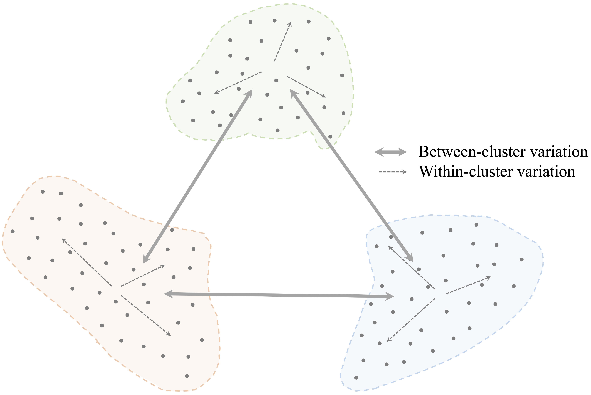
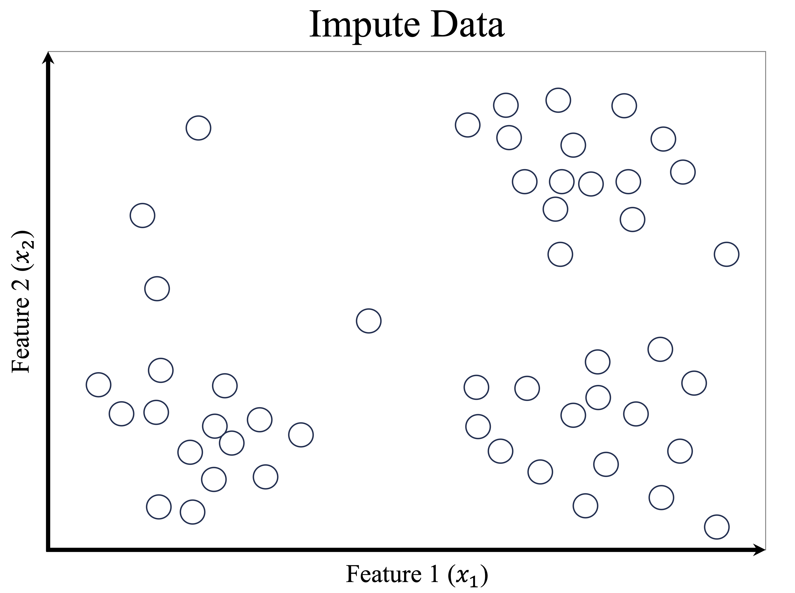
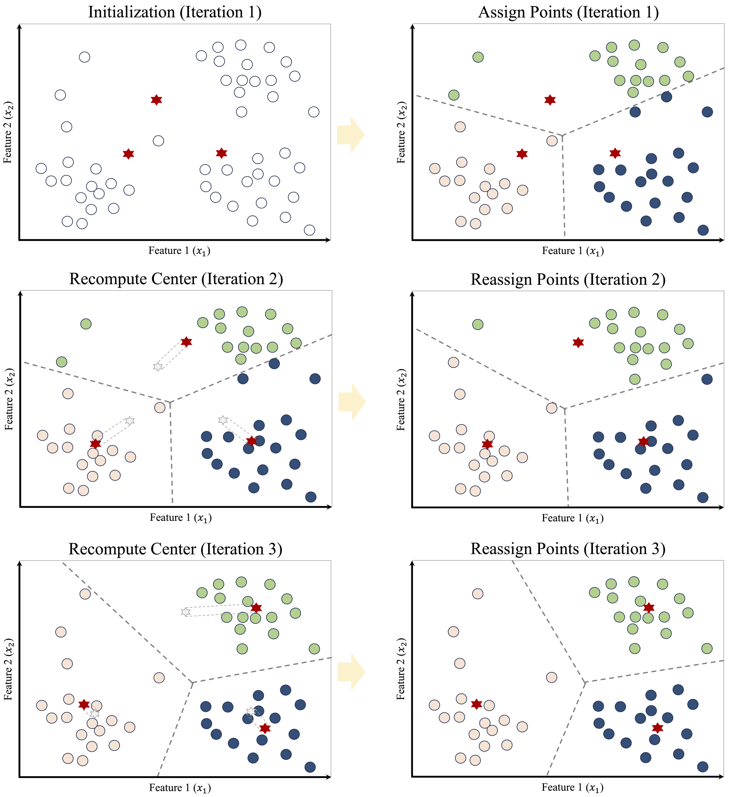
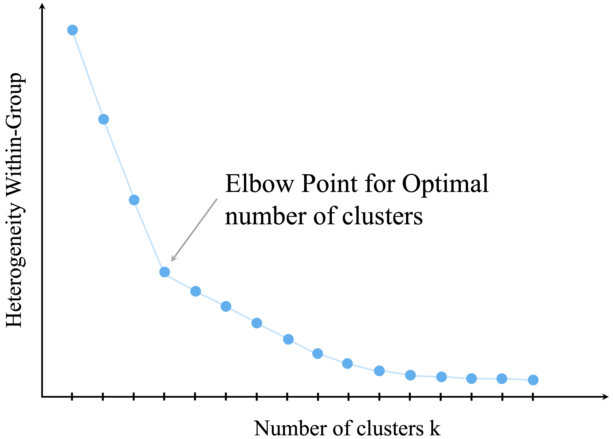

```{r echo=FALSE, message=FALSE, warning=FALSE}
source("_common.R")
```

# Clustering for Insight: Segmenting Data Without Labels {#sec-ch14-clustering}

::: {.content-visible when-format="pdf"}
\begin{chapterquote}
Science is built of facts, as a house is built of stones; but an accumulation of facts is no more a science than a heap of stones is a house.

\hfill — Henri Poincaré
\end{chapterquote}
:::

::::: {.content-visible when-format="html"}
:::: chapterquote
Science is built of facts, as a house is built of stones; but an accumulation of facts is no more a science than a heap of stones is a house.

::: author
— Henri Poincaré
:::
::::
:::::

Not every data problem begins with labels. A retailer may know what each customer bought, a hospital may record many characteristics of its patients, and a streaming platform may track what each user watches, yet none of these datasets necessarily comes with a predefined set of groups. The analyst is then confronted with a different kind of question: rather than predicting a known category, can we discover whether the data themselves suggest a meaningful structure?

Clustering is designed for exactly this situation. It groups observations according to similarity, so that observations within the same cluster resemble one another more closely than those in different clusters. In this way, clustering helps us move from a large collection of individual cases to a smaller set of interpretable patterns.

This type of analysis arises in many practical settings. Retailers may wish to identify groups of customers with similar purchasing patterns, streaming platforms may summarize viewing behavior into user profiles, and researchers may search for subgroups in biological or social data before any formal labels are available. In each case, clustering helps us move from a large collection of individual observations to a smaller set of interpretable patterns.

Clustering belongs to the broader family of unsupervised learning methods introduced in Section [-@sec-ch2-machine-learning]. Unlike classification and regression, which rely on labeled data and well-defined response variables, clustering is exploratory. It does not recover fixed or guaranteed “true” groups hidden in the data. Instead, it provides an analytical summary of multivariate structure that can support interpretation, hypothesis generation, and subsequent modeling. For this reason, clustering is often used early in the Data Science Workflow, particularly when the main objective is to understand the data rather than to make predictions.

### What This Chapter Covers {.unnumbered .unlisted}

This chapter extends the Data Science Workflow presented in Chapter [-@sec-ch2-intro-data-science] into the unsupervised setting. Whereas earlier chapters focused on supervised learning methods that rely on known outcomes, this chapter examines how to explore structure when no response variable is available.

We begin by introducing the goals of cluster analysis and clarifying how clustering differs from classification. We then examine how similarity is defined in clustering, with particular attention to distance measures for numerical data. Next, we develop the K-means algorithm in more depth, including its objective function, iterative updating mechanism, and practical issues such as local minima, instability across runs, cluster validation, and situations in which K-means may perform poorly.

Before turning to the case study, we briefly step beyond K-means and introduce hierarchical clustering, density-based clustering, and mixture models at a textbook level. We then apply the main ideas of the chapter in a case study using the `wholesale_customers` dataset from the **liver** package, where clustering is used to segment customers according to purchasing behavior. Exercises at the end of the chapter reinforce both conceptual understanding and practical implementation.

By the end of the chapter, you should be able to explain the purpose of clustering, apply K-means to an unlabeled dataset, make more informed choices about preprocessing and the number of clusters, assess clustering results critically, and interpret cluster solutions in a domain-aware and appropriately cautious way.

## What is Cluster Analysis? {#sec-ch14-cluster-what}

Cluster analysis is an unsupervised learning approach that groups observations into clusters based on their similarity. The general aim is to form groups in which observations within the same cluster are more similar to one another than to observations in different clusters. In contrast to supervised learning, clustering does not rely on labeled examples or a known response variable. Instead, it is used to explore whether the data exhibit meaningful internal structure.

To clarify this setting, it is helpful to contrast clustering with classification, introduced in Chapters [-@sec-ch7-classification-knn] and [-@sec-ch9-bayes]. Classification assigns observations to predefined categories using labeled training data. Clustering, by contrast, constructs groups directly from the observed features. These groupings are not known in advance, and they should not automatically be interpreted as true categories hidden in the data. Unless there is strong external evidence supporting such an interpretation, clusters are better viewed as analytical summaries of multivariate patterns rather than as discovered facts.

The objective of clustering is often described in terms of *high intra-cluster similarity* and *low inter-cluster similarity*. In other words, a useful clustering places similar observations together while separating dissimilar ones into different groups. This principle is illustrated in @fig-ch14-cluster-1, where compact and well-separated groups correspond to a stronger clustering solution.

```{r fig-ch14-cluster-1, echo = FALSE, out.width = "70%", fig.cap = "A useful clustering solution aims to achieve high similarity within clusters and clear separation between clusters."}

```

Although clustering is often introduced as an exploratory technique, its role extends beyond description alone. Cluster assignments can help summarize large datasets, support interpretation, guide hypothesis generation, and provide derived features for downstream analyses. At the same time, clustering results should always be interpreted cautiously. Different algorithms, similarity measures, preprocessing choices, and numbers of clusters can lead to different solutions, and no single clustering should automatically be regarded as definitive. In practice, the value of clustering lies not in revealing fixed categories, but in offering a useful and interpretable simplification of complex multivariate data.

These considerations lead naturally to a central question: how do clustering algorithms decide whether two observations are similar? We address this next.

### Measuring Similarity in Clustering {.unnumbered .unlisted}

At the core of clustering lies a fundamental question: *how similar are two observations?* Clustering algorithms address this question through *similarity measures* or *distance measures*, which quantify how closely observations resemble one another. The choice of similarity measure is not merely a technical detail. It is a modeling decision that directly shapes the cluster structure an algorithm can detect.

For numerical data, the most commonly used measure is *Euclidean distance*, which represents the straight-line distance between two observations in feature space. This measure was introduced earlier in the context of the k-Nearest Neighbors algorithm (Section [-@sec-ch7-knn-distance-metrics]). In clustering, Euclidean distance plays a similar role by determining which observations are close enough to be grouped together. Formally, the Euclidean distance between two observations $x = (x_1, x_2, \ldots, x_n)$ and $y = (y_1, y_2, \ldots, y_n)$ with $n$ features is defined as $$
\text{dist}(x, y) = \sqrt{\sum_{i=1}^n (x_i - y_i)^2}.
$$

Euclidean distance works naturally when the variables are numerical, continuous, and placed on comparable scales. In such settings, geometric closeness provides a reasonable notion of similarity. However, Euclidean distance is sensitive to scale: variables with larger numerical ranges can dominate the calculation and, in turn, strongly influence the resulting clusters. This is why distance-based clustering methods often require careful preprocessing before the analysis begins.

In practice, similarity depends not only on the distance formula itself, but also on how the data are represented. Features measured on different scales may need to be standardized or rescaled. Skewed variables may benefit from transformation. Categorical variables usually need to be encoded numerically before they can be included in a distance calculation. As discussed in Chapter [-@sec-ch6-data-setup], choices about feature selection, scaling, transformation, and encoding are part of the broader process of preparing data for analysis. In clustering, these steps are especially important because they directly affect the geometry of the data and therefore the groups that emerge. We return to these issues in the case study later in this chapter.

Although Euclidean distance is widely used, it is not always appropriate. For example, it is less suitable for sparse data, directional data, text data, or data containing a mixture of numerical and categorical variables. In such cases, alternative measures may better reflect the notion of similarity relevant to the problem. Manhattan distance may be useful when absolute coordinate differences are of primary interest, whereas cosine similarity is often more appropriate when the direction of a feature vector matters more than its magnitude.

These considerations are especially important for K-means clustering. K-means relies on numerical features, Euclidean geometry, and cluster means, so its behavior is tightly linked to how similarity is measured and how the variables are prepared. For K-means, the choice of distance and preprocessing is not incidental: it largely determines what kind of cluster structure the algorithm can detect.

## K-means Clustering {#sec-ch14-kmeans}

How does an algorithm decide which observations belong together? K-means clustering addresses this question by representing each cluster through a *centroid* and assigning observations to the nearest centroid based on distance. By alternating between assignment and update steps, the algorithm gradually refines both the cluster memberships and their representative centers, partitioning the observations into $k$ clusters.

More formally, K-means seeks a partition that minimizes the *within-cluster sum of squares*: $$
\sum_{r=1}^{k}\sum_{i \in C_r} \lVert x_i - \mu_r \rVert^2,
$$ where $C_r$ denotes the set of observations assigned to cluster $r$, and $\mu_r$ is the centroid of that cluster. In other words, the algorithm aims to form clusters in which observations lie as close as possible to their assigned centroids. Because each centroid is defined as a mean, K-means is naturally suited to numerical data. The assignment and update steps of the algorithm can therefore be understood as an iterative procedure for reducing this objective function.

The K-means algorithm requires the number of clusters, $k$, to be specified in advance. Given a choice of $k$, the algorithm proceeds as follows:

1.  *Initialization:* Select $k$ initial cluster centers, typically at random.

2.  *Assignment:* Assign each observation to the nearest cluster center.

3.  *Update:* Recompute each cluster center as the mean of the observations assigned to it.

4.  *Iteration:* Repeat the assignment and update steps until the assignments stabilize and the objective function no longer decreases.

To illustrate these steps, consider a dataset consisting of 50 observations with two features, $x_1$ and $x_2$, shown in @fig-ch14-example-1. The goal is to partition the data into three clusters.

```{r}
#| label: fig-ch14-example-1
#| out.width: "60%"
#| fig-cap: "Scatter plot of 50 data points with two features, $x_1$ and $x_2$, used as the starting point for K-means clustering."
#| echo: false


```

The sequence of panels in @fig-ch14-example-all-iters illustrates how K-means proceeds. The algorithm begins by selecting three initial cluster centers, shown as red stars. Each observation is then assigned to its nearest center, which partitions the feature space into regions defined by proximity to the current centroids. After this assignment step, the cluster centers are updated by computing the mean of the observations currently assigned to each cluster. These updated centroids induce a new partition of the data, and some observations may therefore be reassigned. As this process continues, the value of the within-cluster sum of squares decreases, the centroid locations become more stable, and the clustering gradually settles into a final solution.

```{r}
#| label: fig-ch14-example-all-iters
#| out.width: "100%"
#| fig-cap: "Successive iterations of K-means clustering for $k = 3$. The panels show how initial cluster centers are chosen, how observations are assigned to the nearest centroid, and how the centroids are repeatedly updated until the clustering stabilizes."
#| echo: false
#| fig-width: 3
#| fig-height: 4


```

Once the algorithm has converged, the results can be summarized in two complementary ways: the *cluster assignments*, which indicate the group membership of each observation, and the *cluster centroids*, which serve as representative profiles of the clusters. These centroids are especially useful in applications such as customer segmentation, image compression, and document clustering, where the goal is to simplify the data while preserving meaningful structure. However, convergence alone should not be taken as evidence that the clustering is uniquely correct or substantively meaningful. It simply means that, for the chosen initialization, the assignment and update steps have reached a stable configuration.

Despite its simplicity and efficiency, K-means has important limitations. Because the algorithm starts from an initial set of centroids and iteratively improves the solution, it generally converges to a *local minimum* of the objective function rather than guaranteeing the global minimum. As a result, different random initializations can produce different final clusterings, which makes repeated runs and stability checks important in practice. K-means works best when clusters are reasonably compact, roughly spherical, and similarly scaled. It is also sensitive to outliers and skewed distributions, both of which can distort centroid locations and lead to less representative cluster assignments. More broadly, the method may perform poorly when clusters are elongated, highly overlapping, very unequal in size, or not well represented by their means. These limitations reflect the fact that K-means searches for clusters using Euclidean distance and cluster centroids, so it is most effective when that geometric representation aligns well with the structure of the data. For this reason, fitting a K-means model is only the beginning of the analysis: we must still consider whether the resulting partition is stable, coherent, and substantively interpretable. We return to these questions in the next section, where we discuss how to choose the number of clusters and how to assess the quality of a clustering solution.

## Choosing the Number of Clusters {#sec-ch14-kmeans-choose}

A central challenge in applying K-means clustering is choosing the number of clusters, $k$. This choice has a direct impact on the resulting partition: too few clusters may obscure meaningful structure, whereas too many may fragment the data and reduce interpretability. Unlike supervised learning, clustering does not provide an external ground truth against which different values of $k$ can be evaluated directly. As a result, the choice of $k$ is not purely objective, but neither is it arbitrary. In practice, it is informed by a combination of quantitative criteria, stability considerations, and substantive interpretability.

A useful way to think about this decision is as a hierarchy of evidence. First, internal criteria such as within-cluster variation, silhouette scores, or the gap statistic can help identify values of $k$ that appear reasonable from the data alone. Second, it is often helpful to examine how stable the clustering remains across nearby choices of $k$ or across repeated runs of the algorithm. Third, and most importantly, the final choice should be interpretable in the context of the application. A clustering that looks appealing numerically but yields segments with little practical meaning may not be useful in practice.

One widely used internal criterion is the *elbow method*, which examines how within-cluster variation changes as the number of clusters increases. As additional clusters are introduced, the total within-cluster sum of squares (WCSS) decreases because the observations are partitioned into smaller and more homogeneous groups. However, the marginal improvement typically becomes smaller as $k$ increases. The aim is to identify a point of diminishing returns, often referred to as the *elbow*, beyond which adding more clusters yields only modest reductions in within-cluster variation.

This idea is illustrated in @fig-ch14-elbow, which plots WCSS against the number of clusters. A visible bend in the curve suggests a value of $k$ that balances model simplicity with within-cluster cohesion.

```{r}
#| label: fig-ch14-elbow
#| out.width: "70%"
#| fig-cap: "The elbow method plots within-cluster variation against the number of clusters and can help identify a reasonable value for $k$."
#| echo: false


```

Although the elbow method is intuitive and widely used, it should be treated as a heuristic rather than as a definitive rule. Some datasets exhibit no clear elbow, and different analysts may reasonably identify different bend points in the same curve. For this reason, it is often useful to supplement the elbow plot with other internal criteria. The *silhouette score*, for example, evaluates how well observations fit within their assigned clusters relative to other clusters, while the *gap statistic* compares the observed clustering structure to that expected under a suitable reference distribution.

Even when such criteria are helpful, they do not remove the need for judgment. In practice, it is often informative to compare clustering solutions across a small range of values, such as $k = 2$, $3$, and $4$, and to examine whether the resulting groups remain reasonably stable and interpretable. If small changes in $k$ produce radically different results, this may indicate that the data do not support a clear segmentation. If several nearby choices lead to similar patterns, confidence in the general structure may be strengthened.

Ultimately, the goal is not to discover a single “correct” value of $k$, but to choose a solution that is coherent, stable, and useful for the analytical objective at hand. At the same time, the question of how many clusters to use arises within a particular clustering framework. Before turning to the case study, we therefore briefly step back and consider several alternatives to K-means that rest on different assumptions about what a cluster is.

## Beyond K-means {#sec-ch14-beyond-kmeans}

K-means is one of the most widely used clustering methods because it is conceptually simple, computationally efficient, and easy to interpret. At the same time, it is not appropriate for every clustering problem. As we have seen, K-means works best when the data are numerical, the clusters are reasonably compact, and the group structure can be represented well by cluster centroids. When these conditions are not met, other clustering approaches may provide a more useful description of the data.

In this section, we briefly introduce three important alternatives to K-means: hierarchical clustering, density-based clustering, and mixture models. The goal is not to develop these methods in detail, but to highlight how different clustering algorithms embody different assumptions about what a cluster is.

### Hierarchical Clustering {.unnumbered .unlisted}

Hierarchical clustering takes a different approach from K-means. Rather than requiring the number of clusters to be fixed in advance, it builds a nested sequence of groupings. In its agglomerative form, which is the version most commonly introduced in practice, the algorithm begins by treating each observation as its own cluster and then repeatedly merges the two closest clusters until all observations belong to a single group.

The result is often displayed as a *dendrogram*, which is a tree-like diagram showing how clusters are merged across steps. By cutting the dendrogram at a chosen height, we can obtain different numbers of clusters. This makes hierarchical clustering especially useful when we want to explore the data at several levels of granularity rather than commit immediately to a single value of $k$.

A key difference from K-means is that hierarchical clustering does not rely on cluster centroids. Instead, it depends on a notion of distance between clusters, called a *linkage criterion*, such as single linkage, complete linkage, or average linkage. Different linkage choices can lead to quite different clustering structures. Hierarchical clustering is often attractive for exploratory work, but it can be sensitive to noise and may become computationally demanding for very large datasets.

### Density-Based Clustering {.unnumbered .unlisted}

Density-based clustering defines clusters as regions of high data density separated by regions of lower density. This is a very different view from K-means, which searches for compact groups around centroids. A major advantage of density-based methods is that they can detect clusters with irregular or non-spherical shapes.

Methods such as DBSCAN are particularly useful when the data contain noise or outliers. Rather than forcing every observation into a cluster, density-based clustering can label some observations as noise if they do not belong to any sufficiently dense region. This is often desirable in applications where unusual cases should remain separate rather than distort the clustering.

Density-based methods are therefore appealing when the data contain curved, elongated, or unevenly shaped groups that K-means would represent poorly. Their performance, however, depends on tuning parameters that define what counts as a dense region, and these choices can be challenging when the data have varying densities across clusters.

### Mixture Models {.unnumbered .unlisted}

Mixture models provide a probabilistic perspective on clustering. Instead of assigning each observation deterministically to a single cluster, they assume that the data arise from a mixture of underlying probability distributions. In this framework, each cluster corresponds to one component of the mixture, and each observation has a probability of belonging to each component.

This approach is more flexible than K-means because it allows us to model uncertainty in cluster membership. It is especially useful when cluster boundaries are not sharp or when we want a softer notion of grouping. Gaussian mixture models are a common example for numerical data. They can represent clusters with different shapes, sizes, and orientations more naturally than K-means, which relies on Euclidean distance and cluster means.

At the same time, mixture models require stronger modeling assumptions, since we must specify a probability model for the data. They are also typically more computationally demanding than K-means and may be more difficult to fit and interpret in introductory settings.

Taken together, these methods illustrate an important general point: there is no single clustering algorithm that is best for all datasets. Different methods reflect different assumptions about cluster shape, noise, uncertainty, and scale. In this chapter, we focus on K-means because it provides a useful and accessible foundation for thinking about clustering. We now return to that method in a case study, where we illustrate how K-means can be applied in practice when the data are numerical and the resulting segments can be interpreted meaningfully.

For readers interested in a broader treatment of clustering methods in R, including hierarchical, non-hierarchical, and model-based approaches, see Giordani, Ferraro, and Martella [@giordani2020introduction].

## Case Study: Segmenting Wholesale Customers by Purchasing Behavior {#sec-ch14-case-study}

Why do some wholesale customers spend heavily on fresh products, while others concentrate more on grocery items, milk, or detergents and paper goods? In this case study, we use K-means clustering to examine whether such purchasing patterns give rise to meaningful customer segments.

Using the `wholesale_customers` dataset from the **liver** package, we investigate whether groups of customers with similar purchasing profiles emerge from the data. The case study follows the Data Science Workflow introduced in Chapter [-@sec-ch2-intro-data-science] and illustrated in @fig-ch2_DSW. We begin by examining the dataset and preparing the spending variables for clustering, then choose a suitable number of clusters, fit a K-means model, and interpret the resulting customer groups in business terms.

### Dataset Overview and Analytical Setup {.unnumbered .unlisted}

The `wholesale_customers` dataset contains 440 customers and 8 variables. Six variables record annual spending in major product categories: `fresh`, `milk`, `grocery`, `frozen`, `detergents_paper`, and `delicassen`. These six spending variables form the basis of the clustering analysis.

The remaining two variables, `channel` and `region`, describe the type of customer and the geographical area. These variables are not used as inputs to the K-means algorithm. Instead, they serve as *external descriptive variables* that help us interpret the clusters after they have been formed. This distinction is important: the clusters are constructed from purchasing behavior alone, while `channel` and `region` are used only for post hoc interpretation.

We begin by loading the data and examining both its structure and its summary:

```{r}
library(liver)

data(wholesale_customers)

str(wholesale_customers)
summary(wholesale_customers)
```

The summary shows that the spending variables are nonnegative and that no missing values are present, so no imputation is required. This allows us to focus directly on how the variables should be selected, transformed, and scaled before clustering.

Because K-means relies on numerical inputs and Euclidean distance, the spending variables provide a natural starting point for the analysis. Before fitting the model, however, we must prepare these variables carefully so that the resulting clusters reflect meaningful differences in purchasing behavior rather than artifacts of scale or skewness.

### Data Preparation for Clustering {.unnumbered .unlisted}

What makes some wholesale customers similar to one another? Before applying clustering, we must decide how the data should be represented so that similarity reflects meaningful differences in purchasing behavior rather than artifacts of scale, skewness, or variable type. This step corresponds to the Data Preparation stage of the Data Science Workflow (@fig-ch2_DSW) and is especially important for K-means clustering, which relies on Euclidean distance and cluster means. In clustering, preprocessing is not merely a technical convenience: it is part of the modeling process, because different preprocessing choices can lead to different cluster solutions.

For the clustering itself, we use only the six numerical spending variables: `fresh`, `milk`, `grocery`, `frozen`, `detergents_paper`, and `delicassen`. These variables directly describe how customers allocate spending across product categories and therefore define the purchasing profiles we want to compare. The variables `channel` and `region` are excluded from the K-means algorithm. This is partly because standard K-means is designed for numerical inputs, but it is also a substantive choice: we want the clusters to be driven by purchasing behavior alone, while `channel` and `region` remain available as external descriptive variables for post hoc interpretation.

```{r}
selected_variables <- c("fresh", "milk", "grocery",
                        "frozen", "detergents_paper", "delicassen")

customers_subset <- wholesale_customers[, selected_variables]
```

A further issue is that customer spending variables are typically highly right-skewed: many customers spend relatively modest amounts, whereas a smaller number spend much more. This pattern is illustrated for the `grocery` variable in @fig-ch14-before-after-log1p. If we cluster the raw values directly, a few very large observations may dominate the distance calculations and strongly influence the centroids. To reduce this skewness and make differences in purchasing patterns more comparable across customers, we apply a log transformation using `log1p()`, which computes $log(1 + x)$ and is well suited to nonnegative data because it handles zeros naturally. As @fig-ch14-before-after-log1p shows, the transformation compresses the long right tail and reduces the influence of very large values. This allows K-means to focus more on relative differences in spending patterns than on a small number of unusually large purchases.

::: {#fig-ch14-before-after-log1p}
```{r out.width = "100%"}
#| layout-ncol: 2
#| fig-width: 4
#| fig-height: 4

ggplot(wholesale_customers, aes(x = grocery)) +
  geom_histogram(bins = 30) +
  labs(x = "Raw grocery spending", y = "Frequency")

ggplot(wholesale_customers, aes(x = log1p(grocery))) +
  geom_histogram(bins = 30) +
  labs(x = "Log-transformed grocery spending", y = "Frequency")
```

Distribution of the `grocery` spending variable before and after log transformation. The transformation compresses the long right tail and reduces the influence of very large values.
:::

We apply this transformation to all six spending variables:

```{r}
customers_log <- log1p(customers_subset)
```

The log transformation reduces the influence of extremely large spending values, but it does not make K-means fully robust to extreme observations. If severe outliers are present, they may still affect the resulting clusters and should be examined separately.

After reducing skewness, we apply min-max scaling using the `minmax()` function from the **liver** package so that all variables lie on a common scale. As discussed in Section [-@sec-ch6-feature-scaling], scaling is essential for distance-based methods because variables with larger numerical ranges would otherwise exert disproportionate influence on the distance calculations. We use min-max scaling here because it preserves relative differences while placing all spending variables on the same $[0,1]$ scale. Other choices, such as z-score standardization, are also possible, and the resulting clustering may differ depending on whether one uses raw values, log-transformed values, min-max scaling, or standardization.

```{r}
customers_mm <- minmax(customers_log, col = "all")
```

The transformed variables are now all measured on the same $[0,1]$ scale and are ready to be used in the K-means algorithm. At the same time, this representation is only one reasonable modeling choice. The clusters we obtain will reflect not only the K-means algorithm itself, but also the way the customer spending variables have been prepared for analysis. We next consider how to choose an appropriate number of clusters.

### Choosing the Number of Clusters {.unnumbered .unlisted}

A key decision in clustering is choosing the number of clusters, $k$. If too few clusters are used, important variation in customer purchasing behavior may be overlooked. If too many clusters are used, the resulting solution may become fragmented and difficult to interpret. Because clustering is an unsupervised method, this choice cannot be guided by predictive accuracy. Instead, we rely on internal criteria together with substantive interpretability.

We begin with the *elbow method*, which examines how the total within-cluster sum of squares (WCSS) changes as the number of clusters increases. As more clusters are added, WCSS decreases because observations are grouped into smaller and more homogeneous clusters. However, the improvement typically becomes smaller as $k$ continues to increase. The aim is to identify a point beyond which adding more clusters yields only limited benefit.

To visualize this pattern, we use the `fviz_nbclust()` function from the **factoextra** package:

```{r}
library(factoextra)

fviz_nbclust(customers_mm, kmeans, method = "wss", k.max = 10) +
  geom_vline(xintercept = 3, linetype = 2, color = "gray")
```

The elbow plot shows a sharp decrease in WCSS for small values of $k$, followed by a more gradual decline. In this dataset, the curve begins to level off around $k = 3$, suggesting that three clusters may provide a reasonable balance between simplicity and within-cluster cohesion.

Because the elbow method is only a heuristic, we supplement it with a brief silhouette comparison for nearby values of $k$. The silhouette score measures how well observations fit within their assigned cluster relative to neighboring clusters, with larger average values indicating better separation.

```{r}
library(cluster)

set.seed(42)
d_customers <- dist(customers_mm)

silhouette_scores <- sapply(2:5, function(k) {
  km_fit <- kmeans(customers_mm, centers = k, nstart = 25)
  mean(silhouette(km_fit$cluster, d_customers)[, 3])
})

data.frame(
  k = 2:5,
  avg_silhouette = round(silhouette_scores, 3)
)
```

We then compare the solutions for $k = 2, 3, 4,$ and $5$ in terms of both numerical support and interpretability. In practice, the preferred value of $k$ should not only be supported by internal criteria, but should also produce customer segments that remain meaningful from a business perspective. In this case, $k = 3$ provides a useful compromise: it is consistent with the elbow plot and yields a small number of customer segments that remain interpretable in substantive terms. The silhouette comparison offers an additional numerical check on this choice.

> *Practice:* Repeat the K-means procedure for $k = 2$, $3$, $4$, and $5$, and compare the resulting solutions. Which value of $k$ provides the best balance between within-cluster cohesion, separation, and interpretability?

With this justification in place, we proceed by fitting a K-means model with three clusters.

### Performing K-means Clustering {.unnumbered .unlisted}

With the number of clusters selected, we now apply the K-means algorithm to segment the customers into three groups. We use the `kmeans()` function from base R, which implements the standard K-means procedure without requiring additional packages. The key arguments are the input data (`x`), the number of clusters (`centers`), and the number of random initializations (`nstart`). Because K-means can converge to different local minima depending on the initial placement of the centroids, using multiple random starts makes the fitted solution more stable and reduces the risk of settling on a poor partition.

To ensure reproducibility, we set a random seed. We then fit the model using the transformed and scaled spending variables:

```{r}
set.seed(42)

customers_kmeans <- kmeans(customers_mm, centers = 3, nstart = 25)
```

The resulting object contains several components that summarize the clustering solution. The `cluster` component records the cluster assignment for each customer, `centers` gives the cluster centroids in the transformed feature space, `size` reports the number of customers assigned to each cluster, and `tot.withinss` gives the total within-cluster sum of squares. This quantity is directly related to the K-means objective function introduced earlier: smaller values indicate that observations lie, on average, closer to their assigned centroids. Its value should therefore be interpreted relative to competing clustering solutions rather than in isolation.

As an initial check, we inspect the cluster sizes and the total within-cluster sum of squares:

```{r}
customers_kmeans$size
customers_kmeans$tot.withinss
```

The cluster sizes show how the 440 customers are distributed across the three groups, while `tot.withinss` summarizes how tightly the observations are grouped around their respective centroids. Cluster size alone does not determine whether a clustering solution is good, but it provides a useful first check. Extremely small clusters may indicate outliers or an overly fragmented solution, whereas more balanced sizes may suggest broader and more interpretable customer segments. At the same time, a low within-cluster sum of squares should not automatically be taken as evidence of a meaningful clustering, since this quantity will generally decrease as more clusters are added. It must therefore be considered together with stability and interpretability.

> *Practice:* Re-run the K-means algorithm with a different random seed or a larger value of `nstart`. Do the cluster sizes, the value of `tot.withinss`, or the cluster assignments change? What does this suggest about the stability of the clustering solution?

#### Visualizing the Clusters {.unnumbered .unlisted}

To obtain an initial visual impression of the clustering result, we use the `fviz_cluster()` function from the **factoextra** package:

```{r}
fviz_cluster(customers_kmeans, customers_mm,
             geom = "point",
             ellipse.type = "norm",
             ggtheme = theme_minimal())
```

The resulting plot displays customers as points, with colors indicating cluster membership. The ellipses summarize the spread of the observations within each cluster. Because the dataset contains more than two variables, the figure is based on a projection of the data onto two principal components. This makes the clustering easier to inspect visually, but it is important to interpret the figure with caution: it is only a two-dimensional approximation of the structure in the full feature space. Visual separation in the projection does not prove strong separation in the original multidimensional data, just as apparent overlap in the plot does not necessarily imply poor clustering.

With this limitation in mind, the visualization is still useful as an exploratory aid. It helps us see whether the fitted clusters appear broadly distinct and whether some regions of the data show greater overlap than others. In this case, the plot suggests that the customer groups are reasonably differentiated, while also reminding us that the final assessment of the clustering should not rest on the projection alone. To understand what these groups mean substantively, we must examine their cluster profiles more closely. We turn to that interpretation next.

### Interpreting the Clusters {.unnumbered .unlisted}

After fitting the K-means model, the next step is to interpret what the clusters represent in substantive terms. Cluster labels such as 1, 2, and 3 are only numerical identifiers. On their own, they do not carry business meaning. To interpret the clusters, we attach the cluster labels to the original dataset, compare the average spending profiles across clusters, and then examine `channel` and `region` as external descriptive variables.

We begin by attaching the cluster assignments to the original data and inspecting the number of customers in each cluster:

```{r}
customers_clustered <- wholesale_customers
customers_clustered$cluster <- factor(customers_kmeans$cluster)

table(customers_clustered$cluster)
```

The cluster sizes provide an initial summary of the solution. Extremely small clusters may indicate outliers or an overly fragmented solution, whereas broader clusters may suggest more general and interpretable customer groups.

Next, we compare the average annual spending in each product category within each cluster:

```{r}
cluster_profiles <- aggregate(. ~ cluster,
                              data = customers_clustered[, c("cluster", selected_variables)],
                              mean)

cluster_profiles
```

This summary is more interpretable than the transformed centroids returned by `kmeans()`, because it expresses the cluster profiles in the original spending units. The key question is comparative: which spending categories are relatively more prominent in each cluster?

Based on the cluster means, we can now interpret the groups more directly. **Cluster 1** is characterized by comparatively high average spending on `milk`, `grocery`, and `detergents_paper`, while spending on `fresh` and `frozen` is less dominant relative to the other clusters. **Cluster 2** shows stronger spending on `fresh`, `frozen`, and `delicassen`, suggesting a different purchasing profile. **Cluster 3** appears more moderate or mixed, without the same degree of concentration in one particular subset of product categories. These descriptions are more informative than the numerical labels alone because they connect the clustering result back to substantive differences in purchasing behavior.

To support this interpretation further, we examine how customer type and region are distributed across the clusters:

```{r}
table(Cluster = customers_clustered$cluster,
      Channel = customers_clustered$channel)

table(Cluster = customers_clustered$cluster,
      Region = customers_clustered$region)
```

These tables do not define the clusters, since `channel` and `region` were not used to construct them. Instead, they provide external context that can help us understand whether the data-driven groups align with known business characteristics. For example, if the cluster with high spending on grocery-related categories is concentrated in one channel, that strengthens the interpretation of the group without making it circular.

Taken together, these summaries allow us to assign cautious descriptive labels to the clusters. In this case, labels such as *grocery-oriented*, *fresh-food-oriented*, and *mixed spending* are more appropriate than labels that sound fixed or definitive. Clustering does not reveal true customer types hidden inside the data. Rather, it provides an exploratory summary of purchasing behavior that may support interpretation and business decision-making.

To inspect the customers belonging to a specific cluster, we can subset the dataset using the cluster labels. For example, the following command lists the customers assigned to Cluster 1:

```{r eval=FALSE}
customers_clustered[customers_clustered$cluster == 1, ]
```

This interpretation step is essential. The value of clustering lies not only in producing a partition of the data, but in determining whether the resulting clusters are coherent, interpretable, and useful for the problem at hand.

> *Practice:* Based on the cluster means and the distributions of `channel` and `region`, write a short descriptive label for each cluster. Which spending variables most clearly distinguish the clusters, and which external variables help support your interpretation?

## Chapter Summary and Takeaways

This chapter introduced clustering as a core method in unsupervised learning, designed for situations in which no response variable is available and the goal is to uncover structure in the data. Rather than predicting known labels, clustering groups observations according to similarity and provides an exploratory summary of multivariate patterns.

The chapter centered on K-means clustering. We showed that K-means partitions observations by assigning them to the nearest centroid and iteratively updating those centroids to reduce the within-cluster sum of squares. At the same time, K-means is not a push-button method. Its results depend on the number of clusters, the initialization of the centroids, and the way the data are represented before analysis. Because the algorithm may converge to a local minimum, repeated runs and multiple random starts are essential for obtaining a more stable solution.

A central message of the chapter was that preprocessing is part of the clustering model itself. For distance-based methods such as K-means, choices about feature selection, transformation, and scaling directly affect the geometry of the data and therefore the clusters that emerge. The chapter also emphasized that the number of clusters cannot be chosen by a single universal rule. Internal criteria such as the elbow method and silhouette scores are helpful, but they must be considered alongside stability and substantive interpretability.

The case study using the `wholesale_customers` dataset from the **liver** package illustrated how these ideas come together in practice. We prepared the data, selected a reasonable value of $k$, fitted a K-means model, and interpreted the resulting clusters by comparing spending profiles and using `channel` and `region` as external descriptive variables. This analysis showed that clustering becomes useful only when the resulting groups can be connected back to meaningful domain patterns. The chapter then broadened the perspective by briefly introducing hierarchical clustering, density-based clustering, and mixture models, highlighting that different clustering methods rest on different assumptions about what a cluster is.

Several conclusions follow from this discussion. Clustering is exploratory, not confirmatory. Preprocessing choices are substantive modeling decisions, not routine preliminaries. K-means is most appropriate for numerical data whose structure can be represented reasonably well by compact centroid-based groups. The choice of $k$ is heuristic and context-dependent rather than fixed by any single criterion. Above all, the value of clustering lies not in producing a partition by itself, but in obtaining groups that are stable enough to trust, interpretable enough to describe, and meaningful enough to support the analytical goal.

## Exercises {#sec-ch14-exercises}

These exercises reinforce the main ideas of this chapter by combining conceptual understanding, practical implementation in R, and critical interpretation of clustering results. They emphasize that clustering is an exploratory modeling task in which preprocessing, the choice of $k$, and the interpretation of the resulting groups all require judgment. The exercises use the `red_wines` dataset from the **liver** package unless stated otherwise.

#### Conceptual Questions {.unnumbered .unlisted}

1.  What is clustering, and how does it differ from classification?

2.  Why is clustering considered an unsupervised learning method?

3.  Explain the idea of *high intra-cluster similarity* and *low inter-cluster separation*. Why are both important?

4.  What role does a similarity or distance measure play in clustering?

5.  Why is Euclidean distance commonly used in K-means clustering?

6.  Describe the role of centroids in K-means clustering.

7.  What objective function does K-means attempt to minimize?

8.  Why can different random initializations lead to different K-means solutions?

9.  What is meant by saying that K-means may converge to a *local minimum*?

10. Why can preprocessing choices such as transformation and scaling change the clustering result?

11. Why is K-means especially sensitive to variables measured on different scales?

12. Why may K-means perform poorly when clusters are elongated, overlapping, or very unequal in size?

13. What is the elbow method, and why should it be treated as a heuristic rather than as a definitive rule?

14. How does the silhouette score help assess a clustering solution?

15. Why should cluster interpretation be treated cautiously rather than as the discovery of true categories hidden in the data?

16. Briefly describe one situation in which hierarchical clustering, density-based clustering, or mixture models may be more appropriate than K-means.

#### Hands-On Practice: K-means with the `red_wines` Dataset {.unnumbered .unlisted}

The `red_wines` dataset contains chemical measurements for red wines together with a quality score. In these exercises, use the chemical variables to form clusters and reserve `quality` as an external descriptive variable for interpretation rather than as an input to the clustering algorithm.

17. Load the `red_wines` dataset from the **liver** package and inspect its structure.

``` r
library(liver)

data(red_wines)
str(red_wines)
```

18. Summarize the dataset using `summary()`. Are any missing values present?

19. Identify which variables you will use as clustering inputs and which variable you will reserve for interpretation after clustering. Explain your choice.

20. Examine the distributions of the numerical wine variables. Which variables appear strongly skewed?

21. Choose one skewed variable and visualize its distribution before and after applying a suitable transformation. What changes do you observe?

22. Apply an appropriate transformation to the clustering variables if you think it is needed. Explain why this choice is reasonable for this dataset.

23. Scale the clustering variables before applying K-means. Explain why scaling is important in this setting.

24. Use the elbow method to examine plausible values of $k$.

``` r
library(factoextra)

fviz_nbclust(red_wines, kmeans, method = "wss", k.max = 10)
```

25. Compute the average silhouette score for $k = 2, 3, 4,$ and $5$.

26. Compare the elbow plot and silhouette results. Do they suggest the same value of $k$, or do they point to different reasonable choices?

27. Based on the numerical evidence and on your own judgment about interpretability, choose a value of $k$ for the remaining exercises. Justify your choice briefly.

28. Fit a K-means model using your chosen value of $k$. Use a fixed random seed and a sufficiently large value of `nstart`.

29. Report the cluster sizes. Do any clusters appear unusually small or disproportionately large?

30. Report the total within-cluster sum of squares (`tot.withinss`). What does this quantity measure in the context of K-means?

31. Refit the model with a different random seed or a larger value of `nstart`. Do the cluster sizes, assignments, or `tot.withinss` change noticeably?

32. Visualize the fitted clusters. If you use a two-dimensional projection, explain why the plot should be interpreted cautiously.

33. Attach the cluster labels to the original dataset and compute the mean chemical profile of each cluster.

34. Compare the cluster profiles and describe how the clusters differ from one another. Which variables appear most important for distinguishing the groups?

35. Treat `quality` as an external descriptive variable and compare its distribution across clusters. Do some clusters appear to be associated with higher-quality wines than others?

36. Assign cautious descriptive labels to the clusters based on their chemical profiles. Why is it better to use descriptive labels than to treat the clusters as fixed wine categories?

37. Compare the clustering results obtained from at least two different preprocessing choices, for example raw data versus scaled data, or scaled data versus transformed and scaled data. How do the clusters change?

38. Compare the fitted solution with nearby choices of $k$, such as one fewer and one more cluster than your selected value. Does your original choice still seem reasonable when you consider cohesion, separation, and interpretability together?

#### Extensions and Reflection {.unnumbered .unlisted}

39. (Optional) Apply a clustering method other than K-means, such as hierarchical clustering, to the same dataset. How does the resulting grouping compare with the K-means solution?

40. Reflect on your analysis of the `red_wines` dataset. What were the most important modeling decisions, and how did those decisions affect the final clustering and its interpretation? If this were a real-world project, what additional checks or external information would you want before acting on the results?
