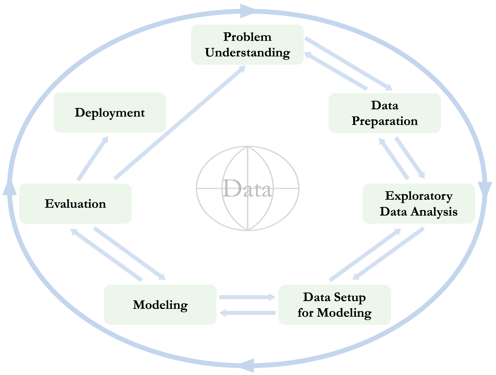
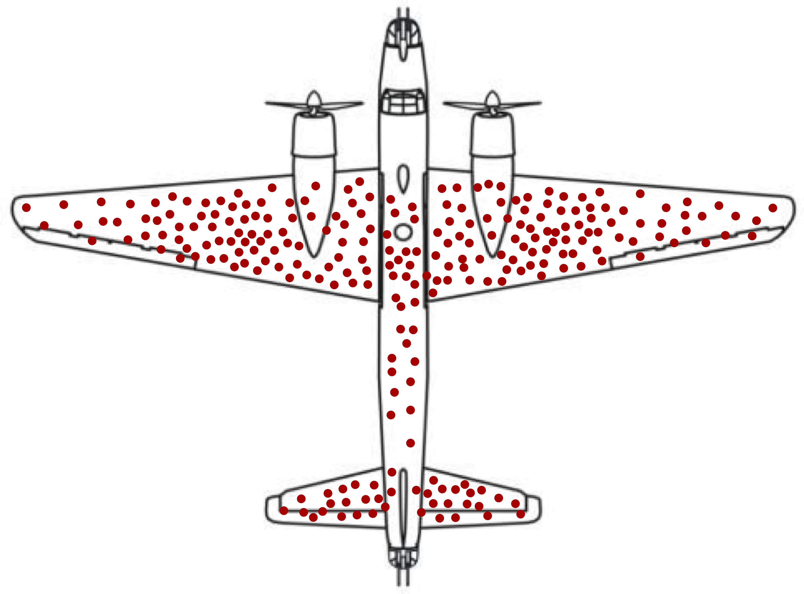
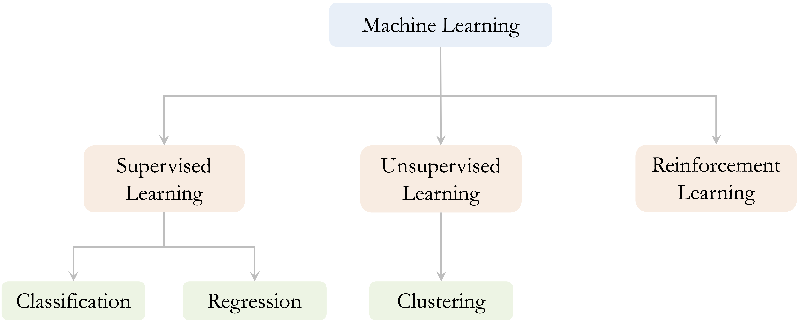
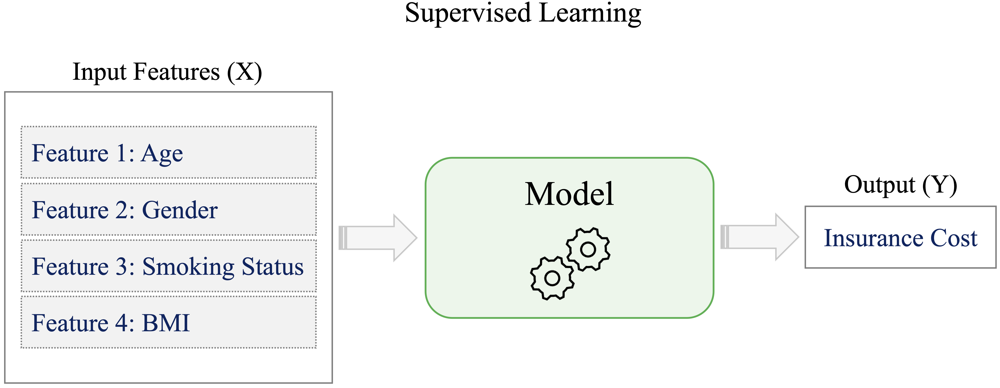

```{r echo=FALSE, message=FALSE, warning=FALSE}
source("_common.R")
```

# The Data Science Workflow and the Role of Machine Learning {#sec-ch2-intro-data-science}

::: {.content-visible when-format="pdf"}
\begin{chapterquote}
If I have seen further it is by standing on the shoulders of giants.

\hfill — Isaac Newton
\end{chapterquote}
:::

::::: {.content-visible when-format="html"}
:::: chapterquote
If I have seen further it is by standing on the shoulders of giants.

::: author
— Isaac Newton
:::
::::
:::::

How can a bank identify customers who are at risk of closing their accounts? How can we predict whether an individual is likely to earn a high annual income, or whether a customer will subscribe to a term deposit? How can we group products, customers, or observations into meaningful segments when no outcome labels are available? Questions such as these illustrate a central aim of data science: to transform data into information that can support explanation, prediction, and decision-making.

Answering such questions requires more than applying algorithms to a dataset. Effective data science depends on a structured process that connects a clearly formulated problem to appropriate data, careful preparation, exploratory analysis, modeling, evaluation, and communication. In this chapter, we introduce the Data Science Workflow as the organizing framework for this process and clarify how machine learning fits within it, primarily as a modeling toolkit used to learn patterns, generate predictions, or discover structure in data.

The focus of this book is on practical data science with R, using structured, tabular data of the kind commonly found in spreadsheets, relational databases, administrative records, and business or scientific datasets. Although data science also includes the analysis of images, audio, video, and text, those forms of unstructured data lie beyond the scope of this volume. By concentrating on tabular data, we can develop the main ideas of the workflow in a setting that is widely used, accessible to beginners, and directly connected to the methods introduced in later chapters.

### What This Chapter Covers {.unnumbered .unlisted}

This chapter introduces the conceptual foundation for the rest of the book. We begin by defining data science as an interdisciplinary field that combines statistical reasoning, computation, and domain knowledge. This definition emphasizes that effective analysis depends not only on technical methods, but also on clear questions, appropriate data, and careful interpretation.

We then present the Data Science Workflow used throughout the book. The workflow begins with problem understanding and continues through data preparation, exploratory data analysis, data setup for modeling, modeling, evaluation, and deployment. Rather than treating these stages as a fixed sequence, we view them as an iterative process in which insights from later stages may lead us to revise earlier decisions.

Finally, we introduce the main branches of machine learning and place them within the broader workflow. Supervised learning, unsupervised learning, and reinforcement learning differ in the kinds of data they use and the goals they address. This book focuses mainly on supervised and unsupervised methods for structured, tabular data. By the end of the chapter, you should be able to describe the main stages of the workflow, explain how machine learning supports modeling within it, and connect this framework to the methods developed in later chapters.

## What Is Data Science?

Data science is an interdisciplinary field concerned with extracting useful information from data and using it to support explanation, prediction, and decision-making. It combines statistical reasoning, computational tools, domain knowledge, and data management to address questions that cannot be answered by data or algorithms alone. In this sense, data science is not a single method, but a process for turning data into evidence that can be interpreted in context.

Statistical reasoning helps us quantify uncertainty, evaluate evidence, and assess whether patterns in data are meaningful or likely to generalize. Computational skills make it possible to implement analyses, work reproducibly, and handle datasets that may be too large or complex for manual inspection. Domain knowledge helps translate vague practical questions into meaningful analytical problems and ensures that results are interpreted in relation to the context in which they will be used.

Data management and data engineering also play an important role in applied data science. Before analysis can begin, data must often be collected from different sources, cleaned, organized, documented, and transformed into a usable structure. Poorly managed data can undermine even sophisticated statistical or machine learning methods, because conclusions are only as reliable as the data and assumptions on which they depend.

Machine learning is one important component of data science, especially when the goal is prediction, classification, or pattern discovery. However, machine learning is most useful when embedded within a broader process that includes problem formulation, data preparation, exploratory analysis, evaluation, interpretation, and communication. This broader process is the focus of the Data Science Workflow introduced in this chapter and used throughout the rest of the book.

## The Data Science Workflow {#sec-ch2-DSW}

Data science projects often begin with practical questions that appear straightforward. Consider a company that wants to identify customers who are likely to close their accounts. Historical records may contain information about account activity, service usage, customer service calls, contract type, and whether each customer eventually left the company. At first glance, this may look like a simple prediction problem: fit a model and identify customers at high risk of churn.

In practice, the problem is more demanding. The organization first needs to clarify what decision the analysis should support. Is the goal to predict churn as accurately as possible, to understand which factors are associated with churn, or to design targeted retention actions? The data must then be checked for missing values, inconsistent coding, unusual observations, and variables that may not be available when predictions are made. Exploratory analysis may reveal patterns in customer behavior, while data setup for modeling determines how predictors are encoded, scaled, and partitioned for evaluation.

The model itself is only one part of this process. A model that appears accurate may still be unsuitable if the evaluation is not designed carefully, if information from the test data influences model fitting, or if the predictions cannot be interpreted in a way that supports action. For example, a churn model may identify many high-risk customers, but the organization still needs to decide which interventions are appropriate, how costly they are, and how model performance should be monitored over time.

This example illustrates why data science requires a disciplined workflow rather than isolated technical steps. Useful analysis depends on connecting the problem, data, model, evaluation strategy, and decision context. In this book, we refer to this process as the Data Science Workflow. The workflow provides a flexible structure for organizing data science projects while leaving room for iteration, revision, and domain-specific judgment.

Several frameworks have been proposed for structuring data-driven projects. One widely used example is CRISP-DM, the Cross-Industry Standard Process for Data Mining [@chapman2000crispdm]. Inspired by this tradition, we use the seven-stage workflow shown in Figure [-@fig-ch2_DSW]. These stages provide the organizing framework for the chapters that follow.

1.  *Problem Understanding*: Define the research, business, or practical question and clarify what a successful analysis should achieve.

2.  *Data Preparation*: Collect, clean, combine, and structure raw data so that they can be used for analysis.

3.  *Exploratory Data Analysis (EDA)*: Examine data quality, distributions, patterns, and relationships using summaries and visualizations.

4.  *Data Setup for Modeling*: Prepare the data for specific modeling algorithms and evaluation designs, for example by engineering features, encoding categorical variables, scaling numerical predictors, and partitioning the data.

5.  *Modeling*: Fit statistical or machine learning models to explain relationships, make predictions, classify observations, or discover structure.

6.  *Evaluation*: Assess model performance using appropriate validation designs and metrics, and determine whether the results address the original objective.

7.  *Deployment*: Use analytical results in practice, for example through decision-support tools, prediction systems, dashboards, monitored models, or reproducible reports that communicate results to stakeholders.

```{r fig-ch2_DSW, echo = FALSE, out.width="85%"}
#| fig-cap: "The Data Science Workflow is an iterative framework for structuring data science and machine learning projects. Inspired by the CRISP-DM model, it emphasizes problem formulation, reproducibility, evaluation, and refinement."


```

Although the stages are presented in a numbered order, the workflow should not be understood as a rigid sequence. Data science projects are usually iterative. Exploratory analysis may reveal that the original question needs refinement, model evaluation may expose weaknesses in feature engineering, and deployment may show that a model must be updated as new data become available. In practice, progress often involves moving back and forth between stages as understanding improves.

The workflow also clarifies the structure of this book. Chapter [-@sec-ch3-data-preparation] focuses on preparing raw data for analysis, Chapter [-@sec-ch4-EDA] examines exploratory data analysis, Chapter [-@sec-ch6-data-setup] considers data setup for modeling and leakage-free evaluation design, and later chapters develop specific modeling and evaluation methods. The aim is not only to learn individual techniques, but also to understand where each technique fits within a broader process for turning data into informed action.

In the remainder of this chapter, we examine each stage of the Data Science Workflow in more detail. This overview prepares the ground for the practical chapters that follow, where the same workflow guides the analysis of structured, tabular datasets in R.

## Problem Understanding {#sec-ch2-Problem-Understanding}

Every data science project begins with a clearly formulated question. Before analysts choose variables, write code, or fit models, they need to understand what problem is being addressed, why it matters, and how the results will be used. This stage sets the direction for the entire workflow: it clarifies objectives, determines what information is needed, and shapes how results will later be interpreted.

A well-known example from World War II illustrates the importance of problem framing: the case of Abraham Wald and the missing bullet holes. During the war, returning aircraft were inspected to determine which areas had sustained the most damage. Bullet holes appeared primarily on the fuselage and wings, while relatively few were observed in the engines. Figure [-@fig-case-WW2-plane] illustrates this pattern, and Table [-@tbl-WW2-bullet-holes] summarizes the recorded distribution of bullet holes.

```{r fig-case-WW2-plane, echo = FALSE, out.width = "45%"}
#| fig-cap: "Schematic illustration of bullet damage observed on aircraft that returned from missions. The observed pattern excludes aircraft that did not return, which is central to the problem-framing lesson."


```

```{r}
#| label: tbl-WW2-bullet-holes
#| echo: false
#| tbl-cap: "Distribution of bullet holes per square foot on returned aircraft."
#| out.width: NULL

bullet_holes = data.frame(
  `Section of plane` = c("Engine", "Fuselage", "Fuel system", "Rest of plane"),
  `Bullet holes per square foot` = c(1.11, 1.73, 1.55, 0.31)
)

kbl(bullet_holes, booktabs = TRUE) %>%
  kable_styling(full_width = FALSE) %>%
  column_spec(1, bold = FALSE, color = "black") %>%
  column_spec(2, width = "15em")
```

Initial recommendations focused on reinforcing the most visibly damaged areas. Wald recognized, however, that the data came only from aircraft that had survived. The engines, where little damage was observed among returning aircraft, were likely the areas where hits caused aircraft to be lost. His insight was therefore to reinforce the areas with few or no observed bullet holes. The example highlights a central principle of data science: the most important information may lie not only in the observed data, but also in what is missing, unobserved, or excluded from the analysis.

In applied projects, problem understanding often begins with vague goals, competing priorities, or incomplete information. Analysts must therefore work with stakeholders to clarify the decision being supported, define what success would mean, and determine how data can contribute meaningfully. A useful starting point is to ask *why* the question matters, *what* outcome or impact is desired, and *how* data science can contribute meaningfully. These questions help ensure that analytical work is aligned with real needs rather than technical curiosity alone.

For example, building a model to predict customer churn becomes valuable only when it is linked to concrete goals, such as designing retention strategies, estimating financial risk, or understanding drivers of customer dissatisfaction. The way a problem is framed influences what data are collected, how variables are defined, which models are appropriate, and how performance is evaluated.

Once the practical objective has been clarified, the next challenge is translating it into a form that can be addressed with data. This translation is rarely straightforward and often requires both domain expertise and analytical judgment. A structured approach can help bridge this gap:

1. *Clearly articulate the project objectives* in terms of the underlying research or business goals.

2. *Break down these objectives* into specific questions and measurable outcomes.

3. *Translate the objectives into a data science problem* that can be addressed using analytical or modeling techniques.

4. *Outline a preliminary strategy* for data collection, analysis, and evaluation.

A well-scoped, data-aligned problem provides the foundation for all subsequent stages of the workflow. It influences what data are collected, how variables are defined, which models are appropriate, and how performance should be evaluated. The next stage focuses on preparing the data so that they can support the analytical goal defined here.

> **Practice:** Consider a situation in which an organization wants to “use data science” to address a problem, such as reducing customer churn, improving student success, or detecting unusual transactions. Before thinking about data or models, ask yourself: What decision is being supported? What would define success? What information would be needed to evaluate that success?


## Data Preparation

After the problem has been clarified, the next stage is to prepare the raw data for analysis. Data preparation focuses on making the dataset accurate, consistent, and analyzable. Raw data may contain missing values, duplicated records, inconsistent category labels, incompatible variable types, or unusual observations that require careful inspection before the data can be used responsibly.

The purpose of data preparation is not simply to make a dataset look tidy. It is to ensure that later summaries, visualizations, and models are based on data that have been checked, cleaned, and documented. For example, missing values may need to be identified and handled, categorical variables may need consistent labels, and observations from different sources may need to be combined into a coherent structure.

It is useful to distinguish data preparation from data setup for modeling, which appears later in the workflow. Data preparation focuses on improving the quality and structure of the raw dataset. Data setup for modeling focuses on transforming the prepared dataset into a form required by specific learning algorithms and evaluation designs, such as encoding predictors, scaling numerical variables, and partitioning the data. In Chapter [-@sec-ch3-data-preparation], we examine data preparation in detail using applied examples.

## Exploratory Data Analysis (EDA)

Before relying on models to make predictions, we first need to understand what the data reveal. Exploratory Data Analysis (EDA) is the stage of the Data Science Workflow in which we examine the structure, quality, and main relationships in a dataset. It helps us move from a cleaned dataset to an informed understanding of what the data contain and what issues may affect later analysis.

EDA serves two complementary purposes. First, it has a diagnostic role, helping to identify issues such as missing values, outliers, inconsistent entries, or unexpected distributions. Second, it has an exploratory role, revealing patterns, trends, associations, and possible differences between groups. For example, EDA may reveal skewed variables, extreme observations, class imbalance, or relationships that suggest useful features.

Common EDA techniques include summary statistics for numerical and categorical variables, graphical methods such as histograms, scatter plots, and box plots, and correlation analysis for examining relationships among numerical variables. These tools support both data quality assessment and analytical decision-making. A highly skewed variable may suggest the need for transformation, while strong correlations may indicate redundancy among predictors.

In R, EDA combines numerical summaries with visual inspection. Chapter [-@sec-ch4-EDA] examines these techniques in detail and shows how exploratory analysis supports later decisions about feature construction, modeling, evaluation, and communication.

## Data Setup for Modeling

While data preparation addresses general data quality, data setup for modeling addresses the specific requirements of learning algorithms and evaluation design. At this stage, the prepared dataset is transformed into a form that can be used appropriately for model fitting, tuning, and performance assessment.

Different algorithms impose different requirements on the data. Many models require categorical variables to be encoded numerically, while methods based on distances or gradients often require numerical predictors to be placed on comparable scales. For example, k-nearest neighbors is sensitive to the scale of the predictors because it relies on distances, and neural networks often benefit from scaled inputs during training. Feature engineering and feature selection may also be used to create more informative predictors or reduce redundancy among variables.

Data setup for modeling also includes designing how the data will be used for training and evaluation. Datasets are commonly divided into training, validation, and test sets so that models can be fitted, tuned, and assessed on separate data. This separation is essential for obtaining a realistic estimate of how well a model is likely to perform on new observations.

A key principle is that preprocessing decisions should be learned from the training data and then applied to validation or test data. If information from the validation or test data is used during preprocessing, model performance may be overestimated. This problem, known as data leakage, is discussed in detail in Chapter [-@sec-ch6-data-setup]. By the end of the data setup stage, the dataset should be structured to support reliable model fitting, tuning, and evaluation.

## Modeling

Modeling is the stage of the Data Science Workflow where statistical and machine learning techniques are applied to prepared data. The goal is not always the same. Some models are primarily used for prediction, some for explanation and interpretation, and others for discovering structure in unlabeled data. For example, classification models may predict whether a customer is likely to churn, regression models may explain how predictors relate to a numerical outcome, and clustering methods may reveal groups of similar observations when no outcome labels are available.

Modeling typically involves several connected activities. An appropriate method must first be selected based on the nature of the task, such as classification, regression, or clustering, as well as the structure of the data and the broader analytical goal. The model is then fitted to the training data so that it can learn relationships, patterns, or groupings. In many applications, model fitting is accompanied by hyperparameter tuning, where model settings are adjusted using validation strategies such as cross-validation.

The choice of model involves trade-offs among predictive performance, interpretability, computational efficiency, and robustness. In this book, we introduce several widely used modeling approaches, including k-nearest neighbors for classification (Chapter [-@sec-ch7-classification-knn]), Naive Bayes classifiers (Chapter [-@sec-ch9-bayes]), regression models for continuous outcomes (Chapter [-@sec-ch10-regression]), generalized linear models for binary and count outcomes (Chapter [-@sec-ch11-generalized-regression]), decision trees and random forests (Chapter [-@sec-ch12-tree-models]), neural networks (Chapter [-@sec-ch13-neural-networks]), and clustering methods for unlabeled data (Chapter [-@sec-ch14-clustering]). In practice, several models are often compared to identify an approach that balances accuracy, interpretability, and practical constraints.

Modeling is closely connected to evaluation. Once a model has been fitted, its performance must be assessed to determine whether it generalizes to new data and whether it addresses the original analytical objective. The next section introduces the role of evaluation in this workflow, including the importance of choosing appropriate validation strategies and performance metrics.

## Evaluation

Once a model has been fitted, its performance must be evaluated. Evaluation asks whether the model generalizes to new data, whether it addresses the original analytical objective, and whether its predictions or conclusions are useful in the decision context. Without careful evaluation, a model that appears successful during training may perform poorly when applied to new observations.

Evaluation has two closely related dimensions. The first is evaluation design: how performance is estimated. Common designs include train-test splits, validation sets, and cross-validation. These strategies help assess how well a model is likely to perform on data that were not used to fit it. When used properly, they also support model comparison and hyperparameter tuning while reducing the risk of overly optimistic conclusions.

The second dimension is evaluation metrics: how performance is summarized. The appropriate metric depends on the modeling task and on the consequences of different types of error. In classification problems, accuracy may be useful, but it can be misleading when classes are imbalanced or when false positives and false negatives have different costs. Metrics such as sensitivity, specificity, precision, recall, the F1-score, ROC curves, and AUC provide more detailed views of classification performance. For regression tasks, metrics such as MSE, MAE, RMSE, and $R^2$ summarize the size of prediction errors and the extent to which the model explains variation in the outcome.

Evaluation also includes diagnostic interpretation. Confusion matrices can show which classes are most often misclassified, while residual plots in regression can reveal patterns suggesting model misspecification, nonlinearity, or unusual observations. These tools help analysts understand not only how well a model performs, but also where it fails.

When evaluation indicates that performance falls short of expectations, earlier stages of the workflow may need to be revisited. Analysts may revise feature engineering, adjust model settings, address class imbalance, collect additional data, or reconsider the original problem formulation. If evaluation shows that the model meets the analytical objective, attention can then shift to how the results will be communicated or used in practice. Detailed evaluation designs, metrics, and diagnostic tools are examined in Chapter [-@sec-ch8-evaluation].

## Deployment

Deployment is the stage of the Data Science Workflow in which analytical results are put into use. In some projects, this may involve integrating a trained model into a system that generates predictions for new observations. In others, it may involve using model outputs to support decisions, guide interventions, or inform planning. The essential point is that deployment connects the analysis to the practical context in which decisions are made.

Deployment does not mark the end of a data science project. Once a model or analytical result is used in practice, its performance and relevance should be monitored over time. New data may differ from the data used during model development, and relationships learned during training may become less reliable as behavior, conditions, or systems change. This problem is often referred to as *concept drift*.

For this reason, deployed models may need to be reviewed, updated, or replaced as new evidence becomes available. A useful deployment strategy therefore considers not only predictive performance, but also interpretability, maintainability, and the ability to monitor results over time. These considerations help ensure that analytical outputs remain useful after they leave the development stage.

Although deployment is an important part of the data science lifecycle, it is not the primary focus of this book. The chapters that follow focus mainly on building, evaluating, and interpreting models within a reproducible workflow. Reproducible reporting supports the communication of analytical results, while deployment represents the broader transition from analysis to use in practice. The next section introduces machine learning as an important modeling toolkit within this workflow.

## Machine Learning within the Data Science Workflow {#sec-ch2-machine-learning}

Machine learning is a subfield of artificial intelligence concerned with algorithms that learn from data and generalize to new cases. Unlike rule-based systems, where decisions are specified explicitly in advance, machine learning methods use observed data to estimate relationships, make predictions, or discover structure. This ability to learn from examples is especially useful when fixed rules are difficult to define or when relationships in the data are complex.

In most applications in this book, a model is trained using observed data and then applied to new or unseen cases. For example, a classification model may be trained on historical customer records to predict whether a new customer is likely to churn. A clustering method may instead be applied to customer data without outcome labels in order to identify groups with similar behavior. In both cases, the aim is not simply to fit a model, but to use the model within a broader analytical process.

Within the Data Science Workflow introduced earlier in Figure [-@fig-ch2_DSW], machine learning is primarily used during the modeling stage. However, its effectiveness depends on earlier and later stages of the workflow. Poorly prepared data, unclear problem definitions, inappropriate evaluation designs, or weak interpretation can undermine even sophisticated models. For this reason, this book treats machine learning as an important modeling toolkit within data science, rather than as a substitute for the full workflow.

Machine learning methods are commonly grouped into three broad categories: supervised learning, unsupervised learning, and reinforcement learning. As shown in Figure [-@fig-machine-learning], these categories differ in the kinds of data they use, the goals they address, and the way learning takes place. In this book, we focus mainly on supervised and unsupervised learning, which are most directly connected to the structured, tabular datasets and modeling tasks developed in later chapters. Reinforcement learning is introduced only briefly for context.

```{r fig-machine-learning, echo = FALSE, out.width = "95%"}
#| fig-cap: "Machine learning tasks can be broadly categorized into supervised learning, unsupervised learning, and reinforcement learning, which differ in how models learn from data and what goals they pursue."


```

### Supervised Learning {.unnumbered .unlisted}

Supervised learning refers to situations in which a model is trained on labeled data, where each observation includes both input variables and a known outcome. Consider a customer churn example using a dataset such as `churn`. Historical records may describe customers through variables such as account usage, age, and service interactions, together with a label indicating whether each customer eventually left the company. The goal is to learn from these examples so that the model can predict whether a new customer is likely to churn.

More generally, supervised learning aims to learn a relationship between input features, often denoted by $X$, and an outcome variable, often denoted by $Y$. Once this relationship has been learned from the training data, the model can be applied to new observations for which the outcome is unknown. This learning process is illustrated in Figure [-@fig-supervised-learning].

```{r fig-supervised-learning, echo = FALSE, out.width = "85%"}
#| fig-cap: "Supervised learning methods use input features $X$ to predict an outcome variable $Y$."


```

Supervised learning problems are commonly divided into classification and regression tasks. In classification, the outcome consists of discrete classes, such as whether an email is spam or not, whether a tumor is benign or malignant, or whether a customer will churn. In regression, the outcome is numerical, such as housing price, insurance cost, or product demand.

In this book, we introduce several supervised learning methods for classification and regression. These include k-nearest neighbors for classification (Chapter [-@sec-ch7-classification-knn]), Naive Bayes classifiers (Chapter [-@sec-ch9-bayes]), regression models for continuous outcomes (Chapter [-@sec-ch10-regression]), generalized linear models for binary and count outcomes (Chapter [-@sec-ch11-generalized-regression]), decision trees and random forests (Chapter [-@sec-ch12-tree-models]), and neural networks (Chapter [-@sec-ch13-neural-networks]). These chapters show how supervised models are fitted, evaluated, and interpreted within the Data Science Workflow.

### Unsupervised Learning {.unnumbered .unlisted}

How can meaningful structure be identified in data when no outcomes are specified? This question lies at the heart of unsupervised learning, which focuses on analyzing datasets without predefined labels in order to uncover patterns, natural groupings, or internal structure. Unlike supervised learning, which is guided by known outcomes, unsupervised learning is primarily exploratory: it aims to reveal how data are organized when there is no specific prediction target.

Among unsupervised methods, clustering is one of the most widely used techniques. Clustering groups similar observations based on shared characteristics, providing insight when labels are unavailable. For example, an online retailer may use clustering to segment customers based on purchasing behavior and browsing patterns. The resulting groups can reflect distinct customer profiles, such as frequent purchasers, occasional buyers, or high-value customers, helping the organization better understand variation within its customer base.

Other unsupervised methods include dimensionality reduction and anomaly detection, but this book focuses mainly on clustering as a practical introduction to learning from unlabeled tabular data. By revealing structure that may not be apparent from summary statistics alone, clustering supports data-driven exploration and interpretation. We return to clustering in Chapter [-@sec-ch14-clustering], where these ideas are examined in detail using real-world datasets for segmentation and pattern discovery.

### Reinforcement Learning {.unnumbered .unlisted}

Reinforcement learning is a branch of machine learning in which an agent learns to make decisions through interaction with an environment. At each step, the agent observes the current state, chooses an action, and receives feedback in the form of rewards or penalties. The goal is to learn a policy: a strategy for selecting actions that maximizes expected cumulative reward over time. This framework is useful when decisions are sequential and the consequences of actions may appear only after several steps.

Although reinforcement learning is an important area of machine learning, it lies outside the scope of this book. Our focus is on supervised and unsupervised methods for structured, tabular data, where the main tasks involve prediction, classification, regression, and clustering. Readers interested in reinforcement learning are referred to *Reinforcement Learning: An Introduction* by Sutton and Barto [@sutton1998reinforcement] for a comprehensive treatment.

## Chapter Summary and Takeaways

This chapter introduced data science as a workflow-driven discipline for turning data into evidence that can support explanation, prediction, and decision-making. Rather than treating data science as a collection of isolated techniques, we emphasized the importance of connecting problem formulation, data quality, exploratory analysis, modeling, evaluation, and practical use.

The Data Science Workflow provides the organizing framework for this process. It begins with problem understanding and continues through data preparation, exploratory data analysis, data setup for modeling, modeling, evaluation, and deployment. Although these stages are presented in sequence, effective data science is iterative: insights from later stages may require analysts to revisit earlier decisions, refine the problem, improve the data, adjust the model, or reconsider the evaluation strategy.

Machine learning was introduced as an important modeling toolkit within this broader workflow. Supervised learning supports prediction from labeled data, unsupervised learning helps reveal structure in unlabeled data, and reinforcement learning concerns sequential decision-making through feedback. In this book, the main focus is on supervised and unsupervised methods for structured, tabular data, always with attention to problem framing, data preparation, evaluation, interpretation, and reproducible analysis.

In the next chapter, the focus shifts to data preparation, which forms the foundation for reliable exploration and modeling. We examine how to clean, structure, and transform raw data into a form suitable for later stages of the Data Science Workflow.

## Exercises {#sec-ch2-exercises}

The exercises below reinforce the main ideas of this chapter. They progress from conceptual understanding to workflow reasoning, machine learning task identification, applied scenarios, and ethical reflection.

### Conceptual Questions {.unnumbered .unlisted}

1. Define *data science* in your own words. What makes it an interdisciplinary field?

2. Explain why data science requires more than applying algorithms to a dataset.

3. How does machine learning differ from traditional rule-based programming?

4. How is machine learning related to artificial intelligence? In what ways are the two concepts different?

5. Why is domain knowledge important in a data science project? Illustrate your answer with an example.

6. Explain why machine learning should be viewed as a modeling toolkit within the broader Data Science Workflow, rather than as a substitute for the workflow.

### Understanding the Data Science Workflow {.unnumbered .unlisted}

7. List the main stages of the Data Science Workflow introduced in this chapter. Briefly describe the role of each stage.

8. Why is the Problem Understanding stage important? Give an example of how a poorly framed problem can lead to misleading or unhelpful results.

9. Explain the difference between data preparation and data setup for modeling. Give one example of a task that belongs mainly to each stage.

10. Provide an example of how exploratory data analysis can influence feature engineering, model choice, or evaluation.

11. Explain the difference between evaluation design and evaluation metrics. Why are both needed when assessing model performance?

12. Why is the Data Science Workflow described as iterative rather than strictly linear?

### Machine Learning Task Types {.unnumbered .unlisted}

13. For each task below, classify it as supervised learning, unsupervised learning, or reinforcement learning. Briefly justify your answer.

    a. Predicting housing prices based on square footage, location, and number of rooms.  
    b. Grouping customers based on purchasing behavior when no customer segments are known in advance.  
    c. Classifying tumors as benign or malignant using historical diagnostic data.  
    d. Training an agent to choose actions in a game based on rewards and penalties.  
    e. Identifying unusual transactions that differ strongly from typical customer behavior.

14. For each supervised learning task below, state whether it is a classification or regression problem.

    a. Predicting whether a loan application will be approved.  
    b. Predicting the selling price of a house.  
    c. Predicting whether a customer will subscribe to a term deposit.  
    d. Predicting the number of doctor visits made by a patient in one year.

15. Give one example of a problem where classification is more appropriate than regression, and one example where regression is more appropriate than classification. Explain your reasoning.

16. What trade-offs may arise between interpretability and predictive performance when choosing a machine learning model?

### Applied Scenarios {.unnumbered .unlisted}

17. An online retailer wants to predict whether a visitor will make a purchase during a website session. Describe how this problem would move through the Data Science Workflow from problem understanding to evaluation.

18. A team cleans the full dataset, scales all numerical variables, selects predictors using the full dataset, and only then splits the data into training and test sets. Explain why this workflow may lead to overly optimistic evaluation results.

19. A university wants to identify students who may be at risk of dropping out. Describe the main decision that the analysis should support, the type of data that may be needed, and one ethical concern that should be considered.

20. A company builds a churn prediction model with high accuracy, but managers do not understand how to use the predictions. Which stages of the Data Science Workflow may need to be revisited? Explain your answer.

### Ethics and Reflection {.unnumbered .unlisted}

21. List three practices that data scientists can use to reduce algorithmic bias and promote fairness in predictive models.

22. To what extent can the Data Science Workflow be automated? What risks may arise if too much of the workflow is automated without human judgment?

23. How do transparency, explainability, and accountability influence trust in data science and machine learning systems?

24. Reflect on your own learning: which part of the Data Science Workflow do you expect to find most challenging, and why?

