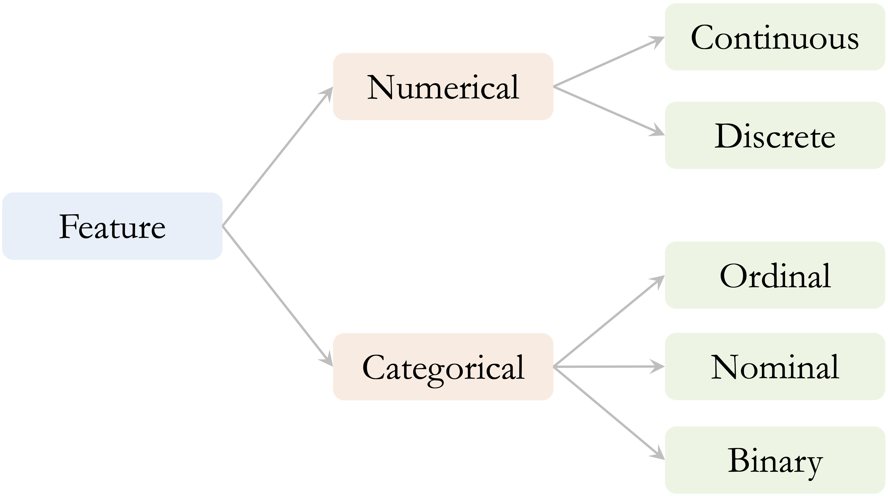
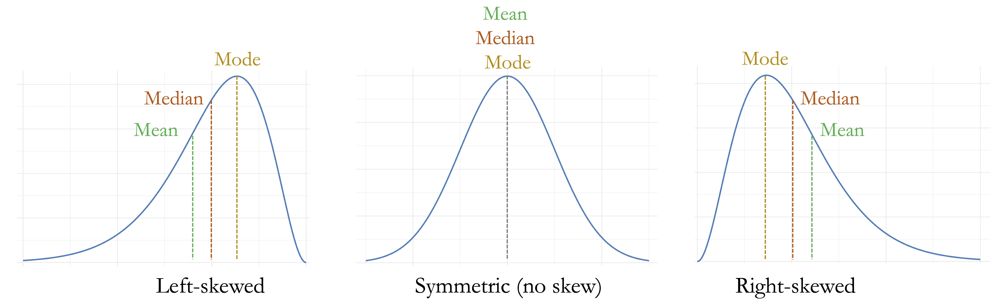
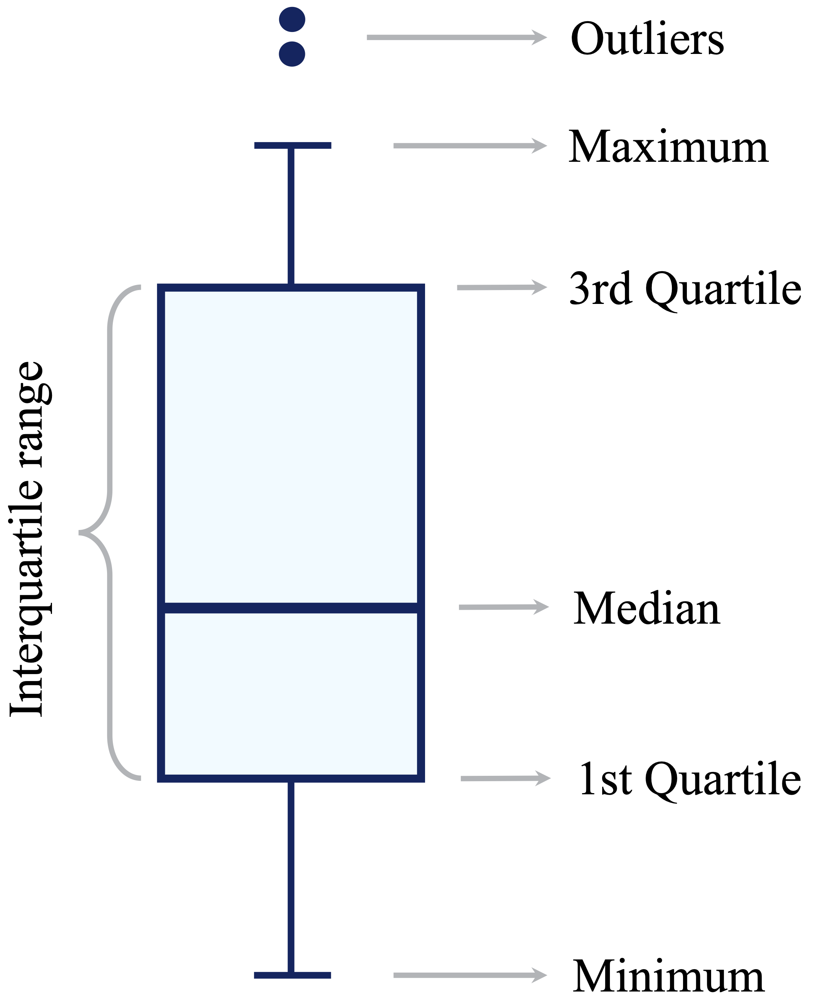
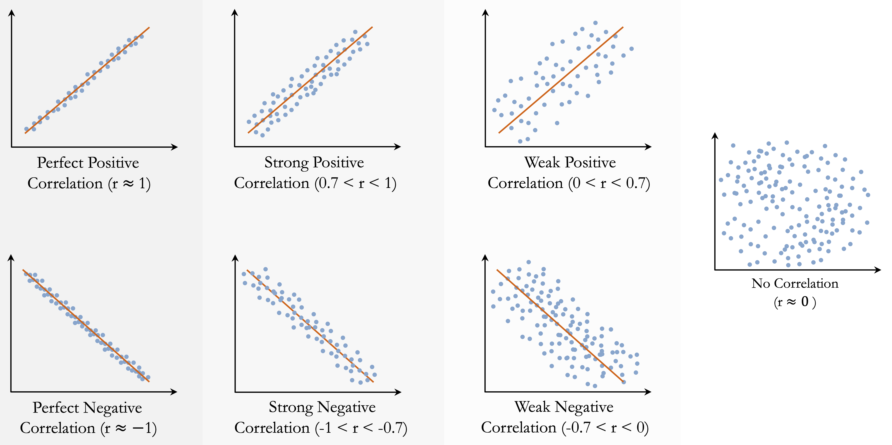

```{r echo=FALSE, message=FALSE, warning=FALSE}
source("_common.R")
```

# Data Understanding and Exploration {#sec-chapter-data-understanding}

::: {.content-visible when-format="pdf"}
\begin{chapterquote}
You see, but you do not observe. The distinction is clear.

\hfill — Arthur Conan Doyle
\end{chapterquote}
:::

::::: {.content-visible when-format="html"}
:::: chapterquote
You see, but you do not observe. The distinction is clear.

::: author
— Arthur Conan Doyle
:::
::::
:::::

Having data does not mean that we understand it. Before drawing conclusions or building predictive models, we need to know what the observations represent, how the features are defined, whether the recorded values are plausible, and what patterns or relationships are present. A dataset may also contain missing information, unusual observations, or redundant measurements that are not immediately apparent from the raw values. Examining these characteristics is the focus of the *Data Understanding and Exploration* stage of the Data Science Workflow.

This stage follows Data Acquisition in the workflow introduced in Figure [-@fig-ds_DSW] and provides the empirical foundation for Data Preparation for Modeling (Chapter [-@sec-chapter-data-preparation]). It combines knowledge of how the data were defined and collected with numerical summaries and visualizations to examine data quality, distributions, relationships, and potential limitations.

Exploratory data analysis (EDA) is a central component of this stage. It is primarily investigative rather than confirmatory: we use it to formulate questions, recognize patterns, evaluate whether initial assumptions are reasonable, and identify issues that may affect later analysis. Exploratory findings may suggest useful directions for data preparation, statistical inference, or predictive modeling, but they should be interpreted cautiously. They do not by themselves establish causal relationships or support conclusions about a broader population. Later, Chapter [-@sec-chapter-statistics] introduces formal tools for quantifying uncertainty and drawing conclusions beyond the observed data.

Data understanding and exploration are iterative rather than strictly linear. Unexpected values or patterns may require us to revisit the data source, clarify a feature definition, reconsider the problem of interest, or examine particular observations or subgroups more closely. An important distinction must therefore be maintained between identifying a data issue and deciding how to address it. In this chapter, we focus on understanding feature types and roles, investigating missing or unspecified information, identifying unusual or implausible observations, and examining relationships among features. The issues and patterns identified during exploration often motivate decisions about imputation, transformation, encoding, feature selection, and other procedures used to create a model-ready dataset. These decisions are addressed in the next stage of the workflow, Data Preparation for Modeling, in Chapter [-@sec-chapter-data-preparation].

### What This Chapter Covers {.unnumbered .unlisted}

This chapter introduces the main principles of data understanding and exploratory data analysis. We begin by considering the objectives and guiding questions that direct a systematic examination of an unfamiliar dataset. We then discuss feature types and their representation in R, emphasizing that a feature’s conceptual meaning, analytical role, and technical representation may differ. We also examine how unusual observations and implausible values can be identified and investigated, and how exploratory findings can be communicated clearly through data storytelling without overstating their implications. Readers who need a review of R fundamentals, including data frames, indexing, data manipulation, and basic visualization, can consult Appendix [-@sec-chapter-r-foundations].

These principles are applied in a guided case study using the `churn` dataset from the **liver** package. The case study begins with problem definition, data acquisition, and initial inspection. We then identify the types and analytical roles of the features, assess data quality, and explore categorical, numerical, and multivariate patterns related to customer attrition. Throughout the analysis, numerical summaries, visualizations, and contextual reasoning are used together to identify meaningful patterns, data limitations, and potential redundancy among features before statistical inference or predictive modeling begins.

By the end of the chapter, readers should be able to formulate appropriate questions for data understanding and exploration, identify feature types and analytical roles, and distinguish a feature’s conceptual meaning from its representation in R. They should also be able to assess data quality, investigate unusual or implausible observations, select suitable numerical and graphical summaries, compare feature behavior across groups, examine relationships and potential redundancy among features, and communicate exploratory findings without presenting descriptive associations as inferential or causal conclusions. Finally, readers should be able to use insights obtained during exploration to motivate later decisions during Data Preparation for Modeling.

## Guiding Questions for Data Understanding and Exploration {#sec-eda-EDA-objectives}

A useful starting point in the *Data Understanding and Exploration* stage is to clarify what we want to learn from the data. Exploratory data analysis (EDA) is a central component of this process, which usually moves through three levels: understanding the dataset as a whole, examining individual features, and investigating relationships among features.

At the dataset level, we ask what each observation represents, how and when the data were collected, and which population or process they describe. We also identify the unit of analysis and determine whether the dataset contains a target feature, predictors, identifiers, derived measurements, or other variables with special analytical roles. These questions help us assess whether the available data are suitable for addressing the problem of interest.

At the feature level, we examine what each feature means, how it is represented in R, and which values it can reasonably take. We investigate its range and distribution, identify missing or unspecified information, and look for unusual observations. Relevant questions include whether a numerical feature is symmetric or skewed, whether a categorical feature contains rare or placeholder levels, and whether extreme values represent errors, valid rare cases, or meaningful subgroups.

We then examine relationships among features. We may ask whether a numerical feature differs across groups, whether two numerical features are associated, or whether two categorical features occur together systematically. We also investigate whether some features contain overlapping information, are mathematically derived from one another, or reveal patterns only when considered jointly. When a target feature is available, these questions may include how other features vary across target groups.

The interpretation of exploratory findings should be informed by the context in which the data were collected. A large numerical value may be unusual but valid in one application and implausible in another. Similarly, a value such as `"unknown"` may be stored as an ordinary categorical level in R while actually representing missing or unspecified information. The exploratory tools we select should therefore follow from both the question and the feature types involved. Numerical features may be examined using summary statistics and distributional plots, categorical features using frequencies and bar plots, and relationships among features using grouped summaries, scatter plots, contingency tables, or measures of association. These tools must be interpreted together with feature definitions, measurement units, the data-collection process, and relevant domain knowledge. Selecting suitable exploratory methods therefore begins with understanding the types, meanings, and analytical roles of the features in the dataset.

## Feature Types and Data Representation {#sec-eda-feature-types}

Before summarizing, visualizing, or interpreting a dataset, we need to understand what each feature represents. Feature type determines which numerical summaries are meaningful, which graphical tools are appropriate, and how observed patterns should be interpreted. For example, a numerical feature may be summarized using measures such as the mean, median, or standard deviation, whereas a categorical feature is usually described using frequencies or proportions. Treating these feature types interchangeably can lead to misleading summaries, inappropriate visualizations, and poor analytical decisions.

Feature type also informs later decisions during Data Preparation for Modeling. Numerical features may require transformations or scaling, while categorical features may need to be encoded or have sparse levels combined. However, such decisions should be made only after the meaning, representation, and observed behavior of each feature have been examined carefully.

It is also important to consider a feature’s analytical role. A feature may serve as a predictor, a target, an identifier, or a quantity derived from other features. These roles affect how the feature should be explored and whether it should be included in later analyses. For example, a customer identifier may be stored as a number, but it represents a label rather than a measurable quantity and should not be treated as an ordinary numerical predictor.

### Numerical and Categorical Features {.unnumbered .unlisted}

At a high level, most features used in data science can be grouped into two broad types: numerical and categorical. Each type can be divided into several common subtypes, as summarized in Figure [-@fig-eda-feature-type].

```{r fig-eda-feature-type, echo = FALSE, out.width = "65%"}
#| fig-cap: "Overview of common feature types used in data analysis, including numerical (continuous and discrete) and categorical (nominal, ordinal, and binary) features."


```

Numerical features represent measurable or countable quantities. Continuous numerical features can take many possible values within a range, such as income, temperature, transaction amount, or credit limit. Discrete numerical features take countable values, often integers, such as the number of purchases, customer-service contacts, website visits, or product defects. The distinction is not always absolute because it may depend on how a quantity is recorded. For example, age may be recorded in whole years but still represents an underlying quantitative characteristic.

Categorical features describe membership in groups rather than numerical magnitude. Nominal features represent categories without an inherent order, such as region, product type, or marital status. Ordinal features have a meaningful order, although the differences between adjacent levels should not be interpreted as equal numerical distances. Examples include education level, satisfaction rating, and product tier. Binary features are categorical features with exactly two levels, such as yes/no, success/failure, or churn/no churn.

The distinction between numerical and categorical features guides the choice of exploratory tools. Histograms, density plots, boxplots, and numerical summaries are commonly used to examine numerical features. Frequency tables and bar plots are generally more appropriate for categorical features. Discrete numerical features with only a small number of possible values may also be examined using bar plots because their distributions are more naturally represented as counts.

The conceptual type and analytical role of a feature should not be inferred solely from how it is stored in R. Numerical features are commonly represented as `numeric` or `integer` vectors, while categorical features may be stored as `factor` or `character` vectors. However, a categorical feature may be encoded numerically, an ordinal feature may be stored as an unordered factor, and an identifier may be stored as an integer. Placeholder values such as `"unknown"` or `999` may also represent missing or unspecified information without being recognized as missing by R. We should therefore interpret each feature using its substantive meaning, conceptual type, analytical role, and technical representation together.

In the `churn` case study later in this chapter, we apply these distinctions when examining numerical and categorical features, the customer identifier, placeholder categories, and features derived from other measurements.

### Distribution Shape and Measures of Center {.unnumbered .unlisted}

For numerical features, understanding the shape of the distribution is an important part of exploratory analysis. A distribution may be approximately symmetric, or it may be skewed when observations extend farther in one direction than the other. Right-skewed distributions have a longer tail toward larger values, whereas left-skewed distributions have a longer tail toward smaller values.

Distribution shape also affects how measures of center should be interpreted. The mean is sensitive to observations in the tails of a distribution, whereas the median is less affected by extreme values. In an approximately symmetric distribution, the mean and median are typically close. In a skewed distribution, the mean is generally pulled toward the longer tail, while the median remains closer to the center of the ordered observations. The mode identifies the most common or most densely concentrated value and, in a unimodal distribution, is located near the peak. These relationships are illustrated in Figure [-@fig-eda-skew-type].

```{r}
#| label: fig-eda-skew-type
#| echo: false
#| out-width: 100%
#| fig-cap: "Illustrative symmetric and skewed distributions showing the relative positions of the mean, median, and mode. In a symmetric unimodal distribution, the three measures of center coincide. In a skewed distribution, the mean is pulled toward the longer tail, while the median is less affected."


```

Recognizing distribution shape helps determine which numerical summaries and visualizations are most informative. It also provides context for interpreting unusual observations, since values that appear extreme relative to the center of a skewed distribution are not necessarily erroneous. We return to these ideas when examining outliers and implausible values in the next section and when exploring numerical features in the `churn` case study in Section [-@sec-EDA-sec-numeric].

## Identifying Outliers and Implausible Values {#sec-eda-outliers}

Unusual observations are an important part of data understanding because they may reveal data-quality problems, rare cases, or meaningful variation in the population. They may arise from data-entry errors, unusual measurement conditions, differences in the data-collection process, or genuinely rare but informative events. Regardless of their origin, unusual observations can strongly influence numerical summaries, visualizations, statistical analyses, and predictive models.

The central challenge is not merely to identify extreme values, but to determine what they represent. A useful distinction can be made among *outliers*, *data errors*, and *rare observations*. An outlier is a value or observation that appears unusual relative to the overall pattern of the data. A data error is a value that is incompatible with the meaning of the feature, the measurement process, or known logical constraints. A rare observation is unusual but valid and may contain important information.

For example, a diamond width of zero millimeters is physically impossible and indicates a problem with the recorded measurement. By contrast, an unusually expensive diamond may be rare but entirely valid. Similarly, an exceptionally large transaction amount in a customer dataset may represent genuine customer behavior rather than a recording error. Treating all extreme values as errors may remove meaningful information, while retaining clearly implausible values may distort the analysis.

Outlier identification should therefore be treated as a diagnostic process rather than as an automatic rule for changing the data. Numerical summaries and visualizations can identify observations that deserve closer inspection, but their interpretation should be guided by feature definitions, measurement units, relationships with other features, the data-collection process, and relevant domain knowledge.

### Detecting Unusual Values with Visual Tools {.unnumbered .unlisted}

Visualizations provide a natural starting point for identifying unusual or implausible values. Different plots reveal different aspects of a distribution. Boxplots summarize the central range of a numerical feature and flag values far from that range. Histograms show how frequently values occur across the full distribution and may reveal skewness, gaps, spikes, or isolated observations. Scatter plots are useful for examining whether a value that is unusual in one feature is also inconsistent with related features.

A standard boxplot uses the interquartile range (IQR) to identify potential outliers, as illustrated in Figure [-@fig-eda-simple-boxplot]. Let $Q_1$ and $Q_3$ denote the first and third quartiles. The interquartile range measures the spread of the middle 50% of the observations and is defined as $$
\mathrm{IQR} = Q_3 - Q_1.
$$ The lower and upper outlier thresholds, often called the *fences*, are $$
Q_1 - 1.5 \times \mathrm{IQR}
$$ and $$
Q_3 + 1.5 \times \mathrm{IQR},
$$ respectively. The whiskers typically extend to the smallest and largest observed values that fall within these fences. Observations beyond the fences are displayed as individual points and are treated as potential outliers.

This rule provides a useful screening tool, but it does not establish that a flagged observation is erroneous. In strongly skewed or heavy-tailed distributions, a boxplot may identify many valid observations simply because they lie far from the central half of the data. Any flagged values should therefore be investigated using contextual information and related features before conclusions are drawn.

```{r fig-eda-simple-boxplot, echo = FALSE, out.width = "35%"}
#| fig-cap: "A boxplot summarizes the central distribution of a numerical feature. The whiskers extend to the most extreme observations within 1.5 times the interquartile range from the quartiles, while observations beyond these limits are displayed individually as potential outliers."


```

To illustrate visual identification of unusual values, we use the `diamonds` dataset from the **ggplot2** package. Each observation represents a diamond, and the features `x`, `y`, and `z` record its physical dimensions in millimeters. We focus on `y`, which represents diamond width.

```{r}
library(ggplot2)

data(diamonds)
```

We first compare a boxplot shown on the full scale with a zoomed view of the central part of the distribution:

```{r}
#| layout-ncol: 2
#| fig-width: 4
#| fig-height: 4

ggplot(data = diamonds) +
  geom_boxplot(aes(y = y)) +
  labs(title = "Full scale", y = "Diamond Width (mm)")

ggplot(data = diamonds) +
  geom_boxplot(aes(y = y)) +
  coord_cartesian(ylim = c(0, 15)) +
  labs(title = "Zoomed view", y = "Diamond Width (mm)")
```

The full-scale boxplot shows that a small number of extreme values stretch the vertical axis and compress the main body of the distribution. The zoomed view makes the central distribution easier to examine and shows that most diamond widths lie within a much narrower range. The `coord_cartesian()` function changes only the displayed range; it does not remove observations or alter the values used to construct the boxplot.

Histograms provide a complementary view because they show how observations are distributed across the range of the feature. We again compare the full distribution with a version in which the vertical axis is restricted to reveal bins containing relatively few observations:

```{r}
#| layout-ncol: 2
#| fig-width: 4
#| fig-height: 4

ggplot(data = diamonds) +
  geom_histogram(aes(x = y), binwidth = 0.5) +
  labs(title = "Full scale", x = "Diamond Width (mm)", y = "Count")

ggplot(data = diamonds) +
  geom_histogram(aes(x = y), binwidth = 0.5) +
  coord_cartesian(ylim = c(0, 20)) +
  labs(title = "Zoomed count scale", x = "Diamond Width (mm)", y = "Count")
```

The full-scale histogram shows that most widths are concentrated between approximately 2 and 6 millimeters. The zoomed count scale reveals several isolated values, including seven observations with a width of zero and two unusually large values, one slightly above 30 millimeters and another close to 60 millimeters.

A width of zero is physically impossible for a recorded diamond and therefore differs conceptually from an ordinary statistical outlier. The very large values also deserve closer investigation, but their position in the distribution alone is not sufficient to determine whether they are erroneous.

### Investigating Unusual Observations in Context {.unnumbered .unlisted}

An unusual value should rarely be interpreted by examining one feature in isolation. Related measurements, logical constraints, and information about the observation as a whole may help determine whether the value is plausible.

We inspect the observations for which `y` is either zero or greater than 30 millimeters:

```{r}
diamonds[diamonds$y == 0 | diamonds$y > 30,
  c("carat", "cut", "color", "clarity", "x", "y", "z", "price")]
```

The observations with `y = 0` also have zero values for the other physical dimensions. This pattern strongly suggests that the dimensions were not recorded correctly, rather than that the diamonds genuinely had zero length, width, and depth. The unusually large values of `y` are also inconsistent with the corresponding values of `x` and `z`, making recording or measurement errors more plausible than genuinely exceptional diamond sizes.

This example illustrates the value of cross-feature inspection. A value may appear merely extreme when examined on its own but become clearly implausible when compared with related measurements. Conversely, an extreme observation may appear internally consistent and therefore represent a valid rare case.

When investigating an unusual observation, several forms of evidence should be considered together. Logical constraints can indicate whether a value is physically or conceptually possible, while comparisons with related features can reveal inconsistencies within the same observation. The units and definitions of the measurements are also important, as is information from the original data source or documentation. Domain knowledge about the population or process being studied can provide further context, and the presence of similar values in other observations may help determine whether the case is isolated or part of a broader pattern.

No observation should be removed or changed solely because it lies beyond a boxplot threshold or appears in the tail of a histogram. During data understanding and exploration, the objective is to identify, investigate, and document unusual or implausible values. Decisions about correcting values, recoding them as missing, transforming features, using robust methods, or excluding observations are made later during Data Preparation for Modeling.

> *Practice:* Apply the same checks to `x` and `z`. Use boxplots and histograms to identify unusual values, then compare all three diamond dimensions. Which observations seem unusual but plausible, and which appear physically implausible?

## Communicating Exploratory Findings with Data Storytelling {#sec-eda-storytelling}

Exploratory findings become useful when they are communicated in relation to a clear question rather than presented as an isolated collection of outputs. A histogram, scatter plot, boxplot, or correlation matrix should help the reader recognize something that is difficult to see from raw data alone, such as variation, overlap, unusual observations, group differences, relationships among features, or change over time.

In this context, data storytelling does not mean imposing a predetermined narrative on the data or selecting only the patterns that support a preferred conclusion. Instead, it means organizing graphical and numerical evidence so that the main findings, their context, and their limitations can be understood clearly. Effective exploratory communication distinguishes among what is directly visible in the data, how the observed pattern may be interpreted, and which questions remain unresolved.

A well-known example of effective exploratory communication is Hans Rosling’s TED Talk *New insights on poverty* [@rosling2007poverty], in which demographic and economic data are used to communicate patterns of global development over time. Figure [-@fig-EDA-fig-1] presents a related exploratory visualization based on the `gapminder` dataset from the **liver** package. It compares GDP per capita and life expectancy across countries in 1950 and 2019. Countries are grouped by world region, and point size is proportional to population.

```{r}
#| label: fig-EDA-fig-1
#| echo: false
#| out-width: 100%
#| fig-cap: "GDP per capita and life expectancy across countries in 1950 (left) and 2019 (right). Countries are grouped by world region, and point size is proportional to population."

data(gapminder, package = "liver")

ggplot_1 = gapminder |>
  dplyr::filter(
    year %in% c(1950, 2019),
    !is.na(world_group),
    world_group != "Others",
    !is.na(gdp),
    !is.na(life_expectancy),
    !is.na(population)
  ) |>
  ggplot(
    aes(
      x = gdp,
      y = life_expectancy,
      col = world_group,
      size = population / 10^6
    )
  ) +
  geom_point(alpha = 0.5) +
  guides(size = "none") +
  coord_cartesian(ylim = c(20, 90)) +
  labs(
    x = "GDP per Capita (USD)",
    y = "Life Expectancy"
  )

if (knitr::is_latex_output()) {
  ggplot_1 +
    facet_grid(. ~ year) +
    theme(
      legend.position = "top",
      legend.title = element_text(size = 9),
      legend.text = element_text(size = 8),
      legend.key.size = grid::unit(0.4, "cm"),
      legend.spacing.x = grid::unit(0.2, "cm"),
      axis.text.x = element_text(size = 8, angle = 45),
      axis.text.y = element_text(size = 10),
      axis.title = element_text(size = 10, face = "bold"),
      title = element_text(size = 10, face = "bold")
    ) +
    scale_color_brewer(
      palette = "Set2",
      name = "World Region: "
    )
} else {
  ggplot_html = ggplot_1 +
    ggtitle("{frame_time}") +
    gganimate::transition_time(year) +
    gganimate::ease_aes("linear") +
    theme(
      title = element_text(size = 14, face = "bold"),
      legend.title = element_blank(),
      plot.margin = grid::unit(c(-0.19, 0, 0.03, 0.1), "null"),
      plot.title = element_text(
        hjust = 0.86,
        vjust = -23.5,
        color = "#7286c3",
        size = 48,
        face = "bold.italic"
      )
    ) +
    scale_color_brewer(palette = "Set2")

  gganimate::animate(
    ggplot_html,
    fps = 7,
    end_pause = 25
  )
}
```

Figure [-@fig-EDA-fig-1] illustrates how a visualization can communicate several dimensions of a dataset without requiring a complex statistical model. Between 1950 and 2019, both GDP per capita and life expectancy generally increased, although their levels and rates of change differed substantially across countries and regions. The figure also shows that countries with higher GDP per capita tend to have higher life expectancy. This association is descriptive and should not be interpreted as evidence that changes in one variable directly cause changes in the other.

The figure also demonstrates several principles of exploratory communication. Position is used to show the relationship between two numerical features, color distinguishes world regions, point size represents population, and separate panels make change over time visible. At the same time, the visualization does not explain the mechanisms underlying the observed differences, quantify uncertainty, or account for other social, economic, and health-related factors. These limitations should be acknowledged alongside the visible patterns.

In the following `churn` case study, we apply the same principles to a practical data science problem. Numerical summaries and exploratory graphics are used not merely to display the data, but to make customer patterns visible, communicate relevant limitations, and identify questions that may guide later statistical inference and predictive modeling.

## Data Understanding and Exploration with the `churn` Dataset {#sec-eda-EDA-churn}

Data understanding and exploratory data analysis are most useful when they are grounded in a real dataset and guided by a practical problem. In this section, we use the `churn` dataset from the **liver** package to examine customer attrition in a credit card portfolio. The dataset contains demographic, account-related, behavioral, and financial information about customers, together with a binary target indicating whether a customer closed their account.

Our aim at this stage is not to build a predictive model or make causal claims about why customers leave. Instead, we seek to understand the structure and quality of the dataset, examine how customer characteristics and behavior vary across churn outcomes, and identify patterns or data issues that may deserve closer attention during later statistical analysis and predictive modeling.

The case study follows the logic of the Data Science Workflow introduced in Chapter [-@sec-chapter-intro-data-science]. We begin by clarifying the practical problem, acquiring and inspecting the data, and identifying the types and analytical roles of the features. We then assess data quality and explore categorical and numerical features and relationships among them. Throughout the analysis, we combine numerical summaries, visualizations, and contextual reasoning to distinguish what is directly observed in the data from interpretations that would require formal inference or additional evidence.

### Problem Definition {.unnumbered .unlisted}

Customer churn refers to the loss of customers over time. In this case study, a customer is classified as having churned when they close their credit card account. For a bank, customer attrition is an important practical problem because retaining existing customers may be less costly than acquiring new ones. Identifying customers who show signs of disengagement may also help the bank investigate service problems and design more targeted retention strategies.

The practical objective is therefore to understand which customer characteristics and behavioral patterns are associated with account closure. We examine whether churn differs across demographic groups, account and service-related features, credit usage, transaction activity, and changes in customer behavior over time. These patterns may help identify features that deserve closer attention in later statistical analysis or predictive modeling.

The available data are observational, so the analysis cannot establish why a customer closes an account or whether changing a particular feature would prevent churn. For example, frequent contact with customer service may be associated with churn, but this does not imply that contacting customer service causes customers to leave. Both may instead reflect an unresolved problem or declining customer satisfaction. Exploratory findings should therefore be interpreted as associations that generate questions rather than as causal explanations.

At this stage, the goal is to develop a structured understanding of the dataset, assess whether it is suitable for studying customer attrition, and identify patterns and limitations that may guide later analysis. We begin by acquiring the `churn` dataset and inspecting its structure, dimensions, unit of analysis, and target feature.

### Data Acquisition and Initial Inspection {.unnumbered .unlisted}

Although the focus of this case study is the *Data Understanding and Exploration* stage, we briefly revisit Data Acquisition to establish the source and context of the data before beginning detailed exploration. The `churn` dataset, available in the **liver** package, contains demographic, account-related, behavioral, and financial information about credit card customers. The target feature is `churn`, which indicates whether a customer closed their credit card account (`"yes"`) or remained active (`"no"`). At this stage, we use the target to guide exploration rather than to build a predictive model.

We begin by loading the package and dataset and inspecting its structure:

```{r}
library(liver)

data(churn)
str(churn)
```

The dataset is stored as a `data.frame` with `r nrow(churn)` observations and `r ncol(churn)` features. Each row represents one credit card customer, while each column records a customer characteristic, account attribute, or measure of customer activity.

The features describe several aspects of the customer relationship. Demographic features include `age`, `gender`, `education`, `marital`, `income`, and `dependent_count`. Account and relationship features include `months_on_book`, `relationship_count`, and `card_category`, while service-related behavior is represented by `months_inactive` and `contacts_count_12`. Credit behavior is described by `credit_limit`, `revolving_balance`, `available_credit`, and `utilization_ratio`. Transaction activity is summarized by `transaction_amount_12`, `transaction_count_12`, `ratio_amount_Q4_Q1`, and `ratio_count_Q4_Q1`.

The dataset contains both categorical and numerical features. Categorical features include `gender`, `education`, `marital`, `income`, `card_category`, and the binary target `churn`. Numerical features include measurements such as `credit_limit` and `transaction_amount_12`, as well as discrete counts such as `dependent_count`, `contacts_count_12`, and `transaction_count_12`.

The feature `customer_ID` is represented using numbers in R but serves as an account identifier rather than as a quantitative measurement. Numerical summaries such as its mean or standard deviation would therefore have no substantive interpretation, and it should not be included automatically as a predictor in later models.

Some numerical features are derived from others. For example, `available_credit` is calculated from `credit_limit` and `revolving_balance`, while `utilization_ratio` expresses revolving balance relative to credit limit. These derived features may provide useful summaries of credit behavior, but their mathematical relationships with their component features may introduce redundancy. We examine these relationships later when exploring relationships among features.

The technical representation of a feature in R should always be interpreted together with its substantive meaning and analytical role. A feature can be represented numerically without measuring a quantity, as illustrated by `customer_ID`. Similarly, a categorical level may carry a special meaning that is not apparent from its R class.

As part of the initial data-quality assessment, we first use the `find.na()` function from the **liver** package to check for values represented as `NA` in R:

```{r}
find.na(churn)
```

The output indicates that the dataset contains no values coded as `NA`. However, missing or unspecified information may also be represented by placeholder values that R does not automatically recognize as missing. We therefore inspect selected categorical features more closely:

```{r}
summary(churn[, c("education", "income", "marital")])
```

The output shows that `education`, `income`, and `marital` contain the level `"unknown"`. In this dataset, `"unknown"` represents missing or unspecified information rather than an ordinary substantive category. Because it is stored as a categorical level rather than as `NA`, it is not detected by `find.na()`.

During EDA, we retain `"unknown"` as an explicit level so that these observations remain visible in frequency tables and plots. This allows us to examine how frequently information is unspecified and whether customers in the `"unknown"` groups differ from other groups.

Keeping `"unknown"` visible during exploration should not be interpreted as a final modeling decision. During Data Preparation for Modeling, these values may instead be handled using imputation, missingness indicators, category combination, or model-specific preprocessing procedures. The appropriate choice depends on their meaning, frequency, and relationships with the target and other features.

Initial numerical summaries and the visualizations presented later in the chapter do not reveal clearly implausible numerical values in the `churn` dataset. Some features are skewed or contain relatively extreme observations, but these values appear plausible in the context of customer credit and transaction behavior. They should therefore not be classified as errors merely because they occur in the tails of their distributions.

With the unit of analysis, feature types, analytical roles, and initial data-quality issues clarified, the dataset is ready for categorical, numerical, and multivariate exploration.

> *Practice:* Run `dim(churn)`, `names(churn)`, `head(churn)`, and `summary(churn)`. Which numerical features have the largest ranges? Which categorical features contain the level `"unknown"`? How do these functions complement the information provided by `str(churn)`?

### Exploring Categorical Features {#sec-EDA-categorical}

Categorical features group observations into distinct classes and often capture demographic, socioeconomic, product-related, or behavioral characteristics. In the `churn` dataset, such features include `gender`, `marital`, `education`, `income`, `card_category`, and the outcome variable `churn`. Exploring categorical features helps us understand how observations are distributed across groups and whether churn rates appear to differ between these groups.

When working with categorical features, it is useful to distinguish between counts, proportions, and churn rates. Counts show how many observations fall into each category. Proportions show the relative size of each category in the full dataset or within a subgroup. Churn rates are conditional proportions: they describe the proportion of customers who churn within a given group. For example, the churn rate among customers in a particular income category is the proportion of customers in that category with `churn = "yes"`.

We begin by examining the distribution of the target feature `churn`, which indicates whether a customer has closed their credit card account. Understanding this distribution allows us to assess class balance, an important issue for both exploratory interpretation and later predictive modeling. The bar plot below shows the number of customers in each churn category, with percentage labels added to indicate the relative size of each group:

```{r out.width = "50%"}
library(ggplot2)

ggplot(data = churn, 
  aes(x = churn, label = scales::percent(prop.table(after_stat(count))))) +
  geom_bar(fill = c("#F4A582", "#A8D5BA")) +
  geom_text(stat = "count", vjust = 0.4, size = 7)
```

The plot shows that most customers remain active (`churn = "no"`), while a smaller proportion, about `r round(prop.table(table(churn$churn))["yes"] * 100, 0)` percent, have closed their accounts. The height of each bar represents the number of customers in that category, while the labels show the corresponding percentages. This class imbalance is important because raw counts are dominated by the majority class. In later classification tasks, it also affects how model performance should be interpreted: a model may appear accurate simply because it predicts the majority outcome well.

> *Practice:* Before examining `gender` in relation to churn, create a simple bar plot of `gender` using **ggplot2**. What does the plot tell you about the distribution of customers across gender categories?

The next step is to examine how categorical features vary across churn outcomes. These comparisons can reveal customer groups with different churn patterns.

#### Relationship Between Gender and Churn {.unnumbered .unlisted}

We first examine `gender` as a simple example of comparing a categorical predictor with the churn outcome. In this dataset, `gender` is recorded as a binary category. This coding is a limitation of the available data and should not be interpreted as representing the full diversity of gender identities.

```{r out.width = "100%"}
#| layout-ncol: 2
#| fig-width: 4
#| fig-height: 4

ggplot(data = churn) + 
  geom_bar(aes(x = gender, fill = churn)) +
  labs(x = "Gender", y = "Count", title = "Counts of Churn by Gender") 

ggplot(data = churn) + 
  geom_bar(aes(x = gender, fill = churn), position = "fill") +  
  labs(x = "Gender", y = "Proportion", title = "Churn Proportion by Gender")
```

The count plot shows the number of churners and non-churners within each gender group, while the proportional plot compares churn rates across groups. The proportional view suggests a slightly higher churn rate among female customers, but the difference is small and should not be overinterpreted.

The corresponding contingency table provides a numerical check:

```{r}
addmargins(table(churn$churn, churn$gender,
                 dnn = c("Churn", "Gender")))
```

The table confirms that gender does not strongly separate churners from non-churners in this dataset. Formal tests for differences in proportions are introduced in Chapter [-@sec-chapter-statistics].

> *Practice:* Compute the churn rate separately for male and female customers. Compare the numerical rates with the proportional bar plot above. Does `gender` appear to provide a strong exploratory signal for churn?

#### Relationship Between Card Category and Churn {.unnumbered .unlisted}

The variable `card_category` classifies customers into four product tiers: blue, silver, gold, and platinum. This feature is useful for categorical EDA because it illustrates an important issue: apparent differences in churn rates should be interpreted together with the number of observations in each category. Small groups can produce unstable proportions, even when the visual difference appears noticeable.

```{r out.width = "100%"}
#| layout-ncol: 2
#| fig-width: 4
#| fig-height: 4

ggplot(data = churn) + 
  geom_bar(aes(x = card_category, fill = churn)) + 
  labs(x = "Card Category", y = "Count")

ggplot(data = churn) + 
  geom_bar(aes(x = card_category, fill = churn), position = "fill") + 
  labs(x = "Card Category", y = "Proportion")
```

The count plot shows that the distribution of customers across card categories is highly imbalanced, with most customers holding a blue card. The proportional plot allows churn rates to be compared within each tier, but the smaller silver, gold, and platinum groups require caution. Differences in these smaller groups may reflect genuine variation, random fluctuation, or both. For this reason, the count and proportional plots should be interpreted together rather than separately.

The corresponding contingency table makes the group sizes and churn counts explicit:

```{r}
addmargins(table(churn$churn, churn$card_category,
            dnn = c("Churn", "Card Category")))
```

From an exploratory perspective, `card_category` may contain some signal about churn, but its interpretation is affected by the strong imbalance in group sizes. The relatively small sizes of some card categories should therefore be documented during exploration. How sparse or infrequent categorical levels should be handled for modeling is considered during Data Preparation for Modeling in Chapter [-@sec-chapter-data-preparation].

> *Practice:* Compare the counts and churn rates across the four card categories. Which categories contain relatively few observations, and why should apparent differences in their churn rates be interpreted cautiously?

#### Relationship Between Marital Status and Churn {.unnumbered .unlisted}

Marital status provides another example of comparing a categorical feature with the churn outcome. In the `churn` dataset, the main substantive categories are `married`, `single`, and `divorced`, while the level `"unknown"` represents missing or unspecified information. We keep `"unknown"` visible during EDA, but we do not interpret it as an ordinary marital-status group.

```{r out.width = "100%"}
#| layout-ncol: 2
#| fig-width: 4
#| fig-height: 4

ggplot(data = churn) + 
  geom_bar(aes(x = marital, fill = churn)) + 
  labs(x = "Marital Status", y = "Count") +
  theme(axis.text.x = element_text(angle = 45, hjust = 1))

ggplot(data = churn) + 
  geom_bar(aes(x = marital, fill = churn), position = "fill") + 
  scale_y_continuous(labels = scales::percent) +
  labs(x = "Marital Status", y = "Proportion") +
  theme(axis.text.x = element_text(angle = 45, hjust = 1))
```

The count plot shows how customers are distributed across marital-status categories, while the proportional plot compares churn rates within each category. The proportional view suggests that churn rates are broadly similar across the substantive marital-status groups, with only modest differences. The `"unknown"` group should be interpreted cautiously because it represents unspecified information rather than a clearly defined customer group.

Overall, marital status does not appear to provide a strong exploratory signal for churn on its own. Formal tests of association between categorical variables are introduced in Chapter [-@sec-chapter-statistics].

> *Practice:* Examine whether `income` and `education` are associated with churn using count and proportional bar plots and contingency tables. Which differences appear practically meaningful? Treat `"unknown"` as missing or unspecified information rather than as a substantive category.

### Exploring Numerical Features {#sec-EDA-sec-numeric}

The `churn` dataset contains numerical features that describe customer behavior, credit management, account activity, and engagement with the bank. Examining these features helps us understand how customers differ in service interactions, spending patterns, financial capacity, and changes in activity over time. These dimensions are often more directly connected to churn behavior than demographic characteristics, because they describe how customers use the account rather than only who the customers are.

To keep the analysis focused and interpretable, we concentrate on four representative numerical features. The variable `contacts_count_12` captures service interaction with the bank, `transaction_amount_12` reflects overall card usage, `credit_limit` describes financial capacity and account characteristics, and `ratio_amount_Q4_Q1` summarizes recent change in transaction activity. Together, these features provide a compact view of several numerical patterns that may be associated with churn, while avoiding a repetitive feature-by-feature survey of the entire dataset.

In the following subsections, we use visualizations and selected numerical summaries to examine the distributions of these features and their relationships with customer churn. The goal is to recognize patterns, assess group overlap, and identify features that may deserve closer attention in later statistical inference or predictive modeling. We also briefly note that some numerical features, such as `months_on_book`, show substantial overlap between churners and non-churners in this dataset and are therefore not emphasized in the main discussion.

#### Customer Contacts and Churn {.unnumbered .unlisted}

The number of customer service contacts in the past year (`contacts_count_12`) provides insight into how often customers interact with the bank after opening or using their account. This variable is a count feature with small integer values, making bar plots more appropriate than boxplots or density plots. Bar plots clearly show how frequently customers contacted customer service and allow a direct comparison between churned and active accounts.

```{r out.width = "100%"}
#| layout-ncol: 2
#| fig-width: 4
#| fig-height: 4

ggplot(data = churn) +
  geom_bar(aes(x = contacts_count_12, fill = churn)) +
  labs(x = "Number of Contacts in 12 Months", y = "Count")

ggplot(data = churn) +
  geom_bar(aes(x = contacts_count_12, fill = churn), position = "fill") +
  labs(x = "Number of Contacts in 12 Months", y = "Proportion")
```

The count plot shows that most customers contact customer service two or three times per year, with fewer customers reporting either no contacts or more than four. The proportional bar plot shows a clear pattern: the proportion of customers who churn increases as the number of contacts rises. The increase is especially visible among customers with four or more contacts during the year.

Overall, `contacts_count_12` provides a clearer exploratory signal than the demographic features examined earlier. Frequent contacts may reflect unresolved questions, service difficulties, or other forms of customer disengagement. This pattern suggests that service interactions may be useful in later statistical analysis and predictive modeling.

#### Transaction Amount and Churn {.unnumbered .unlisted}

The total transaction amount over the past twelve months (`transaction_amount_12`) reflects how actively customers use their credit card. Higher spending is often associated with regular account use, whereas lower spending may indicate reduced engagement or a shift toward alternative payment methods. Because this feature is continuous, we use boxplots and density plots to examine how its distribution differs between customers who churn and those who remain active.

```{r out.width = "100%"}
#| layout-ncol: 2
#| fig-width: 4
#| fig-height: 4

ggplot(data = churn) +
  geom_boxplot(aes(x = churn, y = transaction_amount_12)) +
  labs(x = "Churn", y = "Total Transaction Amount")

ggplot(data = churn) +
  geom_density(aes(x = transaction_amount_12, fill = churn), alpha = 0.6) +
  labs(x = "Total Transaction Amount", y = "Density")
```

The boxplot highlights differences in central tendency, spread, and possible extreme values. The density plot provides a more detailed view of distributional shape. Because density curves are normalized within each churn group, they compare the shape of the distributions rather than the number of customers in each group. This distinction is important in an imbalanced dataset, where the active-customer group is much larger than the churned-customer group.

Together, the plots show that customers who churn tend to have lower total transaction amounts and a narrower range of spending. Customers who remain active show higher and more variable transaction volumes. This pattern suggests that lower annual spending is associated with churn in this dataset, although the plots alone do not establish whether reduced spending causes churn or whether both reflect a broader decline in customer engagement.

This feature therefore provides a useful behavioral signal for later analysis. It complements the service-contact feature examined in the previous subsection: while `contacts_count_12` describes interaction with customer service, `transaction_amount_12` describes actual account usage over the year.

> *Practice:* Recreate the density plot for `transaction_amount_12` as a histogram using different bin widths. How do the choices affect your interpretation, and which visualization do you prefer?

#### Credit Limit and Churn {.unnumbered .unlisted}

The total credit line assigned to a customer (`credit_limit`) reflects an account-level financial characteristic. Credit limits may be related to income, credit history, product tier, bank policy, or other factors that are not fully observed in the dataset. Because credit limits vary substantially across customers, we use violin plots and histograms to examine both distributional shape and differences between churn groups.

```{r out.width = "100%"}
#| layout-ncol: 2
#| fig-width: 4
#| fig-height: 4

ggplot(data = churn, aes(x = churn, y = credit_limit, fill = churn)) +
  geom_violin(trim = FALSE) +
  labs(x = "Churn", y = "Credit Limit") 

ggplot(data = churn) +
  geom_histogram(aes(x = credit_limit, fill = churn), bins = 30) +
  labs(x = "Credit Limit", y = "Count")
```

The violin plot shows substantial overlap in the distribution of credit limits between churners and non-churners, indicating that the two groups are not clearly separated by this feature alone. Customers who churn appear to have slightly lower credit limits on average, but the difference is modest. Both plots also show that the distribution of credit limits is strongly right-skewed, with many customers concentrated at lower credit limits and a smaller number of customers having substantially larger credit lines.

The histogram suggests a concentration of customers at lower credit limits, together with a smaller group of customers who have substantially larger credit lines. Whether these represent distinct customer segments would require further analysis. Taken together, the plots indicate that `credit_limit` may contain some exploratory signal, but the overall separation between churners and non-churners is limited.

Compared with behavioral indicators such as transaction activity or service contacts, `credit_limit` appears to provide a weaker differentiating signal on its own. Its value may lie in complementing other features rather than serving as a standalone indicator of churn. We assess whether the observed difference in average credit limits is statistically meaningful in Section [-@sec-stat-comparing-means], where we introduce formal hypothesis testing for numerical features.

> *Practice:* Create boxplots and density plots of `credit_limit` by churn status and compare them with the plots above. Which visualizations best reveal group overlap and differences in central tendency?

#### Changes in Transaction Activity and Churn {.unnumbered .unlisted}

The feature `ratio_amount_Q4_Q1` compares total spending in the fourth quarter with total spending in the first quarter. It captures change in customer activity over time and provides a temporal view of engagement. A ratio below 1 indicates that spending in Q4 was lower than in Q1, whereas a ratio above 1 indicates increased spending toward the end of the year. Ratio features require caution because unusually small first-quarter values can produce large ratios. For this reason, we interpret `ratio_amount_Q4_Q1` together with related activity measures, such as total transaction amount and transaction count, rather than treating it as a complete summary of customer engagement on its own.

```{r out.width = "100%"}
#| layout-ncol: 2
#| fig-width: 4
#| fig-height: 4

ggplot(data = churn) +
  geom_boxplot(aes(x = churn, y = ratio_amount_Q4_Q1)) +
  labs(x = "Churn", y = "Transaction Ratio (Q4/Q1)") 

ggplot(data = churn) +
  geom_density(aes(x = ratio_amount_Q4_Q1, fill = churn), alpha = 0.6) +
  labs(x = "Transaction Ratio (Q4/Q1)", y = "Density")
```

The boxplot compares the central tendency and spread of the Q4-to-Q1 transaction ratio across churn groups, while the density plot shows the distributional shape. Because density curves are normalized within each churn group, they compare distributional shape rather than the number of customers in each group. This distinction is important in an imbalanced dataset, where active customers are more common than churned customers.

The plots show that customers who churn tend to have lower Q4-to-Q1 transaction ratios, indicating reduced spending toward the end of the year. Customers who remain active are more likely to maintain or increase their spending. This pattern suggests that declining transaction activity is associated with churn in this dataset. Since `ratio_amount_Q4_Q1` captures change rather than the overall level of activity, it should be interpreted together with total transaction amount and transaction count.

> *Practice:* Repeat the analysis using `ratio_count_Q4_Q1` and compare it with `ratio_amount_Q4_Q1`. Do changes in transaction count and transaction amount show similar patterns in churn?

### Exploring Relationships Among Features {#sec-EDA-sec-multivariate}

Univariate analyses help us understand individual features, but many exploratory questions involve relationships among several variables. In the `churn` dataset, multivariate EDA is useful for two main purposes: identifying redundant features that carry overlapping information, and examining how combinations of features relate to customer behavior and churn.

We begin with correlation analysis because it provides a compact way to detect numerical features that move together or are mathematically linked. We then examine joint patterns in transaction amount and transaction count, followed by the relationship between product tier and spending behavior. These views help us move beyond isolated feature summaries and develop a clearer picture of how customer activity is structured in the dataset.

#### Correlation and Redundancy Among Numerical Features {.unnumbered .unlisted}

We begin by examining relationships among the numerical features in the `churn` dataset. Correlation analysis provides a compact way to identify features that tend to vary together and may therefore contain overlapping information. This is useful during data understanding because strongly related or mathematically derived features may represent similar aspects of the data and deserve closer examination before later modeling decisions are made.

The Pearson correlation coefficient, denoted by $r$, summarizes the direction and strength of the linear association between two numerical features. Its values range from $-1$ to $1$. Positive values indicate that the features tend to increase together, negative values indicate that one feature tends to decrease as the other increases, and values close to zero indicate little or no linear association. Figure [-@fig-eda-correlation] illustrates several possible patterns.

```{r fig-eda-correlation, echo = FALSE, out.width = "100%"}
#| fig-cap: "Examples of scatterplot patterns for different values of the Pearson correlation coefficient $r$, showing positive, negative, and near-zero linear associations."


```

Correlation describes only linear association. A value close to zero does not rule out a nonlinear relationship, and a large correlation may be influenced by unusual observations or clusters in the data. Correlation should also not be interpreted as evidence of causation. For example, an association between customer-service contacts and churn does not imply that contacting customer service causes customers to leave; both may reflect an underlying issue, such as unresolved service difficulties. The Pearson correlation coefficient, its assumptions, and formal testing of the population correlation are discussed in Section [-@sec-stat-correlation].

We now compute the correlation matrix for the numerical features in the `churn` dataset. The customer identifier is excluded because it is a label rather than a quantitative measurement. The resulting heatmap provides an overview of the pairwise linear associations and helps identify features that may contain redundant information.

```{r out.width = "100%"}
library(dplyr)
library(ggcorrplot)

numeric_churn = churn |>
  select(where(is.numeric), -any_of("customer_ID"))

cor_matrix = cor(numeric_churn, use = "complete.obs")

ggcorrplot(cor_matrix, type = "lower", lab = TRUE, lab_size = 1.7, 
           tl.cex = 6, colors = c("#699fb3", "white", "#b3697a"),
           title = "Correlation Matrix for Numerical Features") +
  theme(plot.title = element_text(size = 9, face = "plain"),
        legend.title = element_text(size = 6),
        legend.text = element_text(size = 5))
```

The heatmap shows that many numerical features are only weakly or moderately correlated, suggesting that they describe different aspects of customer behavior. Some features, however, are structurally related because one is calculated from the others.

For example, `available_credit` is derived from `credit_limit` and `revolving_balance`: $$
\text{available credit}=\text{credit limit} - \text{revolving balance}.
$$ These three features therefore contain overlapping information. Nevertheless, they do not necessarily have the same interpretive value. `available_credit` provides a direct summary of the remaining credit available to a customer, while `credit_limit` and `revolving_balance` describe its components separately. During data understanding, the important point is to recognize and document this structural relationship rather than decide which representation should be retained for modeling.

A similar issue arises for `utilization_ratio`, which is defined as $$
\text{utilization ratio}=\frac{\text{revolving balance}}{\text{credit limit}}.
$$ This ratio provides a normalized measure of credit usage, but it is mathematically determined by its two component features. The following plots illustrate these relationships. The first examines how credit utilization varies across credit limits, while the second compares the recorded utilization ratio with the value calculated directly from `revolving_balance` and `credit_limit`.

```{r}
#| layout-ncol: 2
#| fig-width: 4
#| fig-height: 4

ggplot(data = churn) +
  geom_point(aes(x = credit_limit, y = utilization_ratio), size = 0.1) +
  labs(x = "Credit Limit", y = "Utilization Ratio")

ggplot(data = churn) +
  geom_point(aes(x = revolving_balance / credit_limit, y = utilization_ratio), size = 0.1) +
  labs(x = "Revolving Balance / Credit Limit", y = "Utilization Ratio")
```

The first plot provides an exploratory view of how credit usage differs across credit limits. The second reveals the deterministic relationship implied by the definition of `utilization_ratio`: the plotted values lie along the identity line, apart from any effects of rounding.

These examples illustrate that correlation and redundancy are related but distinct concepts. Two features may be strongly correlated without one being mathematically determined by the other. Conversely, a derived feature may contain information that overlaps with its components even when pairwise correlations do not fully reveal the underlying deterministic relationship. Feature definitions and substantive meaning should therefore be considered alongside the correlation matrix.

During Data Understanding and Exploration, the objective is to recognize and document deterministic or strongly overlapping relationships among features. Decisions about which representations to retain, transform, or otherwise prepare for modeling are considered during Data Preparation for Modeling in Chapter [-@sec-chapter-data-preparation].

> *Practice:* Create a three-dimensional scatter plot of `credit_limit`, `revolving_balance`, and `utilization_ratio` using **plotly**. Does the plot make the redundancy among these mathematically related features more apparent?

#### Joint Patterns in Transaction Amount and Count {.unnumbered .unlisted}

Transaction activity has two complementary dimensions: how much customers spend and how frequently they use their card. The features `transaction_amount_12` and `transaction_count_12` summarize these dimensions over a twelve-month period. Examining them jointly helps reveal usage patterns that are not visible from either feature alone. A scatter plot with marginal histograms is useful here because it shows both the joint relationship between the two features and the marginal distribution of each feature.

The code below first constructs a base scatter plot using **ggplot2** and then applies `ggMarginal()` from the **ggExtra** package to add histograms along the horizontal and vertical axes:

```{r out.width = "100%"}
library(ggExtra)

# Base scatter plot
scatter_plot <- ggplot(data = churn) +
  geom_point(aes(x = transaction_amount_12, y = transaction_count_12, 
                 color = churn), size = 0.1, alpha = 0.7) +
  labs(x = "Transaction Amount", y = "Total Transaction Count") +
  theme(legend.position = "bottom", axis.title = element_text(size = 10))

# Add marginal histograms
ggMarginal(scatter_plot, type = "histogram", groupColour = TRUE, 
           groupFill = TRUE, alpha = 0.5, size = 4)
```

The central scatter plot shows a positive association: customers who spend more also tend to make more transactions. Most observations lie along a broad diagonal band, where churners and non-churners overlap substantially. The marginal histograms complement this view by showing how transaction amount and transaction count are distributed within each churn group.

The plot also suggests that low-activity customers are more common among churners. In particular, customers with low spending and relatively few transactions appear to have a higher churn rate than customers with high spending and frequent transactions. This pattern should be interpreted cautiously, since the plot is exploratory and the groups are not separated by sharp boundaries.

To examine this pattern more closely, we define an illustrative subset of customers with very low spending or with moderate spending but relatively few transactions. The thresholds used here are exploratory and should not be interpreted as a formal segmentation rule:

```{r out.width = "45%"}
sub_churn = subset(churn,
                  (transaction_amount_12 < 1000)  |
                  ((2000 < transaction_amount_12) & 
                  (transaction_amount_12 < 3000)  & 
                  (transaction_count_12 < 52)))

ggplot(data = sub_churn, 
  aes(x = churn, label = scales::percent(prop.table(after_stat(count))))) +
  geom_bar(fill = c("#F4A582", "#A8D5BA")) + 
  geom_text(stat = "count", vjust = 0.4, size = 7) 
```

Within this illustrative subset, the proportion of churners is higher than in the full dataset. This illustrates one possible low-activity segment suggested by the visualization. Because the thresholds were chosen during exploration, the pattern should be evaluated using independent data or formal modeling before it is treated as a reliable segmentation rule.

This exploratory pattern indicates that `transaction_amount_12` and `transaction_count_12` capture related but distinct aspects of customer activity. Whether both features, transformed versions, or derived summaries should be used for modeling is considered during Data Preparation for Modeling in Chapter [-@sec-chapter-data-preparation].

> *Practice:* Replace the marginal histograms with density curves, then recreate the plot using `ratio_amount_Q4_Q1` on the horizontal axis. Which version better reveals differences between churn groups?

#### Product Tier and Spending Patterns {.unnumbered .unlisted}

The feature `card_category` divides customers into four product tiers: blue, silver, gold, and platinum. The feature `transaction_amount_12` measures the total amount spent over the past twelve months. Examining these two features together provides a bivariate view of how spending behavior differs across product tiers.

Because `transaction_amount_12` is continuous, density plots can be used to compare the shape, center, and spread of spending distributions across card categories. However, density curves are normalized within each group, so they compare distributional shape rather than the number of customers in each tier. This distinction is important because the card categories are highly imbalanced, with blue cardholders forming the dominant group.

```{r out.width = "70%"}
ggplot(data = churn) +
  geom_density(aes(x = transaction_amount_12, fill = card_category)) +
  labs(x = "Total Transaction Amount", y = "Density", fill = "Card Type") 
```

The density curves suggest that spending distributions differ across product tiers. Customers with gold and platinum cards tend to have higher transaction amounts, while blue cardholders are concentrated more strongly in the lower and middle spending ranges. Because the higher-tier groups contain fewer customers, their curves should be interpreted cautiously: apparent differences may be less stable than patterns observed in the much larger blue-card group.

This subsection illustrates how bivariate EDA can connect product information with behavioral activity. The relationship between `card_category` and `transaction_amount_12` suggests that card tier captures some differences in spending behavior, but it should not be interpreted as a churn pattern on its own. The observed relationship provides useful context for understanding how product characteristics and customer activity are represented in the dataset.

> *Practice:* Extend the multivariate exploration by examining how `age` or `months_on_book` relates to transaction activity and churn. For example, create a scatter plot or smoothed trend plot using one of these features together with `transaction_amount_12` or `transaction_count_12`. Does the additional feature reveal a pattern that was not visible in the univariate analysis?

## Chapter Summary and Takeaways {#sec-eda-summary}

This chapter introduced the *Data Understanding and Exploration* stage of the Data Science Workflow and presented exploratory data analysis (EDA) as a central component of that stage. We used numerical summaries, visualizations, and contextual reasoning to examine dataset structure, feature types and representations, placeholder levels such as `"unknown"`, unusual observations, group differences, and relationships among features. We also emphasized that exploratory analysis is descriptive rather than confirmatory: it helps identify patterns, limitations, and questions, but does not by itself establish causal relationships or provide final statistical evidence.

Using the `diamonds` dataset, we distinguished statistically unusual observations from implausible values. Boxplots and histograms can identify values that deserve closer inspection, but contextual information and relationships with other features are needed to determine whether an observation is erroneous, rare, or informative. During Data Understanding and Exploration, the objective is to identify and investigate such observations rather than automatically change or remove them.

The `churn` case study showed how exploratory analysis can connect data summaries to a practical problem. The categorical analyses suggested that `gender` and `marital` provide limited separation between churners and non-churners, while `card_category` requires cautious interpretation because the product tiers differ substantially in size. The numerical analyses revealed clearer behavioral patterns: customers with more frequent service contacts, lower annual transaction amounts, and declining transaction activity appeared more likely to churn. These findings should be interpreted as exploratory associations rather than definitive explanations of customer attrition.

The chapter also highlighted the importance of examining features jointly. Correlation analysis identified potential redundancy among related credit features, including `available_credit`, `credit_limit`, `revolving_balance`, and `utilization_ratio`. Multivariate exploration further showed that transaction amount and transaction count jointly describe customer activity, and that product tier is related to spending behavior. These insights inform decisions in the next stage of the workflow, Data Preparation for Modeling, introduced in Chapter [-@sec-chapter-data-preparation]. They also provide an exploratory foundation for the statistical inference methods introduced later in Chapter [-@sec-chapter-statistics].

## Exercises {#sec-eda-exercises}

These exercises reinforce the main ideas of the chapter, progressing from conceptual questions to hands-on exploratory analysis with the `churn` and `bank` datasets, followed by integrative challenges and self-reflection.

#### Conceptual Questions {.unnumbered .unlisted}

1.  Why are data understanding and exploratory data analysis essential before statistical inference or predictive modeling? What problems may arise if this stage is skipped?

2.  What is the difference between a feature’s substantive meaning, conceptual type, analytical role, and technical representation in R? Give an example in which these do not align.

3.  Explain the distinction between numerical and categorical features. What are the main subtypes of each, and why does feature type influence the choice of summaries and visualizations?

4.  Why should an identifier such as `customer_ID` not be treated as an ordinary numerical predictor, even when it is stored numerically in R?

5.  Explain the difference between univariate, bivariate, and multivariate exploration. Give one example of a question that belongs to each type.

6.  What is the difference between counts, proportions, and conditional proportions? Explain how each may be used when exploring categorical features.

7.  Why should density plots be interpreted carefully when comparing groups of very different sizes?

8.  Explain the difference between an outlier, a data error, and a valid rare observation. Why should values flagged by a boxplot not be removed automatically?

9.  How can logical constraints, domain knowledge, and relationships among features help determine whether an unusual value is plausible?

10. Why might a categorical level such as `"unknown"` represent missing or unspecified information even though R does not recognize it as `NA`?

11. What does it mean for two numerical features to be correlated? Explain the difference between positive correlation, negative correlation, and little or no linear association.

12. Why does correlation not imply causation? Give an example from the `churn` case study or another applied setting.

13. What is feature redundancy? Explain how derived features such as ratios or differences can contain information that overlaps with their component features.

14. If a feature shows only a weak relationship with the target during EDA, should it automatically be excluded from later modeling? Explain why or why not.

15. What is the role of data storytelling in exploratory analysis? How can an analyst communicate an observed pattern without overstating its meaning or implying causation?

#### Hands-On Practice: Exploring the `churn` Dataset {.unnumbered .unlisted}

Use the `churn` dataset from the **liver** package for Exercises 16 to 25.

``` r
library(liver)
data(churn)
```

16. Inspect the structure and dimensions of the `churn` dataset using `str()`, `dim()`, and `names()`. What does each observation represent? Identify the target feature and the customer identifier.

17. Classify the features as categorical or numerical. Among the numerical features, distinguish between measurements and discrete counts. Identify any features that are derived from other features.

18. Use `find.na()` to check for values represented as `NA`. Then examine `education`, `income`, and `marital` using `summary()`. Why are the `"unknown"` levels not detected as missing values by `find.na()`?

19. Check whether `customer_ID` contains duplicated values. Explain why this feature should not be treated as an ordinary numerical predictor, even though it is represented numerically in R.

20. Examine the distribution of the target feature `churn`. Is the dataset balanced or imbalanced with respect to the outcome? Explain why this matters for interpreting counts and proportions.

21. Create count and proportional bar plots for one categorical feature, such as `gender`, `marital`, or `income`, across churn outcomes. What does each plot reveal? If the feature contains an `"unknown"` level, explain how you interpret it.

22. Examine the relationship between `card_category` and `churn` using count and proportional bar plots. Why should group size be considered when comparing churn rates across card categories?

23. Explore `contacts_count_12` using a suitable visualization. Why is a bar plot appropriate for this feature? What pattern do you observe in relation to churn?

24. Compare the distribution of `transaction_amount_12` between churners and non-churners using boxplots and density plots. What does each visualization reveal about central tendency, spread, distributional shape, and group overlap? Do any observations appear clearly implausible?

25. Examine `ratio_amount_Q4_Q1` by churn status and visualize the correlation matrix for the numerical features. What does the ratio suggest about changes in customer activity over time? Identify one pair of features that may contain redundant information and explain the source of that redundancy.

#### Hands-On Practice: Exploring the `bank` Dataset {.unnumbered .unlisted}

Use the `bank` dataset from the **liver** package for Exercises 26 to 36. The dataset contains information from direct marketing campaigns conducted by a Portuguese bank. The target feature `deposit` indicates whether a client subscribed to a term deposit.

``` r
library(liver)
data(bank)
```

26. Inspect the structure and dimensions of the `bank` dataset using `str()`, `dim()`, and `names()`. What does each observation represent? Identify the target feature and describe its analytical role.

27. Classify the features as categorical or numerical. Among the numerical features, distinguish between measurements and discrete counts. Identify any features that record dates, previous campaign outcomes, or other special analytical roles.

28. Use `find.na()` to check for values represented as `NA`. Then inspect the categorical features using `summary()`. Are any missing or unspecified values encoded as placeholder categories such as `"unknown"`? Explain why such values may not be detected as `NA`.

29. Examine the numerical summaries produced by `summary(bank)`. Which features have the largest ranges or strongly skewed distributions? Do any values appear unusual or potentially implausible? Explain what additional information would be needed before classifying them as errors.

30. Examine the distribution of the target feature `deposit`. What proportion of clients subscribed to a term deposit? Is the target balanced or imbalanced, and why does this matter when interpreting later plots?

31. Explore the relationships between `housing`, `loan`, and `deposit` using count plots, proportional bar plots, and contingency tables. What does each type of summary reveal?

32. Examine the relationship between `job` and `deposit`. Which job categories appear to have higher or lower subscription rates? Consider both subscription proportions and the number of observations in each category.

33. Explore the relationship between `education` and `deposit`. Are the observed differences practically meaningful? If the feature contains an `"unknown"` category, explain how it should be interpreted during EDA.

34. Visualize the distribution of `age` using a histogram. Then compare age distributions across deposit outcomes using a boxplot or density plot. What do the visualizations reveal about central tendency, spread, group overlap, and unusual observations?

35. Examine `campaign`, which records the number of contacts made during the current campaign. Select a suitable visualization based on its feature type and investigate how it relates to `deposit`. Are high values necessarily implausible, or could they represent valid but uncommon campaign histories?

36. Compute and visualize correlations among the numerical features in the dataset. Identify the strongest relationships and discuss whether any features may contain overlapping information. Summarize the main exploratory findings in one short paragraph, clearly distinguishing visible patterns from causal or inferential conclusions.

#### Integrative Challenge {.unnumbered .unlisted}

37. Create a concise data-understanding and EDA report for either the `churn` or `bank` dataset. Identify the unit of analysis, target feature, important feature types and roles, and any missing, unspecified, unusual, or potentially redundant values. Use two to four plots to communicate the most important exploratory findings.

38. Choose one categorical feature and one numerical feature from the same dataset. Examine how each relates to the target using suitable numerical summaries and visualizations. Which feature appears more informative, and what limitations should be considered when interpreting the comparison?

39. Identify two or more features that may reveal a useful joint pattern in relation to the target. Create a visualization that shows the relationship and explain what becomes visible when the features are examined together rather than separately.

40. Identify one feature that is derived, redundant, difficult to interpret, or represented in a potentially misleading way. Explain its substantive meaning, conceptual type, analytical role, and technical representation in R. Discuss what additional evidence would help determine how it should be handled during Data Preparation for Modeling.

41. Select one unusual observation, extreme value, placeholder category, or data-quality issue. Investigate it using numerical summaries, visualizations, related features, and contextual reasoning. Explain whether it appears implausible, rare but valid, or impossible to classify without additional information.

#### Self-Reflection {.unnumbered .unlisted}

42. Which numerical summaries, visualizations, or data-quality checks were most useful for understanding the datasets in this chapter? Explain your answer using one specific example.

43. How can data understanding and EDA balance curiosity-driven exploration with methodological discipline? Discuss how analysts can investigate unexpected patterns while avoiding selective interpretation, unsupported conclusions, or causal claims based only on exploratory evidence.
