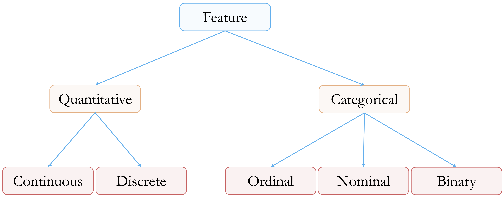
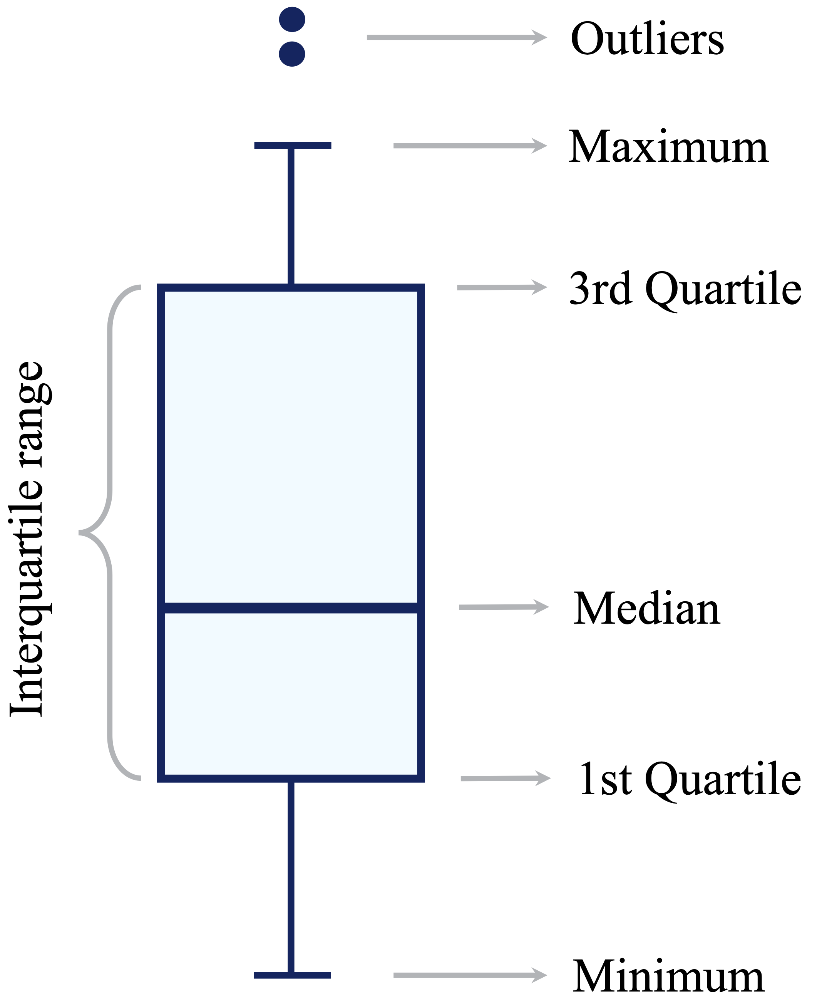
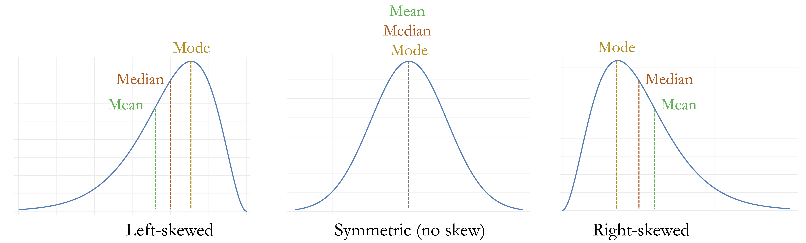

```{r echo=FALSE, message=FALSE, warning=FALSE}
source("_common.R")
```

# Data Preparation in Practice: From Raw Data to Insight {#sec-ch3-data-preparation}

::: {.content-visible when-format="pdf"}
\begin{chapterquote}
Divide each difficulty into as many parts as is feasible and necessary to resolve it.

\hfill — René Descartes
\end{chapterquote}
:::

::::: {.content-visible when-format="html"}
:::: chapterquote
Divide each difficulty into as many parts as is feasible and necessary to resolve it.

::: author
— René Descartes
:::
::::
:::::

In real-world settings, data rarely arrive in a clean, analysis-ready format. It often contains missing values, extreme observations, inconsistent entries, and nonstandard codes that reflect how data were collected rather than how they will be analyzed. While curated teaching datasets are useful for learning, they can give the misleading impression that data science begins only after the difficult preparation work has already been done.

This chapter focuses on data preparation as a core stage of the Data Science Workflow. Regardless of how sophisticated a statistical method or machine learning algorithm may be, its results depend on the quality, consistency, and structure of the data used to train or evaluate it. Preparing data is therefore not a peripheral technical step, but an analytical activity that shapes model performance, interpretability, and credibility.

Throughout the chapter, we develop practical strategies for identifying irregularities in data and deciding how they should be handled. We examine feature types, implausible values, outliers, missing values, placeholder codes, and simple imputation methods. We also consider how variables are represented, recoded, or simplified so that they better reflect the analytical question. The emphasis is not on applying rules mechanically, but on making preparation decisions that are justified by the structure of the data and the goal of the analysis.

Data preparation naturally overlaps with later stages of the workflow, but the focus differs across chapters. In this chapter, we focus on correcting, recoding, and structuring data. In Chapter [-@sec-ch4-EDA], we explore patterns and relationships through exploratory data analysis. In Chapter [-@sec-ch6-data-setup], we prepare data for specific modeling algorithms and evaluation design. In practice, these stages are often revisited iteratively rather than completed in a strict sequence.

### What This Chapter Covers {.unnumbered .unlisted}

This chapter develops data preparation as a sequence of practical decisions that make a dataset more coherent, reliable, and suitable for later analysis. We begin by examining feature types and how they are represented in R, since preparation choices depend on whether variables are numerical, categorical, ordinal, or binary. We then turn to outliers and implausible values, distinguishing rare but meaningful observations from values that are likely to reflect data errors.

The next part of the chapter focuses on missing values. We discuss how missing values may appear in R, why nonstandard placeholder codes must be recognized explicitly, and how simple imputation methods can be used to complete a dataset while preserving its meaning as far as possible. Finally, we apply these ideas in a case study on the `adult` dataset, where missing values, sparse categorical features, and skewed numerical variables arise together in a realistic prediction context.

The chapter uses two datasets for complementary purposes. The `diamonds` dataset from the **ggplot2** package provides a controlled setting for illustrating individual preparation techniques. The `adult` dataset from the **liver** package then shows how these techniques can be combined in an end-to-end workflow. Together, these examples show how data preparation transforms raw data into a coherent, documented, and analytically useful form before exploratory analysis and modeling begin.

## Feature Types and Data Representation {#sec-ch3-feature-types}

Before detecting outliers, recoding missing values, or simplifying categories, we need to understand what each variable represents. Feature type determines which summaries are meaningful, which visual tools are appropriate, and which preparation steps are justified. A numerical feature can be summarized by measures such as the mean or median, while a categorical feature is usually summarized by frequencies or proportions. Treating these feature types interchangeably can lead to misleading summaries and inappropriate modeling choices.

We use the `diamonds` dataset from the **ggplot2** package to introduce these ideas. The dataset provides a controlled setting in which feature types, implausible values, and imputation choices can be demonstrated clearly. Each row represents a diamond, described by physical measurements such as carat weight and dimensions, quality ratings such as cut, color, and clarity, and the price in US dollars. We return to this dataset in Chapter [-@sec-ch10-regression], where these features are used in a regression modeling context.

We begin by loading the dataset and inspecting its structure:

```{r}
library(ggplot2)

data(diamonds)
str(diamonds)
```

The output shows that the dataset contains `r nrow(diamonds)` observations and `r ncol(diamonds)` variables. The numerical variables include `carat`, `depth`, `table`, `price`, and the physical dimensions `x`, `y`, and `z`. These variables measure quantities such as weight, proportions, dimensions, and price.

The categorical variables `cut`, `color`, and `clarity` describe quality ratings. They are ordinal because their levels have a meaningful order, although the differences between adjacent levels should not be interpreted as equal numerical distances.

### Numerical and Categorical Features {.unnumbered .unlisted}

At a high level, most features used in data science can be grouped into two broad types: numerical and categorical variables. Each of these can be divided into common subtypes. Figure [-@fig-ch3-feature-type] summarizes this classification.

```{r fig-ch3-feature-type, echo = FALSE, out.width = "60%"}
#| fig-cap: "Overview of common feature types used in data analysis, including numerical (continuous and discrete) and categorical (ordinal, nominal, and binary) variables."


```

Numerical features represent measurable quantities. Continuous variables can take many possible values within a range, such as diamond price, carat weight, or physical dimensions. Discrete numerical variables take countable values, often integers, such as the number of purchases, website visits, or product defects. Although the `diamonds` dataset does not contain discrete numerical features, such variables are common in applied data science.

In more detailed statistical terminology, numerical variables are sometimes described as interval or ratio variables. Interval variables have meaningful differences but no true zero point, such as temperature measured in degrees Celsius. Ratio variables have both meaningful differences and a meaningful zero point, such as price, weight, length, or duration. Most numerical variables used in this chapter, including `price`, `carat`, and the physical dimensions of diamonds, are ratio variables. For data preparation, however, the broader distinction between numerical and categorical features is usually the most important starting point.

Categorical features describe group membership rather than numerical magnitude. Nominal variables represent categories without an inherent order, such as product type, region, or blood group. Ordinal variables have a meaningful order, although the spacing between levels is not necessarily uniform. In the `diamonds` dataset, `cut`, `color`, and `clarity` are ordinal categorical variables because their levels represent ordered quality grades. For example, `color` ranges from D, the most colorless grade, to J, the least colorless grade in this dataset. Binary variables form a special case of categorical variables with exactly two levels, such as yes/no, success/failure, or churn/no churn.

This distinction matters because preparation choices depend on feature type. Outlier detection is usually meaningful for numerical variables but not for unordered categories. Imputation for a numerical variable might use the median or a sampled observed value, while imputation for a categorical variable might use the mode or a sampled category. Similarly, simplifying sparse categories is relevant for categorical features, whereas transformations such as logarithms or square roots apply to numerical variables.

### How R Represents Feature Types {.unnumbered .unlisted}

In R, the way a variable is stored affects how it is summarized, plotted, and used in models. Numerical variables are commonly stored as `numeric` or `integer` vectors. Categorical variables are often stored as `factor` objects. A factor can be unordered, as with nominal categories, or ordered, as with ordinal categories. Checking both the meaning of a variable and its representation in R is therefore an important part of data preparation.

The `str()` output for the `diamonds` dataset shows that `cut`, `color`, and `clarity` are stored as ordered factors. This is important because their levels carry information about quality. We can inspect the representation of `cut` directly:

```{r}
typeof(diamonds$cut)
class(diamonds$cut)
is.ordered(diamonds$cut)
levels(diamonds$cut)
```

The output shows that `cut` has the classes `ordered` and `factor`, with levels ranging from `Fair` to `Ideal`. The result of `typeof()` also reminds us that factors are stored internally using integer codes. These internal codes should not be interpreted as numerical measurements. They are simply R's way of representing category membership.

An ordered factor remains categorical, even when its levels follow a natural order. For example, the ordering from `Fair` to `Ideal` reflects increasing cut quality, but it does not imply that the difference between `Fair` and `Good` is numerically equal to the difference between `Premium` and `Ideal`. The same caution applies to many ordinal variables in applied datasets, such as education level, satisfaction rating, or disease severity.

It is therefore useful to distinguish between the conceptual type of a variable and its technical representation in R. A variable may be conceptually categorical but stored as text, or conceptually ordinal but stored as an unordered factor. Before applying preparation steps, we should check both what the variable means and how R has stored it. This habit helps prevent inappropriate summaries, misleading visualizations, and avoidable modeling errors.

> **Practice:** Use the `diamonds` dataset to inspect how different variables are represented in R. Apply `typeof()`, `class()`, and `summary()` to `price`, `carat`, `cut`, `color`, and `clarity`. Then apply `levels()` to `cut`, `color`, and `clarity`. Compare the results for numerical and ordered categorical variables, and explain why `cut` should not be treated as a numerical measurement, even though its levels are ordered.

With the feature types in the `diamonds` dataset clarified, we can now examine one of the most common preparation challenges for numerical variables: identifying outliers and implausible values.

## Outliers and Implausible Values {#sec-ch3-outliers}

Outliers are observations that deviate markedly from the overall pattern of a dataset. They may arise from data entry errors, unusual measurement conditions, or genuinely rare but informative cases. Regardless of their origin, outliers can strongly influence summaries, visualizations, and statistical or machine learning models.

The central challenge is not only to identify extreme values, but also to decide what they represent. A useful distinction is between *outliers*, *data errors*, and *rare observations*. An outlier is a value that appears unusual relative to the rest of the data. A data error is a value that is incompatible with the measurement process or with the meaning of the variable. A rare observation is unusual but valid, and may contain important information.

This distinction matters because different types of unusual values require different responses. A diamond width of zero millimeters is not physically meaningful and should be treated as an impossible measurement. By contrast, an unusually expensive diamond may be rare but valid. Similarly, a large value of `capital_gain` in the `adult` dataset may reflect a genuine financial event rather than a mistake. Treating all unusual values as errors can remove meaningful information, while retaining clearly impossible values can distort analysis.

Outlier detection should therefore be understood as a diagnostic step, not as an automatic cleaning rule. Visual tools and numerical summaries can help identify values that deserve closer inspection, but the final decision should be guided by the meaning of the variable, the data collection process, and the goal of the analysis.

### Detecting Outliers with Visual Tools {.unnumbered .unlisted}

Visualization provides a natural starting point for detecting outliers and implausible values. Different plots highlight different aspects of the data. Boxplots summarize the spread of a variable and flag values far from the central range. Histograms show the full distribution and can reveal gaps, spikes, skewness, or isolated values. Scatter plots are useful when we need to examine whether an unusual value is also unusual in relation to another variable.

Boxplots use the interquartile range (IQR) to flag potential outliers. Values lying more than 1.5 times the IQR below the first quartile or above the third quartile are often displayed as individual points. This rule is useful for screening, but it should not be interpreted as proof that a value is wrong.

```{r fig-simple-boxplot, echo = FALSE, out.width = "40%"}
#| fig-cap: "Boxplots summarize a variable’s distribution and flag potential outliers. Observations beyond 1.5 times the interquartile range (IQR) from the quartiles are shown as individual points."


```

To illustrate visual outlier detection, we examine the variable `y` in the `diamonds` dataset, which records diamond width in millimeters. We first compare a full-scale boxplot with a zoomed-in version:

```{r}
#| layout-ncol: 2
#| fig-width: 4
#| fig-height: 4

ggplot(data = diamonds) +
  geom_boxplot(aes(y = y)) +
  labs(title = "Full scale", y = "Diamond width (mm)")

ggplot(data = diamonds) +
  geom_boxplot(aes(y = y)) +
  coord_cartesian(ylim = c(0, 15)) +
  labs(title = "Zoomed view", y = "Diamond width (mm)")
```

The full-scale boxplot in the left panel shows that a small number of extreme values stretch the vertical axis, compressing the main body of the distribution. The zoomed view makes the typical range easier to see: most diamond widths lie between approximately 2 and 6 mm, while a few observations fall far outside the usual range. The `coord_cartesian()` function changes only the displayed range of the plot; it does not remove observations from the data. The boxplots highlight that some values are unusually large relative to the interquartile range, but they do not show the full distribution or the exact number of affected observations.

Histograms provide a complementary view because they show how frequently values occur across the range of a variable. We again compare the full distribution with a zoomed-in view of the vertical axis:

```{r}
#| layout-ncol: 2
#| fig-width: 4
#| fig-height: 4

ggplot(data = diamonds) +
  geom_histogram(aes(x = y), binwidth = 0.5) +
  labs(title = "Full scale", x = "Diamond width (mm)", y = "Count")

ggplot(data = diamonds) +
  geom_histogram(aes(x = y), binwidth = 0.5) +
  coord_cartesian(ylim = c(0, 20)) +
  labs(title = "Zoomed count scale", x = "Diamond width (mm)", y = "Count")
```

The full-scale histogram in the left panel shows that most values are concentrated between approximately 2 and 6 mm, while observations at the extremes are difficult to distinguish. The zoomed histogram in the right panel reveals several atypical observations. In particular, the variable contains seven zero values and two unusually large values, one slightly above 30 mm and another close to 60 mm. A width of zero is not physically meaningful for a diamond, while very large widths should be inspected together with the other dimensions before deciding how to handle them.

Before changing the data, we inspect the affected rows:

```{r}
diamonds[
  diamonds$y == 0 | diamonds$y > 30,
  c("carat", "cut", "color", "clarity", "x", "y", "z", "price")
]
```
This step is important because outliers should not be treated by looking at one variable in isolation. For physical measurements such as `x`, `y`, and `z`, an implausible value in one dimension may indicate that the entire record requires closer inspection. In this case, the zero values of `y` are accompanied by zero values of both `x` and `z`, which strongly suggests that the physical dimensions were not recorded correctly for these diamonds. The unusually large values of `y` are also inconsistent with the corresponding values of `x` and `z`, suggesting that they are more likely to reflect measurement or recording errors than rare but valid observations. This example illustrates the importance of examining outliers in context before deciding how to handle them.

> **Practice:** Apply the same visual checks to the variables `x` and `z`, which represent diamond length and depth. Use both boxplots and histograms, and compare the results with those for `y`. Which values appear merely unusual, and which values appear physically implausible?

### Strategies for Handling Outliers {.unnumbered .unlisted}

Once unusual values have been identified, the next step is to decide how they should be handled. There is no universally correct strategy. The appropriate response depends on whether the value is impossible, suspicious but plausible, or rare and informative. It also depends on the data collection process, the analytical objective, and the type of model or summary that will be used later.

Several practical strategies are commonly used:

- *Retain the value* when it represents a valid observation that may carry important information. In fraud detection, for example, extreme values may be precisely the cases of interest. Similarly, in the `adult` dataset examined later in this chapter, unusually large values of `capital_gain` may correspond to genuine financial events.

- *Recode the value as missing* when there is strong evidence that it is erroneous. Implausible measurements, such as a diamond width of zero or a negative value for a quantity that cannot be negative, are often better treated as `NA` than silently retained.

- *Flag the value* by creating an indicator variable when the observation may be unusual and informative. This allows later analyses to account for the presence of unusual observations, but should be used selectively to avoid unnecessary complexity.

- *Transform the variable* when the issue is not an isolated error but a strongly skewed distribution. Logarithmic or square-root transformations can reduce the influence of large values, although they also change the interpretation of the variable.

- *Use robust methods or winsorization* when extreme values may dominate methods that are sensitive to them. Robust summaries, tree-based models, median-based methods, or capped values can reduce sensitivity to extremes, but the choice must be justified and documented.

- *Remove the observation* only when the value is clearly invalid, cannot be corrected or reasonably imputed, and would otherwise compromise the analysis. Removal should be treated as a last resort rather than a default response.

In practice, a cautious and transparent approach is essential. Automatically removing outliers may simplify an analysis, but it can also discard meaningful information. Conversely, retaining impossible values can make summaries and models unreliable. The goal is not to make the dataset look neat, but to make preparation decisions that are defensible, documented, and consistent with the purpose of the analysis.

### Example: Cleaning Diamond Dimensions {.unnumbered .unlisted}

We now apply these principles to the physical dimensions in the `diamonds` dataset. The variable `y` contains seven zero values and two unusually large values, one slightly above 30 mm and another close to 60 mm. Because `y` measures diamond width, a value of zero is physically impossible. Values above 30 mm are also implausible in the context of this dataset, especially when compared with the corresponding values of `x` and `z`.

In a full analysis, we would inspect the full records carefully before deciding whether to recode one dimension or remove affected observations entirely. Here, the goal is to demonstrate a transparent cleaning workflow: identify unusual values, inspect the affected records, decide whether they are plausible, and document the preparation step. Based on the earlier inspection, we treat values of `y` equal to zero or greater than 30 as implausible measurements.

Rather than deleting the affected observations, we create a cleaned version of the dataset in which these implausible measurements are recoded as missing values. This preserves the records while marking the problematic entries for later handling.

```{r}
library(dplyr)

diamonds_clean <- mutate(diamonds, y = ifelse(y == 0 | y > 30, NA, y))
```

The condition `y == 0 | y > 30` identifies values that are physically impossible or implausibly large for this variable. These values are replaced with `NA`, while all other values of `y` are retained.

We can verify the result by comparing the summaries of the original and cleaned variables:

```{r}
summary(diamonds$y)
summary(diamonds_clean$y)
```

The cleaned version records nine values of `y` as missing. The largest implausible width values no longer dominate the summary, but the affected observations remain in the dataset. This distinction is important: the problematic measurements have been recoded, not silently discarded. In the next section, we use this cleaned variable to introduce missing-value handling and imputation.

> **Practice:** Extend the same cleaning logic to `x` and `z`. Identify values that are zero or physically implausible, inspect the affected rows, recode problematic measurements as `NA`, and compare the summaries before and after cleaning.

## Missing Values and Imputation {#sec-ch3-missing-values}

Missing values are more than empty cells in a dataset. They often reflect how data were collected, which measurements were unavailable, or which information was not recorded under certain conditions. If missing values are ignored or handled mechanically, they can distort summaries, obscure patterns, and lead to misleading models.

In R, missing values are usually represented by `NA`. In practice, however, missingness may also appear through nonstandard placeholder codes such as `-1`, `999`, `"unknown"`, `"missing"`, or `"?"`. These values require careful inspection before analysis. Some placeholders indicate genuinely missing information and should be recoded as `NA`, while others encode meaningful conditions that should be retained.

A placeholder code should therefore not be recoded automatically. The same code can have different meanings in different datasets. For example, a value of `-1` may indicate missing information in one dataset but a meaningful structural condition in another. In the `bank` dataset, the value `-1` in `pday` indicates that a client was not previously contacted. This is not simply missing information; it records a meaningful condition. By contrast, the `"?"` values in the `adult` dataset later in this chapter represent nonstandard missing-value codes that should be recoded as `NA`.

A useful habit is to inspect summaries, unique values, and missing-value counts before applying any cleaning step:

```{r eval = FALSE}
summary(data)
unique(data$variable)
table(data$variable, useNA = "ifany")
```

These checks help distinguish genuine missing values from valid but unusual codes. This distinction matters because recoding a meaningful value as missing can remove information, while failing to recode a placeholder code can distort summaries, visualizations, and downstream models.

Once missing values have been identified, the next question is how they should be handled. In descriptive work, the aim is often to summarize the observed data transparently and understand where information is incomplete. In predictive modeling, missing-value handling must be integrated into the modeling workflow. In particular, imputation rules should usually be learned from the training data and then applied to validation or test data. This prevents information from the validation or test set from influencing data preparation. Chapter [-@sec-ch6-data-setup] returns to this issue when discussing data setup for modeling.

Several strategies can be used to handle missing values. Some methods replace missing entries with simple summaries, such as the mean, median, or mode. Others use random sampling from the observed values or estimate missing values from relationships with other variables. These approaches differ in complexity, assumptions, and in how much of the original variability they preserve. Before choosing among them, we first consider why values may be missing, since the missingness mechanism affects how reasonable an imputation strategy is likely to be.

### Missingness Mechanisms {.unnumbered .unlisted}

Missingness is often described using three broad mechanisms: missing completely at random, missing at random, and missing not at random. These mechanisms help clarify what assumptions are being made when incomplete data are analyzed or imputed. They do not provide labels that can be verified automatically from the data alone, but they offer a useful framework for thinking about the source of missing values.

Data are *missing completely at random* when the probability that a value is missing does not depend on either observed or unobserved information. For example, measurements lost because of a random technical failure may approximately follow this pattern. Under this mechanism, the observed cases can be treated as a random subset of the full data, although information is still lost.

Data are *missing at random* when the probability of missingness depends on observed variables, but not on the missing value itself after those variables are taken into account. For instance, income may be more often missing for younger respondents, but within each age group the missingness may not depend further on the income value. In this case, observed variables can help explain the missingness and support more informed imputation.

Data are *missing not at random* when the probability of missingness depends on the unobserved value itself. Income again provides a useful example: individuals with very high incomes may be less willing to report them. This type of missingness is more difficult to handle because the missing values are systematically related to information that is not observed.

The distinction among these mechanisms matters because imputation is not only a computational step. It also involves assumptions about how the missing values relate to the observed data. If missingness is approximately random, simple methods may be adequate for exploratory purposes. If missingness is related to observed variables, methods that use those variables may be more appropriate. If missingness depends on the unobserved values themselves, any imputation strategy should be interpreted with particular caution.

In practice, we rarely know the true missingness mechanism with certainty. The aim is therefore not to assign a definitive label, but to think carefully about the data collection process, inspect patterns of missingness, and state the assumptions behind the chosen method.

### Simple Imputation Methods {.unnumbered .unlisted}

Imputation replaces missing values with plausible values derived from the observed data. Simple imputation methods use a single summary of the variable with missing entries. They are easy to implement and explain, which makes them useful for teaching, exploratory work, and simple preprocessing tasks. However, they do not recover the true missing values and do not reflect uncertainty about what those values might have been.

For numerical variables, common choices are mean and median imputation. Mean imputation replaces missing values with the average of the observed values and may be reasonable for approximately symmetric distributions. Median imputation is often more robust for skewed variables because it is less affected by extreme values. For categorical variables, mode imputation replaces missing values with the most frequently observed category.

The relationship between distribution shape and summary-based imputation is shown in Figure [-@fig-skew-type]. In symmetric distributions, the mean and median are close together. In skewed distributions, the mean is pulled toward the longer tail, while the median remains more stable.

```{r fig-skew-type, echo = FALSE, out.width = "100%"}
#| fig-cap: "Distribution shapes and the relative positions of the mean, median, and mode. From left to right: left-skewed, symmetric, and right-skewed distributions. In symmetric distributions, these measures coincide, while in skewed distributions the mean is pulled toward the tail."


```

The choice of imputation method should reflect both the feature type and the distribution of the observed values. Mean imputation is sensitive to extreme values, while median imputation is usually more stable for skewed numerical variables. Mode imputation is simple and interpretable for categorical variables, but it can overrepresent the most frequent category, especially when missingness is not negligible.

The main limitation of these methods is that they replace all missing values in a variable with the same number or category. This can reduce variability and weaken relationships with other variables. For this reason, simple imputation should be used with care when missingness is substantial or when relationships among variables are central to the analysis. The next subsection considers alternatives that preserve more variability or use information from other features.

### Random Sampling and Model-Based Imputation {.unnumbered .unlisted}

Random sampling imputation replaces each missing value by drawing from the observed values of the same variable. Unlike mean, median, or mode imputation, it does not insert the same value repeatedly. This helps preserve the marginal distribution of the variable, including its spread and shape.

However, random sampling imputation has two important limitations. First, it introduces randomness, so a seed should be set when reproducibility is required. Second, it samples from the observed distribution of one variable only and does not use information from related variables. For example, randomly imputing diamond width from the observed values of `y` does not use information from `carat`, `x`, `z`, or `price`.

Model-based imputation takes a different approach by using relationships among variables to estimate missing values. Examples include regression-based imputation, tree-based imputation, $k$-nearest-neighbor imputation, and methods implemented in packages such as **Hmisc** and **mice**. These methods can produce more realistic imputations when variables are strongly related, but they require stronger assumptions, additional modeling choices, and more careful implementation.

An important extension is multiple imputation, which creates several completed versions of the dataset and combines results across them. This approach is especially useful for statistical inference because it reflects uncertainty about the missing values. In this chapter, we focus on simpler methods because the goal is to introduce the logic of imputation rather than the full theory of missing-data analysis. More advanced methods should be treated as part of a complete analysis plan rather than as automatic preprocessing steps.

### Example: Imputing Diamond Width {.unnumbered .unlisted}

We now return to the cleaned `diamonds_clean` dataset created in the previous section. Implausible values of `y`, including zero widths and values above 30 mm, were recoded as `NA`. The next question is how these missing values should be handled.

We begin by examining the distribution of the cleaned variable:

```{r out.width = "60%"}
ggplot(data = diamonds_clean) +
  geom_density(aes(x = y), bw = 0.6, na.rm = TRUE) +
  labs(x = "Diamond width (mm)", y = "Density")
```

A numerical summary provides additional information:

```{r}
summary(diamonds_clean$y)
sum(is.na(diamonds_clean$y))
```

The distribution of `y` is mildly right-skewed, and the mean is slightly larger than the median. The summary also confirms that nine values are now recorded as missing. In this setting, median imputation provides a simple and robust option.

We use the `impute()` function from the **Hmisc** package to replace the missing values with the median of the observed values:

```{r}
library(Hmisc)

diamonds_clean$y_median <- impute(diamonds_clean$y, fun = median)
```

This code creates a new variable, `y_median`, rather than overwriting `y`. Keeping the cleaned variable `y` unchanged preserves the preparation history and allows different imputation strategies to be compared.

Median imputation fills the missing values with a single robust summary value. In this example, only nine values are missing, so a full histogram of the imputed variable would look almost identical to the histogram of the cleaned variable. The main effect is therefore easier to describe than to see: each missing value is replaced by the same median width. This makes the method simple and reproducible, but it also introduces repeated values and slightly reduces variability.

As an alternative, we can use random sampling imputation. To make the result reproducible, we set a seed before drawing replacement values:

```{r}
set.seed(42)

diamonds_clean$y_random <- impute(diamonds_clean$y, fun = "random")
```

Random sampling imputation replaces each missing value with a value drawn from the observed distribution of `y`. This preserves the marginal spread of the variable more directly than median imputation, but it does not use information from related variables such as `carat`, `x`, `z`, or `price`.

Because only nine values were imputed, the difference between median and random sampling imputation is easier to see by inspecting the affected observations directly:

```{r}
missing_y <- is.na(diamonds_clean$y)

data.frame(
  price = diamonds_clean$price[missing_y],
  y_median = as.numeric(diamonds_clean$y_median[missing_y]),
  y_random = as.numeric(diamonds_clean$y_random[missing_y])
)
```

The table shows the main difference between the two methods. Median imputation assigns the same replacement value to every missing observation, while random sampling imputation assigns values drawn from the observed distribution. These sampled values vary across observations, but they should still be interpreted as plausible replacements rather than recovered true measurements.

We can also compare the original variable with the version obtained after cleaning and random sampling imputation. This comparison summarizes the full preparation sequence: the implausible values in `y` are first recoded as missing, and the resulting missing values are then replaced by values sampled from the observed distribution.

```{r out.width = "100%"}
#| layout-ncol: 2
#| fig-width: 4
#| fig-height: 4

ggplot(diamonds) +
  geom_point(aes(x = y, y = price), size = 0.1, na.rm = TRUE) +
  labs(title = "Original variable", x = "Diamond width (mm)", y = "Price")

ggplot(diamonds_clean) +
  geom_point(aes(x = y_random, y = price), size = 0.1) +
  labs(title = "After cleaning and random imputation", x = "Diamond width (mm)", y = "Price")
```

The left panel shows the implausible widths that motivated the cleaning step. In the right panel, these values no longer appear as extreme measurements because they have first been recoded as missing and then replaced through random sampling imputation. This comparison should therefore be interpreted as the combined effect of cleaning and imputation, rather than as the effect of imputation alone.

In predictive modeling, imputation should usually be learned from the training set and then applied to validation or test data, rather than estimated from the full dataset before partitioning. This prevents information from the validation or test set from influencing the preparation of the training data.

> **Practice:** Compare median imputation and random sampling imputation for the variables `x` and `z`. After recoding physically implausible values as `NA`, create imputed versions of each variable and compare their summaries and distributions. Which method better preserves the observed distribution, and what assumptions does it make?


## Case Study: Preparing Data to Predict High Earners {#sec-ch3-data-pre-adult}

We now bring together the data preparation ideas developed throughout this chapter in a more realistic case study. Unlike the controlled examples used earlier, this case study shows how several preparation tasks often arise together: recoding nonstandard missing-value codes, imputing missing entries in categorical features, simplifying sparse and high-cardinality categories, and inspecting potential outliers in skewed numerical variables.

The case study uses the `adult` dataset from the **liver** package. This dataset is widely used in machine learning as a benchmark for income prediction, but our focus here is not yet on model fitting. Instead, we prepare the data so that it can later be used in a principled and reproducible modeling workflow.

### Problem Understanding and Dataset Overview {.unnumbered .unlisted}

The prediction task in this case study is to determine whether an individual earns more than \$50,000 per year based on demographic, educational, occupational, and financial characteristics. This type of question arises in applied settings such as economic research, policy analysis, and data-driven decision support. Here, however, the emphasis is on preparing the data for later modeling rather than fitting a predictive model.

The `adult` dataset was originally derived from data collected by the US Census Bureau. It contains information on individuals, including age, education, marital status, occupation, working hours, capital gains and losses, country of origin, and income category. In Chapter [-@sec-ch12-tree-models], we return to this dataset to construct and evaluate predictive models using decision trees and random forests (see Section [-@sec-ch12-case-study]).

We begin by loading the dataset from the **liver** package:

```{r}
library(liver)

data(adult)
```

To preserve the original dataset, we create a working copy that will be modified during the preparation steps:

```{r}
adult_prepared <- adult
```

The object `adult` contains the original dataset loaded from the **liver** package, while `adult_prepared` will store the prepared version developed throughout this case study. This distinction makes the preparation workflow easier to follow and allows us to return to the original data if needed.

To inspect the dataset structure and variable types, we use the `str()` function:

```{r}
str(adult)
```

The dataset contains `r nrow(adult)` observations and `r ncol(adult)` variables. Most variables serve as predictors, while the target variable, `income`, indicates whether an individual earns more than \$50,000 per year (`>50K`) or not (`<=50K`). The dataset includes a mixture of numerical, binary, ordinal, and nominal features.

The dataset also includes demographic variables such as `race`, `gender`, and `native_country`. In applied prediction settings, the use of such variables requires careful ethical, legal, and contextual consideration. In this chapter, these variables are treated as part of a data preparation exercise, while broader questions about fairness, bias, and responsible modeling are revisited later in the book.

The numerical variables include `age`, `demogweight`, `education_num`, `capital_gain`, `capital_loss`, and `hours_per_week`. These variables describe demographic, survey-weighting, educational, financial, and work-related information. Although `education_num` is stored numerically, it represents ordered educational attainment rather than a direct physical measurement.

Several variables describe categorical characteristics. The variables `workclass`, `marital_status`, `occupation`, `relationship`, `race`, and `native_country` are nominal categorical features. The variable `education` is ordinal because its levels represent an ordered progression of educational attainment. The variables `gender` and `income` are binary categorical variables, with `income` serving as the target variable for later prediction.

To gain an initial overview of distributions and possible data-quality issues, we inspect summary statistics:

```{r}
summary(adult)
```

The summary output provides the starting point for the preparation steps that follow. In particular, it reveals nonstandard missing-value codes, sparse categorical levels, and strongly skewed numerical variables. We begin by recoding the nonstandard missing-value codes in `adult_prepared` so that R recognizes them as missing values.

### Recoding Nonstandard Missing-Value Codes {.unnumbered .unlisted}

The summary output reveals that three variables, `workclass`, `occupation`, and `native_country`, contain the value `"?"`. In this dataset, `"?"` is not a meaningful category, but a nonstandard placeholder for missing information. Because R does not automatically treat this string as missing, we first recode it explicitly as `NA` in the working dataset `adult_prepared`.

```{r}
adult_prepared[adult_prepared == "?"] <- NA
```

This command replaces all occurrences of `"?"` in `adult_prepared` with `NA`. The expression `adult_prepared == "?"` identifies the positions where the placeholder appears, and assigning `NA` to these positions ensures that R recognizes the affected entries as missing values in later analyses. The original `adult` dataset remains unchanged.

After recoding, we remove unused factor levels:

```{r}
adult_prepared <- droplevels(adult_prepared)
```

This step is useful because the placeholder `"?"` may remain as an unused factor level after being replaced by `NA`. Removing unused levels keeps the categorical variables cleaner and reduces the risk of complications in later preparation steps.

To assess the extent of missingness after recoding, we use the `gg_miss_var()` function from the **naniar** package:

```{r out.width = "60%"}
library(naniar)

gg_miss_var(adult_prepared, show_pct = TRUE)
```

The plot confirms that missing values occur only in three categorical features: `workclass` with `r round(100 * mean(is.na(adult_prepared$workclass)), 2)`% missing, `occupation` with `r round(100 * mean(is.na(adult_prepared$occupation)), 2)`% missing, and `native_country` with `r round(100 * mean(is.na(adult_prepared$native_country)), 2)`% missing. These are the variables that require imputation in the next step. Recoding the placeholder values as `NA` has therefore made the missingness explicit and visible to R.

### Imputing Missing Values in Categorical Features {.unnumbered .unlisted}

Once the placeholder codes have been recoded as `NA`, we need to decide how to handle the missing entries. Removing all incomplete observations would discard information from otherwise usable records. Since the missing values occur only in categorical features, we use random sampling imputation to replace each missing value with a category drawn from the observed values of the same variable.

This approach preserves the empirical distribution of each categorical feature more directly than mode imputation, which would replace all missing entries with the most frequent category. However, random sampling imputation does not use information from other variables, such as age, education, occupation, or income. It should therefore be interpreted as a simple preparation step rather than as a recovery of the true missing categories.

We use the `impute()` function from the **Hmisc** package. Since random sampling is involved, we set a seed to make the results reproducible:

```{r}
library(Hmisc)

set.seed(42)

adult_prepared$workclass <- impute(adult_prepared$workclass, fun = "random")

adult_prepared$occupation <- impute(adult_prepared$occupation, fun = "random")

adult_prepared$native_country <- impute(adult_prepared$native_country, fun = "random")
```

Each missing value is replaced by a value sampled from the observed categories of the corresponding variable. The imputation is carried out separately for `workclass`, `occupation`, and `native_country`, so the observed distribution of each feature is used for its own missing entries.

We then check that the imputation step has addressed all missing entries. The **liver** package provides the helper function `find.na()`, which reports missing values by variable:

```{r}
find.na(adult_prepared)
```

The output confirms that no missing values remain in `adult_prepared`. At this stage, the categorical features `workclass`, `occupation`, and `native_country` are complete, although some of them still contain sparse or high-cardinality category structures. We address this issue in the next subsection.

> **Practice:** Replace the random sampling imputation used above with mode imputation for `workclass`, `occupation`, and `native_country`. Compare the resulting category frequencies with those obtained using random sampling. How do the two imputation choices affect the distribution of these variables, and what implications might this have for downstream modeling?

### Simplifying Sparse and High-Cardinality Categorical Features {.unnumbered .unlisted}

Categorical variables with many levels can create sparse feature representations and make later modeling more difficult to interpret. This issue is especially relevant when some categories occur only rarely. In `adult_prepared`, the variable `native_country` contains many country labels, while `workclass` contains only a small number of levels but includes some rare categories. We simplify these variables to reduce sparsity while preserving interpretable information.

We begin with `native_country`, which contains `r length(levels(adult_prepared$native_country))` distinct country labels after missing values have been imputed. Treating each country as a separate category would increase the number of factor levels and, in models that require dummy variables, would increase the number of derived features. Since many countries occur infrequently, we group countries into broader geographic regions as a pragmatic preparation step.

This grouping should be interpreted as a modeling simplification rather than as a substantive statement about countries or individuals. The aim is to reduce sparsity and make the variable easier to use in later analyses.

We implement the grouping using the `fct_collapse()` function from the **forcats** package:

```{r message = FALSE}
library(forcats)

Europe <- c("France", "Germany", "Greece", "Hungary", "Ireland", "Italy", "Netherlands", "Poland", "Portugal", "United-Kingdom", "Yugoslavia")

North_America <- c("United-States", "Canada", "Outlying-US(Guam-USVI-etc)")

Latin_America <- c("Mexico", "El-Salvador", "Guatemala", "Honduras", "Nicaragua", "Cuba", "Dominican-Republic", "Puerto-Rico", "Colombia", "Ecuador", "Peru")

Caribbean <- c("Jamaica", "Haiti", "Trinidad&Tobago")

Asia <- c("Cambodia", "China", "Hong-Kong", "India", "Iran", "Japan", "Laos", "Philippines", "South", "Taiwan", "Thailand", "Vietnam")

adult_prepared$native_country <- fct_collapse(
  adult_prepared$native_country,
  "Europe"        = Europe,
  "North America" = North_America,
  "Latin America" = Latin_America,
  "Caribbean"     = Caribbean,
  "Asia"          = Asia
)
```

We inspect the updated frequency table to verify the result:

```{r}
table(adult_prepared$native_country)
```

We next simplify the `workclass` variable. Unlike `native_country`, this variable is not high-cardinality. Its main issue is that two levels, `"Never-worked"` and `"Without-pay"`, occur rarely. Keeping these levels separate may add sparsity without providing a useful distinction for the preparation goals of this chapter. We therefore combine them into a broader category called `"Not in paid employment"`:

```{r}
adult_prepared$workclass <- fct_collapse(
  adult_prepared$workclass,
  "Not in paid employment" = c("Never-worked", "Without-pay")
)
```

We again verify the recoding using a frequency table:

```{r}
table(adult_prepared$workclass)
```

These recoding steps reduce sparsity in categorical variables while keeping the resulting categories interpretable. The grouped `native_country` variable now represents broad geographic regions rather than many sparse country labels, and the simplified `workclass` variable avoids retaining very rare employment categories as separate levels. These changes prepare the dataset for later modeling without yet applying model-specific encoding such as dummy variables or one-hot encoding.


### Inspecting Outliers in Skewed Numerical Features {.unnumbered .unlisted}

The earlier part of this chapter emphasized that outlier detection is a diagnostic step rather than an automatic cleaning rule. We now apply this idea to two numerical features in `adult_prepared`: `capital_gain` and `capital_loss`. These variables record annual capital gains and capital losses in US dollars. They are useful examples because they contain many zero values and a smaller number of relatively large positive values, a pattern that is common in economic and financial data.

A value of zero is meaningful here. It usually indicates that an individual did not report capital gains or losses in the relevant period. These zeros should therefore not be treated as missing values. At the same time, the positive values may appear as outliers because they are much larger than the mass of observations at zero. Before deciding how to handle them, we need to inspect whether they are plausible values or likely data errors.

We begin by inspecting summary statistics:

```{r}
summary(adult_prepared[, c("capital_gain", "capital_loss")])
```

The summaries show that both variables have a minimum value of zero and a small number of much larger observations. For both variables, at least 75% of the observations are equal to zero, while the means are larger than the medians because of the positive values in the upper tail. This pattern indicates strong right skewness: most individuals report no capital gain or loss, while a smaller group report positive amounts.

To make this structure more visible, we examine the full distributions:

```{r out.width = "100%"}
#| layout-ncol: 2
#| fig-width: 4
#| fig-height: 4

ggplot(data = adult_prepared) +
  geom_histogram(aes(x = capital_gain), bins = 40) +
  labs(title = "Capital gain", x = "Capital gain", y = "Count")

ggplot(data = adult_prepared) +
  geom_histogram(aes(x = capital_loss), bins = 40) +
  labs(title = "Capital loss", x = "Capital loss", y = "Count")
```

Both histograms show a large concentration at zero and a long right tail. This shape is not surprising for financial variables: many individuals report no capital gain or loss, while a smaller number report positive amounts. The large values are therefore candidates for closer inspection, not automatic removal.

To better understand the positive values, we inspect the distributions after excluding zeros:

```{r out.width = "100%"}
#| layout-ncol: 2
#| fig-width: 4
#| fig-height: 4

adult_gain_nonzero <- subset(adult_prepared, capital_gain > 0)
adult_loss_nonzero <- subset(adult_prepared, capital_loss > 0)

ggplot(data = adult_gain_nonzero) +
  geom_histogram(aes(x = capital_gain), bins = 30) +
  labs(title = "Nonzero capital gain", x = "Capital gain", y = "Count")

ggplot(data = adult_loss_nonzero) +
  geom_histogram(aes(x = capital_loss), bins = 30) +
  labs(title = "Nonzero capital loss", x = "Capital loss", y = "Count")
```

The nonzero distributions show that the positive values are not isolated mistakes in the same sense as the impossible diamond dimensions examined earlier. They are unusual relative to the many zero values, but they remain plausible within the meaning of the variables. This distinction is important: an outlying financial value may represent a genuine event rather than a recording error.

Based on this inspection, we retain the observed values of `capital_gain` and `capital_loss`. Removing them would risk discarding relevant information about individuals with substantial financial gains or losses. If these variables later prove influential during modeling, several alternatives could be considered, such as applying a transformation, creating indicators for whether capital gain or loss is positive, or using modeling methods that are less sensitive to skewed numerical features.

For this chapter, the key preparation decision is therefore not to remove the large values, but to document their distribution and retain them for later modeling. This keeps the data faithful to the observed records while making the skewness and potential outliers visible for future analytical decisions.

> **Practice:** Create binary indicators for whether `capital_gain` and `capital_loss` are greater than zero. Compare the frequency of positive values for the two variables. How might these indicators be useful in a later predictive model?

### Prepared Dataset and Modeling Readiness {.unnumbered .unlisted}

We have now completed the main data preparation steps for the `adult` dataset in this chapter. In the working dataset `adult_prepared`, nonstandard missing-value codes have been recoded as `NA`, missing categorical values have been imputed, sparse and high-cardinality categorical features have been simplified, and skewed financial variables have been inspected rather than automatically modified or removed.

Before moving on, we check that the prepared dataset no longer contains missing values. The **liver** package provides the helper function `find.na()`, which reports missing values by variable:

```{r}
find.na(adult_prepared)
```

The output confirms that the missing values introduced by the `"?"` placeholders have been addressed. The dataset is now more coherent and better documented than the original version. However, it is important to distinguish between a generally prepared dataset and a dataset that is fully ready for a specific modeling algorithm. The steps in this chapter focus on general data preparation: making missingness explicit, handling incomplete values, simplifying categorical structure, and inspecting unusual numerical values.

Further modeling-specific preparation may still be required. For example, algorithms that require numerical input may need categorical variables to be encoded as dummy variables or one-hot indicators. Distance-based methods may require feature scaling, while tree-based methods can often handle unscaled numerical variables more naturally. In addition, train-test partitioning, cross-validation, and leakage-aware preprocessing should be carried out as part of the data setup for modeling discussed in Chapter [-@sec-ch6-data-setup].

The object `adult_prepared` therefore represents the output of the data preparation work completed in this case study. It is suitable for exploratory analysis and provides a coherent starting point for later modeling. In Chapter [-@sec-ch12-tree-models], we return to this prepared income-prediction problem when fitting and evaluating decision tree and random forest models.

## Chapter Summary and Takeaways

This chapter introduced data preparation as a set of practical and analytical decisions that shape the quality of later analysis and modeling. Using the `diamonds` and `adult` datasets, we examined how raw data can contain implausible measurements, nonstandard missing-value codes, sparse categories, and strongly skewed numerical features. The goal was not simply to make the data look cleaner, but to make preparation choices that are transparent, defensible, and aligned with the purpose of the analysis.

A central theme was the importance of distinguishing between superficially similar problems. We distinguished outliers from invalid values: an unusual observation may be rare but meaningful, while an impossible value, such as a zero physical dimension for a diamond, should be treated as a data-quality problem. We also distinguished genuine missing values from placeholder codes such as `"?"`, which must first be recoded as `NA` before R can recognize them as missing.

The chapter also compared several approaches to imputation. Deterministic methods such as mean, median, and mode imputation are simple and reproducible, but they replace missing entries with repeated values and may reduce variability. Random sampling imputation preserves the marginal distribution more directly, but it does not use relationships with other variables. Model-based and multiple imputation methods can use more information, but they require stronger assumptions and more careful implementation.

Finally, we considered categorical feature simplification as a trade-off. Grouping sparse or high-cardinality categories can reduce complexity and improve interpretability, but it may also remove information if categories with distinct meanings are combined too aggressively. The `adult` case study illustrated how such decisions should be documented and interpreted as preparation choices rather than automatic corrections.

Together, these ideas prepare the ground for the next stage of the Data Science Workflow. In the next chapter, we turn to exploratory data analysis, using visualizations and numerical summaries to investigate patterns, relationships, and potential signals in prepared data.

## Exercises {#sec-ch3-exercises}

The exercises in this chapter reinforce the main ideas of data preparation through conceptual questions, focused practice, and an applied mini-project. They emphasize the distinction between unusual and invalid values, the recognition of missing values and placeholder codes, the choice of imputation strategies, and the trade-offs involved in simplifying categorical variables. The final exercises ask you to reflect on reproducibility, leakage, fairness, and the role of data preparation in responsible modeling.

#### Conceptual Understanding {.unnumbered .unlisted}

1. Explain the difference between continuous numerical variables, discrete numerical variables, ordinal categorical variables, and nominal categorical variables. Give one example of each.

2. Explain how the `typeof()` and `class()` functions differ in R. Why can both be useful when preparing data for analysis or modeling?

3. Distinguish between an outlier and an invalid value. Give one example of an unusual but valid value and one example of a value that should be treated as a data-quality problem.

4. Explain the difference between a missing value and a placeholder code. Why should values such as `"?"`, `"unknown"`, `999`, or `-1` be inspected before being recoded as `NA`?

5. Compare deterministic imputation methods, such as mean, median, or mode imputation, with stochastic methods such as random sampling imputation. Why is `set.seed()` important when using stochastic imputation?

6. Explain the difference between an imputation method that preserves the marginal distribution of one variable and a method that uses relationships among variables. Give one example of each type.

7. Explain why imputing missing values before a train-test split can lead to data leakage. How should imputation be handled in a predictive modeling workflow?

8. Category simplification can reduce sparsity but may also remove information. Explain this trade-off using an example from a categorical variable with many rare levels.

#### Hands-On Practice: Data Preparation with `diamonds` {.unnumbered .unlisted}

9. Load the `diamonds` dataset and classify its variables as numerical, ordinal categorical, or nominal categorical. Compare your classification with the output of `str()`.

10. Use `summary()` to inspect the variables `x`, `y`, and `z`. Which values appear physically implausible, and why?

11. Create histograms and boxplots for `x`, `y`, and `z`. Use these plots to distinguish between values that are merely unusual and values that are likely invalid.

12. Recode physically implausible values in `x`, `y`, or `z` as `NA` using a clearly documented rule. Compare the summary statistics before and after recoding.

13. After recoding implausible values in one of the dimension variables as `NA`, apply both median imputation and random sampling imputation. Use `set.seed()` for the random sampling method and compare the resulting summaries.

14. Create a new variable representing diamond volume using `x * y * z`. Summarize and visualize this variable before and after handling implausible dimension values. What changes do you observe?

15. Create a scatter plot of `carat` versus `price`. Discuss how invalid dimension values or extreme observations could affect interpretation of this relationship.

#### Hands-On Practice: Data Preparation with `adult` {.unnumbered .unlisted}

16. Load the `adult` dataset from the **liver** package and create a working copy called `adult_prepared`. Classify the variables as numerical, binary categorical, ordinal categorical, or nominal categorical.

17. Identify variables that contain the placeholder code `"?"`. Recode these values as `NA` in `adult_prepared` and verify the missing-value pattern using `find.na()` or another suitable function.

18. Impute the missing values in `workclass`, `occupation`, and `native_country` using two methods: replacing missing values with the most frequent category and using random sampling imputation. Compare the resulting frequency tables.

19. Combine the rare `workclass` levels `"Never-worked"` and `"Without-pay"` into a broader category. Propose an appropriate label and justify your choice.

20. Compare two strategies for simplifying `native_country`: grouping countries into broad geographic regions and grouping rare countries into an `"Other"` category while keeping frequent countries separate. Discuss the trade-off between reducing sparsity and preserving information.

21. Inspect the distributions of `capital_gain` and `capital_loss` using summaries and histograms. Explain why zero values should not be treated as missing values in these variables.

22. Create binary indicators for whether `capital_gain` and `capital_loss` are greater than zero. Summarize these indicators by income group and interpret the results.

23. The `adult` dataset includes demographic variables such as `race`, `gender`, and `native_country`. Discuss why the use of these variables in income prediction requires ethical, legal, and contextual consideration.

#### Hands-On Practice: Data Preparation with `house_price` {.unnumbered .unlisted}

24. Load the `house_price` dataset from the **liver** package. Create a brief data audit that identifies the response variable, numerical predictors, categorical predictors, and variables with missing values.

25. Select three variables with missing values. For each variable, describe a plausible reason why the values may be missing and suggest an appropriate handling strategy.

26. Use histograms, boxplots, or scatter plots to inspect `SalePrice` and `GrLivArea`. Identify any extreme observations and discuss whether they appear to be data errors or meaningful high-value properties.

27. Choose two variables that may benefit from transformation or grouping, such as a skewed numerical variable or a categorical variable with many levels. Apply your chosen preparation steps and justify them.

28. Write a short preparation plan for using `house_price` in a predictive modeling task. Your plan should explain which steps should be performed before the train-test split and which steps should be learned from the training set only to avoid leakage.

#### Reflection and Responsible Data Preparation {.unnumbered .unlisted}

29. Explain how your approach to handling outliers might differ between patient temperature data, income data, and house price data.

30. Discuss how data preparation choices, such as grouping categories, imputing missing values, or removing extreme observations, can influence the fairness and interpretability of a predictive model.

31. Summarize the most important lesson you learned from this chapter. How will it change the way you inspect and prepare raw data in future analyses?
