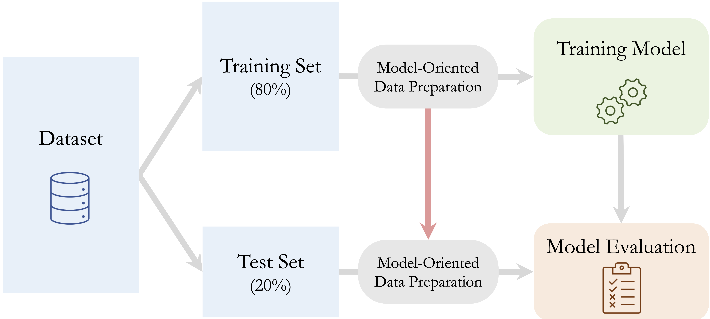
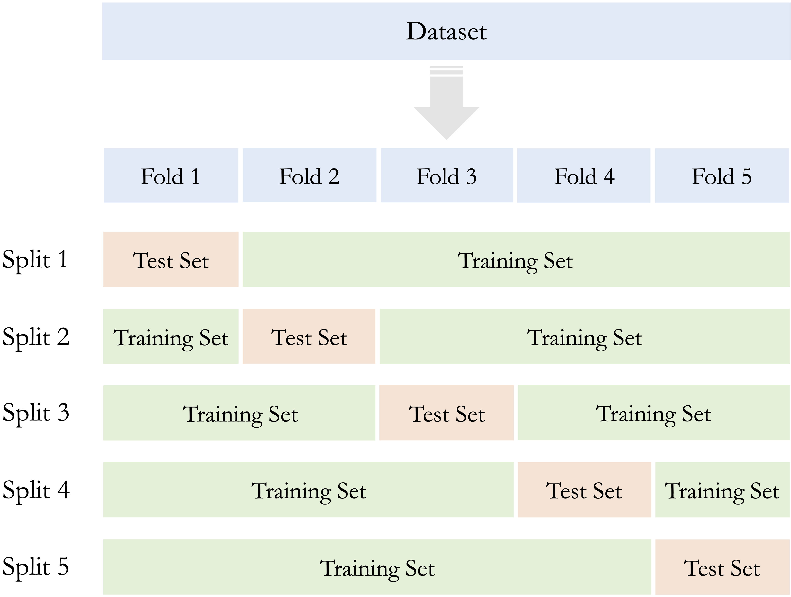
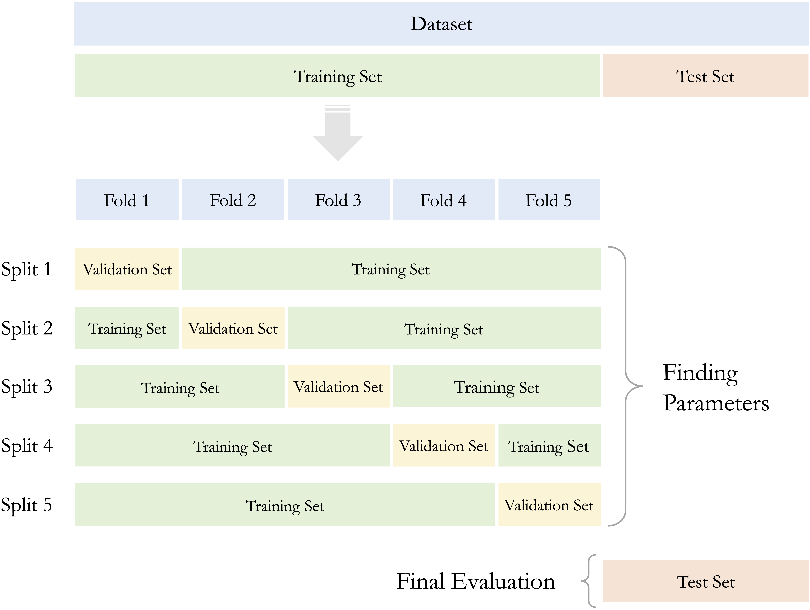

```{r echo=FALSE, message=FALSE, warning=FALSE}
source("_common.R")
```

# Data Preparation for Modeling {#sec-chapter-data-preparation}

::: {.content-visible when-format="pdf"}
\begin{chapterquote}
The facts on which our inferences are based, by which our conclusions are tested, must be accurate.

\hfill — William Minto
\end{chapterquote}
:::

::::: {.content-visible when-format="html"}
:::: chapterquote
The facts on which our inferences are based, by which our conclusions are tested, must be accurate.

::: author
— William Minto
:::
::::
:::::

A dataset may be carefully explored and well understood, yet still not be ready for predictive modeling. Implausible values may need to be corrected or recoded, missing values must be handled, categorical features may require suitable representations, and numerical features may need to be transformed or scaled. The data must also be organized so that model development remains separate from final evaluation.

This chapter focuses on the fourth stage of the Data Science Workflow shown in @fig-ds_DSW: *Data Preparation for Modeling*. The purpose of this stage is to translate what was learned during *Data Understanding and Exploration* into a coherent and reproducible preparation workflow. This involves deciding how identified data issues should be handled, how features should be represented for different modeling methods, and how the data should be structured for model development and evaluation.

These decisions can substantially affect both the fitted model and the credibility of its estimated performance. For example, imputing missing values using the full dataset, scaling numerical features before partitioning, or balancing classes before separating training from evaluation data can allow information from outside the intended training process to influence model development. Such practices create *data leakage* and may produce overly optimistic estimates of predictive performance.

A central principle of this chapter is therefore that data-dependent preparation rules must be learned within the training process. Quantities and rules used for imputation, category grouping, encoding, scaling, feature transformation, and similar operations are estimated from the training data and then applied consistently to validation or test data. During cross-validation, they must be learned separately within each set of training folds and applied to the corresponding validation fold. Procedures that alter the composition of the data, such as oversampling or undersampling, are instead restricted to the training data and are not applied to validation or test observations.

The earlier stages of the workflow provide the foundation for these decisions. In @sec-ds-problem-definition, we defined the analytical objective and considered how the results would be used. Chapter [-@sec-chapter-data-understanding] developed the *Data Understanding and Exploration* stage, where we examined feature types, distributions, data quality, unusual observations, missingness, and relationships among features. In this chapter, we use those findings to decide and implement how the data should be prepared for modeling. These principles are applied immediately in Chapter [-@sec-chapter-knn], where we begin supervised modeling with *k*-Nearest Neighbors.

### What This Chapter Covers {.unnumbered .unlisted}

We begin with data partitioning and resampling, emphasizing the distinct roles of training, validation, and test data and showing how cross-validation supports model development while preserving an independent test set. We then examine data leakage and develop the training-only principle that governs data-dependent preparation throughout the chapter.

Next, we consider how to prepare implausible and extreme values, handle missing data, represent categorical features, and transform or scale numerical features according to the requirements of the intended modeling method. We also address class imbalance and discuss approaches such as oversampling, undersampling, synthetic sampling, and class weighting, together with the restrictions required to prevent leakage.

The chapter concludes with a case study using the `adult` dataset. The case study brings together the main preparation principles in a workflow for predicting whether an individual earns more than \$50,000 per year. It illustrates how preparation decisions are learned from the training data and how the final representation may depend on the modeling method. These ideas provide the foundation for the *k*-Nearest Neighbors classifier introduced in Chapter [-@sec-chapter-knn] and for later supervised-learning methods throughout the book.

## Data Partitioning and Resampling {#sec-data-prep-cross-validation}

Reliable predictive modeling requires a clear separation between model development and final evaluation. If observations used to assess a model have already influenced data preparation, model fitting, or model selection, the resulting performance estimate may be overly optimistic. Data partitioning creates this separation by assigning different roles to subsets of the data, while resampling methods provide a structured way to compare models and tune hyperparameters using only the training data. The broader concept of *generalization*, together with underfitting, overfitting, and the relationship between model complexity and predictive performance, is developed in Section [-@sec-evaluation-generalization].

This section explains how training and test data should be defined, how the splitting strategy should reflect the structure of the prediction problem, and how cross-validation can be used within the training set while preserving the independence of the test set.

### Why and How We Partition Data {.unnumbered .unlisted}

If the same observations are used both to fit a model and to assess its performance, the resulting estimate is usually too optimistic. The model has already adapted to those observations, so strong performance on them does not necessarily indicate how well it will perform on new data.

Supervised learning therefore divides the available data into subsets with different roles. The *training set* is used to learn data-preparation rules and fit candidate models. During model development, the training data are also used, typically through resampling, to compare models, select features, and tune hyperparameters. The *test set* is reserved for final assessment and should remain outside these decisions until the preparation workflow and model have been finalized.

Throughout the supervised modeling chapters of this book, we follow a general three-step workflow:

1.  *Partition* the available data into training and test sets.
2.  *Use the training data* to learn data-preparation rules, compare and tune candidate models, and fit the selected model.
3.  *Assess* the final predictive performance once on the untouched test set.

Figure [-@fig-data-prep-modeling] illustrates this workflow.

```{r fig-data-prep-modeling, echo = FALSE, out.width = "90%", fig.cap = "Supervised learning workflow based on a train-test split. The dataset is first partitioned into training and test sets. Data preparation, model comparison, tuning, and model fitting are carried out using the training data, while the test set is reserved for final assessment on unseen observations."}

```

This separation also determines how data preparation must be carried out. Data-dependent quantities and rules, such as imputation values, category-frequency thresholds, encoding structures, scaling parameters, transformations with estimated parameters, and feature-selection decisions, must be learned from the training data without using the test observations. Once learned, the appropriate fitted rules are applied unchanged to the test data. Procedures that alter the composition of the data, such as oversampling or undersampling, are instead restricted to the training process and are not applied to the test set. These principles are developed further in Section [-@sec-data-prep-data-leakage].

The simplest and most widely used way to create this separation is the *train-test split*, also known as the *holdout method*. The choice of split ratio depends on the size and structure of the dataset. Common choices include 70--30, 80--20, and 90--10. Allocating more observations to the training set provides more information for learning preparation rules and fitting models, whereas allocating more observations to the test set can provide a more stable estimate of final predictive performance. There is no universally optimal ratio; the choice should balance these competing needs while leaving enough observations in both subsets for their intended roles.

For classification problems, random partitioning is often combined with *stratification*. A stratified split aims to preserve approximately the same outcome proportions in the training and test sets. This is especially useful when one class is uncommon, since an unstratified random split may leave too few minority-class observations in one of the subsets.

A standard random split is appropriate when observations can reasonably be treated as independent and there is no ordering or grouping structure that must be preserved. When such structure is present, however, the partition should reflect how future predictions will actually be made.

For time-ordered data, the training set should usually contain earlier observations and the test set later observations. This preserves the temporal direction of the prediction problem and avoids using future information to evaluate a model intended to predict future outcomes. For example, in the `bike_demand` case study in Chapter [-@sec-chapter-regression], earlier time points are assigned to the training set and later time points to the test set.

Other forms of dependence also require structure-aware partitioning. When a dataset contains repeated measurements from the same individual, all observations from that individual should generally remain in the same subset. Otherwise, closely related information from the same person may appear in both the training and test sets, producing an overly optimistic assessment of predictive performance. Similarly, for clustered data, such as patients within hospitals or customers within companies, entire groups may need to be assigned together. Spatial data may require partitions that account for geographical dependence and reflect the locations or regions for which future predictions are intended.

The train-test split should be created before any preparation rule is estimated from the observed data. Computing imputation values, determining rare-category thresholds, estimating scaling parameters, selecting features, or balancing classes before partitioning would allow information from the test set to influence model development.

Rules established independently of the observed sample are different. For example, if the dataset documentation states that `"?"` represents a missing value, this code can be recoded consistently in both the training and test sets. The rule follows from the meaning of the data rather than from information estimated from the observed sample. More generally, externally defined coding rules, valid-value ranges, or category orderings may be applied consistently across subsets when they are specified independently of the data used for modeling.

> *Practice:* For forecasting monthly sales, repeated hospital visits, and product reviews with an uncommon class, choose an appropriate data-splitting strategy and justify your choice.

### Checking the Train-Test Split {.unnumbered .unlisted}

After creating a train-test split, we should verify that the splitting procedure was implemented as intended and is appropriate for the prediction problem. The purpose is not to make the training and test sets as similar as possible, since some differences are expected, but to identify design or implementation problems that could compromise model development or final evaluation. Basic checks include confirming the number and proportion of observations assigned to each subset and, when stratification is used, verifying that the intended outcome proportions have been reasonably preserved.

The dependence structure of the observations should also be checked. For grouped or repeated-measurement data, the same individual or group should not appear in both the training and test sets when groups are intended to remain intact. For time-ordered data, the chronological ordering should be preserved so that future observations do not influence model development. Similar considerations may apply to spatial or other dependent data.

These checks concern the *design* of the split rather than the detailed characteristics of the test observations. The test set should not be examined for the purpose of deciding how predictors should be transformed, which categories should be combined, which observations should be treated as outliers, or which features should be selected. Such decisions belong to model development and should be based on the training data only.

A random split should also not be regenerated repeatedly simply because another seed produces subsets that appear more similar. If the prediction problem requires particular characteristics to be preserved, they should be incorporated directly into the splitting strategy through stratification, grouping, temporal ordering, or another appropriate structure-aware approach.

> *Practice:* After partitioning data with repeated measurements and an uncommon outcome class, what checks would you perform to confirm that grouping and class representation were handled appropriately?

### From a Single Validation Split to k-Fold Cross-Validation {.unnumbered .unlisted}

After reserving a test set, model development could rely on a single portion of the training data for validation. However, the results may depend strongly on which observations happen to be assigned to that validation subset. If a different split of the training data had been used, the models selected, the chosen hyperparameters, and the estimated validation performance might also have changed.

This sensitivity is particularly important when the training set is small, the outcome is imbalanced, or influential patterns are represented by only a few observations. In such cases, relying on a single validation split may provide an unstable basis for comparing models or selecting hyperparameters. Stratification and structure-aware partitioning can improve how observations are assigned, but they do not eliminate the variability associated with using only one validation subset.

Resampling methods address this problem by evaluating models across several divisions of the training data. The most widely used approach is *k*-fold cross-validation. In this procedure, the training set is divided into $k$ non-overlapping subsets of approximately equal size, called *folds*. In each iteration, the model is fitted using $k - 1$ folds and evaluated on the remaining fold, which serves as validation data. The process is repeated $k$ times so that each fold is used once for validation.

The performance values obtained from the individual folds are then averaged to provide a cross-validated basis for comparing models or tuning hyperparameters. Their variability can also be examined to assess how strongly model performance depends on the particular validation subset. Common choices are $k = 5$ and $k = 10$. Figure [-@fig-data-prep-cross-validation] illustrates the procedure for $k = 5$.

```{r fig-data-prep-cross-validation, echo = FALSE, out.width = "70%", fig.cap = "Illustration of five-fold cross-validation within the training set. In each iteration, the model is fitted using four folds and evaluated on the remaining validation fold."}

```

Cross-validation makes more efficient use of the training data than a single validation split. Each observation is used once for validation and contributes to model fitting in the remaining iterations. Because performance is evaluated across several folds, the resulting comparison is generally less dependent on one particular validation subset.

In classification problems, the folds are often stratified so that each fold contains approximately the same outcome proportions. Other data structures require different resampling strategies. Grouped cross-validation keeps related observations in the same fold, while time-series resampling preserves temporal order.

Cross-validation requires more computation because the model must be fitted repeatedly. Nevertheless, five-fold or ten-fold cross-validation is practical for many modeling tasks and is widely used for comparing candidate models and tuning hyperparameters.

### Cross-Validation Within the Training Set {.unnumbered .unlisted}

Cross-validation is part of model development and should therefore be applied within the training set rather than to the full dataset. If the test set influences model comparison, hyperparameter tuning, feature selection, or data-preparation decisions, it no longer provides an independent basis for final assessment.

A common workflow proceeds as follows:

1.  Partition the full dataset into training and test sets.
2.  Divide the training set into cross-validation folds.
3.  Use the training folds to fit candidate preparation workflows and models, and evaluate them on the corresponding validation fold.
4.  Use the cross-validation results to select the preparation workflow, model, and hyperparameters.
5.  Refit the selected workflow and model using the full training set, then evaluate the final model once on the untouched test set.

Figure [-@fig-data-prep-cross-validation-2] illustrates how cross-validation is carried out within the training set while the test set remains separate from model development.

```{r fig-data-prep-cross-validation-2, echo = FALSE, out.width = "85%", fig.cap = "Cross-validation applied within the training set while the test set remains untouched for final assessment."}

```

Data-dependent preparation is part of the model-development process and must therefore be incorporated within the cross-validation procedure rather than performed once before the folds are created. The consequences of performing such steps outside the appropriate training folds, and the resulting risk of data leakage, are discussed in Section [-@sec-data-prep-data-leakage].

After the preferred preparation workflow, model, and hyperparameters have been selected, the chosen preparation rules are estimated using the full training set and the final model is fitted. The fitted preparation rules are then applied to the test data before final assessment.

This workflow is used in Chapter [-@sec-knn-choose-k], where cross-validation is applied to select the number of neighbors in a *k*-Nearest Neighbors model. It is also used in the `adult` case study at the end of this chapter, where the test set remains outside data-dependent preparation and model-development decisions.

## Data Leakage and the Training-Only Principle {#sec-data-prep-data-leakage}

Data partitioning creates boundaries between model development and final assessment, but those boundaries can still be crossed unintentionally. This problem is known as *data leakage*: information that should remain outside the training process influences data preparation, model fitting, model selection, or evaluation. Leakage can make a model appear more accurate during development than it is likely to be on genuinely new observations.

Data leakage can arise in two broad ways. *Feature leakage* occurs when a predictor contains information that would not be available at the time a prediction is made. For example, a fraud-detection model should not use a variable indicating whether a chargeback was issued after the transaction. Similarly, a churn model should not use information recorded only after a customer has canceled the service. Such variables may be strongly associated with the outcome, but they would not be available in the intended prediction setting.

*Procedural leakage* occurs when validation or test observations influence the modeling process. This can happen when the full dataset is prepared before partitioning, when data-dependent preparation steps are estimated using observations that belong to a validation fold, or when the test set is consulted repeatedly while models or preparation choices are being refined.

Many common preparation steps can introduce procedural leakage. Missing values may be imputed using summaries calculated from the full dataset, rare-category groupings or encoding structures may be determined using all observations, and numerical features may be scaled before the train-test split is created. Leakage may also occur when features are selected using the full dataset or when classes are balanced before partitioning or before cross-validation folds are formed.

Consider a numerical predictor that is standardized using the mean and standard deviation of the full dataset. Because the test observations contribute to these quantities, information from the test set has already influenced the representation of the training data. Instead, the mean and standard deviation should be estimated from the training data and then used unchanged to transform the test data.

The same principle applies within cross-validation. In each iteration, every data-dependent preparation rule must be learned using only the training folds. Imputation values, category groupings, encoding structures, scaling parameters, transformation parameters, and feature-selection decisions are therefore estimated from the training folds and then applied to the corresponding validation fold. Estimating these rules once from the complete training set before the folds are created would allow validation observations to influence model development indirectly.

Class balancing requires a slightly different treatment because it changes the composition of the data rather than fitting a transformation that is later applied to new observations. Oversampling, undersampling, and synthetic sampling should be performed only within the training folds of each cross-validation iteration. The corresponding validation fold should retain its original class distribution. After model development is complete, balancing may similarly be applied to the full training set when fitting the final model, but it should not be applied to the test set.

The resulting *training-only principle* can therefore be summarized as follows: all data-dependent decisions are made within the training process. Fitted preparation rules, such as imputation, encoding, and scaling, are learned from the relevant training data and then applied unchanged to validation or test observations. Procedures that alter the observations themselves, such as class balancing, are restricted to the training data. The test set remains outside all preparation, tuning, feature-selection, and model-selection decisions until final assessment.

The case study at the end of this chapter applies the training-only principle across several preparation steps. A related example appears in Section [-@sec-knn-data-prepration], where scaling parameters for a *k*-Nearest Neighbors model are estimated from the training data and then applied to the test data. In larger projects, these operations can be combined within structured modeling pipelines. In R, the **mlr3pipelines** package supports such workflows and can help reduce the risk of data leakage while improving reproducibility; see @bischl2024applied.

> *Practice:* Identify two data-preparation steps that could introduce leakage if handled incorrectly. For each, explain how the training, validation, and test data should be treated.

## Preparing Implausible and Extreme Values for Modeling {#sec-data-prep-outliers}

During *Data Understanding and Exploration*, unusual observations are identified and investigated using summaries, visualizations, documentation, related features, and domain knowledge. As discussed in Section [-@sec-eda-outliers], this investigation helps determine whether an unusual value is implausible, valid but extreme, or uncertain. The task in *Data Preparation for Modeling* is different: given what has already been learned, we must decide how the observation should be represented before modeling.

The appropriate action depends on the conclusion reached during data understanding and on the intended prediction problem. Implausible values may need to be corrected, recoded as missing, or, in some cases, removed with the entire observation. Valid extreme values are usually retained, but their influence may be reduced through transformation, robust scaling, capping, or the creation of informative indicator features. These choices should be justified rather than applied automatically according to a statistical cutoff.

### Handling Implausible Values {.unnumbered .unlisted}

When reliable information is available, an erroneous value should be corrected from the original source or another authoritative record. A value should not be replaced merely because another value appears more typical.

If a value is known to be invalid but the correct value cannot be recovered, recoding it as missing is often more defensible than retaining an impossible measurement. Returning to the `diamonds` example, a recorded width of zero is physically implausible. If the correct width cannot be recovered, replacing the value with `NA` allows the remaining information in the observation to be retained while the missing value is handled using an appropriate strategy later in the preparation workflow.

Removing the entire observation may be appropriate when several important fields are corrupted, when the observation falls outside the population relevant to the prediction problem, or when the record cannot be used responsibly after investigation. Deletion should nevertheless be used cautiously because it reduces the available information and may introduce bias if problematic records occur disproportionately in particular groups.

Some validity rules are defined independently of the observed sample. For example, dataset documentation may specify that a particular code represents an unknown value, or domain knowledge may establish that a measurement cannot be negative. Such externally defined rules can be applied consistently across training, validation, and test data because they do not depend on patterns estimated from the observed sample.

### Handling Valid Extreme Values {.unnumbered .unlisted}

Valid extreme observations should generally be retained unless there is a clear reason why they fall outside the intended prediction population. However, some modeling methods are sensitive to extreme predictor values. Distance-based methods such as *k*-Nearest Neighbors can be strongly affected by unusually large numerical values, while methods based on squared loss may give substantial influence to observations associated with large residuals.

When extreme values are valid but their magnitude may unduly influence model fitting, several preparation strategies can be considered. A transformation such as $\log(1+x)$ can reduce the influence of large positive values while preserving the ordering of observations. This can be useful for features such as `capital_gain` and `capital_loss`, which contain many zeros together with relatively large positive values. Robust scaling based on the median and interquartile range may also reduce sensitivity to extreme observations when the interquartile range is nonzero.

Another option is *winsorization*, in which values below or above specified limits are replaced by the corresponding boundary values. Capping can reduce the influence of extreme observations, but it also changes their recorded magnitudes and should therefore be used only when the purpose and thresholds can be justified.

In some applications, the occurrence of an extreme value may itself contain useful predictive information. An indicator feature can then be created to identify observations beyond a meaningful threshold, while the original feature is retained, transformed, or capped according to the modeling objective. Similarly, for features with many zeros and a smaller number of positive values, an indicator distinguishing zero from nonzero values may capture information that is not represented by magnitude alone.

Any thresholds or parameters estimated from the observed data, such as percentile-based capping limits or robust scaling quantities, must be learned within the training process in accordance with the training-only principle in Section [-@sec-data-prep-data-leakage]. Rules specified independently of the observed data can instead be applied consistently across subsets.

All preparation decisions should be documented, including the treatment selected, the justification for that treatment, and how any data-dependent thresholds or parameters were determined. When implausible values are recoded as missing, they become part of the missing-data problem considered in the next section.

> *Practice:* For an implausible age, valid extreme incomes, and legitimate large transaction amounts, propose an appropriate preparation strategy and identify which decisions can be predefined and which must be learned from the training data.

## Handling Missing Values for Modeling {#sec-data-prep-missing-values}

Missing values may reflect how data were collected, which measurements were unavailable, or which information was not recorded under particular conditions. They may also be introduced during data preparation when implausible measurements are recoded as `NA`, as discussed in the previous section.

The appropriate treatment depends on what the missing values represent, how frequently they occur, whether their occurrence may itself carry information, and the requirements of the intended modeling method. The goal is not simply to eliminate `NA` values, but to represent missing information in a way that supports reliable and reproducible modeling.

### Understanding Missing Values and Missingness Mechanisms {.unnumbered .unlisted}

In R, missing values are usually represented by `NA`. In practice, however, missingness may appear through nonstandard placeholder codes such as `-1`, `999`, `"unknown"`, `"missing"`, or `"?"`. These codes should be interpreted using feature definitions, documentation, and knowledge of the data-collection process before being recoded.

A placeholder should not automatically be treated as missing because the same code can have different meanings in different datasets. In the `bank` dataset, for example, a value of `-1` for `pday` indicates that the client was not previously contacted. This is a meaningful condition rather than an unknown value. By contrast, the `"?"` values in the `adult` dataset represent missing information and should be recoded as `NA`.

Some missing values are *structural*: the information is absent because the feature does not apply to the observation. For example, the number of years at a current job may not apply to a person who is unemployed. Such cases may be better represented by a separate category or indicator than treated as ordinary missing values.

Missingness in the outcome requires different treatment from missingness in predictors. In supervised learning, observations without a known outcome cannot generally be used to fit or evaluate the model because the correct response is unavailable. They may still represent new observations for which predictions are required, but they are normally excluded from the labeled data used during model development.

Rules based on externally defined meanings can be applied consistently across subsets. If dataset documentation specifies that `"?"` represents missing information, for example, it can be recoded as `NA` in training, validation, and test data because the rule is based on feature meaning rather than patterns estimated from the observed sample.

After genuine missing values have been identified, it is useful to consider why they may be missing. Three commonly discussed mechanisms are *missing completely at random* (MCAR), *missing at random* (MAR), and *missing not at random* (MNAR).

Under MCAR, the probability that a value is missing does not depend on observed or unobserved information. Under MAR, missingness may depend on observed features but, after accounting for them, does not depend further on the missing value itself. Under MNAR, the probability of missingness depends on the unobserved value or on other unobserved information. For example, income nonresponse may be related to age under MAR, whereas individuals with particularly high unreported incomes being less willing to disclose them would be consistent with MNAR.

The true missingness mechanism usually cannot be established from the observed data alone. These concepts are therefore best viewed as assumptions that help guide the choice and interpretation of missing-value methods rather than as mechanisms that can simply be diagnosed from the dataset.

### Simple Imputation Methods {.unnumbered .unlisted}

One possible response to missing predictor values is to remove incomplete observations. This *complete-case* approach may be reasonable when missingness is rare and the remaining observations still provide an adequate basis for the prediction problem. However, deletion reduces the amount of training data and may introduce bias when missingness is related to particular features, outcomes, or groups.

Imputation instead retains observations by replacing missing entries with plausible values derived from the observed data. Simple imputation methods use a single summary of the available values. They are easy to implement and interpret, but they should not be regarded as recovering the unknown true values.

For numerical features, mean and median imputation are common choices. Mean imputation may be reasonable for approximately symmetric distributions, whereas median imputation is less sensitive to skewness and extreme values and may therefore be preferable for asymmetric distributions. These distributional characteristics are examined during Data Understanding and Exploration; see Figure [-@fig-eda-skew-type]. For categorical features, mode imputation replaces missing values with the most frequently observed category.

In some situations, missingness may be represented explicitly rather than replaced by an existing category. A category such as `"unknown"` may be useful when the absence of information is itself meaningful or when no existing category provides a defensible replacement. Similarly, a missingness indicator can be added to distinguish originally observed values from imputed values when the occurrence of missingness may carry predictive information.

Simple imputation has important limitations. Replacing every missing numerical value with the same mean or median reduces variability, while mode imputation may overrepresent the most frequent category. These methods may also weaken relationships between the imputed feature and other predictors. Their simplicity can nevertheless make them useful baseline approaches, particularly when missingness is limited and the imputation procedure is incorporated correctly into the training process.

### Random Sampling and Model-Based Imputation {.unnumbered .unlisted}

Random sampling imputation replaces each missing entry with a value drawn from the observed values of the same feature. Unlike mean, median, or mode imputation, it does not repeatedly insert a single replacement and can therefore preserve more of the observed marginal variability.

The method nevertheless ignores relationships with other features. A randomly imputed income value, for example, does not account for the observation's age, occupation, education, or working hours. It also introduces randomness, so the procedure should be made reproducible when required.

Model-based imputation uses information from other observed features to estimate missing values. Examples include regression-based imputation, tree-based imputation, and *k*-nearest-neighbor imputation. Such methods can produce replacements that are more consistent with the other characteristics of an observation when useful predictive relationships are present. They also require additional modeling choices and computational effort, and greater complexity does not automatically lead to better predictive performance.

An important extension is *multiple imputation*, which creates several completed datasets to represent uncertainty about the missing values and combines the results obtained from them. Multiple imputation is particularly relevant when valid statistical inference, rather than prediction alone, is the primary objective; statistical inference is developed in Chapter [-@sec-chapter-statistics].

All data-dependent imputation methods must follow the training-only principle introduced in Section [-@sec-data-prep-data-leakage]. Imputation values, sampling distributions, or fitted imputation models are estimated within the training process and then used to handle missing predictor values in validation or test data. During cross-validation, the corresponding imputation procedure is fitted within each set of training folds.

Imputation models should also rely only on information that will be available when future predictions are made. In particular, an outcome that will be unknown at prediction time should not be used to impute predictor values, because the resulting preparation could not be reproduced for new observations.

The `adult` case study at the end of this chapter demonstrates how nonstandard missing-value codes are recoded and how missing predictor values are handled within the training process before modeling.

> *Practice:* For missing age values, an `"unknown"` employment category, and missing outcomes, propose an appropriate treatment and explain which decisions can be predefined and which must be learned from the training data.

## Preparing Categorical Features {#sec-data-prep-encoding}

Categorical features represent membership in a finite set of categories rather than measurements on a continuous numerical scale. In R, they may be stored as character vectors or factors. Some modeling methods can work directly with factors, while others require categorical features to be converted into numerical representations before model fitting.

The appropriate representation depends on whether the categories are ordinal or nominal and on how the intended model interprets numerical inputs. Ordinal categories have a meaningful order, whereas nominal categories do not. Encoding decisions should preserve this distinction rather than introduce relationships that are not supported by the meaning of the feature.

As with other data-dependent preparation steps, the representation should be defined using the training data and then applied consistently to validation and test data. This includes determining the available categories, grouping rare levels, selecting reference categories, and creating indicator columns.

### Encoding Ordinal Features {.unnumbered .unlisted}

An ordinal feature contains categories with a meaningful ranking, such as `low`, `medium`, and `high`. Ordinal encoding assigns numerical values that preserve this order. A simple encoding might assign the values 1, 2, and 3 to these categories.

Although this representation preserves ranking, it may introduce an additional assumption. Models that perform arithmetic operations on the encoded values may treat the difference between 1 and 2 as equivalent to the difference between 2 and 3. The ordering of the categories may be meaningful even when the distances between adjacent categories are not.

Ordinal encoding is therefore most appropriate when the imposed numerical spacing is reasonable for the modeling task. If only the order is known and equal spacing would be difficult to justify, the feature may instead be represented using indicator variables. This discards the ordering information but avoids imposing an unsupported numerical scale.

In some applications, representative numerical values may be assigned to ordered categories. For example, income ranges could be represented using approximate midpoints. This introduces a stronger assumption because the encoded values are intended to reflect approximate magnitude rather than rank alone. Such values should be based on meaningful external information and should not be interpreted as direct measurements of the original feature.

Categories that do not belong naturally on the ordinal scale require separate treatment. An `"unknown"` category, for example, cannot usually be placed meaningfully below, above, or between known ordered categories. It may instead be treated as missing, represented by a separate indicator, or retained as a distinct category, depending on what `"unknown"` means in the dataset.

The ordering of an ordinal feature should preferably be established from domain knowledge, documentation, or the definition of the feature. Because such an ordering is defined independently of the observed sample, it can be applied consistently across training, validation, and test data.

### Encoding Nominal Features {.unnumbered .unlisted}

Nominal features contain categories with no intrinsic order, such as marital status, occupation, or country of residence. Assigning arbitrary numbers such as 1, 2, and 3 to these categories would create an artificial ranking and may cause a model to treat some categories as closer to one another than others.

A common solution is *one-hot encoding*. This method creates a binary indicator for each category. For example, a feature with the categories `married`, `single`, and `divorced` can be represented by three binary features indicating whether each category is present.

For a feature with $m$ categories, full one-hot encoding creates $m$ indicator columns. In linear and logistic regression, one category is commonly selected as the reference category and represented by omitting its indicator, resulting in $m-1$ columns. This avoids exact redundancy among the predictors. Other models may use the full set of indicators.

Binary categorical features can be represented by a single indicator taking the values 0 and 1. The choice of which category is represented by 1 does not generally change the predictive information, but it affects the interpretation of coefficients in models such as linear or logistic regression and should therefore be documented.

The encoding structure must be defined from the training data. If a category that was present during training is absent from a validation or test subset, its indicator column must still be retained and filled with zeros for that subset. Otherwise, the model would receive different feature structures during training and evaluation.

A different problem occurs when validation, test, or future data contain a category that did not appear in the training data. Creating a new indicator column at prediction time would change the input structure expected by the fitted model. Previously unseen categories should therefore be handled through a predefined strategy, such as assigning them to an `"other"` or `"novel"` category.

One-hot encoding can substantially increase the number of predictors when a feature has many categories. High-cardinality features, such as product identifiers, occupations, or geographical codes, may generate a large and sparse set of indicator columns. Rare categories may therefore be combined into an `"other"` category before encoding, provided that the grouping rule is meaningful and does not remove categories important to the prediction problem.

Any rule based on observed category frequencies must follow the training-only principle introduced in Section [-@sec-data-prep-data-leakage]. For example, a threshold used to identify rare categories must be estimated from the training data. During cross-validation, rare-category grouping and encoding must be learned within the training folds and then applied to the corresponding validation fold.

The appropriate representation ultimately depends on both the categorical feature and the intended model. The `adult` case study at the end of this chapter demonstrates how categorical features are inspected, grouped where necessary, and encoded consistently within the training process.

> *Practice:* For an ordered satisfaction feature with an `"unknown"` category and an occupation feature with many rare categories, propose suitable encoding strategies and explain how unknown, rare, and unseen categories should be handled.

## Preparing Numerical Features {#sec-data-prep-feature-scaling}

Numerical features may be measured in very different units and ranges. Age may be recorded in years, income in monetary units, and a proportion on a scale from 0 to 1. For some modeling methods, these differences affect how strongly each feature influences model fitting. Feature scaling transforms numerical predictors so that their magnitudes are more comparable without changing the ordering of their values.

The importance of scaling depends on the intended model. It is essential for distance-based methods such as *k*-Nearest Neighbors because features with larger numerical ranges can dominate the calculated distances. Scaling is also commonly used for neural networks and regularized linear or logistic regression, where differences in predictor scale can affect optimization or the influence of the penalty. By contrast, decision trees and random forests are generally insensitive to predictor scale because their splits depend on the ordering of feature values rather than their numerical units.

Scaling should therefore be treated as a model-dependent preparation choice rather than as an automatic cleaning step. Binary indicator features created through one-hot encoding are often retained as 0 and 1, while continuous numerical predictors are scaled when required by the model.

Two widely used approaches are min-max scaling and z-score scaling. Min-max scaling maps a feature to a specified interval, commonly $[0,1]$, whereas z-score scaling centers a feature around zero and expresses its values in standard deviation units.

### Min-Max Scaling {.unnumbered .unlisted}

Min-max scaling transforms a numerical feature according to $$
x_{\mathrm{scaled}} = \frac{x-x_{\min}}{x_{\max}-x_{\min}},
$$ where $x_{\min}$ and $x_{\max}$ are the minimum and maximum values used to define the transformation. Values in the data used to estimate these parameters are mapped to the interval $[0,1]$, with the minimum becoming 0 and the maximum becoming 1. The plots below illustrate the effect of this transformation for the feature `age` in the `churn` dataset.

```{r}
#| echo: false
#| layout-ncol: 2
#| fig-width: 4
#| fig-height: 4

library(liver)
library(ggplot2)

data(churn)

ggplot(data = churn) +
  geom_histogram(aes(x = age), bins = 15) +
  ggtitle("Before Min-Max Scaling")

ggplot(data = churn) +
  geom_histogram(aes(x = minmax(age)), bins = 15) +
  ggtitle("After Min-Max Scaling")
```

The plots show that min-max scaling changes the range of the feature to $[0,1]$ while preserving its ordering and overall distributional shape. This can be useful for models that are sensitive to numerical magnitude, particularly distance-based methods and some optimization-based methods.

Min-max scaling is sensitive to extreme values because the minimum and maximum determine the entire transformation. If one value is unusually large, most other observations may be compressed into a narrow part of the interval. For this reason, implausible and extreme values should be investigated before the scaling rule is estimated.

In predictive modeling, the minimum and maximum must be learned from the training data. The same fitted values are then used to transform validation and test data. A value in the test set may therefore be transformed to a number below 0 or above 1 if it falls outside the range observed in the training data. Such a result does not indicate that the transformation was applied incorrectly; it reflects a difference between the training and test ranges.

Min-max scaling cannot be applied when the training feature has the same value for every observation because the denominator is then zero. A constant feature contains no variation and should generally be removed from the modeling data.

### Z-Score Scaling {.unnumbered .unlisted}

Z-score scaling, also called *standardization*, transforms a numerical feature according to $$
x_{\mathrm{scaled}} = \frac{x-\mu}{\sigma},
$$

where $\mu$ and $\sigma$ are the mean and standard deviation used to define the transformation. The scaled training feature has a mean of approximately zero and a standard deviation of one. The plots below illustrate the effect of this transformation for the feature `age` in the `churn` dataset.

```{r}
#| echo: false
#| layout-ncol: 2
#| fig-width: 4
#| fig-height: 4

library(liver)
library(ggplot2)

data(churn)

ggplot(data = churn) +
  geom_histogram(aes(x = age), bins = 15) +
  ggtitle("Before Z-Score Scaling")

ggplot(data = churn) +
  geom_histogram(aes(x = zscore(age)), bins = 15) +
  ggtitle("After Z-Score Scaling")
```

The plots show that z-score scaling changes the location and scale of the feature while preserving its ordering and overall distributional shape. Unlike min-max scaling, it does not place the values within a fixed interval. Instead, each observation is expressed in standard deviation units relative to the mean: positive values lie above the mean, while negative values lie below it.

Standardization does not make a distribution normal. A feature that is strongly skewed before scaling remains skewed afterward. If skewness or extreme values are problematic for the intended model, a transformation such as $\log(1+x)$ or a more robust scaling strategy may be considered before or instead of ordinary standardization.

Because the mean and standard deviation are sensitive to extreme observations, z-score scaling can also be affected by outliers. Robust scaling based on the median and interquartile range may be preferable when valid extreme values are present. However, robust scaling is not suitable when the interquartile range is zero.

In predictive modeling, the mean and standard deviation must be estimated within the training process and then applied unchanged to validation or test data, following the training-only principle in Section [-@sec-data-prep-data-leakage]. A feature with zero standard deviation in the training data cannot be standardized and should be reviewed or removed.

The choice between min-max and z-score scaling depends on the modeling method and the desired representation. Min-max scaling is useful when a bounded scale is preferred, while z-score scaling is often appropriate when features should be centered and measured relative to their variability. The selected scaling method should be treated as part of the modeling workflow and evaluated together with the model rather than chosen independently of it.

These distinctions become immediately important in Chapter [-@sec-chapter-knn]. Because *k*-Nearest Neighbors constructs predictions from distances between observations, numerical predictors measured on different scales can contribute very differently to those distances unless appropriate scaling is applied. Section [-@sec-knn-data-prepration] shows how scaling is incorporated into the *k*-Nearest Neighbors modeling workflow.

## Dealing with Class Imbalance {#sec-data-prep-balancing}

Consider a fraud-detection model that labels every transaction as legitimate. Because fraudulent transactions are rare, such a model might achieve high overall accuracy while failing to detect any fraud. This illustrates the challenge of class imbalance, which occurs when one outcome class is represented much less frequently than another.

Class imbalance can become problematic when the minority class is represented by too few observations for the model to learn its patterns effectively or when errors involving that class have particularly important consequences. This situation is common in applications such as fraud detection, customer churn, and medical diagnosis.

Class imbalance is therefore both a modeling and an evaluation concern. Overall accuracy may provide a misleading impression of model performance when the classes are highly uneven. Measures such as precision and recall can provide more informative views of performance for the minority class, depending on the prediction objective and the relative consequences of different errors. These and related evaluation measures are developed in Chapter [-@sec-chapter-evaluation].

Class proportions alone do not determine whether intervention is necessary. The decision should also consider the number of available minority-class observations, the degree of overlap between classes, the behavior of the fitted model, and the practical consequences of different prediction errors. A small minority proportion may still provide sufficient information in a very large dataset, whereas a less severe imbalance may be difficult to handle when the sample is small.

Several strategies can be considered when class imbalance interferes with model development. *Oversampling* increases the representation of the minority class by duplicating existing observations or generating synthetic cases. *SMOTE* (Synthetic Minority Over-sampling Technique), for example, generates synthetic minority observations by interpolating between neighboring minority cases. Because this interpolation takes place in predictor space, SMOTE should be used carefully when the data contain categorical features or numerical representations for which interpolation is not meaningful.

*Undersampling* reduces the number of majority-class observations and may be useful when the majority class is very large. *Hybrid approaches* combine oversampling and undersampling. Another option is *class weighting*, in which errors involving the minority class receive greater importance during model fitting. Unlike resampling methods, class weighting does not change the observations or the class distribution; instead, it changes how strongly different errors contribute to the model-fitting objective.

Each strategy involves trade-offs. Simple oversampling may provide the model with greater exposure to minority-class observations, but repeatedly duplicating the same cases can increase the risk of overfitting. Undersampling may reduce computational demands but discards information from the majority class. Synthetic sampling introduces assumptions about which combinations of predictor values represent plausible observations. Class weighting avoids modifying the dataset, but its usefulness depends on whether the modeling method supports weights and how it responds to them.

To illustrate these ideas, consider the `creditcard_fraud` dataset from the **liver** package. The original source data are extremely imbalanced, with fraudulent transactions representing less than 0.2% of all observations. For teaching purposes, the package provides a smaller dataset that retains the fraud cases together with a sample of legitimate transactions. The minority class remains uncommon, but the reduced dataset is more manageable for illustrating class-imbalance strategies.

We first partition the data into training and test sets using the `partition()` function from the **liver** package:

```{r}
library(liver)
data(creditcard_fraud)

set.seed(42)

fraud_splits = partition(data = creditcard_fraud, ratio = c(0.7, 0.3))

train_fraud = fraud_splits$part1
test_fraud  = fraud_splits$part2
```

Because the minority class is uncommon, we examine its representation in both subsets after partitioning:

```{r}
prop.table(table(creditcard_fraud$Class))
prop.table(table(train_fraud$Class))
prop.table(table(test_fraud$Class))
```

The fraud class (`Class = 1`) remains uncommon in both the training and test sets. With an imbalanced outcome, it is important to verify that a random split has not left too few minority-class observations in either subset. When preserving class proportions is particularly important, stratified partitioning may be preferable, as discussed earlier in this chapter.

The observed class proportion does not by itself establish that rebalancing is necessary. Rather, it indicates that the minority class may require particular attention during model development and evaluation. Whether a balancing strategy is useful should ultimately be considered together with the intended model and appropriate performance measures.

One possible preparation strategy is to oversample the minority class within the training data. The following code uses the `ovun.sample()` function from the **ROSE** package:

```{r}
library(ROSE)

set.seed(42)

balanced_train_fraud = ovun.sample(Class ~ ., data = train_fraud, method = "over", p = 0.15)$data

table(balanced_train_fraud$Class)
prop.table(table(balanced_train_fraud$Class))
```

Here, the fraud class is oversampled so that it represents approximately 15% of the resulting training data. This value is used only to illustrate the effect of oversampling and should not be interpreted as a generally recommended target proportion. The appropriate degree of rebalancing should be considered together with the intended model and the evaluation criteria used during model development.

Resampling methods that alter class composition must remain within the training process. During cross-validation, oversampling, undersampling, or synthetic sampling is performed separately within each training fold, while the corresponding validation fold retains its original class distribution. After the final modeling strategy has been selected, any chosen balancing procedure may be applied to the full training set when fitting the final model, but the test set remains unchanged. This follows the training-only principle developed in Section [-@sec-data-prep-data-leakage].

Class weighting follows the same separation between model development and final evaluation, although it does not alter the observations themselves. Candidate weighting or resampling strategies can be compared during cross-validation, while the final test set is reserved for assessment after the modeling strategy has been selected.

Class imbalance should therefore not be addressed mechanically on the basis of class proportions alone. The appropriate strategy depends on the amount of available data, the modeling method, and the practical consequences of prediction errors. Regardless of the strategy chosen, modifications to class representation or weighting belong within the training process, while validation and test data should retain the class distributions relevant to the intended prediction setting.

> *Practice:* Compare retaining the original class distribution, oversampling the minority class, and using class weights for the fraud data. Explain how each affects training and why validation and test data should keep their original class distributions.

## Case Study: Preparing Data to Predict High Earners {#sec-data-prep-case-adult}

We now bring together the main data-preparation principles introduced throughout this chapter using the `adult` dataset from the **liver** package. We develop a preparation workflow for predicting whether an individual earns more than \$50,000 per year. The workflow begins with steps that are broadly applicable across modeling methods, including partitioning the data, applying externally defined recoding rules, handling missing information and simplifying selected categorical features.

These steps establish a common prepared basis for modeling, but they do not imply that every algorithm should receive the data in exactly the same form. The final representation depends partly on how the intended model uses the predictors. Distance-based methods such as *k*-Nearest Neighbors require numerical representations of categorical predictors and appropriate scaling of numerical features, whereas tree-based methods can generally work directly with factor predictors and do not require numerical scaling.

Throughout the case study, data-dependent preparation decisions are made within the training process so that the test data do not influence model development. Our aim is not yet to fit a predictive model, but to show how a reproducible preparation workflow can support different modeling methods. The model-specific preparation required for *k*-Nearest Neighbors provides a direct bridge to Chapter [-@sec-chapter-knn], while the same common preparation principles can also support the tree-based models developed later in Chapter [-@sec-chapter-trees].

### Problem Definition and Dataset Overview {.unnumbered .unlisted}

The prediction task is to determine whether an individual earns more than \$50,000 per year using demographic, educational, occupational, and financial characteristics. Our purpose in this case study is not yet to fit a classifier, but to construct a common prepared basis from which appropriate model-specific representations can later be created. This distinction is important because some preparation decisions apply broadly across modeling methods, whereas others depend on how a particular algorithm uses the predictors.

The `adult` dataset was originally derived from data collected by the US Census Bureau. It contains information on individuals, including age, education, marital status, occupation, working hours, capital gains and losses, country of origin, and income category.

We begin by loading the dataset from the **liver** package:

```{r}
library(liver)

data(adult)
```

We review its structure and variable summaries using `str()` and `summary()`:

```{r}
str(adult)

summary(adult)
```

The dataset contains `r nrow(adult)` observations and `r ncol(adult)` variables. The target feature, `income`, indicates whether an individual earns more than \$50,000 per year (`>50K`) or not (`<=50K`). The numerical features include `age`, `demogweight`, `education_num`, `capital_gain`, `capital_loss`, and `hours_per_week`, while the categorical features include `workclass`, `education`, `marital_status`, `occupation`, `relationship`, `race`, `gender`, and `native_country`.

Two features require particular consideration before the predictor set is finalized. The variable `demogweight` is a sampling weight derived from the original census data rather than a direct characteristic of the individual. In addition, `education` and `education_num` provide closely related representations of educational attainment. These features are retained for now and will be reconsidered when the common and model-specific preparation decisions are defined later in the case study.

We also examine the distribution of the target feature:

```{r}
prop.table(table(adult$income))
```

The two income categories are not equally represented, with `<=50K` forming the majority class. This imbalance does not by itself imply that a balancing method is required. Whether class-imbalance methods are useful depends on the modeling strategy and the evaluation criteria considered during model development. After partitioning the data, we will verify that both outcome classes remain sufficiently represented in the resulting subsets.

The dataset also includes demographic features such as `race`, `gender`, and `native_country`. In applied prediction settings, the use of such features requires careful ethical, legal, and contextual consideration because predictive models may reproduce or amplify disparities present in the data or in the processes that generated them. Simply including or excluding particular demographic features does not by itself ensure fair predictions. These features are retained here for instructional purposes and to illustrate data-preparation decisions; a comprehensive treatment of fairness in machine learning is beyond the scope of this book.

The earlier Data Understanding stage identifies several issues that now require preparation decisions: some categorical features use nonstandard codes for missing information, some contain many or sparsely represented categories, `education` and `education_num` provide overlapping representations, and `capital_gain` and `capital_loss` contain many zeros together with relatively large positive values. The following subsections determine how these findings should be handled before model-specific preparation is applied.

> *Practice:* Using `str(adult)` and `summary(adult)`, identify the numerical and categorical features, and distinguish between preparation steps that are common across models and those that depend on the modeling method.

### Partitioning the Data for Model Development {.unnumbered .unlisted}

Before carrying out any data-dependent preparation, we partition the `adult` dataset into training and test sets. The training set will be used to learn preparation rules and support model development, while the test set will remain outside these decisions until final evaluation.

We use the `partition()` function from the **liver** package to assign 80% of the observations to the training set and the remaining 20% to the test set:

```{r}
set.seed(42)

splits = partition(data = adult, ratio = c(0.8, 0.2))

adult_train = splits$part1
adult_test  = splits$part2
```

The `set.seed()` function makes the random partition reproducible. The two subsets now have distinct roles: `adult_train` is used for preparation and model development, whereas `adult_test` is reserved for final assessment and should not be used to choose preparation methods, features, models, or hyperparameters.

Because `income` is the target feature, we verify that both outcome classes remain adequately represented in the training and test sets:

```{r}
prop.table(table(adult_train$income))

prop.table(table(adult_test$income))
```

The training and test sets retain similar income proportions, with small differences expected from a random partition. The purpose of this check is not to make the subsets identical, but to confirm that both outcome classes remain adequately represented for their intended roles.

To preserve the original partitioned data, we create working copies for the preparation steps that follow:

```{r}
adult_train_prepared = adult_train
adult_test_prepared  = adult_test
```

From this point onward, externally defined rules, such as interpreting `"?"` as a missing-value code, may be applied consistently to both subsets. Data-dependent preparation rules are learned from `adult_train_prepared` and then applied appropriately to `adult_test_prepared`, following the training-only principle developed earlier in this chapter. These steps will form the common prepared basis from which model-specific representations are created later in the case study.

### Preparing Implausible and Extreme Values {.unnumbered .unlisted}

The earlier Data Understanding stage identified `capital_gain` and `capital_loss` as numerical features with distinctive distributions: both contain many zeros together with a smaller number of relatively large positive values. At this stage, the question is no longer whether these values are unusual, but how they should be represented for modeling.

We first review the relevant numerical features in the training data:

```{r}
numerical_features = c("age", "education_num", "capital_gain", "capital_loss", "hours_per_week")

summary(adult_train_prepared[numerical_features])
```

The ranges of `age`, `education_num`, and `hours_per_week` do not indicate values that require corrective action. For `capital_gain` and `capital_loss`, zero is a meaningful value indicating that no capital gain or loss was reported and should therefore not be treated as missing.

The larger positive values in these features are unusual but plausible and may contain useful information for predicting income. We therefore retain the original values in the common prepared data rather than removing observations or capping the values solely because they are extreme.

Whether these predictors should subsequently be transformed or scaled depends on the modeling method. For example, a transformation may be considered when large values have excessive influence on a distance-based method, whereas tree-based models generally do not require such transformations for scale-related reasons. We therefore postpone any model-specific numerical transformation until the final preparation stage of the case study.

No changes to the numerical features are made at this point. We next turn to the nonstandard missing-value codes identified in the categorical features.

### Making Missingness Explicit and Handling Missing Values {.unnumbered .unlisted}

The earlier data-understanding stage identified `"?"` as a nonstandard code for missing information in `workclass`, `occupation`, and `native_country`. Because this meaning is defined by the dataset documentation rather than inferred from the observed sample, we can recode `"?"` as `NA` consistently in both the training and test sets:

```{r}
adult_train_prepared[adult_train_prepared == "?"] = NA
adult_test_prepared[adult_test_prepared == "?"] = NA
```

These missing values occur only in categorical features. Rather than removing incomplete observations, we retain them and use random sampling imputation. For each feature, a missing value is replaced by a category sampled from the observed training values of that feature. This simple approach preserves the marginal category distribution more closely than repeatedly inserting the mode, although it does not use relationships with other predictors.

We first store the observed training values that will serve as the sampling pools:

```{r}
workclass_pool = adult_train_prepared$workclass[
  !is.na(adult_train_prepared$workclass)]

occupation_pool = adult_train_prepared$occupation[
  !is.na(adult_train_prepared$occupation)]

country_pool = adult_train_prepared$native_country[
  !is.na(adult_train_prepared$native_country)]
```

We then impute the missing values in the training data. Because random sampling is involved, we set a seed to make the procedure reproducible:

```{r}
library(Hmisc)

set.seed(42)

adult_train_prepared$workclass = impute(adult_train_prepared$workclass, fun = "random")

adult_train_prepared$occupation = impute(adult_train_prepared$occupation, fun = "random")

adult_train_prepared$native_country = impute(adult_train_prepared$native_country, fun = "random")
```

The test data must not determine their own replacement distributions. Missing test values are therefore imputed using the sampling pools obtained from the training data:

```{r}
adult_test_prepared$workclass = impute(adult_test_prepared$workclass, fun = sample(workclass_pool, sum(is.na(adult_test_prepared$workclass)), replace = TRUE))

adult_test_prepared$occupation = impute(adult_test_prepared$occupation, fun = sample(occupation_pool, sum(is.na(adult_test_prepared$occupation)), replace = TRUE))

adult_test_prepared$native_country = impute(adult_test_prepared$native_country, fun = sample(country_pool, sum(is.na(adult_test_prepared$native_country)), replace = TRUE))
```

After imputation, we remove unused factor levels, including the former `"?"` level:

```{r}
adult_train_prepared = droplevels(adult_train_prepared)
adult_test_prepared  = droplevels(adult_test_prepared)
```

We then verify that the missing values have been addressed:

```{r}
find.na(adult_train_prepared)
find.na(adult_test_prepared)
```

At this stage, the nonstandard missing-value codes have been made explicit and the missing categorical values have been handled using information from the training data. During cross-validation, the same imputation procedure must be fitted within the corresponding training folds, following the training-only principle in Section [-@sec-data-prep-data-leakage].

These steps form part of the common preparation layer and do not depend on whether the final model is based on distances, trees, or another supervised-learning method. We next consider how the categorical predictors should be simplified and represented.

### Preparing Categorical Features {.unnumbered .unlisted}

The earlier data-understanding stage identified several categorical features that require preparation before modeling. In particular, `native_country` contains many categories, `workclass` includes a small number of closely related categories, and `education` and `education_num` provide overlapping representations of educational attainment. At this stage, missing categorical values have been handled and selected categorical features have been simplified. These steps form part of the common preparation layer. The categorical predictors have not yet been converted to their final model inputs; that decision is postponed to the model-specific preparation stage.

The `native_country` feature contains many individual country labels. To reduce this complexity, we group countries into broader geographic regions using a predefined classification. Because this mapping is specified independently of the observed sample, the same rule can be applied consistently to the training and test sets.

```{r message = FALSE}
library(forcats)

Europe = c("France", "Germany", "Greece", "Hungary", "Ireland", "Italy", "Netherlands", "Poland", "Portugal", "United-Kingdom", "Yugoslavia")

North_America = c("United-States", "Canada", "Outlying-US(Guam-USVI-etc)")

Latin_America = c("Mexico", "El-Salvador", "Guatemala", "Honduras", "Nicaragua", "Cuba", "Dominican-Republic", "Puerto-Rico", "Colombia", "Ecuador", "Peru")

Caribbean = c("Jamaica", "Haiti", "Trinidad&Tobago")

Asia = c("Cambodia", "China", "Hong-Kong", "India", "Iran", "Japan", "Laos", "Philippines", "South", "Taiwan", "Thailand", "Vietnam")
```

We apply this mapping to both subsets:

```{r}
adult_train_prepared$native_country = fct_collapse(
  adult_train_prepared$native_country,
  "Europe" = Europe,
  "North America" = North_America,
  "Latin America" = Latin_America,
  "Caribbean" = Caribbean,
  "Asia" = Asia,
  other_level = "Other")

adult_test_prepared$native_country = fct_collapse(
  adult_test_prepared$native_country,
  "Europe" = Europe,
  "North America" = North_America,
  "Latin America" = Latin_America,
  "Caribbean" = Caribbean,
  "Asia" = Asia,
  other_level = "Other")
```

The `"Other"` category provides a predefined destination for country labels that are not included in the named regional groups. This also provides a consistent way to handle additional country labels that may appear in future data.

The `workclass` feature contains the categories `"Never-worked"` and `"Without-pay"`, whose meanings support combining them into a broader category representing individuals who are not in paid employment. Because this grouping is based on category meaning rather than a threshold estimated from the observed frequencies, the same rule is applied to both subsets:

```{r}
adult_train_prepared$workclass = fct_collapse(adult_train_prepared$workclass,
  "Not in paid employment" = c("Never-worked", "Without-pay"))

adult_test_prepared$workclass = fct_collapse(adult_test_prepared$workclass,
  "Not in paid employment" = c("Never-worked", "Without-pay"))
```

Finally, categorical preparation must anticipate categories that may not have been observed during training. Rather than inspecting the test set and then deciding how to respond, the preparation workflow should define such behavior in advance. Where appropriate, previously unseen categories can be mapped to a predefined `"Other"` or `"Novel"` level so that the structure expected by the fitted model remains consistent when new data are encountered.

At this stage, missing categorical values have been handled, selected categories have been simplified, and closely related feature representations have been resolved. These steps form part of the common preparation layer. The categorical predictors have not yet been converted to their final model inputs: that decision is postponed to the model-specific preparation stage, where distance-based and tree-based methods will require different representations.

### Model-Specific Preparation {.unnumbered .unlisted}

The preceding steps establish a common prepared version of the `adult` data, but the final predictor representation depends on how the intended algorithm uses the features. There is therefore no single universally prepared dataset: transformations that are necessary for one modeling method may be unnecessary for another.

For *k*-Nearest Neighbors, the predictor set must first be defined. Features that should not be used as predictors, such as `demogweight`, can be excluded at this stage. Closely related representations such as `education` and `education_num` should also be considered so that the model does not receive redundant versions of the same underlying information.

Because kNN calculates distances between observations, categorical predictors cannot remain as nominal factor labels. Nominal features therefore require a numerical representation, typically through indicator variables. Ordered categorical features should be represented in a way that preserves meaningful ordering without imposing unjustified numerical distances between categories.

Continuous numerical predictors also require scaling so that variables measured on larger numerical ranges do not dominate the distance calculation. A method such as min-max scaling or z-score scaling can be used, depending on the intended representation. The parameters required for encoding and scaling must be learned within the training process and then applied consistently to validation or test data, following the training-only principle developed earlier in this chapter.

For decision trees and random forests, the same common prepared data can be represented differently. Categorical predictors can generally remain as factors, and numerical predictors do not require scaling because tree-based splits depend on the ordering of predictor values rather than their numerical units. One-hot encoding and feature scaling are therefore not automatic requirements for these models.

The important point is that data preparation does not end with a single fixed dataset that is equally suitable for every algorithm. Instead, the workflow combines a common preparation layer with model-specific transformations chosen according to how the intended method uses the predictors. This distinction becomes immediately important in Chapter [-@sec-chapter-knn], where the `adult` data must be encoded and scaled appropriately before distances between observations can be used for classification. The same common prepared data can later be adapted differently for the tree-based models developed in Chapter [-@sec-chapter-trees].

## Chapter Summary and Takeaways

This chapter developed the fourth stage of the Data Science Workflow: *Data Preparation for Modeling*. A central principle is that model development must remain separate from final evaluation. The data should therefore be partitioned before data-dependent preparation rules are learned. Imputation, category grouping, encoding, scaling, feature transformation, and feature selection must be based on the training data, while procedures that alter the composition of the data, such as oversampling or undersampling, must remain within the training process. During cross-validation, these principles apply separately within each iteration. Violating these boundaries can cause data leakage and produce overly optimistic estimates of predictive performance.

Preparation decisions depend both on what was learned during *Data Understanding and Exploration* and on the requirements of the intended modeling method. Implausible values may need to be corrected, recoded as missing, or excluded when justified, whereas valid extreme values may require no treatment or may benefit from transformation, capping, or other model-specific preparation. Nonstandard missing-value codes must first be interpreted before appropriate missing-data strategies are applied. Categorical features may require grouping, encoding, or a strategy for previously unseen categories, while numerical features may require transformation or scaling. Class imbalance may be addressed through resampling or class weighting when appropriate, with such interventions restricted to the training process.

The `adult` case study brought these principles together by partitioning the data, translating findings from earlier data understanding into preparation decisions, handling nonstandard missing-value codes, and simplifying selected categorical features. More generally, the chapter showed that there is no single preparation workflow appropriate for every modeling method: the representation of categorical and numerical predictors should reflect how the intended algorithm uses them.

This distinction becomes immediately important in the next chapter, where we introduce *k*-Nearest Neighbors. Because kNN bases predictions on distances between observations, the representation and scaling of predictors can directly affect which observations are identified as neighbors and, consequently, the predictions produced by the model.

## Exercises {#sec-data-prep-exercises}

These exercises reinforce the main ideas of this chapter: data partitioning and resampling, prevention of data leakage, preparation of implausible and extreme values, handling of missing data, preparation of categorical and numerical features, and class imbalance. Some questions focus on conceptual understanding, while others ask you to apply these principles in R.

### Conceptual Questions {.unnumbered .unlisted}

1.  Describe the roles of the training set, validation data, and test set in a supervised learning workflow.

2.  Why is evaluating a model on the same data used to fit it likely to produce an overly optimistic estimate of predictive performance?

3.  Explain why the strategy used to create a train-test split should reflect the structure of the prediction problem. Give examples of situations in which stratified, grouped, or time-based partitioning would be appropriate.

4.  Define *data leakage* in your own words and distinguish between feature leakage and procedural leakage. Give one example of each.

5.  Why must data-dependent preparation steps, such as imputation, scaling, encoding, and feature selection, be learned within the training process?

6.  Explain why cross-validation should be performed within the training set rather than on the complete dataset.

7.  Distinguish between an implausible value and an unusual but valid extreme value. Give one example of each and describe an appropriate preparation response.

8.  Explain why nonstandard placeholder codes such as `"?"`, `"unknown"`, `999`, or `-1` should be interpreted using their meaning in the dataset before being recoded as `NA`.

9.  Compare simple deterministic imputation methods, such as mean, median, or mode imputation, with random sampling imputation. What are the main advantages and limitations of each?

10. Explain the difference between ordinal and nominal categorical features and why this distinction matters when choosing a numerical representation.

11. Explain why numerical scaling may be important for *k*-Nearest Neighbors but unnecessary for decision trees and random forests.

12. Briefly compare oversampling, undersampling, SMOTE, and class weighting. Why should methods that alter the class distribution be restricted to the training process?

### Hands-On Practice: Partitioning and Leakage {.unnumbered .unlisted}

The hands-on exercises use datasets from the **liver** and **ggplot2** packages:

```{r}
library(liver)
library(ggplot2)

data(adult)
data(bank)
data(creditcard_fraud)
data(house_price)
data(diamonds)
```

13. Use `partition()` to divide the `adult` dataset into 80% training data and 20% test data. Set a seed to make the split reproducible and report the number and proportion of observations in each subset.

14. Compare the distribution of `income` in the full dataset, training set, and test set. Explain why small differences are expected and whether the resulting split provides sufficient representation of both outcome classes.

15. Repeat the partitioning of `adult` using 70--30 and 90--10 splits. Discuss the trade-off between allocating more observations to model development and reserving enough observations for final assessment.

16. Suppose missing values are imputed using the complete dataset before the train-test split is created. Explain why this procedure causes leakage and describe the correct sequence of steps.

17. For each of the following situations, describe how the partitioning strategy should be adapted: daily bicycle demand observed over time, repeated measurements from the same patients, and an imbalanced binary outcome. Explain the roles of temporal ordering, grouping, and stratification.

### Hands-On Practice: Implausible and Extreme Values {.unnumbered .unlisted}

18. Use `summary()` and suitable visualizations to inspect `x`, `y`, and `z` in the `diamonds` dataset. Based on the meaning of these features, identify values that appear physically implausible and distinguish them from measurements that are merely unusual.

19. Define a documented rule for identifying impossible diamond dimensions and recode the affected values as `NA`. Explain why this rule may be applied consistently across training and test data.

20. Using only the training portion of `adult`, examine `capital_gain` and `capital_loss`. Explain why zero is a meaningful value for these features and propose one or more preparation strategies for the valid large positive values if the intended model is sensitive to extreme numerical values.

### Hands-On Practice: Missing Data and Categorical Features {.unnumbered .unlisted}

21. Identify the features in `adult` that use `"?"` as a nonstandard missing-value code. Recode these values as `NA` and explain why this externally defined recoding rule does not violate the training-only principle.

22. Using the training data, impute missing values in `workclass`, `occupation`, and `native_country` using both mode imputation and random sampling imputation. Compare the resulting category frequencies and discuss the trade-offs between the two approaches.

23. Apply the chosen imputation procedure from Exercise 22 to the test data using only information obtained from the training data. Explain which quantities or sampling distributions must remain fixed.

24. Compare two strategies for simplifying `native_country`: grouping countries according to an externally defined geographic classification and grouping infrequent countries into an `"Other"` category using frequencies observed in the training data. Explain how these strategies differ with respect to the training-only principle.

25. Define in advance how the preparation workflow should handle a category that appears in validation, test, or future data but was not observed during training. Explain why this rule should not be chosen after inspecting the test set.

26. The `adult` dataset contains both `education` and `education_num`. Explain why using both may provide closely related representations of educational attainment. Then distinguish between:

    -   preparation decisions that can be shared across modeling methods; and
    -   model-specific decisions that may differ between *k*-Nearest Neighbors and tree-based models.

### Hands-On Practice: Numerical Features {.unnumbered .unlisted}

27. Use `partition()` to divide the `bank` dataset into training and test sets. Apply min-max scaling and z-score scaling to `age` and `balance`, estimating all required parameters from the training data only.

28. Compare the ranges, means, and standard deviations produced by the two scaling methods. Explain how extreme values in `balance` influence each transformation.

29. Suppose the prepared `bank` data will be used first with *k*-Nearest Neighbors and then with a random forest. Explain which numerical preparation steps are important for each model and why the same preparation workflow should not be applied mechanically to both.

### Hands-On Practice: Class Imbalance {.unnumbered .unlisted}

30. Use `partition()` to divide the `creditcard_fraud` dataset into training and test sets. Report the fraud counts and proportions in the full dataset and in each subset. Explain why class representation should be checked after a random split and when stratified partitioning would be preferable.

31. Consider a classifier that predicts every transaction as nonfraudulent. Explain why such a classifier may appear successful when judged by overall accuracy even though it fails to identify the minority class.

32. Apply an oversampling method to the training set of `creditcard_fraud` and report the class distribution before and after oversampling. Verify that the test-set distribution remains unchanged.

33. Describe how the oversampling procedure in Exercise 32 should be incorporated into cross-validation. Explain why oversampling before the folds are created could lead to overly optimistic validation results.

### Applied Challenge: Data Preparation with `house_price` {.unnumbered .unlisted}

34. Create a brief data audit for `house_price` that summarizes issues relevant to later preparation, including the response variable, feature types, missingness, and potentially unusual values. Treat this audit as a summary of findings that would normally emerge during *Data Understanding and Exploration*.

35. Use `partition()` to divide `house_price` into training and test sets. Verify that the intended split sizes were obtained. From this point onward, use the training data to determine data-dependent preparation decisions rather than inspecting test-set predictors for that purpose.

36. Select three features with missing values. For each feature, propose an appropriate handling strategy and distinguish between rules based on the meaning of the feature and quantities that must be estimated from the training data.

37. Using the training data, select one categorical feature with many levels and one skewed or extreme numerical feature. Propose appropriate preparation strategies for each and explain which parts of those strategies are model-dependent.

38. Write a complete preparation plan for using `house_price` in a predictive modeling task. Your plan should describe the order of partitioning, missing-data handling, categorical-feature preparation, numerical transformation or scaling, cross-validation, model-specific preparation, and final test-set evaluation.

### Reflection {.unnumbered .unlisted}

39. Which preparation decisions in this chapter depend most strongly on the intended modeling algorithm? Support your answer with at least one example involving *k*-Nearest Neighbors and another modeling method.

40. What do you consider the most important principle of data preparation for predictive modeling, and how does it help preserve the separation between model development and final evaluation?
