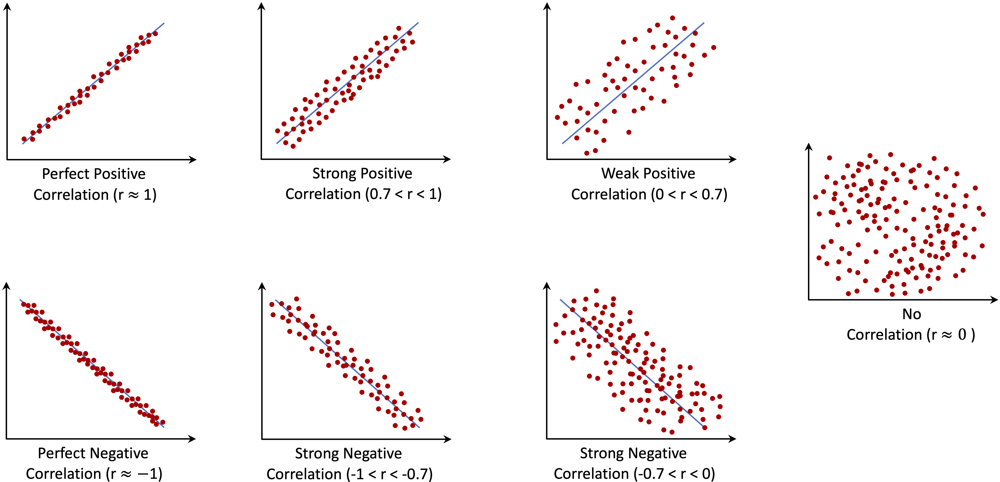
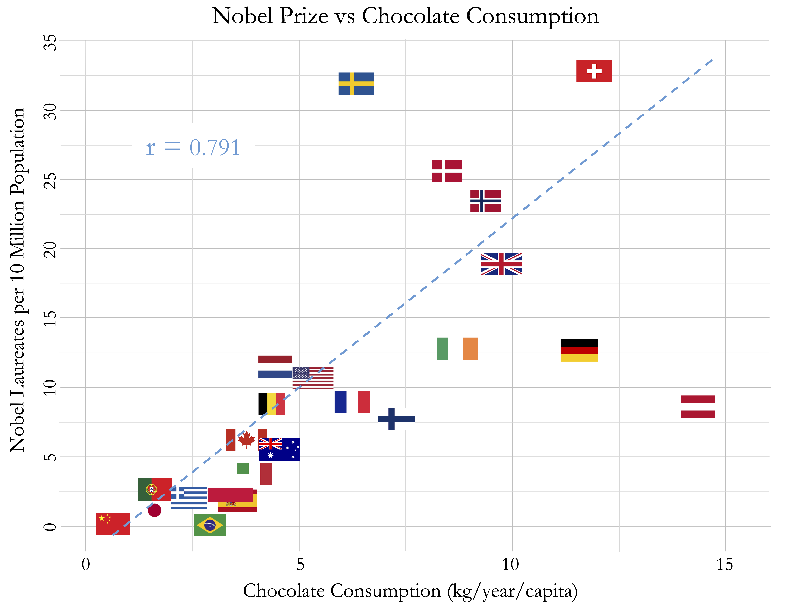

```{r echo=FALSE, message=FALSE, warning=FALSE}
source("_common.R")
```

# Exploratory Data Analysis {#sec-ch4-EDA}

::: {.content-visible when-format="pdf"}
\begin{chapterquote}
All truths are easy to understand once they are discovered; the point is to discover them.

\hfill — Galileo Galilei
\end{chapterquote}
:::

::::: {.content-visible when-format="html"}
:::: chapterquote
All truths are easy to understand once they are discovered; the point is to discover them.

::: author
— Galileo Galilei
:::
::::
:::::

Exploratory Data Analysis (EDA) is the stage of data analysis in which we examine a dataset systematically before moving to formal inference or predictive modeling. In the Data Science Workflow (see @fig-ch2_DSW), EDA builds on Data Preparation (Chapter [-@sec-ch3-data-preparation]) and provides the empirical foundation for later Data Setup for Modeling (Chapter [-@sec-ch6-data-setup]). Through numerical summaries and visualizations, EDA helps us assess whether variables behave plausibly, how observations are distributed, and which relationships or redundancies deserve closer attention.

EDA is primarily investigative rather than confirmatory. We use it to formulate questions, recognize patterns, detect possible data-quality issues, and guide later analytical decisions. Apparent patterns should therefore be interpreted cautiously: they may suggest useful directions for further analysis, but they do not by themselves establish causal relationships or population-level conclusions. Formal tools for statistical inference, introduced in Chapter [-@sec-ch5-statistics], build on this exploratory foundation by quantifying uncertainty and assessing whether observed patterns are likely to generalize beyond the available data.

### What This Chapter Covers {.unnumbered .unlisted}

This chapter first introduces the main objectives and guiding questions of EDA, with attention to choosing suitable tools for categorical, numerical, and multivariate exploration. We then apply these ideas in a guided case study using the `churn` dataset from the **liver** package, where the goal is to explore customer attrition before formal modeling begins. The case study examines categorical features, numerical features, and relationships among variables, while emphasizing careful interpretation and clear communication of exploratory findings.

By the end of the chapter, readers should be able to select appropriate graphical and numerical summaries, compare feature behavior across groups, recognize potential redundancy among predictors, and distinguish exploratory patterns from inferential or causal claims.

## Communicating Exploratory Findings with Data Storytelling

Exploratory results become useful when they are communicated in relation to a question, not merely displayed as output. A histogram, scatter plot, box plot, or correlation matrix should help the reader see something that is difficult to grasp from raw data alone, such as variation, overlap, unusual observations, group differences, or change over time. In this context, data storytelling does not mean imposing a narrative on the data. It means arranging visual and numerical evidence so that the main patterns, limitations, and open questions can be understood clearly.

A well-known example of effective exploratory communication is Hans Rosling’s TED Talk [*New insights on poverty*](https://www.ted.com/talks/hans_rosling_new_insights_on_poverty), in which demographic and economic data are used to communicate long-term global development patterns. Figure [-@fig-EDA-fig-1] shows a related exploratory visualization based on the `gapminder` dataset from the **liver** package. The figure compares GDP per capita and life expectancy across world regions in 1950 and 2019, with point size proportional to population.

```{r}
#| label: fig-EDA-fig-1
#| echo: false
#| out-width: 100%
#| fig-cap: "Changes in GDP per capita and life expectancy by region from 1950 (left) to 2019 (right). Dot size is proportional to population."

data(gapminder, package = "liver")

#ggplot_1 = ggplot(gapminder, aes(x = gdp, y = life_expectancy, col = continent, size = population / 10^6)) 
ggplot_1 = dplyr::filter(gapminder, year %in% c(1950, 2019) & !is.na(world_group) & world_group != "Others" &
                    !is.na(gdp) & !is.na(life_expectancy) & !is.na(population)) |>
  ggplot(aes(x = gdp, y = life_expectancy, col = world_group, size = population / 10^6)) +
  geom_point(alpha = 0.5) +
  guides(size = "none") +
  coord_cartesian(ylim = c(20, 90)) + 
  labs(x = 'GDP per Capita (USD)', 
       y = 'Life Expectancy') 

if(knitr::is_latex_output()){
  ggplot_1 + 
    facet_grid(. ~ year) + 
    theme(legend.position = "top", 
          legend.title = element_text(size = 9),
          legend.text  = element_text(size = 8),
          legend.key.size = grid::unit(0.4, "cm"),
          legend.spacing.x = grid::unit(0.2, "cm"),
          axis.text.x = element_text(size = 8, angle = 45),
          axis.text.y = element_text(size = 10), 
          axis.title = element_text(size = 10, face = "bold"),
          title = element_text(size = 10, face = "bold")) + 
          scale_color_brewer(palette = "Set2", name = "World Region: ")
}else{
  ggplot_html = ggplot_1 +
    ggtitle('{frame_time}') +
    gganimate::transition_time(year) +   
    ease_aes('linear') + 
    theme(title = element_text(size = 14, face = "bold"),
          legend.title = element_blank(), 
          plot.margin = grid::unit(c(-.19, 0, .03, .1), "null"),
          plot.title = element_text(hjust = 0.86, vjust = -23.5, color = "#7286c3", size = 48, 
                                  face = "bold.italic")) + 
          scale_color_brewer(palette = "Set2")
  
  gganimate::animate(ggplot_html, fps = 7, end_pause = 25) #, rewind = TRUE) 
}
```

Figure [-@fig-EDA-fig-1] illustrates how a visualization can support interpretation without requiring a complex statistical model. Across regions, life expectancy and GDP per capita generally increase between 1950 and 2019, although the pace and level of change differ substantially across groups. The figure also shows a positive association between economic development and population health, but this association remains descriptive rather than causal. In the `churn` case study later in this chapter, we apply the same principle: exploratory graphics and summaries are used to make patterns visible, communicate them clearly, and identify questions that deserve closer analysis. The next section turns this communication principle into a more systematic workflow by introducing guiding questions and commonly used exploratory tools for examining unfamiliar datasets.

## Objectives and Guiding Questions for EDA {#sec-EDA-objectives-questions}

A useful starting point in EDA is to clarify what we want to learn from the data. We usually begin by examining individual features: their types, ranges, distributions, missing values, and unusual observations. We then move to relationships among features, including associations with the target variable, correlations among numerical predictors, and possible interactions between categorical and numerical variables. These questions help us identify structure in the data before formal inference or modeling begins.

Exploration becomes more effective when it is guided by focused questions. For a single feature, we may ask whether its values are plausible, whether the distribution is symmetric or skewed, whether missing values occur, and whether extreme observations represent errors or meaningful rare cases. For relationships among features, we may ask whether one variable changes systematically across groups, whether two numerical features are associated, whether predictors contain redundant information, and whether combinations of features reveal patterns that are not visible from univariate summaries alone.

A recurring challenge, especially for students, is choosing which plots or summaries best suit different types of data. Table [-@tbl-EDA-table-tools] summarizes common exploratory objectives and appropriate tools. The table should be used as a practical guide rather than a fixed rule: the most useful exploratory tool depends on the feature type, the analytical question, and the context in which the data were collected.

```{r}
#| label: tbl-EDA-table-tools
#| echo: false
#| tbl-cap: "Overview of Recommended Tools for Common EDA Objectives."
#| out.width: NULL

format = if (knitr::is_latex_output()) "latex" else "pipe"

eda_tools = data.frame(
  "Objective" = c(
    "Examine a numerical feature’s distribution",
    "Summarize a categorical feature",
    "Identify unusual or extreme observations",
    "Detect missing data patterns",
    "Explore the relationship between two numerical features",
    "Compare a numerical feature across groups",
    "Analyze relationships between two categorical features",
    "Assess correlation among multiple numerical features"
  ),
  "Data Type" = c(
    "Numerical",
    "Categorical",
    "Numerical",
    "Any",
    "Numerical and numerical",
    "Numerical and categorical",
    "Categorical and categorical",
    "Multiple numerical"
  ),
  "Techniques" = c(
    "Histogram, density plot, box plot, summary statistics",
    "Frequency table, bar chart, proportional bar chart",
    "Box plot, histogram, summary statistics, contextual inspection",
    "Missingness summaries, missingness maps, missingness by group",
    "Scatter plot, smooth trend, correlation coefficient",
    "Grouped summaries, box plot, violin plot, density plot",
    "Contingency table, proportional bar plot, mosaic plot",
    "Correlation matrix, correlation heatmap, scatterplot matrix"
  )
)

kableExtra::kbl(eda_tools, booktabs = TRUE, format = format) |>
  kableExtra::kable_styling(full_width = FALSE) |>
  kableExtra::column_spec(1, width = "15em") |>
  kableExtra::column_spec(2, width = "11em") |>
  kableExtra::column_spec(3, width = "16em")
```

By aligning exploratory objectives with suitable questions and tools, EDA becomes more than a routine collection of plots. It provides a disciplined way to inspect data quality, understand feature behavior, detect redundancy, and identify patterns that may guide later feature construction, statistical inference, and predictive modeling.

The next section applies these principles to customer churn. We use statistical summaries, visual tools, and domain context to examine which patterns in customer behavior may be relevant for understanding account closure.

## EDA in Practice: The `churn` Dataset {#sec-ch4-EDA-churn}

Exploratory data analysis is most useful when it is grounded in a real dataset and guided by a practical question. In this section, we use the `churn` dataset from the **liver** package to examine customer attrition in a credit card portfolio. The dataset contains demographic, behavioral, and financial information about customers, together with a binary outcome indicating whether a customer closed their account. Our aim is not to build a predictive model at this stage, but to explore which features vary across churn outcomes and which patterns may deserve closer attention in later analysis.

This walkthrough follows the logic of the Data Science Workflow introduced in Chapter [-@sec-ch2-intro-data-science]. We begin with problem understanding and a brief overview of the dataset, then examine feature types, categorical distributions, numerical summaries, and relationships among variables. Throughout the case study, we use exploratory summaries and visualizations to connect the structure of the data to questions about customer behavior, while avoiding conclusions that would require formal inference or predictive modeling.

### Problem Understanding for the `churn` Dataset {.unnumbered .unlisted}

Customer churn refers to the loss of customers over time. In the context of this case study, churn occurs when a customer closes their credit card account. For a bank, this is an important problem because retaining existing customers is often less costly than acquiring new ones, and early identification of customers at risk of leaving may support more targeted retention strategies.

From an exploratory perspective, the main question is not why customers leave in a causal sense, but which observed characteristics are associated with account closure. We therefore examine whether churn appears to differ across demographic groups, service-related features, transaction behavior, credit usage, and changes in activity over time. These exploratory patterns can help us identify variables that deserve closer attention in later statistical inference or predictive modeling.

EDA provides an initial foundation for this task by summarizing feature distributions, comparing churn groups, and examining relationships among variables. At this stage, the aim is to develop a structured understanding of the dataset rather than to make definitive claims about customer behavior. The next subsection therefore examines the structure and contents of the `churn` dataset before we begin the detailed exploratory analysis.

### Overview of the `churn` Dataset {.unnumbered .unlisted}

Before conducting graphical or numerical exploration, we first inspect the structure of the dataset. The `churn` dataset, available in the **liver** package, contains information about credit card customers, including demographic characteristics, account history, credit behavior, transaction activity, and customer-service interactions. The outcome of interest is `churn`, which indicates whether a customer closed their credit card account (`"yes"`) or remained active (`"no"`). At this stage, we use this outcome to guide exploration rather than to build a predictive model.

```{r}
library(liver)

data(churn)

str(churn)
```

The dataset is stored as a `data.frame` with `r nrow(churn)` observations and `r ncol(churn)` features. The variables can be viewed in several groups. Demographic features include `age`, `gender`, `education`, `marital`, `income`, and `dependent_count`. Account and relationship features include `months_on_book`, `relationship_count`, and `card_category`, while service-related behavior is captured by `months_inactive` and `contacts_count_12`. Credit behavior is described by `credit_limit`, `revolving_balance`, `available_credit`, and `utilization_ratio`, and transaction activity is summarized by `transaction_amount_12`, `transaction_count_12`, `ratio_amount_Q4_Q1`, and `ratio_count_Q4_Q1`. The variable `customer_ID` is an account identifier and is not used as an analytical predictor.

The dataset contains both categorical and numerical features, and this distinction guides the exploratory tools used later in the chapter. Categorical features such as `gender`, `education`, `marital`, `income`, `card_category`, and `churn` are examined using frequency tables and bar plots. Numerical features such as `credit_limit`, `transaction_amount_12`, `transaction_count_12`, and `utilization_ratio` are explored using summary statistics, histograms, box plots, density plots, and correlation measures. Some variables are also derived from others: for example, `available_credit` is calculated from credit limit and revolving balance, while `utilization_ratio` summarizes revolving balance relative to credit limit. These relationships become important when we examine redundancy among predictors later in the chapter.

A targeted summary of selected categorical features helps identify placeholder levels that should be interpreted carefully during EDA:

```{r}
summary(churn[, c("education", "income", "marital")])
```

The output shows that `education`, `income`, and `marital` contain the level `"unknown"`. In this dataset, `"unknown"` represents missing or unspecified information rather than an ordinary substantive category. For the purpose of EDA, we keep `"unknown"` as an explicit category so that these responses remain visible in the plots that follow. This choice is appropriate because missing or unspecified responses may themselves reveal structure, for example if the `"unknown"` group differs across churn outcomes. It should not be interpreted as a final modeling decision, since later modeling workflows may handle these values differently through imputation, missing indicators, or model-specific preprocessing choices. With this clarification, the dataset is ready for categorical, numerical, and multivariate exploration.

> *Practice:* Run `summary(churn)` to obtain a summary of the full dataset. Which numerical features show the largest ranges? Which categorical features contain the level `"unknown"`? How does this output complement the information provided by `str(churn)`?

## Exploring Categorical Features {#sec-EDA-categorical}

Categorical features group observations into distinct classes and often capture demographic, socioeconomic, product-related, or behavioral characteristics. In the `churn` dataset, such features include `gender`, `marital`, `education`, `income`, `card_category`, and the outcome variable `churn`. Exploring categorical features helps us understand how observations are distributed across groups and whether churn rates appear to differ between these groups.

When working with categorical features, it is useful to distinguish between counts, proportions, and churn rates. Counts show how many observations fall into each category. Proportions show the relative size of each category in the full dataset or within a subgroup. Churn rates are conditional proportions: they describe the proportion of customers who churn within a given group. For example, the churn rate among customers in a particular income category is the proportion of customers in that category with `churn = "yes"`.

We begin by examining the distribution of the target feature `churn`, which indicates whether a customer has closed their credit card account. Understanding this distribution allows us to assess class balance, an important issue for both exploratory interpretation and later predictive modeling. The bar plot below shows the number of customers in each churn category, with percentage labels added to indicate the relative size of each group:

```{r out.width = "50%"}
library(ggplot2)

ggplot(data = churn, 
  aes(x = churn, label = scales::percent(prop.table(after_stat(count))))) +
  geom_bar(fill = c("#F4A582", "#A8D5BA")) +
  geom_text(stat = "count", vjust = 0.4, size = 7)
```

The plot shows that most customers remain active (`churn = "no"`), while a smaller proportion, about `r round(prop.table(table(churn$churn))["yes"] * 100, 0)` percent, have closed their accounts. The height of each bar represents the number of customers in that category, while the labels show the corresponding percentages. This class imbalance is important because raw counts are dominated by the majority class. In later classification tasks, it also affects how model performance should be interpreted: a model may appear accurate simply because it predicts the majority outcome well.

> *Practice:* Before examining `gender` in relation to churn, create a simple bar plot of `gender` using **ggplot2**. What does the plot tell you about the distribution of customers across gender categories?

Having established the overall distribution of the target variable, the next step is to explore how other categorical features vary across churn outcomes. These comparisons help identify customer segments and behavioral patterns that may be associated with elevated attrition risk.

### Relationship Between Gender and Churn {.unnumbered .unlisted}

We first examine `gender` as a simple example of comparing a categorical predictor with the churn outcome. In this dataset, `gender` is recorded as a binary category. This coding is a limitation of the available data and should not be interpreted as representing the full diversity of gender identities.

```{r out.width = "100%"}
#| layout-ncol: 2
#| fig-width: 4
#| fig-height: 4

ggplot(data = churn) + 
  geom_bar(aes(x = gender, fill = churn)) +
  labs(x = "Gender", y = "Count", title = "Counts of Churn by Gender") 

ggplot(data = churn) + 
  geom_bar(aes(x = gender, fill = churn), position = "fill") +  
  labs(x = "Gender", y = "Proportion", title = "Proportion of Churn by Gender")
```

The count plot shows the number of churners and non-churners within each gender group, while the proportional plot compares churn rates across groups. The proportional view suggests a slightly higher churn rate among female customers, but the difference is small and should not be overinterpreted.

The corresponding contingency table provides a numerical check:

```{r}
addmargins(table(churn$churn, churn$gender,
                 dnn = c("Churn", "Gender")))
```

The table confirms that gender does not strongly separate churners from non-churners in this dataset. At this stage, the result is descriptive rather than inferential. Formal tests for differences in proportions are introduced in Chapter [-@sec-ch5-statistics].

> *Practice:* Compute the churn rate separately for male and female customers. Compare the numerical rates with the proportional bar plot above. Does `gender` appear to provide a strong exploratory signal for churn?

### Relationship Between Card Category and Churn {.unnumbered .unlisted}

The variable `card_category` classifies customers into four product tiers: blue, silver, gold, and platinum. This feature is useful for categorical EDA because it illustrates an important issue: apparent differences in churn rates should be interpreted together with the number of observations in each category. Small groups can produce unstable proportions, even when the visual difference appears noticeable.

```{r out.width = "100%"}
#| layout-ncol: 2
#| fig-width: 4
#| fig-height: 4

ggplot(data = churn) + 
  geom_bar(aes(x = card_category, fill = churn)) + 
  labs(x = "Card Category", y = "Count")

ggplot(data = churn) + 
  geom_bar(aes(x = card_category, fill = churn), position = "fill") + 
  labs(x = "Card Category", y = "Proportion")
```

The count plot shows that the distribution of customers across card categories is highly imbalanced, with most customers holding a blue card. The proportional plot allows churn rates to be compared within each tier, but the smaller silver, gold, and platinum groups require caution. Differences in these smaller groups may reflect genuine variation, random fluctuation, or both. For this reason, the count and proportional plots should be interpreted together rather than separately.

The corresponding contingency table makes the group sizes and churn counts explicit:

```{r}
addmargins(table(churn$churn, churn$card_category,
            dnn = c("Churn", "Card Category")))
```

From an exploratory perspective, `card_category` may contain some signal about churn, but its interpretation is affected by the strong imbalance in group sizes. For later modeling, analysts may consider whether a simpler grouping, such as standard versus premium cards, improves interpretability without losing useful information. Such a decision should be justified by both the observed data structure and the substantive meaning of the categories.

> *Practice:* Reclassify the card categories into two groups, `"blue"` and `"premium"`, using the `fct_collapse()` function from the **forcats** package. Then recreate the count and proportional bar plots. Does the simplified grouping make the churn pattern easier to interpret? What information is lost by combining the smaller card categories?

### Relationship Between Marital Status and Churn {.unnumbered .unlisted}

Marital status provides another example of comparing a categorical feature with the churn outcome. In the `churn` dataset, the main substantive categories are `married`, `single`, and `divorced`, while the level `"unknown"` represents missing or unspecified information. We keep `"unknown"` visible during EDA, but we do not interpret it as an ordinary marital-status group.

```{r out.width = "100%"}
#| layout-ncol: 2
#| fig-width: 4
#| fig-height: 4

ggplot(data = churn) + 
  geom_bar(aes(x = marital, fill = churn)) + 
  labs(x = "Marital Status", y = "Count") +
  theme(axis.text.x = element_text(angle = 45, hjust = 1))

ggplot(data = churn) + 
  geom_bar(aes(x = marital, fill = churn), position = "fill") + 
  scale_y_continuous(labels = scales::percent) +
  labs(x = "Marital Status", y = "Proportion") +
  theme(axis.text.x = element_text(angle = 45, hjust = 1))
```

The count plot shows how customers are distributed across marital-status categories, while the proportional plot compares churn rates within each category. The proportional view suggests that churn rates are broadly similar across the substantive marital-status groups, with only modest differences. The `"unknown"` group should be interpreted cautiously because it represents unspecified information rather than a clearly defined customer group.

Overall, marital status does not appear to provide a strong exploratory signal for churn on its own. This conclusion is descriptive rather than inferential; formal tests of association between categorical variables are introduced in Chapter [-@sec-ch5-statistics].

> *Practice:* Examine whether `income` and `education` are associated with churn. Create count and proportional bar plots, inspect the corresponding contingency tables, and consider whether the observed differences appear practically meaningful. For any `"unknown"` category, interpret it as missing or unspecified information rather than as an ordinary substantive group.

## Exploring Numerical Features {#sec-EDA-sec-numeric}

The `churn` dataset contains numerical features that describe customer behavior, credit management, account activity, and engagement with the bank. Examining these features helps us understand how customers differ in service interactions, spending patterns, financial capacity, and changes in activity over time. These dimensions are often more directly connected to churn behavior than demographic characteristics, because they describe how customers use the account rather than only who the customers are.

To keep the analysis focused and interpretable, we concentrate on four representative numerical features. The variable `contacts_count_12` captures service interaction with the bank, `transaction_amount_12` reflects overall card usage, `credit_limit` describes financial capacity and account characteristics, and `ratio_amount_Q4_Q1` summarizes recent change in transaction activity. Together, these features provide a compact view of several numerical patterns that may be associated with churn, while avoiding a repetitive feature-by-feature survey of the entire dataset.

In the following subsections, we use visualizations and selected numerical summaries to examine the distributions of these features and their relationships with customer churn. The goal is not to identify definitive causes of churn, but to recognize exploratory patterns, assess group overlap, and identify variables that may deserve closer attention in later statistical inference or predictive modeling. We also briefly note that some numerical features, such as `months_on_book`, show substantial overlap between churners and non-churners in this dataset and are therefore not emphasized in the main discussion.

### Customer Contacts and Churn {.unnumbered .unlisted}

The number of customer service contacts in the past year (`contacts_count_12`) provides insight into how often customers interact with the bank after opening or using their account. This variable is a count feature with small integer values, making bar plots more appropriate than boxplots or density plots. Bar plots clearly show how frequently customers contacted customer service and allow a direct comparison between churned and active accounts.

```{r out.width = "100%"}
#| layout-ncol: 2
#| fig-width: 4
#| fig-height: 4

ggplot(data = churn) +
  geom_bar(aes(x = contacts_count_12, fill = churn)) +
  labs(x = "Number of Contacts in 12 Months", y = "Count")

ggplot(data = churn) +
  geom_bar(aes(x = contacts_count_12, fill = churn), position = "fill") +
  labs(x = "Number of Contacts in 12 Months", y = "Proportion")
```

The count plot shows that most customers contact customer service two or three times per year, with fewer customers reporting either no contacts or more than four. The proportional bar plot shows a clear pattern: the proportion of customers who churn increases as the number of contacts rises. The increase is especially visible among customers with four or more contacts during the year.

Overall, `contacts_count_12` provides a clearer exploratory signal than the demographic features examined earlier. Frequent contacts may reflect unresolved questions, service difficulties, or other forms of customer disengagement. The association is descriptive rather than causal, but it suggests that service-interaction patterns may be useful in later modeling and predictive analysis.

### Transaction Amount and Churn {.unnumbered .unlisted}

The total transaction amount over the past twelve months (`transaction_amount_12`) reflects how actively customers use their credit card. Higher spending is often associated with regular account use, whereas lower spending may indicate reduced engagement or a shift toward alternative payment methods. Because this feature is continuous, we use boxplots and density plots to examine how its distribution differs between customers who churn and those who remain active.

```{r out.width = "100%"}
#| layout-ncol: 2
#| fig-width: 4
#| fig-height: 4

ggplot(data = churn) +
  geom_boxplot(aes(x = churn, y = transaction_amount_12)) +
  labs(x = "Churn", y = "Total Transaction Amount")

ggplot(data = churn) +
  geom_density(aes(x = transaction_amount_12, fill = churn), alpha = 0.6) +
  labs(x = "Total Transaction Amount", y = "Density")
```

The boxplot highlights differences in central tendency, spread, and possible extreme values. The density plot provides a more detailed view of distributional shape. Because density curves are normalized within each churn group, they compare the shape of the distributions rather than the number of customers in each group. This distinction is important in an imbalanced dataset, where the active-customer group is much larger than the churned-customer group.

Together, the plots show that customers who churn tend to have lower total transaction amounts and a narrower range of spending. Customers who remain active show higher and more variable transaction volumes. This pattern suggests that lower annual spending is associated with churn in this dataset, although the plots alone do not establish whether reduced spending causes churn or whether both reflect a broader decline in customer engagement.

This feature therefore provides a useful behavioral signal for later analysis. It complements the service-contact feature examined in the previous subsection: while `contacts_count_12` describes interaction with customer service, `transaction_amount_12` describes actual account usage over the year.

> *Practice:* Recreate the density plot for `transaction_amount_12` using a histogram instead. Experiment with different bin widths and compare the resulting plots. How sensitive are your conclusions to these choices? Which visualization would you use for exploratory analysis, and which for reporting results?

### Credit Limit and Churn {.unnumbered .unlisted}

The total credit line assigned to a customer (`credit_limit`) reflects an account-level financial characteristic. Credit limits may be related to income, credit history, product tier, bank policy, or other factors that are not fully observed in the dataset. Because credit limits vary substantially across customers, we use violin plots and histograms to examine both distributional shape and differences between churn groups.

```{r out.width = "100%"}
#| layout-ncol: 2
#| fig-width: 4
#| fig-height: 4

ggplot(data = churn, aes(x = churn, y = credit_limit, fill = churn)) +
  geom_violin(trim = FALSE) +
  labs(x = "Churn", y = "Credit Limit") 

ggplot(data = churn) +
  geom_histogram(aes(x = credit_limit, fill = churn), bins = 30) +
  labs(x = "Credit Limit", y = "Count")
```

The violin plot shows substantial overlap in the distribution of credit limits between churners and non-churners, indicating that the two groups are not clearly separated by this feature alone. Customers who churn appear to have slightly lower credit limits on average, but the difference is modest. Both plots also show that the distribution of credit limits is strongly right-skewed, with many customers concentrated at lower credit limits and a smaller number of customers having substantially larger credit lines.

The histogram suggests a concentration of customers at lower credit limits, together with a smaller group of customers who have substantially larger credit lines. Whether these represent distinct customer segments would require further analysis. Taken together, the plots indicate that `credit_limit` may contain some exploratory signal, but the overall separation between churners and non-churners is limited.

Compared with behavioral indicators such as transaction activity or service contacts, `credit_limit` appears to provide a weaker differentiating signal on its own. Its value may lie in complementing other features rather than serving as a standalone indicator of churn. We assess whether the observed difference in average credit limits is statistically meaningful in Section [-@sec-ch5-two-sample-t-test], where we introduce formal hypothesis testing for numerical features.

> *Practice:* Create boxplots and density plots for `credit_limit` stratified by churn status. Compare these with the violin plot and histogram shown in this section. How do the different visualizations influence your perception of group overlap and central tendency? Discuss which plots are most informative at this exploratory stage.

### Changes in Transaction Activity and Churn {.unnumbered .unlisted}

The feature `ratio_amount_Q4_Q1` compares total spending in the fourth quarter with total spending in the first quarter. It captures change in customer activity over time and provides a temporal view of engagement. A ratio below 1 indicates that spending in Q4 was lower than in Q1, whereas a ratio above 1 indicates increased spending toward the end of the year. Ratio features require caution because unusually small first-quarter values can produce large ratios. For this reason, we interpret `ratio_amount_Q4_Q1` together with related activity measures, such as total transaction amount and transaction count, rather than treating it as a complete summary of customer engagement on its own.

```{r out.width = "100%"}
#| layout-ncol: 2
#| fig-width: 4
#| fig-height: 4

ggplot(data = churn) +
  geom_boxplot(aes(x = churn, y = ratio_amount_Q4_Q1)) +
  labs(x = "Churn", y = "Transaction Ratio (Q4/Q1)") 

ggplot(data = churn) +
  geom_density(aes(x = ratio_amount_Q4_Q1, fill = churn), alpha = 0.6) +
  labs(x = "Transaction Ratio (Q4/Q1)", y = "Density")
```

The boxplot compares the central tendency and spread of the Q4-to-Q1 transaction ratio across churn groups, while the density plot shows the distributional shape. Because density curves are normalized within each churn group, they compare distributional shape rather than the number of customers in each group. This distinction is important in an imbalanced dataset, where active customers are more common than churned customers.

The plots show that customers who churn tend to have lower Q4-to-Q1 transaction ratios, indicating reduced spending toward the end of the year. Customers who remain active are more likely to maintain or increase their spending. This pattern suggests that declining transaction activity may be associated with churn, although the plots do not establish whether reduced spending causes churn or whether both reflect a broader process of disengagement. Since `ratio_amount_Q4_Q1` captures change rather than the overall level of activity, it should be interpreted together with total transaction amount and transaction count.

> *Practice:* Repeat the analysis using `ratio_count_Q4_Q1`, which compares the number of transactions in Q4 with the number of transactions in Q1. Compare the results with the plots for `ratio_amount_Q4_Q1`. Do changes in transaction count and transaction amount tell a similar story about churn?

## Exploring Multivariate Relationships {#sec-EDA-sec-multivariate}

Univariate analyses help us understand individual features, but many exploratory questions involve relationships among several variables. In the `churn` dataset, multivariate EDA is useful for two main purposes: identifying redundant features that carry overlapping information, and examining how combinations of features relate to customer behavior and churn.

We begin with correlation analysis because it provides a compact way to detect numerical features that move together or are mathematically linked. We then examine joint patterns in transaction amount and transaction count, followed by the relationship between product tier and spending behavior. These views help us move beyond isolated feature summaries and develop a clearer picture of how customer activity is structured in the dataset.

### Correlation and Redundancy Among Numerical Features {.unnumbered .unlisted}

We begin the multivariate analysis by examining how numerical features relate to one another. Correlation analysis helps identify variables that tend to move together and may therefore carry overlapping information. This is especially useful before modeling, since highly correlated or mathematically derived features can complicate interpretation and may add little new information.

The Pearson correlation coefficient, denoted by $r$, measures the strength and direction of a linear association between two numerical features. For two numerical features $X$ and $Y$, the sample Pearson correlation coefficient is defined as $$
r =
\frac{
\sum_{i=1}^{n}(x_i - \bar{x})(y_i - \bar{y})
}{
\sqrt{\sum_{i=1}^{n}(x_i - \bar{x})^2}
\sqrt{\sum_{i=1}^{n}(y_i - \bar{y})^2}
},
$$ where $x_i$ and $y_i$ denote the observed values of the two numerical features for observation $i$, while $\bar{x}$ and $\bar{y}$ are their sample means. The numerator measures how the two features vary together, and the denominator standardizes this quantity so that $r$ always lies between $-1$ and $1$. Positive values indicate that two features tend to increase together, negative values indicate an inverse relationship, and values close to zero indicate little linear association. Figure [-@fig-correlation] illustrates these cases using scatterplots with different directions and strengths of linear association.

```{r fig-correlation, echo = FALSE, out.width = "100%", fig.cap = "Examples of scatterplot patterns for different values of the Pearson correlation coefficient $r$, showing positive, negative, and near-zero linear associations."}

```

Correlation should not be interpreted as evidence of causation. For example, an association between customer service contacts and churn does not imply that contacting customer service causes customers to leave; both may reflect an underlying issue, such as unresolved questions or service difficulties. Figure [-@fig-correlation-chocolate] shows a well-known example: the association between per-capita chocolate consumption and Nobel Prize wins across countries [@messerli2012chocolate]. The example is useful because the causal interpretation is implausible. Readers interested in causal reasoning may consult *The Book of Why* by Judea Pearl and Dana Mackenzie [-@pearl2018book].

```{r fig-correlation-chocolate, echo = FALSE, out.width = "70%", fig.cap = "Scatterplot illustrating the correlation between Nobel Prize wins and chocolate consumption (per 10 million population) across countries."}

```

We now return to the `churn` dataset and compute the correlation matrix for the numerical features. The resulting heatmap provides a compact overview of linear associations and helps identify variables that may be redundant.

```{r, out.width = "100%"}
library(dplyr)
library(ggcorrplot)

numeric_churn = churn |>
  select(where(is.numeric), -any_of("customer_ID"))

cor_matrix = cor(numeric_churn, use = "complete.obs")

ggcorrplot(cor_matrix, type = "lower", lab = TRUE, lab_size = 1.7, tl.cex = 6, 
           colors = c("#699fb3", "white", "#b3697a"),
           title = "Correlation Matrix for Numerical Features") +
  theme(plot.title = element_text(size = 10, face = "plain"),
        legend.title = element_text(size = 7), 
        legend.text = element_text(size = 6))
```

The heatmap suggests that many numerical features are only weakly or moderately correlated, indicating that they capture different aspects of customer behavior. Some variables, however, are structurally related. For example, `available_credit` is derived from `credit_limit` and `revolving_balance`: $$
\text{available credit} = \text{credit limit} - \text{revolving balance}.
$$ Including all three variables in a model may therefore introduce redundancy. These variables do not necessarily play the same interpretive role: `available_credit` may be easier to communicate, while its component variables may provide more flexibility in modeling. The appropriate choice depends on the analytical objective.

A similar issue arises for `utilization_ratio`, which is defined as revolving balance divided by credit limit: $$
\text{utilization ratio} = \frac{\text{revolving balance}}{\text{credit limit}}.
$$ This ratio provides a normalized measure of credit usage, but it is also mathematically linked to its component variables. The following plots illustrate this point. The first plot shows how `utilization_ratio` varies with `credit_limit`, while the second confirms the exact relationship between `utilization_ratio` and `revolving_balance / credit_limit`.

```{r out.width = "100%"}
#| layout-ncol: 2
#| fig-width: 4
#| fig-height: 4

ggplot(data = churn) +
  geom_point(aes(x = credit_limit, y = utilization_ratio), size = 0.1) +
  labs(x = "Credit Limit", y = "Utilization Ratio")

ggplot(data = churn) +
  geom_point(aes(x = revolving_balance / credit_limit, 
                 y = utilization_ratio), size = 0.1) +
  labs(x = "Revolving Balance / Credit Limit", y = "Utilization Ratio")
```

The first plot provides an exploratory view of how credit usage varies across credit limits. The second plot shows the deterministic relationship implied by the definition of `utilization_ratio`. Together, they illustrate an important point for later modeling: derived variables can be useful for interpretation, but including both a derived feature and all of its components may introduce redundancy. Such variables should therefore be included deliberately rather than automatically.

> *Practice:* Create a three-dimensional scatter plot using `credit_limit`, `revolving_balance`, and `utilization_ratio`. Because these features are mathematically linked, the points should lie close to a surface. Use **plotly** to explore the structure interactively. Does the three-dimensional view make the redundancy among these features more apparent?

### Joint Patterns in Transaction Amount and Count {.unnumbered .unlisted}

Transaction activity has two complementary dimensions: how much customers spend and how frequently they use their card. The features `transaction_amount_12` and `transaction_count_12` summarize these dimensions over a twelve-month period. Examining them jointly helps reveal usage patterns that are not visible from either feature alone. A scatter plot with marginal histograms is useful here because it shows both the joint relationship between the two features and the marginal distribution of each feature.

The code below first constructs a base scatter plot using **ggplot2** and then applies `ggMarginal()` from the **ggExtra** package to add histograms along the horizontal and vertical axes:

```{r out.width = "100%"}
library(ggExtra)

# Base scatter plot
scatter_plot <- ggplot(data = churn) +
  geom_point(aes(x = transaction_amount_12, y = transaction_count_12, 
                 color = churn), size = 0.1, alpha = 0.7) +
  labs(x = "Transaction Amount", y = "Total Transaction Count") +
  theme(legend.position = "bottom")

# Add marginal histograms
ggMarginal(scatter_plot, type = "histogram", groupColour = TRUE, 
           groupFill = TRUE, alpha = 0.5, size = 4)
```

The central scatter plot shows a positive association: customers who spend more also tend to make more transactions. Most observations lie along a broad diagonal band, where churners and non-churners overlap substantially. The marginal histograms complement this view by showing how transaction amount and transaction count are distributed within each churn group.

The plot also suggests that low-activity customers are more common among churners. In particular, customers with low spending and relatively few transactions appear to have a higher churn rate than customers with high spending and frequent transactions. This pattern should be interpreted cautiously, since the plot is exploratory and the groups are not separated by sharp boundaries.

To examine this pattern more closely, we define an illustrative subset of customers with very low spending or with moderate spending but relatively few transactions. The thresholds used here are exploratory and should not be interpreted as a formal segmentation rule:

```{r out.width = "45%"}
sub_churn = subset(churn,
  (transaction_amount_12 < 1000) |
  ((2000 < transaction_amount_12) & 
    (transaction_amount_12 < 3000) & 
    (transaction_count_12 < 52))
  )

ggplot(data = sub_churn, 
       aes(x = churn, 
           label = scales::percent(prop.table(after_stat(count))))) +
  geom_bar(fill = c("#F4A582", "#A8D5BA")) + 
  geom_text(stat = "count", vjust = 0.4, size = 7) 
```

Within this illustrative subset, the proportion of churners is higher than in the full dataset. This supports the earlier observation that low or inconsistent card usage may be associated with churn. The example also shows why multivariate exploration can be informative: transaction amount and transaction count are useful individually, but their combination reveals usage patterns that are less apparent from univariate summaries.

For later modeling, this type of exploratory pattern may motivate the inclusion of both transaction amount and transaction count, or the construction of derived features that summarize customer activity. Such decisions should be evaluated formally during model development rather than based on visual inspection alone.

> *Practice:* Replace `type = "histogram"` with `type = "density"` in `ggMarginal()` to add marginal density curves. Then recreate the scatter plot using `ratio_amount_Q4_Q1` on the horizontal axis instead of `transaction_amount_12`. Which version makes differences between churn groups easier to detect?

### Product Tier and Spending Patterns {.unnumbered .unlisted}

The feature `card_category` divides customers into four product tiers: blue, silver, gold, and platinum. The feature `transaction_amount_12` measures the total amount spent over the past twelve months. Examining these features together helps us assess whether spending behavior differs across product tiers. This provides a multivariate view because it relates a categorical feature to a numerical feature.

Because `transaction_amount_12` is continuous, density plots can be used to compare the shape, center, and spread of spending distributions across card categories. However, density curves are normalized within each group, so they compare distributional shape rather than the number of customers in each tier. This distinction is important because the card categories are highly imbalanced, with blue cardholders forming the dominant group.

```{r out.width = "70%"}
ggplot(data = churn) +
  geom_density(aes(x = transaction_amount_12, fill = card_category)) +
  labs(x = "Total Transaction Amount", y = "Density", fill = "Card Category") 
```

The density curves suggest that spending distributions differ across product tiers. Customers with gold and platinum cards tend to have higher transaction amounts, while blue cardholders are concentrated more strongly in the lower and middle spending ranges. Because the higher-tier groups contain fewer customers, their curves should be interpreted cautiously: apparent differences may be less stable than patterns observed in the much larger blue-card group.

This subsection illustrates how multivariate EDA can connect product information with behavioral activity. The relationship between `card_category` and `transaction_amount_12` suggests that card tier captures some differences in spending behavior, but it should not be interpreted as a churn pattern on its own. In later modeling, this feature may be useful together with direct activity measures such as transaction amount, transaction count, and changes in transaction behavior over time.

> *Practice:* Extend the multivariate exploration by examining how `age` or `months_on_book` relates to transaction activity and churn. For example, create a scatter plot or smoothed trend plot using one of these features together with `transaction_amount_12` or `transaction_count_12`. Does the additional feature reveal a pattern that was not visible in the univariate analysis?

## Chapter Summary and Takeaways {#sec-ch4-summary}

This chapter introduced exploratory data analysis as a practical and systematic stage of the Data Science Workflow. We used graphical and numerical summaries to examine data structure, feature distributions, placeholder levels such as `"unknown"`, group differences, unusual observations, and relationships among variables. Throughout the chapter, we emphasized that EDA is descriptive rather than confirmatory: it helps identify patterns, limitations, and questions, but it does not by itself provide causal explanations or final statistical evidence.

Using the `churn` dataset, we showed how exploratory analysis can connect data summaries to a practical problem. The categorical analyses suggested that `gender` and `marital` provide limited separation between churners and non-churners, while `card_category` requires cautious interpretation because the product tiers are highly imbalanced. The numerical analyses showed stronger behavioral patterns: customers with more frequent service contacts, lower annual transaction amounts, and declining transaction activity appeared more likely to churn. These findings suggest useful directions for later analysis, but they should be interpreted as exploratory patterns rather than definitive explanations of customer attrition.

The chapter also highlighted the importance of examining relationships among variables. Correlation analysis helped identify redundant and derived features, especially among credit-related variables such as `available_credit`, `credit_limit`, `revolving_balance`, and `utilization_ratio`. Multivariate exploration further showed that transaction amount and transaction count jointly describe customer activity, and that product tier is related to spending behavior. These examples illustrate that effective EDA combines graphical displays, numerical summaries, and contextual reasoning to build a clearer understanding of the data before formal inference or predictive modeling begins.

The insights developed in this chapter provide the empirical foundation for Chapter [-@sec-ch5-statistics], where we introduce statistical inference. There, we move from exploratory patterns to formal tools for quantifying uncertainty, comparing groups, and testing hypotheses suggested by the data.

## Exercises {#sec-ch4-exercises}

These exercises reinforce the main ideas of the chapter, progressing from conceptual questions to hands-on exploratory analysis with the `churn` and `bank` datasets, followed by integrative challenges and self-reflection.

#### Conceptual Questions {.unnumbered .unlisted}

1.  Why is exploratory data analysis an essential stage before statistical inference or predictive modeling? What risks may arise if this stage is skipped?

2.  Explain the difference between univariate, bivariate, and multivariate exploration. Give one example of a question that belongs to each type.

3.  What is the difference between counts, proportions, and conditional proportions? Explain how these summaries are useful when exploring categorical features.

4.  Why should density plots be interpreted carefully when comparing groups of very different sizes?

5.  What does it mean for two numerical features to be correlated? Explain the difference between positive correlation, negative correlation, and no clear linear association.

6.  Why does correlation not imply causation? Give an example from the `churn` case study or from another applied setting.

7.  What is feature redundancy? Explain how derived variables such as ratios or differences can create redundancy in a dataset.

8.  If a feature shows only a weak relationship with the target variable during EDA, should it automatically be excluded from later modeling? Explain why or why not.

#### Hands-On Practice: Exploring the `churn` Dataset {.unnumbered .unlisted}

Use the `churn` dataset from the **liver** package for Exercises 9 to 16.

``` r
library(liver)
data(churn)
```

9.  Inspect the structure of the `churn` dataset. Identify which features are categorical and which are numerical.

10. Examine the distribution of the target feature `churn`. Is the dataset balanced or imbalanced with respect to the outcome?

11. Create count and proportional bar plots for one categorical predictor, such as `gender`, `marital`, or `income`. What do the plots suggest about its relationship with churn?

12. Examine the relationship between `card_category` and `churn`. Why should group size be considered when interpreting churn rates across card categories?

13. Explore the numerical feature `contacts_count_12` using suitable plots. What pattern do you observe in relation to churn?

14. Compare the distribution of `transaction_amount_12` between churners and non-churners using boxplots and density plots. What does each visualization reveal?

15. Examine `ratio_amount_Q4_Q1` by churn status. What does this feature suggest about changes in customer activity over time?

16. Compute or visualize the correlation matrix for the numerical features in `churn`. Identify one pair of variables that may be redundant and explain why.

#### Hands-On Practice: Exploring the `bank` Dataset {.unnumbered .unlisted}

Use the `bank` dataset from the **liver** package for Exercises 17 to 25. The dataset contains information from direct marketing campaigns of a Portuguese bank. The outcome variable indicates whether a client subscribed to a term deposit.

``` r
library(liver)
data(bank)
```

17. Inspect the structure of the `bank` dataset. Identify the target variable and classify the predictors as categorical or numerical.

18. Examine the distribution of the target variable `deposit`. What proportion of clients subscribed to a term deposit?

19. Explore the relationship between `housing`, `loan`, and `deposit` using bar plots and contingency tables. What patterns do you observe?

20. Examine the relationship between `job` and `deposit`. Which job categories appear to have higher or lower subscription rates?

21. Explore the relationship between `education` and `deposit`. Do the observed differences appear practically meaningful?

22. Visualize the distribution of `age` using a histogram and compare age distributions by `deposit` status using a boxplot or density plot.

23. Examine the feature `campaign`, which records the number of contacts performed during the campaign. How does it relate to the subscription outcome?

24. Compute and visualize correlations among the numerical features in the `bank` dataset. Which numerical features appear most strongly related to one another?

25. Summarize the main exploratory findings from the `bank` dataset in one short paragraph. Which features appear most relevant for later modeling?

#### Integrative Challenge {.unnumbered .unlisted}

26. Create a concise EDA report for either the `churn` or `bank` dataset using two to four plots. Your report should identify the target variable, describe class balance, and summarize the most important exploratory patterns.

27. Choose one categorical feature and one numerical feature from the same dataset. Examine how each relates to the target variable and discuss which appears more informative.

28. Identify one pair of features that may interact in relation to the target variable. Create a visualization that helps reveal the joint pattern.

29. Identify one feature that may be redundant, derived, or difficult to interpret. Explain how you would decide whether to keep, transform, or remove it before modeling.

30. Select one exploratory finding and describe how it could lead to a formal statistical question in Chapter [-@sec-ch5-statistics] or to a modeling decision in a later chapter.

#### Self-Reflection {.unnumbered .unlisted}

31. Which graphical or numerical summaries were most useful for understanding the datasets in this chapter? Explain your answer using one example.

32. How can EDA balance curiosity-driven exploration with methodological discipline? Discuss how analysts can avoid overinterpreting patterns found during exploration.
