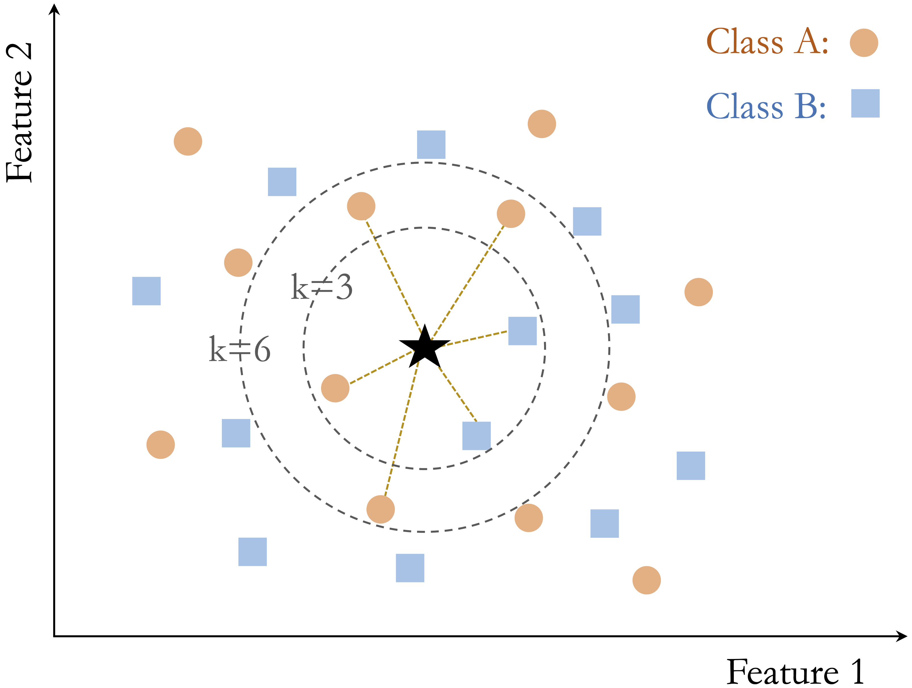

```{r echo=FALSE, message=FALSE, warning=FALSE}
source("_common.R")
```

# Classification Using k-Nearest Neighbors {#sec-chapter-knn}

::: {.content-visible when-format="pdf"}
\begin{chapterquote}
Tell me who your friends are, and I will tell you who you are.

\hfill — Spanish proverb
\end{chapterquote}
:::

::::: {.content-visible when-format="html"}
:::: chapterquote
Tell me who your friends are, and I will tell you who you are.

::: author
— Spanish proverb
:::
::::
:::::

How can we predict an outcome that has not yet been observed? A business may want to know whether a customer will churn, a bank whether a transaction is fraudulent, or a clinician which diagnostic category best describes a new patient. In each case, the answer can be informed by previously observed cases with known outcomes. *Classification* formalizes this idea by using labeled data to assign new observations to one of a set of predefined categories.

With this chapter, we move from preparing data to using them for prediction and enter the fifth stage of the Data Science Workflow, *Modeling* (Figure [-@fig-ds_DSW]). Chapter [-@sec-chapter-data-understanding] focused on understanding and exploring the data, while Chapter [-@sec-chapter-data-preparation] translated those findings into data prepared appropriately for modeling. We now use those prepared data to construct our first predictive model.

We begin with k-Nearest Neighbors (kNN), a classification method built around a simple and powerful idea: observations that are close to one another in their predictor values often share similar outcomes. Rather than estimating coefficients or constructing an explicit prediction rule in advance, kNN classifies a new observation by looking at the classes of nearby observations in the training data. This direct connection between similarity and prediction makes kNN a natural starting point for understanding how supervised learning turns observed data into predictions for new cases.

This chapter develops kNN from intuition to application. We examine how similarity is represented through distance, how the choice of the number of neighbors $k$ influences classification, and why feature representation and scaling are especially important for a distance-based method. We then apply kNN to the `churn` dataset in R, moving from model-specific preparation and tuning to prediction and an initial model evaluation.

### What This Chapter Covers {.unnumbered .unlisted}

This chapter introduces classification as a supervised learning task in which the goal is to predict a categorical outcome. It then presents kNN, a distance-based method that classifies new observations by comparing them with nearby training cases. We examine how similarity is defined through distance, how the choice of the number of neighbors $k$ influences predictions, and why feature representation and scaling are particularly important for this method.

Building on the principles introduced in Chapter [-@sec-chapter-data-preparation], we then apply model-specific preparation for kNN in a case study using the `churn` dataset. The case study shows how to select a value of $k$ using the training data, apply the classifier in R, generate predictions for new observations, and obtain a first view of the resulting test-set classifications. A more systematic treatment of predictive performance and model evaluation is developed in Chapter [-@sec-chapter-evaluation].

## Classification

Classification is a supervised learning task in which the goal is to predict a categorical outcome from a set of input features. In binary classification, the outcome has two categories, such as churn versus no churn or spam versus not spam. In multiclass classification, the outcome has more than two categories, such as assigning an image to one of several object types. Classification problems arise in many practical settings, including fraud detection, customer retention, medical diagnosis, and recommendation systems.

Classification differs from regression primarily in the type of response being predicted. In regression, the response variable is numerical, such as income, temperature, or house price. In classification, the response variable is categorical, and the aim is to assign each observation to one of a set of predefined classes. In both settings, a model is learned from labeled data and then used to make predictions for new observations, but the form of the prediction differs.

A wide range of algorithms can be used for classification, and no single method is best for every problem. Methods such as Naive Bayes (Chapter [-@sec-chapter-bayes]), Logistic Regression (Chapter [-@sec-chapter-glm]), Decision Trees and Random Forests (Chapter [-@sec-chapter-trees]), and Neural Networks (Chapter [-@sec-chapter-neural-networks]) differ in how they represent relationships in the data and in the trade-offs they make between interpretability, flexibility, and computational cost. The suitability of a method depends on factors such as the structure of the dataset, the types of predictors, the size of the training sample, and the goals of the analysis.

As the first predictive modeling method introduced in this book, kNN provides a natural entry point to classification because its predictions can be understood directly through the idea of similarity between observations. Its reliance on local neighborhoods also makes the effects of feature representation, distance, and model tuning particularly visible. These ideas provide an initial setting for considering how a model behaves when applied to new observations, while the broader concepts of generalization, underfitting, overfitting, and predictive performance are developed systematically in Chapter [-@sec-chapter-evaluation].

## How k-Nearest Neighbors Works

The kNN algorithm predicts the class of a new observation by comparing it with similar observations in the training data. Because it relies directly on similarity, kNN is one of the most intuitive methods in classification. It is also a useful example of a non-parametric classifier: rather than assuming a fixed functional form for the relationship between predictors and the outcome, it bases prediction on the local structure of the data.

Unlike many classification algorithms, kNN does not estimate coefficients or fit an explicit decision rule during a dedicated training stage. Instead, it stores the training data and postpones most computation until a prediction is required, which is why it is often described as a lazy learner. When a new observation is presented, the algorithm computes its distance to the training observations, identifies the $k$ closest neighbors, and assigns the class label by majority vote among those neighbors. The choice of $k$ therefore plays a central role in shaping the model’s behavior.

In binary classification, ties can occur when the selected neighbors are evenly split between the two classes, especially when $k$ is an even number. Ties can also arise in multiclass problems when no single class has a clear majority among the nearest neighbors. For this reason, odd values of $k$ are often preferred in binary classification because they reduce the chance of a tie. In some extensions of kNN, closer neighbors are given more influence than more distant ones, leading to distance-weighted versions of the algorithm.

Because kNN shifts computation from training to prediction, it avoids explicit model fitting but can become computationally expensive when the training set is large. This trade-off is an important practical consideration, particularly when predictions must be made quickly or repeatedly.

### How Does kNN Classify a New Observation? {.unnumbered .unlisted}

To classify a new observation, the kNN algorithm computes its distance to each point in the training set, typically using Euclidean distance. It then selects the $k$ nearest neighbors and assigns the class label that occurs most frequently among them. In this way, prediction depends entirely on the local neighborhood of the new observation in feature space.

Figure [-@fig-knn-simple-example] illustrates this idea using a simple two-dimensional dataset with two classes and a new data point to be classified. When $k$ is small, the prediction depends on only a few nearby observations. When $k$ is larger, more neighbors influence the decision, which can lead to a different classification outcome. For example, when $k = 3$, two of the three nearest neighbors belong to Class B, so the new observation is classified as Class B. When $k = 6$, the neighborhood composition changes, and four of the six nearest neighbors belong to Class A, so the predicted class becomes Class A.

```{r fig-knn-simple-example, echo = FALSE, out.width = "60%", fig.cap = "A two-dimensional toy dataset with two classes and a new data point, illustrating the kNN algorithm with k = 3 and k = 6."}

```

This example shows how the choice of $k$ directly affects the classification result. Smaller values of $k$ emphasize local structure and may be more sensitive to noise, whereas larger values incorporate broader neighborhood information and tend to produce smoother decision boundaries. Selecting an appropriate value of $k$ is therefore essential, a topic we examine in more detail later in this chapter.

### Strengths and Limitations of kNN {.unnumbered .unlisted}

The kNN algorithm is valued for its simplicity and transparency. Because predictions are based directly on nearby observations, the logic behind each classification is often easy to explain. This makes kNN a natural starting point for understanding classification and a useful baseline for comparison with more complex models.

At the same time, kNN has important limitations. The algorithm is sensitive to irrelevant or noisy features, which can distort distance calculations and reduce predictive performance. Since distances must be computed to the training observations at prediction time, kNN can also become computationally expensive as the size of the training set grows.

The effectiveness of kNN depends strongly on how the feature space is constructed because irrelevant features, differences in scale, and unusual observations can distort distance calculations and alter which observations are identified as nearest neighbors. These sensitivities make the preparation decisions introduced in Chapter [-@sec-chapter-data-preparation] particularly consequential for kNN. Later in this chapter, we focus on the model-specific preparation needed to ensure that distances provide a meaningful basis for classification.

## A Simple Example of kNN Classification

To illustrate how kNN operates in practice, we consider a simplified classification example involving drug prescriptions. We use a synthetic dataset of 200 patients that records each patient’s age, sodium-to-potassium (Na/K) ratio, and prescribed drug type. Although artificially generated, the dataset reflects patterns commonly encountered in clinical decision settings. It is available in the **liver** package under the name `drug`. Figure [-@fig-knn-ex-drug-scatter-plot] shows the distribution of patients in a two-dimensional feature space, where each point represents a patient and the drug type is indicated by color and shape.

This example highlights three distinct situations that commonly arise in kNN classification: a stable prediction in a dense and homogeneous region of the feature space, sensitivity to the choice of $k$, and ambiguity near a class boundary. To illustrate these cases, suppose three new patients arrive at the clinic, and we must determine which drug is most suitable for each based on age and Na/K ratio. Patient 1 is 40 years old with a Na/K ratio of 30.5. Patient 2 is 28 years old with a ratio of 9.6, and Patient 3 is 61 years old with a ratio of 10.5. These patients are shown as stars in Figure [-@fig-knn-ex-drug-scatter-plot], together with their three nearest neighbors.

```{r}
#| label: fig-knn-ex-drug-scatter-plot
#| echo: false
#| out-width: 90%
#| fig-cap: "Scatter plot of age versus sodium-to-potassium ratio for 200 patients, with drug type indicated by color and shape. The three new patients are shown as dark stars, and their three nearest neighbors are highlighted with gray circles."

data(drug)
train_set = drug

p = ggplot(train_set, aes(x = age, y = ratio, color = type, shape = type)) +
  geom_point(alpha = 0.7) +
  scale_color_brewer(palette = "Set2") +
  labs(x = "Age", 
       y = "Sodium-to-Potassium Ratio", 
       color = "Type", 
       shape = "Type") +
  theme(legend.text = element_text(size = 7),
        legend.title = element_text(size = 8))

size = if(knitr::is_latex_output()) 13.5 else 14.5
test_set = data.frame(age = c(40, 28, 61), ratio = c(30.5, 9.6, 10.5))

p + 
  geom_point(data = test_set, aes(x = age, y = ratio), colour = "gray50", size = size, shape = 1) +
  geom_point(data = test_set, aes(x = age, y = ratio), colour = "black", size = 1, shape = 8)
```

Patient 1 illustrates a stable prediction in a dense and homogeneous region. The patient lies well within a cluster of training observations that share the same drug label, and the nearest neighbors all agree on the assigned class. In such settings, kNN tends to produce a stable prediction because small changes in the value of $k$ or in the patient’s location are unlikely to alter the local majority.

Patient 2 illustrates sensitivity to the choice of $k$, as shown in the left panel of Figure [-@fig-knn-ex-drug-zoomed-in]. When $k = 1$, the prediction depends on a single nearest neighbor and can therefore be highly sensitive to local variation. When $k = 2$, the two nearest neighbors belong to different classes, so the result is a tie. When $k = 3$, one class gains a majority, and the prediction becomes more stable. This example shows how small values of $k$ can lead to unstable decisions and how increasing $k$ can reduce sensitivity to individual observations.

Patient 3, shown in the right panel of Figure [-@fig-knn-ex-drug-zoomed-in], illustrates ambiguity near a class boundary. This patient lies in a region where observations from multiple drug classes are close together. In this multiclass setting, the three nearest neighbors may belong to three different classes, so even when $k = 3$, no class receives more than one vote. In other words, there is no clear majority. As a result, the predicted class becomes inherently uncertain, and even small changes in the patient’s features or in the value of $k$ may change the outcome. This behavior highlights an important limitation of kNN: predictions near class boundaries can be unstable because the local neighborhood contains conflicting class information.

```{r}
#| label: fig-knn-ex-drug-zoomed-in
#| echo: false
#| fig-cap: "Zoomed-in views of new Patient 2 (left) and new Patient 3 (right) with their three nearest neighbors."
#| fig-width: 8
#| fig-height: 4
#| out-width: 70%

p = ggplot(train_set, aes(x = age, y = ratio, color = type, shape = type)) +
  geom_point(alpha = 0.7, size = 4, show.legend = FALSE) +
  scale_color_brewer(palette = "Set2") +
  labs(x = "Age", y = "Sodium-to-Potassium Ratio") 

r_x = 3.2; r_y = 2
size = if(knitr::is_latex_output()) 111 else 111

# For patient 2
x = test_set$age[2]
y = test_set$ratio[2]

p2 = p + coord_cartesian(xlim = c(x - r_x, x + r_x), ylim = c(y - r_y, y + r_y)) +
  geom_point(aes(x = test_set$age[2], y = test_set$ratio[2]), colour = "gray50", size = size, shape = 1) +
  geom_point(aes(x = test_set$age[2], y = test_set$ratio[2]), colour = "black", size = 4, shape = 8) +
  annotate("text", x = x, y = y + r_y - 0.3, label = "New Patient 2", size = 4.2, fontface = "bold")

# For patient 3
x = test_set$age[3]
y = test_set$ratio[3]

p3 = p + coord_cartesian(xlim = c(x - r_x, x + r_x), ylim = c(y - r_y, y + r_y)) +
  geom_point(aes(x = x, y = y), colour = "gray50", size = size, shape = 1) +
  geom_point(aes(x = x, y = y), colour = "black", size = 4, shape = 8) +
  annotate("text", x = x, y = y + r_y - 0.3, label = "New Patient 3", size = 4.2, fontface = "bold")

p2 + p3
```

> *Practice:* Using Figure [-@fig-knn-ex-drug-scatter-plot], consider how kNN might classify a 50-year-old patient with a sodium-to-potassium ratio of 10. How would your reasoning change as the value of $k$ increases?

Together, these three patients illustrate three core features of kNN. Predictions are often stable when a new observation lies in a dense region dominated by a single class, but they can become sensitive to the choice of $k$ or uncertain near class boundaries. These examples also show that distance-based classification depends strongly on the geometry of the feature space. In the next sections, we formalize how similarity is measured and examine how to choose the value of $k$ more systematically.

## How Does kNN Measure Similarity? {#sec-knn-distance-metrics}

In kNN, classifying a new observation depends on identifying the most similar observations in the training data. To make this idea precise, similarity is quantified using a distance metric, which measures how close two observations are in the feature space. The smaller the distance, the more similar the observations are considered to be for the purpose of identifying nearest neighbors.

For example, suppose we compare two patients using age and sodium-to-potassium (Na/K) ratio. One patient is 40 years old with a Na/K ratio of 30.5, and the other is 28 years old with a ratio of 9.6. In this setting, similarity is determined by how far apart the two patients are in the two-dimensional feature space defined by these variables.

### Euclidean Distance {.unnumbered .unlisted}

A commonly used distance metric in kNN is Euclidean distance, which corresponds to the straight-line distance between two points. For two points $x$ and $y$ in an $n$-dimensional feature space, it is defined as $$
\text{dist}(x, y) = \sqrt{(x_1 - y_1)^2 + (x_2 - y_2)^2 + \cdots + (x_n - y_n)^2},
$$ where $x = (x_1, x_2, \ldots, x_n)$ and $y = (y_1, y_2, \ldots, y_n)$ are the corresponding feature vectors.

Using age and Na/K ratio for the two patients introduced above, the Euclidean distance is $$
\text{dist}(x, y) = \sqrt{(40 - 28)^2 + (30.5 - 9.6)^2}
= \sqrt{144 + 436.81}
= 24.11.
$$

Figure [-@fig-knn-euclidean-distance] visualizes this distance in a two-dimensional feature space. The line connecting the two patients represents their Euclidean distance.

```{r}
#| label: fig-knn-euclidean-distance
#| out.width: "65%"
#| fig-cap: "Visual representation of Euclidean distance between two patients in a two-dimensional feature space."
#| echo: false

point1 = c(40, 30.5)
point2 = c(28, 9.6)

points_df = data.frame(
  x = c(point1[1], point2[1]),
  y = c(point1[2], point2[2]),
  label = c("Patient 1 (40, 30.5)", "Patient 2 (28, 9.6)"),
  vjust = c(-1.3, 1.9)
)

segment_df = data.frame(
  x = point1[1],
  y = point1[2],
  xend = point2[1],
  yend = point2[2]
)

euclidean_distance = sqrt(sum((point1 - point2)^2))

ggplot(points_df, aes(x = x, y = y)) +
  geom_text(aes(label = label, vjust = vjust), size = 5, color = "#4C78A8") +
  geom_segment(
    data = segment_df,
    aes(x = x, y = y, xend = xend, yend = yend),
    color = "#C76E00", linewidth = 1
  ) +
  annotate(
    "text", x = 39.6, y = 17.5,
    label = paste0("Distance = ", round(euclidean_distance, 2)),
    color = "#C76E00", size = 5.5
  ) +
  geom_point(size = 3) +
  xlim(20, 50) +
  ylim(0, 40) +
  labs(x = "Age", y = "Sodium/Potassium Ratio")
```

Euclidean distance is intuitive and widely used, particularly when predictors are numerical. Other distance measures, such as Manhattan distance, Hamming distance, or cosine similarity, can be useful in particular applications. For the purposes of this chapter, however, Euclidean distance is sufficient for developing the main ideas behind kNN.

For a distance measure to provide a meaningful notion of similarity, the predictors must be represented appropriately and placed on suitable scales. Poorly encoded categorical variables or large differences in numerical scale can distort the geometry of the feature space and, consequently, which observations are identified as nearest neighbors. The general principles for encoding and scaling were developed in Chapter [-@sec-chapter-data-preparation]. In the next section, we focus only on how those preparation decisions apply specifically to kNN.

## Model-Specific Preparation for kNN {#sec-knn-data-prepration}

The preparation principles introduced in Chapter [-@sec-chapter-data-preparation] apply to predictive models generally, but some are especially important for kNN because predictions are based directly on distances between observations. In a distance-based method, the representation of the predictors determines the geometry of the feature space and, consequently, which observations are identified as nearest neighbors.

Two considerations are particularly important for kNN. First, predictors used in the distance calculation must have an appropriate numerical representation. Numerical predictors already have a numerical form, although they may still require scaling or other preparation. Categorical predictors must be encoded in a way that reflects their structure without introducing artificial relationships between categories. For example, assigning arbitrary integers to nominal categories can create numerical distances that have no meaningful interpretation.

Second, numerical predictors must be placed on suitable relative scales. If one predictor has a much larger numerical range than another, it may contribute disproportionately to the distance calculation and dominate the selection of nearest neighbors. Scaling helps prevent differences in measurement units or numerical ranges from determining the notion of similarity. The general procedures for encoding categorical predictors and scaling numerical predictors were developed in Chapter [-@sec-chapter-data-preparation]; here, our focus is on why these choices are particularly consequential for kNN.

Data-dependent transformations must also follow the training-only principle established in Chapter [-@sec-chapter-data-preparation]. In the train–test setting considered here, parameters used to transform the predictors are estimated from the training data and then applied unchanged to the test data and any future observations. This keeps all observations on the same scale while ensuring that information from the test set does not influence model preparation.

The drug example introduced earlier provides a simple illustration. The following code applies min-max scaling to age and sodium-to-potassium ratio. In the proper approach, the minimum and maximum values are obtained from the training data and then used to transform both the training observations and the new patients. For comparison, the incorrect approach scales the new observations independently.

```{r}
library(liver)

# Correct scaling: apply training-derived parameters to the test data
min_train = c(min(train_set$age), min(train_set$ratio))
max_train = c(max(train_set$age), max(train_set$ratio))

train_scaled = minmax(train_set, col = c("age", "ratio"), min = min_train, max = max_train)

test_scaled = minmax(test_set, col = c("age", "ratio"), min = min_train, max = max_train)

# Incorrect scaling: scale the test data independently
train_scaled_wrongly = minmax(train_set, col = c("age", "ratio"))
test_scaled_wrongly = minmax(test_set, col = c("age", "ratio"))
```

Figure [-@fig-knn-ex-proper-scaling] shows the effect of these two approaches. The left panel displays the original feature space. In the middle panel, the training observations and the new patients are transformed using the same minimum and maximum values obtained from the training data, so they remain expressed in a common coordinate system. In the right panel, the new patients are scaled independently. Their locations relative to the training observations are therefore distorted, which can change which training cases are identified as nearest neighbors.

```{r}
#| label: fig-knn-ex-proper-scaling
#| echo: false
#| out-width: "100%"
#| fig-width: 5
#| fig-height: 5.5
#| layout-nrow: 2
#| fig-align: "center"
#| fig-cap: "Effect of scaling on the feature space used by kNN. The left panel shows the original data, the middle panel shows proper scaling using parameters estimated from the training data, and the right panel shows the distortion produced when the new observations are scaled independently."
#| fig-subcap:
#|   - "Without Scaling"
#|   - "Proper Scaling"
#|   - "Improper Scaling"

ggplot(data = train_set, aes(x = age, y = ratio)) +
  geom_point(alpha = 0.7, aes(color = type, shape = type)) +
  scale_color_brewer(palette = "Set2") +
  labs(x = "Age", y = "Sodium/Potassium Ratio") +
  guides(color = guide_legend(title = "Drug Type"),
         shape = guide_legend(title = "Drug Type")) +
  geom_point(data = test_set, aes(x = age, y = ratio), colour = "gray50", size = 9, shape = 1) +
  geom_point(data = test_set, aes(x = age, y = ratio), colour = "black", size = 1, shape = 8) +
  theme(legend.position = "none")

ggplot(data = train_scaled, aes(x = age, y = ratio)) +
  geom_point(alpha = 0.7, aes(color = type, shape = type)) +
  scale_color_brewer(palette = "Set2") +
  labs(x = "Age", y = "Sodium/Potassium Ratio") +
  guides(color = guide_legend(title = "Drug Type"),
         shape = guide_legend(title = "Drug Type")) +
  geom_point(data = test_scaled, aes(x = age, y = ratio), colour = "gray50", size = 9, shape = 1) +
  geom_point(data = test_scaled, aes(x = age, y = ratio), colour = "black", size = 1, shape = 8) +
  theme(legend.position = "none")

ggplot(data = train_scaled_wrongly, aes(x = age, y = ratio)) +
  geom_point(alpha = 0.7, aes(color = type, shape = type)) +
  scale_color_brewer(palette = "Set2") +
  labs(x = "Age", y = "Sodium/Potassium Ratio") +
  guides(color = guide_legend(title = "Drug Type"),
         shape = guide_legend(title = "Drug Type")) +
  geom_point(data = test_scaled_wrongly, aes(x = age, y = ratio), colour = "gray50", size = 8.5, shape = 1) +
  geom_point(data = test_scaled_wrongly, aes(x = age, y = ratio), colour = "black", size = 1, shape = 8) +
  theme(legend.position = "none")
```

For kNN, this distinction is particularly important because predictions depend on distances between new observations and the training data. If the two are transformed using different scaling rules, those distances no longer describe positions within a common feature space, and the resulting neighborhoods can be misleading. The case study later in this chapter applies the same preparation principles to a dataset containing both numerical and categorical predictors.

## Selecting an Appropriate Value of $k$ in kNN {#sec-knn-choose-k}

The parameter $k$, which determines the number of nearest neighbors used to classify a new observation, has an important influence on the behavior of kNN. There is no single value of $k$ that is best for every dataset, so it must be chosen based on the observed data and the prediction problem.

When $k$ is small, predictions depend on a very local neighborhood. For example, with $k = 1$, the predicted class is determined entirely by the single closest training observation. This makes the classifier highly responsive to local structure, but also sensitive to individual observations, noise, or mislabeled cases.

As $k$ increases, the prediction is based on a broader neighborhood. The resulting decision boundary tends to become smoother and less sensitive to individual training observations. However, if $k$ becomes too large, meaningful local patterns may be averaged away. In the extreme case where $k$ approaches the size of the training set, predictions may be dominated by the class that is most common overall. This progression from highly local predictions to increasingly smooth ones is closely related to the broader concepts of bias, variance, underfitting, and overfitting, which are developed in Chapter [-@sec-chapter-evaluation].

Because the appropriate value of $k$ depends on the data, it should be selected empirically during model development. Candidate values can be compared using a validation set or, more generally, through resampling methods such as K-fold cross-validation within the training data. As discussed in Chapter [-@sec-chapter-data-preparation], cross-validation makes more efficient use of the available training observations and generally provides a more stable basis for model tuning. In this chapter, however, we use a single validation split to keep the tuning procedure transparent while introducing kNN. The test set remains separate from this process and is used only after a value of $k$ has been selected.

The criterion used to compare candidate values of $k$ also depends on the prediction problem. In this chapter, we use accuracy as a simple measure for illustrating the tuning process. Other measures may be more appropriate when classes are imbalanced or when different types of classification errors have different consequences. These considerations are examined systematically in Chapter [-@sec-chapter-evaluation].

Selecting $k$ is therefore a model-tuning problem: small values emphasize highly local patterns, whereas larger values produce smoother classifications based on broader neighborhoods. In the following case study, we apply this reasoning to the `churn` dataset and select a value of $k$ using only the training data.

## Case Study: Predicting Customer Churn with kNN {#sec-knn-case-churn}

In this case study, we apply the kNN algorithm to a practical classification problem using the `churn` dataset from the **liver** package in R. The goal is to predict whether a customer has churned (`yes`) or not (`no`) based on demographic information and service usage patterns. Readers unfamiliar with the dataset are encouraged to review the exploratory analysis in Section [-@sec-eda-EDA-churn], which provides context and preliminary findings.

This dataset provides an instructive test case for kNN because it combines several features that make distance-based classification both useful and challenging. It contains a mix of numerical and categorical predictors, so meaningful comparison requires careful encoding and scaling. It may also exhibit some class imbalance, which affects how model performance should be interpreted. At the same time, kNN offers an intuitive way to compare each customer with similar customers in the training data, making the resulting predictions easy to understand in local terms. For these reasons, the `churn` dataset is well suited for illustrating both the strengths and the practical limitations of kNN.

We begin by inspecting the structure of the dataset:

```{r}
library(liver)

data(churn)
str(churn)
```

The dataset is a data frame containing `r nrow(churn)` observations, `r ncol(churn) - 1` predictor variables, and the binary outcome variable `churn`. For the kNN model developed in this chapter, we do not consider `customer_ID`, since it is only an identifier and does not provide meaningful information for measuring similarity between customers. We also exclude `available_credit` and `utilization_ratio`, as discussed in Section [-@sec-EDA-sec-multivariate], where these variables were shown to be deterministic functions of other credit-related predictors already present in the dataset. Removing such variables reduces redundancy and helps prevent distance calculations from being influenced disproportionately by multiple representations of the same underlying information.

Before proceeding to modeling, we prepare the dataset carefully. To avoid data leakage (see Section [-@sec-data-prep-data-leakage]), preprocessing steps that depend on the data distribution, including imputation and scaling, are applied only after partitioning the data into training and test sets.

In the remainder of this case study, we proceed step by step: partitioning the data, applying preprocessing after the split, selecting an appropriate value of $k$, fitting the model, generating predictions, and evaluating performance. Because kNN is distance-based, each of these steps directly affects how similarity is measured and, therefore, how predictions are formed.

### Preparing the Churn Data for kNN {.unnumbered .unlisted}

We now apply the preparation principles developed in Chapter [-@sec-chapter-data-preparation] to the `churn` dataset. The first steps establish a common prepared dataset that could serve as the basis for different predictive models: we create the train–test split, apply predetermined recoding rules, handle missing values, remove redundant or non-informative representations, and ensure that categorical levels can be handled consistently across datasets. We then carry out the preparation required specifically for kNN by encoding categorical predictors numerically and scaling the numerical predictors used in the distance calculation.

This distinction is important because not every preparation decision is specific to kNN. Decisions about missing values, redundant variables, and categorical levels are part of the broader Data Preparation for Modeling stage, whereas numerical encoding and scaling are especially consequential for kNN because they determine the geometry of the feature space.

To evaluate how well the model generalizes, we begin by splitting the data into training and test sets. We use the `partition()` function from the **liver** package to create an 80% training set and a 20% test set:

```{r}
set.seed(42) # for reproducibility

splits = partition(data = churn, ratio = c(0.8, 0.2))

train_set = splits$part1
test_set  = splits$part2
```

This split provides a training set for model development and a separate test set for final evaluation. The training set is used for all subsequent model development and data-dependent preparation, whereas the test set is kept separate for the final assessment of the selected model. Readers may verify that the churn rate remains similar across both sets (see Section [-@sec-data-prep-cross-validation]).

> *Practice:* Create a 70% training set and a 30% test set for the same dataset. Verify that the proportion of churned customers remains similar across the two sets.

#### Imputation for kNN {.unnumbered .unlisted}

The `churn` dataset is largely clean, but some entries in `education`, `income`, and `marital` are recorded as `"unknown"`. Based on the meaning assigned to this label during Data Understanding and Exploration, we treat `"unknown"` as a placeholder for unavailable information rather than as a substantive category. Because this interpretation is established before model fitting and does not depend on the observed distribution of the training or test data, the same recoding rule can be applied to both datasets.

Here we use mode imputation for these categorical variables. Although simple, this approach is transparent and sufficient for illustrating the workflow. The following code first replaces `"unknown"` with missing values and then imputes those values using modes computed from the training set.

```{r}
# Treat "unknown" as missing
train_set[train_set == "unknown"] <- NA
test_set[test_set == "unknown"] <- NA

# Training-derived modes
mode_education = names(sort(table(train_set$education, useNA = "no"), decreasing = TRUE))[1]
mode_income    = names(sort(table(train_set$income,    useNA = "no"), decreasing = TRUE))[1]
mode_marital   = names(sort(table(train_set$marital,   useNA = "no"), decreasing = TRUE))[1]

# Apply to the training set
train_set$education[is.na(train_set$education)] = mode_education
train_set$income[is.na(train_set$income)]       = mode_income
train_set$marital[is.na(train_set$marital)]     = mode_marital

# Apply to the test set using the same training-derived modes
test_set$education[is.na(test_set$education)] = mode_education
test_set$income[is.na(test_set$income)]       = mode_income
test_set$marital[is.na(test_set$marital)]     = mode_marital

train_set = droplevels(train_set)
test_set  = droplevels(test_set)
```

The same training-derived modes are applied to both datasets so that the imputation step does not use information from the test set. The call to `droplevels()` removes unused factor levels after the missing values have been filled in, leaving both datasets in a cleaner form for the next preprocessing steps.

> *Practice:* Repeat this imputation strategy after creating a 70%–30% split, and confirm that no missing values remain in `education`, `income`, and `marital`.

Before moving to kNN-specific encoding, the categorical predictors must also be represented consistently across the training and test data. In particular, the encoding structure should be defined from the training data and then applied to new observations. This prevents differences in observed factor levels from producing different predictor columns and ensures a consistent treatment of levels that are rare or absent from one of the datasets. No additional collapsing of categorical levels is required for this dataset, but their representation must remain consistent across the training and test sets.

At this point, the main preparation decisions that are not specific to a particular modeling algorithm have been completed. We can now adapt the data to kNN by constructing the numerical feature representation required for distance calculations.

#### Encoding Categorical Features for kNN {.unnumbered .unlisted}

With the common preparation completed, we now construct the numerical feature representation required by kNN. Because Euclidean distance is calculated from numerical predictor values, the categorical predictors must be encoded in a way that preserves their relevant structure without imposing arbitrary relationships between categories. In the `churn` dataset, the variables `gender`, `education`, `marital`, `income`, and `card_category` are categorical and therefore require encoding.

Because `income` is an ordinal variable, we follow the guidance in Section [-@sec-data-prep-encoding] and replace its categories with representative numerical values that preserve their ordering. Specifically, we encode `"<40K"` as 20, `"40K-60K"` as 50, `"60K-80K"` as 70, `"80K-120K"` as 100, and `">120K"` as 140. The resulting variable, `income_rank`, allows income to enter the distance calculations in numerical form while retaining its ordinal structure.

```{r}
income_levels = c("<40K", "40K-60K", "60K-80K", "80K-120K", ">120K")
income_values = c(20, 50, 70, 100, 140)

train_set$income_rank = as.numeric(factor(train_set$income, levels = income_levels, labels = income_values))

test_set$income_rank = as.numeric(factor(test_set$income, levels = income_levels, labels = income_values))
```

The remaining categorical variables are nominal, meaning that their categories have no natural order. For these variables, we apply one-hot encoding, which creates a separate 0/1 indicator for each category. The `one.hot()` function from the **liver** package automates this step:

```{r}
categorical_features = c("gender", "education", "marital", "card_category")

train_onehot = one.hot(train_set, cols = categorical_features)
test_onehot  = one.hot(test_set,  cols = categorical_features)
```

For a variable with $m$ categories, the `one.hot()` function creates $m$ binary columns. In kNN, this does not create estimation problems, but it does increase the dimensionality of the feature space. Because kNN is sensitive to the geometry of that space, one-hot encoding variables with many categories can make similarity relationships more diffuse and may affect predictive performance.

For distance-based methods such as kNN, it is essential that the training and test sets ultimately contain the same encoded predictors in the same order. Otherwise, distances between observations cannot be computed meaningfully. At this stage, the one-hot encoded variables remain as 0/1 indicators, whereas the newly created variable `income_rank` will be treated as an ordinal numeric predictor in the scaling step that follows.

> *Practice:* Using a 70%–30% train–test split, encode the categorical predictors as described above and verify that the training and test sets contain the same predictor columns in the same order. Why is this consistency important for kNN?

#### Feature Scaling for kNN {.unnumbered .unlisted}

Once all predictors are represented numerically, the next step is to scale the continuous and ordinal numerical variables so that variables with larger ranges do not dominate the distance calculations. In this example, that includes the original continuous predictors as well as the newly created ordinal variable `income_rank`, which now enters the model as a numeric feature. By contrast, the binary 0/1 indicators created by one-hot encoding are already on a common scale and are therefore left unchanged.

```{r}
numeric_features = c("age", "dependent_count", "months_on_book", "relationship_count", "months_inactive", "contacts_count_12", "credit_limit", "revolving_balance", "transaction_amount_12", "transaction_count_12", "ratio_amount_Q4_Q1", "ratio_count_Q4_Q1","income_rank")

min_train = sapply(train_set[, numeric_features], min)  
max_train = sapply(train_set[, numeric_features], max)   

train_scaled = minmax(train_onehot, col = numeric_features, min = min_train, max = max_train)

test_scaled  = minmax(test_onehot,  col = numeric_features, min = min_train, max = max_train)
```

Here, `sapply()` computes the column-wise minimum and maximum values for the selected numeric variables in the training data. These values define the scaling range. The `minmax()` function from the **liver** package then applies min-max scaling to both the training and test sets, using the training-derived values as reference.

This step places the continuous and ordinal predictors on a comparable scale, helping ensure that variables with larger numerical ranges do not dominate the distance calculations. For further discussion of scaling methods and their implications, see Section [-@sec-data-prep-feature-scaling] and the preparation overview in Section [-@sec-knn-data-prepration]. With the predictors now encoded and scaled appropriately, we can proceed to select an appropriate value of $k$ for the kNN model.

> *Practice:* Using a 70%–30% train–test split, verify that scaling parameters are computed only from the training data. Why should the test set not be scaled independently?

### Selecting an Appropriate Value of $k$ {.unnumbered .unlisted}

The number of neighbors $k$ is a key hyperparameter in the kNN algorithm. Choosing a small $k$ can make the model overly sensitive to noise, whereas a large $k$ can oversmooth decision boundaries and obscure meaningful local patterns.

Several approaches can be used to select an appropriate value of $k$. As discussed in Chapter [-@sec-chapter-data-preparation], K-fold cross-validation within the training data generally provides a more stable basis for hyperparameter tuning because candidate models are evaluated across multiple training-validation splits. For this introductory kNN example, however, we use a simpler holdout-validation approach so that the tuning process can be seen directly.

The `kNN.plot()` function from the **liver** package evaluates a range of candidate values of $k$ using an internal split of the training data. In this case, 70% of the available training observations are used for fitting candidate kNN models and the remaining 30% are used for validation. The external test set is not involved in selecting $k$ and remains untouched until the final assessment.

In this chapter, we use the `kNN.plot()` function from the **liver** package, which computes classification accuracy across a specified range of $k$ values and visualizes the results. Before applying the function, we define a `formula_knn` object that specifies the relationship between the target variable (`churn`) and the predictors. These predictors include the scaled numerical variables together with the binary indicators created through one-hot encoding:

```{r}
formula_knn = churn ~ gender_female + age + income_rank + education_uneducated + education_highschool + education_college + education_graduate + `education_post-graduate` + marital_married + marital_single + card_category_blue + card_category_silver + card_category_gold + dependent_count + months_on_book + relationship_count + months_inactive + contacts_count_12 + credit_limit + revolving_balance + transaction_amount_12 + transaction_count_12 + ratio_amount_Q4_Q1 + ratio_count_Q4_Q1
```

We then apply `kNN.plot()`:

```{r}
kNN.plot(formula = formula_knn, train = train_scaled, ratio = c(0.7, 0.3), k.max = 20, reference = "yes", set.seed = 42)
```

Here, `kNN.plot()` uses only the training data and internally splits it into a temporary training subset and a validation subset according to `ratio = c(0.7, 0.3)`. This allows us to compare candidate values of $k$ without using the external test set. The argument `k.max = 20` specifies the largest value of $k$ to examine, and `set.seed = 42` ensures that the internal split is reproducible.

Because tuning is carried out using only the training data, the test set remains untouched until the final evaluation stage. This helps avoid optimistic bias and preserves the integrity of the model assessment (see Section [-@sec-data-prep-data-leakage]).

In this example, we use accuracy to compare candidate values of $k$ because it provides a simple summary of predictive performance. However, the choice of tuning metric depends on the problem. In settings with class imbalance or unequal costs of misclassification, other measures such as precision, recall, or the F1-score may be more informative.

The resulting plot shows how validation accuracy changes with $k$. In this case, the highest accuracy is achieved at $k = 7$. This does not mean that $k = 7$ is universally best; it simply indicates that, under this validation-based tuning strategy, $k = 7$ performs best for this dataset. With this value selected, we can now fit the final model on the full training set and evaluate it once on the separate test set.

> *Practice:* Using a 70%–30% train–test split, use `kNN.plot()` to select a value of $k$ without using the test set. Compare the selected value with that from the 80%–20% split. What does this suggest about the stability of tuning?

### Applying the kNN Classifier {.unnumbered .unlisted}

With $k = 7$ giving the highest validation accuracy among the candidate values, we now apply the kNN algorithm to classify customer churn in the test set. This step brings together the work from the previous sections: data preparation, feature encoding, scaling, and hyperparameter tuning. Unlike many machine learning algorithms, kNN does not estimate coefficients or fit an explicit decision rule during training. Instead, it retains the training data and performs classification on demand by computing distances to identify the closest training observations.

In R, we use the `kNN()` function from the **liver** package to implement the k-Nearest Neighbors algorithm. This function provides a formula-based interface consistent with other modeling functions in R, making the syntax more readable and the workflow more transparent. An alternative is the `knn()` function from the **class** package, which requires the user to specify predictor matrices and class labels manually. While effective, that interface is less convenient for the presentation adopted in this book.

```{r}
kNN_predict = kNN(formula = formula_knn, train = train_scaled, test = test_scaled, k = 7)
```

In this command, `formula_knn` defines the relationship between the response variable (`churn`) and the predictors. The arguments `train` and `test` specify the processed datasets prepared in the earlier steps, and `k = 7` sets the number of neighbors used for classification. The `kNN()` function predicts the class of each test observation by computing its distance to the training observations and assigning the majority class among the seven nearest neighbors.

This is an important distinction between kNN and many other classifiers. Fitting kNN does not produce a coefficient table or a compact set of model parameters to interpret. Instead, prediction is determined by the local neighborhood structure of the training data. For this reason, interpretability in kNN is local rather than parametric: to understand a prediction, we look at which training observations were nearest to the new case and how their class labels were distributed.

### Initial Model Evaluation {.unnumbered .unlisted}

With predictions for the test set in hand, we can take a first look at the results using a confusion matrix. The confusion matrix compares the predicted and observed class labels and shows how many observations are classified correctly or incorrectly. We use the `conf.mat.plot()` function from the **liver** package to compute and visualize the matrix. The argument `reference = "yes"` specifies that customers who have churned are treated as the positive class.

```{r, out.width = '30%'}
test_labels = test_set$churn

conf.mat.plot(kNN_predict, test_labels, reference = "yes")
```

```{r echo=FALSE}
conf_max_knn_churn = conf.mat(kNN_predict, test_labels, reference = "yes")
```

The confusion matrix shows that the model correctly classified `r conf_max_knn_churn[1, 1] + conf_max_knn_churn[2, 2]` observations and misclassified `r conf_max_knn_churn[1, 2] + conf_max_knn_churn[2, 1]`. It also shows how these classifications are distributed across the two outcome classes, providing an initial view of the behavior of the selected kNN model on observations that were not used during model development.

A confusion matrix alone, however, does not provide a complete assessment of predictive performance. In Chapter [-@sec-chapter-evaluation], we move to the sixth stage of the Data Science Workflow, *Evaluation*, and examine classification performance systematically using measures such as accuracy, sensitivity, specificity, precision, recall, and the F1-score, together with the practical consequences of different types of classification error.

> *Practice:* Using a 70%–30% train–test split, compute the confusion matrix and compare it with that from the 80%–20% split. What differences do you observe in the classifications?

This case study has demonstrated the main steps involved in applying kNN: preparing the data for distance-based classification, selecting a value of $k$ using the training data, generating predictions for the test set, and obtaining an initial view of those predictions. The next chapter develops the principles and measures needed to evaluate predictive models more systematically.

## Chapter Summary and Takeaways

This chapter introduced kNN as an intuitive approach to classification based on local similarity. Rather than estimating coefficients or constructing an explicit prediction rule in advance, kNN classifies a new observation by comparing it with nearby observations in the training data.

A central message of the chapter is that model-specific preparation is especially important for kNN. Because predictions depend directly on distances, categorical predictors must be represented appropriately and numerical predictors must be placed on suitable relative scales. We also saw that the choice of the number of neighbors, $k$, determines how local or smooth the resulting classifications are.

The chapter also demonstrated how kNN fits within a leakage-free modeling workflow. The value of $k$ was selected using only the training data, while the test set was kept separate from model development. Through the `churn` case study, we applied the preparation principles introduced in Chapter [-@sec-chapter-data-preparation], constructed a feature representation suitable for kNN, selected a value of $k$, generated predictions for the test set, and obtained an initial view of the resulting classifications. A systematic treatment of predictive performance is deferred to the next chapter.

Although the focus of this chapter has been classification, the same neighborhood principle can also be used for regression. In kNN regression, the predicted value for a new observation is typically obtained from the numerical responses of its nearest neighbors rather than through majority voting. The underlying idea of prediction based on local similarity remains the same.

The simplicity and transparency of kNN make it a useful baseline method and a natural starting point for classification. At the same time, its dependence on the representation of the feature space, sensitivity to irrelevant predictors, and computational cost for large training datasets can limit its usefulness in some applications. Having constructed and tuned our first classifier, we next turn to the question of how predictive models should be evaluated. Chapter [-@sec-chapter-evaluation] develops the sixth stage of the Data Science Workflow, *Model Evaluation*, and introduces the principles and measures needed to assess classification performance systematically. Chapter [-@sec-chapter-bayes] then introduces Naive Bayes as a second classification method.


## Exercises {#sec-knn-exercises}

The following exercises reinforce the main ideas of this chapter through conceptual questions, hands-on practice with the `bank` dataset, extended practice with the `adult` dataset, and self-reflection. More detailed questions on model evaluation are developed in Chapter [-@sec-chapter-evaluation].

### Conceptual Questions {.unnumbered .unlisted}

1.  Explain the difference between classification and regression. Give one example of each.

2.  What does kNN mean by “similarity,” and why is this idea central to prediction?

3.  Explain why kNN is described as both a non-parametric method and a lazy-learning method.

4.  Why does the choice of $k$ matter? Describe how the behavior of the classifier changes when $k$ is very small and when it becomes large.

5.  What role does Euclidean distance play in kNN, and under what conditions does it provide a meaningful measure of similarity?

6.  Why is model-specific preparation particularly important for kNN compared with many other classification methods?

7.  Why must missing values be handled before predictors can be used in distance calculations?

8.  In binary classification, why are odd values of $k$ often preferred?

9.  Why should the value of $k$ be selected using only the training data rather than the final test set?

### Hands-On Practice {.unnumbered .unlisted}

10. Load the `bank` dataset and inspect its structure. Identify the outcome variable and distinguish between categorical and numerical predictors.

11. Partition the data into an 80% training set and a 20% test set using the `partition()` function from the **liver** package. Examine the number of observations and outcome proportions in each partition.

12. Identify the categorical predictors that require numerical encoding before applying kNN. Which are nominal, and which, if any, are ordinal?

13. Apply an appropriate numerical representation to the categorical predictors. Use one-hot encoding for nominal predictors and explain why assigning arbitrary integer codes to such categories would be inappropriate for a distance-based method.

14. Scale the continuous numerical predictors using min-max scaling. Estimate the scaling parameters from the training data and apply the same parameters unchanged to the test data.

15. Use `kNN.plot()` to examine candidate values of $k$ from 1 to 20 and select a value using the internal validation split. Explain why the external test set should not be involved in this choice.

16. Fit a kNN classifier using the selected value of $k$ and generate predictions for the test set.

17. Construct a confusion matrix for the test-set predictions. Report the numbers of correctly and incorrectly classified observations and describe how the predictions are distributed across the observed classes.

18. Repeat the analysis without scaling the numerical predictors. Compare the resulting predictions with those from the properly scaled model. What does this illustrate about the role of feature scale in kNN?

19. Intentionally apply an inappropriate encoding strategy to one nominal predictor, such as assigning arbitrary numerical codes to its categories. Compare the resulting kNN predictions with those obtained using appropriate one-hot encoding. Why can the encoding strategy change the nearest-neighbor relationships?

20. Add one or more irrelevant predictors to the modeling dataset and repeat the kNN analysis. How do the selected value of $k$ and the resulting predictions change? What does this suggest about the sensitivity of kNN to irrelevant features?

21. Examine several fixed values of $k$, such as $k = 1$, $5$, $15$, and $25$. Compare how the predicted classifications change as $k$ increases. How does this illustrate the transition from highly local decisions to smoother classifications?

22. Compare a kNN model using the full predictor set with one using a smaller subset of predictors, such as `age`, `balance`, `duration`, and `campaign`. How does changing the feature space affect the selected neighbors and resulting predictions?

23. Repeat the preparation and tuning steps using z-score standardization instead of min-max scaling. Compare the selected value of $k$ and the resulting classifications. What does this suggest about the dependence of kNN on the representation of the feature space?

24. Repeat the complete kNN workflow using a 70% training set and a 30% test set instead of the 80%–20% split. Compare the selected value of $k$ and the resulting test-set classifications with those from the original split. What aspects of the analysis remain similar, and what aspects change?

### Extended Practice: Revisiting the `adult` Dataset {.unnumbered .unlisted}

In Chapter [-@sec-chapter-data-preparation], the `adult` dataset was prepared for modeling. We now revisit it to apply kNN, focusing on model-specific preparation, selection of $k$, and prediction. The dataset will be used again in Chapter [-@sec-chapter-trees] to illustrate tree-based classification.

25. Recreate or load the common prepared training and test datasets established for the `adult` case study in Chapter [-@sec-chapter-data-preparation]. Identify which preparation steps have already been completed and which additional steps are specifically required before applying kNN.

26. Construct the numerical feature representation required for kNN. Apply the categorical encoding decisions established in Chapter [-@sec-chapter-data-preparation] and verify that the training and test sets contain the same predictor columns in the same order.

27. Scale the numerical predictors using parameters estimated from the training data and apply the same parameters unchanged to the test data. Explain why scaling is particularly important for kNN.

28. Use `kNN.plot()` to examine an appropriate range of candidate values of $k$ using only the training data for tuning. Select a candidate value of $k$ and explain your choice.

29. Fit the kNN classifier using the selected value of $k$ and generate predictions for the test set.

30. Construct a confusion matrix for the test-set predictions. Describe the numbers of correctly and incorrectly classified observations and how the predictions are distributed across the observed classes, without carrying out a full performance assessment.

31. Fit kNN using several different values of $k$. Compare the resulting predictions and describe how the classifications change as the neighborhood becomes more local or more broadly defined.

32. Consider the structure of the `adult` dataset and identify characteristics that may make kNN more or less suitable for this prediction problem. Keep these observations in mind when the dataset is revisited with Decision Trees and Random Forests in Chapter [-@sec-chapter-trees].

### Self-Reflection {.unnumbered .unlisted}

33. Suppose the training dataset becomes much larger or contains hundreds of predictors. What practical and statistical challenges would this create for kNN?

34. Under what circumstances might kNN be a poor choice for deployment in a real-world application, even if its predictive results appear satisfactory during model development?

35. Describe one situation in which the local interpretability of kNN would be an advantage over a parametric model such as logistic regression.

36. Summarize the main lessons of this chapter in your own words. When is kNN a useful classification method, and when should it be used with caution?
