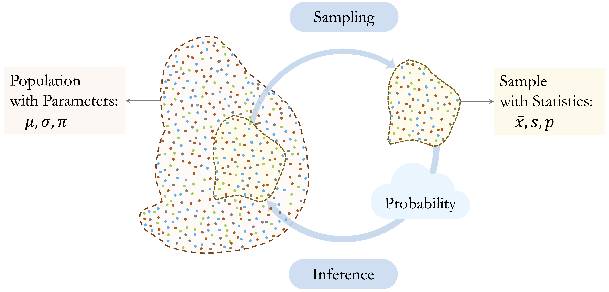
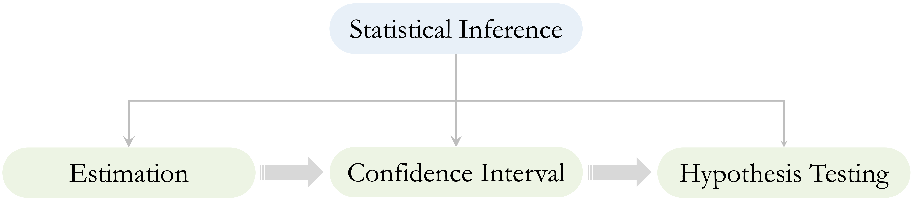
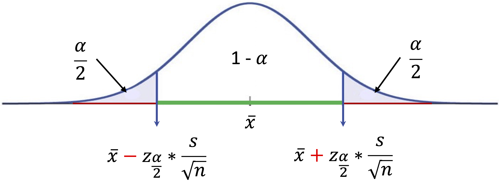
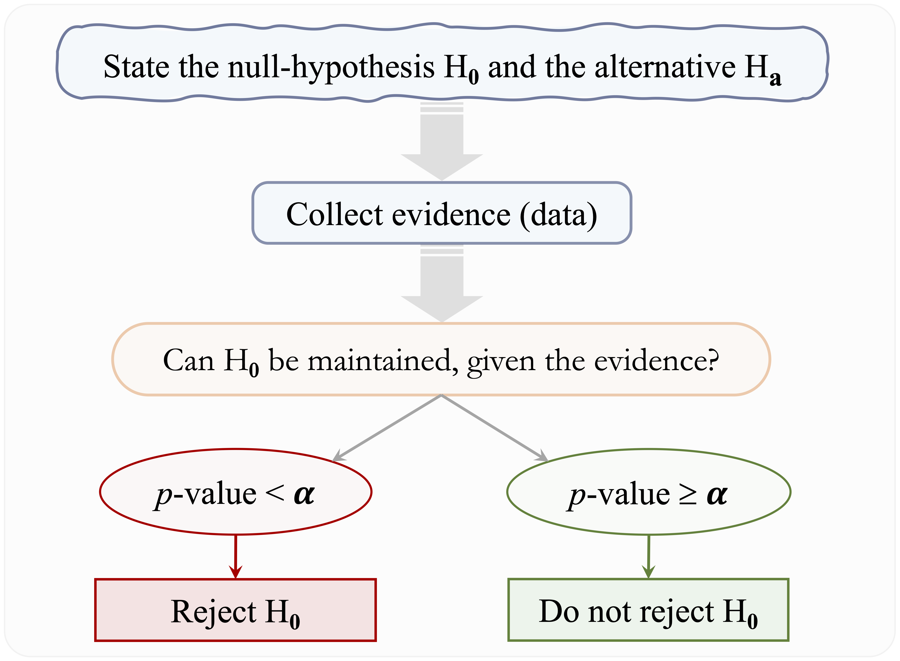
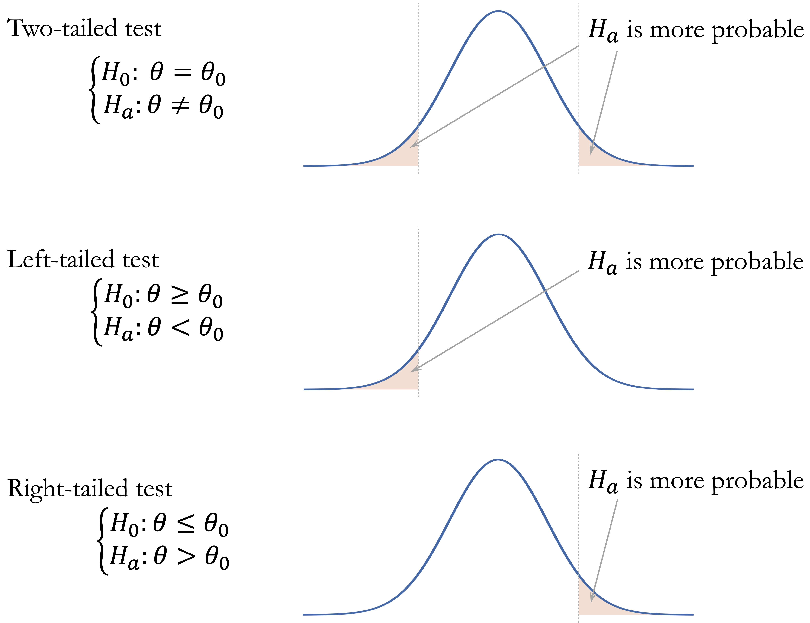
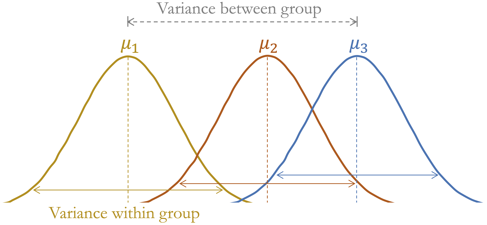

```{r echo=FALSE, message=FALSE, warning=FALSE}
source("_common.R")
```

# Statistical Inference and Hypothesis Testing {#sec-ch5-statistics}

::: {.content-visible when-format="pdf"}
\begin{chapterquote}
Statistics is the grammar of science.

\hfill — Karl Pearson
\end{chapterquote}
:::

::::: {.content-visible when-format="html"}
:::: chapterquote
Statistics is the grammar of science.

::: author
— Karl Pearson
:::
::::
:::::

Imagine a bank notices that customers who contact customer service frequently appear more likely to close their credit card accounts. Is this pattern evidence of a genuine relationship in the broader customer population, or could it simply reflect random variation in the observed data? Statistical inference addresses this central question: when does an observed pattern provide credible evidence beyond the particular sample at hand?

Statistical inference uses sample data to draw conclusions about population-level quantities and relationships. It allows us to move beyond the descriptive summaries of exploratory data analysis and to quantify uncertainty in a principled way. In practice, inference helps answer questions such as: *What proportion of customers are likely to churn?* *Do churners make more service contacts on average than non-churners?* and *How much uncertainty surrounds these estimates?*

In Chapter [-@sec-ch4-EDA], we examined the `churn` dataset and identified several patterns, including higher churn among customers with more frequent service contacts or lower spending levels. Exploratory data analysis can reveal such patterns, but it cannot by itself determine whether they reflect broader population-level relationships. This chapter introduces point estimation, confidence intervals, and hypothesis testing as tools for evaluating evidence, quantifying uncertainty, and preparing for the modeling decisions developed in Chapter [-@sec-ch6-data-setup].

### What This Chapter Covers {.unnumbered .unlisted}

This chapter introduces the main ideas of statistical inference and shows how they help us evaluate patterns observed in data. We begin with point estimation, where sample statistics are used to estimate unknown population parameters. We then introduce confidence intervals as a way to quantify uncertainty around these estimates.

The chapter then develops the logic of hypothesis testing, including null and alternative hypotheses, significance levels, *p*-values, Type I and Type II errors, statistical power, and the distinction between one-tailed and two-tailed tests. These ideas provide the foundation for deciding whether observed differences or associations are plausible evidence of broader population-level patterns.

Finally, the chapter applies common inferential methods in R, including tests for means, proportions, categorical associations, group comparisons, and correlations. Throughout the chapter, emphasis is placed not only on carrying out the calculations, but also on interpreting uncertainty, distinguishing statistical significance from practical relevance, and using inference carefully within the broader data science workflow.

## Statistical Inference: From Samples to Populations

When we analyze a dataset such as `churn`, we observe information about a particular group of customers. However, the aim is usually broader than describing only those observed customers. We often want to draw conclusions about the larger customer population that the data are intended to represent. For example, we may ask whether the observed churn rate is a reliable estimate of the population churn rate, or whether customers with frequent service contacts tend to churn more often in the broader population.

Statistical inference provides the framework for reasoning from sample data to population-level conclusions. Because we rarely observe an entire population, we must use partial information and account for the uncertainty this creates. Probability provides the language for quantifying this uncertainty, as illustrated in Figure [-@fig-inference].

```{r fig-inference, echo=FALSE, out.width="100%", fig.cap = "A conceptual overview of statistical inference. A sample is drawn from a population, sample statistics such as $\\bar{x}$, $s$, and $p$ are computed from the sample, and inference uses these statistics to learn about unknown population parameters such as $\\mu$, $\\sigma$, and $\\pi$."}

```

A crucial assumption underlying statistical inference is that the data meaningfully represent the population of interest. In classical settings, this is achieved through random sampling, where each member of the population has a known and non-zero probability of being included in the sample. Random sampling does not remove variability, but it reduces the risk that observed differences are mainly caused by systematic selection bias. In many data science applications, datasets are observational rather than collected through carefully controlled sampling designs. The same principle still applies: conclusions are credible only to the extent that the data reasonably reflect the population about which we want to make claims.

Sampling variability is central to inference. If we were to collect another sample from the same population, the numerical summaries would almost certainly be different. The sample mean, sample standard deviation, and sample proportion would vary from one sample to another, even if the underlying population remained unchanged. Statistical inference acknowledges this variability and provides methods for assessing how much confidence we should place in conclusions drawn from one observed dataset.

To express this distinction formally, we distinguish between population parameters and sample statistics. Population parameters are fixed but unknown quantities, such as $\mu$ for a population mean, $\sigma$ for a population standard deviation, and $\pi$ for a population proportion. Sample statistics are computed from observed data and are used to estimate these unknown quantities. We write $\bar{x}$ for a sample mean, $s$ for a sample standard deviation, and $p$ for a sample proportion. The aim of inference is to use sample statistics such as $\bar{x}$ and $p$ to learn about population parameters such as $\mu$ and $\pi$.

The methods in this chapter rely on probability distributions to describe how sample statistics vary across repeated samples. For example, the $t$-distribution is used when estimating a population mean with unknown population variability, while chi-square-based methods are used for several tests involving categorical data. These distributions provide the foundation for the confidence intervals and hypothesis tests introduced later in the chapter.

Within the Data Science Workflow, inference helps us move from exploratory patterns to evidence-based conclusions. Exploratory data analysis may suggest that customers with many service contacts (`contacts_count_12`) churn more often, but inference asks whether such a pattern is likely to reflect a broader population-level relationship or could plausibly arise from random variation. This distinction is essential: a statistically significant result is meaningful only when the data are relevant to the question and the assumptions behind the analysis are reasonable.

Statistical inference is organized around three connected ideas, shown in Figure [-@fig-stat-inference-pillars]. Point estimation provides numerical estimates of unknown population parameters. Confidence intervals quantify uncertainty around those estimates. Hypothesis testing provides a structured framework for evaluating whether observed patterns offer credible evidence against a specified baseline claim.

```{r fig-stat-inference-pillars, echo=FALSE, out.width="95%", fig.cap = "Three connected components of statistical inference: point estimation, confidence intervals, and hypothesis testing. Point estimation summarizes the sample, confidence intervals quantify uncertainty, and hypothesis testing evaluates evidence against a specified claim."}

```

These components build on one another. Point estimation gives an initial summary, confidence intervals express the associated uncertainty, and hypothesis testing formalizes decisions about statistical evidence. The remainder of this chapter introduces each component in turn, beginning with point estimation and progressing through confidence intervals and hypothesis testing, supported by practical implementation in R.

## Point Estimates and Sampling Variability

Statistical inference often begins with estimation. After exploring a dataset, we usually want to use its numerical summaries to learn about the broader population that the data are intended to represent. In Chapter [-@sec-ch4-EDA], the `churn` dataset was used to describe patterns in customer behavior, including service contacts, transaction amounts, and churn status. In this section, we reinterpret such summaries as estimates of population parameters, such as the average number of customer service contacts, the mean annual transaction amount, and the proportion of customers who churn.

Because we rarely have access to the entire population, we rely on point estimates computed from sample data. A population parameter is fixed but unknown, whereas a sample statistic is observable and varies from sample to sample. A point estimate is a single numerical value that serves as an estimate of a population parameter. For example, the sample mean estimates the population mean, and the sample proportion estimates the population proportion.

To illustrate, consider the proportion of customers who churn in the `churn` dataset:

```{r}
library(liver)
data(churn)

churn_rate = mean(churn$churn == "yes")
churn_rate
```

The resulting value, `r round(churn_rate, 2)`, provides a sample-based estimate of the population proportion of churners. Using the notation introduced earlier, this value is the sample proportion $p$, which estimates the unknown population proportion $\pi$.

Similarly, we can estimate the average annual transaction amount across all customers:

```{r}
mean_transaction = mean(churn$transaction_amount_12)
mean_transaction
```

The computed mean, `r round(mean_transaction, 2)`, serves as a point estimate of the corresponding population mean $\mu$. Both examples illustrate the same principle: a statistic calculated from the observed data is used to estimate an unknown quantity in the population.

A point estimate is useful because it gives a concise numerical summary, but it does not tell us how precise that estimate is. If we had observed a different sample from the same customer population, the churn rate and average transaction amount would probably not be exactly the same. This sample-to-sample variation is called *sampling variability*, and it is the reason statistical inference must go beyond reporting a single number.

For example, the observed mean transaction amount is only one estimate of the population mean. Another sample of customers might produce a slightly higher or lower mean, even if it came from the same underlying population. This does not make the estimate wrong; it means that the estimate is uncertain. The next section introduces confidence intervals, which provide a systematic way to express this uncertainty around point estimates.

> *Practice:* Estimate the average annual transaction amount among customers who churn (`churn == "yes"`) in the `churn` dataset by first subsetting the data and then computing the sample mean of `transaction_amount_12`. How does this estimate compare to the overall average computed above? What question might this difference raise about the spending behavior of churned customers?

## Confidence Intervals: Quantifying Uncertainty {#sec-ch5-confidence-interval}

While point estimates provide useful summaries, they do not indicate how precise those estimates are. A single number does not show how much an estimate might vary across different samples. Without accounting for this variability, we risk interpreting random fluctuations as meaningful patterns. Confidence intervals address this limitation by providing a principled way to express uncertainty around point estimates.

Confidence intervals express the uncertainty associated with estimating population parameters. Rather than reporting only a point estimate, such as “the average annual transaction amount in the `churn` dataset is \$4,404,” a confidence interval might report a range such as \$4,337 to \$4,470. This interval gives a range of plausible values for the population mean and reflects the sampling variability that arises whenever conclusions are drawn from a sample rather than from the entire population.

A confidence interval should not be interpreted as a probability statement about the fixed population parameter. For example, a 95 percent confidence interval does not mean that there is a 95 percent probability that the population mean lies inside the particular interval computed from the observed data. Instead, it means that if we repeatedly drew samples in the same way and constructed an interval from each sample using the same method, about 95 percent of those intervals would contain the population mean, assuming the conditions used to construct the interval are satisfied.

At its core, a confidence interval has a simple structure:
$$
\text{Point Estimate} \pm \text{Margin of Error}.
$$

The margin of error quantifies the uncertainty surrounding the estimate and can be written as:
$$
\text{Margin of Error} = \text{Critical Value} \times \text{Standard Error}.
$$

The standard error measures how much a statistic is expected to vary from sample to sample. The critical value determines how wide the interval must be to achieve a chosen confidence level, such as 95 percent. Together, these components translate sampling variability into an interpretable range of plausible values. We now develop confidence intervals for two fundamental population parameters: a population mean and a population proportion.

### Confidence Interval for a Population Mean {.unnumbered .unlisted}

Suppose we wish to estimate the average annual transaction amount in the customer population represented by the `churn` dataset. Let $\mu$ denote the unknown population mean and $\bar{x}$ the sample mean. A confidence interval for $\mu$ uses the sample mean as the point estimate and then adds a margin of error to reflect sampling variability.

For a sample of size $n$ with sample standard deviation $s$, the estimated standard error of the sample mean is
$$
\frac{s}{\sqrt{n}}.
$$
This expression reveals two important ideas. Larger samples reduce uncertainty because the denominator $\sqrt{n}$ increases as $n$ grows. Conversely, greater variability in the data increases uncertainty, since a larger value of $s$ produces a wider interval.

To construct a confidence interval, we multiply the standard error by a critical value, which determines how wide the interval must be to achieve a chosen confidence level. For example, a 95 percent confidence level requires a multiplier large enough so that, in repeated sampling, approximately 95 percent of intervals constructed in this way contain the population mean.

When the population standard deviation $\sigma$ is unknown, which is almost always the case in practice, we use the $t$-distribution. For a confidence level of $1-\alpha$, the confidence interval for the population mean is
$$
\bar{x} \pm t_{\frac{\alpha}{2}, n-1}\left(\frac{s}{\sqrt{n}}\right),
$$
where $t_{\frac{\alpha}{2}, n-1}$ denotes the positive critical value from the $t$-distribution with $n-1$ degrees of freedom, leaving an upper-tail probability of $\alpha/2$. Although the notation may appear technical, the structure remains intuitive: estimate $\pm$ (multiplier $\times$ uncertainty). The width of the interval reflects the combined influence of sample size, variability, and the chosen confidence level.

This interval assumes that the observations are independent and that the sampling distribution of the sample mean is approximately normal. These conditions are reasonable when the original data are approximately normal or when the sample size is sufficiently large. Figure [-@fig-confidence-interval] provides a visual representation of a confidence interval for a population mean.

```{r fig-confidence-interval, echo = FALSE, out.width = "80%", fig.cap = "Confidence interval for a population mean. The interval is centered around the sample mean, and its width is determined by the margin of error. The confidence level describes the long-run proportion of intervals constructed by this method that contain the population mean."}

```

The $t$-distribution closely resembles the standard normal distribution but accounts for additional uncertainty introduced when $\sigma$ is estimated from the data. If $\sigma$ were known, the interval would instead be
$$
\bar{x} \pm z_{\frac{\alpha}{2}}\left(\frac{\sigma}{\sqrt{n}}\right),
$$
where $z_{\frac{\alpha}{2}}$ denotes the positive standard normal critical value leaving an upper-tail probability of $\alpha/2$. Because $\sigma$ is rarely known, the $t$-distribution is typically used. For large sample sizes, the $t$-distribution approaches the normal distribution, and the resulting intervals are nearly identical.

Statistical software computes the necessary quantities automatically. To construct a 95 percent confidence interval for the average annual transaction amount in the `churn` dataset, we use:

```{r}
t_result = t.test(churn$transaction_amount_12, conf.level = 0.95)
t_result$conf.int
```

The `t.test()` function in R performs a $t$-test and also returns a confidence interval for the population mean. Here, we use it only to compute the 95 percent confidence interval for the average annual transaction amount. The argument `conf.level = 0.95` specifies the desired confidence level, while the function determines the standard error and the appropriate $t$ critical value from the data. The same function will be used later in Sections [-@sec-ch5-one-sample-t-test] and [-@sec-ch5-two-sample-t-test] to test hypotheses about population means.

The resulting interval gives a range of plausible values for the population mean annual transaction amount, under the assumptions of the method. It should not be interpreted as saying that there is a 95 percent probability that $\mu$ lies inside this particular interval. The population mean is fixed; the interval varies from sample to sample.

> *Practice:* Construct a 95 percent confidence interval for the average annual transaction amount among customers who churn (`churn == "yes"`) in the `churn` dataset by first subsetting the data and then applying `t.test()` with `conf.level = 0.95`. Compare the resulting interval with the overall confidence interval computed above. How does the average transaction amount among churned customers differ from the overall average, and how might differences in sample size or variability influence the width of the interval?

### Confidence Interval for a Population Proportion {.unnumbered .unlisted}

Suppose we wish to estimate the overall churn rate in the customer population. From the `churn` dataset, we can compute the sample proportion of customers who churn. As with the sample mean, however, this estimate is subject to sampling variability. A different sample of customers might produce a slightly different churn rate.

Let $\pi$ denote the unknown population proportion of customers who churn, and let $p$ denote the sample proportion computed from the data. For sufficiently large samples, the sampling distribution of $p$ is approximately normal. A common rule of thumb is that both $np$ and $n(1-p)$ should be at least 5, or more conservatively at least 10, to justify this approximation. Under this condition, the estimated standard error of the sample proportion is
$$
\sqrt{\frac{p(1-p)}{n}}.
$$
A confidence interval for the population proportion is therefore based on
$$
p \pm z_{\frac{\alpha}{2}} \sqrt{\frac{p(1-p)}{n}},
$$
where $z_{\frac{\alpha}{2}}$ is the positive standard normal critical value corresponding to the chosen confidence level. The structure is the same as before: point estimate plus or minus a margin of error.

To construct a 95 percent confidence interval for the proportion of customers who churn in the `churn` dataset, we use:

```{r}
prop_result = prop.test(
  x = sum(churn$churn == "yes"),
  n = nrow(churn),
  conf.level = 0.95
)

prop_result$conf.int
```

The `prop.test()` function computes the interval automatically using a normal approximation with a continuity correction by default. The resulting interval provides a range of plausible values for the population churn rate.

As with the confidence interval for a mean, interpretation requires care. A 95 percent confidence interval for $\pi$ does not imply that there is a 95 percent probability that the population proportion lies within this specific interval. Rather, it means that if we repeatedly drew samples of the same size and constructed intervals in the same way, approximately 95 percent of those intervals would contain the population proportion, assuming the conditions behind the method are satisfied. The width of the interval depends on both the sample size and the variability in the binary outcome. Larger samples produce narrower intervals, reflecting greater precision.

> *Practice:* Construct a 90 percent confidence interval for the proportion of customers who churn by setting `conf.level = 0.90` in `prop.test()`. Compare its width with the 95 percent interval. Which interval is narrower, and why? What does this comparison show about the trade-off between confidence level and precision?

Confidence intervals also help prepare the ground for hypothesis testing. They provide a range of plausible values for a population parameter and make uncertainty visible before we make a formal decision about a statistical claim. In the next section, we turn from estimating parameters to testing whether observed differences or associations provide evidence against a specified baseline assumption.


## Hypothesis Testing: Evaluating Statistical Evidence

Suppose a bank introduces a new customer service protocol and randomly applies it to a subset of customers. After several months, analysts observe that the treated group has a slightly lower churn rate than the untreated group. Does this difference provide evidence that the protocol reduced churn, or could it simply reflect natural sampling variability?

Hypothesis testing provides a structured framework for evaluating such questions. While confidence intervals quantify uncertainty around an estimate, hypothesis testing asks whether the observed data provide sufficient evidence to challenge a specific claim about the population. The starting point is usually a default assumption, such as no difference between two groups or no association between two variables.

Within the Data Science Workflow, hypothesis testing helps move from exploratory patterns to formal statistical conclusions. In Chapter [-@sec-ch4-EDA-churn], exploratory analysis suggested that churn may be related to customer spending and service contacts. Hypothesis testing allows us to assess whether such patterns are statistically credible, while still requiring careful interpretation of assumptions, effect size, and practical relevance.

### Null and Alternative Hypotheses {.unnumbered .unlisted}

At its core, hypothesis testing begins with a default assumption about the population and evaluates whether the observed data provide enough evidence to question it. This default assumption is called the null hypothesis, denoted by $H_0$. It typically represents no difference, no association, or equality of population parameters. The competing statement is the alternative hypothesis, denoted by $H_a$, which represents the claim that the population differs from the null hypothesis in some specified way.

The logic proceeds by temporarily assuming that $H_0$ is true. Under this assumption, we ask: *If there were truly no difference or no association in the population, how likely would we be to observe data as extreme as those obtained?* When the observed data would be very unlikely under $H_0$, this casts doubt on the null hypothesis. When the data are consistent with what we would expect under $H_0$, we do not have strong evidence against it.

This reasoning is indirect but deliberate. Hypothesis testing does not prove that $H_a$ is true. Instead, it evaluates how compatible the observed data are with a clearly specified baseline claim. A test therefore provides evidence against $H_0$, rather than proof of the alternative hypothesis. This distinction is essential for interpreting statistical results carefully.

> *Practice:* Consider the claim that the average number of customer service contacts is 2. Formulate the null and alternative hypotheses for testing whether the true average differs from this value. Clearly state which hypothesis represents the default assumption.

### The p-value and Significance Level {.unnumbered .unlisted}

The *p*-value measures how unusual the observed result is under the null hypothesis. More precisely, it is the probability of obtaining a result at least as extreme as the one observed, assuming that $H_0$ is true. A small *p*-value indicates that the observed result would be unlikely under $H_0$, and therefore provides evidence against the null hypothesis.

To build intuition, suppose $H_0$ states that there is no difference in churn rates between two customer groups. If this assumption were true, any observed difference in sample churn rates would arise from random variation. Small differences would be common, whereas very large differences would be rare. The *p*-value answers the question: *If there were truly no difference in the population, how likely would we be to observe a difference at least as large as the one in the sample?*

A *p*-value should not be interpreted as the probability that $H_0$ is true. It is a probability about the observed result under the assumption that $H_0$ is true, not a probability that the hypothesis itself is true. A small *p*-value provides evidence against $H_0$, but it does not show that the effect is large or practically important. Conversely, a large *p*-value indicates that the observed result is compatible with $H_0$, but it does not prove that $H_0$ is true.

To make decisions systematic and transparent, we compare the *p*-value with a pre-specified threshold known as the significance level, denoted by $\alpha$. A common choice is $\alpha = 0.05$, although other values may be appropriate depending on the context. The significance level is chosen before examining the result and controls the long-run probability of incorrectly rejecting a true null hypothesis, a Type I error discussed more fully in the next subsection.

The decision rule is straightforward: reject $H_0$ if the *p*-value is less than $\alpha$. If the *p*-value is greater than or equal to $\alpha$, we do not reject $H_0$. We avoid saying that we “accept” $H_0$, because failing to reject the null hypothesis means only that the data do not provide strong enough evidence against it. Figure [-@fig-hypothesis-testing] summarizes this decision process.

```{r fig-hypothesis-testing, echo=FALSE, out.width="75%", fig.cap = "Decision process in hypothesis testing. After stating $H_0$ and $H_a$ and collecting data, the p-value is compared with the significance level $\\alpha$ to decide whether the evidence is strong enough to reject $H_0$."}

```

To illustrate this logic, suppose we test whether the average account tenure differs from 36 months, using the hypotheses
$$
\begin{cases}
H_0: \mu = 36 \\
H_a: \mu \neq 36.
\end{cases}
$$
Assume that a one-sample $t$-test produces a *p*-value of $0.03$. If we set $\alpha = 0.05$, we reject $H_0$ because $0.03 < 0.05$. The observed result would be relatively unlikely under the assumption that the true mean equals 36 months. If instead we choose $\alpha = 0.01$, we do not reject $H_0$, since $0.03 > 0.01$. The same result can therefore lead to different decisions depending on the pre-specified tolerance for error.

This example highlights two important principles. First, hypothesis testing is based on controlled risk rather than certainty. Second, conclusions depend jointly on the observed evidence, the chosen significance level, and the practical importance of the effect being studied.

> *Practice:* Suppose a hypothesis test yields a *p*-value of 0.08. At a significance level of $\alpha = 0.05$, what decision would you make? Does this result prove that the null hypothesis is true? Explain your reasoning in words.

### Decision Errors and Statistical Power {.unnumbered .unlisted}

Because hypothesis testing relies on sample data rather than the entire population, decisions are subject to uncertainty. Even when the testing procedure is applied correctly, two types of error are possible.

A Type I error occurs when we reject $H_0$ even though it is true. In practical terms, this means concluding that a difference or association exists when, in reality, it does not. The probability of making a Type I error is controlled by the significance level $\alpha$, which is chosen before conducting the test. For example, setting $\alpha = 0.05$ means that, when $H_0$ is true and the test assumptions hold, the long-run probability of incorrectly rejecting $H_0$ is 5 percent.

A Type II error occurs when we do not reject $H_0$ even though it is false. In this case, a genuine difference or association exists in the population, but the sample does not provide sufficient evidence to detect it. The probability of making a Type II error is denoted by $\beta$.

These two errors represent different risks. Reducing $\alpha$ makes it harder to reject $H_0$, which lowers the risk of a Type I error but can increase the risk of a Type II error. In practice, hypothesis testing therefore involves a trade-off between being too quick to declare an effect and being too cautious to detect one.

A related concept is statistical power, defined as
$$
\text{Power} = 1 - \beta.
$$
Power is the probability of correctly rejecting $H_0$ when it is false, for a specified alternative or true effect size. It depends on several factors, including the sample size, the variability in the data, the significance level, and the size of the true effect. Larger samples, lower variability, and larger true effects generally increase power, because they make genuine differences easier to detect. Small samples or highly variable data reduce power, making it harder to distinguish signal from noise.

Table [-@tbl-hypothesis-errors] summarizes the possible outcomes of hypothesis testing according to whether $H_0$ is true or false. This summary reinforces an important point: hypothesis testing does not eliminate uncertainty but provides a structured way to manage the risks of different statistical decisions. The appropriate balance between Type I and Type II errors depends on the context. In some applications, false alarms are costly; in others, failing to detect a real effect may be the more serious mistake.

::: {#tbl-hypothesis-errors .table}
| Decision            | Reality: $H_0$ is true  | Reality: $H_0$ is false |
|---------------------|-------------------------|-------------------------|
| Do not reject $H_0$ | Correct decision        | Type II error ($\beta$) |
| Reject $H_0$        | Type I error ($\alpha$) | Correct decision        |

Possible decision outcomes in hypothesis testing, depending on whether $H_0$ is true or false.
:::

### One-Tailed and Two-Tailed Tests {.unnumbered .unlisted}

The form of a hypothesis test is determined by the research question and, more specifically, by the alternative hypothesis. Sometimes we want to know whether a parameter differs from a specified value in either direction. In other cases, we are interested only in detecting a deviation in one particular direction.

A two-tailed test is used when deviations in both directions are relevant. The alternative hypothesis has the form $H_a: \theta \neq \theta_0$. For example, we may wish to assess whether the average annual transaction amount differs from \$4,000, without specifying whether it is higher or lower. A left-tailed test is used when the alternative hypothesis is $H_a: \theta < \theta_0$, such as testing whether the average number of months on book is less than 24 months. A right-tailed test is used when the alternative hypothesis is $H_a: \theta > \theta_0$, such as testing whether the churn rate is greater than 30 percent.

The alternative hypothesis determines which outcomes are considered “at least as extreme” as the observed test statistic and therefore how the *p*-value is computed. Under $H_0$, the *p*-value is calculated as a tail area under the sampling distribution of the test statistic. In a two-tailed test, values far from what is expected under $H_0$ in either direction provide evidence against the null hypothesis. In a left-tailed test, only unusually small values contribute to the *p*-value, whereas in a right-tailed test, only unusually large values do. Figure [-@fig-p-value] visualizes these three cases.

```{r fig-p-value, echo=FALSE, out.width="75%", fig.cap = "Tail areas used to compute p-values for two-tailed, left-tailed, and right-tailed tests. Under the sampling distribution of the test statistic when $H_0$ is true, the shaded region represents outcomes at least as extreme as the observed test statistic in the direction or directions specified by $H_a$."}

```

There is also a close relationship between hypothesis tests and confidence intervals, provided that both are based on the same assumptions. For a two-tailed test at significance level $\alpha$, rejecting $H_0: \theta = \theta_0$ is equivalent to finding that $\theta_0$ lies outside the corresponding two-sided $(1 - \alpha)$ confidence interval. For one-tailed tests, the analogous relationship involves one-sided confidence bounds rather than the usual two-sided interval.

The choice between a one-tailed and two-tailed test must be made before examining the data. Choosing the direction after seeing the results invalidates the interpretation of the *p*-value, because it uses the data both to define the hypothesis and to test it. For this reason, two-tailed tests are often preferred unless the research question clearly justifies a directional alternative in advance. With these general principles in place, we can next consider how to match common inferential questions to appropriate statistical tests.

## Choosing an Appropriate Hypothesis Test {#sec-ch5-choosing-test}

The general logic of hypothesis testing is similar across many statistical procedures: state $H_0$ and $H_a$, usually compute a test statistic, obtain a *p*-value, and interpret the result in context. What changes from one problem to another is the specific test used to evaluate the evidence. Choosing an appropriate test requires matching the research question to the structure of the data.

A useful starting point is to distinguish between numerical and categorical variables. Questions about population means usually lead to t-tests or analysis of variance, depending on the number of groups and whether the observations are independent or paired. Questions about proportions or associations between categorical variables lead to proportion tests or chi-square tests. Questions about linear association between two numerical variables are commonly addressed using a correlation test. Table [-@tbl-hypothesis-test] summarizes these common choices.

::: {#tbl-hypothesis-test .table}
| Test | Null hypothesis ($H_0$) | Typical setting |
|---|---|---|
| One-sample t-test | $H_0: \mu = \mu_0$ | One numerical variable |
| One-sample Proportion Test | $H_0: \pi = \pi_0$ | One binary categorical variable |
| Two-sample t-test | $H_0: \mu_1 = \mu_2$ | Numerical outcome and two independent groups |
| Paired t-test | $H_0: \mu_d = 0$ | Numerical paired observations or matched pairs |
| Two-sample Z-test | $H_0: \pi_1 = \pi_2$ | Binary outcome and two independent groups |
| Chi-square Test | $H_0$: the variables are independent | Two categorical variables |
| Analysis of Variance (ANOVA) | $H_0: \mu_1 = \cdots = \mu_k$ | Numerical outcome and a categorical group with three or more levels |
| Correlation Test | $H_0: \rho = 0$ | Two numerical variables |

Common hypothesis tests, their corresponding null hypotheses, and typical data settings.
:::

The table should be used as a guide rather than a mechanical rule. In practice, the selected test must also be compatible with the study design, sample size, distributional assumptions, independence assumptions, and measurement scale of the variables. The remainder of this chapter applies these tests to concrete examples, emphasizing both implementation in R and interpretation in context.

## One-sample t-test {#sec-ch5-one-sample-t-test}

Suppose a bank uses 36 months as a benchmark for typical customer account tenure. Has customer behavior changed in recent years? Is the average tenure of customers still consistent with this benchmark, or does the observed data suggest a meaningful departure from it? The one-sample t-test provides a principled way to evaluate such questions.

The one-sample t-test assesses whether the mean of a numerical variable in a population equals a specified value. It is commonly used when organizations compare sample evidence with a theoretical expectation, historical average, or operational benchmark. Because the population standard deviation is usually unknown, the test statistic follows a $t$-distribution, which accounts for the additional uncertainty introduced by estimating variability from the sample.

The form of the hypotheses depends on the research question. For a two-sided test, the hypotheses are
$$
\begin{cases}
H_0: \mu = \mu_0 \\
H_a: \mu \neq \mu_0.
\end{cases}
$$
If interest lies in detecting a decrease, the alternative becomes $H_a: \mu < \mu_0$, whereas to detect an increase, it becomes $H_a: \mu > \mu_0$.

To illustrate, we return to the `churn` dataset. The variable `months_on_book` records how long a customer has been associated with the bank. We now assess whether the average account tenure differs from the benchmark value of 36 months at the 5 percent significance level ($\alpha = 0.05$). The hypotheses are
$$
\begin{cases}
H_0: \mu = 36 \\
H_a: \mu \neq 36.
\end{cases}
$$

We conduct the test in R as follows:

```{r}
t_test <- t.test(churn$months_on_book, mu = 36)
t_test
```

The output reports the test statistic, degrees of freedom, the *p*-value, and a 95 percent confidence interval for the population mean. The *p*-value is `r round(t_test$p.value, 2)`, which exceeds $\alpha = 0.05$. We therefore do not reject $H_0$. This means that the observed data do not provide sufficient evidence that the average tenure differs from 36 months. It does not prove that the true population mean is exactly 36 months.

The 95 percent confidence interval is (`r round(t_test$conf.int[1], 2)`, `r round(t_test$conf.int[2], 2)`). Because 36 lies within this interval, the confidence interval leads to the same conclusion as the hypothesis test. The sample mean is `r round(t_test$estimate, 2)` months, which serves as our point estimate of the population mean. Together, the *p*-value and confidence interval suggest that the observed average tenure is consistent with the 36-month benchmark, within the uncertainty expected from sampling variability.

From a practical perspective, the size of any difference should also be considered. Even if a very small difference from 36 months were statistically significant in a large dataset, it might have limited operational relevance. A difference of several months, by contrast, could have clearer implications for retention strategy, customer engagement, or lifecycle analysis. The one-sample t-test therefore provides a structured method for comparing a sample mean with a fixed benchmark, but effective interpretation requires attention to the *p*-value, the confidence interval, and the practical importance of the observed difference.

> *Practice:* Test whether the average account tenure of customers is less than 36 months. Formulate the hypotheses and conduct a left-tailed test using `t.test()` with the option `alternative = "less"`. Interpret the result at $\alpha = 0.05$.

## One-sample Proportion Test {#sec-ch5-one-sample-proportion-test}

Suppose a bank expects that 15 percent of its credit card customers churn each year. Has the observed churn rate changed from this benchmark? Are recent retention strategies associated with a lower churn rate, or is the observed difference small enough to be explained by sampling variability? These questions arise whenever the outcome of interest is binary, such as churn versus no churn, default versus no default, or subscription versus no subscription.

A one-sample proportion test evaluates whether the population proportion $\pi$ of a particular outcome equals a hypothesized value $\pi_0$. It is used for binary categorical variables, where each observation belongs to one of two categories. In the `churn` dataset, for example, the response variable `churn` records whether a customer churned (`"yes"`) or did not churn (`"no"`).

Suppose we want to test whether the churn rate in the population differs from the bank’s benchmark value of 15 percent. For a two-sided test, the hypotheses are
$$
\begin{cases}
H_0: \pi = 0.15 \\
H_a: \pi \neq 0.15.
\end{cases}
$$
Here, $\pi$ denotes the population proportion of customers who churn, and $0.15$ is the benchmark value specified under the null hypothesis.

We conduct the one-sample proportion test in R as follows:

```{r}
prop_test = prop.test(
  x = sum(churn$churn == "yes"),
  n = nrow(churn),
  p = 0.15
)

prop_test
```

In this code, `x` is the number of customers who churned, `n` is the total number of customers in the sample, and `p = 0.15` specifies the hypothesized population proportion under $H_0$. The function `prop.test()` uses a chi-square approximation to test whether the observed sample proportion differs from the hypothesized value. By default, it also reports a confidence interval for the population proportion.

The output provides the *p*-value, a 95 percent confidence interval, and the observed sample proportion. The *p*-value is `r round(prop_test$p.value, 3)`, which is less than $\alpha = 0.05$. We therefore reject $H_0$ and conclude that the observed data provide statistical evidence that the population churn rate differs from 15 percent.

The 95 percent confidence interval for the population proportion is (`r round(prop_test$conf.int[1], 3)`, `r round(prop_test$conf.int[2], 3)`). Since this interval does not contain $0.15$, the confidence interval leads to the same conclusion as the hypothesis test. The observed sample proportion is `r round(prop_test$estimate, 3)`, which serves as the point estimate of the population churn rate.

From a practical perspective, rejecting $H_0$ tells us that the observed churn rate is statistically different from the 15 percent benchmark, but it does not by itself determine whether the difference is operationally important. The estimated proportion and confidence interval should be examined alongside business context, such as the cost of customer loss, the size of the customer base, and the expected impact of retention interventions. The one-sample proportion test therefore provides a structured way to compare a binary outcome with a fixed benchmark, while still requiring practical judgment when interpreting the result.

> *Practice:* Test whether the proportion of churned customers exceeds 15 percent. Formulate the hypotheses and conduct a right-tailed one-sample proportion test using `prop.test()` with the option `alternative = "greater"`. Interpret the result at $\alpha = 0.05$.

## Two-sample t-test {#sec-ch5-two-sample-t-test}

Do customers who churn have different credit limits from customers who remain active? If so, how large is the difference, and is it supported by statistical evidence rather than random variation alone? The two-sample t-test provides a statistical method for comparing the means of a numerical variable across two independent groups.

The two-sample t-test assesses whether two population means are equal. It is appropriate when the outcome variable is numerical and the grouping variable has two independent categories. Because the population standard deviations are usually unknown, the test uses a $t$-distribution to account for the uncertainty introduced by estimating variability from the sample.

In Section [-@sec-EDA-sec-numeric], we examined the distribution of total credit limit (`credit_limit`) for churners and non-churners using visual summaries. These plots suggested that customers who churn may have somewhat lower credit limits than those who remain active. We now assess whether this observed difference is statistically significant.

Let $\mu_{\text{yes}}$ denote the population mean credit limit for customers who churn and $\mu_{\text{no}}$ the population mean credit limit for customers who do not churn. For a two-sided test, the hypotheses are
$$
\begin{cases}
H_0: \mu_{\text{yes}} = \mu_{\text{no}} \\
H_a: \mu_{\text{yes}} \neq \mu_{\text{no}}.
\end{cases}
$$
The null hypothesis states that the average credit limit is the same in the two customer populations, while the alternative hypothesis states that the two averages differ.

Before interpreting the test output, it is useful to compute the group means explicitly. This avoids relying on the order in which R reports group estimates, which may depend on the ordering of factor levels.

```{r}
credit_means <- aggregate(credit_limit ~ churn, data = churn, mean)
credit_means
```

We then apply the two-sample t-test using the formula syntax `credit_limit ~ churn`, which instructs R to compare credit limits across the two churn groups:

```{r}
t_test_credit <- t.test(credit_limit ~ churn, data = churn)
t_test_credit
```

The output includes the test statistic, degrees of freedom, *p*-value, confidence interval, and estimated group means. The *p*-value is `r round(t_test_credit$p.value, 4)`, which is smaller than $\alpha = 0.05$. We therefore reject $H_0$ and conclude that the observed data provide statistical evidence that the average credit limit differs between churners and non-churners.

The group means computed above show that the average credit limit is `r round(credit_means$credit_limit[credit_means$churn == "yes"], 2)` for customers who churn and `r round(credit_means$credit_limit[credit_means$churn == "no"], 2)` for customers who do not churn. Thus, in this sample, customers who churn have a lower average credit limit. The 95 percent confidence interval reported by `t.test()` for the difference in group means is (`r round(t_test_credit$conf.int[1], 3)`, `r round(t_test_credit$conf.int[2], 3)`). Because zero is not contained in this interval, the confidence interval leads to the same conclusion as the hypothesis test.

The two-sample t-test assumes that the two groups are independent and that the numerical outcome is approximately normally distributed within each group, or that the sample sizes are large enough for the sampling distribution of the mean difference to be approximately normal. By default, R performs Welch’s t-test, which adjusts the degrees of freedom to allow for unequal variances between groups. If the data are strongly skewed or contain substantial outliers, a nonparametric alternative such as the Mann–Whitney U test may be more appropriate.

From a practical perspective, the result shows an association between churn status and credit limit, not a causal effect of credit limit on churn. Lower credit limits among churners may reflect differences in customer profile, usage behavior, risk assessment, or engagement. The finding may therefore help identify variables worth considering in later modeling, but it does not imply that changing credit limits would necessarily reduce churn. As always, practical relevance depends on the magnitude of the difference and the decision context.

> *Practice:* Test whether the average tenure (`months_on_book`) differs between churners and non-churners using `t.test(months_on_book ~ churn, data = churn)`. Before interpreting the test result, compute the group means explicitly using `aggregate()` or `tapply()`. Interpret the *p*-value, confidence interval, and practical relevance at $\alpha = 0.05$.

The two-sample t-test is appropriate when the two groups being compared are independent. This condition is essential: each observation should belong to only one group, and observations in one group should not be naturally paired with observations in the other. When the same units are measured under two conditions, such as before and after an intervention, the independence assumption no longer holds. In such cases, the paired $t$-test provides a more appropriate approach.

## Paired t-test {#sec-ch5-paired-t-test}

In many practical situations, observations occur in natural pairs. For example, we may measure the same individuals before and after a treatment, evaluate employee performance before and after training, or compare outcomes for the same customers under two conditions. Because each pair refers to the same unit of analysis, the observations are not independent. The paired $t$-test is designed for this type of data.

Unlike the two-sample $t$-test, which compares the means of two independent groups, the paired $t$-test analyzes the differences within each pair. Let $(x_{i,1}, x_{i,2})$ denote the two measurements for the $i$th unit. For each pair, we compute the difference
$$
d_i = x_{i,2} - x_{i,1}.
$$
The paired $t$-test then examines whether the population mean difference $\mu_d$ equals zero. For a two-sided test, the hypotheses are
$$
\begin{cases}
H_0: \mu_d = 0 \\
H_a: \mu_d \neq 0.
\end{cases}
$$
One-sided alternatives can also be used when the research question specifies a direction in advance.

By focusing on differences within pairs, the paired $t$-test removes part of the variability between units and isolates the within-unit change. As a result, paired designs often provide more precise inference than analyses that incorrectly treat paired observations as independent.

Because the `churn` dataset does not contain before-and-after measurements for the same customers, we use a small simulated example to illustrate the paired design. Suppose a bank launches a marketing campaign designed to encourage customers to increase their credit card usage. To evaluate the campaign, the bank records the total transaction amount for the same group of customers before and after the campaign. Since each customer is measured twice, the data form natural pairs.

Let $d = \text{after} - \text{before}$ denote the change in spending for each customer. The paired $t$-test evaluates whether the average change in spending differs from zero. The following code simulates transaction data for 100 customers:

```{r}
set.seed(42)

n <- 100

before <- rnorm(n, mean = 4000, sd = 800)
after  <- before + rnorm(n, mean = 300, sd = 500)
```

Figure [-@fig-ch5-paired-t-test-plot] visualizes the paired structure of the data. In the left panel, each line connects the spending values for a single customer before and after the campaign. The right panel shows the distribution of the differences, $\text{after} - \text{before}$, with the dashed vertical line marking zero difference. If most differences lie to the right of this line, the data suggest that spending increased for many customers.

::: {#fig-ch5-paired-t-test-plot}

```{r, echo = FALSE, out.width = "100%"}
#| layout-ncol: 2
#| fig-width: 4
#| fig-height: 4

customer <- 1:n

df <- data.frame(
  customer = rep(customer, 2),
  period = factor(
    rep(c("Before", "After"), each = n),
    levels = c("Before", "After")
  ),
  spending = c(before, after)
)

ggplot(df, aes(x = period, y = spending, group = customer)) +
  geom_line(alpha = 0.4, color = "gray50", linewidth = 0.5) +
  geom_point(size = 2, color = "#2C7FB8") +
  labs(x = "Campaign Period", y = "Transaction Amount")

diff_spending <- after - before

df_diff <- data.frame(
  customer = 1:n,
  difference = diff_spending
)

ggplot(df_diff, aes(x = difference)) +
  geom_histogram(bins = 12, fill = "#2C7FB8", color = "white", alpha = 0.8) +
  geom_vline(xintercept = 0, linetype = "dashed") +
  labs(
    x = "Difference in Transaction Amount",
    y = "Number of Customers"
  ) +
  theme_minimal()
```

Customer transaction amounts before and after a marketing campaign (left) and distribution of paired differences (right).
:::

We perform the paired $t$-test in R using the `t.test()` function with the argument `paired = TRUE`:

```{r}
paired_test <- t.test(after, before, paired = TRUE)
paired_test
```

The argument `paired = TRUE` instructs R to treat the observations as matched pairs. Internally, R computes the differences between the paired values and performs a one-sample $t$-test on those differences. The output reports the estimated mean difference, the $t$ statistic, the degrees of freedom, the *p*-value, and a confidence interval for the population mean difference.

In this simulated example, the *p*-value is `r round(paired_test$p.value, 4)`, providing strong evidence against $H_0$. We therefore conclude that the average transaction amount after the campaign is higher than before the campaign in this simulated paired sample. The confidence interval for $\mu_d$ gives a plausible range for the average change in spending and should be interpreted together with the estimated mean difference.

Paired $t$-tests are widely used when the same units are measured under two conditions, such as before-and-after studies, repeated measurements on the same subjects, or evaluations of interventions. The key requirement is that each observation in one condition has a natural counterpart in the other condition.

When the distribution of paired differences is strongly skewed, contains substantial outliers, or comes from a very small sample, a nonparametric alternative such as the Wilcoxon signed-rank test may be more appropriate. In R, this can be implemented using `wilcox.test()` with `paired = TRUE`.

> *Practice:* Conduct a one-sided paired $t$-test to evaluate whether the marketing campaign increased customer spending ($H_a: \mu_d > 0$). Use `alternative = "greater"` in `t.test()`. Compare the resulting *p*-value with the two-sided test above and explain why the values differ.

## Two-sample Z-test {#sec-ch5-two-sample-z-test}

Do male and female customers churn at different rates? When the outcome of interest is binary, such as churn versus no churn, and we want to compare proportions across two independent groups, the two-sample Z-test provides an appropriate statistical framework.

Whereas the two-sample t-test compares means of numerical variables, the two-sample Z-test evaluates whether two population proportions are equal. This makes it useful for comparing binary outcomes across groups, such as churn status across demographic categories or default status across customer segments.

In Section [-@sec-EDA-categorical], we examined churn patterns across demographic groups, including `gender`, using bar plots and proportional comparisons. Those exploratory displays suggested that churn rates may differ between male and female customers. We now use a two-sample Z-test to assess whether the observed difference in proportions is larger than we would expect from sampling variability alone.

For a two-sided comparison, the hypotheses are
$$
\begin{cases}
H_0: \pi_{\text{female}} = \pi_{\text{male}} \\
H_a: \pi_{\text{female}} \neq \pi_{\text{male}}.
\end{cases}
$$
Here, $\pi_{\text{female}}$ and $\pi_{\text{male}}$ denote the population churn proportions for the two gender groups. The null hypothesis states that the churn proportions are equal, while the alternative hypothesis states that they differ.

We first construct a contingency table with gender groups as rows and churn status as columns:

```{r}
table_gender <- table(
  churn$gender,
  churn$churn,
  dnn = c("Gender", "Churn")
)

table_gender
```

Next, we explicitly extract the number of churned customers and the total number of customers in each gender group. This makes the comparison clearer than passing the full contingency table directly to `prop.test()`:

```{r}
x_gender <- table_gender[, "yes"]
n_gender <- rowSums(table_gender)

gender_rates <- x_gender / n_gender
gender_rates
```

The object `x_gender` contains the number of churned customers in each gender group, while `n_gender` contains the corresponding group sizes. The estimated churn proportions in `gender_rates` should be used to interpret the direction and size of the observed difference.

We then apply `prop.test()` to compare the two proportions:

```{r}
z_test_gender <- prop.test(
  x = x_gender,
  n = n_gender
)

z_test_gender
```

Although this section uses the traditional name two-sample Z-test, R’s `prop.test()` reports the result using a chi-square approximation. For two independent groups, this procedure addresses the same inferential question: whether the two population proportions are equal.

The output includes the *p*-value, a confidence interval for the difference in proportions, and the estimated churn proportions for the two groups. The *p*-value is `r round(z_test_gender$p.value, 3)`, which is less than $\alpha = 0.05$. We therefore reject $H_0$ and conclude that the observed data provide statistical evidence that the churn proportions differ between the two gender groups.

The 95 percent confidence interval for the difference in proportions is (`r round(z_test_gender$conf.int[1], 3)`, `r round(z_test_gender$conf.int[2], 3)`). Because this interval does not contain zero, the confidence interval leads to the same conclusion as the hypothesis test. The named values in `gender_rates` show the estimated churn proportion for each group and should be used to interpret which group has the higher observed churn rate and how large the difference is.

From a practical perspective, a statistically significant difference in churn proportions across gender groups should be interpreted carefully. The test shows an association between gender group and churn status in the data, but it does not explain why the difference occurs. Any use of demographic variables in customer analysis should be considered alongside fairness, privacy, and business relevance. The result should also be interpreted together with the estimated proportions, confidence interval, sample sizes, and the size of the observed difference.

> *Practice:* Test whether the proportion of churned customers is higher among female customers than among male customers. Before running the test, order the counts so that the female group is first and the male group is second. Then use `prop.test()` with `alternative = "greater"` and interpret the result at $\alpha = 0.05$.

## Chi-square Test {#sec-ch5-chi-square-test}

Does customer churn vary across marital groups? More generally, are two categorical variables statistically associated, or could the observed differences in category counts be explained by sampling variability? The chi-square test provides a method for evaluating whether two categorical variables are independent.

Unlike t-tests, which compare means of numerical variables, the chi-square test examines counts in a contingency table. It compares the observed cell counts with the counts that would be expected if the two categorical variables were independent. This makes the test useful for questions involving categorical outcomes, such as whether churn status is associated with demographic or customer-profile variables.

To illustrate the method, we return to the `churn` dataset. In Section [-@sec-EDA-categorical], we explored churn across several categorical variables, including `marital`. The variable includes the categories `"divorced"`, `"married"`, `"single"`, and `"unknown"`. The `"unknown"` category should be interpreted cautiously, because it represents missing or unreported marital status rather than a substantive marital group. We now use a chi-square test to assess whether marital status and churn are statistically associated.

We first construct a contingency table with churn status as rows and marital status as columns:

```{r}
table_marital = table(churn$churn, churn$marital, dnn = c("Churn", "Marital"))
table_marital
```

The chi-square test evaluates whether churn status is independent of marital status. In this example, because churn is binary, this is equivalent to asking whether the population churn proportion is the same across marital categories. The hypotheses can therefore be written as
$$
\begin{cases}
H_0: \pi_{\text{divorced}} = \pi_{\text{married}} = \pi_{\text{single}} = \pi_{\text{unknown}} \\
H_a: \text{at least one marital category has a different churn proportion.}
\end{cases}
$$
Here, $\pi_{\text{divorced}}$, $\pi_{\text{married}}$, $\pi_{\text{single}}$, and $\pi_{\text{unknown}}$ denote the population proportions of customers who churn within the divorced, married, single, and unknown marital-status categories, respectively. Under $H_0$, the distribution of churn status is the same across marital categories, apart from differences expected from sampling variability.

We conduct the test using `chisq.test()`:

```{r}
chisq_marital = chisq.test(table_marital)
chisq_marital
```

The output reports the chi-square statistic, degrees of freedom, and *p*-value. The *p*-value is `r round(chisq_marital$p.value, 4)`, which is greater than $\alpha = 0.05$. We therefore do not reject $H_0$. This means that the sample does not provide sufficient statistical evidence of an association between marital status and churn. It does not prove that marital status and churn are independent in the population.

To check whether the chi-square approximation is appropriate, we inspect the expected frequencies under independence:

```{r}
chisq_marital$expected
```

A common rule of thumb is that expected cell counts should generally be at least 5. When expected counts are too small, the chi-square approximation may be unreliable, and Fisher’s exact test may be more appropriate. In this example, the expected counts are sufficiently large for the chi-square test to be used.

The result should also be interpreted in relation to the broader modeling goal. A non-significant chi-square test does not imply that `marital` should automatically be removed from later predictive models. The test evaluates the marginal association between marital status and churn, considering this pair of variables in isolation. Predictive models evaluate variables jointly and may capture interactions or conditional patterns that are not visible in a single univariate test. For this reason, it is premature to eliminate a predictor solely on the basis of one hypothesis test.

> *Practice:* Test whether education level is associated with churn in the `churn` dataset. Construct a contingency table, apply `chisq.test()`, inspect the expected counts, and interpret the result at $\alpha = 0.05$. For more information on the `education` variable, see Section [-@sec-EDA-categorical].

## Analysis of Variance (ANOVA) Test {#sec-ch5-anova}

So far, we have examined hypothesis tests that compare two groups, such as the two-sample t-test and the two-sample proportion test. But what if we want to compare a numerical outcome across more than two groups? For example, does average bike demand differ across seasons? When the grouping variable has three or more levels, analysis of variance (ANOVA) provides a formal way to test whether at least one group mean differs from the others.

ANOVA compares variability between group means with variability within groups. If the between-group variability is large relative to the within-group variability, the data provide evidence that not all population means are equal. The test statistic follows an $F$-distribution under the null hypothesis. Figure [-@fig-ch5-anova-concept] illustrates this idea conceptually.

```{r fig-ch5-anova-concept, echo=FALSE, out.width="65%", fig.cap="Conceptual idea behind ANOVA. The method compares variability between group means with variability within groups. Larger between-group variability relative to within-group variability provides evidence that not all population means are equal."}

```

To illustrate ANOVA in R, we use the `bike_demand` dataset from the **liver** package, which will be revisited in the regression case study in Chapter [-@sec-ch10-regression]. The response variable is `bike_count`, which records hourly bike demand, and the grouping variable is `season`. This example asks whether mean hourly bike demand differs across seasons. The comparison is useful as a simple one-factor analysis, although it should not be interpreted as a complete model of bike demand. We begin with a boxplot to compare the distribution of bike demand across seasons:

```{r}
data(bike_demand)

ggplot(data = bike_demand) + 
  geom_boxplot(aes(x = season, y = bike_count)) +
  labs(x = "Season", y = "Hourly Bike Count")
```

The boxplot suggests that bike demand varies across seasons, with higher values in summer and lower values in winter. Visual inspection, however, cannot determine whether the observed differences in group means are statistically significant. ANOVA provides a formal test of this question.

For this example, the hypotheses are
$$
\begin{cases}
H_0: \mu_{\text{autumn}} = \mu_{\text{spring}} = \mu_{\text{summer}} = \mu_{\text{winter}} \\
H_a: \text{at least one seasonal mean bike count differs.}
\end{cases}
$$
Here, $\mu_{\text{autumn}}$, $\mu_{\text{spring}}$, $\mu_{\text{summer}}$, and $\mu_{\text{winter}}$ denote the population mean hourly bike counts for the four seasons. The null hypothesis states that the mean hourly bike count is the same across the four seasons. The alternative hypothesis states that at least one season has a different mean hourly bike count.

We apply the `aov()` function in R, which fits a linear model and produces an ANOVA table summarizing variation between and within groups:

```{r}
anova_test = aov(bike_count ~ season, data = bike_demand)
summary(anova_test)
```

The output reports the degrees of freedom, the $F$ statistic, and the corresponding *p*-value. The *p*-value is very small, below $\alpha = 0.05$, so we reject $H_0$ and conclude that mean hourly bike demand differs across at least one season. This conclusion refers to an unadjusted comparison across seasons. It does not imply that season alone explains bike demand, because this simple ANOVA does not adjust for other important variables such as weather conditions, holidays, weekdays, or time of day.

ANOVA assumes independent observations, approximately normal residuals within groups, and roughly equal variances across groups. With large datasets, the test can be robust to moderate departures from normality, but strong skewness, unequal variances, or temporal dependence should still be considered when interpreting the result.

Rejecting $H_0$ tells us that not all group means are equal, but it does not identify which seasons differ from each other. Pairwise follow-up comparisons can be used for that purpose, but they are not needed for the main aim of this section, which is to introduce the overall ANOVA test.

Because bike demand is related to many factors, this ANOVA should be treated as an initial descriptive comparison rather than a complete model. Later regression models can examine seasonal differences while adjusting for other predictors.

> *Practice:* Use ANOVA to test whether average bike demand differs across `weather` categories in the `bike_demand` dataset. Fit the model using `aov(bike_count ~ weather, data = bike_demand)` and examine the ANOVA output. For a visual comparison, create a boxplot of `bike_count` by `weather`.

## Correlation Test {#sec-ch5-correlation-test}

Suppose we examine two numerical variables and observe that larger values of one variable tend to occur with larger values of another. For example, warmer weather may be associated with higher bike demand, since people may be more willing to cycle when outdoor conditions are comfortable. In exploratory analysis (see Section [-@sec-EDA-sec-multivariate]), scatter plots and correlation coefficients were used to describe such relationships visually and numerically.

In this section, we move from description to inference. A correlation test evaluates whether the observed linear association provides evidence that the population correlation $\rho$ differs from zero. We focus on Pearson correlation, which measures linear association between two numerical variables. As discussed in Section [-@sec-EDA-sec-multivariate], nonlinear patterns may not be well summarized by Pearson correlation, so the scatter plot remains essential for interpretation.

To illustrate, we examine the relationship between `temperature` and `bike_count` in the `bike_demand` dataset used in the previous section. The variable `bike_count` records hourly bike demand, while `temperature` records the corresponding temperature. We begin with a scatter plot, because the visual pattern is essential for interpreting the correlation coefficient:

```{r}
ggplot(bike_demand, aes(x = temperature, y = bike_count)) +
  geom_point(alpha = 0.3, size = 0.6) +
  labs(x = "Temperature", y = "Hourly Bike Count")
```

The scatter plot shows a positive association between temperature and hourly bike demand. At lower temperatures, bike counts are generally low, while higher temperatures are associated with a wider range of bike counts and many larger values. The pattern is not perfectly linear: the spread of `bike_count` increases as temperature rises, and many observations remain concentrated near low bike counts. This visual evidence is important because Pearson correlation summarizes only the overall linear tendency and does not capture changing variability, possible curvature, or clustering in the data.

The correlation test evaluates whether the population correlation is zero. For a two-sided test, the hypotheses are
$$
\begin{cases}
H_0: \rho = 0 \\
H_a: \rho \neq 0.
\end{cases}
$$
The null hypothesis states that there is no linear correlation in the population, while the alternative hypothesis states that the population linear correlation differs from zero.

We conduct the Pearson correlation test using `cor.test()`:

```{r}
cor_test = cor.test(bike_demand$temperature,
                    bike_demand$bike_count,
                    method = "pearson")
cor_test
```

The estimated correlation is `r round(cor_test$estimate, 2)`, indicating a moderate positive linear association between `temperature` and `bike_count`. The 95 percent confidence interval is (`r round(cor_test$conf.int[1], 2)`, `r round(cor_test$conf.int[2], 2)`), suggesting that the population correlation is positive. The *p*-value is very small, so we reject $H_0$ at $\alpha = 0.05$ and conclude that the data provide evidence of a nonzero linear association.

This result should still be interpreted carefully. Correlation does not imply causation, and this test does not adjust for season, weather conditions, holidays, weekdays, time of day, or temporal structure in the data. In addition, Pearson correlation summarizes only linear association, while the scatter plot suggests changing variability across the temperature range. Multivariate regression models, introduced in Chapter [-@sec-ch10-regression], provide a more appropriate framework for studying several predictors jointly.

> *Practice:* Using the `churn` dataset, test whether `credit_limit` and `transaction_amount_12` are linearly correlated. Create a scatter plot, compute the Pearson correlation using `cor.test()`, and interpret the estimated correlation, confidence interval, *p*-value, and practical relevance of the relationship.

## From Inference to Prediction in Data Science {#sec-ch5-inference-ds}

A statistically significant association can be informative, but it does not automatically answer a predictive question. For example, we may find that the average number of customer service contacts differs between churners and non-churners. This result tells us something about a population-level relationship, but it does not by itself show how accurately we can predict which specific customers are likely to churn next month.

This distinction marks an important transition in the Data Science Workflow. Statistical inference asks what conclusions can be drawn about population-level quantities or relationships from sample data. Prediction asks how accurately a model can generalize to new, unseen observations. These goals are related, but they are not the same. Inference emphasizes uncertainty, assumptions, effect sizes, and population-level interpretation. Prediction emphasizes out-of-sample performance, model comparison, and reliable generalization.

The difference has practical consequences. A variable can be statistically significant without being very useful for prediction. In a large dataset, even a very small difference between groups may produce a small *p*-value, while contributing little to classification accuracy or forecast quality. Conversely, a variable may improve predictive performance even when its role is difficult to summarize through a simple hypothesis test, especially when it contributes through interactions, nonlinear patterns, or combinations with other predictors.

This is one reason why inference and prediction should not be treated as interchangeable. Hypothesis tests usually evaluate specific questions about individual variables or relationships, often in isolation. Predictive modeling evaluates how well a set of variables, transformations, and algorithms work together on new data. In modeling, the central question is not whether each predictor is statistically significant on its own, but whether the model as a whole improves prediction in a reliable and interpretable way.

Inference still remains relevant in predictive data science, but its role must be understood carefully. During data setup, descriptive checks can help assess whether training and test sets have broadly similar distributions. Formal tests may sometimes be informative, but they should not be treated as the main criterion for a good split. A useful split is primarily one that supports fair evaluation of generalization performance, avoids data leakage, and reflects the prediction problem of interest, as discussed in Chapter [-@sec-ch6-data-setup].

Inference also supports model interpretation and diagnostic reasoning. In regression models, for example, hypothesis tests and confidence intervals can help assess uncertainty in estimated coefficients, while residual analysis and variance-based summaries help evaluate model assumptions. These tools return in Chapter [-@sec-ch10-regression], where we examine how regression models can be used both for interpretation and prediction. In more flexible machine learning models, inferential ideas still matter, but they are often combined with validation metrics, resampling, and model comparison.

The aim is therefore not to replace inference with prediction, or prediction with inference. Rather, we use each perspective for the question it is designed to address. Inference helps us reason about population-level evidence and uncertainty; prediction helps us evaluate how well a model performs on new observations. Together, they support data science workflows that are not only accurate, but also transparent, cautious, and grounded in evidence.

## Chapter Summary and Takeaways

This chapter introduced statistical inference as a framework for reasoning from sample data to population-level conclusions. Because samples vary, numerical summaries such as means, proportions, and correlations are uncertain estimates rather than fixed truths. Point estimates provide useful summaries, but confidence intervals are needed to express the uncertainty surrounding them.

We also developed the logic of hypothesis testing. A hypothesis test evaluates whether observed data provide sufficient evidence against a specified null hypothesis. The resulting *p*-value must be interpreted carefully: it is not the probability that the null hypothesis is true, and it does not measure the practical importance of an effect. Statistical significance should therefore be considered alongside effect size, assumptions, sample size, and domain relevance.

Confidence intervals and hypothesis tests offer complementary views of statistical evidence. Confidence intervals show a range of plausible values for a population parameter, while hypothesis tests evaluate evidence against a specific claim. Together, they help distinguish random variation from patterns that may reflect broader population-level relationships.

The chapter also emphasized the limits of inference in data science. A statistically significant variable is not necessarily useful for prediction, and a predictively useful variable may not be simple to interpret through a single hypothesis test. Inference supports predictive modeling by clarifying uncertainty, assumptions, and relationships in the data, but it does not replace validation on new observations. Descriptive checks can help assess whether training and test sets have broadly similar distributions, but formal tests should not be treated as the main criterion for a good split.

In the next chapter, we move from statistical inference to data setup for supervised learning. We examine how to divide data into training and test sets, avoid data leakage, and prepare datasets for fair and reliable model evaluation. These steps build on the inferential ideas introduced here while shifting the focus toward predictive performance and generalization.


## Exercises {#sec-ch5-exercises}

These exercises consolidate the main ideas of statistical inference and hypothesis testing. They move from conceptual understanding to applied work in R, with emphasis on choosing appropriate tests, formulating hypotheses, interpreting uncertainty, and distinguishing statistical significance from practical relevance.

#### Conceptual Understanding {.unnumbered}

1. Explain why statistical inference is needed when we want to draw population-level conclusions from sample data. In your answer, distinguish between a sample statistic and a population parameter.

2. What is sampling variability, and why does it matter when interpreting results from data? Give an example in which two samples from the same population might lead to slightly different estimates or conclusions.

3. Compare confidence intervals and hypothesis tests. How do they provide complementary ways of reasoning about uncertainty? Give an example of a situation in which both approaches could be used to address the same research question.

4. Explain what a *p*-value means in the context of a hypothesis test. Why is it incorrect to interpret a *p*-value as the probability that the null hypothesis is true?

5. Distinguish between Type I and Type II errors. How is statistical power related to a Type II error? Give one example where a Type I error would be more serious and another example where a Type II error would be more serious.

6. Why should statistical significance not be confused with practical relevance? Explain how a very large dataset can produce a small *p*-value for an effect that may have little practical importance.

7. Pearson correlation measures linear association between two numerical variables. Explain why a strong Pearson correlation does not imply causation and why nonlinear relationships may not be well summarized by Pearson correlation.

#### Confidence Intervals and Estimation {.unnumbered}

For the applied exercises in this section and the next sections, use the `loan`, `bike_demand`, and `purchase_intention` datasets from the **liver** package. These exercises focus on estimating population means and proportions, quantifying uncertainty, and interpreting how confidence level and sample size affect interval width.

```{r eval = FALSE}
library(liver)

data(loan)
data(bike_demand)
data(purchase_intention)
```

8. Construct a 95 percent confidence interval for the population mean of `loan_amount` in the `loan` dataset using `t.test()`. Then construct a 99 percent confidence interval for the same quantity. Compare the two intervals and explain why one is wider. How does the confidence level affect the precision of the estimate?

9. Estimate the proportion of approved loans in the `loan` dataset. Use the following structure to construct a 95 percent confidence interval for the population approval proportion:

```{r eval = FALSE}
prop.test(x = sum(loan$loan_status == "approved"),
          n = nrow(loan), conf.level = 0.95)
```

Interpret the confidence interval in context. What does it tell us about uncertainty in the estimated approval rate?

10. Construct a 95 percent confidence interval for the mean hourly bike count (`bike_count`) in the `bike_demand` dataset using `t.test()`. Interpret the interval in terms of average hourly demand.

11. Estimate the proportion of online shopping sessions that result in revenue in the `purchase_intention` dataset. Use the event `revenue == "yes"` and construct a 95 percent confidence interval by writing the code explicitly with `x` and `n`, rather than passing a table directly to `prop.test()`. Interpret both the sample proportion and the confidence interval.

12. Take a random sample of 100 observations from the `bike_demand` dataset without replacement and construct a 95 percent confidence interval for the mean of `bike_count`. Repeat the analysis with a random sample of 1000 observations. Use `set.seed()` before sampling, compare the widths of the two intervals, and explain how sample size affects precision.

#### Hypothesis Testing in R {.unnumbered}

13. In the `loan` dataset, test whether the average `cibil_score` differs from 700. State the null and alternative hypotheses, run the one-sample t-test using `t.test()`, and interpret the *p*-value and confidence interval at $\alpha = 0.05$. Comment briefly on whether the observed difference is practically meaningful.

14. Test whether the proportion of approved loans is greater than 50 percent. Use a one-sample proportion test with the event `loan_status == "approved"`:

```{r eval = FALSE}
prop.test(x = sum(loan$loan_status == "approved"),
          n = nrow(loan), p = 0.50, alternative = "greater")
```

State the null and alternative hypotheses and interpret the result at $\alpha = 0.05$. In addition to statistical significance, discuss whether the observed approval proportion is practically meaningful.

15. Compare the average `cibil_score` between approved and rejected loan applications. Before running the two-sample t-test, compute the group means explicitly using `aggregate()` or `tapply()`. Then run `t.test(cibil_score ~ loan_status, data = loan)` and interpret the *p*-value, confidence interval, and direction of the difference.

16. Test whether loan approval status is associated with education level. Construct a contingency table using `education` and `loan_status`, apply `chisq.test()`, inspect the expected counts, and interpret the result at $\alpha = 0.05`. Explain why this test shows association rather than causation.

17. In the `purchase_intention` dataset, test whether the purchase proportion differs between weekend and non-weekend sessions. Use a two-sample proportion test by first constructing a table and then extracting the number of `"yes"` outcomes and group totals:

```{r eval = FALSE}
tab_weekend = table(purchase_intention$weekend, purchase_intention$revenue)

x_weekend = tab_weekend[, "yes"]
n_weekend = rowSums(tab_weekend)

x_weekend / n_weekend

prop.test(x = x_weekend, n = n_weekend)
```

State the null and alternative hypotheses. Interpret the estimated proportions, confidence interval, and *p*-value. Pay attention to the order of the groups when interpreting the direction of the difference.

18. Test whether mean `bike_count` differs across `season` categories in the `bike_demand` dataset using ANOVA. Fit the model using `aov(bike_count ~ season, data = bike_demand)` and interpret the ANOVA table. Explain why rejecting the null hypothesis does not tell us which seasons differ from each other, and comment briefly on whether the comparison should be interpreted causally.

19. Assess the linear association between `temperature` and `bike_count` in the `bike_demand` dataset. Create a scatter plot, compute Pearson’s correlation using `cor.test()`, and interpret the estimated correlation, confidence interval, and *p*-value. Explain why the scatter plot and estimated correlation are more informative than the *p*-value alone, especially in a large dataset.

#### Selecting Statistical Tests in Context {.unnumbered}

20. In the `loan` dataset, suppose we want to examine whether the mean `loan_amount` differs between approved and rejected loan applications. Identify an appropriate statistical test, state the null and alternative hypotheses, and justify your choice based on the variable types and group structure.

21. In the `loan` dataset, examine whether `loan_status` is associated with `self_employed`. Identify the appropriate test, construct the relevant contingency table, and explain why this test is suitable for two categorical variables. If you run the test in R, inspect the expected counts and interpret the result in context.

22. In the `bike_demand` dataset, suppose we want to test whether mean `bike_count` differs across `season` categories. Identify the appropriate test and formulate the hypotheses. Explain why this problem requires a method for comparing more than two group means.

23. In the `purchase_intention` dataset, examine whether `visitor_type` is associated with `revenue`. Choose the appropriate test, formulate the hypotheses, run the test in R, inspect the expected counts if relevant, and interpret the result in context.

24. Suppose a test shows that `loan_amount` differs significantly between approved and rejected loan applications. Explain why this result should not be interpreted as evidence that loan amount causes approval or rejection. What other variables might need to be considered?

25. In the `bike_demand` dataset, a very small *p*-value is obtained when testing the association between `temperature` and `bike_count`. Explain why the estimated correlation and scatter plot are still necessary for interpretation. Discuss how sample size affects the interpretation of statistical significance.

#### Reflection and Communication {.unnumbered}

26. Write a short explanation for a non-technical audience describing what a 95 percent confidence interval means. Use either the loan approval proportion, average bike demand, or online purchase proportion as your example. Avoid technical notation and focus on the idea of uncertainty.

27. A manager says, “The *p*-value is below 0.05, so this variable is important.” Write a short response explaining why this statement is incomplete. Refer to effect size, sample size, assumptions, and practical relevance.

28. Explain how inference supports predictive modeling without replacing it. In your answer, distinguish between population-level evidence and prediction for new observations. Also explain why hypothesis tests should not be treated as the main criterion for selecting predictors or assessing the quality of training and test splits.


