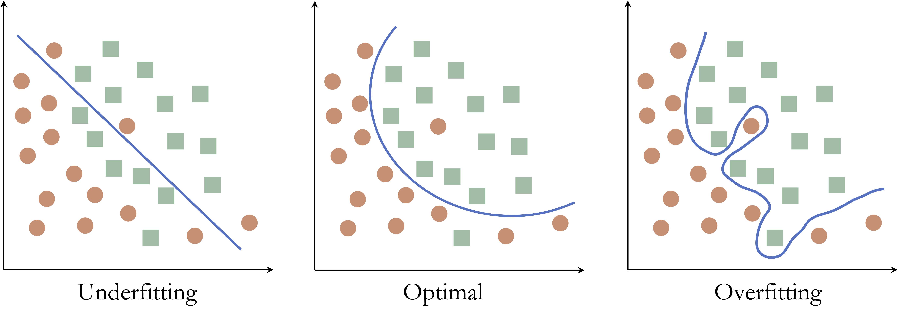
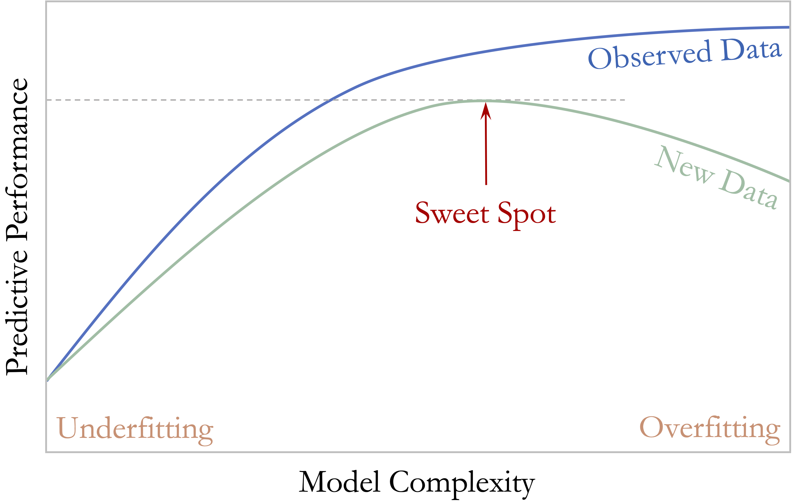
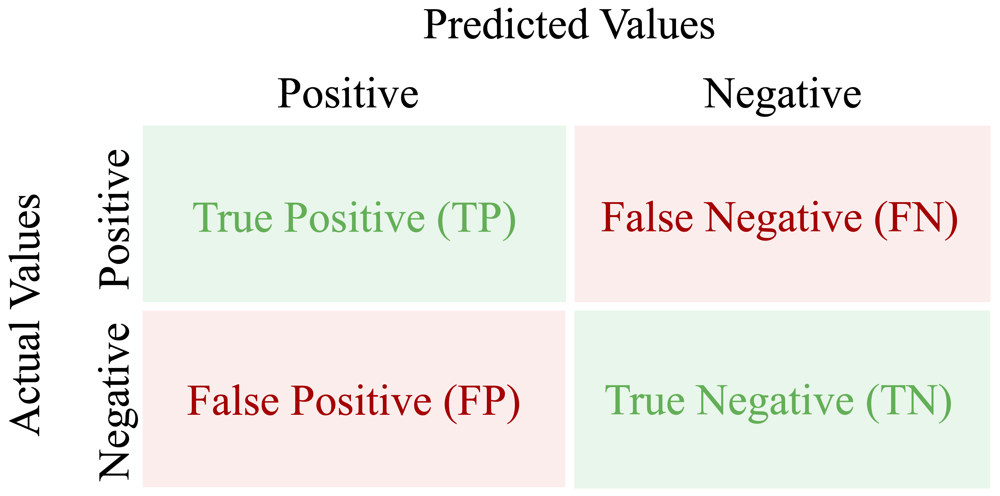
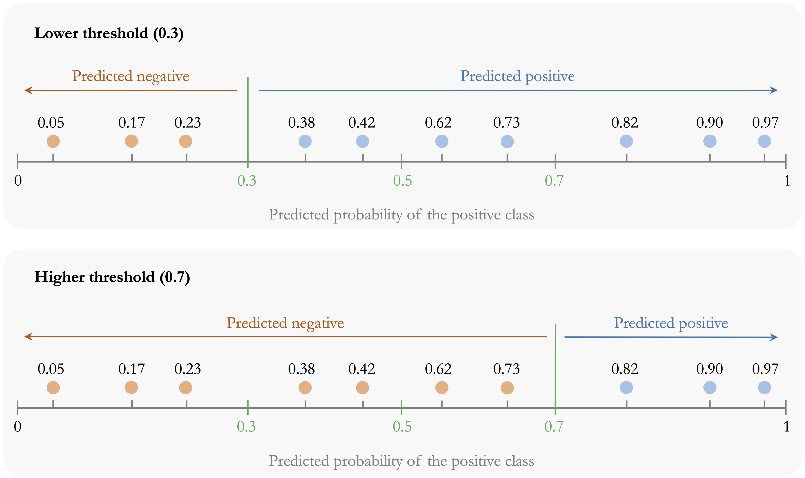
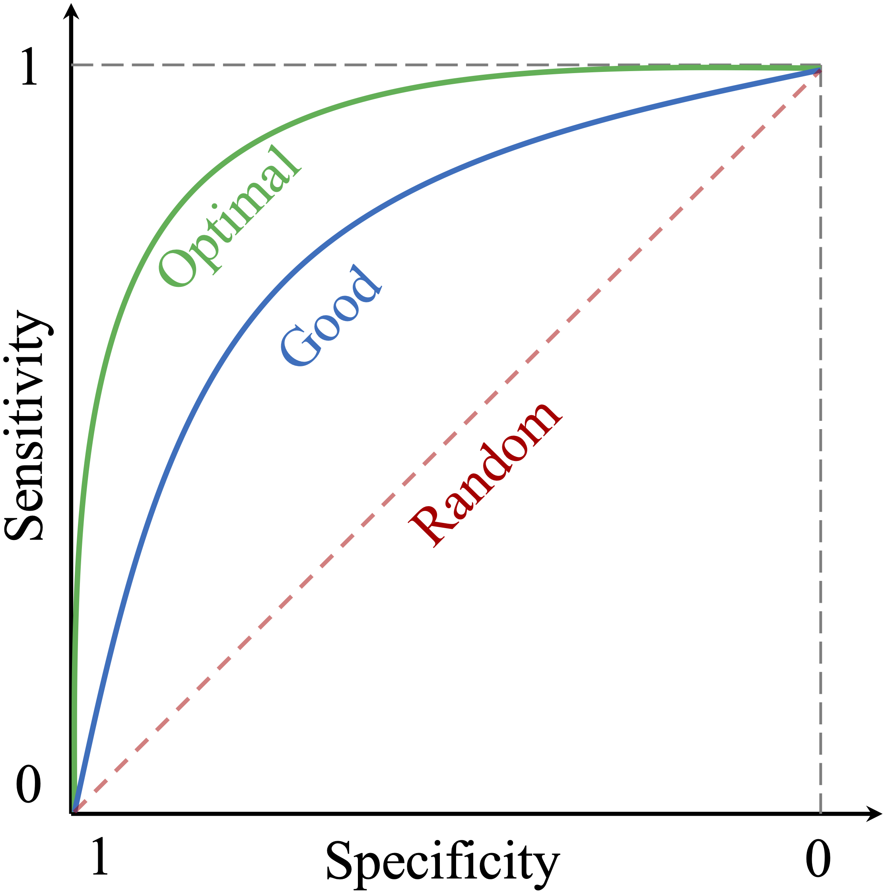
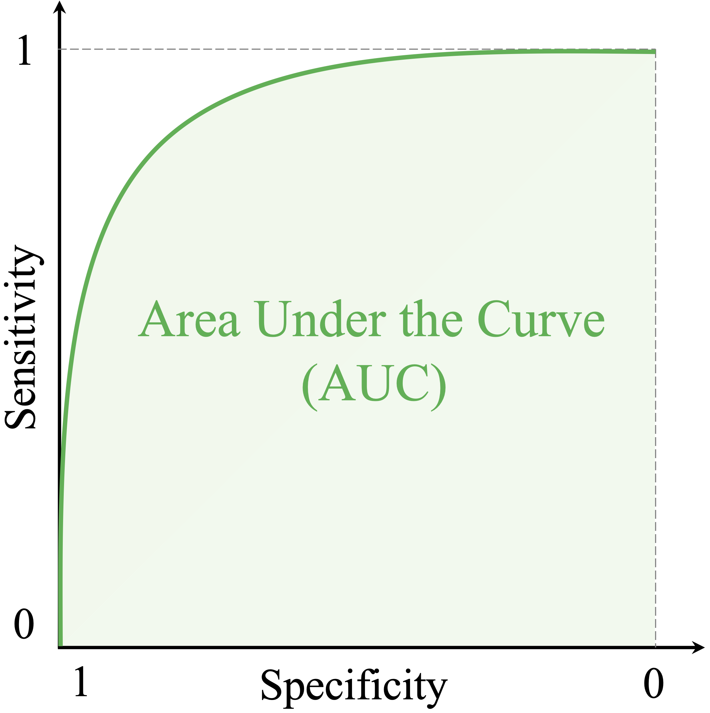
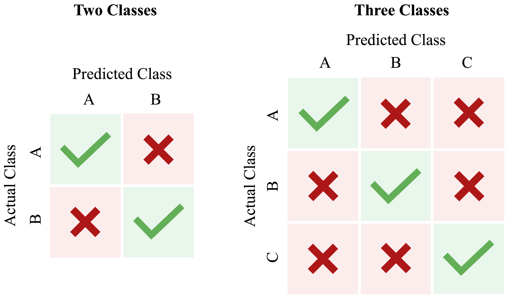

```{r echo=FALSE, message=FALSE, warning=FALSE}
source("_common.R")
```

# Model Evaluation and Performance Assessment {#sec-chapter-evaluation}

::: {.content-visible when-format="pdf"}
\begin{chapterquote}
All models are wrong, but some are useful.

\hfill — George Box
\end{chapterquote}
:::

::::: {.content-visible when-format="html"}
:::: chapterquote
All models are wrong, but some are useful.

::: author
— George Box
:::
::::
:::::

How can we determine whether a machine learning model is genuinely effective? Is 95 percent accuracy always impressive, or can it conceal important weaknesses? How should we weigh the benefits of detecting true cases against the costs of false alarms? These questions lie at the core of model evaluation.

The quote [@box1979robustness] that opens this chapter captures a central idea in predictive modeling: the goal is not to find a perfect model, but to determine whether a model is useful for the task at hand. A fitted model becomes valuable only when we assess how well it performs on new data and whether that performance aligns with the aims of the analysis. In practice, this assessment depends on the evaluation metrics we choose, the classification threshold we apply, and the relative consequences of different types of prediction errors.

The preceding chapters established the steps needed to reach this point in the Data Science Workflow. Chapter [-@sec-chapter-data-preparation] focused on *Data Preparation for Modeling*, including data partitioning, model-specific preparation, and the prevention of data leakage. Chapter [-@sec-chapter-knn] then moved into *Modeling* by introducing k-Nearest Neighbors (kNN) and applying it to the `churn` dataset, where we examined how feature representation, scaling, and the choice of $k$ affect predictions. This chapter now turns to *Evaluation*, the next stage of the Data Science Workflow introduced in Chapter [-@sec-chapter-intro-data-science] and illustrated in @fig-ds_DSW. The central question is no longer simply how to build a model, but how to determine whether its predictions generalize well to unseen data.

A model that appears strong during development may still perform poorly in practice, especially when classes are imbalanced or when false positives and false negatives have different consequences. Evaluation must therefore go beyond a single summary measure. We need to examine how well the model identifies the cases that matter, what kinds of errors it makes, how performance changes under different decision thresholds, and whether the chosen measures reflect the practical goals of the problem. These considerations provide the foundation for the evaluation tools introduced in this chapter.

### What This Chapter Covers {.unnumbered .unlisted}

In Chapter [-@sec-chapter-data-preparation], we established the data-partitioning and resampling principles needed for reliable model development and evaluation, including preservation of an independent test set and prevention of data leakage. Here, the emphasis shifts from designing a valid evaluation process to understanding and measuring predictive performance once models have been developed.

We begin by examining generalization, the distinction between training performance and performance on new data, and the problems of underfitting and overfitting. These ideas explain why a model that fits its training data well is not necessarily a useful predictive model.

We then turn to binary classification, where the confusion matrix provides the foundation for metrics such as accuracy, balanced accuracy, sensitivity, specificity, precision, recall, and the F1-score. We also examine models that return predicted probabilities, introducing classification thresholds and showing how threshold choice affects the balance among different types of classification errors. We then consider curve-based tools such as ROC curves and precision-recall (PR) curves.

The chapter next introduces summary measures for these curves, including ROC-AUC and AUC-PR, before briefly extending the discussion to multi-class classification, where performance must be assessed across more than two outcome categories. Finally, we turn to regression, where evaluation depends not on class labels but on the magnitude of prediction errors, using measures such as MSE, RMSE, MAE, and $R^2$.

## Generalization and Model Complexity {#sec-evaluation-generalization}

The purpose of predictive modeling is not simply to describe the observations used to fit a model, but to make reliable predictions for new observations. A model may fit its training data closely and still perform poorly when applied to observations it has not previously encountered. Predictive performance must therefore be judged by how well the model performs beyond the data used to fit it.

This ability is known as *generalization*. A model generalizes well when the relationships learned from the training data remain useful for new observations drawn from the population or setting of interest. By contrast, a model that captures patterns specific to the training sample may appear successful during development but perform substantially worse on unseen data.

This distinction explains why training performance alone is not a reliable measure of predictive quality. Because the training observations have already influenced the fitted model, evaluating performance on those same observations usually gives an overly favorable view of how the model will behave on new data. As discussed in Chapter [-@sec-chapter-data-preparation], separating the data into training and test sets provides a practical way to assess this difference. The training set is used to develop and fit the model, while the test set is kept separate so that it can provide a final assessment of performance on unseen observations.

When model development involves choices such as selecting a hyperparameter or comparing different levels of model complexity, these choices should not be made by repeatedly examining the test set. Instead, validation data or resampling within the training data can be used to guide such decisions, as introduced in Chapter [-@sec-chapter-data-preparation]. Once the model-development choices have been completed, the test set is used for the final evaluation.

An important factor influencing generalization is *model complexity*, which refers to the flexibility of a model to represent relationships in the data. Greater flexibility can allow a model to capture more complicated patterns, but increasing complexity does not necessarily improve predictions on new observations. A useful model must capture enough structure to make accurate predictions without adapting too closely to the particular observations used to develop it.

### Underfitting and Overfitting {.unnumbered .unlisted}

When model complexity is poorly matched to the structure of the data, two common problems arise: *underfitting* and *overfitting*. Underfitting occurs when a model is too simple to capture important relationships between the predictors and the outcome. Such a model typically performs poorly on both the training data and new observations.

Overfitting occurs when a model adapts too closely to the training data. Instead of capturing only the underlying signal, it also learns random variation and patterns specific to the observed sample. As a result, the model may perform very well on the training data while performing substantially worse on new observations.

To illustrate these ideas, consider a classification problem with two classes in a two-dimensional feature space. The objective is to construct a decision boundary that separates the classes.

Figure [-@fig-evaluation-overfitting-underfitting] shows three possible decision boundaries. The boundary in the left panel is too simple and misclassifies many observations, illustrating underfitting. The middle panel captures the main structure of the data without unnecessary complexity. The highly irregular boundary in the right panel classifies the observed points almost perfectly, but it has adapted too closely to the training sample and illustrates overfitting.

```{r fig-evaluation-overfitting-underfitting, echo = FALSE, out.width = "100%", fig.cap = "Illustration of underfitting, appropriate model complexity, and overfitting. The left panel shows an overly simple decision boundary, the middle panel shows a well-balanced model, and the right panel shows an overly complex boundary that fits noise in the observed data."}

```

The same idea applies directly to kNN. As discussed in Chapter [-@sec-chapter-knn], the choice of (k) controls the flexibility of the classifier. Very small values of (k) can produce highly flexible decision boundaries that respond closely to individual training observations, whereas very large values can produce overly smooth boundaries that miss important local structure. Selecting (k) therefore involves finding an appropriate balance between these two extremes.

The relationship between model complexity and predictive performance is illustrated more generally in Figure [-@fig-evaluation-model-complexity]. As model complexity increases, performance on the training data usually improves because the model can adapt more closely to the observed values. Performance on validation data, however, may initially improve as the model captures useful structure and then decline as additional complexity begins to capture sample-specific variation rather than patterns that generalize well.

```{r fig-evaluation-model-complexity, echo = FALSE, out.width = "75%", fig.cap = "Relationship between model complexity and predictive performance during model development. Training performance typically improves as model complexity increases, while validation performance may first improve and then decline as overfitting begins."}

```

The most useful predictive model is therefore not necessarily the one that fits the training data best. Instead, we seek a level of complexity that captures meaningful structure while avoiding unnecessary adaptation to the training sample. When complexity must be selected, validation data can help guide this choice, while the separate test set remains reserved for the final assessment of predictive performance. With this distinction in mind, we now turn from model complexity to the metrics used to evaluate classification predictions, beginning with the confusion matrix.

## Confusion Matrix {#sec-evaluation-confusion-matrix}

How can we determine where a classification model performs well and where it falls short? The confusion matrix provides a clear and systematic answer. It is one of the most widely used tools for evaluating classification models because it summarizes how predicted class labels compare with the observed labels.

In binary classification, one class is designated as the positive class, usually representing the event of primary interest, while the other is treated as the negative class. For example, in fraud detection, fraudulent transactions may be treated as positive and legitimate transactions as negative. Because the interpretation of several evaluation metrics depends on this choice, the positive class should always be stated explicitly.

Figure [-@fig-evaluation-confusion-matrix] shows the structure of a confusion matrix. The rows correspond to the actual class labels, and the columns represent the predicted labels. Each cell records one of four possible outcomes. *True positives (TP)* occur when the model correctly predicts the positive class. *False positives (FP)* occur when the model predicts the positive class for an observation that is actually negative. *True negatives (TN)* occur when the model correctly predicts the negative class, whereas *false negatives (FN)* occur when the model predicts the negative class for an observation that is actually positive.

```{r fig-evaluation-confusion-matrix, echo = FALSE, out.width = "50%", fig.cap = "Confusion matrix for binary classification, summarizing correct and incorrect predictions based on whether the actual class is positive or negative."}

```

The diagonal entries, TP and TN, represent correct predictions, whereas the off-diagonal entries, FP and FN, represent misclassifications. Examining these four outcomes separately is useful because two models with similar overall performance can make very different kinds of errors.

The confusion matrix is also the starting point for several important evaluation measures. Two of the most general are *accuracy* and *error rate*. Accuracy measures the proportion of observations that are classified correctly: $$
\text{Accuracy} =
\frac{\text{TP} + \text{TN}}
{\text{TP} + \text{FP} + \text{FN} + \text{TN}}.
$$ The error rate measures the proportion that are classified incorrectly: $$
\text{Error Rate} = 1 - \text{Accuracy} = \frac{\text{FP} + \text{FN}}{\text{TP} + \text{FP} + \text{FN} + \text{TN}}.
$$

Although accuracy is easy to interpret, it is not always sufficient. In an imbalanced dataset, for example, a model can achieve high accuracy by performing well on the majority class while performing poorly on the less common class. The confusion matrix is therefore especially valuable because it shows not only how often the model is correct overall, but also what kinds of errors it makes.

In R, we can compute a confusion matrix using the `conf.mat()` function from the **liver** package. The package also provides `conf.mat.plot()` for visualizing the result. To illustrate these tools, we return to the kNN model from the churn case study in Section [-@sec-knn-case-churn] and evaluate its predictions on the test set.

```{r echo=FALSE}
library(liver)

data(churn)

# Train/test split
set.seed(42) 
splits = partition(data = churn, ratio = c(0.8, 0.2))

train_set = splits$part1
test_set  = splits$part2
test_labels = test_set$churn

# Imputation for NA values
# Treat "unknown" as missing
train_set[train_set == "unknown"] <- NA
test_set[test_set == "unknown"] <- NA

# Training-derived modes
mode_education = names(sort(table(train_set$education, useNA = "no"), decreasing = TRUE))[1]
mode_income    = names(sort(table(train_set$income,    useNA = "no"), decreasing = TRUE))[1]
mode_marital   = names(sort(table(train_set$marital,   useNA = "no"), decreasing = TRUE))[1]

# Apply to the training set
train_set$education[is.na(train_set$education)] = mode_education
train_set$income[is.na(train_set$income)]       = mode_income
train_set$marital[is.na(train_set$marital)]     = mode_marital

# Apply to the test set using the same training-derived modes
test_set$education[is.na(test_set$education)] = mode_education
test_set$income[is.na(test_set$income)]       = mode_income
test_set$marital[is.na(test_set$marital)]     = mode_marital

train_set = droplevels(train_set)
test_set  = droplevels(test_set)

# Encoding categorical features
income_levels = c("<40K", "40K-60K", "60K-80K", "80K-120K", ">120K")
income_values = c(20, 50, 70, 100, 140)

train_set$income_rank = as.numeric(factor(train_set$income, levels = income_levels, labels = income_values))
test_set$income_rank = as.numeric(factor(test_set$income, levels = income_levels, labels = income_values))

categorical_features = c("gender", "education", "marital", "card_category")

train_onehot = one.hot(train_set, cols = categorical_features)
test_onehot  = one.hot(test_set,  cols = categorical_features)

# Scale numeric features using min-max scaling
numeric_features = c("age", "dependent_count", "months_on_book", "relationship_count", "months_inactive", "contacts_count_12", "credit_limit", "revolving_balance", "transaction_amount_12", "transaction_count_12", "ratio_amount_Q4_Q1", "ratio_count_Q4_Q1", "income_rank")

min_train = sapply(train_set[, numeric_features], min)  
max_train = sapply(train_set[, numeric_features], max)   

train_scaled = minmax(train_onehot, col = numeric_features, min = min_train, max = max_train)
test_scaled  = minmax(test_onehot,  col = numeric_features, min = min_train, max = max_train)

# Apply kNN model
formula_knn = churn ~ gender_female + age + income_rank + education_uneducated +
  education_highschool + education_college + education_graduate +
  `education_post-graduate` + marital_married + marital_single +
  card_category_blue + card_category_silver + card_category_gold +
  dependent_count + months_on_book + relationship_count +
  months_inactive + contacts_count_12 + credit_limit +
  revolving_balance + transaction_amount_12 +
  transaction_count_12 + ratio_amount_Q4_Q1 + ratio_count_Q4_Q1

kNN_predict = kNN(
  formula = formula_knn,
  train = train_scaled,
  test = test_scaled,
  k = 7
)
```

We can now construct the confusion matrix:

```{r}
conf.mat(pred = kNN_predict, actual = test_labels, reference = "yes")
```

Here, `pred` contains the predicted class labels, `actual` contains the observed labels, and `reference = "yes"` identifies `churn = yes` as the positive class. The `cutoff` argument is needed only when the supplied predictions are probabilities, so it is not required here.

```{r echo=FALSE}
conf_max_knn_churn = conf.mat(
  pred = kNN_predict,
  actual = test_labels,
  reference = "yes"
)
```

The resulting confusion matrix shows that the model correctly identified `r conf_max_knn_churn[1, 1]` churners (*true positives*) and `r conf_max_knn_churn[2, 2]` non-churners (*true negatives*). It incorrectly predicted that `r conf_max_knn_churn[2, 1]` non-churners would churn (*false positives*) and failed to identify `r conf_max_knn_churn[1, 2]` customers who actually churned (*false negatives*). This breakdown provides more information than overall accuracy alone because it reveals the types of errors made by the classifier.

We can also visualize the confusion matrix:

```{r out.width = "30%"}
conf.mat.plot(pred = kNN_predict, actual = test_labels, reference = "yes")
```

From the confusion matrix, we can calculate the accuracy and error rate:$$
\text{Accuracy} = \frac{`r conf_max_knn_churn[1, 1]` + `r conf_max_knn_churn[2, 2]`}{`r sum(conf_max_knn_churn)`} = `r round((conf_max_knn_churn[1, 1] + conf_max_knn_churn[2, 2]) / sum(conf_max_knn_churn), 3)`,
$$ and $$
\text{Error Rate} = \frac{`r conf_max_knn_churn[2, 1]` + `r conf_max_knn_churn[1, 2]`}{`r sum(conf_max_knn_churn)`} = `r round((conf_max_knn_churn[2, 1] + conf_max_knn_churn[1, 2]) / sum(conf_max_knn_churn), 3)`.
$$ Thus, the model correctly classified `r round((conf_max_knn_churn[1, 1] + conf_max_knn_churn[2, 2]) / sum(conf_max_knn_churn), 3) * 100`% of the test observations and misclassified `r round((conf_max_knn_churn[2, 1] + conf_max_knn_churn[1, 2]) / sum(conf_max_knn_churn), 3) * 100`%.

> *Practice:* Using the confusion matrix above, identify the true positives, false positives, true negatives, and false negatives. Verify the reported accuracy and error rate. Which type of classification error occurs more often?

Accuracy and error rate provide only a broad summary of classification performance. To distinguish how well the model identifies positive and negative cases, we next consider *sensitivity* and *specificity*.

## Sensitivity, Specificity, and Balanced Accuracy

Accuracy summarizes overall performance, but it does not show whether a model performs equally well on the positive and negative classes. In many applications, this distinction matters. A classifier may achieve high overall accuracy while still missing many of the cases of greatest interest or producing too many false alarms. Sensitivity and specificity address this limitation by evaluating performance separately for the positive and negative classes.

Sensitivity focuses on the model’s ability to identify positive cases, whereas specificity focuses on its ability to identify negative cases. Together, they provide a more detailed view of classification performance, particularly when the classes are imbalanced or when false positives and false negatives have different practical consequences.

### Sensitivity {.unnumbered .unlisted}

*Sensitivity* measures how well a model identifies positive cases. It answers the question: Out of all actual positives, how many did the model correctly predict? Sensitivity is also called *recall* and is particularly important when failing to identify a positive case is costly, such as in fraud detection or medical screening. It is defined as $$
\text{Sensitivity}=\frac{\text{TP}}{\text{TP}+\text{FN}}.
$$ In the churn example, the positive class is `churn = yes`, so sensitivity measures the proportion of actual churners that the kNN model correctly identifies. Using the confusion matrix from Section [-@sec-evaluation-confusion-matrix], we obtain $$
\text{Sensitivity}=
\frac{`r conf_max_knn_churn[1, 1]`}
{`r conf_max_knn_churn[1, 1]` + `r conf_max_knn_churn[1, 2]`}=
`r round(conf_max_knn_churn[1, 1] / (conf_max_knn_churn[1, 1] + conf_max_knn_churn[1, 2]), 3)`.
$$ This means that the model correctly identifies `r round(100 * conf_max_knn_churn[1, 1] / (conf_max_knn_churn[1, 1] + conf_max_knn_churn[1, 2]), 1)`% of customers who actually churn.

High sensitivity means that relatively few positive cases are missed. However, sensitivity should not be interpreted on its own. A classifier could achieve perfect sensitivity simply by predicting every observation as positive, but doing so would generate many false positives.

### Specificity {.unnumbered .unlisted}

*Specificity* measures how well a model identifies negative cases. It answers the question: *Out of all actual negatives, how many did the model correctly predict?* Specificity is especially important when false positives are costly. In spam filtering, for example, low specificity means that many legitimate emails are incorrectly classified as spam. It is defined as $$
\text{Specificity}=\frac{\text{TN}}{\text{TN}+\text{FP}}.
$$ In the churn example, specificity measures the proportion of customers who did not churn and were correctly classified as non-churners. Using the same confusion matrix, we obtain $$
\text{Specificity}=\frac{`r conf_max_knn_churn[2, 2]`}
{`r conf_max_knn_churn[2, 2]` + `r conf_max_knn_churn[2, 1]`}=
`r round(conf_max_knn_churn[2, 2] / (conf_max_knn_churn[2, 2] + conf_max_knn_churn[2, 1]), 3)`.
$$ Thus, the model correctly identifies `r round(100 * conf_max_knn_churn[2, 2] / (conf_max_knn_churn[2, 2] + conf_max_knn_churn[2, 1]), 1)`% of customers who remain with the company. Specificity therefore indicates how well the classifier avoids falsely labeling non-churners as churners.

Sensitivity and specificity provide complementary perspectives. A model with high sensitivity identifies most positive cases, whereas a model with high specificity correctly excludes most negative cases. Depending on the application, one may be more important than the other.

### Balanced Accuracy {.unnumbered .unlisted}

Ordinary accuracy combines correct predictions from both classes into a single proportion. When the classes are imbalanced, however, the larger class can dominate this measure. A model may therefore achieve high accuracy even if it performs poorly on the less common class.

*Balanced accuracy* addresses this issue by giving equal importance to performance on the positive and negative classes. It is defined as the average of sensitivity and specificity: $$
\text{Balanced Accuracy}=\frac{\text{Sensitivity}+\text{Specificity}}{2}.
$$ For the churn model, balanced accuracy is $$
\text{Balanced Accuracy}=
\frac{
`r round(conf_max_knn_churn[1, 1] / (conf_max_knn_churn[1, 1] + conf_max_knn_churn[1, 2]), 3)`
+
`r round(conf_max_knn_churn[2, 2] / (conf_max_knn_churn[2, 2] + conf_max_knn_churn[2, 1]), 3)`
}{2}
=
`r round(
  (
    conf_max_knn_churn[1, 1] /
      (conf_max_knn_churn[1, 1] + conf_max_knn_churn[1, 2]) +
    conf_max_knn_churn[2, 2] /
      (conf_max_knn_churn[2, 2] + conf_max_knn_churn[2, 1])
  ) / 2,
  3
)`.
$$

Unlike ordinary accuracy, which is influenced by the relative sizes of the classes, balanced accuracy gives the positive and negative classes equal weight. It is therefore particularly useful when class frequencies differ substantially and performance on both classes matters.

> *Practice:* Using the confusion matrix from Section [-@sec-evaluation-confusion-matrix], calculate sensitivity, specificity, and balanced accuracy. Compare balanced accuracy with ordinary accuracy. What does any difference suggest about performance across the two classes?

Sensitivity, specificity, and balanced accuracy describe performance from the perspective of the actual classes. We next consider another important perspective: when the model predicts a positive case, how trustworthy is that prediction? This leads to precision, recall, and the F1-score.

## Precision, Recall, and F1-Score

Sensitivity and specificity evaluate performance with respect to the actual positive and negative classes. Precision provides a different perspective by asking how trustworthy the model’s positive predictions are. Together, precision and recall are especially useful when attention is focused on the positive class, particularly in imbalanced classification problems.

*Precision*, also called the *positive predictive value*, measures the proportion of predicted positive cases that are actually positive. It answers the question: *When the model predicts a positive case, how often is that prediction correct?* Precision is defined as $$
\text{Precision}=\frac{\text{TP}}{\text{TP}+\text{FP}}.
$$ Precision is particularly important when false positives are costly. In fraud detection, for example, incorrectly flagging legitimate transactions may inconvenience customers and trigger unnecessary investigation.

*Recall* is another name for sensitivity, introduced in the previous section. It measures the proportion of actual positive cases that the model correctly identifies: $$
\text{Recall}=\frac{\text{TP}}{\text{TP}+\text{FN}}.
$$

The terms *sensitivity* and *recall* refer to the same quantity, although sensitivity is especially common in biomedical applications, while recall is widely used in machine learning and information retrieval.

Precision and recall therefore answer complementary questions. High precision means that positive predictions are usually correct, whereas high recall means that few actual positive cases are missed. In many applications, there is a trade-off between the two. A classifier that makes fewer positive predictions may achieve higher precision by avoiding false positives, but it may also miss more true positives and therefore have lower recall. Conversely, a classifier that predicts the positive class more readily may achieve higher recall while producing more false positives and reducing precision.

To summarize the balance between precision and recall, we often use the *F1-score*, which is their harmonic mean: $$
F1 = 2 \times \frac{\text{Precision}\times\text{Recall}}{\text{Precision}+\text{Recall}}
   =\frac{2\times\text{TP}}{2\times\text{TP}+\text{FP}+\text{FN}}.
$$ The F1-score is useful when precision and recall are both important and a single summary measure is desired. However, it does not include true negatives, so it should not automatically replace other measures such as accuracy, balanced accuracy, sensitivity, or specificity. The most appropriate metric depends on the prediction problem and on the practical consequences of different types of errors.

Using the kNN model from Section [-@sec-evaluation-confusion-matrix], where `churn = yes` is the positive class, precision is $$
\text{Precision} =
\frac{\text{TP}}{\text{TP} + \text{FP}} =
\frac{`r conf_max_knn_churn[1, 1]`}{`r conf_max_knn_churn[1, 1]` + `r conf_max_knn_churn[2, 1]`} =
`r round(conf_max_knn_churn[1, 1] / (conf_max_knn_churn[1, 1] + conf_max_knn_churn[2, 1]), 3)`.
$$ Thus, `r round(100 * conf_max_knn_churn[1, 1] / (conf_max_knn_churn[1, 1] + conf_max_knn_churn[2, 1]), 1)`% of customers predicted to churn actually do so. Recall is the same as the sensitivity calculated in the previous section and measures the proportion of actual churners correctly identified by the model.

The F1-score for the churn model is$$
F1 =
\frac{2 \times `r conf_max_knn_churn[1, 1]`}{2 \times `r conf_max_knn_churn[1, 1]` + `r conf_max_knn_churn[2, 1]` + `r conf_max_knn_churn[1, 2]`} =
`r round(2 * conf_max_knn_churn[1, 1] / (2 * conf_max_knn_churn[1, 1] + conf_max_knn_churn[2, 1] + conf_max_knn_churn[1, 2]), 3)`.
$$ This value summarizes the balance between identifying churners and keeping positive predictions reliable.

> *Practice:* Using the confusion matrix from Section [-@sec-evaluation-confusion-matrix], calculate precision and the F1-score. Compare precision with recall. Is the model better at finding churners or at making reliable churn predictions? What does the F1-score add to this comparison?

The measures considered so far depend on a particular set of predicted class labels. When a model produces predicted probabilities, however, those labels depend on the classification threshold used to convert probabilities into decisions. We therefore turn next to classification thresholds and examine how changing the threshold affects precision, recall, sensitivity, specificity, and other evaluation measures.

## Classification Thresholds and Decision Rules {#sec-evaluation-classification-thresholds}

Many classification models can return predicted probabilities rather than only hard class labels. For example, a model may assign a probability of 0.72 that a patient has a rare disease or a probability of 0.68 that a customer will churn. These probability estimates contain more information than a simple yes/no prediction because they indicate how strongly the model favors one class over the other.

To convert probabilities into class labels, we must choose a classification threshold. In binary classification, this threshold is applied to the predicted probability of the positive class. A threshold of 0.5 is common: observations with predicted probability above 0.5 are assigned to the positive class, whereas those below 0.5 are assigned to the negative class. This threshold, however, is not determined by the model itself. It is a decision rule chosen by the analyst, and different thresholds can lead to very different classification results. For this reason, 0.5 should be viewed as a common default rather than as a universally appropriate choice.

The practical effect of threshold choice is shown in Figure [-@fig-evaluation-threshold]. A lower threshold classifies more observations as positive, whereas a higher threshold applies a stricter standard before assigning the positive class. Because each threshold produces a different set of predicted labels, the confusion matrix and all metrics derived from it also change.

```{r fig-evaluation-threshold, echo = FALSE, out.width = "100%", fig.cap = "Effect of the classification threshold on predicted class labels. Lower thresholds classify more observations as positive, which typically increases sensitivity but may also increase false positives. Higher thresholds classify fewer observations as positive, which typically increases specificity but may also increase false negatives."}

```

These changes have direct consequences for model evaluation. Lower thresholds usually increase sensitivity because more actual positives are identified, but they often reduce specificity and precision by generating more false positive predictions. Higher thresholds tend to have the opposite effect: they reduce false alarms and may improve specificity, but they also increase the risk of missing true positive cases. Threshold choice therefore determines how the model balances detecting positives against avoiding unnecessary alarms.

In practice, the most appropriate threshold depends on the application and on the relative costs of false positives and false negatives. If missing a positive case is especially costly, a lower threshold may be preferred. If false alarms are more costly, a higher threshold may be more appropriate. More generally, the threshold should be chosen to reflect the decision problem rather than treated as a fixed default.

There are several common approaches for choosing a threshold. One is *cost-based selection*: if we can quantify the cost of a false positive and a false negative, we can choose the threshold that minimizes expected cost or maximizes expected benefit. A second is *metric-based selection*: we may choose the threshold that maximizes a validation criterion such as balanced accuracy, the F1-score, or another metric aligned with the goal of the analysis. A third is *constraint-based selection*: for example, we may choose the lowest threshold that achieves at least 90% sensitivity, or the highest threshold that keeps the false positive rate below a tolerable level. In all cases, the threshold should be justified by the practical objective of the analysis.

When the threshold is selected from data, it should be chosen using a validation set or by cross-validation within the training data, not by inspecting the final test set. For example, we may fit the model on each training fold, evaluate several candidate thresholds on the corresponding validation fold, and then select the threshold that performs best on average according to the chosen criterion. The final test set should be used only after this choice has been made, so that it remains an honest assessment of performance on unseen data.

To illustrate these ideas, we return to the kNN model from Section [-@sec-evaluation-confusion-matrix], which predicts customer churn (`churn = yes`). By specifying `type = "prob"` in the `kNN()` function, we obtain predicted probabilities rather than hard class labels:

```{r}
kNN_prob = kNN(formula = formula_knn, train = train_scaled, test = test_scaled, k = 7, type = "prob")

kNN_prob[1:6, ]
```

The object `kNN_prob` is a two-column matrix of class probabilities. The first column gives the estimated probability of the positive class (`churn = yes`), and the second column gives the estimated probability of the negative class (`churn = no`). For example, the first entry in the positive-class column is `r round(kNN_prob[1, 1], 2)`, meaning that the model assigns this customer a `r round(kNN_prob[1, 1], 2) * 100` percent probability of churning.

We can now apply different thresholds to these probabilities and examine how the resulting confusion matrix changes. Using the `cutoff` argument in `conf.mat()`, we compare two thresholds:

```{r}
conf.mat(kNN_prob[, "yes"], test_labels, reference = "yes", cutoff = 0.3)

conf.mat(kNN_prob[, "yes"], test_labels, reference = "yes", cutoff = 0.7)
```

A threshold of 0.3 classifies more observations as potential churners than a threshold of 0.7. As a result, it typically yields higher sensitivity but also more false positives. By contrast, a stricter threshold such as 0.7 requires stronger evidence before predicting churn, which often increases specificity but may miss more actual churners.

> *Practice:* Using the predicted probabilities from the kNN model, construct confusion matrices for thresholds of 0.3 and 0.8 and calculate sensitivity and specificity. How do these measures change as the threshold increases, and which threshold places greater emphasis on detecting churners versus avoiding false positives?

Choosing a threshold allows us to tailor classification decisions to the practical goals of the problem. However, any single threshold gives only one view of model performance. To understand how a classifier behaves across all possible thresholds, we need tools that summarize this broader range of trade-offs. The next sections introduce the ROC curve and the precision-recall curve for that purpose.

## Receiver Operating Characteristic (ROC) Curve

When a classifier returns predicted probabilities, its performance changes as the classification threshold changes. A lower threshold usually identifies more positive cases, whereas a higher threshold is more conservative. To examine model performance across *all* possible thresholds, we use the *Receiver Operating Characteristic (ROC) curve*.

The ROC curve plots the *true positive rate* (sensitivity) on the vertical axis against the *false positive rate* ($1-\text{specificity}$) on the horizontal axis. Each point on the curve corresponds to a different classification threshold. A curve closer to the top-left corner indicates stronger ability to distinguish positive cases from negative ones, whereas a curve near the diagonal indicates little discriminatory power beyond random guessing.

It is important to interpret the ROC curve correctly. The ROC curve is primarily a *discrimination tool*: it shows how well a model ranks positive cases above negative cases across thresholds. It does *not* by itself determine which threshold is best for a particular application. Choosing an operating threshold still depends on the relative costs of false positives and false negatives in the real decision problem.

Figure [-@fig-evaluation-roc-curve] provides a conceptual illustration of ROC behavior. Curves that bend more strongly toward the top-left corner reflect better separation between the classes, whereas the diagonal line represents random performance.

```{r fig-evaluation-roc-curve, echo = FALSE, out.width = "50%", fig.cap = "Conceptual illustration of ROC curves. Curves closer to the top-left corner indicate stronger discrimination between the positive and negative classes, whereas the diagonal line represents random guessing."}

```

To construct an ROC curve in practice, we need predicted probabilities for the positive class and the observed class labels. We continue with the kNN model from Section [-@sec-evaluation-classification-thresholds], using the predicted probabilities for `churn = yes`. The **pROC** package in R provides functions for computing and visualizing ROC curves.

```{r}
library(pROC)

roc_knn = roc(response = test_labels, predictor = kNN_prob[, "yes"])
```

We can then visualize the ROC curve using `ggroc()`:

```{r}
ggroc(roc_knn) +
  ggtitle("ROC Curve for the kNN Model on the churn Data")
```

This data-based ROC curve shows how the kNN model’s sensitivity and false positive rate change across thresholds. If the curve lies well above the diagonal, the model has useful discriminatory ability. If it remains close to the diagonal, the model does little better than random guessing. ROC curves are therefore especially helpful when comparing competing classifiers on their ability to separate the two classes.

At the same time, ROC analysis should be interpreted with some caution in highly imbalanced settings. Because the false positive rate is calculated relative to the number of actual negatives, ROC curves can sometimes appear more favorable than the practical decision problem would suggest. For this reason, it is often useful to consider complementary views of model performance as well.

> *Practice:* Using the predicted probabilities from the kNN model, construct the ROC curve with `roc()` and `ggroc()`. Examine how sensitivity and the false positive rate change across thresholds, and interpret the model’s discriminatory ability.

The ROC curve is one way to summarize classifier behavior across thresholds. In the next section, we introduce the *precision-recall (PR) curve*, which provides a complementary perspective by focusing more directly on the quality of positive predictions.

## Precision-Recall (PR) Curve

While the ROC curve evaluates how well a classifier separates the positive and negative classes across thresholds, it does not focus directly on the quality of the model’s positive predictions. In many applications, especially when the positive class is rare, this is precisely the issue of greatest interest. In such settings, the *precision-recall (PR) curve* provides a useful complementary view.

The PR curve plots *precision* on the vertical axis against *recall* on the horizontal axis as the classification threshold varies. Each point on the curve therefore reflects a different balance between how many positive cases are found and how trustworthy the resulting positive predictions are. A curve that remains high across a broad range of recall values indicates stronger performance, whereas a curve that drops quickly suggests that improving recall comes at the cost of many false positive predictions.

Unlike the ROC curve, which uses the false positive rate on the horizontal axis, the PR curve focuses entirely on performance for the positive class. For this reason, it is often more informative in highly imbalanced problems, where the main goal is to identify rare positive cases accurately rather than to summarize performance across the majority class.

To illustrate this idea, we again use the kNN model from Section [-@sec-evaluation-classification-thresholds], based on the predicted probabilities for `churn = yes`. In R, the **PRROC** package can be used to construct a precision-recall curve:

```{r}
library(PRROC)

pr_knn = pr.curve(scores.class0 = kNN_prob[, "yes"],
  weights.class0 = test_labels == "yes", curve = TRUE)
```

We can then visualize the precision-recall curve:

```{r}
plot(pr_knn, main = "PR Curve for kNN on churn Data")
```

This curve shows how precision changes as recall increases. If precision remains relatively high even at larger recall values, the model is able to identify many churners without generating too many false positive predictions. If precision drops sharply, the model may still find many churners, but only by incorrectly labeling many non-churners as churners.

> *Practice:* Using the predicted probabilities from the kNN model, construct the precision-recall curve. How does precision change as recall increases, and what does the curve suggest about the model’s ability to identify churners while keeping positive predictions reliable?

Like the ROC curve, the PR curve summarizes model behavior across thresholds rather than at a single cutoff. In the next section, we consider how such curves can be summarized numerically through the Area Under the Curve (AUC).

## Area Under the Curve: ROC-AUC and AUC-PR

Both the ROC curve and the precision-recall curve can be summarized with a single number: the *area under the curve* (AUC). In practice, the term *AUC* often refers to the area under the ROC curve, but it is helpful to distinguish this explicitly from the *area under the precision-recall curve* (AUC-PR). These summaries provide compact ways to compare models across thresholds, but they do not answer exactly the same question.

For the ROC curve, the AUC measures how well the model discriminates between the positive and negative classes across all possible thresholds. Geometrically, it is the area under the ROC curve. An intuitive interpretation is that ROC-AUC can be viewed as the probability that a randomly chosen positive case receives a higher score than a randomly chosen negative case. Larger values therefore indicate stronger *discriminatory ability*. A value of 1 indicates perfect discrimination, whereas a value of 0.5 corresponds to random guessing.

```{r fig-evaluation-auc, echo = FALSE, out.width = "45%", fig.cap = "The AUC summarizes the ROC curve into a single number that reflects the model’s ability to discriminate between the positive and negative classes across thresholds. AUC = 1 indicates perfect discrimination, whereas AUC = 0.5 corresponds to random guessing."}

```

As shown in @fig-evaluation-auc, ROC-AUC values range from 0 to 1. Values closer to 1 indicate better separation between the classes. Although uncommon, an AUC below 0.5 can occur when the model systematically ranks negative cases above positive ones, for example because the class labels have been reversed or the predicted scores are inverted. In such cases, reversing the scoring direction would produce an AUC above 0.5.

To compute ROC-AUC in R, we use the `auc()` function from the **pROC** package. This function takes an ROC object, such as the one created earlier using `roc()`, and returns a numeric value:

```{r}
auc(roc_knn)
```

Here, `roc_knn` is the ROC object based on predicted probabilities for `churn = yes`. For the kNN model, the ROC-AUC is `r round(auc(roc_knn), 3)`. This suggests that the model has reasonably good ability to rank churners above non-churners when performance is considered across thresholds.

The PR curve can also be summarized numerically. In the **PRROC** package, the area under the precision-recall curve is stored in the `auc.integral` component of the PR object:

```{r}
pr_knn$auc.integral
```

Whereas ROC-AUC emphasizes overall discrimination between the two classes, AUC-PR focuses more directly on the relationship between *precision* and *recall* for the positive class. For this reason, AUC-PR is often especially informative when the positive class is rare and the main interest lies in identifying that class accurately. Unlike ROC-AUC, however, AUC-PR does not have a universal baseline such as 0.5, because its reference level depends on the prevalence of the positive class.

AUC is useful, but it should be interpreted with care. First, both ROC-AUC and AUC-PR summarize *ranking behavior across thresholds*, not *calibration*. A model can achieve a high AUC even if its predicted probabilities are poorly calibrated. Second, these summaries do not tell us whether performance is good at the specific threshold that will actually be used in practice. A model may have a strong AUC overall while still performing unsatisfactorily at the operating threshold chosen for decision-making.

> *Practice:* Using the ROC and PR objects for the kNN model, compute ROC-AUC and AUC-PR. What does each measure summarize, and do they provide a similar assessment of the model’s performance?

AUC is therefore best viewed as a compact summary of model behavior across thresholds, especially when comparing competing classifiers. ROC-AUC and AUC-PR are complementary rather than interchangeable: the first emphasizes overall discrimination, whereas the second emphasizes performance for the positive class. In the next section, we extend these ideas to *multi-class classification*, where evaluation requires new strategies to accommodate more than two outcome categories.

## Metrics for Multi-Class Classification

So far, we have focused on binary classification, where the outcome has only two classes. Many practical problems, however, involve *three or more* categories. Examples include classifying tumor subtypes, identifying modes of transportation, or assigning products to retail categories. In such settings, the main ideas of model evaluation still apply, but they must be extended to account for multiple classes.

In a multi-class problem, the confusion matrix becomes a square matrix whose size matches the number of classes. Rows correspond to the actual classes and columns to the predicted classes, as shown in @fig-evaluation-confusion-matrices. Correct predictions appear along the diagonal, whereas off-diagonal entries show which classes are being confused with one another. This is often one of the most informative diagnostic tools in multi-class classification, because it reveals not only how often the model is wrong, but also *how* it is wrong.

```{r fig-evaluation-confusion-matrices, echo = FALSE, out.width = "70%", fig.cap = "Confusion matrices for binary (left) and multi-class (right) classification. Diagonal cells show correct predictions, whereas off-diagonal cells show misclassifications. As the number of classes increases, the matrix expands accordingly."}

```

To extend metrics such as precision, recall, and the F1-score to multi-class settings, we usually adopt a *one-vs-all* (or *one-vs-rest*) approach. Each class is treated in turn as the positive class, while all remaining classes are grouped together as the negative class. This produces a separate precision, recall, and F1-score for each class and helps identify which classes are easier or harder for the model to distinguish.

To make this idea concrete, consider the following simple three-class confusion matrix: $$
\begin{array}{c|ccc}
& \text{Pred A} & \text{Pred B} & \text{Pred C} \\
\hline
\text{Actual A} & 18 & 2 & 1 \\
\text{Actual B} & 3 & 14 & 2 \\
\text{Actual C} & 1 & 4 & 15
\end{array}
$$ If we evaluate class A using a one-vs-all approach, the 18 observations in the top-left cell are true positives for class A. The 2 and 1 in the rest of the first row are false negatives, because they are actual A observations predicted as another class. The 3 and 1 in the first column but outside the top-left cell are false positives, because they were predicted as A even though they belong to another class. In this way, familiar binary metrics can still be computed, but now separately for each class.

Because this approach produces multiple values, we often summarize them using an averaging scheme. A *macro-average* gives equal weight to each class by taking the simple mean of the per-class scores. A *micro-average* first aggregates the relevant counts across all classes and then computes the metric, so larger classes have more influence on the result. A *weighted-average* also averages the per-class metrics, but weights each class according to its frequency in the data. The choice among these summaries depends on the goal of the analysis. Macro-averaging is often useful when all classes are equally important, whereas weighted summaries may be more appropriate when class frequencies differ substantially.

Although ROC curves and AUC are originally binary tools, they can be extended to multi-class settings by applying a one-vs-all strategy, producing one ROC curve and one AUC value for each class. In practice, however, interpreting multiple ROC curves can quickly become cumbersome. For this reason, confusion matrices together with macro- or weighted-averaged precision, recall, and F1-scores often provide a clearer summary in introductory multi-class analyses.

The main lesson is that multi-class evaluation should not rely on a single overall number alone. A model may achieve reasonable overall accuracy while still performing poorly on one or more individual classes. Class-specific metrics and the multi-class confusion matrix are therefore often essential for a meaningful assessment. This also reinforces a broader point that will carry into the next section: evaluation must always be adapted to the form of the prediction task. In regression, the target variable is continuous, so performance is assessed not through class labels, but through the size of the prediction errors.

## Evaluation Metrics for Continuous Targets {#sec-evaluation-regression-metrics}

Suppose we want to predict a house’s selling price, a patient’s recovery time, or tomorrow’s temperature. These are examples of regression problems, where the target variable is numerical (see Chapter [-@sec-chapter-regression]). In such settings, the evaluation measures used for classification no longer apply. Instead of counting how often predictions match the true labels, we assess how far the predicted values deviate from the actual outcomes.

For numerical targets, the central question is: How large are the prediction errors, and how should we summarize them? Regression metrics are based on the difference between an observed value $y_i$ and its prediction $\hat{y}_i$. Different metrics summarize these errors in different ways.

To make this concrete, consider four observations: $$
\begin{array}{c|cccc}
\text{Actual } (y) & 10 & 15 & 20 & 25 \\
\text{Predicted } (\hat{y}) & 12 & 14 & 18 & 27
\end{array}
$$ The prediction errors are $-2$, $1$, $2$, and $-2$, and the absolute errors are $2$, $1$, $2$, and $2$.

One widely used metric is the Mean Squared Error (MSE): $$
\text{MSE} = \frac{1}{n} \sum_{i=1}^{n} (y_i - \hat{y}_i)^2.
$$ MSE averages the squared prediction errors, so larger errors receive greater weight. For the example above, $$
\text{MSE} = \frac{4 + 1 + 4 + 4}{4} = 3.25.
$$ Because MSE is expressed in squared units, it is not always easy to interpret directly. In R, it can be computed using the `mse()` function from the **liver** package.

A closely related metric is the Root Mean Squared Error (RMSE): $$
\text{RMSE} = \sqrt{\text{MSE}} = \sqrt{\frac{1}{n} \sum_{i=1}^{n} (y_i - \hat{y}_i)^2}.
$$ For the example above, $$
\text{RMSE} = \sqrt{3.25} \approx 1.80.
$$ Because RMSE is expressed on the same scale as the target variable, it is often easier to interpret than MSE. It still gives greater weight to larger prediction errors because the errors are squared before averaging.

Another common metric is the Mean Absolute Error (MAE): $$
\text{MAE} = \frac{1}{n} \sum_{i=1}^{n} |y_i - \hat{y}_i|.
$$ For the example above, $$
\text{MAE} = \frac{2 + 1 + 2 + 2}{4} = 1.75.
$$ MAE measures the average magnitude of the prediction errors and, like RMSE, is expressed on the scale of the target variable. However, it is less sensitive to unusually large errors because the errors are not squared. In R, it can be computed using the `mae()` function from the **liver** package.

A different type of summary is the coefficient of determination, or $R^2$: $$
R^2 = 1 - \frac{\sum_{i=1}^{n}(y_i - \hat{y}_i)^2}{\sum_{i=1}^{n}(y_i - \bar{y})^2},
$$ where $\bar{y}$ is the mean of the observed values. Here, $R^2$ compares the model’s squared prediction error with that of a simple baseline that predicts the mean for every observation. A value of $R^2 = 1$ indicates perfect prediction, whereas $R^2 = 0$ indicates performance equivalent to the mean-prediction baseline. Negative values are also possible when the model performs worse than that baseline.

For the example above, $\bar{y} = 17.5$, the sum of squared prediction errors is $13$, and the total sum of squares around the mean is $125$. Therefore, $$
R^2 = 1 - \frac{13}{125} = 0.896.
$$ This indicates substantially lower squared prediction error than the mean-prediction baseline, with $R^2 = 0.896$.

The four metrics provide different perspectives on predictive performance. MSE and RMSE give greater weight to large errors, whereas MAE summarizes the average magnitude of the errors more directly. RMSE and MAE are expressed on the scale of the target variable, while $R^2$ provides a relative comparison with a simple baseline. For this reason, $R^2$ is best interpreted alongside error-based measures such as MAE or RMSE rather than used on its own.

The choice of metric depends on the purpose of the analysis. If large prediction errors are especially costly, MSE or RMSE may be preferable. If a directly interpretable measure of average error is more important, MAE may be useful. Together, these measures provide a balanced basis for evaluating predictions for continuous targets. We return to these metrics with a more detailed practical example in Section [-@sec-reg-measuring-fit], where they are applied in the context of regression modeling.

## Chapter Summary and Takeaways

Evaluation is the stage that turns model predictions into evidence about predictive performance. A model may appear impressive during development, but its value depends on how well it performs on unseen data and whether that performance is appropriate for the task at hand. Evaluation is therefore not a final formality, but an essential step in determining whether a model is genuinely useful.

In this chapter, we introduced tools for evaluating supervised learning models according to different predictive goals. For classification, we used the confusion matrix as the foundation for accuracy, sensitivity, specificity, balanced accuracy, precision, recall, and the F1-score, and we examined how classification thresholds affect these measures. We also introduced ROC curves and precision-recall (PR) curves for assessing classifier behavior across thresholds, together with ROC-AUC and AUC-PR as summary measures. For multi-class problems, we extended these ideas through one-vs-all reasoning and averaging strategies. For continuous targets, we introduced MSE, RMSE, MAE, and $R^2$, emphasizing that these measures capture different aspects of predictive performance and are best interpreted together rather than in isolation.

Although *Evaluation* is a distinct stage of the Data Science Workflow, evaluation is not an activity that appears only once. The tools introduced in this chapter will recur throughout the modeling chapters that follow, where they are used to compare, assess, and interpret predictive models in different classification and regression settings.

A practical takeaway is that evaluation should begin with the nature of the prediction task and the consequences of different types of error. We should choose metrics that reflect the aims of the analysis, assess performance on unseen data, and interpret the results in context rather than relying on any single measure.

## Exercises {#sec-evaluation-exercises}

The following exercises reinforce the main ideas of model evaluation through conceptual questions, hands-on classification with the `bank` dataset, and self-reflection.

#### Conceptual Questions {.unnumbered .unlisted}

1.  Why should the predictive performance of a model be assessed on observations that were not used to fit it?

2.  What does it mean for a predictive model to *generalize* well? How does the train-test framework help us assess generalization?

3.  Distinguish between underfitting and overfitting. How can each affect performance on new observations?

4.  What information does a confusion matrix provide that overall accuracy does not?

5.  Why must the positive class be defined explicitly in binary classification?

6.  Explain the difference between sensitivity and specificity. In what kinds of applications might each be especially important?

7.  Explain the difference between precision and recall. What different questions do they answer about model performance?

8.  Why can accuracy be misleading when the classes are imbalanced? Which alternative metrics may provide a more informative assessment?

9.  What is balanced accuracy, and why can it be preferable to ordinary accuracy when class frequencies differ substantially?

10. How does changing the classification threshold affect sensitivity and specificity? How can it also affect precision and recall?

11. What does an ROC curve show, and what does ROC-AUC summarize?

12. Why does a high ROC-AUC not necessarily identify the best classification threshold for a particular application?

13. In a highly imbalanced classification problem, why might a precision-recall curve provide useful information in addition to an ROC curve?

14. How can precision, recall, and the F1-score be extended to multi-class classification using a one-vs-all approach?

15. Compare MSE, RMSE, MAE, and $R^2$. Which measures are expressed on the scale of the target variable, and which are not?

16. Why should $R^2$ not be used as the sole measure of predictive performance for a continuous target?

17. Consider a fraud detection system in which false negatives are much more costly than false positives. Which evaluation measures would you prioritize, and how might this affect the classification threshold?

18. Suppose one classifier has higher accuracy while another has higher recall. What additional information would you need before deciding which model is more useful?

#### Hands-On Practice: Classification Evaluation with the `bank` Dataset {.unnumbered .unlisted}

For the following exercises, use the `bank` dataset from the **liver** package. The target variable is `deposit`, which indicates whether a customer subscribed to a term deposit. Keep the final test set separate from model-development decisions. When a choice such as the value of $k$ or the classification threshold must be made, use only the training data or a validation set created from the training data.

19. Load the `bank` dataset and identify the response variable and predictor variables.

20. Examine the distribution of `deposit`. Is there evidence of class imbalance? Briefly explain why the class distribution matters when choosing evaluation measures.

21. Partition the data into training and test sets using an 80/20 split with the `partition()` function from the **liver** package. Compare the distribution of `deposit` in the two sets and comment on whether the split appears reasonable.

22. Prepare the predictors for kNN. Determine all data-dependent preprocessing quantities and encoding rules from the training data, including any missing-value treatment, categorical encoding, and scaling parameters. Apply these same rules to the test data. Explain why this training-only principle is important.

23. From the training data, create a validation set that can be used for model-development decisions. Keep the original test set untouched.

24. Fit kNN classifiers using several values of $k$, for example $k = 3$, $k = 7$, and $k = 15$. Evaluate these models on the validation set using suitable classification metrics.

25. Compare the validation results. Which value of $k$ appears most appropriate? Explain which metric or combination of metrics you used to make this choice.

26. For the selected value of $k$, obtain predicted probabilities for the positive class on the validation set.

27. Consider several classification thresholds, such as 0.3, 0.5, and 0.7. For each threshold, construct a confusion matrix and calculate sensitivity, specificity, precision, and balanced accuracy.

28. Summarize the threshold results in a small table. Explain how the metrics change as the threshold increases.

29. Suppose the bank wants to identify as many likely subscribers as possible. Which threshold would you prefer based on the validation results? How would your choice change if the bank instead wanted to avoid contacting customers who are unlikely to subscribe?

30. Select a final classification threshold based on the bank’s objective and the validation results. Record both the selected value of $k$ and the selected threshold before examining the final test results.

31. Using the selected value of $k$, fit the final kNN model using the full training data and obtain predictions for the untouched test set.

32. Construct the confusion matrix for the final test-set predictions. Identify the numbers of true positives, false positives, true negatives, and false negatives.

33. Compute accuracy, balanced accuracy, sensitivity, specificity, precision, recall, and the F1-score for the final test-set predictions.

34. Based on these metrics, write a short assessment of the classifier. Which aspects of performance appear strong, and which appear weaker?

35. Use `conf.mat.plot()` to visualize the final confusion matrix. Does the visual impression support your numerical interpretation?

36. Obtain predicted probabilities for the positive class on the test set, construct the ROC curve, and compute ROC-AUC. What does the result suggest about the model’s ability to discriminate between subscribers and non-subscribers?

37. Construct a precision-recall curve and compute AUC-PR. Compare the information provided by the PR curve with that provided by the ROC curve.

38. Compare the final test performance with the validation performance used during model development. Are the results reasonably consistent? What might a substantial difference between them suggest?

39. Which metric or set of metrics should guide the bank when judging whether this classifier is useful? Justify your answer in terms of the practical objective rather than numerical performance alone.

40. After seeing the test results, suppose another value of $k$ appears as though it might perform better. Explain why it would be inappropriate to try several new values of $k$ on the same test set and then report the best result as the final model performance.

41. Suppose the proportion of customers who subscribe changes substantially after deployment. Which evaluation measures might be most affected by this change, and why?

42. Suppose the classifier performs well overall but performs poorly for one class or an important subgroup. Should the model still be considered successful? Explain your reasoning.

#### Self-Reflection {.unnumbered .unlisted}

43. Which classification evaluation measure do you currently find most intuitive, and which do you find most difficult to interpret? Explain why.

44. How has this chapter changed your understanding of what it means for a predictive model to be “good”?

45. In your own field or an application of interest, which type of prediction error would be most costly? Which evaluation measures would you prioritize as a result?
