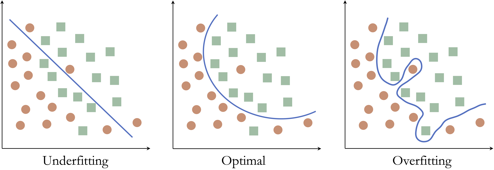
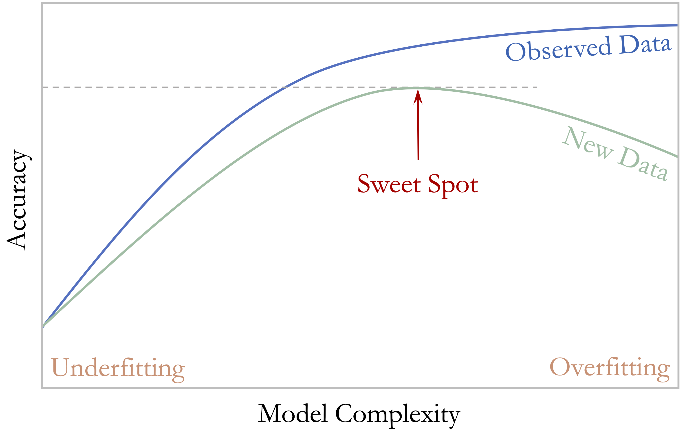
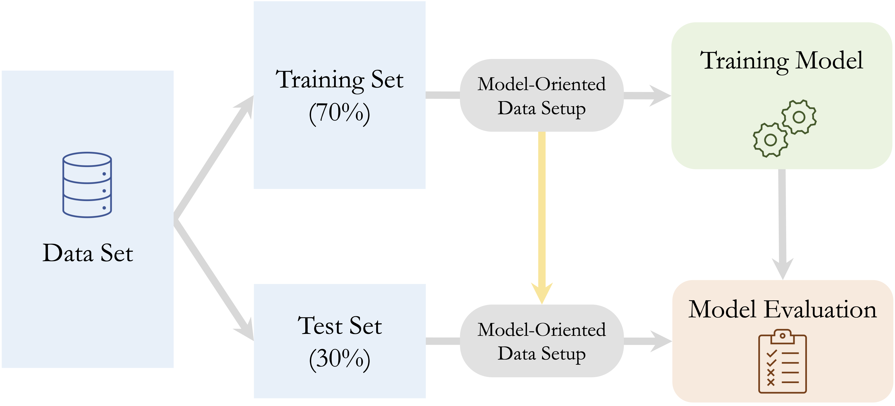
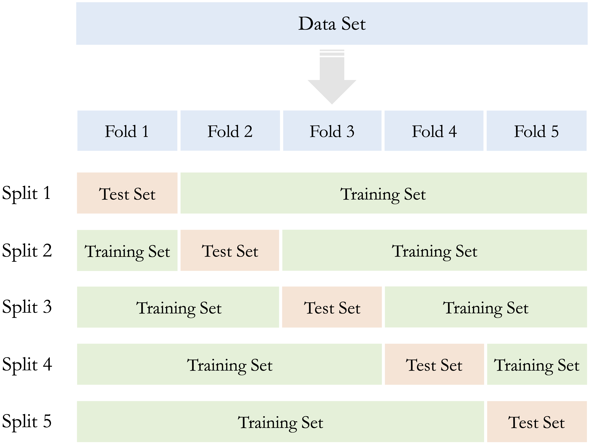
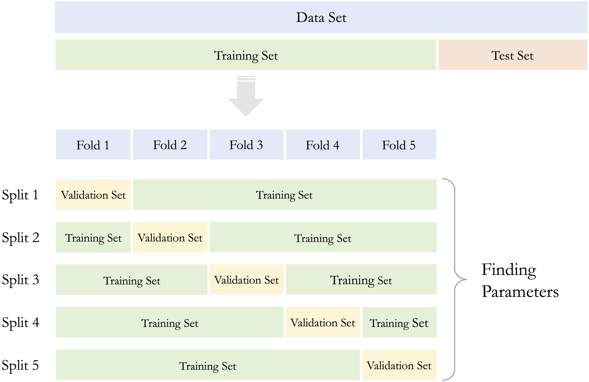

```{r echo=FALSE, message=FALSE, warning=FALSE}
source("_common.R")
```

# Data Setup for Modeling {#sec-ch6-setup-data}

::: {.content-visible when-format="pdf"}
\begin{chapterquote}
What we know is little, and what we are ignorant of is immense.

\hfill — Pierre-Simon Laplace
\end{chapterquote}
:::

::::: {.content-visible when-format="html"}
:::: chapterquote
What we know is little, and what we are ignorant of is immense.

::: author
— Pierre-Simon Laplace
:::
::::
:::::

Suppose a churn prediction model reports 95% accuracy, yet consistently fails to identify customers who actually churn. In such cases, the problem often lies not in the algorithm itself, but in how the data were prepared for modeling and evaluation. Before machine learning models can be trained and compared meaningfully, the data must be organized in a way that supports generalization to new observations.

This chapter focuses on the fourth stage of the Data Science Workflow shown in @fig-ch2_DSW: *Data Setup for Modeling*. Unlike the earlier stages, which emphasized cleaning, transforming, and exploring the data, this stage is concerned with preparing the dataset specifically for model development. The goal is to create a modeling workflow that supports fair comparison, reliable assessment, and reproducible results.

A dataset may therefore be clean and well understood, yet still be poorly prepared for predictive modeling. Problems often arise when the data are partitioned carelessly, when preprocessing steps are informed by the full dataset, or when class imbalance is ignored. In such cases, model performance may appear stronger during development than it will be in practice. Data setup for modeling therefore involves more than a technical rearrangement of the dataset: it requires decisions that affect how models learn, how they are compared, and how their performance is judged. In this chapter, we examine how to structure the data so that model development remains aligned with the central goal of supervised learning: strong performance on new data rather than only on the observed sample.

The previous chapters laid the foundation for this stage. In @sec-ch2-Problem-Understanding, we defined the modeling objective. In @sec-ch3-data-preparation and Chapter [-@sec-ch4-EDA], we cleaned and explored the data. Chapter [-@sec-ch5-statistics] introduced inferential tools that will help us assess whether training and test sets are reasonably comparable.

### What This Chapter Covers {.unnumbered .unlisted}

We begin by introducing model fit and generalization, including the ideas of underfitting and overfitting, to clarify why predictive modeling requires more than fitting the observed data closely. We then examine how to partition the data into training and test sets, how to validate whether a split is reasonably representative, and how cross-validation can provide a more stable basis for model development.

Next, we discuss data leakage as a central risk in predictive modeling and establish the guiding principle that all data-dependent transformations must be learned from the training data only. We then turn to model-specific feature preparation, focusing on encoding categorical variables and scaling numerical predictors for algorithms that require numerical or comparable inputs. Finally, we address class imbalance and show how balancing strategies can improve model training while preserving fair evaluation.

Taken together, these topics define what it means to prepare data for predictive modeling in a principled way. They provide the foundation for the modeling chapters that follow, where these steps will be applied repeatedly in practice.

## Model Fit and Generalization: Underfitting and Overfitting

After cleaning the data and exploring its main patterns, we may be tempted to move directly to model fitting. Yet a dataset that is ready for analysis is not always ready for predictive modeling. We must also consider how model performance will be evaluated and whether the model is likely to perform well on new observations.

A central goal of machine learning is *generalization*: the ability of a model to perform well not only on the data used to develop it, but also on unseen data. A model may appear highly accurate on familiar observations yet perform poorly in practice if it has learned patterns that do not extend beyond the sample. For this reason, predictive modeling is not only about fitting the observed data, but about learning structure that remains useful for future predictions.

This concern leads directly to the idea of *model fit*. In machine learning, model fit refers to how well a model captures the relationship between predictors and the outcome in the available data. Good fit does not mean reproducing the observed sample as closely as possible. Instead, it means capturing the main signal in the data without adapting so closely that random noise is treated as meaningful structure.

When model complexity is poorly matched to the data, two common problems arise: *underfitting* and *overfitting*. Underfitting occurs when a model is too simple to capture important relationships, so it performs poorly even on the observed data. Overfitting occurs when a model is too complex and adapts too closely to the sample at hand. In that case, performance on the training data may look excellent, but part of what the model has learned is noise rather than signal.

To illustrate these ideas, consider a simple classification example with two classes in a two-dimensional feature space. The goal is to construct a decision boundary that separates the classes as accurately as possible.

Figure [-@fig-ch6-overfitting-underfitting] shows three possible decision boundaries. The left panel is too simple and misclassifies many observations, illustrating *underfitting*. The middle panel captures the main structure of the data without unnecessary complexity. The right panel is highly irregular and perfectly classifies the observed points, illustrating *overfitting* because the boundary has adapted too closely to the sample.

```{r fig-ch6-overfitting-underfitting, echo = FALSE, out.width = "100%", fig.cap = "Illustration of underfitting, appropriate model complexity, and overfitting. The left panel shows an overly simple decision boundary, the middle panel shows a well-balanced model, and the right panel shows an overly complex boundary that fits noise in the observed data."}

```

These examples show that good predictive modeling requires a balance. A model that is too simple may miss important structure, whereas a model that is too complex may capture patterns that do not generalize beyond the observed sample.

The same idea appears more generally in the relationship between model complexity and predictive performance. Figure [-@fig-model-complexity] shows the typical pattern: as model complexity increases, performance on the observed data usually improves, while performance on new data improves only up to a point and may then decline.

```{r fig-model-complexity, echo = FALSE, out.width = "65%", fig.cap = "Relationship between model complexity and predictive performance on observed data and new data. Performance on observed data typically improves as model complexity increases, while performance on new data first improves and then declines because of overfitting."}

```

As complexity grows, the model can adapt more closely to the observed data, so performance on those data often increases steadily. Performance on new data follows a different pattern: it may improve at first as the model becomes flexible enough to capture meaningful structure, but beyond a certain point it declines because the model begins to fit noise. The most useful model is therefore not the one that performs best on the observed data, but the one that performs best on new data.

This tension between fitting the observed data and performing well on new data is the reason that data partitioning and resampling are central to supervised learning. To assess whether a model is likely to generalize well, we need an evaluation strategy that approximates prediction on unseen observations. In the next section, we introduce two such strategies: the train-test split and cross-validation.

## Data Partitioning and Cross-Validation {#sec-ch6-cross-validation}

To assess whether a model is likely to generalize well, we need an evaluation strategy that separates model development from model assessment. In this section, we explain why data partitioning is necessary, introduce the train-test split, examine how to validate whether a split is reasonably representative, and then show how cross-validation provides a more stable basis for model development.

### Why We Partition Data {.unnumbered .unlisted}

As discussed in the previous section, a predictive model should be judged not only by how well it fits the observed data, but by how well it is likely to perform on new observations. If the same data are used both to fit a model and to judge its performance, the resulting estimate is often too optimistic.

For this reason, supervised learning typically begins by partitioning the data into subsets that play different roles in the modeling process. The training data are used to fit models. Validation data, whether obtained through a separate validation set or through resampling, are used during model development to compare models or tune hyperparameters. The test set is reserved for final assessment and should be used only after the modeling decisions have been completed.

Throughout the modeling chapters of this book, we follow a three-step workflow:

1. *Partition* the dataset and validate the split.
2. *Prepare, train, and tune* models using the training data.
3. *Assess* predictive performance on the test data.

This structure preserves the distinction between model development and final evaluation and provides a more realistic basis for judging how well a model is likely to generalize.

Importantly, model-oriented data setup takes place only after the train-test split has been created. Transformations such as encoding, scaling, balancing, and resampling must be learned from the training data and then applied unchanged to validation or test data so that information from those data does not leak into model development. Figure [-@fig-modeling] summarizes this workflow.

```{r fig-modeling, echo = FALSE, out.width = "85%", fig.cap = "Supervised learning workflow based on a train-test split. The dataset is first partitioned into training and test sets. Model-oriented data setup, model training, and tuning are then carried out using the training data, while the test set is reserved for final assessment on unseen observations."}

```

### The Train-Test Split as a Basic Evaluation Strategy {.unnumbered .unlisted}

We now turn to the simplest and most widely used partitioning strategy in supervised learning: the *train-test split*, also known as the *holdout method*. In this approach, the dataset is divided into two subsets: one for model development and one for final assessment. Because the model is evaluated on observations that were not used to fit it, the train-test split provides a straightforward way to approximate predictive performance on new data.

The choice of split ratio depends on the size of the dataset and the purpose of the analysis. Common choices include 70--30, 80--20, and 90--10. Larger training sets provide more information for model fitting, whereas larger test sets provide a more stable basis for final assessment. In classification problems, it is often helpful to create the split in a way that preserves the class proportions of the outcome variable across the two subsets.

Random partitioning is common in many supervised learning problems, but it is not always appropriate. In settings where observations have a natural order or dependency structure, such as time series data, the split should respect that structure. For example, in the `bike_demand` case study in Chapter [-@sec-ch10-regression], the training set is constructed from earlier time points and the test set from later ones so that the evaluation reflects the way predictions would be made in practice.

An important rule follows immediately from this setup: partitioning should occur *before* any data-dependent preprocessing steps, such as scaling, encoding, imputation, or class balancing. These transformations must be learned from the training data and then applied unchanged to validation or test data so that information from those data does not leak into model development.

We illustrate the train-test split using R and the **liver** package. We return to the `churn` dataset introduced in Chapter [-@sec-ch4-EDA-churn], which will also be used in the classification chapters that follow.

```{r}
library(liver)

data(churn)
```

A small number of observations in the variables `education`, `income`, and `marital` are recorded as `"unknown"`. For the moment, we treat `"unknown"` as a valid category, since our focus here is on partitioning rather than on feature preparation.

In this book, we use the `partition()` function from the **liver** package because it provides a simple and consistent interface that we will use throughout the modeling chapters. The code below creates an 80--20 split:

```{r}
set.seed(42)

splits = partition(data = churn, ratio = c(0.8, 0.2))

train_set = splits$part1
test_set  = splits$part2
```

The command `set.seed(42)` ensures that the same random split is obtained each time the code is run, which supports reproducibility. The value 42 is arbitrary, although it is a familiar choice in programming examples. 

> *Practice:* Using the `partition()` function, repeat the train-test split with a 70--30 ratio. Compare the sizes of the training and test sets using `nrow(train_set)` and `nrow(test_set)`. Reflect on how the choice of split ratio may influence both model learning and evaluation stability.

Although the train-test split is simple and widely used, it should not be accepted uncritically. After partitioning the data, we should still examine whether the resulting subsets are reasonably representative of the original dataset. The next subsection discusses how to validate the quality of the split.

### Validating the Train-Test Split {.unnumbered .unlisted}

Creating a train-test split is an essential first step in model evaluation, but the split should not be accepted uncritically. After partitioning the data, we should examine whether the training and test sets remain reasonably representative of the original dataset. If one subset differs too strongly from the other, the resulting evaluation may give a misleading picture of model performance.

In practice, validation usually involves comparing the distributions of the outcome variable and a small number of influential predictors across the training and test sets. It is rarely necessary, or practical, to examine every feature, especially in high-dimensional settings. Instead, we focus on variables that are central to the modeling problem or especially important for interpretation. The choice of statistical test depends on the type of variable being examined, as summarized in @tbl-partition-test.

::: {#tbl-partition-test .table}
| Type of Feature                     | Suggested Test    |
|-------------------------------------|-------------------|
| Numerical                           | Two-sample t-test |
| Binary                              | Two-sample Z-test |
| Categorical (with $> 2$ categories) | Chi-square test   |

Suggested hypothesis tests (from @sec-ch5-statistics) for validating partitions, based on the type of feature.
:::

These tests should be viewed as diagnostic tools rather than formal proof that the two subsets are equivalent. In large samples, even minor differences may become statistically significant, whereas in smaller samples meaningful differences may go undetected. For this reason, validation should be interpreted as a practical check on whether the split is suitable for fair model assessment.

To illustrate the process, consider again the `churn` dataset. We begin by examining whether the proportion of churners is similar in the training and test sets. Since the target variable `churn` is binary, a two-sample Z-test is appropriate. The hypotheses are
$$
\begin{cases}
H_0: \pi_{\text{churn, train}} = \pi_{\text{churn, test}} \\
H_a: \pi_{\text{churn, train}} \neq \pi_{\text{churn, test}}
\end{cases}
$$

The following code performs the test:

```{r}
x1 <- sum(train_set$churn == "yes")
x2 <- sum(test_set$churn == "yes")

n1 <- nrow(train_set)
n2 <- nrow(test_set)

test_churn <- prop.test(x = c(x1, x2), n = c(n1, n2))
test_churn
```

Here, $x_1$ and $x_2$ are the numbers of churners in the training and test sets, and $n_1$ and $n_2$ are the corresponding sample sizes. The `prop.test()` function compares the two proportions and returns a $p$-value for assessing whether the observed difference is larger than expected from random variation alone.

The resulting $p$-value is `r round(test_churn$p.value, 3)`. Since this value exceeds $\alpha = 0.05$, we do not reject $H_0`. This suggests that the churn rates in the training and test sets do not differ substantially, so the partition appears reasonably balanced with respect to the outcome variable.

Beyond the outcome variable, it is also useful to compare a few influential predictors. For example, numerical variables such as `age` or `available_credit` can be examined using two-sample $t$-tests, while categorical variables such as `education` can be compared using Chi-square tests. Although it is rarely feasible to test every predictor, examining a carefully chosen subset provides a useful check on whether the partition is suitable for model development and evaluation.

> *Practice:* Validate the train-test split using two different types of variables. First, use a Chi-square test to examine whether the distribution of `income` differs between the training and test sets. Create a contingency table with `table()` and apply `chisq.test()`. Then use a two-sample `t.test()` to examine whether the mean of `transaction_amount_12` differs across the two sets. Reflect on how imbalances in categorical and numerical predictors might affect model development and evaluation.

### Why a Single Split May Be Unstable {.unnumbered .unlisted}

A train-test split may appear reasonable and still provide an unstable basis for evaluation. Because the split is only one random division of the data, the resulting performance estimate can depend strongly on how the observations happen to be assigned. This sensitivity is especially noticeable in smaller datasets or when the outcome is imbalanced.

If validation reveals meaningful differences between the training and test sets, the partition should be reconsidered. One option is to repeat the split with a different random seed or adjust the split ratio slightly. Another is to use stratified sampling, which preserves the proportions of key categorical variables, especially the outcome variable, across the two subsets.

More broadly, even a reasonably balanced split may still produce a performance estimate that is too dependent on one particular partition. When this instability becomes a concern, it is often better to move beyond the holdout method and use cross-validation, which averages performance across multiple splits. The next subsection introduces $k$-fold cross-validation as a more stable alternative.

### k-Fold Cross-Validation {.unnumbered .unlisted}

When a single train-test split provides an unstable or overly sample-dependent performance estimate, a more robust alternative is *k*-fold cross-validation. This is one of the most widely used resampling strategies in machine learning because it provides a more stable basis for model assessment while making efficient use of the available data.

In *k*-fold cross-validation, the dataset is divided into *k* non-overlapping subsets of approximately equal size, called *folds*. In each iteration, the model is trained on *k - 1* folds and evaluated on the remaining fold, which serves as the validation set. This process is repeated *k* times so that each fold is used once for validation and *k - 1* times for training. The resulting performance values are then averaged to produce an overall estimate. Common choices for $k$ are 5 or 10, as illustrated in Figure [-@fig-cross-validation] for the case $k = 5$.

```{r fig-cross-validation, echo = FALSE, out.width = "65%", fig.cap = "Illustration of k-fold cross-validation. The dataset is divided into $k$ folds ($k = 5$ shown). In each iteration, the model is trained on $k - 1$ folds (green) and evaluated on the remaining fold (yellow)."}

```

Compared with a single holdout split, *k*-fold cross-validation reduces sensitivity to one particular partition of the data. Because the model is evaluated repeatedly across different validation folds, the final estimate is usually more stable than the result obtained from one train-test split alone. Each iteration produces one validation result, and the average across all folds provides the cross-validated performance estimate.

Another advantage is that each observation contributes to both training and validation, though in different iterations. This makes more efficient use of the available data, which is especially helpful when the sample size is limited. At the same time, *k*-fold cross-validation remains computationally feasible for many practical modeling tasks.

In this book, we use cross-validation primarily during model development: for example, to compare candidate models or tune hyperparameters. Final model assessment, however, should still be carried out on an untouched test set. The next subsection explains how cross-validation fits within that broader workflow.

### Cross-Validation Within the Training Set {.unnumbered .unlisted}

Although cross-validation provides a more stable basis for model assessment than a single train-test split, it must be used carefully. In particular, the test set should remain untouched during model development. If the test set influences model selection, hyperparameter tuning, or preprocessing decisions, the final evaluation no longer reflects performance on truly unseen data.

For this reason, cross-validation is typically applied *within the training set*, not on the full dataset. A common workflow is illustrated in Figure [-@fig-cross-validation-2] and proceeds as follows:

1. Partition the data into training and test sets.
2. Use cross-validation within the training set to compare models or tune hyperparameters.
3. Select the preferred model based on the cross-validation results.
4. Evaluate the final model once on the untouched test set.

```{r fig-cross-validation-2, echo = FALSE, out.width = "80%", fig.cap = "Cross-validation applied within the training set while the test set is reserved for final evaluation."}

```

This workflow preserves the distinction between model development and final model assessment. As a result, it provides a more realistic basis for judging how well the selected model is likely to perform on new observations.

The same logic applies to model-oriented data setup during resampling, since these transformations are part of model development rather than a separate preliminary step. If scaling, encoding, imputation, or balancing are carried out before cross-validation begins, information from the validation folds may leak into the training folds. The correct approach is to estimate these transformations within each training portion of the resampling procedure and then apply them to the corresponding validation portion. When the final model is later evaluated on the test set, the transformations learned from the training data should again be applied unchanged.

An example of this workflow appears in Chapter [-@sec-ch7-knn-choose-k], where the hyperparameter $k$ in a k-Nearest Neighbors model is tuned using cross-validation within the training set. The same logic will be used throughout the modeling chapters that follow.

## Data Leakage and How to Prevent It {#sec-ch6-data-leakage}

A common reason why models appear to perform well during development yet disappoint in practice is *data leakage*: information from outside the intended training process unintentionally influences model fitting, model selection, or evaluation. When leakage occurs, performance estimates become overly optimistic because the model has indirectly benefited from information that would not be available in a genuine prediction setting.

Data leakage can arise in two broad ways. *Feature leakage* occurs when a predictor contains information that would not be available at the time the prediction is made. For example, in a fraud model, a variable indicating whether a chargeback was later issued would leak future information into the model. In a churn model, a variable recording whether a customer canceled the service after the prediction date would create the same problem. *Procedural leakage* occurs when data-dependent decisions are made using information from outside the training data, for example by preprocessing the full dataset before partitioning or by allowing the test set to influence model tuning.

Several common mistakes can violate this principle. Missing values may be imputed using summary statistics computed from the full dataset. Numerical variables may be scaled before the train-test split is created. One-hot encoding may be defined using all observations before resampling begins. Class balancing may be applied before partitioning, allowing duplicated or synthetic minority cases to influence both training and test sets. Even model tuning can introduce leakage if repeated adjustments are made after inspecting performance on the test set.

To illustrate, suppose a numerical feature is standardized using the mean and standard deviation of the full dataset before the train-test split is created. Because the test set contributes to those quantities, the training process has already been influenced by information from outside the training data. The correct approach is to estimate the transformation using the training set only and then apply it unchanged to validation or test data.

The guiding principle for preventing leakage is simple: all data-dependent operations must be learned from the training data only. Once a rule has been estimated from the training data, such as an imputation value, a scaling parameter, an encoding scheme, a balancing procedure, or a selected subset of features, the same rule should be applied unchanged to validation or test data. In short, preprocessing, balancing, and tuning should all be carried out within the training process, while the test set is reserved for final evaluation only.

> *Practice:* Identify two preprocessing steps in this chapter (or in Chapter [-@sec-ch3-data-preparation]) that could cause data leakage if applied before partitioning. For each step, describe how the workflow should be modified so that the transformation is learned from the training data only and then applied unchanged to the test set.

A practical example of leakage prevention appears in Section [-@sec-ch7-knn-prep], where feature scaling is performed correctly for a k-Nearest Neighbors model. In larger projects, such steps are often combined within a unified workflow. In R, the **mlr3pipelines** package supports such structured pipelines and can help reduce data leakage and improve reproducibility; see @bischl2024applied for a fuller treatment.

## Encoding Categorical Features {#sec-ch6-encoding}

In this chapter, encoding is discussed not as a general cleaning step but as a model-dependent representation choice. Because many machine learning algorithms require numerical inputs, categorical predictors must often be transformed into a form suitable for modeling. These transformations should be learned from the training data and then applied unchanged to validation or test data.

The appropriate encoding method depends on the type of categorical variable. For ordinal variables, which have a meaningful ranking, ordinal encoding preserves the order of the categories using numeric values. For nominal variables, which have no intrinsic order, one-hot encoding is often more appropriate because it represents each category with a separate binary indicator.

In the `churn` dataset, for example, the variable `income` has an ordered structure and is therefore a natural candidate for ordinal encoding, whereas `marital` is unordered and is better suited to one-hot encoding. We consider these two approaches in turn.

### Ordinal Variables: Ordinal Encoding {.unnumbered .unlisted}

Ordinal encoding is appropriate for categorical variables with a meaningful ranking, such as `low`, `medium`, and `high`. The goal is to assign numeric values that preserve the order of the categories.

A simple approach is to assign rank values such as 1, 2, and 3. This preserves order, but it also assumes that the distance between adjacent categories is equal. In some settings, that assumption is acceptable. In others, it may be preferable to assign values that reflect approximate magnitudes, although this introduces a stronger modeling assumption than simple rank encoding. Ordinal encoding always preserves order, but it does not by itself justify treating the distances between categories as equal. When representative numerical values are assigned, the analyst is adding a stronger assumption that approximate magnitude is meaningful for the modeling task.

Consider the `income` variable in the training set derived from the `churn` dataset. Its levels range from `<40K` to `>120K`. If the goal is only to preserve order, these categories could be encoded as 1 through 5. If approximate economic distance is also relevant, a more informative alternative is to assign representative values such as approximate midpoints.

To illustrate this idea, we define the encoding rule using the ordered income categories and then apply the same rule to both the training and test sets created in Section [-@sec-ch6-cross-validation]:

```{r}
income_levels <- c("<40K", "40K-60K", "60K-80K", "80K-120K", ">120K")
income_values <- c(20, 50, 70, 100, 140)

train_set$income_score <- income_values[match(train_set$income, income_levels)]
test_set$income_score  <- income_values[match(test_set$income, income_levels)]
```

This representation may be more appropriate for models in which numerical spacing affects model behavior, such as linear or distance-based methods. The same category-to-value mapping must be preserved when the transformation is applied to validation or test data. Even in this case, the encoded variable should not automatically be interpreted as if it were a truly continuous measurement. The numerical values remain a modeling representation of ordered categories rather than direct observations on a natural metric scale.

The choice therefore depends on the modeling goal. If only order matters, simple rank values are often sufficient. If approximate magnitude is meaningful, representative numerical values may be preferable.

Ordinal encoding should be used only when the order of the categories is substantively meaningful. Applying it to nominal variables such as `red`, `green`, and `blue` would impose an artificial hierarchy and could distort the model.

> *Practice:* Apply ordinal encoding to the `cut` variable in the `diamonds` dataset. The levels of `cut` are `Fair`, `Good`, `Very Good`, `Premium`, and `Ideal`. Assign numeric values from 1 to 5, reflecting their order from lowest to highest quality. Then reflect on whether the distances between these quality levels should be treated as equal.

### Nominal Variables: One-Hot Encoding {.unnumbered .unlisted}

One-hot encoding is appropriate for nominal variables, whose categories have no intrinsic order. It represents each category by a separate binary indicator, allowing the model to use categorical information without imposing an artificial ranking.

For example, the variable `marital` in the `churn` dataset includes categories such as `married`, `single`, and `divorced`. One-hot encoding converts these into binary columns such as `marital_married`, `marital_single`, and `marital_divorced`, where each column indicates the presence or absence of one category. If a variable has $m$ levels, the transformation creates $m$ binary columns.

In a predictive modeling workflow, the set of dummy columns should be defined using the training data only. When the same transformation is later applied to validation or test data, those data must be aligned to exactly the same columns, even if some categories are absent in a particular subset. In other words, one-hot encoding is not only a way to represent nominal variables numerically, but also a transformation that must be learned within the training process and then applied unchanged.

This representation is especially useful for algorithms that require numerical inputs but should not treat categories as ordered, including methods such as kNN, neural networks, and linear models. In linear and logistic regression, one indicator column is often omitted to avoid perfect redundancy, whereas in other modeling contexts the full set of binary columns may be retained.


To illustrate the mechanics of one-hot encoding, we apply it to the `marital` variable in the training set created in Section [-@sec-ch6-cross-validation]. The goal here is to inspect the dummy-column structure that will later need to be preserved when the transformation is applied to other data subsets. We use the `one.hot()` function from the **liver** package:

```{r}
train_encoded <- one.hot(train_set, cols = c("marital"), dropCols = FALSE)

names(train_encoded)
```
The `cols` argument specifies the variable to encode. Setting `dropCols = FALSE` retains the original categorical variable alongside the new binary columns, whereas setting it to `TRUE` removes the original variable after encoding. The same indicator-column structure must then be applied consistently to validation or test data. If a category is absent from one subset, the encoding structure should still follow the columns defined from the training data.

One-hot encoding is simple and widely used, but it can substantially increase the number of predictors when applied to variables with many categories. For high-cardinality features such as zip codes or product identifiers, this increase in dimensionality may create practical and modeling challenges. In such cases, analysts often group levels, combine rare categories, or consider alternative representation strategies.

> *Practice:* Apply `one.hot()` to `card_category` in the training set, and inspect the resulting structure. How many additional columns are created, and how might this expansion affect model complexity? Then reflect on why the same indicator columns must also be preserved when the transformation is applied to the test set.

Once categorical predictors have been encoded appropriately, attention turns to numerical predictors, whose scales may also influence how models learn from the data.


## Feature Scaling {#sec-ch6-feature-scaling}

Feature scaling is a model-oriented transformation used to place numerical predictors on comparable scales. Without scaling, variables with large numerical ranges may dominate model behavior, not because they are more informative, but simply because of their magnitude.

In practice, the importance of scaling depends on the modeling method. It is **essential** for distance-based algorithms such as *k*-Nearest Neighbors, where predictions depend directly on distances between observations. It is **often helpful** for gradient-based methods such as neural networks and logistic regression, where predictors on very different scales can make optimization less stable. It is **usually unnecessary** for tree-based models such as decision trees and random forests, which are generally insensitive to monotone changes in predictor scale.

For example, in the `churn` dataset, `available_credit` ranges from `r min(train_set$available_credit)` to `r max(train_set$available_credit)`, whereas `utilization_ratio` ranges from `r min(train_set$utilization_ratio)` to `r max(train_set$utilization_ratio)`. Without scaling, a model that depends on distances or gradient updates may be influenced more strongly by `available_credit` simply because its values are numerically larger.

In this section, we consider two common scaling methods. *Min-max scaling* rescales values to a fixed range such as $[0,1]$, whereas *z-score scaling* centers variables at zero and expresses them in units of standard deviation. In a predictive modeling workflow, the scaling rule must always be estimated from the training data and then applied unchanged to validation or test data.

### Min–Max Scaling {.unnumbered .unlisted}

Min-max scaling rescales a numerical feature to a fixed range, typically $[0, 1]$. It is especially useful for algorithms whose behavior depends on distances or gradient updates, such as *k*-Nearest Neighbors and neural networks. Without scaling, predictors with larger numerical ranges may exert disproportionate influence simply because of their magnitude.

The transformation is defined by
$$
x_{\text{scaled}} = \frac{x - x_{\min}}{x_{\max} - x_{\min}},
$$
where $x_{\min}$ and $x_{\max}$ are the minimum and maximum values used for scaling. After transformation, the smallest observed value becomes 0 and the largest becomes 1.

In a predictive modeling workflow, these scaling parameters must be estimated from the training data only. If the minimum and maximum are computed from the full dataset before partitioning, information from the test set enters the transformation and compromises the validity of model assessment.

To illustrate, consider the variable `age` in the training and test sets derived from the `churn` dataset. We first compute the training-set minimum and maximum, then use those same values and the `minmax()` function from the **liver** package to scale both subsets:

```{r}
age_min <- min(train_set$age, na.rm = TRUE)
age_max <- max(train_set$age, na.rm = TRUE)

train_set$age_minmax <- minmax(train_set$age, min = age_min, max = age_max)
test_set$age_minmax  <- minmax(test_set$age,  min = age_min, max = age_max)
```

This procedure ensures that the scaling rule is learned from the training data and then applied unchanged to the test data. As a result, the training set is mapped to the $[0,1]$ range, while test values may occasionally fall outside that range if they lie beyond the minimum or maximum observed in the training data. The plots below illustrate the effect of the transformation for the training set:

```{r}
#| layout-ncol: 2
#| fig-width: 4
#| fig-height: 4

ggplot(data = train_set) +
  geom_histogram(aes(x = age), bins = 15) +
  ggtitle("Before Min-Max Scaling")

ggplot(data = train_set) +
  geom_histogram(aes(x = age_minmax), bins = 15) +
  ggtitle("After Min-Max Scaling")
```
The plots show that min-max scaling changes the range of the training variable to $[0,1]$ while preserving its overall distributional shape. This is useful for models that are sensitive to numerical magnitude.

Min–max scaling is simple and often effective, but it is sensitive to outliers. If the training data contain extreme values, most observations may be compressed into a narrow range after scaling. For this reason, min–max scaling is most useful when a bounded scale is desirable and the data are not dominated by extreme observations.

We next consider *z-score scaling*, which standardizes variables around zero and is often preferred when relative deviation from the mean is more important than a fixed bounded range.

### Z-Score Scaling {.unnumbered .unlisted}

While min-max scaling rescales values to a fixed range, *z-score scaling* (or *standardization*) centers a numerical feature at zero and rescales it to have unit variance. This is especially useful when model behavior depends on the relative scale of predictors, for example in methods that rely on gradient-based optimization or on coefficient estimation across variables measured in different units.

The transformation is defined by
$$
x_{\text{scaled}} = \frac{x - \mu}{\sigma},
$$
where $\mu$ and $\sigma$ denote the mean and standard deviation used for scaling. After transformation, each value is expressed in standard deviation units relative to the mean.

Unlike min-max scaling, z-score scaling does not place a variable in a fixed bounded range. It also does not make a variable normally distributed. Instead, it changes the location and scale of the variable while preserving its overall distributional shape. If a variable is skewed before standardization, it remains skewed afterward.

In a predictive modeling workflow, the mean and standard deviation must be estimated from the training data only. If they are computed from the full dataset before partitioning, information from the test set enters the transformation and compromises the validity of model assessment.

To illustrate, consider the variable `age` in the training and test sets derived from the `churn` dataset. We first compute the training-set mean and standard deviation, then use those same values and the `zscore()` function from the **liver** package to standardize both subsets:

```{r}
age_mean <- mean(train_set$age, na.rm = TRUE)
age_sd   <- sd(train_set$age, na.rm = TRUE)

train_set$age_z <- zscore(train_set$age, mean = age_mean, sd = age_sd)
test_set$age_z  <- zscore(test_set$age,  mean = age_mean, sd = age_sd)
```

This procedure ensures that the standardization rule is learned from the training data and then applied unchanged to the test data. As a result, the training variable is centered around zero and expressed in standard deviation units, while the test variable is transformed using the same rule without allowing information from the test set to influence model development. The plots below illustrate the effect of the transformation for the training set:  

```{r}
#| layout-ncol: 2
#| fig-width: 4
#| fig-height: 4

ggplot(data = train_set) +
geom_histogram(aes(x = age), bins = 15) +
ggtitle("Before Z-Score Scaling")

ggplot(data = train_set) +
geom_histogram(aes(x = age_z), bins = 15) +
ggtitle("After Z-Score Scaling")
```

The plots show that z-score scaling centers the training variable around zero and expresses its spread in standard deviation units, while preserving the overall distributional shape. If the variable is skewed before standardization, it remains skewed afterward.

Z-score scaling is often helpful when predictor scale affects optimization or coefficient comparability. It is commonly used in methods such as logistic regression and neural networks, and it is often preferred when relative deviation from the mean is more informative than a fixed bounded range. Like min-max scaling, however, it can be influenced by outliers because both the mean and the standard deviation are sensitive to extreme values.

The choice between min-max scaling and z-score scaling depends on the modeling goal. min-max scaling is useful when a bounded scale is desirable, whereas z-score scaling is often preferable when predictors should be centered and interpreted in units of standard deviation.

## Dealing with Class Imbalance {#sec-ch6-balancing}

Imagine training a fraud detection model that labels every transaction as legitimate. It might achieve very high accuracy, yet fail completely at detecting fraud. This illustrates the challenge of *class imbalance*: a setting in which one class dominates the dataset while the rarer class carries the greatest practical importance.

Class imbalance becomes a problem when the minority class is too rare for the model to learn its patterns effectively or when errors on that class are especially costly. This situation is common in practice: fraudulent transactions are rare, most customers do not churn, and many medical conditions have relatively low prevalence. In such settings, a model may achieve high overall accuracy simply by predicting the majority class most of the time.

For this reason, class imbalance is not only a data problem but also an *evaluation problem*. When the classes are highly uneven, overall accuracy may give a misleading impression of model quality. Performance measures that focus on the minority class, such as recall, precision, or related metrics discussed in Chapter [-@sec-ch8-evaluation], often become more informative. Whether imbalance requires intervention therefore depends not only on class proportions, but also on the practical consequences of misclassification and on which performance measures will be used to judge the model.

Several response options are available. *Oversampling* increases the representation of the minority class, either by duplicating existing cases or by generating synthetic examples. *SMOTE* (Synthetic Minority Over-sampling Technique), for example, creates synthetic minority cases by interpolating between nearest neighbors. *Undersampling* reduces the number of majority-class observations and can be useful when the dataset is large. *Hybrid approaches* combine oversampling and undersampling. Another option is *class weighting*, in which the model assigns greater penalty to misclassification of the minority class. Many algorithms, including logistic regression and decision trees, support class weighting directly.

Each of these strategies involves trade-offs. Simple oversampling may improve minority-class representation, but it can also increase the risk of overfitting when existing minority cases are merely duplicated. Undersampling may reduce computational burden, but it may also discard useful information from the majority class. The most appropriate choice depends on the model type, the size of the dataset, and the evaluation objective.

To illustrate, consider the `creditcard_fraud` dataset from the **liver** package. The original source dataset is extremely imbalanced, with fraud representing only a very small fraction of all transactions (less than 0.2%). For teaching purposes, we use a smaller subset that retains all fraud cases and a random sample of non-fraud cases, so that the imbalance remains substantial while still allowing meaningful model evaluation. This makes the example easier to work with in practice while preserving a clearly imbalanced classification setting. We first partition the data into training and test sets and then examine the class distribution in the training set:

```{r}
data(creditcard_fraud)
set.seed(42)

fraud_splits <- partition(data = creditcard_fraud, ratio = c(0.7, 0.3))

train_fraud <- fraud_splits$part1
test_fraud  <- fraud_splits$part2

table(train_fraud$Class)
prop.table(table(train_fraud$Class))
```

In this dataset, the fraud class (`Class = 1`) represents approximately `r round(prop.table(table(train_fraud$Class))["1"], 4) * 100`% of the training observations. This proportion does not automatically imply that rebalancing is necessary, but it does raise concern that the model may focus too heavily on the majority class.

As a practical heuristic, imbalance often begins to matter when the minority class makes up roughly 10--15% or less of the data, especially in small to moderate-sized samples. This threshold is only a guideline, however. A better basis for deciding whether to intervene is to consider class prevalence together with model behavior and the practical cost of minority-class errors.

One simple response is to rebalance the training data by oversampling the minority class. In R, this can be done with the `ovun.sample()` function from the **ROSE** package:

```{r}
library(ROSE)

balanced_train_fraud <- ovun.sample(
  Class ~ .,
  data = train_fraud,
  method = "over",
  p = 0.15
)$data

table(balanced_train_fraud$Class)
prop.table(table(balanced_train_fraud$Class))
```

The argument `Class ~ .` specifies that balancing is performed with respect to the outcome variable while retaining all predictors. Here, the fraud class is oversampled so that it represents 15% of the training data.

Balancing must always be performed *after partitioning* and applied only to the *training set*. The test set should retain the original class distribution, because it represents the real-world population on which the model will ultimately be evaluated. Altering the test distribution would distort performance estimates and undermine the validity of model assessment.

In summary, class imbalance should be addressed when it interferes with the model’s ability to learn or evaluate the minority class meaningfully. The choice of remedy depends on the data, the modeling method, and the evaluation goal, but the guiding rule remains the same: rebalance only within the training process, and keep the test set untouched.

> *Practice:* Change the oversampling proportion from `p = 0.15` to `p = 0.20` and then to `p = 0.30`. Compare the resulting class distributions and reflect on how the choice of `p` may influence both minority-class learning and the risk of overfitting.

## Chapter Summary and Takeaways

This chapter completed *Step 4: Data Setup for Modeling* in the Data Science Workflow. The central lesson is that good modeling requires more than fitting the observed data closely. A useful model must generalize well to new observations, and that requires a careful separation between model development and model assessment.

Several principles follow from this idea. First, the data should be partitioned before any model-oriented transformation is performed. Second, all data-dependent steps, such as encoding, scaling, balancing, and tuning, should be learned from the training data only and then applied unchanged to validation or test data. Third, cross-validation should be used within the training set when model comparison or hyperparameter tuning requires a more stable basis than a single split. Fourth, encoding and scaling should be chosen according to the needs of the algorithm rather than applied mechanically. Finally, when class imbalance threatens meaningful learning of the minority class, any balancing strategy must be applied only to the training data, while the test set remains untouched.

Together, these principles provide the practical foundation for the modeling chapters that follow. In the next chapter, we begin applying them in practice with one of the most intuitive classification methods: *k*-Nearest Neighbors.

## Exercises {#sec-ch6-exercises}

These exercises reinforce the main ideas of this chapter: generalization, partitioning, validating the split, preventing data leakage, preparing predictors for modeling, and handling class imbalance. Some questions focus on conceptual understanding, while others ask you to implement the ideas in R.

### Conceptual Questions {.unnumbered .unlisted}

1. Why must a useful predictive model generalize beyond the data on which it was trained?

2. Explain the difference between underfitting and overfitting. Why are both problematic for prediction?

3. Why is it not sufficient to evaluate a model on the same data used to fit it?

4. Describe the roles of the training set, validation data, and test set in supervised learning.

5. Why should a train-test split be validated rather than accepted automatically? In your answer, explain why split validation should be treated as a practical diagnostic step rather than as formal proof that the training and test sets are equivalent.

6. Define *data leakage* in your own words. Then distinguish between *feature leakage* and *procedural leakage*.

7. Give one example of feature leakage and one example of procedural leakage.

8. Why should data-dependent transformations such as imputation, scaling, encoding, or balancing be learned from the training data only?

9. Explain why cross-validation should usually be applied within the training set rather than on the full dataset.

10. Why are encoding and scaling discussed in this chapter as model-oriented transformations rather than as general data cleaning steps?

11. Explain the difference between ordinal and nominal categorical variables. Why does this distinction matter when choosing an encoding method?

12. When is ordinal encoding preferable to one-hot encoding, and what risk arises if ordinal encoding is applied to a nominal variable?

13. Why must the dummy-column structure for one-hot encoding be defined from the training data and then preserved when applied to validation or test data?

14. Compare min-max scaling and z-score scaling. In what sense do they transform variables differently, and when is each one more appropriate?

15. Why does z-score scaling not make a skewed variable normally distributed?

16. Why is class imbalance not only a data problem but also an evaluation problem?

17. Why can a classifier achieve high overall accuracy and still perform poorly in an imbalanced setting?

18. Briefly compare oversampling, undersampling, SMOTE, and class weighting. For each, state one potential advantage and one possible drawback.

19. Why must balancing be applied only to the training set while the test set remains unchanged?

### Hands-On Practice {.unnumbered .unlisted}

The hands-on exercises below use the `churn_mlc`, `bank`, `loan`, and `creditcard_fraud` datasets from the **liver** package.

```{r}
library(liver)

data(churn_mlc)
data(bank)
data(loan)
data(creditcard_fraud)
```

20. Partition the `churn_mlc` dataset into 75% training data and 25% test data. Use a reproducible seed and report the number of observations in each subset.

21. Partition the `bank` dataset using a 90--10 split. Briefly comment on the trade-off between using more data for training and reserving more data for final assessment.

22. Apply a 60--40 split to the `loan` dataset and save the results as `train_loan` and `test_loan`. Why might this split be less attractive than an 80--20 split when the dataset is not very large?

23. Suppose you are working with time-ordered data such as `bike_demand`. Explain why random partitioning would be inappropriate and describe a more suitable train-test splitting strategy.

24. Use a two-sample Z-test to examine whether the churn proportion differs between the training and test sets of `churn_mlc`.

25. In the `bank` dataset, apply a two-sample $t$-test to evaluate whether the mean of `age` differs across the training and test sets.

26. In the `bank` dataset, apply a Chi-square test to examine whether the distribution of `marital` differs across the training and test sets.

27. Select one numerical variable and one categorical variable from the `loan` dataset. Validate the partition using an appropriate statistical test for each, and briefly interpret the results.

28. Identify two preprocessing steps from this chapter that could cause leakage if performed before partitioning. For each, describe the correct workflow and, where appropriate, illustrate it with a short code sketch.

29. In the `bank` dataset, identify one variable that is naturally ordinal and one that is nominal. For each, justify whether ordinal encoding or one-hot encoding is more appropriate.

30. Apply ordinal encoding to the `education` variable in the training and test sets of the `bank` dataset, ordering the levels from `primary` to `tertiary`. Explain whether your encoding preserves only order or also implies approximate magnitude.

31. Apply one-hot encoding to the `marital` variable in the training set of the `bank` dataset using the `one.hot()` function from the **liver** package. Display the resulting column names and explain why the same indicator-column structure must later be preserved for the test set.

32. Apply min-max scaling and z-score scaling to the numerical variables `age` and `balance` in the training and test sets of the `bank` dataset, using parameters estimated from the training set only. Then compare the transformed variables. Based on your results, explain when each scaling method is more appropriate.

33. Partition the `creditcard_fraud` dataset into training and test sets and report the class proportions in the training set. Why does this distribution raise concern for model development?

34. Use the **ROSE** package to oversample the minority class in the training set of `creditcard_fraud` so that the fraud class represents 15% of the training data. Report the new class proportions.

35. Change the oversampling target from `p = 0.15` to `p = 0.20` and then to `p = 0.30`. Compare the resulting class distributions and discuss how increasing the minority-class proportion may improve minority-class learning while also increasing the risk of overfitting.

### Self-Reflection {.unnumbered .unlisted}

36. Which part of this chapter currently feels most intuitive to you: partitioning, validation, encoding, scaling, or balancing? Which part still feels least natural, and why?

37. Looking across the whole chapter, what do you now see as the most important principle of data setup for modeling?


