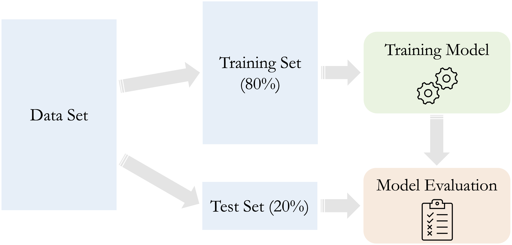

```{r echo=FALSE, message=FALSE, warning=FALSE}
source("_common.R")
```

# Data Setup for Modeling {#sec-ch6-setup-data}

::: {.content-visible when-format="pdf"}
\begin{chapterquote}
Prediction is very difficult, especially if it’s about the future.

\hfill — Niels Bohr
\end{chapterquote}
:::

::::: {.content-visible when-format="html"}
:::: chapterquote
Prediction is very difficult, especially if it’s about the future.

::: author
— Niels Bohr
:::
::::
:::::

Suppose a churn prediction model reports 95% accuracy, yet consistently fails to identify customers who actually churn. What went wrong? In many cases, the issue lies not in the algorithm itself but in how the data was prepared for modeling. Before reliable machine learning models can be built, the dataset must be structured to support learning, validation, and generalization.

This chapter focuses on the fourth stage of the Data Science Workflow shown in @fig-ch2_DSW: *Data Setup for Modeling*. This stage involves organizing the dataset so that it enables fair training, trustworthy validation, and robust generalization to unseen data.

To accomplish this, we focus on four core components of data setup: partitioning the data, validating the split, preparing predictors for modeling, and addressing class imbalance. Throughout these steps, we emphasize how to prevent data leakage by ensuring that data-dependent decisions are learned from the training set only.

The previous chapters laid the groundwork for this stage. In @sec-ch2-Problem-Understanding, we defined the modeling objective. In @sec-ch3-data-preparation and Chapter [-@sec-ch4-EDA], we cleaned and explored the data. Chapter [-@sec-ch5-statistics] introduced inferential tools that now help us assess whether training and test sets are statistically comparable.

We now turn to *Data Setup for Modeling*, a crucial but often underestimated step. At this stage, the goal is no longer cleaning the data but structuring it for learning and evaluation. Proper data setup prevents overfitting, biased evaluation, and data leakage, all of which can undermine model performance in practice.

This stage, particularly for newcomers, raises important questions: *Why is it necessary to partition the data?* *How can we verify that training and test sets are truly comparable?* *What can we do if one class is severely underrepresented?* *When and how should we scale or encode features?*

These questions are not merely technical. They reflect fundamental principles of modern data science, including fairness, reproducibility, and reliable generalization. By walking through partitioning, validation, balancing, and feature preparation, we lay the groundwork for building models that perform well and generalize reliably in real-world settings.

### What This Chapter Covers {.unnumbered}

This chapter completes Step 4 of the Data Science Workflow: *Data Setup for Modeling*. We begin by partitioning the dataset into training and test subsets to simulate real-world deployment and support fair evaluation. We also introduce cross-validation as a more robust method for performance estimation and show how to assess whether the resulting split is statistically representative using the inferential tools presented in Chapter [-@sec-ch5-statistics].

Next, we examine data leakage as a cross-cutting risk in predictive modeling. We show how leakage can arise during partitioning, balancing, encoding, scaling, or imputation, and establish the guiding principle that all data-dependent transformations must be learned from the training set only and then applied unchanged to the test set.

We then prepare predictors for modeling by encoding categorical variables and scaling numerical features. We present ordinal and one-hot encoding techniques, along with min–max and z-score transformations, so that predictors are represented in a form suitable for common machine learning algorithms.

Finally, we address class imbalance, a common challenge in classification tasks where one outcome dominates the dataset. We examine strategies such as oversampling, undersampling, and class weighting to ensure that minority classes are adequately represented during model training.

Together, these components form the structural foundation required before building and evaluating predictive models in the chapters that follow.

## Why Data Partitioning Is Necessary

When building predictive models, a common question arises: *Why do we need to split the data before training a model?* At first glance, it may seem natural to train a model on all available data in order to maximize the information available for learning. However, doing so prevents us from evaluating how well the model will perform on new observations. The central challenge in predictive modeling is *generalization*: the ability of a model to make accurate predictions on data that were not used during training.

In practice, a model that performs well on the data used to fit it does not necessarily perform well on unseen data. To approximate real-world prediction scenarios, the dataset is therefore divided into two parts: a *training set*, used to build the model, and a *test set*, reserved for evaluating its predictive performance. This separation allows us to assess whether the model has learned meaningful patterns or simply memorized the training data.

Partitioning the data helps reveal two common modeling pitfalls: *underfitting* and *overfitting*. These problems arise when model complexity is either too low or too high relative to the structure of the data.

To illustrate these ideas, consider a simple classification example. Suppose we have a two-dimensional dataset containing two classes of observations. The light-green square points belong to one class, while the soft-orange circle points belong to another class. The goal is to construct a decision boundary—a curve or straight line—that separates the two classes as accurately as possible.

Figure [-@fig-ch6-overfitting-underfitting] illustrates three possible decision boundaries for this dataset. The left panel shows a simple straight line that attempts to separate the two classes. Because this boundary is too simple to capture the structure of the data, it fails to separate many observations correctly. This situation is known as *underfitting*. The middle panel shows a more flexible curve that captures the underlying pattern in the data more effectively, balancing flexibility and simplicity. The right panel shows a highly complex curve that perfectly classifies every training observation. Although this boundary appears ideal, it is actually problematic. By bending excessively to fit each point, the model captures noise and random fluctuations in the training data rather than meaningful patterns. This phenomenon is known as *overfitting*.

```{r fig-ch6-overfitting-underfitting, echo = FALSE, out.width = "100%", fig.cap = "Illustration of underfitting, appropriate model complexity, and overfitting. The left panel shows an overly simple decision boundary, the middle panel shows a well-balanced model, and the right panel shows an overly complex boundary that fits noise in the training data."}

knitr::include_graphics("images/ch6_overfitting_underfitting.png")
```

These examples illustrate how model flexibility influences predictive performance. A model that is too simple cannot capture important relationships in the data, while a model that is too complex may capture noise instead of meaningful patterns. The challenge in predictive modeling is therefore to find a balance between these two extremes.

This relationship between model complexity and predictive performance can be illustrated more generally, as shown in Figure [-@fig-model-complexity], which depicts how training and test accuracy typically change as model complexity increases.

```{r fig-model-complexity, echo = FALSE, out.width = "65%", fig.cap = "Relationship between model complexity and predictive performance on the training and test sets. Training accuracy typically increases with model complexity, while test accuracy first improves and then declines due to overfitting."}

knitr::include_graphics("images/ch6_model_complexity.png")
```

As model complexity increases, performance on the training data generally improves because the model can fit the training observations more closely. Beyond a certain point, however, the model begins to overfit the training data, and its performance on unseen data declines. The optimal model therefore lies near the point where predictive performance on the test data is highest.

Comparing performance on the training and test sets helps diagnose both underfitting and overfitting. A large gap between high training accuracy and low test accuracy often indicates overfitting, whereas low accuracy on both sets suggests underfitting. To obtain more reliable estimates of predictive performance, data scientists often use *cross-validation*. The next section introduces this approach.


## Cross-Validation for Robust Model Evaluation {#sec-ch6-cross-validation}

As discussed in the previous section, evaluating a model on data not used during training is essential for assessing its ability to generalize. A common approach is the train–test split, where a portion of the dataset is reserved for evaluation. However, the performance estimate obtained from a single split can depend strongly on how the data happens to be divided. This variability becomes especially problematic for smaller datasets.

To obtain more stable and reliable estimates of predictive performance, data scientists often use *cross-validation*. Cross-validation is a resampling strategy that repeatedly partitions the data and evaluates the model across multiple training and validation subsets. By averaging performance across several splits, cross-validation provides a more reliable estimate of how well a model is likely to perform on new data.

Cross-validation typically takes place during the *evaluation stage* of the predictive modeling workflow. Throughout the modeling chapters of this book, we follow a simple and structured workflow:

1. *Partition* the dataset and validate the split.  
2. *Train* models on the training data.  
3. *Evaluate* model performance on unseen data.

To understand this workflow visually, see Figure [-@fig-modeling].

```{r fig-modeling, echo = FALSE, out.width = "85%", fig.cap = "General supervised learning workflow. The dataset is partitioned into training and test sets. Models are trained using the training data and evaluated on the test data to assess their ability to generalize."}

```

In practice, the evaluation stage often relies on cross-validation applied within the training data before the final model is assessed on the test set. The next subsection introduces the most common form of this strategy: *k*-fold cross-validation.

### k-Fold Cross-Validation {.unnumbered}

The most widely used form of cross-validation is *k*-fold cross-validation. In this approach, the dataset is randomly partitioned into *k* non-overlapping subsets of approximately equal size, called *folds*. The model is then trained on *k − 1* folds and evaluated on the remaining fold, which serves as the validation set. This procedure is repeated *k* times so that each fold is used once for validation and *k − 1* times for training. The final performance estimate is obtained by averaging the results across all iterations. Common choices for *k* are 5 or 10, as illustrated in Figure [-@fig-cross-validation] for the case $k = 5$.

```{r fig-cross-validation, echo = FALSE, out.width = "65%", fig.cap = "Illustration of k-fold cross-validation. The dataset is divided into k folds (k = 5 shown). In each iteration, the model is trained on k−1 folds (green) and evaluated on the remaining fold (yellow)."}

knitr::include_graphics("images/ch6_cross_validation.png")
```

The train–test split (holdout method) can be viewed as the simplest evaluation design: the model is trained once on the training set and evaluated once on the test set, as in Figure [-@fig-modeling]. By contrast, *k*-fold cross-validation repeats this train–validate cycle *k* times and averages the results. In this book, we often begin with the train–test split for clarity, and we use cross-validation when we need more stable estimates or when tuning hyperparameters.

Because each observation is used once for validation and multiple times for training in *k*-fold cross-validation, the method makes efficient use of the available data and typically produces more stable performance estimates than a single train–test split.

### Cross-Validation Within the Training Set {.unnumbered}

Although cross-validation improves the reliability of performance estimates, it must be used carefully to avoid data leakage. In particular, the test set should remain completely untouched during model development and should be used only once for final evaluation.

A common workflow therefore proceeds in three stages. First, the dataset is partitioned into a training set and a test set. Second, cross-validation is applied within the training set to compare candidate models or tune hyperparameters. Finally, after a model has been selected, its performance is evaluated once on the untouched test set. This strategy is illustrated in Figure [-@fig-cross-validation-2].

```{r fig-cross-validation-2, echo = FALSE, out.width = "80%", fig.cap = "Cross-validation applied within the training set while the test set is reserved for final evaluation."}

knitr::include_graphics("images/ch6_cross_validation_2.png")
```

By separating model development from final evaluation, this workflow provides a realistic estimate of predictive performance on unseen data. It also helps prevent data leakage, since the test set remains isolated from model training and tuning decisions. An example of the use of cross-validation for model selection appears in Chapter [-@sec-ch7-knn-choose-k], where the hyperparameter *k* in a k-Nearest Neighbors model is tuned using cross-validation within the training set. For further discussion of cross-validation and related evaluation methods, see Chapter 5 of *An Introduction to Statistical Learning* [@james2013introduction].

Before cross-validation can be applied, however, the dataset must first be divided into subsets for model training and evaluation. The most common strategy is the *train–test split*, in which one portion of the data is used to train the model while the remaining portion is reserved for assessing its predictive performance. The next section explains how this partitioning is carried out in practice.

## Partitioning Data: The Train–Test Split {#sec-train-test-split}

We now turn to the practical step of partitioning the dataset into separate subsets for model training and evaluation. The most common method is the *train–test split*, also known as the *holdout method*. In this approach, the dataset is divided into two subsets: a *training set* used to develop the model and a *test set* reserved for evaluating its ability to generalize to new, unseen data.

Typical split ratios include 70–30, 80–20, or 90–10, depending on the size of the dataset and the modeling objective. Both subsets contain the same predictors and outcome variable. However, only the training set outcomes are used during model fitting, while the test set outcomes are reserved exclusively for evaluation. Keeping the test set untouched during model training ensures an unbiased assessment of predictive performance.

As a general rule, partitioning should occur *before* applying any data-dependent preprocessing steps such as scaling, encoding, or imputation. If preprocessing decisions are based on the full dataset prior to partitioning, information from the test set may inadvertently influence the training process. Performing the split first helps prevent data leakage and preserves the integrity of model evaluation.

### Implementing the Train–Test Split in R {.unnumbered}

We illustrate the train–test split using R and the **liver** package. We return to the `churn` dataset introduced in Chapter [-@sec-ch4-EDA-churn], where the goal is to predict customer churn using machine learning models (discussed in the next chapter). We load the dataset as follows:

```{r}
library(liver)

data(churn)
```

Note that the dataset is relatively clean. A small number of entries in the `education`, `income`, and `marital` features are recorded as `"unknown"`. For simplicity in this section, we treat `"unknown"` as a valid category rather than converting it to a missing value. The focus here is solely on data partitioning; preprocessing steps will be addressed later in the chapter.

There are several ways to perform a train–test split in R, including functions from packages such as **rsample** or **caret**, or by writing custom sampling code in base R. In this book, we use the `partition()` function from the **liver** package because it provides a simple and consistent interface that is used throughout the modeling chapters.

The `partition()` function divides a dataset into subsets according to a specified ratio. Below, we split the dataset into 80 percent training data and 20 percent test data:

```{r}
set.seed(42)

splits = partition(data = churn, ratio = c(0.8, 0.2))

train_set = splits$part1
test_set  = splits$part2

test_labels = test_set$churn
```

The use of `set.seed(42)` ensures reproducibility, so that the same split is generated each time the code is executed. The `test_labels` vector stores the true target values from the test set. These labels are used only during model evaluation and must remain unseen during model training to avoid data leakage.

> *Practice:* Using the `partition()` function, repeat the train–test split with a 70–30 ratio. Compare the sizes of the training and test sets using `nrow(train_set)` and `nrow(test_set)`. Reflect on how the choice of split ratio may influence model performance and stability.

While the train–test split is simple and widely used, the resulting subsets should be examined to ensure that they remain representative of the original dataset. The next section therefore discusses how to validate the quality of the train–test split.

## Validating the Train–Test Split {#sec-ch6-validate-partition}

After partitioning the data, it is important to verify that the training and test sets are representative of the original dataset. A well-balanced split ensures that the training set reflects the broader population and that the test set provides a realistic assessment of model performance. Without this validation step, the resulting model may learn from biased data or fail to generalize in practice.

Validating a split involves comparing the distributions of key variables—especially the target and important predictors—across the training and testing sets. Because many datasets contain numerous features, it is common to focus on a subset of variables that play a central role in modeling. The choice of statistical test depends on the variable type, as summarized in @tbl-partition-test.

::: {#tbl-partition-test .table}
| Type of Feature                     | Suggested Test    |
|-------------------------------------|-------------------|
| Numerical                           | Two-sample t-test |
| Binary                              | Two-sample Z-test |
| Categorical (with $> 2$ categories) | Chi-square test   |

Suggested hypothesis tests (from @sec-ch5-statistics) for validating partitions, based on the type of feature.
:::

Each test has specific assumptions. Parametric methods such as the t-test and Z-test are most appropriate when sample sizes are large and distributions are approximately normal. For categorical variables with more than two levels, the Chi-square test is the standard approach.

To illustrate the process, consider again the `churn` dataset. We begin by evaluating whether the proportion of churners is consistent across the training and testing sets. Since the target variable `churn` is binary, a two-sample Z-test is appropriate. The hypotheses are: $$
\begin{cases}
H_0:  \pi_{\text{churn, train}} = \pi_{\text{churn, test}} \\
H_a:  \pi_{\text{churn, train}} \neq \pi_{\text{churn, test}}
\end{cases}
$$

The R code below performs the test:

```{r}
x1 <- sum(train_set$churn == "yes")
x2 <- sum(test_set$churn == "yes")

n1 <- nrow(train_set)
n2 <- nrow(test_set)

test_churn <- prop.test(x = c(x1, x2), n = c(n1, n2))
test_churn
```

Here, $x_1$ and $x_2$ represent the number of churners in the training and testing sets, respectively, and $n_1$ and $n_2$ denote the corresponding sample sizes. The `prop.test()` function carries out the two-sample Z-test and provides a *p*-value for assessing whether the observed difference in proportions is statistically meaningful.

The resulting *p*-value is `r round(test_churn$p.value, 3)`. Since this value exceeds the conventional significance level ($\alpha = 0.05$), we do not reject $H_0$. This indicates that the difference in churn rates is not statistically significant, suggesting that the split is balanced with respect to the target variable.

Beyond the target, it is helpful to compare distributions of influential predictors. Imbalances among key numerical variables (e.g., `age` or `available_credit`) can be examined using two-sample t-tests, while differences in categorical variables (e.g., `education`) can be assessed using Chi-square tests. Detecting substantial discrepancies is important because unequal distributions can cause the model to learn misleading patterns. Although it is rarely feasible to test every variable in high-dimensional settings, examining a targeted subset provides a practical and informative check on the validity of the partition.

> *Practice:* Use a Chi-square test to evaluate whether the distribution of `income` differs between the training and testing sets. Create a contingency table with `table()` and apply `chisq.test()`. Reflect on how differences in income levels across the two sets might influence model training.

> *Practice:* Examine whether the mean of the numerical feature `transaction_amount_12` is consistent across the training and testing sets. Use the `t.test()` function with the two samples. Consider how imbalanced averages in key financial variables might affect predictions for new customers.

### What If the Partition Is Invalid? {.unnumbered}

What should you do if the training and testing sets turn out to be significantly different? If validation reveals meaningful distributional differences between the subsets, corrective action is necessary to ensure that both more accurately reflect the original dataset.

One option is to revisit the random split. Even when sampling is random, uneven distributions may arise by chance. Adjusting the random seed or slightly modifying the split ratio can improve representativeness.

Another approach is to use stratified sampling, which preserves the proportions of key categorical variables—especially the target variable—across both training and test sets. This is particularly important in classification tasks where maintaining class proportions supports fair evaluation.

When sample sizes are limited or when a single split yields unstable results, cross-validation offers a more reliable alternative. By repeatedly training and validating the model on different subsets of the data, cross-validation reduces dependence on a single partition and provides more stable performance estimates.

Even with careful design, minor discrepancies may persist, particularly in small or high-dimensional datasets. In such cases, repeated sampling or bootstrapping techniques can further improve evaluation stability.

Validation is more than a procedural checkpoint; it is a safeguard for the integrity of the modeling workflow. By ensuring that the training and test sets are statistically comparable, we support fair evaluation and trustworthy conclusions.

However, even a perfectly balanced split does not guarantee valid evaluation. Another fundamental risk in predictive modeling remains: data leakage.

## Data Leakage and How to Prevent It {#sec-ch6-data-leakage}

A common reason why models appear to perform well during development yet disappoint in practice is *data leakage*: information from outside the training process unintentionally influences model fitting or model selection. Leakage leads to overly optimistic performance estimates because evaluation no longer reflects truly unseen data.

Data leakage can occur in two broad ways. First, *feature leakage* arises when predictors contain information that is directly tied to the outcome or would only be known after the prediction is made. Second, *procedural leakage* occurs when preprocessing decisions are informed by the full dataset before the train–test split, allowing the test set to influence the training process.

The guiding principle for preventing leakage is simple: all data-dependent operations must be learned from the training set only. Once a rule is estimated from the training data—such as an imputation value, a scaling parameter, or a selected subset of features—the same rule should be applied unchanged to the test set.

Leakage can arise even earlier than this chapter’s workflow, during data preparation. For example, suppose missing values are imputed using the overall mean of a numerical feature computed from the full dataset. If the test set is included when computing that mean, the training process has indirectly incorporated information from the test set. Although the numerical difference may seem small, the evaluation is no longer strictly out-of-sample. The correct approach is to compute imputation values using the training set only and then apply them to both the training and test sets.

This discipline must be maintained throughout the data setup phase. The test set should remain untouched while models are developed and compared and should be used only once for final evaluation. Cross-validation and hyperparameter tuning must be conducted entirely within the training set. Class balancing techniques such as oversampling or undersampling must also be applied exclusively to the training data. Likewise, encoding rules and scaling parameters should be estimated from the training set and then applied to the test set without recalibration. Any deviation from this workflow allows information from the test data to influence model development and compromises the validity of performance estimates.

> *Practice:* Identify two preprocessing steps in this chapter (or in Chapter [-@sec-ch3-data-preparation]) that could cause data leakage if applied before partitioning. For each step, describe how you would modify the workflow so that the transformation is learned from the training set only and then applied unchanged to the test set.

A practical example of leakage prevention is discussed in Section [-@sec-ch7-knn-proper-scaling], where feature scaling is performed correctly for a k-Nearest Neighbors model. The same principle applies throughout the modeling workflow: partition first, learn preprocessing rules using the training data only, tune models using cross-validation within the training set, and evaluate only once on the untouched test set.

## Encoding Categorical Features {#sec-ch6-encoding}

Categorical features often need to be transformed into numerical format before they can be used in machine learning models. Algorithms such as *k*-Nearest Neighbors and neural networks require numerical inputs, and failing to encode categorical data properly can lead to misleading results or even errors during model training.

Encoding categorical variables is a critical part of data setup for modeling. It allows qualitative information (such as ratings, group memberships, or item types) to be incorporated into models that operate on numerical representations. In this section, we explore common encoding strategies and illustrate their use with examples from the `churn` dataset, which includes the categorical variables `marital` and `education`.

The choice of encoding method depends on the nature of the categorical variable. For *ordinal* variables—those with an inherent ranking—ordinal encoding preserves the order of categories using numeric values. For example, the `income` variable in the `churn` dataset ranges from `<40K` to `>120K` and benefits from ordinal encoding.

In contrast, *nominal* variables, which represent categories without intrinsic order, are better served by one-hot encoding. This approach creates binary indicators for each category and is particularly effective for features such as `marital`, where categories like `married`, `single`, and `divorced` are distinct but unordered.

The following subsections demonstrate these encoding techniques in practice, beginning with ordinal encoding and one-hot encoding. Together, these transformations ensure that categorical predictors are represented in a form that machine learning algorithms can interpret effectively.

## Ordinal Encoding {#sec-ch6-ordinal-encoding}

For ordinal features with a meaningful ranking (such as `low`, `medium`, `high`), it is preferable to assign numeric values that reflect their order. This preserves the ordinal relationship in calculations, which would otherwise be lost with one-hot encoding.

There are two common approaches to ordinal encoding. The first assigns simple rank values (e.g., `low = 1`, `medium = 2`, `high = 3`). This approach preserves order but assumes equal spacing between categories. The second assigns values that reflect approximate magnitudes when such information is available.

Consider the `income` variable in the `churn` dataset, which has levels `<40K`, `40K-60K`, `60K-80K`, `80K-120K`, and `>120K`. A common approach is to assign simple rank-based values from 1 through 5. However, this assumes that the distance between `<40K` and `40K-60K` is the same as the distance between `80K-120K` and `>120K`, which may not reflect true economic differences.

When category ranges represent meaningful numerical intervals, we may instead assign representative values (for example, approximate midpoints) as follows:

```{r}
churn$income_rank <- factor(churn$income, 
  levels = c("<40K", "40K-60K", "60K-80K", "80K-120K", ">120K"), 
  labels = c(20, 50, 70, 100, 140)
)

churn$income_rank <- as.numeric(churn$income_rank)
```

This alternative better reflects economic distance between categories and may be more appropriate for linear or distance-based models, where numerical spacing directly influences model behavior.

The choice depends on the modeling objective. If only rank matters, simple ordinal encoding is sufficient. If approximate magnitude is meaningful, representative numerical values may provide a more realistic transformation.

> *Practice:* Apply ordinal encoding to the `cut` variable in the `diamonds` dataset. The levels of `cut` are `Fair`, `Good`, `Very Good`, `Premium`, and `Ideal`. Assign numeric values from 1 to 5, reflecting their order from lowest to highest quality. Then reflect on whether the distances between these quality levels should be treated as equal.

Ordinal encoding should be applied only when the order of categories is genuinely meaningful. Using it for nominal variables such as “red,” “green,” and “blue” would impose an artificial numerical hierarchy and could distort model interpretation.

In summary, ordinal encoding always preserves order and, when values are carefully chosen, can also approximate magnitude. Thoughtful encoding ensures that numerical representations align with the substantive meaning of the data rather than introducing unintended assumptions. For features without inherent order, a different approach is needed. The next section introduces one-hot encoding, a method designed specifically for nominal features.

## One-Hot Encoding {#sec-ch6-one-hot-encoding}

How can we represent unordered categories, such as marital status, so that machine learning algorithms can use them effectively? *One-hot encoding* is a widely used solution. It transforms each unique category into a separate binary column, allowing algorithms to process categorical data without introducing an artificial order.

This method is particularly useful for *nominal variables*, categorical features with no inherent ranking. For example, the variable `marital` in the `churn` dataset includes categories such as `married`, `single`, and `divorced`. One-hot encoding creates binary indicators for each category: `marital_married`, `marital_single`, `marital_divorced`. Each column indicates the presence (1) or absence (0) of a specific category. If there are $m$ levels, one-hot encoding creates $m$ binary columns. For linear models, it is common to drop one dummy column to avoid perfect redundancy. For distance-based methods such as kNN, using the full set of indicator columns is often acceptable, provided the same encoding is applied consistently to both training and test sets.

Let us take a quick look at the `marital` variable in the `churn` dataset:

```{r}
table(churn$marital)
```

The output shows the distribution of observations across the categories. We will now use one-hot encoding to convert these into model-ready binary features. This transformation ensures that all categories are represented without assuming any order or relationship among them.

One-hot encoding is essential for models that rely on distance metrics (e.g., *k*-nearest neighbors, neural networks) or for linear models that require numeric inputs.

### One-Hot Encoding in R

To apply one-hot encoding in practice, we can use the `one.hot()` function from the **liver** package. This function automatically detects categorical variables and creates a new column for each unique level, converting them into binary indicators.

```{r}
# One-hot encode the "marital" variable from the churn dataset
churn_encoded <- one.hot(churn, cols = c("marital"), dropCols = FALSE)

str(churn_encoded)
```

The `cols` argument specifies which variable(s) to encode. Setting `dropCols = FALSE` retains the original variable alongside the new binary columns; use `TRUE` to remove it after encoding. This transformation adds new columns such as `marital_divorced`, `marital_married`, and `marital_single`, each indicating whether a given observation belongs to that category.

> *Practice:* What happens if you encode multiple variables at once? Try applying `one.hot()` to both `marital` and `card_category`, and inspect the resulting structure.

While one-hot encoding is simple and effective, it can substantially increase the number of features, especially when applied to high-cardinality variables (e.g., zip codes or product names). Before encoding, consider whether the added dimensionality is manageable and whether all categories are meaningful for analysis.

Once categorical features are properly encoded, attention turns to numerical variables. These often differ in range and scale, which can affect model performance. The next section introduces feature scaling, a crucial step that ensures comparability across numeric predictors.

## Feature Scaling {#sec-ch6-feature-scaling}

What happens when one variable, such as price in dollars, spans tens of thousands, while another, like carat weight, ranges only from 0 to 5? Without scaling, machine learning models that rely on distances or gradients may give disproportionate weight to features with larger numerical ranges, regardless of their actual importance.

*Feature scaling* addresses this imbalance by adjusting the range or distribution of numerical variables to make them comparable. It is particularly important for algorithms such as *k*-Nearest Neighbors (Chapter [-@sec-ch7-classification-knn]) and neural networks (Chapter [-@sec-ch12-neural-networks]). Scaling can also improve optimization stability in models such as logistic regression and enhance the interpretability of coefficients.

In the `churn` dataset, for example, `available_credit` ranges from `r min(churn$available_credit)` to `r max(churn$available_credit)`, while `utilization_ratio` spans from `r min(churn$utilization_ratio)` to `r max(churn$utilization_ratio)`. Without scaling, features such as `available_credit` may dominate the learning process—not because they are more predictive, but simply because of their larger magnitude.

This section introduces two widely used scaling techniques: *Min–Max Scaling* and *Z-Score Scaling*. Min–max scaling rescales values to a fixed range, typically $[0, 1]$. Z-score scaling standardizes features by centering them at zero and scaling them to unit variance.

Choosing between these methods depends on the modeling approach and the data structure. Min–max scaling is preferred when a fixed input range is required, such as in neural networks, whereas z-score scaling is more suitable for algorithms that assume standardized input distributions or rely on variance-sensitive optimization.

Scaling is not always necessary. Tree-based models, including decision trees and random forests, are *scale-invariant* and do not require rescaled inputs. However, for many other algorithms, scaling improves model performance, convergence speed, and fairness across features.

One caution: scaling can obscure real-world interpretability or exaggerate the influence of outliers, particularly when using min–max scaling. The choice of method should always reflect your modeling objectives and the characteristics of the dataset.

In the following sections, we demonstrate how to apply each technique in R using the `churn` dataset. We begin with min–max scaling, a straightforward method for bringing all numerical variables into a consistent range.

## Min–Max Scaling {#sec-ch6-minmax}

When one feature ranges from 0 to 1 and another spans thousands, models that rely on distances—such as *k*-Nearest Neighbors—can become biased toward features with larger numerical scales. *Min–max scaling* addresses this by rescaling each feature to a common range, typically $[0, 1]$, so that no single variable dominates because of its units or magnitude.

The transformation is defined by the formula $$
x_{\text{scaled}} = \frac{x - x_{\text{min}}}{x_{\text{max}} - x_{\text{min}}},
$$ where $x$ is the original value and $x_{\text{min}}$ and $x_{\text{max}}$ are the minimum and maximum of the feature. This operation ensures that the smallest value becomes 0 and the largest becomes 1.

Min–max scaling is particularly useful for algorithms that depend on distance or gradient information, such as *k*-Nearest Neighbors and neural networks. However, this technique is sensitive to outliers: extreme values can stretch the scale, compressing the majority of observations into a narrow band and reducing the resolution for typical values.

::: {#ex-min-max .example}
To illustrate min–max scaling, consider the variable `age` in the `churn` dataset, which ranges from approximately `r min(churn$age)` to `r max(churn$age)`. We use the `minmax()` function from the **liver** package to rescale its values to the $[0, 1]$ interval:

```{r out.width="100%"}
#| layout-ncol: 2
#| fig-width: 4
#| fig-height: 4

ggplot(data = churn) +
  geom_histogram(aes(x = age), bins = 15) +
  ggtitle("Before Min-Max Scaling")

ggplot(data = churn) +
  geom_histogram(aes(x = minmax(age)), bins = 15) +
  ggtitle("After Min-Max Scaling")
```

The left panel shows the raw distribution of `age`, while the right panel displays the scaled version. After transformation, all values fall within the $[0, 1]$ range, making this feature numerically comparable to others—a crucial property when modeling techniques depend on distance or gradient magnitude.
:::

While min–max scaling ensures all features fall within a fixed range, some algorithms perform better when variables are standardized around zero. The next section introduces *z-score scaling*, an alternative approach based on statistical standardization.

## Z-Score Scaling {#sec-ch6-zscore}

While min–max scaling rescales values into a fixed range, *z-score scaling*—also known as *standardization*—centers each numerical feature at zero and rescales it to have unit variance. This transformation ensures that features measured on different scales contribute comparably during model training.

Z-score scaling is particularly useful for algorithms that rely on gradient-based optimization or are sensitive to the relative magnitude of predictors, such as linear regression and logistic regression. Unlike min–max scaling, which constrains values to a fixed interval, z-score scaling expresses each observation in terms of its deviation from the mean.

The formula for z-score scaling is $$
x_{\text{scaled}} = \frac{x - \text{mean}(x)}{\text{sd}(x)},
$$ where $x$ is the original feature value, $\text{mean}(x)$ is the mean of the feature, and $\text{sd}(x)$ is its standard deviation. The result, $x_{\text{scaled}}$, represents the number of standard deviations that an observation lies above or below the mean.

Z-score scaling places features with different units or magnitudes on a comparable scale. However, it remains sensitive to outliers, since both the mean and standard deviation can be influenced by extreme values.

::: {#ex-zscore .example}
To illustrate, let us apply z-score scaling to the `age` variable in the `churn` dataset. The mean and standard deviation of `age` are approximately `r round(mean(churn$age), 2)` and `r round(sd(churn$age), 2)`, respectively. We use the `zscore()` function from the **liver** package:

```{r out.width="100%"}
#| layout-ncol: 2
#| fig-width: 4
#| fig-height: 4

ggplot(data = churn) +
  geom_histogram(aes(x = age), bins = 15) +
  ggtitle("Before Z-Score Scaling")

ggplot(data = churn) +
  geom_histogram(aes(x = zscore(age)), bins = 15) +
  ggtitle("After Z-Score Scaling")
```

The left panel shows the original distribution of `age`, while the right panel displays the standardized version. Notice that the center of the distribution shifts to approximately zero and the spread is expressed in units of standard deviation. The overall shape of the distribution—including skewness—remains unchanged.
:::

It is important to emphasize that z-score scaling does not make a variable normally distributed. It standardizes the location and scale but preserves the underlying distributional shape. If a variable is skewed before scaling, it will remain skewed after transformation.

When applying feature scaling, scaling parameters must be estimated using the training set only. If the mean and standard deviation are computed from the full dataset before partitioning, information from the test set influences the training process. This constitutes a form of data leakage and leads to overly optimistic performance estimates. The correct workflow is to compute the scaling parameters on the training data and then apply the same transformation, without recalibration, to the test set. A broader discussion of data leakage and its prevention is provided in Section [-@sec-ch6-data-leakage].

## Dealing with Class Imbalance {#sec-ch6-balancing}

Imagine training a fraud detection model that labels every transaction as legitimate. It might achieve 99% accuracy, yet fail completely at detecting fraud. This illustrates the challenge of class imbalance, a situation in which one class dominates the dataset while the rare class carries the greatest practical importance.

In many real-world classification tasks, the outcome of interest is relatively uncommon. Fraudulent transactions are rare, most customers do not churn, and most medical tests are negative. When a model is trained on such data, it may optimize overall accuracy by predicting the majority class most of the time. Although this strategy yields high accuracy, it fails precisely where predictive insight is most valuable: identifying the minority class. Addressing class imbalance is therefore an important step in data setup for modeling, particularly when the minority class has substantial business or scientific relevance.

Several strategies are commonly used to rebalance the training dataset and ensure that both classes are adequately represented during learning. Oversampling increases the number of minority class observations, either by duplicating existing cases or by generating synthetic examples. SMOTE (Synthetic Minority Over-sampling Technique) generates synthetic minority observations by interpolating between nearest neighbors rather than duplicating existing cases. Undersampling reduces the number of majority class observations and is especially useful when the dataset is large. Hybrid approaches combine both strategies. Another powerful alternative is class weighting, in which the learning algorithm penalizes misclassification of the minority class more heavily. Many models, including logistic regression and decision trees, support class weighting directly.

Let us illustrate with the `churn` dataset. After partitioning the data, we examine the distribution of the target variable in the training set:

```{r}
table(train_set$churn)
prop.table(table(train_set$churn))
```

In this dataset, churners represent approximately `r round(prop.table(table(train_set$churn))["yes"], 2) * 100`% of the training observations. While this proportion does not imply automatic intervention, it raises concern about the model’s ability to detect churn effectively.

Balancing is not always necessary. There is no universal threshold that defines when a dataset is “too imbalanced.” As a practical heuristic, when the minority class represents roughly 10–15% or less of the observations, imbalance often begins to influence model training and evaluation, particularly in small to moderate-sized datasets. However, the decision to apply balancing techniques should not rely solely on class proportions. A more reliable indicator is model behavior. If a classifier achieves high overall accuracy but exhibits poor recall or precision for the minority class, corrective measures may be warranted. Furthermore, when the minority outcome carries substantial practical cost—such as fraud detection, disease diagnosis, or customer churn—even moderate imbalance may justify intervention. The choice to rebalance should therefore consider class proportions, model performance, and the consequences of misclassification.

To rebalance the training data in R, we can use the `ovun.sample()` function from the **ROSE** package to oversample the minority class so that it represents 30% of the training set:

```{r}
library(ROSE)

balanced_train_set <- ovun.sample(
  churn ~ ., 
  data = train_set, 
  method = "over", 
  p = 0.3
)$data

table(balanced_train_set$churn)
prop.table(table(balanced_train_set$churn))
```

The argument `churn ~ .` specifies that balancing should be performed with respect to the target variable while retaining all predictors.

Balancing must always be performed after partitioning and applied only to the training set. The test set should retain the original class distribution, since it represents the real-world population on which the model will ultimately be evaluated. Altering the test distribution would distort performance estimates and undermine the validity of model evaluation.

In summary, class imbalance requires careful consideration during model development. By ensuring that the training process pays adequate attention to the minority class while preserving the natural distribution in the test set, we support fair evaluation and ensure that reported performance reflects meaningful predictive capability rather than majority-class dominance.

## Chapter Summary and Takeaways

This chapter completed *Step 4: Data Setup for Modeling* in the Data Science Workflow. We began by partitioning data into training and testing sets to support fair evaluation and assess how well models generalize to new observations.

After creating the initial split, we examined how to validate its quality. Statistical tests applied to the target variable and selected predictors helped verify that the subsets were representative of the original dataset. This validation step reduces the risk of biased evaluation and misleading conclusions.

We then introduced data leakage as a key risk in predictive modeling. We showed how leakage can arise when information from the test set influences model training, whether during partitioning, balancing, encoding, scaling, or imputation. The guiding principle is straightforward: all data-dependent transformations must be learned from the training set only and then applied unchanged to the test set.

We also prepared predictors for modeling by encoding categorical variables and scaling numerical features. Ordinal and one-hot encoding techniques allow qualitative information to be used effectively by learning algorithms, while min–max and z-score transformations place numerical variables on comparable scales.

Finally, we addressed class imbalance, a common challenge in classification tasks where one outcome dominates the dataset. Techniques such as oversampling, undersampling, and class weighting help ensure that minority classes are adequately represented during training.

In larger projects, preprocessing and model training are often combined within a unified workflow. In R, the **mlr3pipelines** package supports such structured pipelines, helping prevent data leakage and improve reproducibility. Readers seeking a deeper treatment may consult *Applied Machine Learning Using mlr3 in R* by @bischl2024applied.

Unlike other chapters, this chapter does not include a standalone case study. Instead, the techniques introduced here—partitioning, validation, balancing, leakage prevention, encoding, and scaling—are integrated into the modeling chapters that follow. For example, the churn classification case study in Section [-@sec-ch7-knn-churn] demonstrates how these steps support the development of a robust classifier.

With the data now properly structured for learning and evaluation, we are ready to construct and compare predictive models. The next chapter begins with one of the most intuitive classification methods: *k*-Nearest Neighbors.

## Exercises {#sec-ch6-exercises}

This section combines *conceptual questions* and *applied programming exercises* designed to reinforce the key ideas introduced in this chapter. The goal is to consolidate essential preparatory steps for predictive modeling, focusing on partitioning, validating, balancing, and preparing features to support fair and generalizable learning.

#### Conceptual Questions {.unnumbered}

1.  Why is partitioning the dataset crucial before training a machine learning model? Explain its role in ensuring generalization.

2.  What is the main risk of training a model without separating the dataset into training and testing subsets? Provide an example where this could lead to misleading results.

3.  Explain the difference between overfitting and underfitting. How does proper partitioning help address these issues?

4.  Describe the role of the training set and the testing set in machine learning. Why should the test set remain unseen during model training?

5.  What is data leakage, and how can it occur during data partitioning? Provide an example of a scenario where data leakage could lead to overly optimistic model performance.

6.  Why is it necessary to validate the partition after splitting the dataset? What could go wrong if the training and test sets are significantly different?

7.  How would you test whether numerical features, such as `age` in the `churn` dataset, have similar distributions in both the training and testing sets?

8.  Why must categorical variables often be converted to numeric form before being used in machine learning models?

9.  What is the key difference between ordinal and nominal categorical variables, and how does this difference determine the appropriate encoding technique?

10. Explain how one-hot encoding represents categorical variables and why this method avoids imposing artificial order on nominal features.

11. What is the main drawback of one-hot encoding when applied to variables with many categories (high cardinality)?

12. When is ordinal encoding preferred over one-hot encoding, and what risks arise if it is incorrectly applied to nominal variables?

13. Compare min–max scaling and z-score scaling. How do these transformations differ in their handling of outliers?

14. Why is it important to apply feature scaling after data partitioning rather than before?

15. What type of data leakage can occur if scaling is performed using both training and test sets simultaneously?

16. If a dataset is highly imbalanced, why might a model trained on it fail to generalize well? Provide an example from a real-world domain where class imbalance is a serious issue.

17. Why should balancing techniques be applied only to the training dataset and not to the test dataset?

18. Some machine learning algorithms are robust to class imbalance, while others require explicit handling of imbalance. Which types of models typically require class balancing, and which can handle imbalance naturally?

19. When dealing with class imbalance, why is accuracy not always the best metric to evaluate model performance? Which alternative metrics should be considered?

20. Suppose a dataset has a rare but critical class (e.g., fraud detection). What steps should be taken during the data partitioning and balancing phase to ensure effective model learning?

#### Hands-On Practice {.unnumbered}

The following exercises use the `churn_mlc`, `bank`, and `risk` datasets from the **liver** package. The `churn_mlc` and `bank` datasets were introduced earlier, while `risk` will be used again in Chapter [-@sec-ch9-bayes].

```{r}
library(liver)

data(churn_mlc)
data(bank)
data(risk)
```

##### Partitioning the Data {.unnumbered}

21. Partition the `churn_mlc` dataset into 75% training and 25% testing. Set a reproducible seed for consistency.

22. Perform a 90–10 split on the `bank` dataset. Report the number of observations in each subset.

23. Use stratified sampling to ensure that the churn rate is consistent across both subsets of the `churn_mlc` dataset.

24. Apply a 60–40 split to the `risk` dataset. Save the outputs as `train_risk` and `test_risk`.

25. Generate density plots to compare the distribution of `income` between the training and test sets in the `bank` dataset.

##### Validating the Partition {.unnumbered}

26. Use a two-sample Z-test to assess whether the churn proportion differs significantly between the training and test sets.

27. Apply a two-sample t-test to evaluate whether average `age` differs across subsets in the `bank` dataset.

28. Conduct a Chi-square test to assess whether the distribution of `marital` status differs between subsets in the `bank` dataset.

29. Suppose the churn proportion is 30% in training and 15% in testing. Identify an appropriate statistical test and propose a corrective strategy.

30. Select three numerical variables in the `risk` dataset and assess whether their distributions differ between the two subsets.

##### Balancing the Training Dataset {.unnumbered}

31. Examine the class distribution of `churn` in the training set and report the proportion of churners.

32. Apply random oversampling to increase the churner class to 40% of the training data using the **ROSE** package.

33. Use undersampling to equalize the `deposit = "yes"` and `deposit = "no"` classes in the training set of the `bank` dataset.

34. Create bar plots to compare the class distribution in the `churn_mlc` dataset before and after balancing.

##### Preparing Features for Modeling {.unnumbered}

35. Identify two categorical variables in the `bank` dataset. Decide whether each should be encoded using ordinal or one-hot encoding, and justify your choice.

36. Apply one-hot encoding to the `marital` variable in the `bank` dataset using the `one.hot()` function from the **liver** package. Display the resulting column names.

37. Perform ordinal encoding on the `education` variable in the `bank` dataset, ordering the levels from `primary` to `tertiary`. Confirm that the resulting values reflect the intended order.

38. Compare the number of variables in the dataset before and after applying one-hot encoding. How might this expansion affect model complexity and training time?

39. Apply min–max scaling to the numerical variables `age` and `balance` in the `bank` dataset using the `minmax()` function. Verify that all scaled values fall within the $[0, 1]$ range.

40. Use z-score scaling on the same variables with the `zscore()` function. Report the mean and standard deviation of each scaled variable and interpret the results.

41. In your own words, explain how scaling before partitioning could cause data leakage. Suggest a correct workflow for avoiding this issue (see Section [-@sec-ch7-knn-proper-scaling]).

42. Compare the histograms of one variable before and after applying z-score scaling. What stays the same, and what changes in the distribution?

#### Self-Reflection {.unnumbered}

43. Which of the three preparation steps—partitioning, validation, or balancing—currently feels most intuitive, and which would benefit from further practice? Explain your reasoning.

44. How does a deeper understanding of data setup influence your perception of model evaluation and fairness in predictive modeling?
