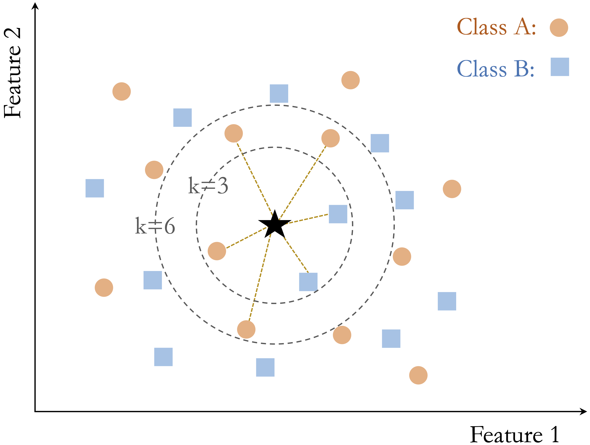

```{r echo=FALSE, message=FALSE, warning=FALSE}
source("_common.R")
```

# Classification Using k-Nearest Neighbors {#sec-ch7-classification-knn}

::: {.content-visible when-format="pdf"}
\begin{chapterquote}
Tell me who your friends are, and I will tell you who you are.

\hfill — Spanish proverb
\end{chapterquote}
:::

::::: {.content-visible when-format="html"}
:::: chapterquote
Tell me who your friends are, and I will tell you who you are.

::: author
— Spanish proverb
:::
::::
:::::

This chapter begins Step 5 (Modeling) of the Data Science Workflow (Figure [-@fig-ch2_DSW]) and marks our first move from data preparation to predictive modeling. In earlier chapters, we cleaned and explored data, developed statistical reasoning, and set up datasets for analysis. We now turn to classification: the task of predicting categorical outcomes from labeled data. As a first classification method, we focus on k-Nearest Neighbors (kNN), a simple and intuitive algorithm that highlights a central idea in supervised learning: similar observations often have similar outcomes.

Unlike many classification methods, kNN does not estimate coefficients or a decision rule in advance. Instead, it predicts by comparing a new observation to nearby training cases in feature space. This makes kNN a natural starting point for predictive modeling because it introduces classification through the concrete idea of similarity while also showing why the choices made in Chapter [-@sec-ch6-data-setup], especially encoding, scaling, and leakage-free preprocessing, directly affect model performance. In this chapter, we introduce the basic logic of classification, explain how kNN works, show how distance and the choice of $k$ shape predictions, and apply the method to the `churn` dataset in R.

### What This Chapter Covers {.unnumbered .unlisted}

This chapter introduces classification as a supervised learning task in which the goal is to predict a categorical outcome. It then presents k-Nearest Neighbors (kNN), a distance-based method that classifies new observations by comparing them with nearby training cases. Because this comparison depends directly on the structure of the feature space, the chapter also explains why preprocessing steps such as encoding and feature scaling are essential for kNN. Finally, through a case study using the `churn` dataset, the chapter shows how to prepare data, choose the hyperparameter $k$, fit a kNN model in R, and evaluate its predictive performance.

## Classification

Classification is a supervised learning task in which the goal is to predict a categorical outcome from a set of input features. In binary classification, the outcome has two categories, such as churn versus no churn or spam versus not spam. In multiclass classification, the outcome has more than two categories, such as assigning an image to one of several object types. Problems of this kind arise in many practical settings, including fraud detection, customer retention, medical diagnosis, and recommendation systems.

Classification differs from regression in the type of response it predicts. In regression, the response variable is numerical, such as income, temperature, or house price. In classification, the response variable is categorical, and the aim is to assign each observation to one of a set of predefined classes. In both settings, the model is learned from labeled data and then applied to new observations, but the form of the prediction is different.

A wide range of algorithms can be used for classification, and no single method is best for every problem. Methods such as Naive Bayes (Chapter [-@sec-ch9-bayes]), Logistic Regression (Chapter [-@sec-ch11-generalized-regression]), Decision Trees and Random Forests (Chapter [-@sec-ch12-tree-models]), and Neural Networks (Chapter [-@sec-ch13-neural-networks]) differ in how they represent patterns in the data and in the trade-offs they make between interpretability, flexibility, and computational cost. The most suitable choice depends on the structure of the dataset, the type of predictors, the size of the training sample, and the goals of the analysis.

As the first predictive modeling task in this book, classification provides a natural entry point for studying how models generalize from observed data to new cases. The central question is not only whether a model can fit the training data, but whether it can make reliable predictions for observations it has not seen before. Among classification methods, kNN is especially useful as a starting point because it makes the roles of similarity, preprocessing, and generalization particularly visible. We therefore begin with kNN before turning to more complex classification models in later chapters.

## How k-Nearest Neighbors Works

The k-Nearest Neighbors (kNN) algorithm predicts the class of a new observation by comparing it with similar observations in the training data. Because it relies directly on similarity, kNN is one of the most intuitive methods in classification. It is also a useful example of a non-parametric classifier: rather than assuming a fixed functional form for the relationship between predictors and the outcome, it bases prediction on the local structure of the data.

Unlike many classification algorithms, kNN does not estimate coefficients or fit an explicit decision rule during a dedicated training stage. Instead, it stores the training data and postpones most computation until a prediction is required, which is why it is often described as a lazy learner. When a new observation is presented, the algorithm computes its distance to the training observations, identifies the $k$ closest neighbors, and assigns the class label by majority vote among those neighbors. The choice of $k$ therefore plays a central role in shaping the model’s behavior.

In binary classification, ties can occur when the selected neighbors are evenly split between the two classes, especially when $k$ is an even number. Ties can also arise in multiclass problems when no single class has a clear majority among the nearest neighbors. For this reason, odd values of $k$ are often preferred in binary classification because they reduce the chance of a tie. In some extensions of kNN, closer neighbors are given more influence than more distant ones, leading to distance-weighted versions of the algorithm.

Because kNN shifts computation from training to prediction, it avoids explicit model fitting but can become computationally expensive when the training set is large. This trade-off is an important practical consideration, particularly when predictions must be made quickly or repeatedly.

### How Does kNN Classify a New Observation? {.unnumbered .unlisted}

To classify a new observation, the kNN algorithm computes its distance to each point in the training set, typically using Euclidean distance. It then selects the $k$ nearest neighbors and assigns the class label that occurs most frequently among them. In this way, prediction depends entirely on the local neighborhood of the new observation in feature space.

Figure [-@fig-ch7-knn-image] illustrates this idea using a simple two-dimensional dataset with two classes and a new data point to be classified. When $k$ is small, the prediction depends on only a few nearby observations. When $k$ is larger, more neighbors influence the decision, which can lead to a different classification outcome. For example, when $k = 3$, two of the three nearest neighbors belong to Class B, so the new observation is classified as Class B. When $k = 6$, the neighborhood composition changes, and four of the six nearest neighbors belong to Class A, so the predicted class becomes Class A.

```{r fig-ch7-knn-image, echo = FALSE, out.width = "60%", fig.cap = "A two-dimensional toy dataset with two classes and a new data point, illustrating the kNN algorithm with k = 3 and k = 6."}

```

This example shows how the choice of $k$ directly affects the classification result. Smaller values of $k$ emphasize local structure and may be more sensitive to noise, whereas larger values incorporate broader neighborhood information and tend to produce smoother decision boundaries. Selecting an appropriate value of $k$ is therefore essential, a topic we examine in more detail later in this chapter.

### Strengths and Limitations of kNN {.unnumbered .unlisted}

The kNN algorithm is valued for its simplicity and transparency. Because predictions are based directly on nearby observations, the logic behind each classification is often easy to explain. This makes kNN a natural starting point for understanding classification and a useful baseline for comparison with more complex models.

At the same time, kNN has important limitations. The algorithm is sensitive to irrelevant or noisy features, which can distort distance calculations and reduce predictive performance. Since distances must be computed to the training observations at prediction time, kNN can also become computationally expensive as the size of the training set grows.

The effectiveness of kNN therefore depends strongly on careful data preparation. Feature selection, appropriate scaling, and outlier handling all help ensure that the computed distances reflect meaningful structure in the data. These considerations motivate the preprocessing steps discussed in the following sections.

## A Simple Example of kNN Classification

To illustrate how kNN operates in practice, we consider a simplified classification example involving drug prescriptions. We use a synthetic dataset of 200 patients that records each patient’s age, sodium-to-potassium (Na/K) ratio, and prescribed drug type. Although artificially generated, the dataset reflects patterns commonly encountered in clinical decision settings. It is available in the **liver** package under the name `drug`. Figure [-@fig-ch7-ex-drug-2] shows the distribution of patients in a two-dimensional feature space, where each point represents a patient and the drug type is indicated by color and shape.

This example highlights three distinct situations that commonly arise in kNN classification: a stable prediction in a dense and homogeneous region of the feature space, sensitivity to the choice of $k$, and ambiguity near a class boundary. To illustrate these cases, suppose three new patients arrive at the clinic, and we must determine which drug is most suitable for each based on age and Na/K ratio. Patient 1 is 40 years old with a Na/K ratio of 30.5. Patient 2 is 28 years old with a ratio of 9.6, and Patient 3 is 61 years old with a ratio of 10.5. These patients are shown as stars in Figure [-@fig-ch7-ex-drug-2], together with their three nearest neighbors.

```{r}
#| label: fig-ch7-ex-drug-2
#| echo: false
#| out-width: 90%
#| fig-cap: "Scatter plot of age versus sodium-to-potassium ratio for 200 patients, with drug type indicated by color and shape. The three new patients are shown as dark stars, and their three nearest neighbors are highlighted with gray circles."

data(drug)
train_set = drug

p = ggplot(train_set, aes(x = age, y = ratio, color = type, shape = type)) +
  geom_point(alpha = 0.7) +
  scale_color_brewer(palette = "Set2") +
  labs(x = "Age", 
       y = "Sodium-to-Potassium Ratio", 
       color = "Type", 
       shape = "Type") +
  theme(legend.text = element_text(size = 7),
        legend.title = element_text(size = 8))

size = if(knitr::is_latex_output()) 13.5 else 14.5
test_set = data.frame(age = c(40, 28, 61), ratio = c(30.5, 9.6, 10.5))

p + 
  geom_point(data = test_set, aes(x = age, y = ratio), colour = "gray50", size = size, shape = 1) +
  geom_point(data = test_set, aes(x = age, y = ratio), colour = "black", size = 1, shape = 8)
```

Patient 1 illustrates a stable prediction in a dense and homogeneous region. The patient lies well within a cluster of training observations that share the same drug label, and the nearest neighbors all agree on the assigned class. In such settings, kNN tends to produce a stable prediction because small changes in the value of $k$ or in the patient’s location are unlikely to alter the local majority.

Patient 2 illustrates sensitivity to the choice of $k$, as shown in the left panel of Figure [-@fig-ch7-ex-drug-3]. When $k = 1$, the prediction depends on a single nearest neighbor and can therefore be highly sensitive to local variation. When $k = 2$, the two nearest neighbors belong to different classes, so the result is a tie. When $k = 3$, one class gains a majority, and the prediction becomes more stable. This example shows how small values of $k$ can lead to unstable decisions and how increasing $k$ can reduce sensitivity to individual observations.

Patient 3, shown in the right panel of Figure [-@fig-ch7-ex-drug-3], illustrates ambiguity near a class boundary. This patient lies in a region where observations from multiple drug classes are close together. In this multiclass setting, the three nearest neighbors may belong to three different classes, so even when $k = 3$, no class receives more than one vote. In other words, there is no clear majority. As a result, the predicted class becomes inherently uncertain, and even small changes in the patient’s features or in the value of $k$ may change the outcome. This behavior highlights an important limitation of kNN: predictions near class boundaries can be unstable because the local neighborhood contains conflicting class information.

```{r}
#| label: fig-ch7-ex-drug-3
#| echo: false
#| fig-cap: "Zoomed-in views of new Patient 2 (left) and new Patient 3 (right) with their three nearest neighbors."
#| fig-width: 8
#| fig-height: 4
#| out-width: 90%

p = ggplot(train_set, aes(x = age, y = ratio, color = type, shape = type)) +
  geom_point(alpha = 0.7, size = 4, show.legend = FALSE) +
  scale_color_brewer(palette = "Set2") +
  labs(x = "Age", y = "Sodium-to-Potassium Ratio") 

r_x = 3.2; r_y = 2
size = if(knitr::is_latex_output()) 111 else 111

# For patient 2
x = test_set$age[2]
y = test_set$ratio[2]

p2 = p + coord_cartesian(xlim = c(x - r_x, x + r_x), ylim = c(y - r_y, y + r_y)) +
  geom_point(aes(x = test_set$age[2], y = test_set$ratio[2]), colour = "gray50", size = size, shape = 1) +
  geom_point(aes(x = test_set$age[2], y = test_set$ratio[2]), colour = "black", size = 4, shape = 8) +
  annotate("text", x = x, y = y + r_y - 0.3, label = "New Patient 2", size = 4.2, fontface = "bold")

# For patient 3
x = test_set$age[3]
y = test_set$ratio[3]

p3 = p + coord_cartesian(xlim = c(x - r_x, x + r_x), ylim = c(y - r_y, y + r_y)) +
  geom_point(aes(x = x, y = y), colour = "gray50", size = size, shape = 1) +
  geom_point(aes(x = x, y = y), colour = "black", size = 4, shape = 8) +
  annotate("text", x = x, y = y + r_y - 0.3, label = "New Patient 3", size = 4.2, fontface = "bold")

p2 + p3
```

> *Practice:* Using Figure [-@fig-ch7-ex-drug-2], consider how kNN might classify a 50-year-old patient with a sodium-to-potassium ratio of 10. How would your reasoning change as the value of $k$ increases?

Together, these three patients illustrate three core features of kNN. Predictions are often stable when a new observation lies in a dense region dominated by a single class, but they can become sensitive to the choice of $k$ or uncertain near class boundaries. These examples also show that distance-based classification depends strongly on the geometry of the feature space. In the next sections, we formalize how similarity is measured and examine how to choose the value of $k$ more systematically.

## How Does kNN Measure Similarity? {#sec-ch7-knn-distance-metrics}

In kNN, classifying a new observation depends on identifying the most similar observations in the training set. To make this idea precise, similarity is quantified using a distance metric, which measures how close two observations are in the feature space. The smaller the distance, the more similar the observations are assumed to be, and the more influence they have on the predicted class.

For example, suppose we compare two patients using age and sodium-to-potassium (Na/K) ratio. One patient is 40 years old with a Na/K ratio of 30.5, and the other is 28 years old with a ratio of 9.6. In this setting, similarity is determined by how far apart these patients are in a two-dimensional feature space defined by the two variables.

### Euclidean Distance {.unnumbered .unlisted}

A commonly used distance metric in kNN is Euclidean distance, which corresponds to the straight-line distance between two points. For two points $x$ and $y$ in $n$-dimensional space, it is defined as

$$
\text{dist}(x, y) = \sqrt{(x_1 - y_1)^2 + (x_2 - y_2)^2 + \cdots + (x_n - y_n)^2},
$$

where $x = (x_1, x_2, \ldots, x_n)$ and $y = (y_1, y_2, \ldots, y_n)$ are the feature vectors.

Using age and Na/K ratio for the two patients introduced above, the Euclidean distance is

$$
\text{dist}(x, y) = \sqrt{(40 - 28)^2 + (30.5 - 9.6)^2}
= \sqrt{144 + 436.81}
= 24.11.
$$

Figure [-@fig-ch7-euclidean-distance] visualizes this distance in a two-dimensional feature space. The line connecting the two patients represents their Euclidean distance.

```{r}
#| label: fig-ch7-euclidean-distance
#| out.width: "65%"
#| fig-cap: "Visual representation of Euclidean distance between two patients in a two-dimensional feature space."
#| echo: false

point1 = c(40, 30.5)
point2 = c(28, 9.6)

points_df = data.frame(
  x = c(point1[1], point2[1]),
  y = c(point1[2], point2[2]),
  label = c("Patient 1 (40, 30.5)", "Patient 2 (28, 9.6)"),
  vjust = c(-1.3, 1.9)
)

segment_df = data.frame(
  x = point1[1],
  y = point1[2],
  xend = point2[1],
  yend = point2[2]
)

euclidean_distance = sqrt(sum((point1 - point2)^2))

ggplot(points_df, aes(x = x, y = y)) +
  geom_text(aes(label = label, vjust = vjust), size = 5, color = "#4C78A8") +
  geom_segment(data = segment_df,
               aes(x = x, y = y, xend = xend, yend = yend),
               color = "#C76E00", linewidth = 1) +
  annotate("text", x = 39.6, y = 17.5,
           label = paste0("Distance = ", round(euclidean_distance, 2)),
           color = "#C76E00", size = 5.5) +
  geom_point(size = 3) +
  xlim(20, 50) + ylim(0, 40) +
  labs(x = "Age", y = "Sodium/Potassium Ratio")
```

Euclidean distance is intuitive and widely used, especially when the predictors are numerical. Other distance measures, such as Manhattan distance, Hamming distance, or cosine similarity, can be useful in more specialized settings. For the present chapter, however, Euclidean distance is sufficient for illustrating the main ideas.

More generally, distance-based methods are useful only when the predictors are represented in a meaningful way. If variables are encoded poorly or measured on very different scales, the resulting distances can distort similarity relationships between observations. For this reason, encoding and feature scaling are essential steps in kNN and other methods that rely on distance.

## Data Setup for kNN {#sec-ch7-knn-prep}

Preprocessing matters in predictive modeling, but it matters especially for kNN because prediction is based directly on distances between observations. Unlike methods that estimate coefficients or decision rules, kNN compares observations in the feature space itself. As a result, predictive performance depends strongly on how that space is constructed. Two principles are especially important. First, distance calculations require predictors to be represented numerically. Second, distances can be distorted when variables are measured on very different scales. For this reason, encoding and scaling are not optional refinements in kNN: they are central parts of the modeling process.

As discussed more generally in Chapter [-@sec-ch6-data-setup], different types of predictors often require different preprocessing steps before modeling. For kNN, these choices are especially consequential because similarity can be computed meaningfully only when predictors are represented numerically and placed on comparable scales.

To make this idea concrete, imagine working with patient data that include age, sodium-to-potassium (Na/K) ratio, marital status, and education level. Age and Na/K ratio are numerical, whereas marital status and education are categorical. Before kNN can compare patients meaningfully, the categorical variables must be encoded into numerical form, and the numerical variables must be placed on a comparable scale. Otherwise, the resulting distances may reflect arbitrary coding choices or differences in measurement scale rather than genuine similarity between patients.

In mixed tabular datasets such as `churn` or `bank`, a practical strategy is to encode categorical predictors first and then scale the numerical predictors. Binary variables can often be represented directly as 0/1 indicators. Nominal variables are typically converted using one-hot encoding so that no artificial ordering is imposed. Ordinal variables can be encoded using values that preserve their natural ranking. After these steps, continuous and ordinal numerical predictors should usually be scaled so that variables with larger ranges do not dominate the distance calculation. Binary indicators created through encoding are already on a common 0/1 scale and are often left unchanged.

As discussed in Section [-@sec-ch6-feature-scaling], two common scaling strategies are min-max scaling and z-score scaling. Min-max scaling rescales variables to a fixed range, usually $[0, 1]$, and is often convenient when preserving relative distances is important. Z-score scaling centers variables at zero and rescales them by their standard deviation, which can be preferable when predictors are measured in different units or when outliers are present. The key point for kNN is not that one scaling method is always best, but that predictors should be placed on scales that allow distance calculations to reflect meaningful differences between observations.

### Preventing Data Leakage during Scaling {.unnumbered .unlisted}

In kNN, scaling parameters must be estimated from the training data and then applied unchanged to the test data. If the test set is scaled separately, the training and test observations no longer lie in the same feature space. This is a form of data leakage discussed more generally in Section [-@sec-ch6-data-leakage].

Figure [-@fig-ch7-ex-proper-scaling] illustrates this issue. The middle panel shows correct scaling based on the training data, whereas the right panel shows what happens when the test data are scaled independently.

Using the drug classification example from earlier, the following code compares the correct and incorrect approaches with the `minmax()` function from the **liver** package:

```{r}
library(liver)

# Correct scaling: apply training-derived parameters to the test data
min_train = c(min(train_set$age), min(train_set$ratio))
max_train = c(max(train_set$age), max(train_set$ratio))

train_scaled = minmax(train_set, 
                      col = c("age", "ratio"), 
                      min = min_train, 
                      max = max_train)

test_scaled = minmax(test_set, 
                     col = c("age", "ratio"), 
                     min = min_train, 
                     max = max_train)

# Incorrect scaling: scale the test data independently
train_scaled_wrongly = minmax(train_set, col = c("age", "ratio"))
test_scaled_wrongly = minmax(test_set, col = c("age", "ratio"))
```

```{r}
#| label: fig-ch7-ex-proper-scaling
#| echo: false
#| out-width: "100%"
#| fig-width: 5
#| fig-height: 5.5
#| layout-nrow: 2
#| fig-align: "center"
#| fig-cap: "Visualization of proper and improper scaling in kNN. The left panel shows the original data without scaling. The middle panel shows correct scaling based on training-derived parameters. The right panel shows the distortion caused by scaling the test data independently."
#| fig-subcap:
#|   - "Without Scaling"
#|   - "Proper Scaling"
#|   - "Improper Scaling"

ggplot(data = train_set, aes(x = age, y = ratio)) +
  geom_point(alpha = 0.7, aes(color = type, shape = type)) +
  scale_color_brewer(palette = "Set2") +
  labs(x = "Age", y = "Sodium/Potassium Ratio") +
  guides(color = guide_legend(title = "Drug Type"),
         shape = guide_legend(title = "Drug Type")) +
  geom_point(data = test_set, aes(x = age, y = ratio), colour = "gray50", size = 9, shape = 1) +
  geom_point(data = test_set, aes(x = age, y = ratio), colour = "black", size = 1, shape = 8) +
  theme(legend.position = "none")

ggplot(data = train_scaled, aes(x = age, y = ratio)) +
  geom_point(alpha = 0.7, aes(color = type, shape = type)) +
  scale_color_brewer(palette = "Set2") +
  labs(x = "Age", y = "Sodium/Potassium Ratio") +
  guides(color = guide_legend(title = "Drug Type"),
         shape = guide_legend(title = "Drug Type")) +
  geom_point(data = test_scaled, aes(x = age, y = ratio), colour = "gray50", size = 9, shape = 1) +
  geom_point(data = test_scaled, aes(x = age, y = ratio), colour = "black", size = 1, shape = 8) +
  theme(legend.position = "none")

ggplot(data = train_scaled_wrongly, aes(x = age, y = ratio)) +
  geom_point(alpha = 0.7, aes(color = type, shape = type)) +
  scale_color_brewer(palette = "Set2") +
  labs(x = "Age", y = "Sodium/Potassium Ratio") +
  guides(color = guide_legend(title = "Drug Type"),
         shape = guide_legend(title = "Drug Type")) +
  geom_point(data = test_scaled_wrongly, aes(x = age, y = ratio), colour = "gray50", size = 8.5, shape = 1) +
  geom_point(data = test_scaled_wrongly, aes(x = age, y = ratio), colour = "black", size = 1, shape = 8) +
  theme(legend.position = "none")
```

When the test set is scaled independently, the locations of new observations are no longer directly comparable with those of the training set. In a distance-based method such as kNN, this can lead to misleading neighborhoods and unreliable predictions.

## Selecting an Appropriate Value of $k$ in kNN {#sec-ch7-knn-choose-k}

The parameter $k$, which determines how many nearest neighbors are used in classification, plays a central role in the behavior of kNN. There is no universally optimal value of $k$: the best choice depends on the structure of the dataset, the amount of noise in the predictors, and the complexity of the classification boundary. Choosing $k$ therefore involves balancing local sensitivity against generalization.

When $k$ is too small, such as $k = 1$, the classifier becomes highly sensitive to individual training observations. In statistical terms, this leads to high variance: small changes in the training data can produce substantial changes in the resulting predictions. Such models may capture local irregularities, noise, or mislabeled cases rather than broader structure in the data, which increases the risk of overfitting.

As $k$ increases, predictions are based on a larger neighborhood, which tends to smooth the decision boundary and reduce sensitivity to isolated observations. This usually lowers variance, but it can also increase bias. If $k$ becomes too large, the model may oversmooth the local structure of the data and fail to capture meaningful distinctions between classes. In extreme cases, when $k$ approaches the size of the training set, predictions may be driven largely by the majority class.

For this reason, the value of $k$ should be selected empirically using only the training data. A common strategy is to evaluate a range of candidate values with a validation set or with cross-validation. The final test set should not be used for selecting $k$, because doing so allows information from the test data to influence model tuning and leads to optimistic performance estimates (see Section [-@sec-ch6-data-leakage]). Instead, the test set should be reserved for the final assessment of the chosen model.

The choice of tuning metric also matters. Accuracy is often convenient and intuitive, but it may be misleading when the classes are imbalanced or when different types of classification errors have different practical consequences. Performance measures such as precision, recall, and the F1-score can therefore be more informative in some settings. These metrics are discussed in detail in Chapter [-@sec-ch8-evaluation]. For simplicity, we use accuracy in this chapter to illustrate the tuning process.

Figure [-@fig-ch7-kNN-plot] shows how classification accuracy changes for values of $k$ ranging from 1 to 20. In this example, the highest validation accuracy is achieved at $k = 7$. More generally, however, the goal is not to find a universally best value, but to identify a value of $k$ that generalizes well for the dataset at hand.

Selecting $k$ is therefore an empirical model-selection problem. It reflects the trade-off between variance and bias, local adaptability and oversmoothing, and simplicity and predictive performance. In the following case study, we apply this reasoning in practice and examine how the value of $k$ can be chosen within a complete modeling workflow.

## Case Study: Predicting Customer Churn with kNN {#sec-ch7-knn-churn}

In this case study, we apply the kNN algorithm to a practical classification problem using the `churn` dataset from the **liver** package in R. The goal is to predict whether a customer has churned (`yes`) or not (`no`) based on demographic information and service usage patterns. Readers unfamiliar with the dataset are encouraged to review the exploratory analysis in Section [-@sec-ch4-EDA-churn], which provides context and preliminary findings.

This dataset provides an instructive test case for kNN because it combines several features that make distance-based classification both useful and challenging. It contains a mix of numerical and categorical predictors, so meaningful comparison requires careful encoding and scaling. It may also exhibit some class imbalance, which affects how model performance should be interpreted. At the same time, kNN offers an intuitive way to compare each customer with similar customers in the training data, making the resulting predictions easy to understand in local terms. For these reasons, the `churn` dataset is well suited for illustrating both the strengths and the practical limitations of kNN.

We begin by inspecting the structure of the dataset:

```{r}
library(liver)

data(churn)
str(churn)
```

The dataset is a data frame containing `r nrow(churn)` observations, `r ncol(churn) - 1` predictor variables, and the binary outcome variable `churn`. For the kNN model developed in this chapter, we do not consider `customer_ID`, since it is only an identifier and does not provide meaningful information for measuring similarity between customers. We also exclude `available_credit` and `utilization_ratio`, as these variables are deterministic functions of other credit-related predictors already present in the dataset. Removing such variables reduces redundancy and helps prevent distance calculations from being influenced disproportionately by multiple representations of the same underlying information.

Before proceeding to modeling, we prepare the dataset carefully. To avoid data leakage (see Section [-@sec-ch6-data-leakage]), preprocessing steps that depend on the data distribution, including imputation and scaling, are applied only after partitioning the data into training and test sets.

In the remainder of this case study, we proceed step by step: partitioning the data, applying preprocessing after the split, selecting an appropriate value of $k$, fitting the model, generating predictions, and evaluating performance. Because kNN is distance-based, each of these steps directly affects how similarity is measured and, therefore, how predictions are formed.

### Data Setup for kNN {.unnumbered .unlisted}

Because kNN is a distance-based method, the preprocessing pipeline must be systematic and leakage-free. In this case study, we proceed in the following order: we partition the data, recode placeholder values as missing, impute training-derived values, encode categorical predictors, verify that the training and test sets contain the same predictors in the same order, and then scale the continuous and ordinal numerical variables using parameters estimated from the training data.

To evaluate how well the model generalizes, we begin by splitting the data into training and test sets. We use the `partition()` function from the **liver** package to create an 80% training set and a 20% test set:

```{r}
set.seed(42) # for reproducibility

splits = partition(data = churn, ratio = c(0.8, 0.2))

train_set = splits$part1
test_set  = splits$part2
```

This split provides a training set for model development and a separate test set for final evaluation. Readers may verify that the churn rate remains similar across both sets (see Section [-@sec-ch6-cross-validation]).

> *Practice:* Create a 70% training set and a 30% test set for the same dataset. Verify that the proportion of churned customers remains similar across the two sets.

#### Imputation for kNN {.unnumbered .unlisted}

The `churn` dataset is largely clean, but some entries in `education`, `income`, and `marital` are recorded as `"unknown"`. In this case study, we treat `"unknown"` as a placeholder for missing information rather than as a meaningful category. Because kNN cannot compute distances when predictor values are missing, these values must be handled before modeling. To avoid data leakage (see Section [-@sec-ch6-data-leakage]), the imputation values are derived from the training set and then applied unchanged to the test set.

Here we use mode imputation for these categorical variables. Although simple, this approach is transparent and sufficient for illustrating the workflow. The following code first replaces `"unknown"` with missing values and then imputes those values using modes computed from the training set.

```{r}
# Treat "unknown" as missing
train_set[train_set == "unknown"] <- NA
test_set[test_set == "unknown"] <- NA

# Training-derived modes
mode_education = names(sort(table(train_set$education, useNA = "no"), decreasing = TRUE))[1]
mode_income    = names(sort(table(train_set$income,    useNA = "no"), decreasing = TRUE))[1]
mode_marital   = names(sort(table(train_set$marital,   useNA = "no"), decreasing = TRUE))[1]

# Apply to the training set
train_set$education[is.na(train_set$education)] = mode_education
train_set$income[is.na(train_set$income)]       = mode_income
train_set$marital[is.na(train_set$marital)]     = mode_marital

# Apply to the test set using the same training-derived modes
test_set$education[is.na(test_set$education)] = mode_education
test_set$income[is.na(test_set$income)]       = mode_income
test_set$marital[is.na(test_set$marital)]     = mode_marital

train_set = droplevels(train_set)
test_set  = droplevels(test_set)
```

The same training-derived modes are applied to both datasets so that the imputation step does not use information from the test set. The call to `droplevels()` removes unused factor levels after the missing values have been filled in, leaving both datasets in a cleaner form for the next preprocessing steps.

> *Practice:* Repeat this imputation strategy after creating a 70%–30% split, and confirm that no missing values remain in `education`, `income`, and `marital`.

#### Encoding Categorical Features for kNN {.unnumbered .unlisted}

All predictors used in kNN must be represented numerically. In the `churn` dataset, the variables `gender`, `education`, `marital`, `income`, and `card_category` are categorical and therefore require encoding.

Because `income` is an ordinal variable, we follow the guidance in Section [-@sec-ch6-encoding] and replace its categories with representative numerical values that preserve their ordering. Specifically, we encode `"<40K"` as 20, `"40K-60K"` as 50, `"60K-80K"` as 70, `"80K-120K"` as 100, and `">120K"` as 140. The resulting variable, `income_rank`, allows income to enter the distance calculations in numerical form while retaining its ordinal structure.

```{r}
income_levels = c("<40K", "40K-60K", "60K-80K", "80K-120K", ">120K")
income_values = c(20, 50, 70, 100, 140)

train_set$income_rank = as.numeric(factor(train_set$income, levels = income_levels, labels = income_values))

test_set$income_rank = as.numeric(factor(test_set$income, levels = income_levels, labels = income_values))
```

The remaining categorical variables are nominal, meaning that their categories have no natural order. For these variables, we apply one-hot encoding, which creates a separate 0/1 indicator for each category. The `one.hot()` function from the **liver** package automates this step:

```{r}
categorical_features = c("gender", "education", "marital", "card_category")

train_onehot = one.hot(train_set, cols = categorical_features)
test_onehot  = one.hot(test_set,  cols = categorical_features)
```

For a variable with $m$ categories, the `one.hot()` function creates $m$ binary columns. In kNN, this does not create estimation problems, but it does increase the dimensionality of the feature space. Because kNN is sensitive to the geometry of that space, one-hot encoding variables with many categories can make similarity relationships more diffuse and may affect predictive performance.

For distance-based methods such as kNN, it is essential that the training and test sets ultimately contain the same encoded predictors in the same order. Otherwise, distances between observations cannot be computed meaningfully. At this stage, the one-hot encoded variables remain as 0/1 indicators, whereas the newly created variable `income_rank` will be treated as an ordinal numeric predictor in the scaling step that follows.

> *Practice:* Using a 70%–30% train–test split, first apply ordinal encoding to the `income` feature. Then apply one-hot encoding to the remaining categorical variables in both sets. Verify that the resulting training and test datasets contain identical predictor columns in the same order. Why is this consistency essential for distance-based methods such as kNN?

#### Feature Scaling for kNN {.unnumbered .unlisted}

Once all predictors are represented numerically, the next step is to scale the continuous and ordinal numerical variables so that variables with larger ranges do not dominate the distance calculations. In this example, that includes the original continuous predictors as well as the newly created ordinal variable `income_rank`, which now enters the model as a numeric feature. By contrast, the binary 0/1 indicators created by one-hot encoding are already on a common scale and are therefore left unchanged.

```{r}
numeric_features = c("age", "dependent_count", "months_on_book", "relationship_count", "months_inactive", "contacts_count_12", "credit_limit", "revolving_balance", "transaction_amount_12", "transaction_count_12", "ratio_amount_Q4_Q1", "ratio_count_Q4_Q1","income_rank")

min_train = sapply(train_set[, numeric_features], min)  
max_train = sapply(train_set[, numeric_features], max)   

train_scaled = minmax(train_onehot, col = numeric_features, min = min_train, max = max_train)

test_scaled  = minmax(test_onehot,  col = numeric_features, min = min_train, max = max_train)
```

Here, `sapply()` computes the column-wise minimum and maximum values for the selected numeric variables in the training data. These values define the scaling range. The `minmax()` function from the **liver** package then applies min-max scaling to both the training and test sets, using the training-derived values as reference.

This step places the continuous and ordinal predictors on a comparable scale, helping ensure that variables with larger numerical ranges do not dominate the distance calculations. For further discussion of scaling methods and their implications, see Section [-@sec-ch6-feature-scaling] and the preparation overview in Section [-@sec-ch7-knn-prep]. With the predictors now encoded and scaled appropriately, we can proceed to select an appropriate value of $k$ for the kNN model.

> *Practice:* After creating a 70%–30% train–test split, verify that the minimum and maximum values used for scaling are computed only from the training data. What could go wrong if the test set were scaled independently?

### Selecting an Appropriate Value of $k$ {.unnumbered .unlisted}

The number of neighbors ($k$) is a key hyperparameter in the kNN algorithm. Choosing a small $k$ can make the model overly sensitive to noise, whereas a large $k$ can oversmooth decision boundaries and obscure meaningful local patterns.

Several approaches can be used to identify an appropriate value of $k$. A simple and accessible strategy is to evaluate model performance across a range of candidate values, for example from 1 to 20, and then choose the value that performs best on a validation set. This approach is useful for illustrating the tuning process, although repeated cross-validation would usually provide a more stable basis for selecting $k$.

In this chapter, we use the `kNN.plot()` function from the **liver** package, which computes classification accuracy across a specified range of $k$ values and visualizes the results. Before applying the function, we define a `formula_knn` object that specifies the relationship between the target variable (`churn`) and the predictors. These predictors include the scaled numerical variables together with the binary indicators created through one-hot encoding:

```{r}
formula_knn = churn ~ gender_female + age + income_rank + education_uneducated +
  education_highschool + education_college + education_graduate +
  `education_post-graduate` + marital_married + marital_single +
  card_category_blue + card_category_silver + card_category_gold +
  dependent_count + months_on_book + relationship_count +
  months_inactive + contacts_count_12 + credit_limit +
  revolving_balance + transaction_amount_12 +
  transaction_count_12 + ratio_amount_Q4_Q1 + ratio_count_Q4_Q1
```

We then apply `kNN.plot()`:

```{r fig-ch7-kNN-plot, echo=TRUE, out.width="85%", fig.cap="Accuracy of the kNN algorithm on the churn dataset for values of k ranging from 1 to 20."}
kNN.plot(
  formula = formula_knn,
  train   = train_scaled,
  ratio   = c(0.7, 0.3),
  k.max   = 20,
  reference = "yes",
  set.seed = 42
)
```

Here, `kNN.plot()` uses only the training data and internally splits it into a temporary training subset and a validation subset according to `ratio = c(0.7, 0.3)`. This allows us to compare candidate values of $k$ without using the external test set. The argument `k.max = 20` specifies the largest value of $k$ to examine, and `set.seed = 42` ensures that the internal split is reproducible.

Because tuning is carried out using only the training data, the test set remains untouched until the final evaluation stage. This helps avoid optimistic bias and preserves the integrity of the model assessment (see Section [-@sec-ch6-data-leakage]).

In this example, we use accuracy to compare candidate values of $k$ because it provides a simple summary of predictive performance. However, the choice of tuning metric depends on the problem. In settings with class imbalance or unequal costs of misclassification, other measures such as precision, recall, or the F1-score may be more informative.

The resulting plot shows how validation accuracy changes with $k$. In this case, the highest accuracy is achieved at $k = 7$. This does not mean that $k = 7$ is universally best; it simply indicates that, under this validation-based tuning strategy, $k = 7$ performs best for this dataset. With this value selected, we can now fit the final model on the full training set and evaluate it once on the separate test set.

> *Practice:* Using a 70%–30% train–test split, apply `kNN.plot()` to choose an appropriate value of $k$, following the approach used in this section and without using the test set. Compare the resulting accuracy curve with the one obtained using the 80%–20% split. Does the value of $k$ that maximizes accuracy remain the same? What does this tell you about the stability of hyperparameter tuning in kNN?

### Applying the kNN Classifier {.unnumbered .unlisted}

With the optimal value $k = 7$ identified, we now apply the kNN algorithm to classify customer churn in the test set. This step brings together the work from the previous sections: data preparation, feature encoding, scaling, and hyperparameter tuning. Unlike many machine learning algorithms, kNN does not estimate coefficients or fit an explicit decision rule during training. Instead, it retains the training data and performs classification on demand by computing distances to identify the closest training observations.

In R, we use the `kNN()` function from the **liver** package to implement the k-Nearest Neighbors algorithm. This function provides a formula-based interface consistent with other modeling functions in R, making the syntax more readable and the workflow more transparent. An alternative is the `knn()` function from the **class** package, which requires the user to specify predictor matrices and class labels manually. While effective, that interface is less convenient for the presentation adopted in this book.

```{r}
kNN_predict = kNN(
  formula = formula_knn,
  train = train_scaled,
  test = test_scaled,
  k = 7
)
```

In this command, `formula_knn` defines the relationship between the response variable (`churn`) and the predictors. The arguments `train` and `test` specify the processed datasets prepared in the earlier steps, and `k = 7` sets the number of neighbors used for classification. The `kNN()` function predicts the class of each test observation by computing its distance to the training observations and assigning the majority class among the seven nearest neighbors.

This is an important distinction between kNN and many other classifiers. Fitting kNN does not produce a coefficient table or a compact set of model parameters to interpret. Instead, prediction is determined by the local neighborhood structure of the training data. For this reason, interpretability in kNN is local rather than parametric: to understand a prediction, we look at which training observations were nearest to the new case and how their class labels were distributed.

### Evaluating Model Performance of the kNN Model {.unnumbered .unlisted}

With predictions in hand, the final step is to assess how well the kNN model performs on the test set. A useful starting point is the confusion matrix, which compares predicted and observed class labels and separates correct classifications from the two main types of error: false positives and false negatives. We use the `conf.mat.plot()` function from the **liver** package to compute and visualize this matrix. The argument `reference = "yes"` specifies that the positive class corresponds to customers who have churned.

```{r, out.width = '30%'}
test_labels = test_set$churn

conf.mat.plot(kNN_predict, test_labels, reference = "yes")
```

```{r echo=FALSE}
conf_max_knn_churn = conf.mat(kNN_predict, test_labels, reference = "yes")
```

The confusion matrix shows that the model correctly classified `r conf_max_knn_churn[1, 1] + conf_max_knn_churn[2, 2]` observations and misclassified `r conf_max_knn_churn[1, 2] + conf_max_knn_churn[2, 1]`. More importantly, it reveals the *type* of mistakes the model makes. In a churn setting, false negatives are often especially costly because they correspond to customers who are actually likely to leave but are predicted to stay. Such customers may receive no retention intervention at all. False positives are also undesirable, since they may lead a business to target customers who were not at risk of churning, but in many practical settings this is less costly than missing a genuine churner.

For this reason, the confusion matrix is valuable not only because it summarizes overall performance, but also because it helps us judge whether the error pattern is acceptable for the application at hand. A model with reasonable overall accuracy may still be unsatisfactory if it fails too often on the cases that matter most. In Chapter [-@sec-ch8-evaluation], we examine this issue more systematically using additional measures such as precision, recall, and the F1-score.

> *Practice:* Using a 70%–30% train–test split, fit a kNN model by following the same workflow as in this subsection and compute the corresponding confusion matrix. Compare it with the confusion matrix obtained using the 80%–20% split. Which types of errors change, and what does this tell you about the stability of model evaluation?

This case study has demonstrated the complete kNN workflow, from data setup and preprocessing to hyperparameter tuning, prediction, and evaluation. It also shows that model assessment is not only about how many cases are classified correctly, but also about which kinds of mistakes are made and whether those mistakes are acceptable in context.

## Chapter Summary and Takeaways

This chapter introduced k-Nearest Neighbors (kNN) as an intuitive approach to classification based on local similarity. Rather than estimating coefficients or fitting an explicit decision rule, kNN predicts the class of a new observation by comparing it with nearby observations in the training data.

A central message of the chapter is that preprocessing is not optional in kNN. Because predictions depend directly on distances, categorical variables must be encoded appropriately and numerical variables must be placed on comparable scales. We also saw that the choice of the number of neighbors, $k$, shapes the balance between local sensitivity and smoother generalization.

The chapter further showed that tuning and evaluation must follow a leakage-free workflow. The value of $k$ should be chosen using only the training data, and model performance should be assessed on a separate test set. Through the `churn` case study, we illustrated this full process: data setup, preprocessing, tuning, prediction, and evaluation.

Although the focus of this chapter has been on classification, the same neighborhood idea can also be used for regression. In kNN regression, the predicted value for a new observation is obtained by averaging the responses of its nearest neighbors rather than assigning a majority class label. This extension relies on the same notion of local similarity, but it is used to predict a numerical outcome instead of a categorical one.

The simplicity and transparency of kNN make it a useful baseline model and a natural starting point for classification. At the same time, its dependence on careful preprocessing, sensitivity to irrelevant features, and computational cost for large datasets limit its use in more demanding settings. In the chapters that follow, we turn to more advanced classification methods that address some of these limitations.

## Exercises {#sec-ch7-exercises}

The following exercises reinforce the main ideas of this chapter. They begin with conceptual questions, continue with hands-on practice using the `bank` dataset from the **liver** package, and conclude with broader reflection on when kNN is useful and when it should be used with caution.

### Conceptual Questions {.unnumbered .unlisted}

1.  Explain the difference between classification and regression. Give one example of each.

2.  What does kNN mean by “similarity,” and why is this idea central to prediction?

3.  Explain why kNN is called a non-parametric and lazy-learning method.

4.  Why does the choice of $k$ matter? Describe what can happen when $k$ is too small and when it is too large.

5.  What role does Euclidean distance play in kNN, and under what conditions is it meaningful?

6.  Why is preprocessing especially important for kNN compared with many other classification methods?

7.  Explain why missing values must be handled before fitting a kNN model.

8.  In binary classification, why are odd values of $k$ often preferred?

### Hands-On Practice {.unnumbered .unlisted}

9.  Load the `bank` dataset and inspect its structure. Identify the outcome variable and list the categorical and numerical predictors.

10. Partition the data into an 80% training set and a 20% test set. Verify that the class proportions remain similar across the two sets.

11. Identify the categorical variables that require encoding before applying kNN. Which of them are nominal, and which, if any, are ordinal?

12. Apply one-hot encoding to the nominal predictors. Why is this representation more appropriate for kNN than assigning arbitrary numeric codes to nominal categories?

13. Scale the continuous predictors using min-max scaling, making sure that the scaling parameters are derived from the training set and then applied unchanged to the test set.

14. Use `kNN.plot()` to examine values of $k$ from 1 to 20 and choose a candidate value for the model.

15. Fit a kNN classifier using the selected value of $k$ and generate predictions for the test set.

16. Compute the confusion matrix for the test-set predictions and interpret the main types of classification error.

17. Compute the overall accuracy and discuss whether it provides a sufficient summary of performance in this problem.

18. Repeat the analysis without scaling the numerical predictors. Compare the results with the properly scaled model. What does this show about the role of scaling in kNN?

19. Intentionally use a poor encoding strategy for one categorical predictor, for example by assigning arbitrary numeric values to a nominal variable instead of using one-hot encoding. Compare the results with the properly encoded model. What changes, and why?

20. Add one or more irrelevant predictors to the modeling dataset, fit the kNN model again, and compare the results. What does this suggest about the sensitivity of kNN to irrelevant features?

21. Compare model performance for several values of $k$, for example $k = 1$, $5$, $15$, and $25$. How does the error pattern change as $k$ increases?

22. Compare the performance of kNN using the full predictor set with a model that uses only a smaller subset of predictors, such as `age`, `balance`, `duration`, and `campaign`. What does this suggest about feature selection in distance-based methods?

23. Compare min-max scaling with z-score standardization. Does the preferred value of $k$ or the predictive performance change?

### Self-Reflection {.unnumbered .unlisted}

24. Suppose the dataset becomes much larger or contains hundreds of predictors. What practical and statistical challenges would this create for kNN?

25. Under what circumstances would kNN be a poor choice for deployment in a real-world application, even if its predictive accuracy were acceptable?

26. Suppose false negatives are much more costly than false positives in this application. How might that affect the way you evaluate the model or choose the value of $k$?

27. Describe one situation in which the local interpretability of kNN would be an advantage over a parametric model such as logistic regression.

28. Summarize the main lessons of this chapter in your own words: when is kNN a useful method, and when should it be used with caution?
