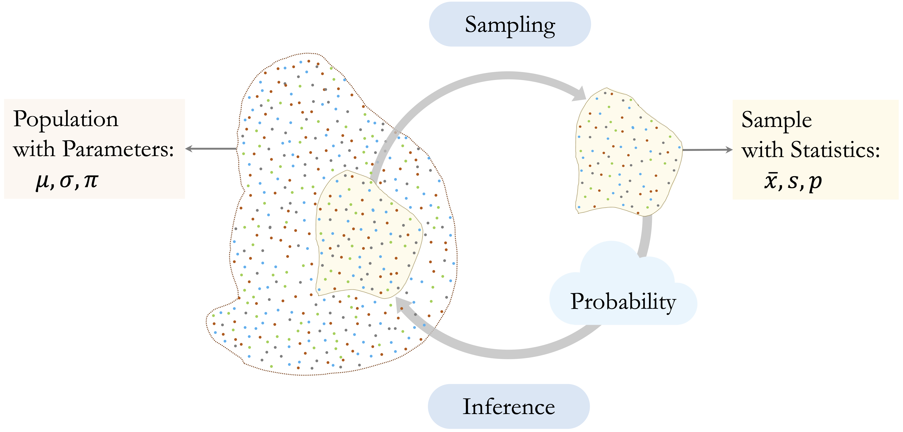
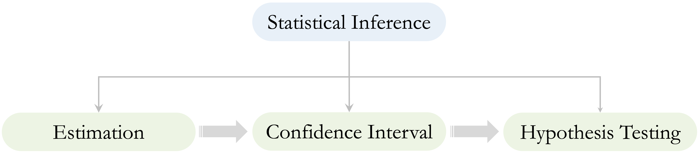
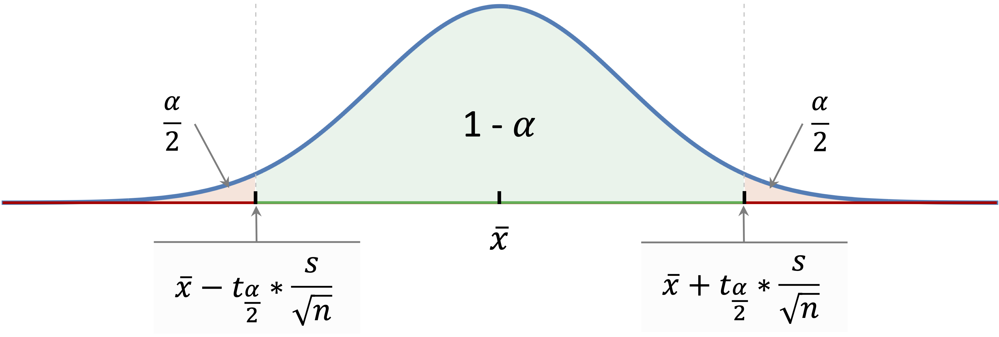
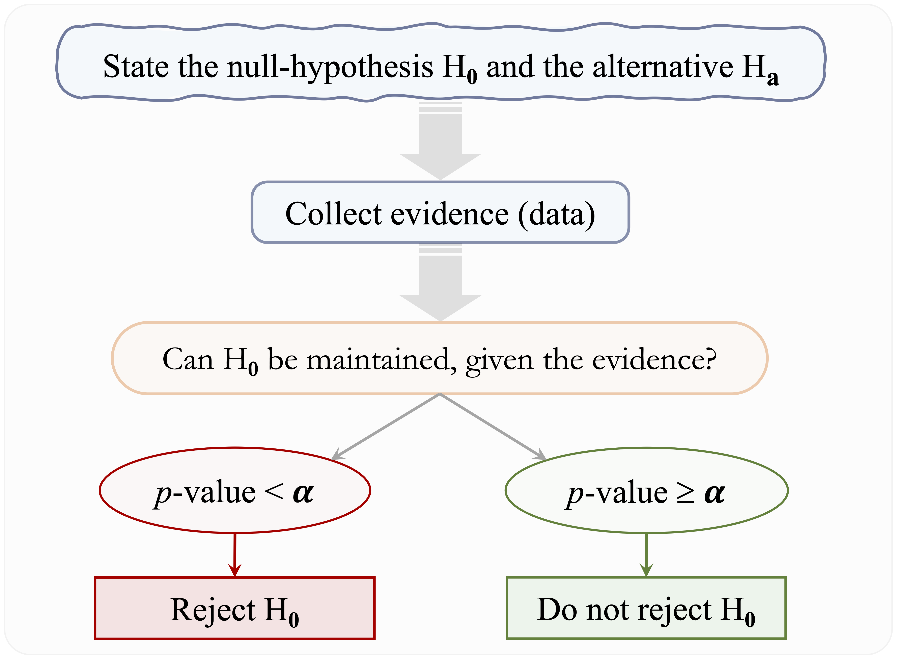
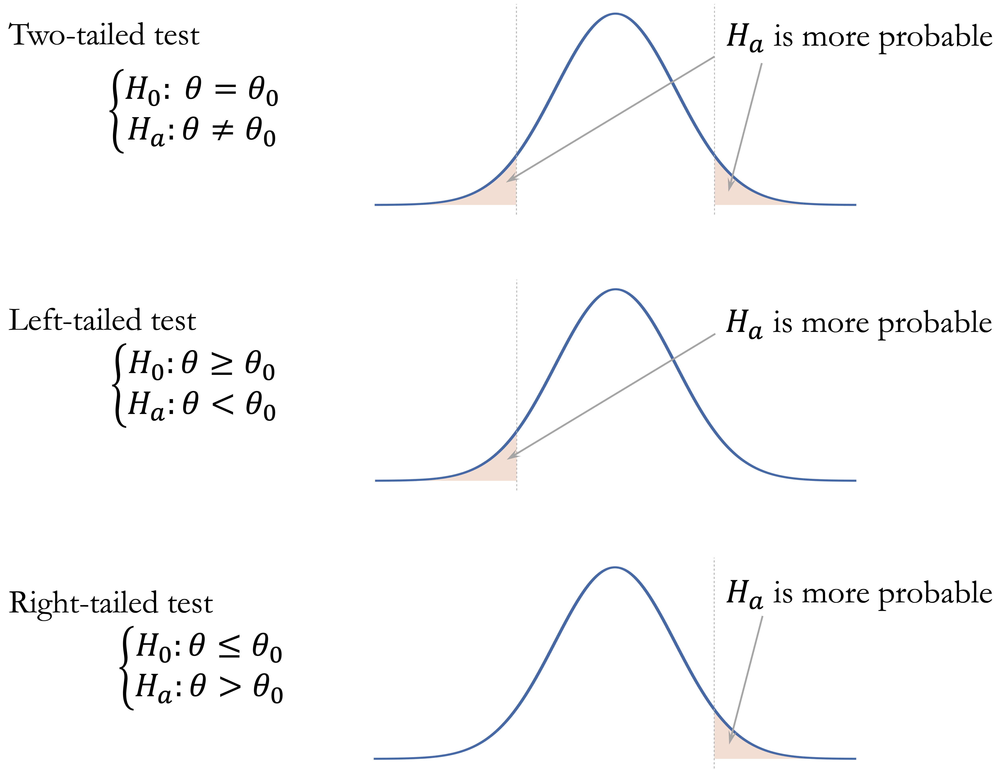
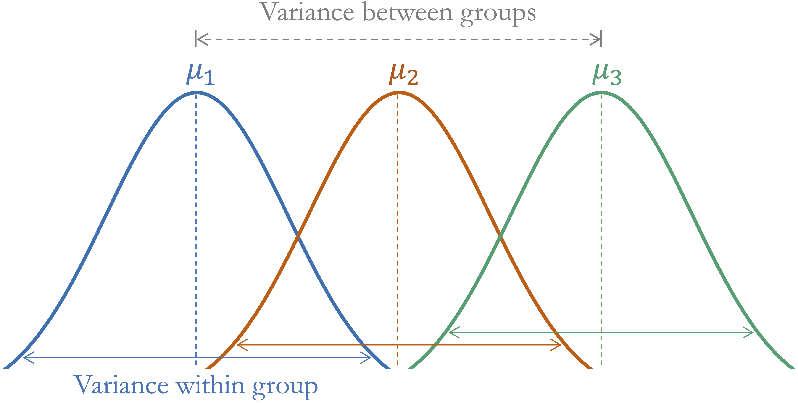
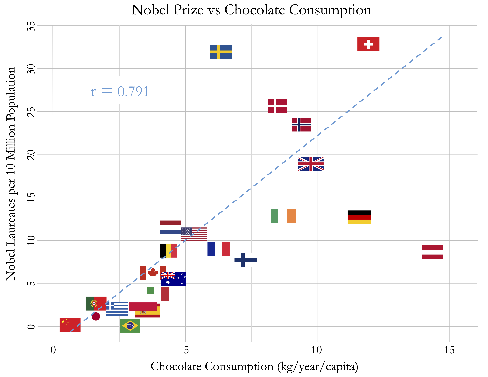

```{r echo=FALSE, message=FALSE, warning=FALSE}
source("_common.R")
```

# Statistical Inference for Data Science {#sec-chapter-statistics}

::: {.content-visible when-format="pdf"}
\begin{chapterquote}
Statistics is the grammar of science.

\hfill — Karl Pearson
\end{chapterquote}
:::

::::: {.content-visible when-format="html"}
:::: chapterquote
Statistics is the grammar of science.

::: author
— Karl Pearson
:::
::::
:::::

Imagine that a bank observes that customers who contact customer service frequently appear more likely to close their credit card accounts. This pattern may help predict which customers are at risk of churning, but it also raises a broader question: does the observed relationship reflect a genuine pattern in the customer population, or could it have arisen from random variation in the available data?

Data science analyses can serve different purposes. Descriptive analysis summarizes patterns in the observed data, while predictive analysis focuses on predicting outcomes for new observations. Statistical inference addresses a different but related goal: using sample data to draw conclusions about population-level quantities and relationships while accounting for uncertainty. The preceding chapters focused primarily on classification, prediction, and model evaluation; this chapter shifts attention toward population-level reasoning and statistical evidence.

Statistical reasoning is therefore an essential part of data science. Data are subject to variation, samples provide only a partial view of a population, and apparent relationships can be misleading when uncertainty, study design, or data quality are ignored. Sound inference requires more than applying formulas or statistical software; it requires understanding what conclusions the data can support and interpreting results with appropriate caution. Misuse or misinterpretation of statistical evidence can lead to convincing but misleading conclusions, a problem famously illustrated in Darrell Huff’s *How to Lie with Statistics* [@huff1954how].

In Chapter [-@sec-chapter-data-understanding], we used exploratory data analysis to identify patterns involving customer behavior and churn. This chapter develops the statistical foundations needed to assess such patterns, quantify their uncertainty, and interpret them responsibly. These ideas also prepare the ground for the following chapters on regression and generalized linear models, where relationships among variables are studied jointly for both inference and prediction.

### What This Chapter Covers {.unnumbered .unlisted}

This chapter introduces statistical inference as a framework for drawing population-level conclusions from sample data. We begin by distinguishing populations, samples, parameters, and statistics, and then examine how sampling variability and sampling distributions create uncertainty in statistical estimates.

Next, we develop the main tools of inference: point estimates, standard errors, confidence intervals, and hypothesis tests. We introduce null and alternative hypotheses, test statistics, *p*-values, significance levels, Type I and Type II errors, statistical power, and the distinction between one-sided and two-sided tests.

The chapter then applies these ideas to common inferential questions involving means, proportions, categorical associations, group comparisons, and correlations. Throughout, emphasis is placed on effect size, practical relevance, assumptions, confounding, multiple testing, and the distinction between association and causation. The chapter concludes by showing how these methods lead naturally to regression, where relationships among variables can be studied jointly for both inference and prediction.

## From Samples to Population Conclusions

Statistical inference requires us to distinguish between the population we want to learn about and the sample we observe, consider how well the sample represents that population, and account for the variability that arises from observing only one sample.

### Populations, Samples, Parameters, and Statistics {.unnumbered .unlisted}

The population is the complete set of units about which we want to draw conclusions. Depending on the problem, it might consist of all customers of a bank, all patients with a particular condition, or all households in a region. The target population refers more specifically to the population to which we intend our conclusions to apply.

Because observing every member of a target population is often impractical or impossible, we usually work with a sample, a subset of observations used to learn about the population. For example, the customers recorded in the `churn` dataset can be viewed as an observed sample from a broader customer population.

A population parameter is a numerical characteristic of the population. Parameters are fixed for a defined population but are usually unknown. Common examples include the population mean $\mu$, population standard deviation $\sigma$, and population proportion $\pi$.

A sample statistic is a numerical quantity calculated from the observed sample. We write $\bar{x}$ for a sample mean, $s$ for a sample standard deviation, and $p$ for a sample proportion. Sample statistics can be used to estimate corresponding population parameters; for example, the observed churn proportion $p$ can be used to estimate the population churn proportion $\pi$. Figure [-@fig-stat-inference] summarizes this relationship between populations, samples, parameters, and statistics.

```{r}
#| label: fig-stat-inference
#| echo: false
#| out-width: 100%
#| fig-cap: "A conceptual overview of statistical inference. A sample is drawn from a population, sample statistics such as $\\bar{x}$, $s$, and $p$ are computed from the sample, and inference uses these statistics to learn about unknown population parameters such as $\\mu$, $\\sigma$, and $\\pi$."


```

The distinction between a sample and a population is central to statistical inference. A statistic describes the observed sample, but using it to draw conclusions about a target population requires us to consider how the sample was obtained and how well it represents that population. The next subsection examines this issue more closely.

### Representativeness and the Scope of Inference {.unnumbered .unlisted}

Population-level conclusions depend on how well the observed data represent the population of interest. A large sample alone does not guarantee representativeness. If some parts of the population are systematically overrepresented or underrepresented, an estimate may be precise but still provide a misleading picture of the target population.

Probability-based sampling provides a clear basis for population inference because inclusion in the sample follows a defined sampling mechanism. In a simple random sample, for example, each population unit has the same probability of being selected. Such designs help reduce systematic selection bias and provide a natural framework for quantifying sampling uncertainty.

Many datasets used in data science, however, arise from observational sources such as administrative records, business databases, online platforms, sensors, or voluntary participation rather than from designed random samples. These data can still be informative, but their origin affects the scope of the conclusions. We must consider which units are represented, which may be systematically absent, and whether the observed data differ in important ways from the target population.

Measurement quality also matters. Variables may be recorded inaccurately, defined inconsistently, or provide imperfect measurements of the quantities of interest. Increasing the sample size can reduce sampling variability, but it cannot correct systematic selection bias or measurement error. The scope of inference therefore depends not only on sample size and statistical methods, but also on how the data were generated, collected, and measured.

### Sampling Variability and Sampling Distributions {.unnumbered .unlisted}

Even when a sample provides an appropriate basis for learning about the target population, its numerical summaries will generally not equal the corresponding population parameters exactly. If we repeatedly collected samples from the same population using the same sampling process, each sample would contain somewhat different observations and would therefore produce somewhat different statistics.

This sample-to-sample variation is called sampling variability. For example, one sample of customers might produce a churn proportion of 0.16, while another sample from the same population might produce 0.15 or 0.17. Sample means, proportions, correlations, and other statistics can all vary in this way even when the underlying population remains unchanged.

The distribution of a statistic across hypothetical repeated samples is called its sampling distribution. This is different from the distribution of the original variable. The distribution of transaction amounts describes how transaction amounts vary across customers, whereas the sampling distribution of the sample mean describes how the mean transaction amount would vary across repeated samples.

Sampling distributions provide the foundation for quantifying uncertainty in statistical inference. Their variability tells us how much an estimate would be expected to change from one sample to another. This variability is summarized by the standard error. In general, estimates based on larger samples tend to have smaller standard errors and are therefore more precise, provided that the sampling process and data quality remain appropriate.

These ideas explain why statistical inference requires more than reporting a statistic calculated from a single sample. We need methods for estimating unknown population quantities, quantifying the uncertainty surrounding those estimates, and evaluating statistical evidence about population-level claims. These three components are summarized in Figure [-@fig-stat-inference-pillars].

```{r fig-stat-inference-pillars, echo=FALSE, out.width="95%", fig.cap = "Three connected components of statistical inference. Point estimation uses sample data to estimate unknown population quantities, confidence intervals quantify uncertainty around those estimates, and hypothesis testing evaluates statistical evidence about population-level claims."}

```

Point estimation provides a numerical estimate of an unknown population quantity, confidence intervals describe the uncertainty surrounding that estimate, and hypothesis testing evaluates evidence about specified population-level claims. The next section develops estimation and statistical uncertainty in more detail.

## Estimation and Statistical Uncertainty

Once a sample has been observed, statistical inference begins with estimation. A sample statistic provides an estimate of an unknown population quantity, but that estimate is subject to sampling variability. We therefore need to consider both the estimated value and the precision with which it has been estimated.

### Point Estimates and Standard Errors {.unnumbered .unlisted}

A point estimate is a single numerical value used to estimate an unknown population parameter. Common examples include the sample mean $\bar{x}$ as an estimate of the population mean $\mu$, and the sample proportion $p$ as an estimate of the population proportion $\pi$.

Consider the proportion of customers who churn in the `churn` dataset:

```{r}
library(liver)
data(churn)

churn_rate = mean(churn$churn == "yes")
churn_rate
```

The resulting value, `r round(churn_rate, 2)`, is the observed sample proportion and serves as a point estimate of the population churn proportion. Similarly, we can estimate the population mean annual transaction amount:

```{r}
mean_transaction = mean(churn$transaction_amount_12)
mean_transaction
```

The sample mean, `r round(mean_transaction, 2)`, provides a point estimate of the corresponding population mean.

Point estimates are sample-dependent. A different sample from the same population would generally produce a somewhat different estimate. To describe how much an estimate would be expected to vary across repeated samples, we use its standard error. A smaller standard error indicates greater precision because the estimate would tend to vary less from sample to sample.

The standard error should be distinguished from the standard deviation. The standard deviation describes variability among individual observations, whereas the standard error describes sampling variability in an estimated statistic. One concerns variation in the observed values; the other concerns uncertainty in an estimate.

For a sample of size $n$ with sample standard deviation $s$, the estimated standard error of the sample mean is $$
SE(\bar{x}) = \frac{s}{\sqrt{n}}.
$$ This expression shows that precision depends on both the variability in the observations and the sample size. Greater variability produces a larger standard error, whereas increasing the sample size generally produces a smaller standard error. Because sample size appears under a square root, reducing the standard error by half requires approximately four times as many observations, all else being equal.

Standard errors play a central role throughout statistical inference. They are used to construct confidence intervals, calculate test statistics, and, in later chapters, quantify uncertainty in estimated regression coefficients.

> *Practice:* Estimate the mean annual transaction amount among customers who churn (`churn == "yes"`) and compute its standard error using $s/\sqrt{n}$. Compare the precision of this estimate with that based on all customers.

### Confidence Intervals {.unnumbered .unlisted}

A point estimate gives a single estimate of a population parameter, while a confidence interval describes the uncertainty surrounding that estimate. Many confidence intervals follow the general structure $$
\text{Point Estimate} \pm \text{Margin of Error},
$$ where $$
\text{Margin of Error} = \text{Critical Value} \times \text{Standard Error}.
$$ The standard error reflects sampling variability, while the critical value depends on the chosen confidence level and the probability distribution used by the method. Together, they determine the width of the interval.

The confidence level describes the long-run performance of the interval-construction procedure. A 95 percent confidence interval does not mean that there is a 95 percent probability that the fixed population parameter lies inside the particular interval calculated from the observed sample. Rather, if samples were repeatedly collected in the same way and a 95 percent confidence interval were constructed from each sample, approximately 95 percent of those intervals would contain the true population parameter, assuming the conditions of the method are satisfied.

The width of a confidence interval reflects its precision. Larger standard errors produce wider intervals, whereas smaller standard errors produce narrower intervals. Increasing the confidence level also produces a wider interval because a larger range is required to achieve greater long-run coverage. There is therefore a trade-off between confidence level and precision.

Confidence intervals quantify uncertainty associated with sampling variability under specified assumptions. They do not automatically account for systematic problems such as selection bias, measurement error, or an inappropriate target population.

### Confidence Interval for a Population Mean {.unnumbered .unlisted}

Suppose we want to estimate the population mean annual transaction amount. Let $\mu$ denote the unknown population mean and $\bar{x}$ the observed sample mean. When the population standard deviation $\sigma$ is unknown, as is typically the case, a confidence interval for $\mu$ is based on the $t$ distribution.

For a confidence level of $1-\alpha$, the interval is $$
\bar{x}
\pm
t_{1-\frac{\alpha}{2},n-1}
\left(
\frac{s}{\sqrt{n}}
\right),
$$ where $t_{1-\frac{\alpha}{2},n-1}$ is the corresponding critical value from a $t$ distribution with $n-1$ degrees of freedom.

The $t$ distribution resembles the standard normal distribution but has heavier tails, reflecting the additional uncertainty that arises because the population standard deviation is estimated from the sample. As the sample size increases, the $t$ distribution approaches the standard normal distribution.

Figure [-@fig-stat-confidence-interval] illustrates how the estimate, standard error, and critical value determine a confidence interval for a population mean. Inference for a population mean assumes independent observations and an approximately normal sampling distribution for the sample mean. This condition is generally reasonable when the population distribution is approximately normal and, in many situations, when the sample size is sufficiently large. Greater caution is needed with small samples when the data are strongly skewed or contain influential observations.

```{r fig-stat-confidence-interval, echo=FALSE, out.width="80%", fig.cap = "Confidence interval for a population mean. The interval is centered at the sample mean, and its width is determined by the standard error and the critical value associated with the chosen confidence level."}

```

In R, a confidence interval for the population mean annual transaction amount can be obtained using `t.test()`:

```{r}
t_result = t.test(churn$transaction_amount_12, conf.level = 0.95)
t_result$conf.int
```

Although `t.test()` is also used for hypothesis testing, here we use it only to obtain the confidence interval. The argument `conf.level = 0.95` specifies a 95 percent confidence level. The resulting interval gives a range of population mean values compatible with the observed data under the assumptions of the method.

> *Practice:* Construct a 95 percent confidence interval for the population mean annual transaction amount among customers who churn. Compare its width and precision with the interval based on all customers.

### Confidence Interval for a Population Proportion {.unnumbered .unlisted}

Suppose $\pi$ denotes the unknown population proportion of customers who churn and $p$ is the observed sample proportion. For sufficiently large samples, the sampling distribution of $p$ is approximately normal, with estimated standard error $$
SE(p)=\sqrt{\frac{p(1-p)}{n}}.
$$ The large-sample approximation requires sufficient observations in both outcome categories. A common guideline is that both $np$ and $n(1-p)$ should be at least about 10.

Several methods can be used to construct confidence intervals for a population proportion. A simple normal approximation uses the estimated standard error directly, but it can perform poorly for small samples or when the observed proportion is close to zero or one. Statistical software therefore often uses alternative approximation-based methods with better statistical properties.

To construct a 95 percent confidence interval for the population churn proportion in R, we use

```{r}
prop_result = prop.test(x = sum(churn$churn == "yes"), n = nrow(churn), conf.level = 0.95)

prop_result$conf.int
```

Here, `x` is the number of customers who churn and `n` is the total number of customers in the sample. By default, `prop.test()` uses a large-sample approximation with a continuity correction. The resulting interval provides a range of population churn proportions compatible with the observed data under the assumptions of the method.

For small samples or very rare outcomes, large-sample approximations may be unreliable and alternative methods may be needed. More generally, confidence intervals allow population quantities to be estimated while making sampling uncertainty explicit. The next section turns to hypothesis testing, where the focus shifts from estimating a parameter to evaluating statistical evidence against a specified population-level claim.

> *Practice:* Construct a 90 percent confidence interval for the population churn proportion using `conf.level = 0.90`. Compare its width with the 95 percent interval and explain the difference.

## Hypothesis Testing and Statistical Evidence

Confidence intervals quantify uncertainty around estimated population parameters. Hypothesis testing addresses a related question: whether the observed data provide sufficient evidence against a specified claim about the population.

Suppose a bank introduces a new customer service protocol and observes a lower churn rate among customers who receive it. Hypothesis testing provides a framework for assessing whether this difference is compatible with sampling variability under a specified baseline assumption or provides evidence against that assumption.

### Null and Alternative Hypotheses {.unnumbered .unlisted}

A hypothesis test begins with two competing statements about a population quantity. The null hypothesis, denoted by $H_0$, represents the baseline claim being evaluated. It commonly specifies no difference, no association, or equality with a particular value. The alternative hypothesis, denoted by $H_a$, represents the competing claim.

For example, suppose we want to determine whether the population mean number of customer service contacts differs from 2: $$
\begin{cases}
H_0: \mu = 2, \\
H_a: \mu \neq 2.
\end{cases}
$$ The logic of hypothesis testing begins by assuming that $H_0$ is true and asking whether the observed data would be unusual under that assumption. To evaluate this, a hypothesis test summarizes the observed evidence using a test statistic. The form of the test statistic depends on the problem; for example, tests involving means may use a $t$ statistic, while tests involving categorical variables may use a chi-square statistic.

If $H_0$ were true, repeated samples would produce a distribution of possible values of the test statistic, called its null distribution. Values that are typical under $H_0$ provide little evidence against it, whereas more extreme values are less compatible with the null hypothesis. The position of the observed test statistic within this distribution provides the basis for calculating the *p*-value.

A hypothesis test does not prove that $H_a$ is true. Similarly, failing to find strong evidence against $H_0$ does not prove that $H_0$ is true. The test evaluates how compatible the observed data are with the specified null hypothesis.

> *Practice:* Formulate the null and alternative hypotheses for testing whether the population mean number of customer service contacts is greater than 2.

### The *p*-value and Significance Level {.unnumbered .unlisted}

The *p*-value is the probability, assuming $H_0$ is true, of obtaining a test statistic at least as extreme as the one observed, in the direction or directions specified by the alternative hypothesis.

A small *p*-value indicates that the observed result would be unusual under $H_0$ and therefore provides evidence against the null hypothesis. A large *p*-value does not provide strong evidence against $H_0$, but it does not establish that $H_0$ is true.

The *p*-value is not the probability that $H_0$ is true. It also does not measure the magnitude or practical importance of an observed effect, issues considered later in this chapter.

To make the statistical decision explicit, the *p*-value is compared with a significance level, denoted by $\alpha$, specified before examining the test result. A common choice is $\alpha = 0.05$, although the appropriate value depends on the context. If the *p*-value is smaller than $\alpha$, the result is considered statistically significant and $H_0$ is rejected. If the *p*-value is greater than or equal to $\alpha$, we do not reject $H_0$. This does not mean that $H_0$ is true; it means only that the observed data do not provide sufficient evidence against it.

For example, suppose we test whether the population mean account tenure equals 36 months and obtain a *p*-value of 0.03. At a pre-specified significance level of $\alpha = 0.05$, we reject $H_0$. If the significance level had instead been specified as $\alpha = 0.01$, we would not reject $H_0$. The same observed evidence can therefore lead to different statistical decisions depending on the significance level chosen for the test. Figure [-@fig-stat-hypothesis-testing] summarizes the main steps of this process, from specifying the hypotheses to reaching a statistical decision.

```{r fig-stat-hypothesis-testing, echo=FALSE, out.width="80%", fig.cap = "Main steps in hypothesis testing. After specifying $H_0$ and $H_a$, a test statistic is calculated and used to obtain a p-value. The p-value is then compared with the significance level $\\alpha$ to determine whether there is sufficient evidence to reject $H_0$."}

```

> *Practice:* Suppose a hypothesis test produces a *p*-value of 0.08. What conclusion would you reach at $\alpha = 0.05$? Does this conclusion imply that the null hypothesis is true?

### One-Sided and Two-Sided Tests {.unnumbered .unlisted}

The alternative hypothesis determines which departures from $H_0$ count as evidence against the null hypothesis. A two-sided test is appropriate when departures in either direction are relevant: $$
H_a: \theta \neq \theta_0.
$$ For example, we may want to determine whether the population mean annual transaction amount differs from \$4,000 without specifying in advance whether it is higher or lower.

A one-sided test is appropriate when the research question concerns a particular direction. A left-sided alternative has the form $$
H_a: \theta < \theta_0,
$$ whereas a right-sided alternative has the form $$
H_a: \theta > \theta_0.
$$ For example, we might test whether the population churn proportion exceeds 0.30.

The alternative hypothesis determines how the *p*-value is calculated. In a two-sided test, extreme departures in either direction contribute to the *p*-value. In a one-sided test, only departures in the direction specified by $H_a$ are considered. These regions correspond to the tails of the null distribution, which is why the terms *one-tailed* and *two-tailed* are also commonly used. Figure [-@fig-stat-p-value] illustrates these cases.

```{r fig-stat-p-value, echo=FALSE, out.width="80%", fig.cap = "Tail areas used to compute p-values for two-sided, left-sided, and right-sided tests. Under the null distribution of the test statistic, the shaded regions represent results at least as extreme as the observed value in the direction or directions specified by $H_a$."}

```

The direction of a test should be determined before examining the data. Choosing a one-sided alternative after observing the sample result uses the same data both to define and to test the hypothesis. Two-sided tests are therefore generally appropriate unless a directional alternative is clearly justified in advance.

### Type I and Type II Errors and Statistical Power {.unnumbered .unlisted}

Because hypothesis tests are based on sample data, statistical decisions can be incorrect. A Type I error occurs when we reject $H_0$ even though it is true. The significance level $\alpha$ controls the long-run probability of this error under the assumptions of the test.

A Type II error occurs when we do not reject $H_0$ even though it is false. Its probability is denoted by $\beta$. In this case, a genuine population difference or association exists, but the available data do not provide sufficient evidence to detect it. Table [-@tbl-stat-hypothesis-errors] summarizes the possible statistical decisions and errors.

::: {#tbl-stat-hypothesis-errors .table}
| Decision            | $H_0$ is true           | $H_0$ is false          |
|---------------------|-------------------------|-------------------------|
| Do not reject $H_0$ | Correct decision        | Type II error ($\beta$) |
| Reject $H_0$        | Type I error ($\alpha$) | Correct decision        |

Possible outcomes of a hypothesis test according to the statistical decision and whether the null hypothesis is true.
:::

Reducing $\alpha$ makes it more difficult to reject $H_0$. This lowers the probability of a Type I error but, all else being equal, can increase the probability of a Type II error. The relative importance of these errors depends on the consequences of the decision being made.

Statistical power is the probability that a test correctly rejects $H_0$ when a specified alternative is true: $$
\text{Power} = 1 - \beta.
$$ Power depends on factors including sample size, the magnitude of the true effect, variability in the data, and the chosen significance level. Larger samples generally increase power by reducing sampling variability, while larger effects are easier to detect than smaller ones. Power is particularly important when planning a study because a study with low power may fail to detect an effect of practical importance even when such an effect exists.

Confidence intervals and hypothesis tests provide complementary views of the same inferential problem. A confidence interval estimates a population parameter and describes its uncertainty, whereas a hypothesis test evaluates the evidence against a specific value under $H_0$. For a two-sided test of $H_0: \theta = \theta_0$ at significance level $\alpha$, the null hypothesis is rejected when $\theta_0$ lies outside the corresponding two-sided $(1-\alpha)$ confidence interval, provided that the interval and test are based on the same method and assumptions.

Confidence intervals are often more informative than a reject-or-do-not-reject decision alone because they also show the estimated magnitude of the parameter and the precision of the estimate. With the general logic of hypothesis testing established, the next section considers how statistical results should be interpreted beyond statistical significance alone.

## Interpreting Statistical Results Responsibly

Statistical significance alone does not determine whether a finding is important, generalizable, or causal. Statistical results should be interpreted together with the magnitude and uncertainty of the estimated effect, the study design, and the context in which the analysis was conducted.

### Statistical Significance, Effect Size, and Practical Relevance {.unnumbered .unlisted}

Statistical significance describes the strength of evidence against a null hypothesis relative to a chosen significance level. It does not describe the magnitude of the observed difference or association. With a sufficiently large sample, even a very small effect may produce a small *p*-value, whereas an important effect may fail to reach statistical significance in a small or highly variable sample.

The effect size describes the magnitude of a difference or association. Depending on the question, it may be expressed as a difference between means, a difference between proportions, or a correlation coefficient. Confidence intervals complement these estimates by showing the uncertainty surrounding them.

For example, suppose two customer groups differ in their average annual transaction amount. A small *p*-value may provide evidence that the population means differ, but it does not tell us whether the estimated difference is \$10, \$100, or \$1,000. The effect estimate and its confidence interval therefore provide information that the *p*-value alone cannot.

Practical relevance depends on the application. A small change in churn rate may have substantial consequences when applied to a large customer population, while a statistically significant difference may have little practical value in another setting. Statistical evidence should therefore be interpreted together with domain knowledge, expected costs and benefits, and the consequences of acting on the result.

### Association, Confounding, and Causation {.unnumbered .unlisted}

Many statistical tests evaluate associations between variables, but an observed association does not by itself establish a causal relationship.

Suppose customers who make more service contacts have a higher churn rate. Frequent service contacts may contribute to churn, but other explanations are possible. Customers experiencing repeated problems may be both more likely to contact customer service and more likely to leave the bank. Other characteristics, such as customer tenure, account type, or transaction behavior, may also be related to both service contacts and churn. Such variables can influence an observed association and may act as confounding variables.

Causal conclusions therefore depend strongly on study design and the assumptions underlying the analysis. Randomized experiments can provide stronger evidence for causal effects because random assignment helps separate the intervention from other systematic differences between groups. Observational data generally require additional assumptions and methods before causal conclusions can be justified.

This distinction becomes particularly important in regression analysis. Regression allows several variables to be considered jointly and can describe relationships after accounting for measured variables. Such adjustment can be informative, but it does not by itself establish causation.

### Multiple Testing and Exploratory Analysis {.unnumbered .unlisted}

Data science analyses often involve examining many variables and relationships. When many hypothesis tests are conducted, the chance of obtaining statistically significant results purely by chance increases. For example, if 20 independent tests are conducted at $\alpha = 0.05$ and all corresponding null hypotheses are true, the probability of obtaining at least one statistically significant result is $$
1 - (1 - 0.05)^{20} \approx 0.64.
$$ This is one aspect of the multiple testing problem. When many related hypotheses are tested, appropriate adjustments may be needed to control the increased risk of false-positive findings.

The distinction between exploratory and confirmatory analysis is also important. Exploratory data analysis is intended to discover patterns and generate questions. If a hypothesis is formulated after examining the same data used to test it, the resulting evidence should be interpreted more cautiously than evidence from a hypothesis specified in advance. Exploratory findings may instead motivate investigation using additional data or a confirmatory analysis.

Similar caution applies to predictor selection. Testing each predictor individually and retaining only those with statistically significant *p*-values is generally not an appropriate strategy for predictive modeling. A predictor may contribute useful information jointly with other variables even when its marginal association is weak, while a statistically significant variable may add little predictive value. Predictor selection should therefore reflect the modeling objective, domain knowledge, and out-of-sample performance rather than univariate statistical significance alone.

These principles provide the foundation for interpreting the inferential methods introduced next, where the choice of method depends on the research question, variable types, and structure of the data.

I would address the reviewer concern with one explicit paragraph immediately after the table, before discussing method assumptions. That is the cleanest place because the reader has just seen the menu of inferential methods and is about to enter the applied sections.

## Choosing an Appropriate Inferential Method {#sec-stat-choosing-test}

Choosing an inferential method begins with the research question. We must first identify the population quantity or relationship of interest and determine whether the goal is to estimate it, test a specific claim about it, or both. The types of variables involved, the number and structure of any groups being compared, and the study design then help determine which method is appropriate.

For numerical outcomes, inferential questions often concern one or more population means. The appropriate method depends on whether a single mean is compared with a reference value, two independent groups are compared, observations are paired, or more than two groups are involved. For binary outcomes, interest may focus on one population proportion or on comparing proportions across groups. Associations between categorical variables are commonly examined using contingency-table methods, while relationships between two numerical variables may be studied using correlation. Table [-@tbl-stat-hypothesis-test] summarizes the main inferential questions and methods considered in this chapter.

::: {#tbl-stat-hypothesis-test .table}
| Inferential question | Typical setting | Common inferential method |
|------------------------|------------------------|------------------------|
| One-sample inference for a mean | One numerical variable compared with a reference value | One-sample $t$ inference |
| One-sample inference for a proportion | One binary outcome compared with a reference proportion | One-sample proportion inference |
| Comparison of two independent means | Numerical outcome and two independent groups | Two-sample $t$ inference |
| Comparison of paired means | Numerical measurements observed in natural pairs | Paired $t$ inference |
| Comparison of multiple means | Numerical outcome and a categorical grouping variable with three or more levels | Analysis of variance (ANOVA) |
| Comparison of two independent proportions | Binary outcome and two independent groups | Two-sample proportion inference |
| Association between categorical variables | Two categorical variables | Chi-square test of independence |
| Correlation between numerical variables | Two numerical variables | Pearson correlation inference |

Common inferential questions, typical data settings, and methods considered in this chapter.
:::

The table provides a starting point rather than a mechanical decision rule. The same variable types can require different methods depending on how the data were collected and how the observations are related. For example, comparing measurements from two independent groups differs fundamentally from comparing two measurements taken on the same individuals.

In the examples that follow, the observed records are treated for pedagogical purposes as approximately independent observations from a conceptual target population so that the mechanics and interpretation of classical inferential methods can be illustrated. In substantive applications, however, population-level conclusions are justified only to the extent that the sampling or data-generating process supports such inference. Representativeness, selection mechanisms, measurement quality, and dependence therefore remain important when determining the scope of the conclusions.

The assumptions of the chosen method must also be considered, including independence of observations, distributional assumptions, sample size, expected cell counts, and other features of the study design. Many inferential procedures combine estimation and hypothesis testing by providing a point estimate and confidence interval together with a test of a population-level claim. The estimate and its uncertainty often provide more information about the magnitude and precision of a relationship than the test decision alone. The sections that follow apply these ideas to population means, population proportions and categorical associations, and correlations between numerical variables.

The methods emphasized in this chapter are classical inferential procedures that rely on analytically specified sampling or null distributions under particular assumptions. Computational approaches provide another important framework for statistical inference. Bootstrap methods, for example, use repeated resampling to quantify uncertainty and construct confidence intervals, while permutation methods assess evidence against a null hypothesis by repeatedly rearranging observations or group labels in a manner consistent with that hypothesis [@efron1993bootstrap; @good2005permutation]. These approaches are widely used in modern data analysis but are beyond the scope of this introductory chapter.

## Comparing Population Means {#sec-stat-comparing-means}

Many inferential questions involve comparing a population mean with a reference value or comparing means across groups or conditions. Although the details differ, these methods share the same basic logic: estimate the relevant mean or mean difference, quantify its uncertainty, and evaluate whether the observed data provide evidence against a specified null hypothesis.

### Comparing One Mean with a Reference Value {.unnumbered .unlisted}

Suppose a bank uses 36 months as a benchmark for typical customer account tenure. We may ask whether the current population mean tenure is still consistent with this benchmark or whether the observed data provide evidence of a departure from it.

One-sample $t$ inference is used to compare the mean of a numerical variable with a specified population value. Because the population standard deviation is usually unknown, uncertainty is estimated from the sample and inference is based on the $t$ distribution.

The $t$ distribution is also known as Student's $t$ distribution. It was developed by William Sealy Gosset while he was working at the Guinness Brewery in the early twentieth century. Gosset was interested in making reliable inferences from small samples when the population variance was unknown. He published his influential work under the pseudonym “Student,” giving rise to the names Student's $t$ distribution and Student's $t$ test [@student1908probable].

For a two-sided comparison of a population mean $\mu$ with a reference value $\mu_0$, the hypotheses are $$
\begin{cases}
H_0: \mu = \mu_0, \\
H_a: \mu \neq \mu_0.
\end{cases}
$$ If the research question concerns a particular direction, the alternative may instead be $H_a: \mu < \mu_0$ or $H_a: \mu > \mu_0$.

For a one-sample $t$ test, the test statistic is $$
t = \frac{\bar{x}-\mu_0}{s/\sqrt{n}}.
$$ The numerator measures how far the sample mean is from the value specified under $H_0$, while the denominator is the estimated standard error of the sample mean. The test statistic therefore expresses the observed departure from the null value relative to its sampling uncertainty. Larger absolute values of $t$ indicate that the sample mean is farther from the null value in standard-error units.

To illustrate, we return to the `churn` dataset and examine whether the population mean account tenure differs from 36 months. Let $\mu$ denote the population mean of `months_on_book`. The hypotheses are $$
\begin{cases}
H_0: \mu = 36, \\
H_a: \mu \neq 36.
\end{cases}
$$

In R, the analysis can be performed using `t.test()`:

```{r}
t_test = t.test(churn$months_on_book, mu = 36) 
t_test
```

The output reports the estimated mean, test statistic, degrees of freedom, *p*-value, and confidence interval for the population mean. The sample mean is `r round(t_test$estimate, 2)` months, and the *p*-value is `r round(t_test$p.value, 2)`. Because the *p*-value exceeds $\alpha = 0.05$, we do not reject $H_0$. The observed data therefore do not provide sufficient evidence that the population mean account tenure differs from 36 months.

The corresponding 95 percent confidence interval is (`r round(t_test$conf.int[1], 2)`, `r round(t_test$conf.int[2], 2)`). Because 36 lies within this interval, the confidence interval and hypothesis test lead to the same conclusion. More importantly, the interval shows the range of population mean values that are reasonably compatible with the observed data under the assumptions of the method.

> *Practice:* Test whether the population mean account tenure is less than 36 months. Formulate the hypotheses, use `alternative = "less"` in `t.test()`, and interpret the result at $\alpha = 0.05$.

### Comparing Two Independent Means {.unnumbered .unlisted}

A second common question is whether the population means of a numerical outcome differ between two independent groups. For example, do customers who churn have a different average credit limit from customers who remain active?

Let $\mu_{\text{yes}}$ denote the population mean credit limit for customers who churn and $\mu_{\text{no}}$ the corresponding mean for customers who do not churn. A two-sided comparison uses $$
\begin{cases}
H_0: \mu_{\text{yes}} = \mu_{\text{no}}, \\
H_a: \mu_{\text{yes}} \neq \mu_{\text{no}}.
\end{cases}
$$

In Section [-@sec-EDA-sec-numeric], exploratory analysis suggested that credit limits may differ between churners and non-churners. Before performing formal inference, we compute the sample means explicitly:

```{r}
credit_means = aggregate(credit_limit ~ churn, data = churn, mean)
credit_means
```

We then compare the two groups using

```{r}
t_test_credit = t.test(credit_limit ~ churn, data = churn)
t_test_credit
```

By default, `t.test()` performs Welch's two-sample $t$ procedure, which does not require the two population variances to be equal. The output reports the estimated group means, the estimated difference, a confidence interval, the test statistic, degrees of freedom, and the *p*-value.

The *p*-value is `r round(t_test_credit$p.value, 4)`, which is smaller than $\alpha = 0.05$. We therefore reject $H_0$ and conclude that the data provide evidence that the population mean credit limit differs between churners and non-churners.

The sample mean credit limit is `r round(credit_means$credit_limit[credit_means$churn == "yes"], 2)` for customers who churn and `r round(credit_means$credit_limit[credit_means$churn == "no"], 2)` for customers who do not churn. The 95 percent confidence interval for the difference between the group means is (`r round(t_test_credit$conf.int[1], 3)`, `r round(t_test_credit$conf.int[2], 3)`). Because zero is not contained in this interval, the confidence interval is consistent with the hypothesis-test conclusion while also quantifying the uncertainty surrounding the estimated difference.

> *Practice:* Test whether the population mean account tenure (`months_on_book`) differs between churners and non-churners. Compute the group means, then use `t.test(months_on_book ~ churn, data = churn)` and interpret the confidence interval and *p*-value.

### Comparing Paired Measurements {#sec-stat-paired-t-test .unnumbered .unlisted}

Not all comparisons involve independent groups. In many studies, observations occur in natural pairs, such as measurements taken on the same individuals before and after an intervention or measurements on matched subjects.

For paired data, inference is based on the differences within pairs rather than on the two sets of measurements separately. Let $(x_{i,1}, x_{i,2})$ denote two measurements for the $i$th unit and define $$
d_i = x_{i,2} - x_{i,1}.
$$ The paired $t$ procedure examines whether the population mean difference $\mu_d$ equals zero. For a two-sided analysis, $$
\begin{cases}
H_0: \mu_d = 0, \\
H_a: \mu_d \neq 0.
\end{cases}
$$ Conceptually, this is a one-sample $t$ analysis applied to the within-pair differences. Pairing accounts for the fact that measurements from the same unit are related and can reduce variability that arises from differences between units.

Because the `churn` dataset does not contain repeated measurements for the same customers, we use a simulated example. Suppose a bank records transaction amounts for 100 customers before and after a marketing campaign intended to increase spending:

```{r}
set.seed(42)

n = 100
before = rnorm(n, mean = 4000, sd = 800)
after = before + rnorm(n, mean = 300, sd = 500)
```

Figure [-@fig-stat-paired-t-test-plot] illustrates both the paired measurements and the resulting within-customer differences.

::: {#fig-stat-paired-t-test-plot}
```{r, echo=FALSE, out.width="100%"}
#| layout-ncol: 2
#| fig-width: 4
#| fig-height: 4

customer = 1:n

df = data.frame(
  customer = rep(customer, 2),
  period = factor(rep(c("Before", "After"), each = n),
                  levels = c("Before", "After")),
  spending = c(before, after)
)

ggplot(df, aes(x = period, y = spending, group = customer)) +
  geom_line(alpha = 0.4, color = "gray50", linewidth = 0.5) +
  geom_point(size = 2, color = "#2C7FB8") +
  labs(x = "Campaign Period", y = "Transaction Amount")

diff_spending = after - before
df_diff = data.frame(customer = 1:n, difference = diff_spending)

ggplot(df_diff, aes(x = difference)) +
  geom_histogram(bins = 12, fill = "#2C7FB8", color = "white", alpha = 0.8) +
  geom_vline(xintercept = 0, linetype = "dashed") +
  labs(x = "Difference in Transaction Amount", y = "Number of Customers") +
  theme_minimal()
```

Customer transaction amounts before and after a marketing campaign (left) and the distribution of within-customer differences (right).
:::

The paired analysis is performed by setting `paired = TRUE`:

```{r}
paired_test = t.test(after, before, paired = TRUE)
paired_test
```

The output reports the estimated mean difference, confidence interval, test statistic, degrees of freedom, and *p*-value. In this simulated example, the *p*-value is `r round(paired_test$p.value, 4)`, providing strong evidence against $H_0$. The estimated mean difference and its confidence interval quantify the average change in transaction amount after the campaign.

The essential feature of this analysis is the pairing itself. Treating the before and after measurements as if they came from independent groups would ignore the dependence between measurements from the same customer and would answer a different statistical question.

> *Practice:* Test whether the marketing campaign increased average customer spending using a one-sided paired $t$ test with $H_a: \mu_d > 0$ and `alternative = "greater"`. Compare its *p*-value with that from the two-sided test.

### Comparing More Than Two Means {#sec-stat-anova .unnumbered .unlisted}

When a numerical outcome is compared across three or more groups, repeatedly applying two-sample tests is not an appropriate general strategy because conducting many pairwise tests increases the risk of false-positive findings. Analysis of variance (ANOVA) instead provides a single overall test of whether the population means are equal across all groups.

Suppose there are $k$ groups with population means $\mu_1,\ldots,\mu_k$. The hypotheses are $$
\begin{cases}
H_0: \mu_1 = \mu_2 = \cdots = \mu_k, \\
H_a: \text{Not all population means are equal.}
\end{cases}
$$ ANOVA compares variation between the group means with variation among observations within the groups. When between-group variation is large relative to within-group variation, the resulting $F$ statistic becomes large and provides evidence against $H_0$. Figure [-@fig-stat-anova-concept] illustrates this comparison conceptually.

```{r fig-stat-anova-concept, echo=FALSE, out.width="70%", fig.cap="Conceptual idea behind analysis of variance. ANOVA compares variability between group means with variability within groups. Greater between-group variability relative to within-group variability provides evidence that not all population means are equal."}

```

To illustrate, we use the `bike_demand` dataset from the **liver** package, which will be revisited in Chapter [-@sec-chapter-regression]. The numerical outcome `bike_count` records hourly bike demand, while `season` identifies the season in which each observation was recorded. We first examine the distributions graphically:

```{r}
data(bike_demand)

ggplot(data = bike_demand) +
  geom_boxplot(aes(x = season, y = bike_count)) +
  labs(x = "Season", y = "Hourly Bike Count")
```

The boxplot suggests differences in bike demand across seasons. The ANOVA assesses whether the observed differences provide evidence that the corresponding population means are not all equal. For the four seasons, $$
\begin{cases}
H_0: \mu_{\text{autumn}} = \mu_{\text{spring}} = \mu_{\text{summer}} = \mu_{\text{winter}}, \\
H_a: \text{Not all seasonal population means are equal.}
\end{cases}
$$ The analysis can be performed using `aov()`:

```{r}
anova_test = aov(bike_count ~ season, data = bike_demand)
summary(anova_test)
```

The ANOVA table reports the between-group and within-group variation, degrees of freedom, $F$ statistic, and corresponding *p*-value. Here, the *p*-value is smaller than $\alpha = 0.05$, so we reject $H_0$ and conclude that the data provide evidence that mean hourly bike demand is not the same across all seasons.

Rejecting the overall null hypothesis does not identify which population means differ. Follow-up comparisons can be used when specific pairwise differences are of interest, with appropriate attention to multiple testing. The analysis also represents an unadjusted comparison across seasons: other factors related to bike demand, such as weather, holidays, weekdays, and time of day, are not accounted for. Regression models introduced later provide a framework for examining such relationships jointly.

> *Practice:* Use ANOVA to test whether population mean bike demand differs across `weather` categories in the `bike_demand` dataset. Fit `aov(bike_count ~ weather, data = bike_demand)` and examine the result together with a boxplot of `bike_count` by `weather`.

### Assumptions and Alternatives {.unnumbered .unlisted}

The methods in this section rely on assumptions about how the data were generated and about the behavior of the relevant sampling distributions. Independence is particularly important. For independent-group comparisons, observations should not be systematically related across units. For paired analyses, independence is required between pairs, while the two measurements within each pair are intentionally dependent. When observations are clustered, repeated over time, or otherwise dependent in ways not represented by the chosen method, standard inferential procedures may produce misleading uncertainty estimates.

For inference about means, approximate normality concerns the sampling distribution of the relevant mean or mean difference rather than requiring every observed variable to follow a perfectly normal distribution. With sufficiently large samples, $t$ procedures are often reasonably robust to moderate departures from normality. For paired analyses, it is the distribution of the within-pair differences that is relevant. Strong skewness and influential observations deserve particular attention, especially when sample sizes are small.

Variance assumptions also differ across procedures. Welch's two-sample $t$ procedure, used by default by `t.test()` in R, allows the two groups to have unequal variances and is generally preferable to automatically assuming equal variances. Classical one-way ANOVA assumes approximately equal variances across groups; when this assumption is questionable, methods such as Welch's ANOVA can provide an alternative.

When the assumptions underlying mean-based methods are seriously violated, nonparametric procedures may be considered. Common examples include the Mann–Whitney test for two independent groups, the Wilcoxon signed-rank test for paired measurements, and the Kruskal–Wallis test for more than two independent groups. These methods make different assumptions and typically concern distributions or ranks rather than providing direct substitutes for every question about population means. The choice between parametric and nonparametric methods should therefore follow from the research question, study design, sample size, and characteristics of the observed data rather than from a mechanical normality test alone.

## Proportions and Categorical Associations {#sec-stat-proportions-categorical}

Many inferential questions involve categorical outcomes. When the outcome is binary, interest often focuses on a population proportion or on comparing proportions across groups. More generally, when two variables are categorical, we may ask whether their population distributions are associated. The methods in this section address these related questions using observed category counts.

### Comparing One Proportion with a Reference Value {#sec-stat-one-sample-proportion-test .unnumbered .unlisted}

Suppose a bank uses 15 percent as a benchmark for the annual customer churn rate. We may ask whether the current population churn proportion is consistent with this benchmark or whether the observed data provide evidence that it has changed.

Let $\pi$ denote the population proportion of customers who churn and let $\pi_0$ denote the reference proportion. For a two-sided comparison, $$
\begin{cases}
H_0: \pi = \pi_0, \\
H_a: \pi \neq \pi_0.
\end{cases}
$$ In the `churn` dataset, the response variable `churn` records whether each customer churned (`"yes"`) or did not churn (`"no"`). To test whether the population churn proportion differs from 0.15, we specify $$
\begin{cases}
H_0: \pi = 0.15, \\
H_a: \pi \neq 0.15.
\end{cases}
$$

The analysis can be performed in R using `prop.test()`:

```{r}
prop_test = prop.test(x = sum(churn$churn == "yes"), n = nrow(churn), p = 0.15)

prop_test
```

Here, `x` is the number of customers who churned, `n` is the total sample size, and `p = 0.15` specifies the population proportion under $H_0$. The function uses a large-sample chi-square approximation and, by default, applies a continuity correction when appropriate.

The output reports the observed sample proportion, a confidence interval for the population proportion, the test statistic, and the *p*-value. The observed sample proportion is `r round(prop_test$estimate, 3)`, and the *p*-value is `r round(prop_test$p.value, 3)`. Because the *p*-value is smaller than $\alpha = 0.05$, we reject $H_0$ and conclude that the data provide evidence that the population churn proportion differs from 0.15.

The corresponding 95 percent confidence interval is (`r round(prop_test$conf.int[1], 3)`, `r round(prop_test$conf.int[2], 3)`). The interval does not contain 0.15, which is consistent with the hypothesis-test conclusion while also showing the range of population proportions compatible with the observed data under the assumptions of the method.

> *Practice:* Test whether the population churn proportion exceeds 0.15. Formulate the hypotheses and conduct a one-sided analysis using `alternative = "greater"` in `prop.test()`. Interpret the result at $\alpha = 0.05$.

### Comparing Two Independent Proportions {#sec-stat-two-sample-proportions .unnumbered .unlisted}

A common extension is to compare the population proportions of a binary outcome across two independent groups. For example, we may ask whether the churn proportion differs between female and male customers.

Let $\pi_{\text{female}}$ and $\pi_{\text{male}}$ denote the population churn proportions for the two groups. A two-sided comparison uses $$
\begin{cases}
H_0: \pi_{\text{female}} = \pi_{\text{male}}, \\
H_a: \pi_{\text{female}} \neq \pi_{\text{male}}.
\end{cases}
$$

In Section [-@sec-EDA-categorical], we examined churn patterns across demographic groups using graphical and numerical summaries. We now assess whether the observed difference between the two gender groups is larger than would be expected from sampling variability alone.

We first construct a contingency table and extract the number of churned customers and the total sample size within each group:

```{r}
table_gender = table(churn$gender, churn$churn, dnn = c("Gender", "Churn"))

table_gender

x_gender = table_gender[, "yes"]
n_gender = rowSums(table_gender)

gender_rates = x_gender / n_gender
gender_rates
```

The values in `gender_rates` provide the estimated churn proportions and should be examined before interpreting the formal test. We then compare the population proportions using

```{r}
prop_test_gender = prop.test(x = x_gender, n = n_gender)

prop_test_gender
```

For two independent groups, `prop.test()` evaluates whether the population proportions are equal using a large-sample chi-square approximation. The output also reports the estimated group proportions and a confidence interval for their difference.

The *p*-value is `r round(prop_test_gender$p.value, 3)`. Because it is smaller than $\alpha = 0.05$, we reject $H_0$ and conclude that the data provide evidence that the population churn proportions differ between the two groups. The values in `gender_rates` show the direction and magnitude of the observed difference.

The 95 percent confidence interval for the difference in population proportions is (`r round(prop_test_gender$conf.int[1], 3)`, `r round(prop_test_gender$conf.int[2], 3)`). Because zero is not contained in the interval, the confidence interval and hypothesis test lead to the same inferential conclusion.

> *Practice:* Test whether the population churn proportion is higher among female than male customers. Place the female group first, use `alternative = "greater"` in `prop.test()`, and interpret the estimated proportions and *p*-value.

### Testing Association Between Categorical Variables {#sec-stat-chi-square-test .unnumbered .unlisted}

When both variables are categorical, the inferential question is often whether their population distributions are associated. The chi-square test of independence addresses this question by comparing the observed counts in a contingency table with the counts that would be expected if the variables were independent.

To illustrate, we examine whether customer churn is associated with marital status. The variable `marital` contains the categories `"divorced"`, `"married"`, `"single"`, and `"unknown"`. The `"unknown"` category represents missing or unreported marital status and should therefore be interpreted accordingly.

We first construct the contingency table:

```{r}
table_marital = table(churn$churn, churn$marital, dnn = c("Churn", "Marital"))

table_marital
```

The hypotheses for the chi-square test of independence are $$
\begin{cases}
H_0: \pi_{\text{yes, married}} = \pi_{\text{yes, single}} = \pi_{\text{yes, divorced}} = \pi_{\text{yes, unknown}}, \\
H_a: \text{At least one marital category has a different churn proportion.}
\end{cases}
$$ Under $H_0$, differences among the observed cell counts arise only from sampling variability around the counts expected under independence. The chi-square statistic summarizes the discrepancy between the observed and expected counts, with larger discrepancies providing stronger evidence against $H_0$.

We perform the analysis using `chisq.test()`:

```{r}
chisq_marital = chisq.test(table_marital)
chisq_marital
```

The output reports the chi-square statistic, degrees of freedom, and corresponding *p*-value. The *p*-value is `r round(chisq_marital$p.value, 4)`, which is greater than $\alpha = 0.05$. We therefore do not reject $H_0$. The observed data do not provide sufficient evidence of an association between marital status and churn.

Because churn has two categories, the same question can also be described as asking whether the population churn proportion is the same across marital-status categories. The chi-square formulation is more general, however, because it applies when either categorical variable has more than two levels.

> *Practice:* Test whether education level is associated with churn. Construct a contingency table for `education` and `churn`, apply `chisq.test()`, inspect the expected counts, and interpret the result at $\alpha = 0.05$.

### Conditions and Small Expected Counts {.unnumbered .unlisted}

The procedures in this section rely on assumptions about the sampling process and on large-sample approximations. Observations should be independent unless the design and method explicitly account for dependence. For example, repeated measurements from the same individuals or clustered observations should not be treated as independent categorical observations without an appropriate method.

For proportion inference, the sample must contain enough observations in the relevant outcome categories for the large-sample approximation to be reliable. When the observed proportion is very close to zero or one, or when the sample is small, approximation-based methods can perform poorly and alternative procedures may be preferable.

For chi-square tests, the approximation depends on the expected cell counts under $H_0$. These expected counts can be inspected in R using

```{r}
chisq_marital$expected
```

Very small expected counts indicate that the chi-square approximation may be unreliable. A common introductory guideline is that expected counts should generally be at least 5, although the adequacy of the approximation depends on the overall table structure and sample size rather than on a single rigid threshold.

For small contingency tables with sparse counts, Fisher's exact test provides an alternative that does not rely on the chi-square approximation. In R, it can be performed using `fisher.test()`. Fisher's exact test is especially common for $2 \times 2$ tables with small expected counts, although it can also be applied more broadly when computationally feasible.

The choice between these procedures should therefore reflect the research question, study design, sample size, and observed cell counts rather than being determined mechanically by the types of variables alone.

## Correlation and Linear Association {#sec-stat-correlation}

When two numerical variables are examined together, we may be interested in whether larger values of one tend to occur with larger or smaller values of the other. Scatter plots and correlation coefficients provide complementary ways to describe such relationships, while statistical inference can be used to assess uncertainty about the corresponding population correlation.

### Describing Linear Association {.unnumbered .unlisted}

A scatter plot is an important first step when examining the relationship between two numerical variables. It shows the direction and form of the association, its strength, and features such as curvature, clusters, changing variability, or unusual observations that cannot be summarized adequately by a single numerical measure.

The Pearson correlation coefficient summarizes the direction and strength of a linear association. For observations $(x_1,y_1),\ldots,(x_n,y_n)$, the sample correlation is $$
r =
\frac{
\sum_{i=1}^{n}(x_i-\bar{x})(y_i-\bar{y})
}{
\sqrt{\sum_{i=1}^{n}(x_i-\bar{x})^2}
\sqrt{\sum_{i=1}^{n}(y_i-\bar{y})^2}
}.
$$

The value of $r$ lies between $-1$ and $1$. Positive values indicate that larger values of one variable tend to be associated with larger values of the other, while negative values indicate that larger values of one tend to be associated with smaller values of the other. Values closer to $1$ or $-1$ indicate stronger linear association, whereas values near zero indicate weak linear association.

Pearson correlation describes linear association rather than the complete relationship between two variables. A correlation close to zero does not rule out a strong nonlinear relationship, and a large correlation may be strongly influenced by unusual observations or distinct clusters. A scatter plot should therefore be examined together with the numerical coefficient.

To illustrate, we examine `temperature` and `bike_count` in the `bike_demand` dataset. The variable `bike_count` records hourly bike demand, while `temperature` records the corresponding temperature.

```{r}
ggplot(bike_demand, aes(x = temperature, y = bike_count)) +
  geom_point(alpha = 0.3, size = 0.6) +
  labs(x = "Temperature", y = "Hourly Bike Count")
```

The scatter plot suggests a positive association: higher temperatures tend to occur with higher bike counts. The pattern is not perfectly linear, however, and the variability in bike demand changes across the temperature range. Pearson correlation therefore provides a useful summary of the overall linear tendency, but it does not capture all features visible in the plot.

An observed correlation also does not establish a causal relationship. Figure [-@fig-stat-correlation-chocolate] illustrates this distinction using the reported positive association between per-capita chocolate consumption and the number of Nobel laureates across countries [@messerli2012chocolate]. Such an association does not imply that chocolate consumption causes Nobel Prize success, because other country-level characteristics may be related to both quantities.

```{r fig-stat-correlation-chocolate, echo=FALSE, out.width="75%", fig.cap="An observed correlation between Nobel Prize wins and chocolate consumption across countries does not establish a causal relationship."}

```

Correlation should therefore be interpreted as a description of association rather than evidence of causation. Its magnitude, the shape of the relationship, the presence of unusual observations, and the broader context should all be considered when interpreting the observed pattern.

### Inference for a Population Correlation {.unnumbered .unlisted}

The sample correlation $r$ describes the linear association in the observed data. The population correlation, denoted by $\rho$, describes the corresponding linear association in the population. We may test whether the observed sample correlation provides evidence that the population correlation differs from zero.

For a two-sided test, $$
\begin{cases}
H_0: \rho = 0, \\
H_a: \rho \neq 0.
\end{cases}
$$ The null hypothesis states that there is no linear correlation in the population, while the alternative states that the population correlation is nonzero.

In R, Pearson correlation inference can be performed using `cor.test()`:

```{r}
cor_test = cor.test(bike_demand$temperature, bike_demand$bike_count, method = "pearson")

cor_test
```

The output reports the sample correlation, a confidence interval for the population correlation, a test statistic, and the corresponding *p*-value. The estimated sample correlation is `r round(cor_test$estimate, 2)`, indicating a positive linear association between temperature and hourly bike demand. The 95 percent confidence interval is (`r round(cor_test$conf.int[1], 2)`, `r round(cor_test$conf.int[2], 2)`), which quantifies the uncertainty surrounding the estimated population correlation.

The *p*-value is `r format.pval(cor_test$p.value, digits = 3, eps = 0.001)`. At $\alpha = 0.05$, we reject $H_0$ and conclude that the data provide evidence of a nonzero population linear correlation between temperature and hourly bike demand, subject to the assumptions of the method.

The usual Pearson correlation test assumes independent paired observations and, for exact small-sample inference, a bivariate normal population. Substantial departures from linearity and influential observations can also affect the interpretation of the result. In the `bike_demand` dataset, observations are recorded repeatedly over time, so nearby measurements may not be independent. The confidence interval and *p*-value from the standard test should therefore be interpreted cautiously in this example.

The magnitude of the estimated correlation should also be considered alongside its statistical significance, since large samples can make even weak associations statistically significant. More generally, correlation describes a marginal linear relationship between two variables. Regression, introduced in Chapter [-@sec-chapter-regression], extends this framework by modeling an outcome in relation to one or more predictors and by allowing conditional relationships to be examined.

> *Practice:* Investigate the relationship between `credit_limit` and `transaction_amount_12` in the `churn` dataset. Examine a scatter plot, then use `cor.test()` to estimate Pearson's correlation, its confidence interval, and *p*-value. Interpret the strength and direction of the linear association.

## From Classical Inference to Regression {#sec-stat-inference-ds}

The methods introduced in this chapter examine population means, proportions, categorical associations, and correlations using specific inferential procedures. Many of these methods can also be understood within a broader modeling framework. Regression provides such a framework by relating an outcome variable to one or more predictors while supporting estimation, uncertainty quantification, hypothesis testing, interpretation, and prediction.

Several classical procedures introduced earlier are closely connected to regression. A comparison of a numerical outcome between two independent groups can be represented using a regression model with a binary group indicator. The coefficient associated with that indicator represents the difference between the two population means, so testing whether the coefficient equals zero addresses the same basic question as comparing the two means directly.

The same idea extends to more than two groups. One-way ANOVA can be represented as a linear regression model with a categorical predictor, where indicator variables describe differences among group means relative to a reference group. Correlation is similarly connected to simple linear regression: Pearson correlation summarizes the strength and direction of a linear association between two numerical variables, while simple linear regression models how the expected value of an outcome changes with a numerical predictor. Testing whether the population correlation is zero is closely related to testing whether the regression slope is zero.

These connections show that many classical inferential procedures can be viewed as special cases of a broader linear modeling framework. This perspective becomes especially useful when several variables need to be considered simultaneously rather than one relationship at a time.

The methods considered so far generally describe marginal relationships. For example, a difference in mean credit limit between churners and non-churners may partly reflect differences in customer tenure, transaction behavior, or account characteristics, while an association between temperature and bike demand may also reflect season, precipitation, holidays, or time of day. Regression allows several predictors to be considered jointly, so the relationship between an outcome and one predictor can be examined while accounting for other variables included in the model. These conditional relationships may differ substantially from the corresponding marginal relationships.

Regression also provides a useful setting for distinguishing inference from prediction. Statistical inference focuses on population-level quantities and relationships, such as the magnitude and uncertainty of an estimated coefficient, while prediction focuses on how accurately a model estimates outcomes for new observations. A predictor may be statistically significant yet contribute little to predictive performance, while a predictor with weak marginal significance may still improve prediction through nonlinear relationships, interactions, or combinations with other variables.

Inferential evidence therefore does not replace predictive validation, and strong predictive performance does not by itself answer inferential questions about population parameters or individual relationships. The appropriate emphasis depends on the analytical goal.

The next chapter develops regression as a general framework for modeling numerical outcomes. We begin with linear regression and then extend the framework to nonlinear relationships. The inferential ideas developed in this chapter reappear through coefficient estimates, standard errors, confidence intervals, hypothesis tests, and model assumptions, while prediction introduces the additional question of how well the fitted model generalizes to new observations. In this way, regression connects classical statistical inference with the broader modeling perspective used throughout data science.

## Chapter Summary and Takeaways

This chapter introduced statistical inference as a framework for drawing population-level conclusions from sample data while accounting for uncertainty. We distinguished populations, samples, parameters, and statistics, and showed how sampling variability motivates the use of point estimates, standard errors, and confidence intervals.

We also developed the logic of hypothesis testing. A *p*-value describes how unusual the observed result would be under a specified null hypothesis, but it is not the probability that the null hypothesis is true and does not measure the practical importance of an effect. Statistical evidence should therefore be interpreted together with effect size, confidence intervals, assumptions, study design, and domain context.

These ideas were applied to common inferential questions involving population means, proportions, categorical associations, and correlations. The appropriate method depends on the research question and structure of the data rather than on a mechanical choice based only on variable types.

Finally, we connected these classical methods to regression. Regression extends inference from group comparisons and marginal relationships to models involving one or more predictors and can support both interpretation and prediction. The next chapter develops this framework through linear and nonlinear regression.

## Exercises {#sec-stat-exercises}

These exercises consolidate the main ideas of statistical inference, with emphasis on quantifying uncertainty, selecting appropriate methods, interpreting statistical evidence responsibly, and connecting classical inference to regression.

#### Conceptual Foundations {.unnumbered}

1.  Explain why statistical inference is needed when drawing population-level conclusions from sample data. Distinguish between a population parameter and a sample statistic.

2.  A company analyzes customer behavior using a large sample from users who voluntarily completed an online survey. Explain why the results may not represent the full customer population and how this limits the scope of inference.

3.  What is sampling variability? Explain why two random samples from the same population can produce different sample means or proportions.

4.  Distinguish between a standard deviation and a standard error. What does each describe, and why does the standard error of a sample mean generally decrease as sample size increases?

5.  Explain how confidence intervals and hypothesis tests provide complementary information about a population parameter. Why can a confidence interval be more informative than a test decision alone?

6.  Explain the meaning of a *p*-value and why it is not the probability that the null hypothesis is true. Distinguish between Type I and Type II errors, and explain how statistical power relates to Type II error.

7.  Explain the difference between a one-sided and a two-sided hypothesis test. Why should the direction of a one-sided test be specified before examining the data?

8.  Distinguish between statistical significance and practical significance. Why can a statistically significant result have little practical importance?

9.  Explain why an observed association between two variables does not necessarily imply a causal relationship. What role can confounding variables play?

#### Estimation, Uncertainty, and Hypothesis Testing {.unnumbered}

For the applied exercises in this and the following sections, use the `loan`, `bike_demand`, and `purchase_intention` datasets from the **liver** package.

```{r eval=FALSE}
library(liver)

data(loan)
data(bike_demand)
data(purchase_intention)
```

10. Construct 95 and 99 percent confidence intervals for the population mean `loan_amount` using `t.test()`. Compare their widths and explain how the confidence level affects precision.

11. Estimate the proportion of approved loans and construct a 95 percent confidence interval using:

```{r eval=FALSE}
prop.test(x = sum(loan$loan_status == "approved"), n = nrow(loan), conf.level = 0.95)
```

Interpret the estimated proportion and confidence interval.

12. Construct a 95 percent confidence interval for the population mean hourly `bike_count`. Interpret the interval and discuss any sources of uncertainty or dependence that it may not capture.

13. Estimate the proportion of sessions with `revenue == "yes"` and construct a 95 percent confidence interval using `prop.test()` with `x` and `n` specified explicitly. Interpret the estimate and interval.

14. Using `set.seed()`, draw samples of 100 and 1000 observations from `bike_demand` with replacement. For each sample, compute the mean `bike_count`, its standard error, and a 95 percent confidence interval. Compare the standard errors and interval widths.

15. Compute the sample mean, standard deviation, and standard error of `loan_amount`. Verify the standard error using $s/\sqrt{n}$, and explain what it measures.

16. Using `set.seed()`, repeatedly draw samples of the same size from `loan_amount` with replacement and compute the sample mean for each sample. Examine the variability of these means and relate it to the standard error.

#### Applying Inferential Methods in R {.unnumbered}

17. In the `loan` dataset, test whether the population mean `cibil_score` differs from 700. State the hypotheses, use `t.test()`, and interpret the estimate, confidence interval, and *p*-value at $\alpha = 0.05$.

18. Test whether the population proportion of approved loans exceeds 0.50 using:

```{r eval=FALSE}
prop.test(x = sum(loan$loan_status == "approved"), n = nrow(loan), p = 0.50, alternative = "greater")
```

State the hypotheses and interpret the estimated proportion and *p*-value.

19. Compare the population mean `cibil_score` between approved and rejected loan applications. Compute the group means, then use:

```{r eval=FALSE}
t.test(cibil_score ~ loan_status, data = loan)
```

Interpret the confidence interval and *p*-value.

20. Generate paired customer spending data using:

```{r eval=FALSE}
set.seed(42)

n = 50
before = rnorm(n, mean = 4000, sd = 800)
after = before + rnorm(n, mean = 250, sd = 500)
```

Examine the within-customer differences and perform a paired $t$ test using `t.test(after, before, paired = TRUE)`. State the hypotheses, interpret the result, and explain why the measurements should not be treated as independent.

21. Test whether population mean `bike_count` differs across `season` categories. Examine the group distributions with a boxplot, then use:

```{r eval=FALSE}
anova_test = aov(bike_count ~ season, data = bike_demand)
summary(anova_test)
```

State the hypotheses and explain what the overall ANOVA result does and does not tell us about differences among seasons.

22. Test whether the population purchase proportion differs between weekend and non-weekend sessions using:

```{r eval=FALSE}
tab_weekend = table(purchase_intention$weekend, purchase_intention$revenue)

x_weekend = tab_weekend[, "yes"]
n_weekend = rowSums(tab_weekend)

x_weekend / n_weekend

prop.test(x = x_weekend, n = n_weekend)
```

State the hypotheses and interpret the estimated proportions, confidence interval, and *p*-value, taking account of the group order.

23. Test whether loan approval status is associated with education level. Construct a contingency table, apply `chisq.test()`, inspect the expected counts, state the hypotheses, and interpret the result at $\alpha = 0.05$.

24. Examine the relationship between `temperature` and `bike_count` using a scatter plot and `cor.test()`. Interpret the strength and direction of the linear association, confidence interval, and *p*-value. Comment on whether the independence assumption is reasonable given that the observations are recorded over time.

#### Interpretation, Method Selection, and Connections to Regression {.unnumbered}

25. For each research question, identify an appropriate inferential method and briefly justify your choice.

    a.  Is the population mean loan amount different from a specified benchmark?
    b.  Does population mean bike demand differ across four seasons?
    c.  Is purchase outcome associated with visitor type?
    d.  Are two numerical customer characteristics linearly associated?
    e.  Has the population mean transaction amount changed for the same customers after an intervention?

26. Consider the following sparse $2 \times 2$ contingency table:

```{r eval=FALSE}
sparse_tab = matrix(c(1, 9, 8, 2), nrow = 2, byrow = TRUE,
                    dimnames = list(Group = c("A", "B"),
                                    Outcome = c("Yes", "No")))
```

Apply `chisq.test()` and inspect the expected counts. Explain why the chi-square approximation may be unreliable, then compare the result with `fisher.test()`.

27. A manager interprets $p < 0.001$ as evidence that a variable must be important. Explain why this conclusion is incomplete, considering effect size, uncertainty, practical relevance, and predictive usefulness.

28. Suppose mean credit limit differs significantly between churners and non-churners. Explain why this does not establish a causal effect and how confounding variables could influence the association. Then describe how the same comparison can be represented using regression with churn status as a binary predictor.

29. Explain the difference between marginal and conditional relationships using temperature and bike demand as an example. Why might the relationship change after other relevant variables are included in a regression model? Explain how regression can support both inference and prediction while these remain distinct goals.

#### Critical Thinking and Reflection {.unnumbered .unlisted}

30. Why can a statistically significant result still provide weak evidence for an important real-world relationship? Consider effect size, uncertainty, and study design in your response.

31. Suppose two analysts use the same inferential method on different datasets and obtain very different conclusions. What features of the samples or data-generating processes might explain the difference?

32. Statistical inference and predictive modeling answer different questions. Give an example in which a relationship could be useful for inference but contribute little to prediction, or vice versa.
