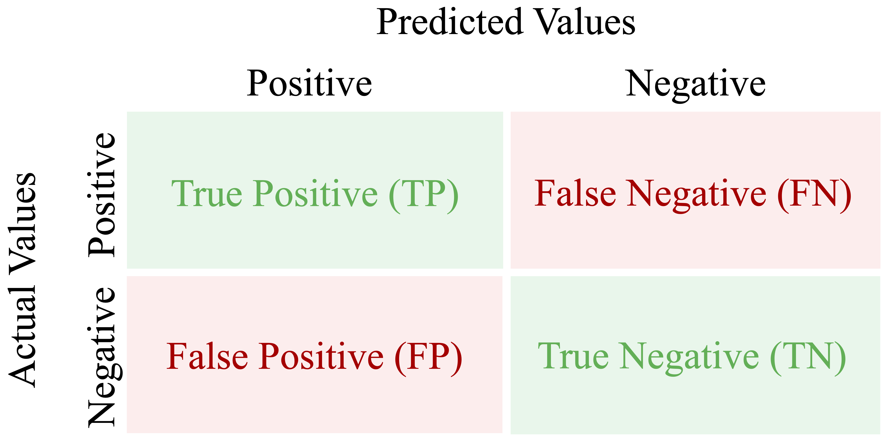
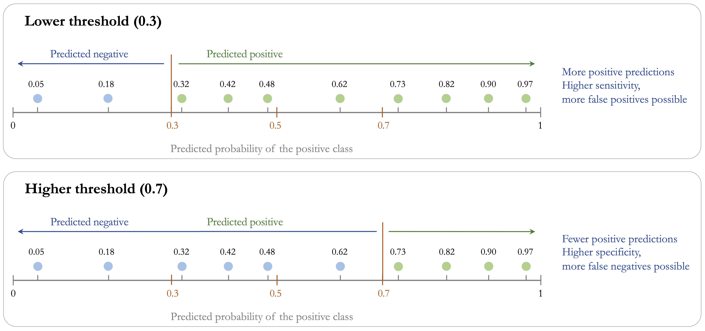
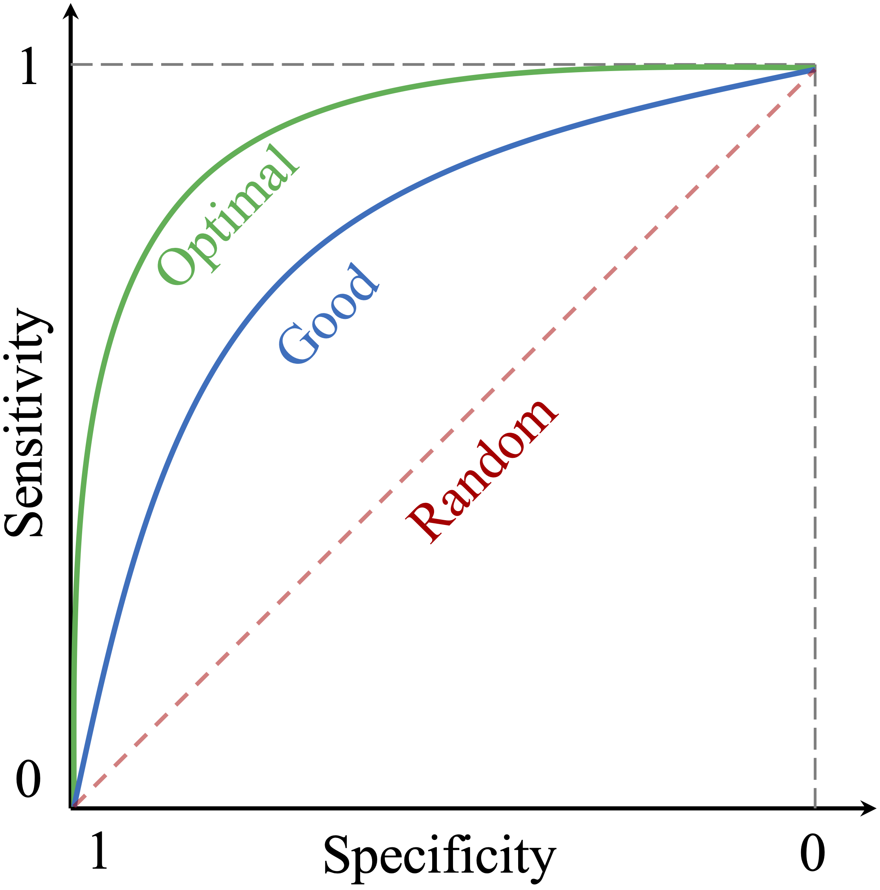
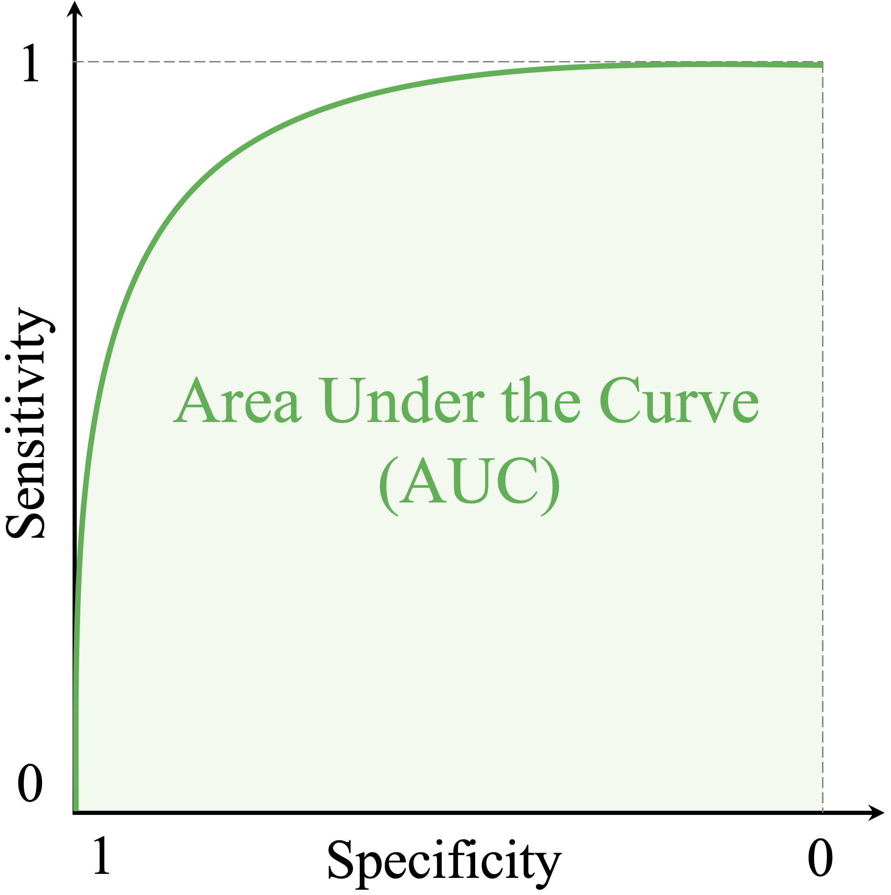
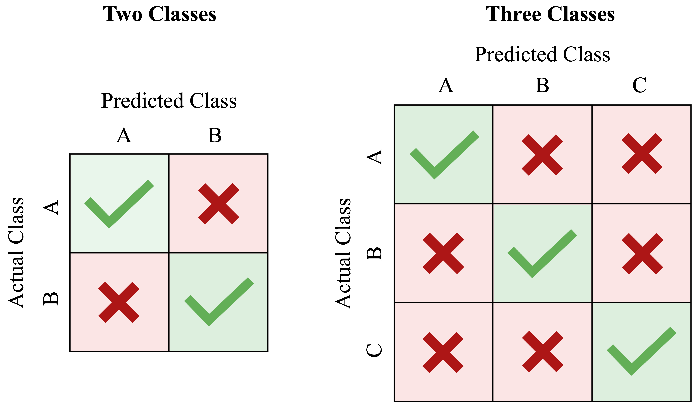

```{r echo=FALSE, message=FALSE, warning=FALSE}
source("_common.R")
```

# Model Evaluation and Performance Assessment {#sec-ch8-evaluation}

::: {.content-visible when-format="pdf"}
\begin{chapterquote}
All models are wrong, but some are useful.

\hfill — George Box
\end{chapterquote}
:::

::::: {.content-visible when-format="html"}
:::: chapterquote
All models are wrong, but some are useful.

::: author
— George Box
:::
::::
:::::

How can we determine whether a machine learning model is genuinely effective? Is 95 percent accuracy always impressive, or can it conceal important weaknesses? How should we weigh the benefits of detecting true cases against the costs of false alarms? These questions lie at the core of model evaluation.

The quote that opens this chapter captures a central idea in predictive modeling: the goal is not to find a perfect model, but to determine whether a model is useful for the task at hand. A fitted model becomes valuable only when we assess how well it performs on new data and whether that performance aligns with the aims of the analysis. In practice, model evaluation depends on the metrics we choose, the classification threshold we apply, and the relative costs of different types of errors.

In the previous chapter, we introduced k-Nearest Neighbors (kNN) and applied it to the `churn` dataset. We examined how feature scaling and the choice of $k$ affect the model’s predictions. We now take the next step by asking how those predictions should be evaluated. This chapter focuses on the *Model Evaluation* phase of the Data Science Workflow introduced in Chapter [-@sec-ch2-intro-data-science] and illustrated in @fig-ch2_DSW. Once a model has been prepared and fitted, we must determine whether it generalises well to unseen data.

A model that appears strong during development may still perform poorly in practice, especially when the classes are imbalanced or when false positives and false negatives carry different consequences. For this reason, model evaluation must go beyond a single summary measure. We need to examine whether the model detects the cases that matter most, how it behaves under class imbalance, and what kinds of errors it makes. These considerations motivate the evaluation tools introduced in this chapter.

### What This Chapter Covers {.unnumbered .unlisted}

In Chapter [-@sec-ch6-data-setup], we considered the design of model evaluation, including partitioning strategies, validation, and data leakage. Here, the emphasis shifts to *performance metrics*: how we assess model quality once predictions have been produced.

We begin with binary classification, where the confusion matrix provides the foundation for metrics such as accuracy, balanced accuracy, sensitivity, specificity, precision, recall, and the F1-score. We then examine how evaluation changes when models return predicted probabilities rather than only class labels, introducing classification thresholds as well as curve-based tools such as ROC curves and precision-recall (PR) curves.

The chapter then considers summary measures for these curves, including ROC-AUC and AUC-PR, before briefly extending the discussion to multi-class classification, where performance must be summarized across more than two outcome categories. Finally, we turn to regression, where evaluation depends not on class labels but on the size of the prediction errors, using measures such as MSE, RMSE, MAE, and $R^2$. We begin with the confusion matrix as the foundational tool for evaluating binary classification outcomes.

## Confusion Matrix {#sec-ch8-confusion-matrix}

How can we determine where a classification model performs well and where it falls short? The confusion matrix provides a clear and systematic answer. It is one of the most widely used tools for evaluating classification models because it records how often predicted class labels agree with the observed labels and how often they do not.

In binary classification, one class is designated as the *positive class*, usually representing the event of primary interest, while the other is treated as the *negative class*. For example, in fraud detection, fraudulent transactions are treated as positive and legitimate transactions as negative. Because the interpretation of several evaluation metrics depends on this choice, it is important to state the positive class explicitly.

Figure [-@fig-ch8-confusion-matrix] shows the structure of a confusion matrix. The rows correspond to the *actual* class labels, and the columns represent the *predicted* labels. Each cell records one of four possible outcomes. *True positives (TP)* occur when the model correctly predicts the positive class. *False positives (FP)* occur when the model incorrectly predicts the positive class. *True negatives (TN)* are correct predictions of the negative class, while *false negatives (FN)* occur when the model fails to identify a positive case.

```{r fig-ch8-confusion-matrix, echo = FALSE, out.width = "60%", fig.cap = "Confusion matrix for binary classification, summarizing correct and incorrect predictions based on whether the actual class is positive or negative."}

```

This structure parallels the ideas of *Type I* and *Type II errors* introduced in Chapter [-@sec-ch5-statistics]. The diagonal entries (TP and TN) represent correct predictions, whereas the off-diagonal entries (FP and FN) represent misclassifications.

The confusion matrix is also the starting point for several important evaluation measures. Two of the most general are *accuracy* and *error rate*. Accuracy measures the proportion of correct predictions:
$$
\text{Accuracy} = \frac{\text{TP} + \text{TN}}{\text{TP} + \text{FP} + \text{FN} + \text{TN}}.
$$

The error rate measures the proportion of incorrect predictions:
$$
\text{Error Rate} = 1 - \text{Accuracy} = \frac{\text{FP} + \text{FN}}{\text{TP} + \text{FP} + \text{FN} + \text{TN}}.
$$

Although accuracy is easy to interpret, it is not always sufficient. In imbalanced settings, a model can achieve high accuracy while performing poorly on the class that matters most. For this reason, the confusion matrix is especially valuable: it shows not only how often the model is correct overall, but also what kinds of errors it makes.

In R, we can compute a confusion matrix using the `conf.mat()` function from the **liver** package. The package also provides `conf.mat.plot()` for visualizing the result. To illustrate this, we return to the kNN model from the churn case study in Section [-@sec-ch7-knn-churn] and evaluate its predictions on the test set.

```{r echo=FALSE}
library(liver)

data(churn)

# Train/test split
set.seed(42) 
splits = partition(data = churn, ratio = c(0.8, 0.2))

train_set = splits$part1
test_set  = splits$part2
test_labels = test_set$churn

# Imputation for NA values
# Treat "unknown" as missing
train_set[train_set == "unknown"] <- NA
test_set[test_set == "unknown"] <- NA

# Training-derived modes
mode_education = names(sort(table(train_set$education, useNA = "no"), decreasing = TRUE))[1]
mode_income    = names(sort(table(train_set$income,    useNA = "no"), decreasing = TRUE))[1]
mode_marital   = names(sort(table(train_set$marital,   useNA = "no"), decreasing = TRUE))[1]

# Apply to the training set
train_set$education[is.na(train_set$education)] = mode_education
train_set$income[is.na(train_set$income)]       = mode_income
train_set$marital[is.na(train_set$marital)]     = mode_marital

# Apply to the test set using the same training-derived modes
test_set$education[is.na(test_set$education)] = mode_education
test_set$income[is.na(test_set$income)]       = mode_income
test_set$marital[is.na(test_set$marital)]     = mode_marital

train_set = droplevels(train_set)
test_set  = droplevels(test_set)

# Encoding categorical features
income_levels = c("<40K", "40K-60K", "60K-80K", "80K-120K", ">120K")
income_values = c(20, 50, 70, 100, 140)

train_set$income_rank = as.numeric(factor(train_set$income, levels = income_levels, labels = income_values))
test_set$income_rank = as.numeric(factor(test_set$income, levels = income_levels, labels = income_values))

categorical_features = c("gender", "education", "marital", "card_category")

train_onehot = one.hot(train_set, cols = categorical_features)
test_onehot  = one.hot(test_set,  cols = categorical_features)

# Scale numeric features using min-max scaling
numeric_features = c("age", "dependent_count", "months_on_book", "relationship_count", "months_inactive", "contacts_count_12", "credit_limit", "revolving_balance", "transaction_amount_12", "transaction_count_12", "ratio_amount_Q4_Q1", "ratio_count_Q4_Q1", "income_rank")

min_train = sapply(train_set[, numeric_features], min)  
max_train = sapply(train_set[, numeric_features], max)   

train_scaled = minmax(train_onehot, col = numeric_features, min = min_train, max = max_train)
test_scaled  = minmax(test_onehot,  col = numeric_features, min = min_train, max = max_train)

# Apply kNN model
formula_knn = churn ~ gender_female + age + income_rank + education_uneducated +
  education_highschool + education_college + education_graduate +
  `education_post-graduate` + marital_married + marital_single +
  card_category_blue + card_category_silver + card_category_gold +
  dependent_count + months_on_book + relationship_count +
  months_inactive + contacts_count_12 + credit_limit +
  revolving_balance + transaction_amount_12 +
  transaction_count_12 + ratio_amount_Q4_Q1 + ratio_count_Q4_Q1

kNN_predict = kNN(
  formula = formula_knn,
  train = train_scaled,
  test = test_scaled,
  k = 7
)
```

```{r}
conf.mat(pred = kNN_predict, actual = test_labels, reference = "yes")
```

In this function call, `pred` contains the predicted class labels, `actual` contains the observed labels, and `reference = "yes"` identifies churn as the positive class. The `cutoff` argument is used only when the predictions are probabilities, so it is not needed here.

```{r echo=FALSE}
conf_max_knn_churn = conf.mat(pred = kNN_predict, actual = test_labels, reference = "yes")
```

The resulting confusion matrix shows that the model correctly identified `r conf_max_knn_churn[1, 1]` churners (*true positives*) and `r conf_max_knn_churn[2, 2]` non-churners (*true negatives*). At the same time, it incorrectly predicted that `r conf_max_knn_churn[2, 1]` non-churners would churn (*false positives*) and failed to identify `r conf_max_knn_churn[1, 2]` actual churners (*false negatives*).

We can also visualize the confusion matrix:

```{r, out.width = "30%"}
conf.mat.plot(pred = kNN_predict, actual = test_labels, reference = "yes")
```

This plot provides a compact visual summary of the model’s correct and incorrect predictions. From the confusion matrix, we can now compute the accuracy and error rate:
$$
\text{Accuracy} = \frac{`r conf_max_knn_churn[1, 1]` + `r conf_max_knn_churn[2, 2]`}{`r sum(conf_max_knn_churn)`} = `r round((conf_max_knn_churn[1, 1] + conf_max_knn_churn[2, 2]) / sum(conf_max_knn_churn), 3)`,
$$

$$
\text{Error Rate} = \frac{`r conf_max_knn_churn[2, 1]` + `r conf_max_knn_churn[1, 2]`}{`r sum(conf_max_knn_churn)`} = `r round((conf_max_knn_churn[2, 1] + conf_max_knn_churn[1, 2]) / sum(conf_max_knn_churn), 3)`.
$$

Thus, the model correctly classified `r round((conf_max_knn_churn[1, 1] + conf_max_knn_churn[2, 2]) / sum(conf_max_knn_churn), 3) * 100`% of cases and misclassified `r round((conf_max_knn_churn[2, 1] + conf_max_knn_churn[1, 2]) / sum(conf_max_knn_churn), 3) * 100`% of cases.

> *Practice:* Follow the steps from Section [-@sec-ch7-knn-churn] and repeat the kNN classification using $k = 2$ instead of $k = 7$. Compare the resulting confusion matrix with the one reported above. Which error type increases? Does the model identify more churners, or fewer? How does this affect the accuracy and the error rate?

Accuracy and error rate provide only a broad summary of performance. To evaluate how well a classifier identifies positive cases and avoids false alarms, we need more specific measures. In the next section, we therefore introduce *sensitivity*, *specificity*, *precision*, and *recall*.


## Sensitivity and Specificity

Accuracy summarizes overall performance, but it does not show whether a model performs equally well on the positive and negative classes. In many applications, this distinction matters. A classifier may appear successful overall while still missing many of the cases we care most about or producing too many false alarms. Sensitivity and specificity address this limitation by separating performance on the positive and negative classes.

Sensitivity focuses on the model’s ability to correctly identify positive cases, whereas specificity focuses on its ability to correctly identify negative cases. Together, they provide a more informative view of classification performance, especially when the classes are imbalanced or when false positives and false negatives carry different practical consequences.

### Sensitivity {.unnumbered .unlisted}

*Sensitivity* measures how well a model identifies *positive* cases. It answers the question: *Out of all actual positives, how many did the model correctly predict?* Sensitivity is also called *recall* and is particularly important when missing a positive case is costly, such as in fraud detection or medical screening. It is defined as
$$
\text{Sensitivity} = \frac{\text{TP}}{\text{TP} + \text{FN}}.
$$

In the churn example, the positive class is `churn = yes`, so sensitivity measures the proportion of actual churners that the kNN model correctly identifies. Using the confusion matrix from Section [-@sec-ch8-confusion-matrix], we obtain
$$
\text{Sensitivity} =
\frac{`r conf_max_knn_churn[1, 1]`}
     {`r conf_max_knn_churn[1, 1]` + `r conf_max_knn_churn[1, 2]`}
= `r round(conf_max_knn_churn[1, 1] / (conf_max_knn_churn[1, 1] + conf_max_knn_churn[1, 2]), 3)`.
$$

This means that the model correctly identifies `r round(conf_max_knn_churn[1, 1] / (conf_max_knn_churn[1, 1] + conf_max_knn_churn[1, 2]), 3) * 100` percent of customers who actually churn.

A model with very high sensitivity misses few positive cases, but this does not necessarily mean that it performs well overall. A classifier can achieve perfect sensitivity simply by labeling every observation as positive. Sensitivity must therefore be interpreted together with other evaluation measures.

### Specificity {.unnumbered .unlisted}

*Specificity* measures how well a model identifies *negative* cases. It answers the question: *Out of all actual negatives, how many did the model correctly predict?* Specificity is especially important when false positives are costly. In spam filtering, for example, low specificity means that many legitimate emails are incorrectly flagged as spam. Its formula is
$$
\text{Specificity} = \frac{\text{TN}}{\text{TN} + \text{FP}}.
$$

In the churn example, specificity measures the proportion of customers who did *not* churn and were correctly classified as non-churners. Using the confusion matrix from Section [-@sec-ch8-confusion-matrix], we obtain
$$
\text{Specificity} =
\frac{`r conf_max_knn_churn[2, 2]`}
     {`r conf_max_knn_churn[2, 2]` + `r conf_max_knn_churn[2, 1]`}
= `r round(conf_max_knn_churn[2, 2] / (conf_max_knn_churn[2, 2] + conf_max_knn_churn[2, 1]), 3)`.
$$

This means that the model correctly identifies `r round(conf_max_knn_churn[2, 2] / (conf_max_knn_churn[2, 2] + conf_max_knn_churn[2, 1]), 3) * 100` percent of customers who remain with the company. In other words, specificity tells us how well the model avoids falsely flagging non-churners as churners.

> *Practice:* Repeat the kNN classification from Section [-@sec-ch7-knn-churn] using $k = 2$ instead of $k = 7$. Compute the resulting confusion matrix, then calculate sensitivity and specificity. Compare these values with those obtained here. Which metric changes more, and what does that suggest about the trade-off between detecting churners and avoiding false alarms?

## Precision, Recall, and F1-Score

Sensitivity and specificity distinguish performance on the positive and negative classes. Precision and recall shift the focus more directly to *positive predictions*. In particular, they answer two different questions: *How many actual positives did the model find?* and *How trustworthy are its positive predictions?* These questions are especially important in imbalanced settings, where the positive class is rare and overall accuracy can be misleading.

*Precision*, also called the *positive predictive value*, measures how many predicted positives are actually positive. It answers the question: *When the model predicts a positive case, how often is it correct?* Precision is defined as
$$
\text{Precision} = \frac{\text{TP}}{\text{TP} + \text{FP}}.
$$
Precision is especially important when false positives are costly. In fraud detection, for example, incorrectly flagging legitimate transactions may inconvenience customers and trigger unnecessary investigation.

*Recall* is another name for *sensitivity*. It measures how many actual positive cases the model successfully identifies. It answers the question: *Out of all actual positives, how many did the model correctly predict?* It is defined as
$$
\text{Recall} = \frac{\text{TP}}{\text{TP} + \text{FN}}.
$$
Recall becomes especially important when false negatives are costly, as in medical screening or fraud detection. While the term *sensitivity* is common in biomedical settings, *recall* is more common in machine learning and information retrieval.

Precision and recall therefore capture different aspects of performance. High precision means that positive predictions are trustworthy, whereas high recall means that few positive cases are missed. In practice, improving one often reduces the other. A more conservative model may achieve higher precision by making fewer positive predictions, but this can lower recall by missing more true positives. A more aggressive model may achieve higher recall, but at the cost of more false positives and therefore lower precision.

To summarize this trade-off, we often use the *F1-score*, which is the harmonic mean of precision and recall:
$$
F1 = 2 \times \frac{\text{Precision} \times \text{Recall}}{\text{Precision} + \text{Recall}} = \frac{2 \times \text{TP}}{2 \times \text{TP} + \text{FP} + \text{FN}}.
$$
The F1-score is useful when precision and recall are both important and we want a single summary measure. However, it ignores true negatives, so it is not universally appropriate and should not automatically replace other evaluation metrics.

Using the kNN model from Section [-@sec-ch8-confusion-matrix], which predicts whether a customer will churn (`churn = yes`), we can compute these quantities directly from the confusion matrix.

*Precision* measures how often the model’s churn predictions are correct:
$$
\text{Precision} =
\frac{\text{TP}}{\text{TP} + \text{FP}} =
\frac{`r conf_max_knn_churn[1, 1]`}{`r conf_max_knn_churn[1, 1]` + `r conf_max_knn_churn[2, 1]`} =
`r round(conf_max_knn_churn[1, 1] / (conf_max_knn_churn[1, 1] + conf_max_knn_churn[2, 1]), 3)`.
$$
This means that `r round(conf_max_knn_churn[1, 1] / (conf_max_knn_churn[1, 1] + conf_max_knn_churn[2, 1]), 3) * 100`% of customers predicted to churn actually do so.

*Recall* measures how many actual churners are correctly identified:
$$
\text{Recall} =
\frac{\text{TP}}{\text{TP} + \text{FN}} =
\frac{`r conf_max_knn_churn[1, 1]`}{`r conf_max_knn_churn[1, 1]` + `r conf_max_knn_churn[1, 2]`} =
`r round(conf_max_knn_churn[1, 1] / (conf_max_knn_churn[1, 1] + conf_max_knn_churn[1, 2]), 3)`.
$$
Thus, the model identifies `r round(conf_max_knn_churn[1, 1] / (conf_max_knn_churn[1, 1] + conf_max_knn_churn[1, 2]), 3) * 100`% of customers who actually churn.

The *F1-score* combines these two perspectives into a single measure:
$$
F1 =
\frac{2 \times `r conf_max_knn_churn[1, 1]`}{2 \times `r conf_max_knn_churn[1, 1]` + `r conf_max_knn_churn[2, 1]` + `r conf_max_knn_churn[1, 2]`} =
`r round(2 * conf_max_knn_churn[1, 1] / (2 * conf_max_knn_churn[1, 1] + conf_max_knn_churn[2, 1] + conf_max_knn_churn[1, 2]), 3)`.
$$
This value summarizes how well the model balances finding churners and avoiding incorrect positive predictions.

> *Practice:* Repeat the kNN classification from Section [-@sec-ch7-knn-churn] using $k = 2$ instead of $k = 7$. Compute the resulting confusion matrix, then calculate precision, recall, and the F1-score. Compare these values with those obtained here. Which metric changes more, and what does that suggest about the trade-off between finding churners and avoiding false positive predictions?

In the next section, we turn to evaluation tools that assess classification performance across a range of thresholds rather than at a single cutoff. This leads us to the ROC curve and the Area Under the Curve (AUC).

## Classification Thresholds and Decision Rules {#sec-ch8-taking-uncertainty}

Many classification models can return *predicted probabilities* rather than only hard class labels. For example, a model may assign a probability of 0.72 that a patient has a rare disease or a probability of 0.68 that a customer will churn. These probability estimates contain more information than a simple yes/no prediction, because they indicate how strongly the model favors one class over the other.

To convert probabilities into class labels, we must choose a *classification threshold*. A threshold of 0.5 is common: observations with predicted probability above 0.5 are assigned to the positive class, whereas those below 0.5 are assigned to the negative class. This threshold, however, is not determined by the model itself. It is a decision rule chosen by the analyst, and different thresholds can lead to very different classification results.

Figure [-@fig-ch8-threshold] illustrates this idea. Lowering the threshold causes more observations to be classified as positive, whereas raising the threshold makes the classifier more conservative.

```{r fig-ch8-threshold, echo = FALSE, out.width = "100%", fig.cap = "Illustration of how the classification threshold determines predicted class labels. Lower thresholds classify more observations as positive, which typically increases sensitivity but may also increase false positives. Higher thresholds classify fewer observations as positive, which typically increases specificity but may also increase false negatives."}

```

Changing the threshold changes the confusion matrix and therefore also changes metrics such as sensitivity, specificity, precision, and recall. Lowering the threshold typically produces more positive predictions. This can increase sensitivity because more actual positives are identified, but it often also increases the number of false positives. Raising the threshold usually has the opposite effect: the classifier becomes more conservative, which may improve specificity but at the cost of missing more positive cases. The most appropriate threshold therefore depends on the application and on the relative costs of false positives and false negatives.

To illustrate this idea, we return to the kNN model from Section [-@sec-ch8-confusion-matrix], which predicts customer churn (`churn = yes`). By specifying `type = "prob"` in the `kNN()` function, we obtain predicted probabilities rather than hard class labels:

```{r}
kNN_prob = kNN(
  formula = formula_knn, 
  train = train_scaled, 
  test = test_scaled, 
  k = 7,
  type = "prob"
)

round(kNN_prob[1:6, ], 2)
```

The object `kNN_prob` is a two-column matrix of class probabilities. The first column gives the estimated probability of the positive class (`churn = yes`), and the second column gives the estimated probability of the negative class (`churn = no`). For example, the first entry in the positive-class column is `r round(kNN_prob[1, 1], 2)`, meaning that the model assigns this customer a `r round(kNN_prob[1, 1] * 100, 2)` percent probability of churning.

We can now apply different thresholds to these probabilities and examine how the resulting confusion matrix changes. Using the `cutoff` argument in `conf.mat()`, we compare two thresholds:

```{r}
conf.mat(kNN_prob[, "yes"], test_labels, reference = "yes", cutoff = 0.5)

conf.mat(kNN_prob[, "yes"], test_labels, reference = "yes", cutoff = 0.7)
```

A threshold of 0.5 classifies more observations as potential churners than a threshold of 0.7. As a result, it typically yields higher sensitivity but also more false positives. By contrast, a stricter threshold such as 0.7 requires stronger evidence before predicting churn, which often increases specificity but may miss more actual churners. In this way, threshold choice directly shapes the balance between detecting positives and avoiding false alarms.

> *Practice:* Using the predicted probabilities from the kNN model, compute confusion matrices for thresholds such as 0.3 and 0.8. Then calculate the corresponding sensitivity and specificity values. How do these measures change as the threshold increases? Which thresholds prioritize detecting churners, and which prioritize avoiding false positives?

Choosing a threshold allows us to tailor classification decisions to the practical goals of the problem. However, any single threshold gives only one view of model performance. To understand how a classifier behaves across *all* possible thresholds, we need tools that summarize this full range of trade-offs. The next section introduces the ROC curve and the Area Under the Curve (AUC) for that purpose.


## Receiver Operating Characteristic (ROC) Curve

When a classifier returns predicted probabilities, its performance changes as the classification threshold changes. A lower threshold usually identifies more positive cases, whereas a higher threshold is more conservative. To examine model performance across *all* possible thresholds, we use the *Receiver Operating Characteristic (ROC) curve*.

The ROC curve plots the *true positive rate* (sensitivity) on the vertical axis against the *false positive rate* ($1-\text{specificity}$) on the horizontal axis. Each point on the curve corresponds to a different classification threshold. A curve closer to the top-left corner indicates stronger ability to distinguish positive cases from negative ones, whereas a curve near the diagonal indicates little discriminatory power beyond random guessing.

It is important to interpret the ROC curve correctly. The ROC curve is primarily a *discrimination tool*: it shows how well a model ranks positive cases above negative cases across thresholds. It does *not* by itself determine which threshold is best for a particular application. Choosing an operating threshold still depends on the relative costs of false positives and false negatives in the real decision problem.

Figure @fig-roc-curve provides a conceptual illustration of ROC behavior. Curves that bend more strongly toward the top-left corner reflect better separation between the classes, whereas the diagonal line represents random performance.

```{r fig-roc-curve, echo = FALSE, out.width = "55%", fig.cap = "Conceptual illustration of ROC curves. Curves closer to the top-left corner indicate stronger discrimination between the positive and negative classes, whereas the diagonal line represents random guessing."}

```

To construct an ROC curve in practice, we need predicted probabilities for the positive class and the observed class labels. We continue with the kNN model from Section [-@sec-ch8-taking-uncertainty], using the predicted probabilities for `churn = yes`. The **pROC** package in R provides functions for computing and visualizing ROC curves.

```{r}
library(pROC)

roc_knn = roc(response = test_labels, predictor = kNN_prob[, "yes"])
```

We can then visualize the ROC curve using `ggroc()`:

```{r}
ggroc(roc_knn) +
  ggtitle("ROC Curve for the kNN Model on the churn Data")
```

This data-based ROC curve shows how the kNN model’s sensitivity and false positive rate change across thresholds. If the curve lies well above the diagonal, the model has useful discriminatory ability. If it remains close to the diagonal, the model does little better than random guessing. ROC curves are therefore especially helpful when comparing competing classifiers on their ability to separate the two classes.

At the same time, ROC analysis should be interpreted with some caution in highly imbalanced settings. Because the false positive rate is calculated relative to the number of actual negatives, ROC curves can sometimes appear more favorable than the practical decision problem would suggest. For this reason, it is often useful to consider complementary views of model performance as well.

> *Practice:* Repeat the kNN classification from Section [-@sec-ch7-knn-churn] using $k = 2$ and obtain the predicted probabilities for `churn = yes`. Construct the ROC curve using `roc()` and `ggroc()`. How does the ROC curve for $k = 2$ compare with the curve obtained here for $k = 7$? Which model appears to have stronger discriminatory ability?

The ROC curve is one way to summarize classifier behavior across thresholds. In the next section, we introduce the *precision-recall (PR) curve*, which provides a complementary perspective by focusing more directly on the quality of positive predictions.

## Precision-Recall (PR) Curve

While the ROC curve evaluates how well a classifier separates the positive and negative classes across thresholds, it does not focus directly on the quality of the model’s positive predictions. In many applications, especially when the positive class is rare, this is precisely the issue of greatest interest. In such settings, the *precision-recall (PR) curve* provides a useful complementary view.

The PR curve plots *precision* on the vertical axis against *recall* on the horizontal axis as the classification threshold varies. Each point on the curve therefore reflects a different balance between how many positive cases are found and how trustworthy the resulting positive predictions are. A curve that remains high across a broad range of recall values indicates stronger performance, whereas a curve that drops quickly suggests that improving recall comes at the cost of many false positive predictions.

Unlike the ROC curve, which uses the false positive rate on the horizontal axis, the PR curve focuses entirely on performance for the positive class. For this reason, it is often more informative in highly imbalanced problems, where the main goal is to identify rare positive cases accurately rather than to summarize performance across the majority class.

To illustrate this idea, we again use the kNN model from Section [-@sec-ch8-taking-uncertainty], based on the predicted probabilities for `churn = yes`. In R, the **PRROC** package can be used to construct a precision-recall curve:

```{r}
library(PRROC)

pr_knn = pr.curve(
  scores.class0 = kNN_prob[, "yes"],
  weights.class0 = test_labels == "yes",
  curve = TRUE
)
```

We can then visualize the precision-recall curve:

```{r}
plot(pr_knn, main = "Precision-Recall Curve for kNN Model on churn Data")
```

This curve shows how precision changes as recall increases. If precision remains relatively high even at larger recall values, the model is able to identify many churners without generating too many false positive predictions. If precision drops sharply, the model may still find many churners, but only by incorrectly labeling many non-churners as churners.

> *Practice:* Using the predicted probabilities from the kNN model, construct the precision-recall curve for $k = 2$ and compare it with the curve obtained here for $k = 7$. Which model appears to provide a better balance between finding churners and keeping positive predictions trustworthy?

Like the ROC curve, the PR curve summarizes model behavior across thresholds rather than at a single cutoff. In the next section, we consider how such curves can be summarized numerically through the Area Under the Curve (AUC).

## Area Under the Curve: ROC-AUC and AUC-PR

Both the ROC curve and the precision-recall curve can be summarized with a single number: the *area under the curve* (AUC). In practice, the term *AUC* often refers to the area under the ROC curve, but it is helpful to distinguish this explicitly from the *area under the precision-recall curve* (AUC-PR). These summaries provide compact ways to compare models across thresholds, but they do not answer exactly the same question.

For the ROC curve, the AUC measures how well the model discriminates between the positive and negative classes across all possible thresholds. Geometrically, it is the area under the ROC curve. An intuitive interpretation is that ROC-AUC can be viewed as the probability that a randomly chosen positive case receives a higher score than a randomly chosen negative case. Larger values therefore indicate stronger *discriminatory ability*. A value of 1 indicates perfect discrimination, whereas a value of 0.5 corresponds to random guessing.

```{r fig-ch8-auc, echo = FALSE, out.width = "45%", fig.cap = "The AUC summarizes the ROC curve into a single number that reflects the model’s ability to discriminate between the positive and negative classes across thresholds. AUC = 1 indicates perfect discrimination, whereas AUC = 0.5 corresponds to random guessing."}

```

As shown in @fig-ch8-auc, ROC-AUC values range from 0 to 1. Values closer to 1 indicate better separation between the classes. Although uncommon, an AUC below 0.5 can occur when the model systematically ranks negative cases above positive ones, for example because the class labels have been reversed or the predicted scores are inverted. In such cases, reversing the scoring direction would produce an AUC above 0.5.

To compute ROC-AUC in R, we use the `auc()` function from the **pROC** package. This function takes an ROC object, such as the one created earlier using `roc()`, and returns a numeric value:

```{r}
auc(roc_knn)
```

Here, `roc_knn` is the ROC object based on predicted probabilities for `churn = yes`. For the kNN model, the ROC-AUC is `r round(auc(roc_knn), 3)`. This suggests that the model has reasonably good ability to rank churners above non-churners when performance is considered across thresholds.

The PR curve can also be summarized numerically. In the **PRROC** package, the area under the precision-recall curve is stored in the `auc.integral` component of the PR object:

```{r}
pr_knn$auc.integral
```

Whereas ROC-AUC emphasizes overall discrimination between the two classes, AUC-PR focuses more directly on the relationship between *precision* and *recall* for the positive class. For this reason, AUC-PR is often especially informative when the positive class is rare and the main interest lies in identifying that class accurately. Unlike ROC-AUC, however, AUC-PR does not have a universal baseline such as 0.5, because its reference level depends on the prevalence of the positive class.

AUC is useful, but it should be interpreted with care. First, both ROC-AUC and AUC-PR summarize *ranking behavior across thresholds*, not *calibration*. A model can achieve a high AUC even if its predicted probabilities are poorly calibrated. Second, these summaries do not tell us whether performance is good at the specific threshold that will actually be used in practice. A model may have a strong AUC overall while still performing unsatisfactorily at the operating threshold chosen for decision-making.

> *Practice:* Using the ROC and PR objects you constructed earlier for the kNN model with $k = 2$, compute both ROC-AUC and AUC-PR. Compare these values with the corresponding results for $k = 7$. Do the two summaries lead to the same conclusion about which model performs better?

AUC is therefore best viewed as a compact summary of model behavior across thresholds, especially when comparing competing classifiers. ROC-AUC and AUC-PR are complementary rather than interchangeable: the first emphasizes overall discrimination, whereas the second emphasizes performance for the positive class. In the next section, we extend these ideas to *multi-class classification*, where evaluation requires new strategies to accommodate more than two outcome categories.


## Metrics for Multi-Class Classification

So far, we have focused on binary classification, where the outcome has only two classes. Many practical problems, however, involve *three or more* categories. Examples include classifying tumor subtypes, identifying modes of transportation, or assigning products to retail categories. In such settings, the main ideas of model evaluation still apply, but they must be extended to account for multiple classes.

In a multi-class problem, the confusion matrix becomes a square matrix whose size matches the number of classes. Rows correspond to the actual classes and columns to the predicted classes, as shown in @fig-ch8-confusion-matrices. Correct predictions appear along the diagonal, whereas off-diagonal entries show which classes are being confused with one another. This is often one of the most informative diagnostic tools in multi-class classification, because it reveals not only how often the model is wrong, but also *how* it is wrong.

```{r fig-ch8-confusion-matrices, echo = FALSE, out.width = "70%", fig.cap = "Confusion matrices for binary (left) and multi-class (right) classification. Diagonal cells show correct predictions, whereas off-diagonal cells show misclassifications. As the number of classes increases, the matrix expands accordingly."}

```

To extend metrics such as precision, recall, and the F1-score to multi-class settings, we usually adopt a *one-vs-all* (or *one-vs-rest*) approach. Each class is treated in turn as the positive class, while all remaining classes are grouped together as the negative class. This produces a separate precision, recall, and F1-score for each class and helps identify which classes are easier or harder for the model to distinguish.

To make this idea concrete, consider the following simple three-class confusion matrix:
$$
\begin{array}{c|ccc}
& \text{Pred A} & \text{Pred B} & \text{Pred C} \\
\hline
\text{Actual A} & 18 & 2 & 1 \\
\text{Actual B} & 3 & 14 & 2 \\
\text{Actual C} & 1 & 4 & 15
\end{array}
$$
If we evaluate class A using a one-vs-all approach, the 18 observations in the top-left cell are true positives for class A. The 2 and 1 in the rest of the first row are false negatives, because they are actual A observations predicted as another class. The 3 and 1 in the first column but outside the top-left cell are false positives, because they were predicted as A even though they belong to another class. In this way, familiar binary metrics can still be computed, but now separately for each class.

Because this approach produces multiple values, we often summarize them using an averaging scheme. A *macro-average* gives equal weight to each class by taking the simple mean of the per-class scores. A *micro-average* first aggregates the relevant counts across all classes and then computes the metric, so larger classes have more influence on the result. A *weighted-average* also averages the per-class metrics, but weights each class according to its frequency in the data. The choice among these summaries depends on the goal of the analysis. Macro-averaging is often useful when all classes are equally important, whereas weighted summaries may be more appropriate when class frequencies differ substantially.

Although ROC curves and AUC are originally binary tools, they can be extended to multi-class settings by applying a one-vs-all strategy, producing one ROC curve and one AUC value for each class. In practice, however, interpreting multiple ROC curves can quickly become cumbersome. For this reason, confusion matrices together with macro- or weighted-averaged precision, recall, and F1-scores often provide a clearer summary in introductory multi-class analyses.

The main lesson is that multi-class evaluation should not rely on a single overall number alone. A model may achieve reasonable overall accuracy while still performing poorly on one or more individual classes. Class-specific metrics and the multi-class confusion matrix are therefore often essential for a meaningful assessment. This also reinforces a broader point that will carry into the next section: evaluation must always be adapted to the form of the prediction task. In regression, the target variable is continuous, so performance is assessed not through class labels, but through the size of the prediction errors.

## Evaluation Metrics for Continuous Targets {#sec-ch8-regression-metrics}

Suppose we want to predict a house’s selling price, a patient’s recovery time, or tomorrow’s temperature. These are examples of *regression problems*, where the target variable is numerical (see Chapter [-@sec-ch10-regression]). In such settings, the evaluation measures used for classification no longer apply. Instead of counting how often predictions match the true labels, we must assess *how far* the predicted values deviate from the actual outcomes.

When working with numerical targets, the central question becomes: *How large are the prediction errors, and how should we summarize them?* Regression metrics are based on the difference between an observed value $y_i$ and its prediction $\hat{y}_i$. A good regression model produces predictions that are close to the true values on average, but different metrics summarize this idea in different ways.

To make this concrete, consider a small example with four observations:

$$
\begin{array}{c|cccc}
\text{Actual } (y) & 10 & 15 & 20 & 25 \\
\text{Predicted } (\hat{y}) & 12 & 14 & 18 & 27
\end{array}
$$

The prediction errors are therefore $-2$, $1$, $2$, and $-2$, and the absolute errors are $2$, $1$, $2$, and $2$. These values allow us to see how different regression metrics summarize the same set of prediction mistakes.

One widely used metric is the *Mean Squared Error (MSE)*:
$$
\text{MSE} = \frac{1}{n} \sum_{i=1}^{n} (y_i - \hat{y}_i)^2.
$$
MSE averages the squared prediction errors, so larger errors receive disproportionately greater weight. For the small example above, the squared errors are $4$, $1$, $4$, and $4$, giving
$$
\text{MSE} = \frac{4 + 1 + 4 + 4}{4} = 3.25.
$$
This makes MSE especially useful when large mistakes are particularly undesirable. Its main drawback is that it is expressed in squared units, which makes it less directly interpretable in practice. In R, MSE can be computed using the `mse()` function from the **liver** package.

A closely related metric is the *Root Mean Squared Error (RMSE)*:
$$
\text{RMSE} = \sqrt{\text{MSE}} = \sqrt{\frac{1}{n} \sum_{i=1}^{n} (y_i - \hat{y}_i)^2}.
$$
For the example above,
$$
\text{RMSE} = \sqrt{3.25} \approx 1.80.
$$
Because RMSE is expressed on the same scale as the outcome variable, it is often easier to interpret than MSE. If the response is measured in degrees, euros, or days, then RMSE is expressed in those same units. RMSE is therefore widely used in practice, especially when we want an error measure that still penalizes large deviations more strongly than small ones.

Another common metric is the *Mean Absolute Error (MAE)*:
$$
\text{MAE} = \frac{1}{n} \sum_{i=1}^{n} |y_i - \hat{y}_i|.
$$
MAE measures the average size of the prediction errors without squaring them. In the example above,
$$
\text{MAE} = \frac{2 + 1 + 2 + 2}{4} = 1.75.
$$
Like RMSE, MAE is expressed on the scale of the response variable, which often makes it easy for practitioners to interpret. It is also less sensitive to unusually large errors than MSE or RMSE, since each error contributes proportionally rather than quadratically. In R, it can be computed using the `mae()` function from the **liver** package.

A different type of summary is the *coefficient of determination*, or $R^2$:
$$
R^2 = 1 - \frac{\sum_{i=1}^{n}(y_i - \hat{y}_i)^2}{\sum_{i=1}^{n}(y_i - \bar{y})^2},
$$
where $\bar{y}$ is the mean of the observed values. The quantity $R^2$ measures how much better the model performs relative to a naive baseline that always predicts the sample mean. A value of $R^2 = 1$ indicates perfect prediction, whereas $R^2 = 0$ means that the model performs no better than predicting the mean for every observation. Negative values are also possible when a model performs worse than that baseline.

For the small example above, the mean of the observed values is $\bar{y} = 17.5$. The sum of squared prediction errors is $13$, and the total sum of squares around the mean is $125$, so
$$
R^2 = 1 - \frac{13}{125} = 0.896.
$$
This means that the model explains about 89.6% of the variation in the observed outcomes relative to the mean-prediction baseline.

Unlike MAE and RMSE, $R^2$ is not expressed in the units of the outcome. It does not measure prediction error directly, but instead summarizes explained variation on a relative scale. For this reason, it is often useful when comparing models fitted to the same response variable. However, $R^2$ should be interpreted with caution. A high $R^2$ does not necessarily imply strong predictive performance on new data, and a model with a respectable $R^2$ may still produce prediction errors that are too large for practical use. In applied work, $R^2$ is therefore best interpreted alongside error-based measures such as MAE or RMSE rather than used on its own.

These metrics provide different kinds of information. MSE and RMSE emphasize larger errors because of squaring, whereas MAE summarizes average prediction error more directly. RMSE and MAE are often easier to communicate in practice because they are expressed on the response scale. By contrast, $R^2$ does not measure error directly, but instead summarizes how much variation in the outcome is captured relative to a simple baseline.

The choice of metric depends on the purpose of the analysis. If large prediction errors are especially costly, MSE or RMSE may be preferable. If interpretability and robustness are more important, MAE may be more useful. If the aim is to assess relative explanatory performance, $R^2$ can be informative, but it should not be treated as a complete summary of model quality. Together, these measures provide a more balanced basis for evaluating regression models. We return to these metrics with a more detailed practical example in Section [-@sec-ch10-measuring-fit], where they are used to assess regression model performance in context.

## Chapter Summary and Takeaways

Model evaluation is the step that turns predictions into evidence. A model may appear impressive during development, but its value depends on how well it performs on unseen data and whether that performance is acceptable for the task at hand. For this reason, evaluation is not a final formality: it is the point at which we decide whether a model is genuinely useful.

In this chapter, we introduced tools for evaluating supervised learning models in ways that reflect different predictive goals. For classification, we used the confusion matrix as the starting point for metrics such as accuracy, sensitivity, specificity, precision, recall, F1-score, and balanced accuracy, and we examined how classification thresholds affect their interpretation. We also introduced ROC curves and precision-recall (PR) curves as complementary ways to assess classifier behavior across thresholds, together with ROC-AUC and AUC-PR as compact summary measures. For multi-class problems, we extended these ideas through one-vs-all reasoning and averaging strategies. For regression, we introduced MSE, RMSE, MAE, and $R^2$, emphasizing that these metrics capture different aspects of predictive performance and should be interpreted together rather than in isolation.

This chapter does not include a standalone case study because evaluation is not a separate stage that appears only once, but a recurring part of every modeling analysis. The tools introduced here will therefore reappear throughout the chapters that follow, where they are used in increasingly applied settings for both classification and regression.

A practical takeaway from this chapter is that evaluation should begin with the nature of the prediction task and the consequences of error. We should first identify whether the problem is binary classification, multi-class classification, or regression; then choose metrics that reflect the aims of the analysis; evaluate performance on unseen data; and interpret the results in context rather than relying on any single number in isolation.

## Exercises {#sec-ch8-exercises}

The following exercises reinforce the main ideas of model evaluation introduced in this chapter. They move from conceptual understanding to hands-on classification work with the `bank` dataset, followed by a short regression exercise set using the `house` dataset, and conclude with self-reflection. Together, they are designed to move from calculation and interpretation toward judgment and decision-making.

#### Conceptual Questions {.unnumbered .unlisted}

1. Why is model evaluation essential in machine learning, and why is model fitting alone not sufficient?

2. Explain the difference between evaluating a model on the training data and evaluating it on unseen test data.

3. What information does a confusion matrix provide that overall accuracy does not?

4. Why must the positive class be defined explicitly in binary classification?

5. Explain the difference between sensitivity and specificity. In what kinds of applications would each be especially important?

6. Explain the difference between precision and recall. What different questions do they answer about model performance?

7. Why can accuracy be misleading when classes are imbalanced? Which alternative metrics may be more informative in such settings?

8. What is balanced accuracy, and why can it be preferable to ordinary accuracy in imbalanced classification problems?

9. How does changing the classification threshold affect sensitivity and specificity? How does it affect precision and recall?

10. What does an ROC curve show, and what does the AUC summarize?

11. Why is AUC useful for comparing classifiers, and why does it not by itself determine the best threshold for deployment?

12. In highly imbalanced problems, when might precision-recall analysis be more informative than ROC analysis?

13. How are precision, recall, and F1-score extended to multi-class classification using a one-vs-all approach?

14. Compare MSE, RMSE, MAE, and $R^2$. Which of these are measured on the scale of the response, and which are not?

15. Why should $R^2$ not be used as the sole measure of regression performance?

16. Consider a fraud detection system in which false negatives are much more costly than false positives. How should this influence threshold choice and metric selection?

17. Imagine presenting two models to a decision-maker: one with higher accuracy and one with higher recall. How would you explain the trade-off in a way that supports a sound decision?

#### Hands-On Practice: Classification Evaluation with the `bank` Dataset {.unnumbered .unlisted}

For the following exercises, use the `bank` dataset from the **liver** package. The target variable is `deposit`, which indicates whether a customer subscribed to a term deposit.

18. Load the `bank` dataset and identify the response variable and the predictor variables.

19. Examine the distribution of the target variable `deposit`. Is the dataset class-imbalanced? Briefly interpret what this might imply for model evaluation.

20. Partition the data into training and test sets using an 80/20 split. Compare the class distribution of `deposit` in the two sets and comment on whether the split appears reasonable.

21. Prepare the predictors for kNN by applying one-hot encoding to categorical variables and scaling numerical variables. Briefly explain why these preprocessing steps are especially important for distance-based classification.

22. Train a kNN classifier on the training set using $k = 7$, and obtain predictions for the test set.

23. Construct the confusion matrix for the test-set predictions and interpret the main pattern of results in words.

24. Compute accuracy, balanced accuracy, sensitivity, specificity, precision, recall, and F1-score for the model.

25. Based on these metrics, write a short paragraph evaluating the classifier. Which aspects of performance appear strong, and which appear weaker?

26. Use `conf.mat.plot()` to visualize the confusion matrix. Does the visual impression align with your numerical interpretation?

27. Obtain predicted probabilities for the positive class and compute confusion matrices for at least three thresholds, such as 0.3, 0.5, and 0.7.

28. For each threshold, calculate sensitivity, specificity, precision, and balanced accuracy. Summarize the results in a small table.

29. Explain how and why the metrics change as the threshold increases. Which threshold appears most appropriate if the bank wants to identify as many likely subscribers as possible? Which threshold appears most appropriate if the bank wants to avoid wasting effort on unlikely subscribers?

30. Construct the ROC curve for the kNN model and compute the AUC. What does the ROC curve suggest about the model’s ability to discriminate between subscribers and non-subscribers?

31. If you included a precision-recall curve, compare its message with that of the ROC curve. Does it change your view of the model’s usefulness?

32. Repeat the analysis for at least two additional values of $k$ (for example, $k = 3$ and $k = 15$). Compare the resulting models using both threshold-dependent metrics and AUC.

33. Which metric or set of metrics should guide the bank’s decision about which model to use? Justify your answer in terms of business priorities rather than numerical performance alone. In your discussion, explain why the model with the highest AUC may not necessarily be the best model for deployment.

34. Suppose the event rate changes after deployment, for example because a marketing campaign increases the proportion of customers who subscribe. Which evaluation metrics are likely to be affected most, and why?

35. If a model performs well overall but consistently performs poorly for one subgroup or one class, should it still be considered successful? Use your `bank` results to support your reasoning where possible.

#### Hands-On Practice: Short Regression Evaluation with the `house` Dataset {.unnumbered .unlisted}

For the following exercises, use the `house` dataset from the **liver** package.

36. Fit a simple regression model using one or more predictors of your choice and obtain predictions for a test set.

37. Compute MSE, RMSE, MAE, and $R^2$ for the test-set predictions.

38. Compare the values of RMSE and MAE. What does their difference suggest about the presence or influence of larger prediction errors?

39. Write a short interpretation of the model’s performance. Would you describe it as useful in practice? Why or why not?

40. Suppose two regression models have similar $R^2$ values but noticeably different RMSE values. Which result would concern you more, and why?

#### Self-Reflection {.unnumbered .unlisted}

41. Which evaluation metric do you currently find most intuitive, and which do you find least intuitive? Explain why.

42. How has this chapter changed your view of what it means for a model to be “good”?

43. In your own field or area of interest, what type of prediction error would be most costly, and which evaluation metrics would you prioritize as a result?