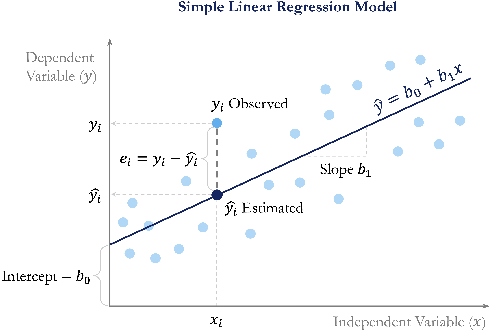

```{r echo=FALSE, message=FALSE, warning=FALSE}
source("_common.R")
```

# Regression Analysis {#sec-chapter-regression}

::: {.content-visible when-format="pdf"}
\begin{chapterquote}
To explain a thing is to pass easily back to its antecedents; to know it is easily to foresee its consequents.

\hfill — William James
\end{chapterquote}
:::

::::: {.content-visible when-format="html"}
:::: chapterquote
To explain a thing is to pass easily back to its antecedents; to know it is easily to foresee its consequents.

::: author
— William James
:::
::::
:::::

How can housing prices be predicted from a home’s age, location, and nearby amenities? How can a bike-sharing system estimate hourly rental demand from weather conditions and time-related patterns? Questions such as these lie at the heart of regression analysis, one of the most widely used tools in data science. Regression models allow us to describe how a numerical outcome changes in relation to one or more predictors, quantify those relationships, and generate predictions for new observations. Depending on the goal of the analysis, regression may therefore be used for explanation, statistical inference, prediction, or a combination of these purposes.

The origins of regression analysis date to the late nineteenth century, when Francis Galton introduced the term *regression* in studies of heredity. Since then, regression has developed into a central framework for statistical modeling across fields such as economics, medicine, engineering, and business analytics. Although the models introduced in this chapter are mathematically well established, their usefulness depends on more than fitting an equation. Effective regression analysis also requires careful attention to model specification, interpretation, uncertainty, diagnostic evidence, and predictive performance.

This chapter builds directly on the statistical inference framework introduced in Chapter [-@sec-chapter-statistics] and on the modeling and evaluation principles developed earlier in the book. We apply ideas such as standard errors, confidence intervals, and hypothesis testing to regression coefficients that describe relationships between predictors and numerical outcomes, while also using fitted models to generate and evaluate predictions. We begin with simple and multiple linear regression, then use polynomial terms to represent curved relationships and examine model selection and diagnostic checking. Chapter [-@sec-chapter-glm] builds on these same regression principles through generalized linear models suited to binary and count outcomes.

### What This Chapter Covers {.unnumbered .unlisted}

We begin with simple linear regression to develop the core ideas of model fitting, coefficient interpretation, and prediction, and then extend these ideas to multiple regression with several predictors. We also examine in-sample model fit using the residual standard error, $R^2$, and adjusted $R^2$, while distinguishing these measures from out-of-sample predictive performance.

Building on Chapter [-@sec-chapter-statistics], we apply statistical inference to regression coefficients through standard errors, confidence intervals, and hypothesis tests. We also distinguish uncertainty about regression coefficients from uncertainty about mean responses and predictions for new individual observations.

We then extend the basic linear model by introducing polynomial regression for curved relationships and stepwise regression for predictor selection. Diagnostic tools are used throughout to assess model adequacy, identify problems such as nonlinearity or non-constant variance, and evaluate whether the fitted model provides a reasonable representation of the data.

The `house` dataset is used throughout the chapter to develop and illustrate these ideas. A final case study using the `bike_demand` dataset brings them together in a predictive setting involving response transformation, time-aware data partitioning, model refinement, diagnostic checking, and final evaluation. By the end of the chapter, you will be able to fit, interpret, assess, and critically evaluate regression models in R and extend them when simple linear relationships are insufficient.

## Simple Linear Regression {#sec-reg-simple-regression}

Simple linear regression is the natural starting point for regression modeling. It provides a formal way to study the relationship between a single predictor and a numerical response. By focusing on one predictor at a time, we develop intuition for how regression models are fitted, how coefficients are interpreted, and how predictions are made before extending these ideas to models with several predictors.

To illustrate these ideas, we use the `house` dataset from the **liver** package. This dataset contains house-level information together with a numerical response, `unit_price`, making it well suited for studying how individual housing characteristics are associated with price.

We begin by loading the dataset and inspecting its structure:

```{r}
library(liver)

data(house, package = "liver")

str(house)
```

The dataset contains `r nrow(house)` observations and `r ncol(house)` variables. From the output of `str(house)`, we can identify the response variable, `unit_price`, together with several numerical predictors. We begin by examining how individual predictors relate to the response before extending the analysis to multiple regression.

Before fitting a regression model, it is useful to examine how the response variable relates to the available predictors. This helps us identify promising candidate predictors, assess whether a linear relationship seems plausible, and detect unusual patterns that may matter for modeling. Figure [-@fig-reg-house-relationships] presents a matrix of pairwise relationships among the numeric variables in the `house` dataset using the `pairs.panels()` function from the **psych** package. The upper triangle shows correlation coefficients, the lower triangle shows scatter plots, and the diagonal displays histograms.

```{r fig-reg-house-relationships, echo = FALSE, out.width = "100%", fig.cap = "Pairwise relationships among the numeric variables in the `house` dataset. The upper triangle shows correlation coefficients, the lower triangle shows scatter plots, and the diagonal displays histograms."}
library(psych)

pairs.panels(house, bg = "#92C5DE", pch = 21, col = NA, smooth = FALSE, ellipses = FALSE, hist.col = "#CCEBC5", main = "Pairwise Relationships in the 'house' Data")
```

This matrix gives an initial sense of which predictors are associated with `unit_price` and whether those relationships appear roughly linear. It also helps us detect possible outliers or unusual patterns. Among the available predictors, `stores_number` shows a clear positive association with house price and provides a natural starting point for simple linear regression. This exploratory step also connects to the discussion of correlation in Section [-@sec-stat-correlation], where linear association was introduced as a descriptive concept. We now move from describing an association to modeling it.

### Fitting and Using a Simple Linear Regression Model {.unnumbered .unlisted}

We begin by modeling the relationship between the number of nearby stores (`stores_number`) and house unit price (`unit_price`). Before fitting the model, it is helpful to visualize the relationship between the predictor and the response. A scatter plot with a fitted regression line provides a first indication of whether a linear model offers a reasonable description of the data.

```{r fig-reg-scatter-plot-simple-reg, echo = FALSE, out.width = "80%", fig.cap = "Scatter plot of house unit price versus number of nearby stores, with the fitted regression line showing the linear relationship."}
ggplot(house, aes(x = stores_number, y = unit_price)) +
  geom_point(color = "#6BAED6", alpha = 0.6) +
  geom_smooth(method = "lm", se = FALSE, color = "#2F4B7C", linewidth = 0.8) +
  labs(title = "House Unit Price vs. Number of Nearby Stores", x = "Number of nearby stores", y = "Unit price")
```

Figure [-@fig-reg-scatter-plot-simple-reg] suggests a positive association: houses with more nearby stores tend to have higher unit prices. The overall pattern appears roughly linear, which motivates fitting a simple linear regression model.

We represent the fitted relationship as $$
\hat{y} = b_0 + b_1x,
$$ where $\hat{y}$ is the predicted value of the response, $x$ is the predictor, $b_0$ is the estimated intercept, and $b_1$ is the estimated slope. The slope $b_1$ represents the expected change in the response associated with a one-unit increase in the predictor.

To build intuition, @fig-reg-simple-regression gives a conceptual illustration of the model. The fitted regression line summarizes the overall linear pattern in the data, while the vertical distance between an observed value $y_i$ and its fitted value $\hat{y}_i = b_0 + b_1x_i$ is called a residual. Residuals represent the part of the observed response that is not accounted for by the fitted model.

```{r out.width="80%"}
#| label: fig-reg-simple-regression
#| echo: false
#| fig-cap: "Conceptual illustration of a simple linear regression model. The fitted line summarizes the linear relationship, and the vertical distance between an observed value and its fitted value represents a residual."


```

We now estimate the model in R using the `lm()` function. This base R function fits linear models and will be used throughout the chapter. Its basic syntax is

```{r eval = FALSE}
lm(response_variable ~ predictor_variable, data = dataset)
```

For the `house` data, we model `unit_price` as a function of `stores_number`:

```{r}
simple_reg = lm(unit_price ~ stores_number, data = house)
```

We can inspect the fitted model using `summary()`:

```{r}
summary(simple_reg)
```

The fitted regression equation is $$
\widehat{\text{unit\_price}} =
`r round(simple_reg$coefficients[1], 2)`
+
`r round(simple_reg$coefficients[2], 2)`
\times \text{stores\_number}.
$$ The intercept ($b_0$) represents the estimated mean unit price when `stores_number = 0`, while the slope ($b_1$) represents the expected change in unit price associated with one additional nearby store. In this model, the estimated slope indicates that each additional nearby store is associated with an average increase of approximately `r round(simple_reg$coefficients[2], 2)` in unit price.

The `summary()` output also reports standard errors, *p*-values, the residual standard error, and measures of overall model fit. We return to model fit and statistical inference later in the chapter.

The fitted equation can also be used to estimate the mean response for specified predictor values. Suppose we want to estimate the expected unit price for houses located near 5 stores. Substituting `stores_number = 5` into the fitted equation gives $$
\begin{aligned}
\widehat{\text{unit\_price}}
= b_0 + b_1 \times 5 \
= `r round(simple_reg$coefficients[1], 2)`
* `r round(simple_reg$coefficients[2], 2)` \times 5 \
  = `r round(simple_reg$coefficients[1] + simple_reg$coefficients[2] * 5, 2)`.
  \end{aligned}
$$ The fitted model therefore gives an estimated mean `unit_price` of approximately `r round(simple_reg$coefficients[1] + simple_reg$coefficients[2] * 5, 2)` for houses with 5 nearby stores. This is an estimate of the mean response for houses with that predictor value, not the exact unit price of every individual house.

In practice, fitted values are usually generated using the `predict()` function rather than by substituting predictor values into the fitted equation manually:

```{r}
predict(simple_reg, newdata = data.frame(stores_number = 5))
```

The `predict()` function can also generate fitted values for several predictor values at once. For example,

```{r}
predict(simple_reg, newdata = data.frame(stores_number = c(1, 3, 8)))
```

returns the estimated mean `unit_price` for houses with 1, 3, and 8 nearby stores, respectively. These examples show how a fitted simple regression model can be used both to summarize an estimated linear relationship and to generate fitted responses for specified predictor values. We next extend these ideas from a single predictor to several predictors, leading to multiple linear regression.

> *Practice:* Repeat the analysis using `distance_to_MRT` instead of `stores_number`. Fit a simple linear regression model with `unit_price` as the response, interpret the intercept and slope, and use `predict()` to estimate the mean `unit_price` for a `distance_to_MRT` value within the observed range.

## Multiple Linear Regression {#sec-reg-multiple-regression}

We now extend simple linear regression to settings with more than one predictor. This leads to multiple linear regression, a framework that allows us to model a numerical response using several predictors simultaneously. In practice, outcomes are rarely determined by a single factor, so multiple regression provides a more realistic way to study how predictors relate to the response.

In the `house` dataset, house price is likely influenced by more than just the number of nearby stores. Age, distance to public transport, and location may all matter as well. Multiple regression allows us to examine how each predictor is associated with `unit_price` while accounting for the others. This is one of its main advantages: it helps us move from isolated pairwise relationships to a model that reflects several relevant factors at once.

The general form of a multiple regression model with $m$ predictors is $$
\hat{y} = b_0 + b_1 x_1 + b_2 x_2 + \dots + b_m x_m,
$$ where $b_0$ is the intercept and $b_1, b_2, \dots, b_m$ are the estimated coefficients. Each coefficient represents the expected change in the response associated with a one-unit increase in the corresponding predictor, while holding the other predictors fixed. This conditional interpretation is what distinguishes multiple regression from simple regression, where the effect of a predictor is considered on its own.

### Fitting and Interpreting a Multiple Regression Model in R {.unnumbered .unlisted}

To fit a multiple regression model in R, we again use the `lm()` function. The main difference is that we now include several predictors on the right-hand side of the formula. If we want to use all remaining variables in the dataset as predictors, we can use the shorthand `.`:

```{r}
full_model = lm(unit_price ~ ., data = house)

summary(full_model)
```

This model uses all remaining variables in the `house` dataset to explain `unit_price`. The dot notation is a convenient way to fit a full regression model without listing each predictor explicitly.

The `summary()` output reports an estimated coefficient for each predictor, together with its standard error, test statistic, and *p*-value. These quantities help us assess how each predictor is associated with `unit_price` once the others are taken into account.

This conditional interpretation is important. In simple regression, the coefficient of `stores_number` described how `unit_price` changes when `stores_number` is considered alone. In multiple regression, the coefficient of `stores_number` describes how `unit_price` changes with `stores_number` after adjusting for the other predictors in the model. As a result, the coefficient may differ from the one obtained in the simple regression model.

In practice, predictions from a multiple regression model are usually generated with the `predict()` function rather than by manually evaluating the fitted equation. This is especially useful when several predictors are involved. We return to prediction later in the chapter, particularly in the case study, where fitted regression models are used to predict hourly bike rental demand.

Multiple regression therefore allows us to explain variation in `unit_price` using several predictors at once, rather than relying on a single explanatory variable. In the next section, we compare the simple and multiple regression models more formally using measures such as the residual standard error, $R^2$, and adjusted $R^2$.

> *Practice:* Compare the coefficient of `stores_number` in the simple regression model with its coefficient in the multiple regression model. How does the interpretation change once the other predictors are included?

### A Note on Simpson’s Paradox {.unnumbered .unlisted}

As we move from simple regression to multiple regression, it is important to remember that relationships can change once additional variables are taken into account. A classic example of this is *Simpson’s Paradox*, where an association observed in aggregated data weakens, disappears, or even reverses after the data are separated into meaningful groups.

Figure [-@fig-reg-Simpson-paradox] illustrates this idea. The left panel shows a regression line fitted to the full dataset, ignoring group structure. The right panel shows separate fitted lines within groups. Although the overall trend appears negative in the aggregated data, the within-group relationships are positive.

```{r}
#| echo: false

set.seed(42)
n = 100
b0 = 5
b1 = 0.35

x1 = runif(n, 40, 50); y1 = 0 * b0 + b1 * x1 + rnorm(n)
x2 = runif(n, 30, 40); y2 = 1 * b0 + b1 * x2 + rnorm(n)
x3 = runif(n, 20, 30); y3 = 2 * b0 + b1 * x3 + rnorm(n)
x4 = runif(n, 10, 20); y4 = 3 * b0 + b1 * x4 + rnorm(n)
x5 = runif(n,  0, 10); y5 = 4 * b0 + b1 * x5 + rnorm(n)

sim_data = data.frame(
  x = c(x1, x2, x3, x4, x5),
  y = c(y1, y2, y3, y4, y5),
  group = rep(paste("Group", 1:5), each = n)
)
```

```{r out.width = "100%"}
#| label: fig-reg-Simpson-paradox
#| echo: false
#| fig-cap: "Illustration of Simpson’s Paradox. The left plot ignores group structure, whereas the right plot shows separate fitted relationships within groups."

p1 = ggplot(sim_data, aes(x = x, y = y)) +
  geom_point(alpha = 0.6, color = "#6BAED6", size = 0.7) +
  geom_smooth(method = "lm", se = FALSE, color = "#2F4B7C", linewidth = 0.8) +
  labs(title = "Ignoring Groups", x = "Predictor (X)", y = "Response (Y)") +
  theme_minimal(base_size = 8) +
  theme(
    plot.title = element_text(hjust = 0.5, size = 8, face = "bold"),
    legend.position = "none"
  )

p2 = ggplot(sim_data, aes(x = x, y = y, color = group)) +
  geom_point(alpha = 0.5, size = 0.7) +
  geom_smooth(method = "lm", se = FALSE, linewidth = 0.8) +
  scale_color_brewer(palette = "Set2") +
  labs(
    title = "Separate Trends by Group",
    x = "Predictor (X)", y = "Response (Y)", color = "Group"
  ) +
  theme_minimal(base_size = 8) +
  theme(
    plot.title = element_text(hjust = 0.5, size = 8, face = "bold"),
    legend.position = "bottom",
    legend.direction = "horizontal",
    legend.box = "horizontal",
    legend.margin = ggplot2::margin(t = -4, b = -4),
    legend.title = element_text(size = 8, face = "bold"),
    legend.text = element_text(size = 8)
  )

legend = cowplot::get_legend(p2)
p2_clean = p2 + theme(legend.position = "none")

final_plot = (p1 + p2_clean) / patchwork::wrap_elements(legend)

final_plot + plot_layout(heights = c(1, 0.06))
```

This idea is relevant for the `house` data as well. The coefficient of `stores_number` in the simple regression model does not necessarily match its coefficient in the multiple regression model, because the latter is interpreted after adjusting for the other house characteristics. More generally, apparent associations can change once relevant variables are included in the model.

## Measuring Model Fit in Regression {#sec-reg-measuring-fit}

After fitting both a simple regression model and a multiple regression model, an important next question is how to judge which model provides a better fit to the data. The multiple regression model includes all available predictors in the `house` dataset and is therefore more complex than the simple regression model, which uses only `stores_number`. But does this added complexity improve the model in a meaningful way?

To address this question, we use summary measures of in-sample model fit. In this section, we focus on three widely used quantities: the residual standard error (RSE), which summarizes the typical size of the residuals; the coefficient of determination, $R^2$, which measures the proportion of variability explained by the model; and adjusted $R^2$, which modifies $R^2$ to account for model complexity. These quantities describe how well a regression model fits the data used to estimate it. They should not be confused with out-of-sample predictive performance. As discussed in Chapter [-@sec-chapter-evaluation], when prediction is the goal, final assessment should be based on observations kept outside model development.

### Residual Standard Error {.unnumbered .unlisted}

To understand model fit, we begin with the idea of a residual. A residual is the difference between an observed response value and the corresponding value predicted by the model. For observation $i$, the residual is $$
e_i = y_i - \hat{y}_i,
$$ where $y_i$ is the observed value and $\hat{y}_i$ is the fitted value from the regression model. Residuals therefore represent the part of the response that remains unexplained after the model is fitted.

The regression line or regression surface is estimated by choosing the coefficients that make the residuals as small as possible overall. More precisely, least squares estimation minimizes the sum of squared residuals, also called the sum of squared errors: $$
\text{SSE} = \sum_{i=1}^{n} (y_i - \hat{y}_i)^2.
$$ {#eq-sse} A smaller SSE indicates that the fitted values lie closer to the observed values. However, because SSE depends on the number of observations and the scale of the response, it is not always easy to interpret directly. For this reason, we often use the residual standard error (RSE), which summarizes the typical size of the residuals on the scale of the response variable.

The RSE is defined as $$
RSE = \sqrt{\frac{SSE}{n - m - 1}},
$$ where $n$ is the number of observations and $m$ is the number of predictors. The denominator $n - m - 1$ reflects the model’s degrees of freedom. In simple linear regression, where $m = 1$, this becomes $n - 2$ because both the intercept and slope are estimated from the data.

A smaller RSE indicates that, on average, the fitted values lie closer to the observed values. For the simple and multiple regression models fitted to the `house` dataset, the RSE values can be computed directly as follows:

```{r}
rse_simple = sqrt(sum(simple_reg$residuals^2) / summary(simple_reg)$df[2])
rse_multiple = sqrt(sum(full_model$residuals^2) / summary(full_model)$df[2])

c(rse_simple = rse_simple, rse_multiple = rse_multiple)
```

These are the same RSE values reported in the `summary(simple_reg)` and `summary(full_model)` outputs. Computing them directly helps clarify how the residual standard error is obtained from the residuals and the model’s degrees of freedom.

For the simple regression model, the residual standard error is $RSE =$ `r round(summary(simple_reg)$sigma, 2)`, whereas for the multiple regression model it is $RSE =$ `r round(summary(full_model)$sigma, 2)`. The lower RSE in the multiple regression model indicates that its fitted values are, on average, closer to the observed `unit_price` values. This suggests that including the additional predictors improves the model’s fit to the data.

Because RSE is expressed in the same units as the response variable, its interpretation is always contextual. A value is meaningful only relative to the scale of the response and the purpose of the analysis.

### R-squared and Adjusted R-squared {.unnumbered .unlisted}

The coefficient of determination, $R^2$, measures the proportion of variability in the response variable that is explained by the regression model. It summarizes how well the fitted model captures the overall variation in the data.

Formally, $R^2$ is defined as $$
R^2 = 1 - \frac{SSE}{SST},
$$ where $SSE$ is the sum of squared errors defined in @eq-sse and $SST$ is the total sum of squares, representing the total variation in the response. The value of $R^2$ ranges between 0 and 1. A value of 1 means that the model explains all observed variation, whereas a value of 0 means that it explains none.

For the simple regression model predicting `unit_price` from `stores_number`, the value of $R^2$ is

```{r}
summary(simple_reg)$r.squared
```

This means that approximately `r round(summary(simple_reg)$r.squared * 100, 1)`% of the variation in `unit_price` is explained by the regression model using `stores_number` as the predictor. In simple linear regression, $R^2$ is directly related to the Pearson correlation coefficient introduced in Section [-@sec-stat-correlation], since $$
R^2 = r^2,
$$ where $r$ is the correlation between the predictor and the response. In the `house` dataset, we can verify this directly:

```{r}
cor(house$stores_number, house$unit_price)^2
```

This gives the same value as the reported $R^2$, reinforcing that in simple linear regression, $R^2$ reflects the strength of the linear association between the predictor and the response.

However, $R^2$ has an important limitation: it never decreases when predictors are added, even if the additional variables contribute little useful information. For this reason, $R^2$ alone can be misleading when comparing models of different complexity. Adjusted $R^2$ addresses this limitation by accounting for the number of predictors in the model.

Adjusted $R^2$ is defined as $$
\text{Adjusted } R^2 = 1 - \left(1 - R^2\right)\times\frac{n - 1}{n - m - 1},
$$ where $n$ is the number of observations and $m$ is the number of predictors. Unlike $R^2$, adjusted $R^2$ may increase or decrease when a new predictor is added, depending on whether the improvement in fit is large enough to justify the added complexity.

For the simple regression model, adjusted $R^2$ is

```{r}
summary(simple_reg)$adj.r.squared
```

which is close to the corresponding $R^2$ value because only one predictor is included.

The comparison becomes more informative when we look at the simple and multiple regression models together. For the simple regression model, $R^2 =$ `r round(summary(simple_reg)$r.squared * 100, 1)`%, whereas for the multiple regression model it increases to $R^2 =$ `r round(summary(full_model)$r.squared * 100, 1)`%. Similarly, adjusted $R^2$ rises from `r round(summary(simple_reg)$adj.r.squared * 100, 1)`% in the simple regression model to `r round(summary(full_model)$adj.r.squared * 100, 1)`% in the multiple regression model.

These increases indicate that the additional predictors in the multiple regression model help explain more of the variation in `unit_price` than `stores_number` alone. At the same time, neither $R^2$ nor adjusted $R^2$ guarantees that a model is appropriate or that it will generalize well to unseen data. As discussed in Chapter [-@sec-chapter-evaluation], predictive performance must be assessed separately using out-of-sample data.

### Interpreting Model Fit {.unnumbered .unlisted}

Assessing regression model fit requires balancing several complementary measures rather than relying on a single statistic. In general, a better-fitting model has a lower residual standard error, indicating that the fitted values are closer to the observed values, together with relatively high values of $R^2$ and adjusted $R^2$, suggesting that the model explains a substantial proportion of the observed variability without unnecessary complexity.

Taken together, the comparisons in this section suggest that the multiple regression model provides a better fit to the `house` data than the simple regression model. Its lower RSE and higher values of $R^2$ and adjusted $R^2$ indicate that incorporating the additional predictors improves the model beyond using `stores_number` alone.

At the same time, these summaries should not be interpreted in isolation. A model with strong in-sample fit may still violate important assumptions or fail to generalize well to new data. Measures of fit should therefore be considered alongside residual diagnostics, graphical checks, and subject-matter interpretation. When prediction is the goal, final performance should be assessed separately on data kept outside model development, following the principles introduced in Chapter [-@sec-chapter-evaluation].

> *Practice:* Fit a reduced multiple regression model by removing the predictor `longitude` from `full_model`. How do the RSE, $R^2$, and adjusted $R^2$ change? What do these changes suggest about the contribution of the omitted predictor?

This comparison naturally leads to a broader modeling question: should all available predictors be retained, or is there a smaller subset that balances simplicity and performance? We address this issue in Section [-@sec-reg-stepwise], where we introduce stepwise regression and related model selection strategies.

## Statistical Inference in Regression Models {#sec-reg-inference}

The measures introduced in the previous section, such as RSE, $R^2$, and adjusted $R^2$, describe how well a regression model fits the observed data. Regression analysis can also address a different question: what do the estimated coefficients tell us about relationships in the broader population from which the data were obtained?

Chapter [-@sec-chapter-statistics] introduced the general framework of statistical inference, including population parameters, sample estimates, sampling variability, standard errors, confidence intervals, and hypothesis testing. We now apply these ideas to regression. The key distinction is between the unknown population coefficients, denoted by $\beta_j$, and their estimates from the observed sample, denoted by $b_j$.

For simple linear regression, the population model is $$
y = \beta_0 + \beta_1 x + \epsilon,
$$ where $\beta_0$ is the population intercept, $\beta_1$ is the population slope, and $\epsilon$ represents variation in the response that is not explained by the linear relationship. When we fit the model to a sample, we estimate these unknown coefficients by $b_0$ and $b_1$.

### Inference for Regression Coefficients {.unnumbered .unlisted}

Because regression coefficients are estimated from sample data, their values would vary if we repeatedly collected new samples from the same population. The standard error of a coefficient summarizes this sampling variability. Smaller standard errors indicate more precise coefficient estimates, whereas larger standard errors indicate greater uncertainty.

For the simple regression model introduced in Section [-@sec-reg-simple-regression], the `summary()` output shown earlier included information about both the estimated coefficients and their uncertainty. Here, we focus specifically on the coefficient table, which can be extracted directly using

```{r}
coef(summary(simple_reg))
```

The table reports the estimated intercept and slope together with their standard errors and *p*-values. For `stores_number`, the estimated slope is $$
b_1 = `r round(simple_reg$coefficients[2], 2)`.
$$ This estimate indicates that one additional nearby store is associated with an average change of approximately `r round(simple_reg$coefficients[2], 2)` in `unit_price`. The accompanying standard error indicates how precisely the corresponding population slope has been estimated from the sample.

A coefficient estimate alone, however, does not show the range of population values that are reasonably consistent with the observed data. A confidence interval provides this additional information. In R, confidence intervals for regression coefficients can be obtained using `confint()`:

```{r}
confint(simple_reg)
```

By default, `confint()` reports 95% confidence intervals. For the slope associated with `stores_number`, the interval is approximately (`r round(confint(simple_reg)["stores_number", 1], 2)`, `r round(confint(simple_reg)["stores_number", 2], 2)`). This interval provides a range of plausible values for the population slope $\beta_1$ under the assumptions of the model. It therefore communicates both the estimated magnitude of the association and the uncertainty surrounding that estimate.

The same population coefficient can also be examined through a hypothesis test. For the slope in simple linear regression, the usual two-sided hypotheses are $$
\begin{cases}
H_0: \beta_1 = 0 & \text{(no linear relationship between $x$ and $y$)}, \\
H_a: \beta_1 \neq 0 & \text{(a linear relationship exists)}.
\end{cases}
$$ For `stores_number`, the corresponding *p*-value is `r format.pval(summary(simple_reg)$coefficients[2, "Pr(>|t|)"], digits = 3)`. The small *p*-value provides strong evidence that the population slope differs from zero. This conclusion is consistent with the 95% confidence interval, which does not include zero.

Confidence intervals and hypothesis tests therefore provide complementary views of the same inferential question. The *p*-value summarizes the evidence against a specified null value, whereas the confidence interval also shows the range and precision of plausible values for the population coefficient.

### Confidence and Prediction Intervals for Responses {.unnumbered .unlisted}

Uncertainty can also be quantified for responses at specified predictor values. Here, it is important to distinguish between two different quantities: the population mean response and the response of a new individual observation.

Suppose we want to estimate the mean `unit_price` for houses with 5 nearby stores. We can obtain a 95% confidence interval for this mean response using

```{r}
predict(simple_reg, newdata = data.frame(stores_number = 5), interval = "confidence")
```

The fitted value is the estimated mean response for houses with 5 nearby stores, while the lower and upper limits describe uncertainty about the corresponding population mean response. This interval therefore concerns the expected `unit_price` for houses with that predictor value rather than the value of a particular individual house.

A different question arises when we want to predict the `unit_price` of a new individual house with 5 nearby stores. In that case, we use a prediction interval:

```{r}
predict(simple_reg, newdata = data.frame(stores_number = 5), interval = "prediction")
```

By default, this also produces a 95% interval. The prediction interval is wider than the confidence interval for the mean response because it reflects both uncertainty in estimating the mean response and the additional variability of individual observations around that mean.

The distinction among the different intervals used in regression is therefore important. A confidence interval obtained from `confint()` concerns an unknown population regression coefficient such as $\beta_1$. A confidence interval obtained from `predict(..., interval = "confidence")` concerns the population mean response at specified predictor values. A prediction interval obtained from `predict(..., interval = "prediction")` concerns a new individual observation. Although all three quantify uncertainty, they answer different questions.

> *Practice:* For houses with 1, 3, and 8 nearby stores, use `predict()` to obtain 95% confidence intervals for the mean `unit_price` and 95% prediction intervals for new individual houses. Compare their widths. Which intervals are wider, and why?

### Inference in Multiple Regression {.unnumbered .unlisted}

The same inferential principles extend to the multiple regression model introduced in Section [-@sec-reg-multiple-regression]. In a model with several predictors, $$
y = \beta_0 + \beta_1x_1 + \beta_2x_2 + \cdots + \beta_mx_m + \epsilon,
$$ each estimated coefficient $b_j$ has an associated standard error, confidence interval, and *p*-value.

The interpretation, however, is conditional on the other predictors in the model. For example, the coefficient of `stores_number` in `full_model` describes its association with `unit_price` while holding the other included predictors fixed. The corresponding hypothesis test asks whether the population coefficient for `stores_number` differs from zero after accounting for those other predictors.

Confidence intervals for all coefficients in the multiple regression model can be obtained using

```{r}
confint(full_model)
```

Because predictors may contain overlapping information, an association that appears strong in a simple regression model may become weaker after additional predictors are included. Both the estimated coefficient and its uncertainty can change. This is one reason why coefficients from simple and multiple regression models should not be interpreted as though they answer exactly the same question.

> *Practice:* Compare the estimated coefficient and 95% confidence interval for `stores_number` in `simple_reg` and `full_model`. How do the estimate and its uncertainty change after the other predictors are included? Does the confidence interval in each model include zero?

Statistical inference adds an important explanatory perspective to regression analysis, but statistical significance should not be confused with practical importance. A coefficient can be statistically distinguishable from zero while representing an association too small to matter substantively. Conversely, an imprecisely estimated coefficient may still represent a potentially important relationship that the available data cannot estimate with much precision.

Statistical significance also does not establish causation. Regression coefficients describe conditional associations under the fitted model. A causal interpretation requires additional assumptions about study design, confounding, and the data-generating process that cannot be established from a small *p*-value alone. Similarly, statistical significance does not guarantee good prediction on new observations. Predictive performance must be evaluated separately using the principles introduced in Chapter [-@sec-chapter-evaluation].

Regression inference therefore combines coefficient estimates with measures of uncertainty to help us understand what the observed data suggest about population relationships. Model building, however, also requires decisions about which predictors to include and how complex the model should be. We turn next to predictor selection and stepwise regression.

## Stepwise Regression for Predictor Selection {#sec-reg-stepwise}

An important practical question in regression modeling is deciding which predictors to include. Including too few variables may leave important relationships unexplained, whereas including too many can reduce interpretability and lead to unnecessary complexity. Predictor selection therefore aims to balance explanatory value with simplicity.

Stepwise regression is one commonly used approach to this problem. It is an iterative procedure that adds or removes predictors one at a time according to a model selection criterion. In this way, it provides a systematic way to compare competing predictor sets and search for a model that is both interpretable and effective.

This idea connects naturally to earlier parts of the data science workflow. Exploratory analysis helps identify potentially useful predictors, while regression modeling allows us to assess how those predictors contribute once considered together. Stepwise regression builds on these earlier steps by automating part of the model selection process.

### How AIC Guides Model Selection {.unnumbered .unlisted}

When comparing competing regression models, we need a principled way to decide whether a simpler model is preferable to a more complex one. Model selection criteria address this problem by balancing goodness of fit against model complexity, so that additional predictors are retained only when they improve the model enough to justify their inclusion.

One widely used criterion is the Akaike Information Criterion (AIC). AIC combines a measure of model fit with a penalty for complexity, with lower values indicating a better trade-off. For linear regression, AIC can be expressed, up to an additive constant, as $$
AIC = 2m + n \log\left(\frac{SSE}{n}\right),
$$ where $m$ denotes the number of estimated parameters in the model, $n$ is the number of observations, and $SSE$ is the sum of squared errors introduced in @eq-sse.

Unlike $R^2$, which never decreases when predictors are added, AIC explicitly penalizes model complexity. As a result, a predictor is retained only if the improvement in fit is large enough to justify the added complexity. AIC is therefore a relative measure: it is meaningful only when comparing models fitted to the same dataset and response variable, and among the candidate models, the one with the smaller AIC is preferred.

A related criterion is the Bayesian Information Criterion (BIC), which penalizes complexity more strongly and therefore tends to favor simpler models. In this chapter, however, we focus on AIC because it is the default criterion used by the `step()` function in R.

### Stepwise Regression in Practice: Using `step()` in R {.unnumbered .unlisted}

We now apply stepwise regression to the `house` dataset. In R, the `step()` function automates predictor selection by iteratively adding or removing variables to improve the AIC value. Its general syntax is

```{r eval = FALSE}
step(object, direction = c("both", "backward", "forward"))
```

Here, `object` is a fitted model, and the `direction` argument specifies the search strategy. Forward selection starts from a smaller model and adds predictors, backward elimination begins with a fuller model and removes predictors, and `"both"` allows movement in either direction.

For the `house` data, we begin with the full multiple regression model introduced earlier in Section [-@sec-reg-multiple-regression]. This model, stored as `full_model`, includes all available predictors of `unit_price`. As already noted, some coefficient estimates may have relatively large *p*-values. That does not necessarily mean that those predictors are unimportant. When predictors contain overlapping information, their individual contributions can be difficult to separate clearly within a single model. This is closely related to multicollinearity, which can inflate standard errors and complicate interpretation even when the model as a whole fits the data well.

This motivates the use of automated model selection techniques. We apply stepwise regression using AIC as the selection criterion and allowing both forward and backward moves:

```{r}
stepwise_model = step(full_model, direction = "both")
```

The algorithm evaluates alternative models by adding or removing predictors, retaining only those changes that reduce the AIC. This process continues until no further improvement is possible. Across the iterations, the AIC decreases from `r round(max(stepwise_model$anova$AIC), 2)` for the full model to `r round(min(stepwise_model$anova$AIC), 2)` for the final selected model, indicating a slightly more favorable balance between fit and complexity.

To see which predictors remain in the final model, we inspect its formula:

```{r}
formula(stepwise_model)
```

The stepwise procedure removes only one predictor, `longitude`. This suggests that, after accounting for the other variables in the model, `longitude` does not contribute enough additional information to be retained under the AIC criterion. All other predictors from the full model remain in the final specification.

Compared with the full model, the stepwise model is only slightly simpler. Its residual standard error changes from `r round(sqrt(sum(residuals(full_model)^2) / df.residual(full_model)), 2)` to `r round(sqrt(sum(residuals(stepwise_model)^2) / df.residual(stepwise_model)), 2)`, while adjusted $R^2$ changes from `r round(summary(full_model)$adj.r.squared * 100, 1)`% to `r round(summary(stepwise_model)$adj.r.squared * 100, 1)`%. These values show that removing `longitude` has very little effect on the overall fit of the model.

Stepwise regression therefore provides a practical way to compare competing predictor sets, especially when several predictors may contain overlapping information. At the same time, it remains a heuristic approach and should be complemented with subject-matter knowledge, diagnostic checks, and validation whenever possible.

> *Practice:* Apply stepwise regression using `"backward"` selection instead of `"both"`. Do all three approaches lead to the same final model? How do their AIC values compare?

### Considerations for Stepwise Regression {.unnumbered .unlisted}

Stepwise regression provides a structured and computationally efficient approach to predictor selection. By iteratively adding or removing variables according to a model selection criterion, it offers a practical way to compare competing models without evaluating every possible predictor combination. When used carefully, it can produce simpler and more interpretable models.

At the same time, stepwise regression has important limitations. Because predictors are evaluated sequentially rather than jointly, the procedure may miss combinations of variables or interaction effects that become useful only when considered together. The selected model can also be sensitive to sampling variability, so small changes in the data may lead to different results. When many predictors are available relative to the sample size, stepwise regression may favor models that capture random noise rather than stable patterns. Multicollinearity can further complicate interpretation by inflating standard errors and obscuring individual contributions.

In settings with many predictors or more complex dependence structures, regularization methods such as LASSO and ridge regression are often attractive alternatives. These approaches shrink coefficient estimates through explicit penalty terms and can produce more stable models, especially when predictors are numerous or highly correlated. A broader introduction to these methods is provided in *An Introduction to Statistical Learning with Applications in R* [@gareth2013introduction].

Ultimately, predictor selection should be guided by a combination of statistical criteria, subject-matter knowledge, and validation on representative data. Stepwise regression is therefore best viewed not as a definitive solution, but as a useful exploratory tool that can support model building when applied with care.

## Modeling Non-Linear Relationships

Not all relationships between predictors and a response variable are well described by straight lines. In many applications, the effect of a predictor changes across its range, so that the relationship is curved rather than linear. When this happens, a standard linear regression model may miss important structure in the data and produce systematic errors.

Earlier in this chapter, we used stepwise regression (Section [-@sec-reg-stepwise]) to decide which predictors to retain in the model. That approach helps refine model specification, but it does not address the form of the relationship between a predictor and the response. If the underlying pattern is curved, simply adding or removing predictors will not solve the problem.

To handle this situation while preserving the familiar regression framework, we turn to polynomial regression. This approach extends linear regression by allowing transformed versions of a predictor, such as squared terms, to enter the model. In this way, it can capture curvature while retaining the same basic tools for estimation, interpretation, and prediction.

### When a Straight Line Is Not Enough {.unnumbered .unlisted}

A useful way to see why non-linear terms may be needed is to examine the relationship between `house_age` and `unit_price` in the `house` dataset. Figure [-@fig-reg-scatter-plot-non-linear] shows a scatter plot of these two variables. The dashed gray line represents a simple linear regression fit, while the dark blue curve represents a quadratic fit.

```{r fig-reg-scatter-plot-non-linear, echo = FALSE, out.width = "80%", fig.cap = "Scatter plot of `unit_price` versus `house_age` in the `house` dataset, with a fitted linear regression line shown as a dashed gray line and a fitted quadratic curve shown in dark blue."}
ggplot(data = house, aes(x = house_age, y = unit_price)) +
  geom_point(color = "#6BAED6", alpha = 0.7) +
  geom_smooth(method = "lm", se = FALSE, linetype = "dashed", colour = "gray40", linewidth = 0.9) +
  stat_smooth(method = "lm", formula = y ~ x + I(x^2), se = FALSE, colour = "#1F3C88", linewidth = 0.9) +
  labs(
    title = "House Age vs Unit Price",
    x = "House Age (years)",
    y = "Unit Price"
  )
```

The figure suggests that the relationship is not fully captured by a straight line. The linear fit follows the overall direction of the data, but it does not reflect the visible curvature particularly well. In contrast, the quadratic curve follows the pattern more closely, suggesting that the effect of `house_age` on `unit_price` is not constant across the full range of the predictor.

A quadratic regression model has the form $$
\widehat{\text{unit\_price}} = b_0 + b_1 \times \text{house\_age} + b_2 \times \text{house\_age}^2.
$$ By including both `house_age` and its squared term, the fitted relationship is allowed to bend rather than remain straight. Although the relationship between the predictor and the response is now nonlinear, the model is still linear in the coefficients $b_0$, $b_1$, and $b_2$. For that reason, it is still estimated using ordinary least squares.

This plot is intended to build intuition by isolating the relationship between `house_age` and `unit_price`. In the next section, we return to the multivariable regression setting and examine whether adding a quadratic term for `house_age` improves the earlier model selected from the `house` data.

## Polynomial Regression in Practice

We now return to the `house` dataset and examine how polynomial regression can be used in a multivariable setting. In the previous section, we used the relationship between `house_age` and `unit_price` to build intuition for why a straight-line fit may be insufficient. We now extend that idea to the regression model selected earlier by the stepwise procedure.

The stepwise model retained the predictors `house_age`, `distance_to_MRT`, `stores_number`, and `latitude`, but it treated the effect of `house_age` as linear. Because the earlier scatter plot suggested curvature in the relationship between `house_age` and `unit_price`, it is natural to ask whether the model improves when we allow this relationship to bend.

To do so, we add a quadratic term for `house_age` while retaining the other predictors from the stepwise model. The resulting polynomial regression model is $$
\begin{split}
\widehat{\text{unit\_price}} &=
b_0 + b_1 \times \text{house\_age} +
b_2 \times \text{house\_age}^2 +
b_3 \times \text{distance\_to\_MRT} + \\
&\quad b_4 \times \text{stores\_number} +
b_5 \times \text{latitude}.
\end{split}
$$ This model remains linear in the coefficients, even though the relationship between `house_age` and `unit_price` is no longer restricted to a straight line. We can therefore fit it using the same `lm()` function as before.

```{r}
poly_reg_house = lm(unit_price ~ house_age + I(house_age^2) + distance_to_MRT + stores_number + latitude, data = house)

summary(poly_reg_house)
```

In the summary output, we see two coefficients related to `house_age`: one for `house_age` and one for `I(house_age^2)`. This is because the model includes both the linear term and the squared term. Together, these two coefficients determine the curved relationship between `house_age` and `unit_price`. As a result, the effect of `house_age` can no longer be interpreted using a single slope alone.

We now compare this polynomial model with the earlier stepwise linear model. If the quadratic term captures meaningful curvature, we would expect the polynomial model to improve the fit. For the stepwise linear model, the residual standard error is `r round(summary(stepwise_model)$sigma, 2)` and the adjusted $R^2$ is `r round(summary(stepwise_model)$adj.r.squared, 3)`. For the polynomial model, the residual standard error decreases to `r round(summary(poly_reg_house)$sigma, 2)`, while the adjusted $R^2$ increases to `r round(summary(poly_reg_house)$adj.r.squared, 3)`. The polynomial model therefore has a lower residual standard error and a higher adjusted $R^2$. This suggests that allowing curvature in `house_age` improves the model beyond the purely linear specification. In other words, the quadratic term appears to capture structure that the stepwise model leaves unexplained.

Polynomial regression therefore provides a useful extension of multiple regression when one predictor appears to have a nonlinear relationship with the response. At the same time, polynomial terms should be added thoughtfully and only when they are supported by the data and improve the model in a meaningful way. In the next section, we examine whether this refinement is also supported by the diagnostic plots.

> *Practice:* Extend the model by adding the cubic term `I(house_age^3)`. Compare the quadratic and cubic models using the residual standard error, adjusted $R^2$, and diagnostic plots. Does the cubic term improve the model enough to justify the additional complexity?

## Diagnosing Common Problems in Regression Models

A regression model may appear to perform well according to measures such as $R^2$, adjusted $R^2$, or the residual standard error, yet still suffer from important weaknesses. Before we rely on a fitted model for interpretation or prediction, we therefore need to examine whether it shows signs of systematic problems. Diagnostic analysis helps us do this by revealing patterns in the residuals, highlighting unusual observations, and showing whether the fitted model captures the structure of the data adequately.

Linear regression is built on several familiar assumptions, including linearity, constant variance, approximate normality of residuals, and independence of observations. In practice, however, it is often more useful to approach diagnostics through the concrete problems that arise when these assumptions are not well satisfied. Rather than asking only whether an assumption holds in the abstract, we ask three practical questions: What can go wrong, how can we recognize it, and what might we do in response?

Even when a polynomial model improves numerical fit, it is still important to check whether the fitted model behaves reasonably. To illustrate this process, we return to the `house` dataset and focus on the polynomial regression model introduced earlier. In that model, `unit_price` is explained using `house_age`, its squared term, `distance_to_MRT`, `stores_number`, and `latitude`. The standard diagnostic plots for this model are shown in @fig-reg-model-diagnostics. Here we use the `autoplot()` function from **ggfortify** because it provides a clean and convenient display of the standard regression diagnostics, although the same plots can also be obtained using the base `plot()` function in R. The lower-right panel additionally includes Cook’s distance contours, which help us identify cases that may have a relatively strong influence on the fitted model.

```{r out.width = "100%"}
#| label: fig-reg-model-diagnostics
#| fig-cap: "Diagnostic plots for assessing common problems in the fitted polynomial regression model for the `house` dataset."

library(ggfortify)

autoplot(poly_reg_house, which = 1:4)
```

These four plots provide complementary perspectives on model adequacy. The Residuals vs Fitted plot (upper-left) helps us assess linearity and constant variance, the Normal Q-Q plot (upper-right) helps us assess whether the residuals are approximately normal, the Scale-Location plot (lower-left) provides another view of residual spread, and the Residuals vs Leverage plot (lower-right) helps us identify observations that may be influential. Taken together, these plots do not provide automatic yes-or-no answers, but they help us judge whether the fitted model behaves reasonably or whether some aspects require closer attention. In the following subsections, we examine these diagnostic perspectives in more detail.

One important issue is not well captured by the four standard diagnostic plots: dependence among observations. Standard linear regression assumes that each observation contributes independent information, but this may be questionable in datasets with temporal, spatial, clustered, or repeated-measurement structure. When dependence is present, the fitted regression function may still appear reasonable, but the standard errors and inferential conclusions can become unreliable. For this reason, regression diagnostics require not only plot-based checks, but also careful attention to how the data were collected and structured.

In this case, the plots do not suggest any severe violation of the main regression assumptions, although observation 271 stands out and deserves closer inspection. The Cook’s distance contours in the Residuals vs Leverage plot help us assess whether this case may also have an important influence on the fitted model.

### Non-Linearity of the Response-Predictor Relationship {.unnumbered .unlisted}

One of the most common problems in regression analysis is non-linearity. A linear regression model assumes that the response changes linearly with the predictors included in the model, given the structure specified by the model. When this assumption is not appropriate, the fitted model may systematically underpredict in some regions of the data and overpredict in others.

A useful tool for detecting this problem is the Residuals vs Fitted plot. If the assumed functional form is adequate, the residuals should appear randomly scattered around zero with no clear structure. Curved patterns or other systematic departures suggest that the model is missing important non-linear structure.

To illustrate this, @fig-reg-linearity-comparison compares the Residuals vs Fitted plots for two models fitted to the `house` dataset: the earlier stepwise linear model `stepwise_model` and the polynomial regression model `poly_reg_house`. This comparison is especially useful because it shows not only what non-linearity looks like in practice, but also how a model can be improved once that pattern is detected. The stepwise model includes `house_age`, `distance_to_MRT`, `stores_number`, and `latitude`, but assumes a linear effect of `house_age`. The polynomial model extends this specification by adding the squared term $house\_age^2$.

In the stepwise linear model (left panel), the residuals show a noticeable curved pattern, suggesting that the model does not fully capture the relationship between `house_age` and `unit_price`. In the polynomial model (right panel), this pattern is less pronounced, and the residuals appear more randomly scattered around zero. This suggests that allowing curvature in `house_age` provides a better representation of the underlying relationship.

::: {#fig-reg-linearity-comparison}
```{r out.width = "100%"}
#| layout-ncol: 2
#| fig-width: 5
#| fig-height: 4

autoplot(stepwise_model, which = 1, ncol = 1) +
  ggtitle("Stepwise linear model")

autoplot(poly_reg_house, which = 1, ncol = 1) +
  ggtitle("Polynomial model")
```

Residuals versus fitted values for the stepwise linear regression model and the polynomial regression model fitted to the `house` dataset.
:::

This comparison shows that diagnostic plots are useful not only for identifying problems but also for guiding model improvement. When non-linearity is present, possible responses include transforming a predictor, adding polynomial terms, or adopting a more flexible modeling approach. In this example, the residual plots support the earlier decision to include a quadratic term for `house_age`.

### Non-Constant Variance {.unnumbered .unlisted}

A second common problem in regression analysis is non-constant variance, also known as heteroscedasticity. Linear regression assumes that the variability of the residuals remains roughly stable across the range of fitted values. When this assumption does not hold, the residual spread changes systematically as the fitted values increase or decrease. This can affect standard errors, confidence intervals, and hypothesis tests, even when the fitted mean trend appears reasonable.

Two useful diagnostic tools for this issue are the Residuals vs Fitted plot and the Scale-Location plot. If the constant-variance assumption is reasonable, the residuals should show a fairly even spread across the fitted values. A funnel shape, in which the spread widens or narrows as the fitted values change, suggests heteroscedasticity.

In the `house` example, the Residuals vs Fitted and Scale-Location plots do not suggest severe heteroscedasticity. Still, it is useful to see this problem in a clearer setting. For that reason, @fig-reg-hetero-comparison presents a simulated example in which the variance increases with the level of the response. In the left panel, the residuals from a regression model fitted to the original response `y` show a pronounced funnel shape. In the right panel, the model is refitted using `log(y)` as the response. The residual spread is much more even, illustrating how a transformation can sometimes stabilize variance.

::: {#fig-reg-hetero-comparison}
```{r out.width = "100%"}
#| echo: false
#| layout-ncol: 2
#| fig-width: 5
#| fig-height: 4

set.seed(42)

n = 250
x = runif(n, 0, 10)
eps = rnorm(n, mean = 0, sd = 0.35)

y = exp(1 + 0.18 * x + eps)

mod_y = lm(y ~ x)
mod_logy = lm(log(y) ~ x)

autoplot(mod_y, which = 1, ncol = 1) +
  ggtitle("Model fitted to y")

autoplot(mod_logy, which = 1, ncol = 1) +
  ggtitle("Model fitted to log(y)")
```

Residuals versus fitted values for a simulated example illustrating non-constant variance.
:::

This example shows that heteroscedasticity is often easier to recognize visually than through a single summary statistic. It also illustrates one common response: transforming the response variable. In practice, however, transformations should be guided by the scientific context and by the scale on which interpretation remains meaningful.

The Scale-Location plot in @fig-reg-model-diagnostics provides another useful view of this issue by showing how the spread of standardized residuals changes across the fitted values. Taken together, these plots help us judge whether the constant-variance assumption is reasonably satisfied or whether the model may need adjustment.

### Non-Normal Residuals {.unnumbered .unlisted}

Another diagnostic concern is whether the residuals are approximately normally distributed. This issue is less important for estimating the regression function itself than for inference, since the reliability of confidence intervals and hypothesis tests depends in part on the residual distribution, especially when the sample size is small.

A standard tool for assessing this assumption is the Normal Q-Q plot. If the residuals are approximately normal, the points should lie close to the diagonal reference line. Systematic departures from that line, particularly in the tails, may suggest skewness, heavy tails, or other departures from normality.

As with non-constant variance, it is useful to compare the fitted `house` model with a clearer simulated example. In the `house` example, the Q-Q plot for the polynomial regression model does not suggest a serious violation of normality. Still, it is useful to compare this with a case where the assumption is clearly not satisfied. For this reason, @fig-reg-qq-comparison shows two Q-Q plots. The left panel displays the residuals from `poly_reg_house`, which follow the reference line reasonably closely. The right panel shows a simulated example with clearly non-normal residuals. In that case, the pronounced deviation from the line indicates that the normality assumption is not appropriate.

::: {#fig-reg-qq-comparison}
```{r out.width = "100%"}
#| echo: false
#| layout-ncol: 2
#| fig-width: 5
#| fig-height: 4

set.seed(42)

n = 250
x.sim = runif(n, 0, 10)
eps.skew = rexp(n, rate = 1) - 1
y.sim = 2 + 0.8 * x.sim + eps.skew
bad_model = lm(y.sim ~ x.sim)

autoplot(poly_reg_house, which = 2, ncol = 1) +
  ggtitle("Polynomial model")

autoplot(bad_model, which = 2, ncol = 1) +
  ggtitle("Simulated non-normal residuals")
```

Normal Q-Q plots for the polynomial regression model fitted to the `house` dataset and for a simulated model with non-normal residuals.
:::

When residuals depart substantially from normality, inferential results should be interpreted more cautiously. Possible responses include transforming the response variable, reconsidering the model form, or using more robust methods when appropriate. The goal is not to force perfect normality, but to judge whether the departure is mild enough to tolerate or substantial enough to affect the conclusions.

### Influential Observations {.unnumbered .unlisted}

A regression model can also be affected by a small number of influential observations. These are cases that have the potential to exert disproportionate influence on the fitted model. In practice, influence is often greatest when a case combines an unusual position in the predictor space with a relatively large residual.

The Residuals vs Leverage plot in the lower-right panel of @fig-reg-model-diagnostics helps identify such cases. Observations with high leverage lie in unusual regions of the predictor space. If such observations also have large residuals, they may strongly affect the estimated coefficients and the fitted regression line. The Cook’s distance contours in this plot provide additional guidance by indicating which cases may have relatively large influence on the overall fit.

In the `house` example, observation 271 stands out because it has a relatively large residual. This makes it a useful case for closer inspection. However, a large residual alone does not automatically imply strong influence. To be influential, a case typically must also have substantial leverage. The diagnostic plot suggests that no single observation dominates the fitted model to an extreme degree, although some deserve additional attention. This distinction matters because unusual observations are not all equally important for the fitted model.

When potentially influential observations are identified, they should not be removed automatically. Instead, we should first examine whether they reflect data entry errors, measurement problems, or unusual but valid cases. In some situations, an influential observation reveals an important feature of the data rather than a defect. In others, it may suggest that the model form should be reconsidered.

> *Practice:* In the Residuals vs Leverage plot, locate observation 271. Does it stand out mainly because of its residual size, its leverage, or both?

Diagnostic analysis is not a separate step performed only after a model has been fitted. It is part of the modeling process itself. In practice, we rarely expect a model to satisfy every assumption perfectly. The more important question is whether any violations are mild enough to tolerate or serious enough to affect interpretation, inference, or prediction. For this reason, regression diagnostics help us move beyond mechanical model fitting toward a more careful and reliable analysis.

## Case Study: Predicting Hourly Bike Rental Demand {#sec-reg-case-bike}

How can we predict how many bikes will be rented in the next hour? For a bike-sharing system, this is an important practical question. Reliable short-term predictions can help operators anticipate periods of high demand, distribute bicycles more efficiently, and improve service availability throughout the day.

In this case study, we use regression to model hourly bike rental demand from weather conditions and time-related information. The analysis is based on a real-world bike-sharing dataset from Seoul, available in the **liver** package. Hourly demand changes substantially across the day, varies across calendar and seasonal conditions, and may respond nonlinearly to some weather variables. These features make the dataset a useful setting for illustrating response transformation, feature construction, model specification, diagnostic checking, and predictive evaluation.

The response variable, `bike_count`, records the number of bikes rented during each hour and is therefore a count outcome. Although generalized linear models are specifically designed for outcomes of this type, the hourly counts are relatively large over much of their range, making transformed linear regression a useful introductory baseline. Chapter [-@sec-chapter-glm] extends the regression framework to binary and count outcomes and explains when generalized linear models may provide a more appropriate alternative.

The analysis follows the *Data Science Workflow* introduced in Chapter [-@sec-chapter-intro-data-science]. Because the observations are ordered over time, we preserve their chronological structure when separating data for model development and final evaluation. Exploratory decisions that affect the regression model are based on the training data, while the final test observations remain outside model development in accordance with the principles introduced in Chapter [-@sec-chapter-evaluation].

To carry out the analysis, we use several R packages. The **liver** package provides the dataset, **dplyr** supports data preparation, **ggplot2** is used for visualization, **lubridate** provides tools for working with dates, and **ggfortify** is used later for regression diagnostics.

```{r}
library(liver)      # bike_demand dataset
library(dplyr)      # data preparation
library(ggplot2)    # data visualization
library(lubridate)  # date handling
library(ggfortify)  # regression diagnostics
```

### Data Understanding and Initial Inspection {.unnumbered .unlisted}

We begin by loading the `bike_demand` dataset from the **liver** package and examining its structure. The dataset contains hourly records of bike rental demand together with weather and calendar-related information. The response variable, `bike_count`, records the number of bikes rented during each hour.

```{r}
data(bike_demand)

str(bike_demand)
```

The dataset includes weather-related variables such as `temperature`, `humidity`, `wind_speed`, `visibility`, `dew_point_temperature`, `solar_radiation`, `rainfall`, and `snowfall`. It also contains time-related variables such as `date`, `hour`, `season`, `holiday`, and `functioning_day`. Together, these variables provide information that may help explain variation in hourly bike demand.

An important feature of the dataset is its temporal ordering. The observations are recorded hour by hour, and the practical goal is to use earlier observations to build a model that can predict demand at later times. For this reason, the chronological structure of the data must be preserved when separating observations for model development and final evaluation. At this stage, we therefore limit ourselves to an initial inspection of the dataset and postpone exploratory analyses that may influence modeling decisions until after the training and test sets have been established.

### Data Preparation for Modeling {.unnumbered .unlisted}

We next prepare the data for modeling. We begin by creating a new object called `bike_data` so that the original dataset remains unchanged. The `date` variable is converted to a proper date format, and `weekday` is derived directly from the calendar date. Because these operations follow fixed rules and do not depend on patterns observed in the response, they can be applied before the data are partitioned.

```{r}
bike_data = bike_demand

bike_data$date = as.Date(bike_data$date, format = "%d/%m/%Y")

bike_data$weekday = factor(lubridate::wday(bike_data$date, label = TRUE, abbr = TRUE, week_start = 1), levels = c("Mon", "Tue", "Wed", "Thu", "Fri", "Sat", "Sun"))
```

The rental system is unavailable on non-functioning days, so we restrict the analysis to observations where `functioning_day == "yes"`. This is a domain-based inclusion rule rather than a decision learned from the observed response, and it allows us to focus on variation in demand when the bike-sharing system is operating.

```{r}
bike_data = dplyr::filter(bike_data, functioning_day == "yes")
```

We then arrange the observations chronologically by `date` and `hour`:

```{r}
bike_data = dplyr::arrange(bike_data, date, hour)
```

Because the goal is to predict future demand from earlier observations, a random train-test partition would not reflect the intended prediction setting. Instead, we use the first 80% of the chronologically ordered observations as the training set and reserve the remaining 20% as the test set.

```{r}
n_total = nrow(bike_data)
n_train = floor(0.8 * n_total)

train_bike = bike_data[1:n_train, ]
test_bike  = bike_data[(n_train + 1):n_total, ]
```

Unlike the random partitions used in many earlier examples, this case study does not use `partition()` because preserving temporal order is essential. The later observations in `test_bike` are reserved for final evaluation and are not used to guide model-development decisions.

With the test set reserved for final evaluation, we now return to the training data to make several model-specific preparation decisions. As discussed in Chapter [-@sec-chapter-data-preparation], decisions that depend on observed patterns should be based only on the training data. We therefore examine the response distribution and the hourly demand pattern before deciding how these variables should be represented in the regression model.

We begin with the response variable, `bike_count`. Its distribution in the training data is right-skewed, with many relatively small or moderate values and a smaller number of much larger counts. Such a pattern may also be accompanied by increasing variability as demand rises, suggesting that a transformation of the response could be useful.

To explore this possibility, we compare `bike_count` with its square-root transformation using the training data only.

::: {#fig-reg-bike-response-distribution}
```{r}
#| layout-ncol: 2
#| fig-width: 4
#| fig-height: 4

ggplot(train_bike, aes(x = bike_count)) +
  geom_histogram(bins = 30) +
  labs(x = "Hourly bike rentals", y = "Frequency")

ggplot(train_bike, aes(x = sqrt(bike_count))) +
  geom_histogram(bins = 30) +
  labs(x = "Square-root transformed rentals", y = "Frequency")
```

Distribution of hourly bike rentals in the training data before (left) and after the square-root transformation (right).
:::

Figure [-@fig-reg-bike-response-distribution] shows that the square-root transformation reduces the strong right skew and compresses the range of the largest rental counts. Linear regression does not require the marginal distribution of the response itself to be normal. Rather, the transformation is considered here because it may help stabilize variability and lead to more suitable residual behavior after the model is fitted. Its usefulness will therefore also be assessed later through regression diagnostics.

Based on this exploration, we create a square-root-transformed response in the training data:

```{r}
train_bike$sqrt_bike_count = sqrt(train_bike$bike_count)
```

> *Practice:* Using the training data only, compare the square-root transformation with `log(bike_count + 1)`. How do the resulting distributions differ? Which transformation appears more promising, and why should the final choice also consider model diagnostics rather than the marginal response distribution alone?

We next examine how average bike demand changes across the hours of the day. Because this exploration may influence how `hour` is represented in the regression model, it is again based only on the training data.

```{r out.width="75%"}
#| label: fig-reg-bike-hourly-demand
#| fig-cap: "Average hourly bike demand in the training data on functioning days."

ggplot(train_bike, aes(x = hour, y = bike_count, group = 1)) +
  stat_summary(fun = mean, geom = "line", linewidth = 1) +
  stat_summary(fun = mean, geom = "point", size = 2) +
  labs(x = "Hour of day", y = "Average bike rentals")
```

Figure [-@fig-reg-bike-hourly-demand] shows that bike demand does not follow a simple linear trend over the course of the day. Instead, it exhibits a pronounced daily pattern, with peaks around the morning and evening commuting periods and substantially lower demand during late-night and early-morning hours. Representing `hour` as a single numerical predictor would therefore impose an overly restrictive linear effect.

We consequently treat `hour` as a categorical predictor, allowing the regression model to estimate a separate effect for each hour. The same factor levels are then applied to the training and test sets so that their predictor representations remain consistent.

```{r}
train_bike$hour = factor(train_bike$hour, levels = 0:23)

test_bike$hour = factor(test_bike$hour, levels = 0:23)
```

> *Practice:* Examine Figure [-@fig-reg-bike-hourly-demand]. Which hours have the highest average demand? Why would treating `hour` as a single numerical predictor fail to represent this pattern adequately?

At this stage, the fixed preparation steps have been completed, and the training data have been used to motivate the square-root transformation of the response and the categorical representation of `hour`. The test observations have not been used to make these model-development decisions and remain reserved for final evaluation.

### Fitting and Assessing the Regression Model {.unnumbered .unlisted}

We now fit a regression model using `sqrt_bike_count` as the response. As the training-data exploration showed, the square-root transformation reduces the strong right skew of the response and may help stabilize its variability. We also treat `hour` as a categorical predictor because the hourly demand pattern showed clear peaks and troughs rather than a simple linear trend over the course of the day.

We begin with a full regression model containing the available weather-related predictors, the categorical variables `season` and `holiday`, the derived `weekday` feature, and `hour` as a factor. We also include a quadratic term for `temperature` through `I(temperature^2)`. This allows the relationship between temperature and bike demand to curve rather than forcing it to follow a single straight-line trend, which is plausible because very cold and very warm conditions may affect ridership differently.

```{r}
full_reg = lm(sqrt_bike_count ~ temperature + I(temperature^2) + humidity + wind_speed + visibility + dew_point_temperature + solar_radiation + rainfall + snowfall + season + holiday + hour + weekday, data = train_bike)
```

The full model provides a useful starting point, but not every predictor necessarily contributes enough information to justify its inclusion. We therefore apply the stepwise procedure introduced earlier in the chapter, using AIC to balance model fit against complexity. This model-refinement step is carried out entirely within the training data, while the test set remains reserved for final evaluation.

```{r}
stepwise_reg = step(full_reg, direction = "both", trace = FALSE)
```

To see which predictors are retained in the selected model, we inspect its formula:

```{r}
formula(stepwise_reg)
```

The stepwise procedure removes only `wind_speed`. Under the AIC criterion, retaining this predictor does not improve the model enough to justify the additional complexity once the other variables are included. We therefore carry the selected `stepwise_reg` model forward. The full model serves as the starting specification, but the test data are not used to choose between the two models.

Before evaluating the selected model on the reserved test set, we examine its residuals for signs of model misspecification. Diagnostic checking is part of model development and is therefore also carried out using the training data. We focus on the Residuals vs Fitted and Normal Q-Q plots.

```{r out.width = "100%"}
#| fig-width: 8
#| fig-height: 4

autoplot(stepwise_reg, which = 1:2) +
  ggtitle("Selected regression model")
```

The Residuals vs Fitted plot helps us assess whether the regression model captures the main structure of the data and whether residual variability remains reasonably stable across fitted values. Ideally, the residuals should be scattered around zero without a strong systematic pattern. A pronounced curve may indicate remaining nonlinearity, whereas a funnel-shaped pattern may suggest non-constant variance. The Normal Q-Q plot provides a complementary check of the residual distribution, with substantial departures from the reference line indicating possible non-normality.

For the selected model, the residuals are reasonably centered around zero, without a pronounced curved or funnel-shaped pattern. The Q-Q plot shows some departures in the tails, including a small number of observations with relatively large residuals. Such observations deserve attention, but they should not be removed automatically because they may represent valid periods of unusually high or low bike demand rather than errors in the data.

> *Practice:* Use the diagnostic plots to identify an observation with a relatively large residual and inspect the corresponding row in `train_bike`. Does it appear to be a data problem or a plausible but unusual period of bike demand? Why should large residuals not automatically lead to removing observations?

### Model Evaluation {.unnumbered .unlisted}

The model-development process has produced `stepwise_reg` as the selected regression model. Before turning to the reserved test data, it is useful to briefly compare its in-sample fit with that of the original full model. The residual standard errors are `r round(summary(full_reg)$sigma, 2)` for the full model and `r round(summary(stepwise_reg)$sigma, 2)` for the selected model, while their adjusted $R^2$ values are `r round(summary(full_reg)$adj.r.squared, 3)` and `r round(summary(stepwise_reg)$adj.r.squared, 3)`, respectively. These values are very similar, indicating that removing `wind_speed` has little effect on training-data fit and supporting the simpler specification selected by AIC. These quantities describe in-sample fit, however, and should not be interpreted as measures of predictive performance on new observations.

We now evaluate the selected model on the chronological test set that has remained outside model development. As discussed in Chapter [-@sec-evaluation-regression-metrics], RMSE and $R^2$ provide complementary summaries of how closely predictions agree with the observed outcomes.

Because the model was fitted using `sqrt_bike_count` as the response, predictions are initially produced on the square-root scale. To obtain approximate predictions on the original scale of hourly bike rentals, we square the predicted values. A linear regression model on the square-root scale can occasionally produce negative fitted values, so we truncate such values at zero before applying the inverse transformation.

```{r}
pred_stepwise_sqrt = predict(stepwise_reg, newdata = test_bike)

pred_stepwise = pmax(pred_stepwise_sqrt, 0)^2
```

We then compute RMSE and $R^2$ on the original scale of `bike_count`:

```{r}
actual = test_bike$bike_count

c(RMSE = sqrt(mean((actual - pred_stepwise)^2)),
  R2 = 1 - sum((actual - pred_stepwise)^2) / sum((actual - mean(actual))^2))
```

The RMSE summarizes the typical size of the prediction errors in units of hourly bike rentals, while $R^2$ describes how much of the variation in test-set demand is captured by the predictions. Because these measures are calculated using observations that were not used during model development, they provide an out-of-sample assessment of the selected model's predictive performance.

To complement the numerical measures, we compare the observed and predicted bike rentals graphically:

```{r}
ggplot(data.frame(observed = test_bike$bike_count, predicted = pred_stepwise),
  aes(x = observed, y = predicted)) +
  geom_point() +
  geom_abline(intercept = 0, slope = 1, linetype = "dashed", colour = "firebrick3") +
  labs(x = "Observed bike rentals", y = "Predicted bike rentals")
```

Predictions that closely match the observed values lie near the diagonal reference line. The plot shows that the model captures the overall variation in bike demand reasonably well, particularly for moderate demand levels. At higher observed counts, more points fall below the diagonal, suggesting that the model tends to underpredict some of the highest-demand hours. This graphical assessment therefore reveals aspects of predictive performance that are not fully conveyed by RMSE and $R^2$ alone.

This case study illustrates an important lesson about regression modeling: predictive performance depends not only on the choice of method, but also on how thoughtfully the structure of the data is represented. The model developed here combines a transformed response, a categorical representation of `hour`, a nonlinear temperature effect, and a chronological separation between model development and final evaluation. These choices provide an interpretable baseline model while preserving the independence of the final test set.

Because `bike_count` is a count outcome, however, transformed linear regression should not be viewed as the only possible modeling approach. Chapter [-@sec-chapter-glm] extends the regression framework to count outcomes using generalized linear models that account more directly for their distributional structure.

> *Practice:* Examine the observed-versus-predicted plot and identify the range of bike demand for which the model appears to perform best. Where does prediction become more difficult? How does this graphical assessment complement the RMSE and $R^2$ values?

## Chapter Summary and Takeaways {#sec-reg-summary}

In this chapter, we introduced regression analysis as a core framework for modeling continuous outcomes. We began with simple linear regression and extended the discussion to multiple regression, showing how several predictors can be considered simultaneously to describe relationships and generate predictions. Throughout the chapter, we emphasized that regression can support interpretation, statistical inference, and prediction, and that the way a model is assessed should reflect the goal of the analysis.

We examined regression models from complementary perspectives. Measures such as the residual standard error, $R^2$, and adjusted $R^2$ describe how well a model fits the data used to estimate it, but they should not be confused with out-of-sample predictive performance. Building on Chapter [-@sec-chapter-statistics], we also used standard errors, confidence intervals, and hypothesis tests to quantify uncertainty in regression coefficients, and distinguished confidence intervals for mean responses from prediction intervals for new individual observations.

We then considered several ways to refine and assess regression models. Polynomial regression allowed us to represent curved relationships while remaining within the linear modeling framework, while stepwise regression illustrated how AIC can be used to balance model fit against complexity. We also saw that automated model-selection procedures should be complemented by subject-matter knowledge, careful interpretation, and diagnostic checks that help reveal important problems in model specification, assumptions, and influential observations.

The bike rental case study brought these ideas together in a realistic predictive setting. By preserving chronological order, basing model-development decisions on the training data, and reserving later observations for final evaluation, the analysis illustrated how regression modeling fits within the broader Data Science Workflow. It also showed that thoughtful representation of the response and predictors can be as important as the choice of modeling method itself.

Reliable regression modeling therefore requires more than fitting an equation. It requires attention to the purpose of the analysis, model specification, uncertainty, diagnostic evidence, and the separation between model development and final predictive evaluation. In the next chapter, we extend the regression framework through generalized linear models, using distributions and link functions suited to binary and count outcomes.

## Exercises {#sec-reg-exercises}

These exercises reinforce the main ideas of the chapter through conceptual questions and hands-on regression analysis using the `house`, `diamonds`, and `bike_demand` datasets from the **liver** package. When comparing candidate models, use training and, when needed, validation data for model development, and reserve the test set for final evaluation.

### Conceptual Questions {.unnumbered .unlisted}

1.  In a simple linear regression model, how should we interpret the intercept and the slope?

2.  What does the $R^2$ value tell us about a regression model?

3.  Why is adjusted $R^2$ often more informative than $R^2$ when comparing models with different numbers of predictors?

4.  What does the residual standard error measure, and how does it differ from $R^2$?

5.  Why should measures such as RSE, $R^2$, and adjusted $R^2$ not be interpreted as measures of out-of-sample predictive performance?

6.  What does a 95% confidence interval for a regression coefficient tell us that the coefficient estimate alone does not?

7.  What is the difference between a confidence interval for the mean response at a specified predictor value and a prediction interval for a new individual observation? Why is the prediction interval generally wider?

8.  What is multicollinearity, and why can it make regression coefficients harder to interpret?

9.  What is the purpose of stepwise regression, and what are its limitations? Why should standard errors, confidence intervals, and *p*-values from a model chosen through data-driven variable selection be interpreted cautiously?

10. Why is polynomial regression still considered a linear model?

11. What kinds of patterns in a Residuals vs Fitted plot might suggest that a linear model is inadequate?

12. Why should regression diagnostics be viewed as part of model building rather than as a final checklist applied after fitting the model?

### Hands-On Practice: Regression Analysis with `house` {.unnumbered .unlisted}

```{r eval = FALSE}
data(house, package = "liver")
```

13. Use `partition()` to split `house` into 80% training and 20% test data. Store the results as `train_data` and `test_data`.

14. Partition `train_data` into `development_data` and `validation_data`. Use the development data for model fitting and the validation data for model comparison.

15. Fit a simple regression model predicting `unit_price` from `stores_number` using `development_data`. Interpret the intercept and slope, and obtain a 95% confidence interval for the slope using `confint()`.

16. For houses with 1, 3, and 8 nearby stores, obtain 95% confidence intervals for the mean `unit_price` and 95% prediction intervals for new houses. Which intervals are wider, and why?

17. Fit the full regression model on the development data and store it as `full_model_dev`:

```{r eval = FALSE}
full_model_dev = lm(unit_price ~ ., data = development_data)
```

18. Apply stepwise regression to `full_model_dev` and store the result as `stepwise_model`. Which predictor or predictors are removed?

19. Fit the following polynomial regression model using the development data:

```{r eval = FALSE}
poly_reg_house = lm(unit_price ~ house_age + I(house_age^2) + distance_to_MRT + stores_number + latitude, data = development_data)
```

20. Compare `full_model_dev`, `stepwise_model`, and `poly_reg_house` using RSE and adjusted $R^2$. What do these measures suggest about in-sample fit?

21. Compute the validation-set MSE for the three models. Which model performs best?

22. Plot `unit_price` against `house_age` in the development data and add linear and quadratic fitted curves. Does the quadratic relationship appear more appropriate?

23. Compare the Residuals vs Fitted plots for `stepwise_model` and `poly_reg_house`. Which model shows less evidence of remaining nonlinearity?

24. Examine the Normal Q-Q, Scale-Location, and Residuals vs Leverage plots for `poly_reg_house`. Do the diagnostics suggest any important problems?

25. Use Cook’s distance to identify the most influential observations for `poly_reg_house`. Inspect these cases. Is their influence mainly associated with large residuals, high leverage, or both? Should they be removed automatically?

26. Add `I(house_age^3)` to `poly_reg_house`. Compare the quadratic and cubic models using adjusted $R^2$ and validation-set MSE. Does the cubic term justify the additional complexity?

27. Select the preferred predictive model using the development and validation results. Refit it on the complete `train_data` and evaluate it once on `test_data` using MSE. Why should the test set be used only at this stage?

28. Would you choose the same model if the primary goal were interpretation rather than prediction? Explain which model you would prefer for each goal and why.

### Hands-On Practice: Regression Analysis with `diamonds` {.unnumbered .unlisted}

```{r eval = FALSE}
library(ggplot2)
data(diamonds)
```

29. Which variable is the natural response for a regression analysis in this dataset, and which variables seem like plausible predictors?

30. Use the `partition()` function to split the `diamonds` data into a training set containing 80% of the observations and a test set containing the remaining 20%. Keep the test set untouched while the models are being developed.

31. Because several candidate models will be compared, partition the training data further into development and validation sets. Use the development data for model fitting and the validation data for model comparison.

32. Fit a simple linear regression model on the development data predicting `price` from `carat`. Store it as `simple_model_diamonds` and interpret the estimated intercept and slope.

33. Create a scatter plot of `price` versus `carat` using the development data and add the fitted regression line. Does a straight-line relationship appear adequate across the full range of `carat`?

34. Fit a multiple regression model on the development data predicting `price` using `carat`, `cut`, `color`, and `clarity`. Store it as `full_model_diamonds`.

35. Compare the simple and multiple regression models using the residual standard error and adjusted $R^2$ on the development data. What do these measures suggest about their in-sample fit?

36. Apply stepwise regression to `full_model_diamonds` and store the result as `stepwise_model_diamonds`. Which predictors are retained in the final specification?

37. Starting from the multiple regression specification, add a quadratic term for `carat`, `I(carat^2)`. Examine the fitted model and its diagnostic plots. Does the nonlinear term appear useful?

38. Compare the candidate diamonds models on the validation data using MSE. Based on these results, which model would you select for prediction? Do not use the test set to make this decision.

39. Examine the standard diagnostic plots for the selected model. Do they reveal important problems with model assumptions or influential observations?

40. Refit the selected model on the complete training data and evaluate it once on the test set using MSE. How does test performance compare with validation performance?

41. Would you recommend the same diamonds model if the main goal were interpretation rather than prediction? Explain your reasoning.

### Case Study Reflection: Predicting Bike Rental Demand {.unnumbered .unlisted}

```{r eval = FALSE}
data(bike_demand, package = "liver")
```

42. Why was it appropriate to restrict the analysis to observations with `functioning_day == "yes"`?

43. Why was a chronological train-test split more appropriate than a random split?

44. Why were decisions such as transforming `bike_count` and treating `hour` as a factor based only on the training data?

45. Why was `sqrt_bike_count` used as the response? Why should the usefulness of a transformation be judged from model behavior rather than the marginal response distribution alone?

46. Why was `hour` treated as a categorical rather than numerical predictor?

47. The stepwise procedure removed `wind_speed`. What does this suggest about the trade-off between model fit and complexity? Why should the test set not be used to make this decision?

48. `bike_count` is a count outcome. Why can transformed linear regression provide a useful baseline, and why might a count regression model from Chapter [-@sec-chapter-glm] be preferable?

49. How do the goals of prediction and explanation differ in this case study? What aspects of the model would be most important to communicate to city planners?

### Self-Reflection {.unnumbered .unlisted}

50. Think of a real-world problem with a continuous outcome. Which regression approach from this chapter would you begin with, and why? How would you separate model development from final evaluation?
