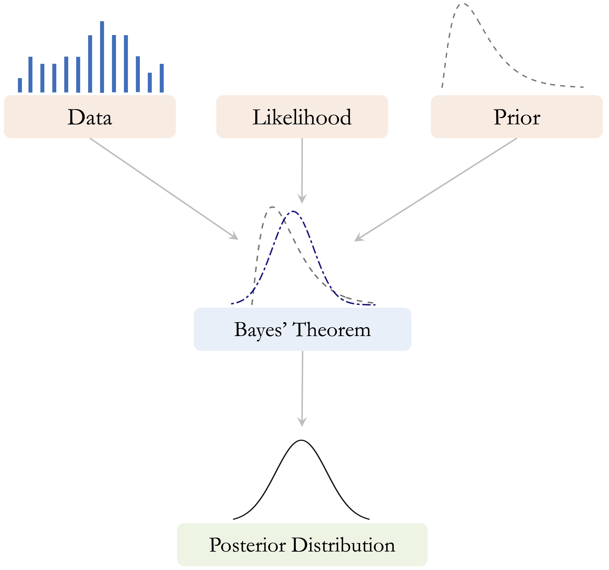
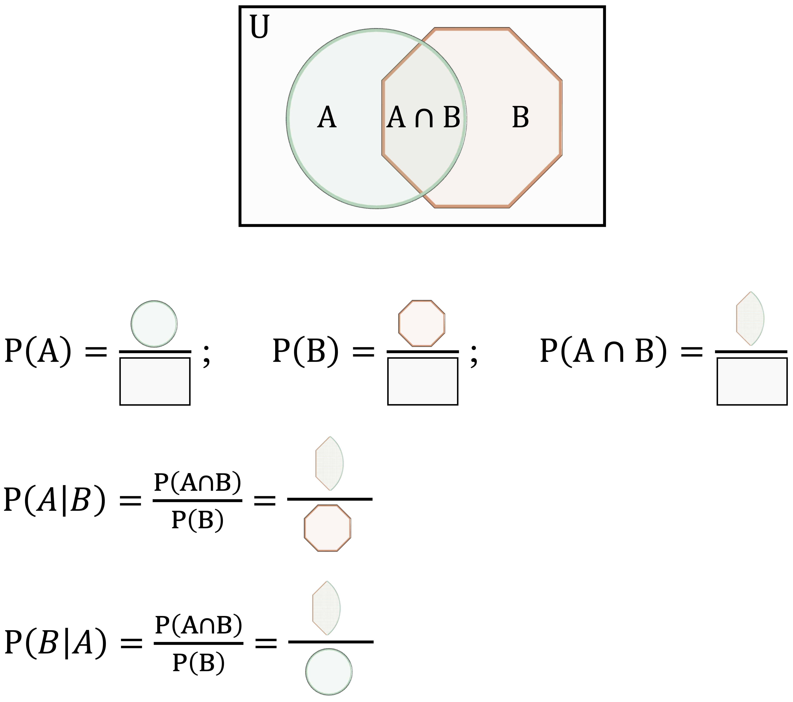

```{r echo=FALSE, message=FALSE, warning=FALSE}
source("_common.R")
```

# Naive Bayes Classifier {#sec-ch9-bayes}

::: {.content-visible when-format="pdf"}
\begin{chapterquote}
The measure of belief is the measure of action.

\hfill — Thomas Bayes
\end{chapterquote}
:::

::::: {.content-visible when-format="html"}
:::: chapterquote
The measure of belief is the measure of action.

::: author
— Thomas Bayes
:::
::::
:::::

How can we make predictions quickly while still accounting for uncertainty in a principled way? Consider a bank that must decide whether to approve a loan application based on information such as education, employment status, income, credit score, and asset values. Decisions of this kind must often be made quickly and consistently, yet they also carry financial consequences. The Naive Bayes classifier provides a simple probabilistic framework for such decisions by estimating class probabilities from observed predictor values.

This chapter introduces Naive Bayes, a probabilistic classifier grounded in Bayes’ theorem. Rather than relying on similarity or distance to nearby observations, Naive Bayes predicts class membership by estimating the probability of each class given the observed predictor values. This probability-based perspective is especially useful when uncertainty must be quantified and when classification thresholds must be adjusted to reflect practical goals. In this sense, Naive Bayes provides a useful complement to the *k*-Nearest Neighbors (kNN) method introduced in Chapter [-@sec-ch7-classification-knn] and can be evaluated using the same tools discussed in Chapter [-@sec-ch8-evaluation], including confusion matrices, ROC curves, and AUC.

A central feature of Naive Bayes is its simplifying assumption that predictors are conditionally independent given the class label. Although this assumption is rarely exactly true in practice, it makes the method computationally efficient and often surprisingly effective, especially in settings with many predictors. For this reason, Naive Bayes has remained a widely used method in applications such as spam filtering, document classification, and financial decision-making.

At the same time, Naive Bayes has important limitations. Strong dependence among predictors can reduce predictive performance, and continuous variables require additional distributional assumptions that may not always fit the data well. Even so, Naive Bayes remains a useful baseline and a practical first model in many classification problems. It is fast to train, straightforward to implement, and easy to interpret through its probability-based predictions. For these reasons, it remains valuable both as an initial modeling choice and as a benchmark against which more complex classifiers can be compared.

### What This Chapter Covers {.unnumbered .unlisted}

This chapter introduces the Naive Bayes classifier as a probabilistic approach to classification that combines conceptual simplicity with practical usefulness. Although the method is especially well known for high-dimensional applications such as text classification, it is also effective in many applied settings where fast, interpretable predictions are needed.

We begin with the probabilistic foundation of the method through Bayes’ theorem and show how probabilities can be updated when new evidence becomes available. We then explain how this idea leads to the Naive Bayes classifier, which predicts class membership by comparing posterior probabilities across classes. Next, we examine the conditional independence assumption that makes the method computationally efficient, discuss why this simplification is both useful and restrictive, and introduce the main variants of Naive Bayes, including Bernoulli, Multinomial, and Gaussian Naive Bayes.

We also consider the zero-frequency problem and show how Laplace smoothing helps make the classifier more stable when certain feature values are rare or absent in the training data. The chapter concludes with an end-to-end case study in R using the `loan` dataset from the **liver** package, where we train, evaluate, and interpret a Naive Bayes classifier within the Data Science Workflow introduced in Chapter [-@sec-ch2-intro-data-science] and illustrated in @fig-ch2_DSW.

## Bayes’ Theorem and Probabilistic Foundations

Naive Bayes is grounded in Bayesian probability, specifically in Bayes’ theorem, which is commonly associated with the 18th-century statistician Thomas Bayes [@bayes1958essay]. Bayes’ theorem provides a formal rule for updating probabilities when new evidence becomes available. This idea lies at the heart of Bayesian inference and continues to play an important role in statistics and machine learning.

A central idea in Bayesian reasoning is that learning proceeds by combining prior beliefs with observed data. The prior represents what is believed before the data are observed, the likelihood describes how probable the observed data are under different values or hypotheses, and the posterior represents the updated belief after the data have been taken into account. Figure [-@fig-bayes-theorem] presents this relationship schematically.

```{r fig-bayes-theorem, echo = FALSE, out.width = "65%", fig.cap = "Conceptual illustration of Bayes’ theorem. Prior beliefs and observed data are combined through the likelihood to produce the posterior distribution."}

```

How should we revise our beliefs when new information is observed? Many real-world decisions must be made under uncertainty, whether we are assessing financial risk, interpreting medical test results, or filtering spam emails. Bayes’ theorem formalizes this updating process by showing how an initial probability can be revised systematically in light of observed evidence. For example, when evaluating a loan application, a bank may begin with a general expectation based on historical data and then refine that assessment after observing information such as education, employment status, income, or credit score.

From this perspective, probability is interpreted not only as a long-run frequency but also as a measure of uncertainty that can be updated when new information becomes available. Bayes’ theorem therefore provides a coherent mathematical framework for learning from evidence. We begin by building intuition for this updating process and then turn to its mathematical form.

### How Does Bayes’ Theorem Work? {.unnumbered .unlisted}

Bayes’ theorem describes how we update an initial probability after observing new evidence. In many practical situations, we do not begin from complete uncertainty. Instead, we start with a general expectation based on what is already known and then revise that expectation when additional information becomes available.

Consider again the example of loan approval. Before examining the details of a specific applicant, a bank may already know the overall proportion of applications that are approved. This provides a starting point. Once further information is observed, such as education level, employment status, income, or credit score, that initial probability can be updated. If the new evidence is associated with a higher chance of approval, the updated probability increases. If it is associated with a lower chance of approval, the updated probability decreases.

This same logic appears in many other settings. In medical testing, the probability that a patient has a condition is updated after a test result is observed. In spam filtering, the probability that an email is spam is revised after certain words or patterns are detected. In each case, the underlying principle is the same: we begin with an existing belief and refine it systematically in light of new evidence.

Bayes’ theorem therefore provides a general framework for learning from data under uncertainty. It allows us to move from a broad population-level expectation to a more specific probability for a subgroup or an individual case. In the next subsection, we express this updating process mathematically and examine how its components can be interpreted in probabilistic terms.

### The Essence of Bayes’ Theorem {.unnumbered .unlisted}

The conceptual idea of Bayesian updating was introduced in Figure [-@fig-bayes-theorem]: we begin with prior beliefs, combine them with observed data through the likelihood, and obtain an updated posterior belief. We now express this same idea mathematically through Bayes’ theorem: \begin{equation}
\label{eq-bayes-theorem}
P(A \mid B) = \frac{P(A \cap B)}{P(B)}.
\end{equation}

This equation describes how the probability of event $A$ is updated after observing event $B$. In this expression, $P(A \mid B)$ denotes the conditional probability of event $A$ given event $B$, $P(A \cap B)$ denotes the joint probability that both events occur, and $P(B)$ denotes the marginal probability of event $B$.

To clarify these components, Figure [-@fig-venn-diagram] presents a visual interpretation using a Venn diagram. The overlapping region represents the joint probability $P(A \cap B)$, while the full area corresponding to event $B$ represents the marginal probability $P(B)$. The ratio of these two quantities gives the conditional probability $P(A \mid B)$.

```{r fig-venn-diagram, echo = FALSE, out.width = "75%", fig.cap = "A Venn diagram illustrating the joint and marginal probabilities involved in Bayes’ theorem."}

```

Bayes’ theorem can also be written in a form that is especially useful for classification. Since the joint probability can be expressed as $P(A \cap B) = P(B \mid A)P(A)$, we obtain: \begin{equation}
\label{eq-bayes-theorem-2}
P(A \mid B) = \frac{P(B \mid A)P(A)}{P(B)}.
\end{equation}

This form makes the logic of Bayesian updating more explicit. The term $P(A)$ represents the prior probability of event $A$, $P(B \mid A)$ measures how likely the observed evidence is if event $A$ is true, and $P(B)$ serves as a normalizing constant. In this interpretation, $P(A \mid B)$ is called the posterior probability because it represents the updated probability of event $A$ after observing event $B$.

To see how Bayes’ theorem works in practice, consider the `loan` dataset from the **liver** package. Suppose we want to estimate the probability that a loan application is `approved` ($A$) given that the applicant has `education = graduate` ($B$). We begin by loading the dataset and constructing a contingency table:

```{r}
library(liver)

data(loan)

addmargins(xtabs(~ loan_status + education, data = loan))
```

```{r include = FALSE}
table_l_e = addmargins(xtabs(~ loan_status + education, data = loan))
```

Let $A$ denote the event that a loan application is `approved`, and let $B$ denote the event that the applicant has `education = graduate`. The prior probability that a loan application is approved is: $$
P(A) = P(\text{approved}) = \frac{\text{Total approved applications}}{\text{Total applications}}
= \frac{`r table_l_e[1, 3]`}{`r table_l_e[3, 3]`}
= `r round(table_l_e[1, 3] / table_l_e[3, 3], 3)`.
$$

Using Bayes’ theorem, the conditional probability that an application is approved given that the applicant is a graduate is: \begin{equation}
\label{eq-bayes-loan-graduate}
\begin{split}
P(\text{approved} \mid \text{graduate})
&= \frac{P(\text{approved} \cap \text{graduate})}{P(\text{graduate})} \\
&= \frac{\text{Number of approved graduate applications}}{\text{Total number of graduate applications}} \\
&= \frac{`r table_l_e[1, 1]`}{`r table_l_e[3, 1]`} \\
&= `r round(table_l_e[1, 1] / table_l_e[3, 1], 3)`.
\end{split}
\end{equation}

This result gives the observed proportion of approved applications among applicants with `education = graduate`. Because this conditional probability (`r round(table_l_e[1, 1] / table_l_e[3, 1], 3)`) is slightly higher than the overall approval probability of `r round(table_l_e[1, 3] / table_l_e[3, 3], 3)`, graduate applicants appear to have a somewhat higher approval rate than the applicant pool as a whole. This comparison remains associative rather than causal: it shows how probabilities differ across observed groups, not why those differences arise.

This example illustrates the central idea of Bayes’ theorem: we begin with an overall probability and update it using additional information about the observed case. In the next section, we build on this probabilistic foundation to show how Bayes’ theorem can be turned into a practical classification algorithm.

> *Practice:* Using the same contingency table, compute the probability that a loan application is `approved` given that the applicant has `education = not-graduate`. How does this probability compare with the value obtained for applicants with `education = graduate`? 

> *Optional Exploration:* A famous example of Bayesian updating is the *Monty Hall problem*, in which a contestant chooses one of three doors, after which the host reveals a losing option and offers the contestant a chance to switch choices. Although many people initially believe that switching does not matter, conditional probability shows that switching increases the probability of winning from $1/3$ to $2/3$. This example illustrates how probabilities can change substantially when new information becomes available.

## The Naive Bayes Classifier

Bayes’ theorem provides a general rule for updating probabilities when new evidence becomes available. In classification problems, this principle can be used to estimate the probability that an observation belongs to a particular class given its observed characteristics. The Naive Bayes classifier applies Bayes’ theorem in exactly this way.

Suppose we observe a set of predictor variables $X_1, X_2, \dots, X_m$ describing an individual case. In the `loan` dataset, for example, these predictors may include variables such as `education`, `income_annum`, `loan_amount`, `loan_term`, and `cibil_score`. Our goal is to estimate the probability that the corresponding loan application belongs to a particular outcome class. In this chapter, the outcome variable is `loan_status`, which takes the values `approved` or `rejected`.

Using Bayes’ theorem, the probability that an observation belongs to class $y$ given the observed predictors can be written as

$$
P(Y = y \mid X_1, \dots, X_m)
=
\frac{P(X_1, \dots, X_m \mid Y = y) P(Y = y)}
{P(X_1, \dots, X_m)}.
$$

This expression combines two key components. The term $P(Y = y)$ represents the prior probability of class $y$, which reflects how common that outcome is in the population. The term $P(X_1, \dots, X_m \mid Y = y)$ represents the likelihood, which measures how probable the observed predictor values are if the observation truly belongs to class $y$. Together, these quantities determine the posterior probability $P(Y = y \mid X_1, \dots, X_m)$.

In classification tasks, we typically compute this posterior probability for each possible class and then assign the observation to the class with the highest probability. This decision rule can be written as

$$
\hat{y}
=
\arg\max_{y}
P(Y = y \mid X_1, \dots, X_m).
$$

In other words, the classifier predicts the class whose posterior probability is largest given the observed predictors.

At first glance, applying Bayes’ theorem in this way may appear straightforward. However, a practical difficulty arises when the number of predictors is large. The likelihood term $P(X_1, \dots, X_m \mid Y = y)$ requires estimating a joint probability distribution over all predictors simultaneously. In many datasets, including the `loan` dataset used in this chapter, estimating such high-dimensional joint distributions directly is difficult because many combinations of predictor values occur rarely or may not appear in the training data at all.

The Naive Bayes classifier addresses this challenge by introducing a simplifying assumption about the predictors. Instead of modeling their full joint distribution, the method assumes that predictors are conditionally independent given the class label. This assumption greatly simplifies the probability calculations and allows the classifier to scale efficiently to problems with many predictors. In the next section, we examine this assumption more closely and explain why it gives the method the name *Naive Bayes*.

## Why Is It Called “Naive”? {#sec-ch9-naive}

The label *naive* refers to the key simplifying assumption behind the classifier: it treats predictors as conditionally independent given the class label. This means that once the outcome is known, the model assumes that the predictors no longer provide information about one another. Although this assumption is rarely exactly true in real-world data, it makes the probability calculations much simpler and is the main reason the method is computationally efficient.

To see why this matters, consider again the `loan` dataset used later in the case study of this chapter (Section [-@sec-ch9-case-study]). It contains demographic and financial variables such as `education`, `self_employed`, `income_annum`, `loan_amount`, `loan_term`, `cibil_score`, and several asset-related measures. In practice, many of these predictors are likely to be related. Applicants with higher annual income may also hold more valuable assets, and credit score may be associated with loan amount or repayment capacity. Even so, Naive Bayes assumes that these predictors contribute separately to the classification once the outcome variable `loan_status` is known.

Suppose we want to estimate the probability that an application belongs to class $y_1$ given predictor values $X_1, \dots, X_{11}$. From Bayes’ theorem, we write $$
P(Y = y_1 \mid X_1, \dots, X_{11})
=
\frac{P(Y = y_1) \times P(X_1, \dots, X_{11} \mid Y = y_1)}
{P(X_1, \dots, X_{11})}.
$$

The main challenge lies in estimating the likelihood term $P(X_1, \dots, X_{11} \mid Y = y_1)$. When the number of predictors is large, directly estimating this full joint conditional distribution becomes difficult because many combinations of predictor values occur rarely or may not appear in the training data at all.

Naive Bayes simplifies this problem by assuming conditional independence, so that $$
P(X_1, \dots, X_{11} \mid Y = y_1)
=
P(X_1 \mid Y = y_1) \times \cdots \times P(X_{11} \mid Y = y_1).
$$

This factorization replaces one complex probability with a product of simpler conditional probabilities. As a result, the classifier becomes much easier to estimate and can be applied efficiently even when the number of predictors is large.

Of course, this assumption is often unrealistic. In the `loan` dataset, variables such as `income_annum`, `residential_assets_value`, and `bank_asset_value` are likely to be related, even within the groups of approved and rejected applications. For this reason, the Naive Bayes model should not be understood as a perfect description of reality. Rather, it is a practical approximation that trades realism for simplicity and speed.

Despite this simplification, Naive Bayes often performs surprisingly well in practice. When predictor dependencies are not too strong, or when a fast and interpretable baseline model is needed, the method can still provide useful predictions. This helps explain why Naive Bayes remains popular in applications such as text classification, spam detection, and credit-related decision-making.

The conditional independence assumption is therefore both the source of the method’s strength and its main limitation. It makes probabilistic classification manageable, but it may also reduce predictive accuracy when strong relationships among predictors are essential for distinguishing between classes. In the next section, we examine how this general framework is adapted to different types of predictors.

## Types of Naive Bayes Classifiers {#sec-ch9-types}

Not all predictors behave in the same way. Some are binary, some are categorical with several levels, and others are continuous. As a result, applying Naive Bayes requires us to make distributional assumptions that match the nature of the predictors. This is why several variants of the Naive Bayes classifier have been developed. The three most common are Bernoulli Naive Bayes, Multinomial Naive Bayes, and Gaussian Naive Bayes.

*Bernoulli Naive Bayes* is designed for binary predictors that record the presence or absence of a characteristic. This variant is common in text classification when features indicate whether a word appears in a document, rather than how often it appears. In the `loan` dataset, a binary variable such as `self_employed` provides a simple example of the kind of predictor that fits this setting.

*Multinomial Naive Bayes* is primarily used for count data, especially when predictors represent frequencies across categories. It is widely applied in text classification, where predictors record the number of times words appear in a document. This variant models the predictor vector using a multinomial distribution and is especially useful when counts, rather than simple presence or absence, carry meaningful information.

*Gaussian Naive Bayes* is used for continuous predictors that are assumed to follow a normal distribution within each class. Instead of working with discrete counts or binary indicators, it models class-conditional feature values using Gaussian densities. In the `loan` dataset, variables such as `income_annum`, `loan_amount`, `cibil_score`, and the asset-related measures are examples of predictors that are naturally handled in this way.

Choosing an appropriate variant helps align the probability model with the structure of the data. In practice, some software implementations can accommodate mixed predictor types by applying different assumptions to different variables within the same Naive Bayes framework. In this chapter, the **naivebayes** package allows us to work with the mix of categorical and continuous predictors in the `loan` dataset within a single modeling framework.

The names *Bernoulli* and *Gaussian* refer to well-known probability distributions associated with Jacob Bernoulli and Carl Friedrich Gauss. These distributions provide the mathematical foundation for the corresponding Naive Bayes variants. In the next section, we examine a practical issue that can arise across Naive Bayes models: what happens when a predictor value is not observed in the training data for one of the classes.

## The Laplace Smoothing Technique {#sec-ch9-laplace}

A practical difficulty in Naive Bayes classification arises when a predictor value appears in the test data but was never observed in the training data for one of the classes. In that case, the estimated conditional probability of that predictor value within the class becomes zero. Because Naive Bayes multiplies conditional probabilities across predictors, a single zero is enough to force the entire product to zero, regardless of how strongly the remaining predictors support that class.

This issue is known as the *zero-frequency problem*. It occurs because Naive Bayes often estimates conditional probabilities directly from observed counts in the training data. If a category is absent for a particular class, its estimated class-conditional probability is zero. To address this problem, we use *Laplace smoothing* (also called *add-one smoothing*). Named after Pierre-Simon Laplace, this technique assigns a small non-zero probability to every possible feature-class combination, even when some combinations are not observed in the training data.

To illustrate the idea, consider the variable `self_employed` in the `loan` dataset. Suppose that in a subset of the data, no rejected loan applications are associated with `self_employed = no`. For illustration, we can construct such a subset as follows:

```{r, echo = FALSE}
subset_loan = loan[(loan$self_employed != "no") | (loan$loan_status != "rejected"), ]

xtabs(~ loan_status + self_employed, data = subset_loan[c(1:10, 100:190), ])
```

Without smoothing, the estimated conditional probability is $$
P(\text{no} \mid \text{rejected})
= \frac{P(\text{no} \cap \text{rejected})}{P(\text{rejected})}
= \frac{0}{35}
= 0.
$$ Here, `no` refers to `self_employed = no`, and `rejected` refers to `loan_status = rejected`. If this zero enters the Naive Bayes calculation, the contribution of the `rejected` class becomes zero before the posterior probabilities are normalized. In effect, the model rules out the `rejected` class entirely for any observation with `self_employed = no`, even if the other predictor values strongly suggest rejection.

Laplace smoothing avoids this problem by adding a small constant $k$ (typically $k = 1$) to each count. The smoothed estimate becomes $$
P(\text{no} \mid \text{rejected})
= \frac{\text{count}(\text{no} \cap \text{rejected}) + k}
{\text{count}(\text{rejected}) + mk},
$$ where $m$ is the number of possible categories of `self_employed`. In this example, $m = 2$ because the variable has two categories: `yes` and `no`. This adjustment ensures that every feature value receives a non-zero probability within each class, even if it was not observed in the training data.

In R, Laplace smoothing can be applied through the `laplace` argument in the **naivebayes** package, where `laplace = 1` corresponds to add-one smoothing. Although $k = 1$ is a common default, the smoothing value can be adjusted if needed. By preventing zero probabilities, Laplace smoothing makes the classifier more stable and reliable in practice, especially when some classes are small or certain predictor values are rare. With these building blocks in place, we are now ready to apply Naive Bayes to a complete classification problem using the `loan` dataset.

## Case Study: Predicting Loan Approval with Naive Bayes {#sec-ch9-case-study}

How can a bank decide whether to approve or reject a loan application before extending credit? This question lies at the core of financial risk assessment, where each lending decision involves balancing business opportunity against the risk of loss. Accurate predictions can support more consistent decision-making, responsible lending, and effective risk management.

In this case study, we apply the Naive Bayes classifier to predict whether a loan application will be `approved` or `rejected` using the `loan` dataset from the **liver** package in R. The dataset contains financial and demographic variables commonly used in lending decisions, making it a suitable setting for illustrating probability-based classification in practice.

We follow the *Data Science Workflow* introduced in Chapter [-@sec-ch2-intro-data-science] and illustrated in @fig-ch2_DSW. The analysis also builds on the data setup for modeling discussed in Chapter [-@sec-ch7-classification-knn] and the evaluation tools introduced in Chapter [-@sec-ch8-evaluation]. By moving step by step from problem understanding and data understanding to model training, evaluation, and interpretation, this case study shows how Naive Bayes can support systematic and data-driven loan approval decisions.

### Problem Understanding {.unnumbered .unlisted}

Loan approval is a high-stakes decision for financial institutions. Approving an application that later turns out to be risky can lead to financial loss, while rejecting an application that could have been safely approved may result in missed business opportunities and reduced access to credit for potentially reliable borrowers. For this reason, lending decisions must balance caution with fairness and consistency.

In practice, banks rely on information available at the time of application, such as education, employment status, income, credit score, loan amount, and asset values, to assess whether an application should be `approved` or `rejected`. This makes loan approval a natural binary classification problem, where the goal is to use observed applicant characteristics to predict the likely decision outcome.

Our objective is to develop a Naive Bayes model that predicts whether a loan application will be `approved` or `rejected` using the variables available in the `loan` dataset. In addition to producing class labels, the model estimates the probability of each outcome. These probability-based predictions are especially valuable in lending because they allow decisions to be adjusted to institutional priorities, such as being more cautious in risky cases or more inclusive when uncertainty is lower.

### Data Understanding {.unnumbered .unlisted}

Before training the Naive Bayes classifier, we briefly examine the data to understand its structure and confirm that it is suitable for modeling. At this stage, the goal is not to conduct a full exploratory analysis, but rather to identify the variables available for prediction, verify their types, and check for basic data-quality issues. The dataset contains `r nrow(loan)` observations and `r ncol(loan)` variables, including one outcome variable and multiple predictors.

To inspect the structure of the dataset and the variable types, we begin with:

```{r}
str(loan)
```

The `loan` dataset contains financial and demographic information relevant to loan approval decisions. Because it combines categorical and continuous predictors in a binary classification setting, it provides a useful example for illustrating how Naive Bayes can be applied to lending-related problems. The dataset also includes `loan_id`, which serves only as an identifier and is therefore excluded from the analysis.

The outcome variable is `loan_status`, which indicates whether an application was `approved` or `rejected`. The predictors include applicant characteristics such as `no_of_dependents`, `education`, and `self_employed`; loan-related information such as `income_annum`, `loan_amount`, `loan_term`, and `cibil_score`; and asset-related measures such as `residential_assets_value`, `commercial_assets_value`, `luxury_assets_value`, and `bank_asset_value`.

To obtain a concise overview of the variables and check for missing values or obvious anomalies, we then examine the summary statistics:

```{r}
summary(loan)
```

These outputs indicate that the dataset is well structured and suitable for modeling. No obvious missing-value problems or major irregularities are visible in the variables used here, so we proceed to data setup and model training without additional preprocessing.

> *Practice:* Inspect the output of `summary(loan)` and identify which variables are categorical and which are numerical. Which predictors appear to have especially wide ranges, and how might that matter for other classification methods such as kNN?

### Data Understanding {.unnumbered .unlisted}

Before training the Naive Bayes classifier, we briefly examine the data to understand its structure and confirm that it is suitable for modeling. At this stage, the goal is not to conduct a full exploratory analysis, but rather to identify the variables available for prediction, verify their types, and check for basic data-quality issues. The dataset contains `r nrow(loan)` observations and `r ncol(loan)` variables, including one outcome variable and multiple predictors.

To inspect the structure of the dataset and the variable types, we begin with:

```{r}
str(loan)
```

The `loan` dataset contains financial and demographic information relevant to loan approval decisions. Because it combines categorical and continuous predictors in a binary classification setting, it provides a useful example for illustrating how Naive Bayes can be applied to lending-related problems. The dataset also includes `loan_id`, which serves only as an identifier and is therefore excluded from the analysis.

The predictors used in this analysis are `no_of_dependents` (number of dependents), `education` (education level), `self_employed` (whether the applicant is self-employed), `income_annum` (annual income), `loan_amount` (requested loan amount), `loan_term` (loan duration), `cibil_score` (credit score), `residential_assets_value` (value of residential assets), `commercial_assets_value` (value of commercial assets), `luxury_assets_value` (value of luxury assets), and `bank_asset_value` (value of bank-held assets). The outcome variable is `loan_status`, which indicates whether an application was `approved` or `rejected`.

To obtain a concise numerical overview and check for missing values or obvious anomalies, we then examine the summary statistics:

```{r}
summary(loan)
```

> *Practice:* Inspect the output of `summary(loan)` and identify which variables are categorical and which are numerical. Which predictors appear to have especially wide ranges, and how might that matter for other classification methods such as kNN?

These outputs indicate that the dataset is well structured and suitable for modeling. No obvious missing-value problems or major irregularities are visible in the variables used here, so we proceed to data setup and model training without additional preprocessing.

### Data Setup for Modeling {.unnumbered .unlisted}

Before training the Naive Bayes classifier, we partition the dataset into training and test sets so that we can evaluate how well the model generalizes to unseen data. We use an 80/20 split, with 80% of the observations assigned to the training set and 20% to the test set. To remain consistent with earlier chapters, we use the `partition()` function from the **liver** package:

```{r}
set.seed(42)

splits = partition(data = loan, ratio = c(0.8, 0.2))

train_set = splits$part1
test_set  = splits$part2

test_labels = test_set$loan_status
```

Setting `set.seed(42)` ensures that the same random partition is obtained each time the code is run. The training set is used to estimate the Naive Bayes model, while the test set is reserved for evaluating predictive performance on unseen data. The vector `test_labels` stores the true class labels for the observations in the test set.

As discussed in Section [-@sec-ch6-cross-validation], it is good practice to check whether the training and test sets remain reasonably comparable after partitioning, especially with respect to the outcome variable. In this chapter, we proceed directly to modeling, but this validation step is recommended in applied work.

> *Practice:* Verify whether the class distribution of `loan_status` remains similar across the training and test sets. You may do this by comparing the proportion of approved applications in the two sets using a two-sample proportion test.

Unlike distance-based methods such as *k*-Nearest Neighbors, Naive Bayes does not rely on geometric distance calculations. As a result, there is no need to scale numerical variables such as `income_annum`, `loan_amount`, or `cibil_score`, nor is it necessary to convert categorical variables such as `education` and `self_employed` into dummy variables. Naive Bayes models class-conditional distributions directly and can therefore handle mixed predictor types without these additional transformations. This contrasts with methods such as kNN, for which scaling and encoding are essential parts of data preparation.

### Applying the Naive Bayes Classifier {.unnumbered .unlisted}

With the dataset partitioned, we now train the Naive Bayes classifier. This model is well suited to loan approval classification because it is computationally efficient, interpretable, and able to handle a mix of categorical and numerical predictors.

Several R packages implement Naive Bayes, including **naivebayes** and **e1071**. In this case study, we use the **naivebayes** package, which provides a flexible implementation for classification with mixed predictor types. During training, the `naive_bayes()` function estimates the class-conditional distributions required for prediction and stores the results in a model object.

Unlike instance-based methods such as *k*-Nearest Neighbors (see Chapter [-@sec-ch7-classification-knn]), Naive Bayes has an explicit training stage followed by a prediction stage. During training, the model estimates the distribution of each predictor within each class. During prediction, these estimates are combined using Bayes’ theorem to compute posterior class probabilities for new observations.

To train the model, we specify a formula in which `loan_status` is the outcome variable and all remaining variables, except `loan_id`, are used as predictors:

```{r}
formula <- loan_status ~ . - loan_id
```

We then fit the model using the `naive_bayes()` function:

```{r}
library(naivebayes)

nb_model = naive_bayes(formula, data = train_set)
```

The function automatically determines how to model each predictor based on its type. Categorical variables such as `education` and `self_employed` are represented through class-conditional probabilities, whereas numerical variables such as `income_annum`, `loan_amount`, `cibil_score`, and the asset-related variables are modeled using Gaussian distributions by default.

To inspect the fitted model, we can examine a summary of its estimated parameters:

```{r}
summary(nb_model)
```

This output reports the estimated means and standard deviations for numerical predictors, together with the conditional probabilities for categorical predictors. These estimates form the basis of the posterior probability calculations used for classification. For a more detailed view, we can print the full model object using `print(nb_model)`, although the resulting output can be quite extensive.

> *Practice:* Split the `loan` dataset into 70% training data and 30% test data, then fit a Naive Bayes classifier following the same steps as in this subsection. Inspect the fitted model using `print(nb_model)` and compare the estimated distributions with those obtained from the 80%–20% split. What differences, if any, do you observe?

### Prediction and Model Evaluation {.unnumbered .unlisted}

With the Naive Bayes classifier trained, we now apply it to the test set and evaluate its predictive performance. We begin by examining the predicted class probabilities returned by the model and then assess classification quality using two complementary approaches: a confusion matrix at a fixed threshold and threshold-independent evaluation based on the ROC curve and AUC.

To obtain posterior probabilities for each class, we use the `predict()` function from the **naivebayes** package and set `type = "prob"` so that the model returns probabilities rather than hard class assignments:

```{r}
prob_naive_bayes = predict(nb_model, test_set, type = "prob")
```

To inspect the output, we display the first six rows and round the probabilities to three decimal places:

```{r}
round(head(prob_naive_bayes, n = 6), 3)
```

The resulting matrix contains one column for each possible outcome. The first column reports the estimated probability of `approved`, and the second reports the probability of `rejected`. These probabilities provide more information than a single predicted label because they indicate how strongly the model favors one class over the other. For example, an application with a very high predicted probability of `rejected` is classified with greater confidence than one with probabilities close to 0.5.

> *Practice:* Inspect the predicted probabilities in `prob_naive_bayes`. Identify one application that is assigned a high probability of `rejected` and one application with a predicted probability close to 0.5. How would your confidence in the classification differ in these two cases, and why?

Importantly, Naive Bayes does not require a fixed decision threshold. Instead, posterior probabilities can be converted into class predictions using a threshold chosen to reflect specific practical goals, such as being more cautious when rejecting applications or more inclusive when approving them. In the next subsection, we translate these probabilities into class labels and evaluate model performance using a confusion matrix and additional metrics introduced in Chapter [-@sec-ch8-evaluation].

#### Confusion Matrix {.unnumbered .unlisted}

To evaluate the classification performance of the Naive Bayes model, we compute a confusion matrix using the `conf.mat()` and `conf.mat.plot()` functions from the **liver** package:

```{r, out.width = "30%"}
# Extract probability of "approved"
prob_naive_bayes = prob_naive_bayes[, "approved"] 

conf.mat(prob_naive_bayes, test_labels, cutoff = 0.5, reference = "approved")

conf.mat.plot(prob_naive_bayes, test_labels, cutoff = 0.5, reference = "approved")
```

Here, we use a decision threshold of 0.5, classifying an application as `approved` if its predicted probability of approval exceeds 50%. This threshold is a modeling choice rather than a fixed property of the algorithm. The reference class is set to `approved`, meaning that performance measures such as sensitivity and precision are computed with respect to correctly identifying approved applications.

The confusion matrix compares the predicted class labels with the observed outcomes, separating correct classifications from different types of errors. In this setting, the matrix shows how often the model correctly identifies approved and rejected applications, as well as how often it makes false approvals or false rejections. These distinctions are important in lending, because the practical consequences of approving a risky application differ from those of rejecting an application that might otherwise have been accepted.

> *Practice:* Explore how changing the classification threshold affects model performance. Repeat the analysis using cutoff values such as 0.4 and 0.6, and examine how sensitivity, specificity, and overall accuracy change. What trade-offs emerge as the threshold is adjusted?

#### ROC Curve and AUC {.unnumbered .unlisted}

To complement the confusion matrix, we evaluate the Naive Bayes classifier using the *Receiver Operating Characteristic (ROC) curve* and the *Area Under the Curve (AUC)*. Unlike the confusion matrix, which summarizes performance at a single decision threshold, ROC analysis evaluates model performance across all possible thresholds and therefore provides a threshold-independent perspective.

```{r}
library(pROC)
library(ggplot2)

roc_naive_bayes = roc(test_labels, prob_naive_bayes)

ggroc(roc_naive_bayes, size = 1) +
    ggtitle("ROC Curve for Naive Bayes")
```

The ROC curve plots the *true positive rate* (sensitivity) against the *false positive rate* ($1 -$ specificity) as the classification threshold varies. Curves that bend closer to the top-left corner indicate stronger discriminative ability, reflecting high sensitivity combined with a low false positive rate.

To summarize this information in a single number, we compute the AUC:

```{r}
round(auc(roc_naive_bayes), 3)
```

The AUC value, `r round(auc(roc_naive_bayes), 3)`, measures the model’s ability to distinguish between approved and rejected applications. It can be interpreted as the probability that a randomly selected approved application receives a higher predicted probability of approval than a randomly selected rejected application. An AUC of 1 corresponds to perfect discrimination, whereas an AUC of 0.5 indicates performance no better than random guessing.

Taken together, the ROC curve and AUC provide a concise and threshold-independent assessment of classification performance. They are especially useful when we want to compare classifiers or evaluate predictive quality without committing to a single cutoff value.

> *Practice:* Using a 70%–30% train–test split, refit the Naive Bayes classifier and report the corresponding ROC curve and AUC value. How do these results compare with those obtained using the 80%–20% split? Briefly comment on any differences you observe.

## Chapter Summary and Takeaways

This chapter introduced the Naive Bayes classifier as an efficient and interpretable approach to probabilistic classification. Grounded in Bayes’ theorem, the method estimates the probability that an observation belongs to a given class by combining prior information with observed predictor values. We first examined the probabilistic foundation of the method through Bayes’ theorem and then showed how this idea leads naturally to a practical classification rule based on posterior probabilities.

We then explained the simplifying assumption that gives Naive Bayes its name: predictors are treated as conditionally independent given the outcome. Although this assumption rarely holds exactly in practice, it greatly reduces computational complexity and often yields useful predictive performance. We also examined three common variants of the method, Bernoulli, Multinomial, and Gaussian Naive Bayes, each suited to different types of predictors, and discussed how Laplace smoothing helps prevent zero probabilities when feature values are rare or absent in the training data.

Through a case study using the `loan` dataset from the **liver** package, we applied Naive Bayes in R to predict whether a loan application would be `approved` or `rejected`. We trained the model, generated predicted probabilities, evaluated performance using confusion matrices, ROC curves, and AUC, and interpreted the results in the context of threshold-based decision-making.

A key takeaway from this chapter is that Naive Bayes treats classification as a probabilistic decision problem rather than a purely categorical one. Its conditional independence assumption represents a deliberate trade-off: the model sacrifices flexibility in order to gain computational efficiency, simplicity, and interpretability. As the case study showed, the practical value of Naive Bayes depends not only on predictive performance, but also on how probability thresholds are chosen to reflect the goals and costs of the application domain.

The next chapter introduces *logistic regression*, a discriminative model that approaches classification from a different perspective. Instead of modeling class probabilities through conditional distributions of the predictors, logistic regression models the log-odds of class membership directly. This provides a useful complement to Naive Bayes, particularly when the effects of individual predictors and the interpretation of model coefficients are of central interest.


## Exercises {#sec-ch9-exercises}

The following exercises strengthen your understanding of Naive Bayes as a probabilistic classification method. They begin with conceptual questions on Bayesian reasoning, conditional independence, classifier variants, Laplace smoothing, and threshold-based evaluation. The hands-on exercises then apply these ideas to the `purchase_intention` and `bank` datasets from the **liver** package.

#### Conceptual Questions {.unnumbered .unlisted}

1. Why is Naive Bayes considered a probabilistic classification model?

2. What is the difference between prior probability, likelihood, and posterior probability in Bayes’ theorem?

3. What does it mean that Naive Bayes assumes predictors are conditionally independent given the class label?

4. Why does the conditional independence assumption make Naive Bayes computationally efficient?

5. In which situations can the conditional independence assumption become problematic? Provide an example.

6. What are the main strengths and limitations of Naive Bayes as a classification method?

7. How does Laplace smoothing prevent zero probabilities in Naive Bayes? 

8. When should Bernoulli, Multinomial, or Gaussian Naive Bayes be used? 

9. How does Gaussian Naive Bayes handle continuous predictors?

10. Compare Naive Bayes with *k*-Nearest Neighbors (Chapter [-@sec-ch7-classification-knn]). How do their assumptions and prediction mechanisms differ?

11. How does changing the probability threshold affect predicted class labels and evaluation metrics?

12. Why might domain knowledge be useful when selecting predictors, interpreting probabilities, or choosing a classification threshold?

#### Hands-On Practice: Naive Bayes with the `purchase_intention` Dataset {.unnumbered .unlisted}

The `purchase_intention` dataset from the **liver** package contains information about online browsing sessions. The goal is to predict whether a visitor completes a purchase using Naive Bayes. This dataset is revisited in Chapter [-@sec-ch11-case-study], where we analyze the same prediction problem using logistic regression.

13. Load the `purchase_intention` dataset and inspect its structure.

14. Identify the outcome variable `revenue` and summarize its class distribution.

15. Inspect the predictor variables and distinguish between categorical and numerical predictors.

16. Partition the data into 70% training and 30% test sets using `partition()` from **liver**.

17. Verify that the class distribution of `revenue` is reasonably similar in the training and test sets.

18. Define a Naive Bayes model formula using `revenue` as the response and the suitable remaining variables as predictors, then train the classifier using the **naivebayes** package.

19. Summarize the fitted model and identify how categorical and numerical predictors are represented.

20. Predict class probabilities for the test set and display the first ten predicted probabilities.

21. Generate and visualize a confusion matrix using `conf.mat()` and `conf.mat.plot()` from **liver** with a cutoff of 0.5. Then change the cutoff and describe how the classification results change.

22. Plot the ROC curve and compute the AUC. What does the AUC suggest about the model’s ability to distinguish between purchasers and non-purchasers?

23. Retrain the model with Laplace smoothing (`laplace = 1`) and compare the results with the model fitted without smoothing.

24. Identify two predictors that may be related to each other. Explain how such dependence might affect the Naive Bayes assumption.

#### Hands-On Practice: Naive Bayes with the `bank` Dataset {.unnumbered .unlisted}

The `bank` dataset from the **liver** package contains information from a direct marketing campaign by a banking institution. The goal is to predict whether a client subscribes to a term deposit using Naive Bayes. This dataset is revisited in Chapter [-@sec-ch13-neural-networks], where we analyze the same prediction problem using neural networks.

25. Load the `bank` dataset and inspect its structure.

26. Identify the outcome variable `deposit` and summarize its class distribution.

27. Inspect the predictor variables and distinguish between categorical and numerical predictors.

28. Partition the data into 70% training and 30% test sets using `partition()` from **liver**.

29. Verify that the class distribution of `deposit` is reasonably similar in the training and test sets.

30. Define a Naive Bayes model formula using `deposit` as the response and `age`, `marital`, `default`, `balance`, `housing`, `loan`, `duration`, `campaign`, `pdays`, and `previous` as predictors. Then train the classifier using the **naivebayes** package.

31. Summarize the fitted model and identify how categorical and numerical predictors are represented.

32. Predict class probabilities for the test set and display the first ten predicted probabilities.

33. Generate and visualize a confusion matrix using `conf.mat()` and `conf.mat.plot()` from **liver** with a cutoff of 0.5. Interpret the main types of correct and incorrect classifications.

34. Change the classification cutoff and describe how sensitivity, specificity, and precision change.

35. Plot the ROC curve and compute the AUC. What does the AUC suggest about the model’s ability to distinguish between subscribers and non-subscribers?

36. Based on the model results, discuss how a bank could use predicted subscription probabilities to prioritize clients for a marketing campaign.

#### Critical Thinking and Reflection {.unnumbered .unlisted}

37. In the `loan`, `purchase_intention`, and `bank` examples, how do predicted probabilities provide more information than predicted class labels alone?

38. If false positives and false negatives have different practical costs, how should this influence the choice of classification threshold? Give an example from either loan approval, online purchasing, or term deposit marketing.

39. How might strong relationships among predictors affect the reliability of a Naive Bayes classifier? Give an example using one of the datasets considered in this chapter.

40. When might Naive Bayes be preferable to kNN or logistic regression? Consider interpretability, computation, predictor types, and prediction goals.

41. How could domain knowledge help in selecting predictors, interpreting predicted probabilities, or choosing a decision threshold?

42. Suppose a Naive Bayes model performs well on the test set but poorly on new data collected later. What possible explanations should be investigated?

43. How could Naive Bayes be extended or adapted for a multi-class classification problem?

44. Reflect on how Naive Bayes connects to the broader Data Science Workflow. At which stage does its simplicity provide the greatest advantage, and why?
